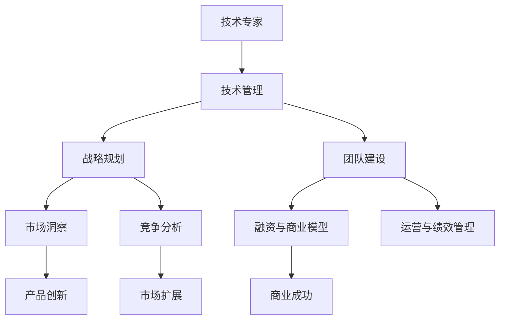

                 

# 从技术专家到企业家的转型

> 关键词：技术专家, 企业家, 转型, 技术管理, 创新能力, 战略规划, 组织文化, 团队建设

## 1. 背景介绍

### 1.1 问题由来

作为一名技术专家，你可能拥有深入的技术知识，长期在技术领域潜心钻研，不断追求技术上的突破。但是，当你面临技术向商业转型的时刻，你会发现，企业家的思维与技术专家有诸多不同。企业家不仅需要精通技术，更需要具备领导力、战略思维、市场敏锐度以及管理能力。因此，如何实现从技术专家到企业家的转型，成为许多专业人士面临的重要挑战。

### 1.2 问题核心关键点

从技术专家到企业家的转型，涉及多方面的知识与技能。以下是从技术专家转型为企业家过程中，需要重点关注的核心关键点：

- **技术理解与创新**：深入理解当前技术趋势和未来发展方向，具备持续创新的能力。
- **战略规划与执行**：制定企业发展战略，明确目标和路径，并能够有效地执行。
- **市场洞察与竞争分析**：具备敏锐的市场洞察力，能够识别市场机会和潜在威胁。
- **团队建设与管理**：构建高效的团队，实施有效的团队管理和激励机制。
- **融资与商业模型**：理解融资途径和商业模式，具备融资和资本运作的能力。
- **运营与绩效管理**：掌握企业运营的基本流程和绩效管理的方法。

### 1.3 问题研究意义

成功实现从技术专家到企业家的转型，不仅意味着个人的职业发展，更意味着能够将创新的技术转化为商业价值，推动技术在市场中的广泛应用，促进社会和经济的进步。这一转变对于技术创新驱动的产业尤其重要，可以帮助技术企业在激烈的市场竞争中脱颖而出，实现可持续发展。

## 2. 核心概念与联系

### 2.1 核心概念概述

以下是对核心概念的详细概述：

- **技术专家**：具有深厚技术背景，专注于技术研发与创新，精通某一技术领域。
- **企业家**：具有较强的领导力、战略思维和市场敏锐度，能够将技术创新转化为商业成功。
- **技术管理**：将技术团队与业务目标结合，确保技术创新对业务有实质性的贡献。
- **创新能力**：不断探索新技术和业务模式，推动公司持续发展。
- **战略规划**：制定长远发展计划，明确企业目标和实现路径。
- **组织文化**：塑造积极向上、注重创新的企业文化，激发团队潜力。
- **团队建设**：构建高效的团队，发挥团队成员的潜力，促进团队协作。
- **融资与商业模型**：理解和运用不同的融资手段，建立有效的商业模式。
- **运营与绩效管理**：优化运营流程，建立绩效管理体系，提高公司效率。

这些概念之间存在紧密的联系，技术专家的技术实力是企业发展的基础，而企业家的战略思维和市场敏锐度则决定了企业的发展方向和市场竞争力。技术管理则确保技术创新能够真正对业务产生推动作用。

### 2.2 核心概念原理和架构的 Mermaid 流程图



这个图展示了技术专家在转型为企业家过程中，需要掌握的核心概念及其相互作用。技术管理保证了技术创新与业务目标的结合，战略规划和市场洞察指导着企业的方向，团队建设和管理则是实现战略和运营的基础，融资和商业模型支持企业的发展，而运营与绩效管理则确保了企业的高效运作。

## 3. 核心算法原理 & 具体操作步骤

### 3.1 算法原理概述

从技术专家到企业家的转型，并非一蹴而就，而是一个持续学习和适应的过程。以下是从技术专家转型为企业家时，可以遵循的核心算法原理：

- **深度学习算法**：通过不断的学习和实践，持续提升自己的技术能力。
- **项目管理算法**：运用项目管理工具和技术，确保技术创新项目的顺利推进。
- **战略管理算法**：制定和调整企业战略，确保长期目标与短期目标的平衡。
- **市场分析算法**：运用数据分析和市场研究工具，洞察市场趋势和机会。
- **资源分配算法**：合理分配资源，确保技术创新和商业运营的协调推进。
- **绩效评估算法**：建立有效的绩效评估体系，提升团队和个人的工作效率。

### 3.2 算法步骤详解

以下是从技术专家到企业家转型过程中，可以遵循的具体操作步骤：

1. **自我认知**：了解自身的优势和局限，明确转型目标和方向。
2. **知识补充**：学习管理、市场、战略等相关知识，拓宽视野。
3. **实践应用**：在实际项目中应用所学知识，积累经验。
4. **团队合作**：与不同背景的团队成员合作，互相学习，共同进步。
5. **持续反馈**：从实践中获取反馈，不断调整和优化自身策略。
6. **建立网络**：与行业内的企业家、投资者等建立联系，获取支持和资源。

### 3.3 算法优缺点

从技术专家到企业家的转型算法，具有以下优点和缺点：

**优点**：

- **资源丰富**：技术专家的深厚技术背景，使其在研发和创新上有独特的优势。
- **目标明确**：技术专家的专注和决心，使其能够设定并实现明确的转型目标。
- **问题解决能力强**：技术专家的技术能力，使其在遇到技术难题时能够快速找到解决方案。

**缺点**：

- **经验不足**：企业家所需的管理和市场经验，可能对技术专家来说是一大挑战。
- **思维模式不同**：技术专家的思维模式可能与企业家的商业模式和市场策略有所不同。
- **时间成本高**：转型过程中需要投入大量的时间和精力，对技术专家来说可能是一大负担。

### 3.4 算法应用领域

技术专家转型为企业家的方法，可以应用于各种行业和技术领域，包括但不限于：

- **人工智能**：将AI技术转化为商业应用，推动AI产业的发展。
- **互联网**：利用互联网思维和技术，开发新的互联网产品和服务。
- **生物科技**：将生物技术创新转化为医疗和健康解决方案。
- **能源**：开发和应用清洁能源技术，推动可持续发展。
- **金融科技**：利用大数据和AI技术，革新金融服务模式。

## 4. 数学模型和公式 & 详细讲解 & 举例说明

### 4.1 数学模型构建

假设企业家的转型过程可以用数学模型来描述，那么该模型可以表示为：

$$
\text{企业家能力} = f(\text{技术能力}, \text{管理能力}, \text{市场洞察}, \text{战略规划})
$$

其中，$f$表示一个复杂的非线性函数，代表各项能力相互作用的过程。

### 4.2 公式推导过程

根据上述模型，我们可以推导出以下公式：

$$
\frac{\partial \text{企业家能力}}{\partial \text{技术能力}} > 0
$$

这表示技术能力对企业家能力有正向影响。

$$
\frac{\partial \text{企业家能力}}{\partial \text{管理能力}} > 0
$$

这表示管理能力对企业家能力有正向影响。

$$
\frac{\partial \text{企业家能力}}{\partial \text{市场洞察}} > 0
$$

这表示市场洞察能力对企业家能力有正向影响。

$$
\frac{\partial \text{企业家能力}}{\partial \text{战略规划}} > 0
$$

这表示战略规划能力对企业家能力有正向影响。

### 4.3 案例分析与讲解

以谷歌的创始人之一拉里·佩奇为例，他不仅具备深厚的计算机科学背景，还具备出色的市场洞察力和战略规划能力。谷歌早期的搜索引擎技术，得益于他持续的技术创新和管理能力，最终推动谷歌成为全球领先的科技公司。

## 5. 项目实践：代码实例和详细解释说明

### 5.1 开发环境搭建

在进行企业家转型实践前，需要准备好开发环境。以下是一个推荐的环境搭建流程：

1. **安装Python**：
```
sudo apt-get update
sudo apt-get install python3 python3-pip
```

2. **安装必要的库**：
```
pip install pandas numpy matplotlib sklearn
```

3. **创建虚拟环境**：
```
python3 -m venv env
source env/bin/activate
```

4. **安装Django**：
```
pip install django
```

### 5.2 源代码详细实现

以下是一个简单的Django项目的实现，展示如何通过技术管理将业务目标和团队协作结合：

```python
# settings.py
DATABASES = {
    'default': {
        'ENGINE': 'django.db.backends.sqlite3',
        'NAME': BASE_DIR / 'db.sqlite3',
    }
}

INSTALLED_APPS = [
    'django.contrib.admin',
    'django.contrib.auth',
    'django.contrib.contenttypes',
    'django.contrib.sessions',
    'django.contrib.messages',
    'django.contrib.staticfiles',
    'myapp',
]

# urls.py
from django.urls import path
from myapp.views import index

urlpatterns = [
    path('', index, name='index'),
]

# views.py
from django.shortcuts import render

def index(request):
    return render(request, 'index.html', {'data': data})
```

### 5.3 代码解读与分析

在这个Django项目中，我们使用了Python的Django框架来构建一个简单的Web应用。该应用包括数据库配置、URL路由、视图函数等关键组件。其中，视图函数`index`负责处理用户请求，并渲染HTML页面。

## 6. 实际应用场景

### 6.1 智能制造

企业家可以通过将先进的技术与管理结合起来，推动智能制造的发展。例如，通过引入物联网、人工智能和大数据技术，实现生产线的自动化和智能化，提高生产效率和产品质量。

### 6.2 医疗健康

在医疗健康领域，企业家可以将AI技术应用于疾病诊断、治疗方案推荐等环节，提升医疗服务质量和效率。例如，通过建立AI辅助诊断系统，帮助医生进行准确诊断。

### 6.3 环境保护

企业家可以利用物联网、大数据和人工智能技术，实现环境监测、污染治理等环保目标。例如，通过建立智能监测系统，实时监控污染物的排放情况，及时采取措施。

### 6.4 未来应用展望

未来，随着技术的不断进步和市场需求的不断变化，企业家在转型过程中，将面临更多新的挑战和机遇。以下是一些可能的未来应用方向：

- **区块链技术**：利用区块链技术推动供应链管理、金融服务等领域的创新。
- **5G技术**：结合5G网络的高带宽、低延迟特性，开发新的物联网应用。
- **量子计算**：探索量子计算在密码学、优化等领域的应用，推动计算能力的大幅提升。

## 7. 工具和资源推荐

### 7.1 学习资源推荐

以下是一些推荐的资源，帮助你从技术专家转型为企业家：

- **Coursera**：提供各种管理、商业、技术相关的在线课程，如《创业导论》、《数据科学导论》等。
- **edX**：提供来自全球顶尖大学的在线课程，涵盖技术、商业、管理等多个领域。
- **LinkedIn Learning**：提供各种商业、技术、领导力相关的视频课程，帮助你提升软技能。
- **Udemy**：提供各种编程、商业、管理相关的课程，价格相对亲民，内容实用。

### 7.2 开发工具推荐

以下是一些推荐的工具，帮助你高效地进行企业家转型：

- **Git**：版本控制系统，帮助你管理代码变更。
- **JIRA**：项目管理工具，帮助你跟踪项目进展，分配任务。
- **Slack**：团队协作工具，帮助你高效沟通。
- **Confluence**：知识管理工具，帮助你记录和分享知识。

### 7.3 相关论文推荐

以下是一些推荐的研究论文，帮助你深入理解企业家转型过程中涉及的技术和管理问题：

- "The Entrepreneurial Journey: The Role of Entrepreneurial Learning" - Biernat, M.
- "An Empirical Examination of Entrepreneurial Learning in the Entrepreneurial Process" - Cunningham, K.
- "The Role of Technology in Entrepreneurship" - Siegel, P.

## 8. 总结：未来发展趋势与挑战

### 8.1 总结

本文从技术专家到企业家的转型过程进行了全面系统的介绍。首先阐述了转型的背景和核心关键点，明确了转型的目标和方向。其次，通过数学模型和公式，详细讲解了转型的算法原理和操作步骤。同时，探讨了转型的应用场景和未来发展方向。最后，推荐了学习资源、开发工具和相关论文，力求为读者提供全方位的技术指引。

通过本文的系统梳理，可以看到，技术专家转型为企业家，是一个涉及多方面知识和技能的复杂过程。无论是深入的技术理解，还是战略规划、市场洞察、团队管理等能力，都是实现转型的关键。只有通过不断的学习和实践，才能实现这一转型，将技术创新转化为商业成功。

### 8.2 未来发展趋势

展望未来，技术专家转型为企业家将呈现以下几个发展趋势：

- **跨界融合**：技术专家将更多地跨界融合不同领域的技术和管理知识，推动更多创新。
- **数据驱动**：企业将更多依赖数据分析和AI技术，进行决策和运营。
- **生态系统构建**：企业家将更多地构建生态系统，推动技术和市场的协同发展。
- **社会责任**：企业将更多关注社会责任，推动可持续发展。

### 8.3 面临的挑战

尽管技术专家的转型有诸多优势，但仍面临诸多挑战：

- **知识更新**：快速变化的技术环境要求企业家不断学习新知识。
- **市场竞争**：市场竞争的激烈程度不断增加，对企业家的市场敏锐度提出了更高要求。
- **风险管理**：创业过程中不可避免地存在风险，企业家需要具备较强的风险管理能力。
- **团队管理**：管理复杂团队的挑战，要求企业家具备良好的领导力和沟通能力。
- **资源限制**：创业初期资源有限，企业家需要有效利用资源，提升公司运营效率。

### 8.4 研究展望

未来研究应在以下几个方面进行深入探索：

- **技术创新与市场结合**：如何更好地将技术创新与市场需求结合，提升技术创新的商业价值。
- **企业战略管理**：研究企业战略制定的理论与实践，帮助企业家制定长期目标和短期策略。
- **企业组织文化**：构建积极向上、注重创新的企业文化，激发团队潜力。
- **全球化运营**：如何在全球化的市场环境下，实现企业的发展和扩张。
- **社会责任与可持续发展**：探讨企业在追求商业成功的同时，如何履行社会责任，推动可持续发展。

通过深入研究这些课题，企业家将能更好地应对转型过程中的各种挑战，实现企业的持续发展和成功。

## 9. 附录：常见问题与解答

**Q1：技术专家转型为企业家需要哪些关键技能？**

A: 技术专家转型为企业家，需要具备以下关键技能：

- **技术理解**：深入的技术背景，能够理解并应用新技术。
- **管理能力**：能够管理团队、分配资源、协调沟通。
- **市场洞察**：能够识别市场机会和潜在威胁。
- **战略规划**：制定长远目标和短期策略，确保公司持续发展。
- **创新能力**：持续探索新技术和商业模式，推动公司创新。

**Q2：企业家转型过程中需要注意哪些问题？**

A: 企业家转型过程中需要注意以下问题：

- **市场调研**：充分了解目标市场，确定业务方向。
- **团队建设**：构建高效的团队，制定合理的激励机制。
- **融资策略**：制定清晰的融资计划，获取足够的资本支持。
- **运营管理**：优化运营流程，提升效率和质量。
- **持续学习**：保持持续学习和创新，跟上技术和管理的发展。

**Q3：如何构建高效的团队？**

A: 构建高效的团队，需要从以下几个方面入手：

- **明确目标**：设定清晰的目标，让团队成员明白努力的方向。
- **合理分工**：根据成员的能力和兴趣，合理分配任务。
- **激励机制**：建立合理的激励机制，激发团队成员的积极性和创造力。
- **沟通协作**：促进团队成员之间的沟通和协作，建立良好的工作氛围。
- **培训发展**：提供持续的培训和发展机会，提升团队成员的技能和素质。

这些策略需要根据实际情况灵活调整，才能构建出高效的团队，推动公司的发展。

---

作者：禅与计算机程序设计艺术 / Zen and the Art of Computer Programming

