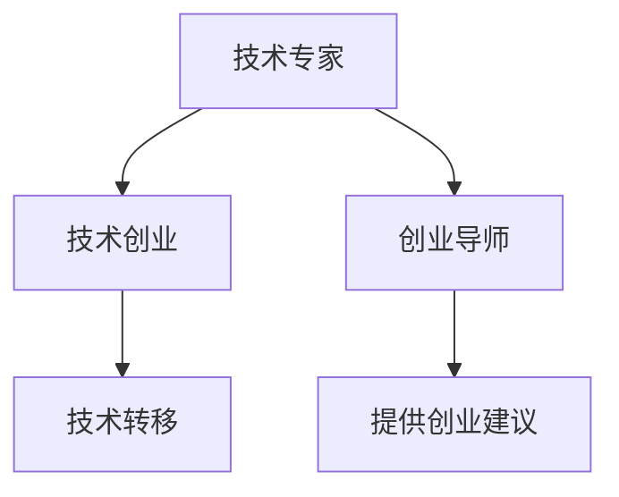

                 

# 从技术专家到创业导师的蜕变

在硅谷这座充满创新与梦想的城市中，有这样一批人，他们既是一线技术专家，也是引领行业趋势的创业导师。他们不仅具备深厚的技术功底，还拥有敏锐的市场嗅觉和卓越的领导力。本文将深入探讨这些技术专家如何在职业生涯中完成从专家到导师的蜕变，并分析这一转变对他们的专业成长和商业发展的意义。

## 1. 背景介绍

### 1.1 技术专家的成长之路

绝大多数技术专家都是在学术或工业界逐步成长起来的。他们通常具备深厚的技术储备和专业的知识体系，对所在领域的核心技术有着深刻的理解和洞见。在职业生涯早期，他们往往专注于技术研究与开发，逐渐积累了丰富的实践经验。

### 1.2 创业的契机

随着技术经验的积累和行业认知的深化，一些技术专家开始关注技术在现实世界中的应用潜力。创业成为了他们将技术成果商业化、解决实际问题的重要途径。

创业不仅意味着技术能力的检验，更是一套综合能力的测试。技术专家在创业过程中，需要面临市场调研、产品设计、团队管理、资金筹措等多重挑战。这一经历将极大地扩展他们的视野和能力，促使他们从技术专家向创业导师转型。

## 2. 核心概念与联系

### 2.1 核心概念概述

本节将介绍几个关键概念及其相互联系：

- **技术专家(Technical Expert)**：在特定技术领域拥有深厚知识和经验的专业人员，能够提供技术上的指导和支持。
- **创业导师(Startup Mentor)**：拥有丰富创业经验和成功案例的行业前辈，能够提供战略、管理和市场方面的建议与指导。
- **技术创业(Tech Startup)**：以创新技术为核心的创业项目，旨在解决特定市场问题，推动技术商业化。
- **技术转移(Technology Transfer)**：将科研成果、技术知识转化为产品或服务，推动技术应用的实践过程。

这些概念通过以下Mermaid流程图展示其关系：



可以看出，技术专家通过技术创业实现技术转移，而创业成功者则成为创业导师，通过经验分享和知识传播，进一步推动技术的发展与应用。

## 3. 核心算法原理 & 具体操作步骤

### 3.1 算法原理概述

技术专家向创业导师的转变，并非一蹴而就。这一过程涉及到技术、市场、管理等多方面的综合提升。以下是这一转变中涉及的算法原理：

- **跨领域学习算法**：技术专家需要跨领域学习，将技术知识与市场知识、管理知识相结合。这包括但不限于市场调研、商业模式、团队管理等领域的知识。
- **迭代实验算法**：创业是一个不断实验和迭代的过程，技术专家通过实际项目的不断尝试，逐步优化商业模式和技术策略。
- **反馈与修正算法**：技术专家在创业过程中，需要持续获取市场和团队的反馈，根据反馈信息不断调整和优化策略。

### 3.2 算法步骤详解

**Step 1: 技术专长的识别与评估**
- 明确自身技术专长和优势领域。
- 评估技术专长对市场的潜在价值和商业机会。

**Step 2: 创业机会的寻找与分析**
- 通过市场调研和用户访谈，寻找技术应用的机会。
- 分析目标市场的规模、竞争态势、用户需求等关键要素。

**Step 3: 产品与业务模型的设计**
- 设计符合市场需求的技术产品或服务。
- 构建具有可行性的商业模型，明确盈利模式和运营策略。

**Step 4: 团队与资源的整合**
- 组建一支有能力的创业团队，明确各成员的角色和职责。
- 整合资源，包括资金、技术、市场渠道等，确保项目顺利进行。

**Step 5: 产品原型与市场验证**
- 开发产品原型，进行小规模的测试和反馈收集。
- 根据反馈进行产品迭代和优化，验证商业模式。

**Step 6: 规模化与市场拓展**
- 制定产品规模化生产的策略和计划。
- 开拓市场渠道，提升品牌影响力和用户基础。

**Step 7: 持续创新与优化**
- 根据市场反馈和用户需求，不断优化产品和技术。
- 探索新的市场机会和技术应用，推动企业持续成长。

### 3.3 算法优缺点

技术专家向创业导师的转变过程中，算法的优势和局限性如下：

**优点：**
- 技术专长使创业项目具备核心竞争力。
- 丰富的技术经验有助于快速解决问题，减少试错成本。
- 跨领域学习的算法能全面提升综合能力，助力创业成功。

**缺点：**
- 技术专长可能限制视野，忽视市场和管理的重要性。
- 产品和技术迭代速度较慢，难以迅速响应市场变化。
- 需要持续学习和适应，才能保持竞争力。

### 3.4 算法应用领域

这一转变过程在多个领域都有应用：

- **初创企业**：技术专家可以通过技术创业，将先进技术转化为市场价值。
- **科技园区**：创业导师通过分享经验和知识，促进技术创新和产业升级。
- **高等教育**：教授和研究人员通过技术创业，推动科研成果的产业化。
- **行业协会**：专家和学者通过提供咨询和指导，提升行业整体的技术水平。

## 4. 数学模型和公式 & 详细讲解 & 举例说明

### 4.1 数学模型构建

创业导师转变的数学模型可以从商业模型和技术模型两个角度构建：

- **商业模型**：
$$ \text{Revenue} = \text{Price} \times \text{Quantity} $$
其中，$\text{Price}$ 为产品或服务的价格，$\text{Quantity}$ 为市场销量。

- **技术模型**：
$$ \text{Technical Efficiency} = \frac{\text{Quality}}{\text{Cost}} $$
其中，$\text{Quality}$ 为技术产品的质量，$\text{Cost}$ 为开发和运营成本。

### 4.2 公式推导过程

**商业模型推导**：
- 假设市场规模为 $S$，需求弹性为 $E$，则市场需求量为 $D = S \times E$。
- 假设单位产品价格为 $P$，则总收益为 $R = P \times D$。
- 假设单位产品成本为 $C$，则净利润为 $P = R - C$。

**技术模型推导**：
- 假设技术创新的成本为 $C_t$，技术提高的效率为 $E_t$，则技术收益为 $R_t = C_t \times E_t$。
- 假设技术开发周期为 $T$，则技术创新的周期性成本为 $C_r = C_t \times T$。
- 假设单位产品成本变化为 $\Delta C$，则技术对成本的影响为 $\Delta C = C_t - C_r$。

### 4.3 案例分析与讲解

以Google的Gmail为例，技术专家Larry Page在创业初期，专注于邮件服务的核心技术。通过不断优化算法，提升邮件处理的效率和可靠性。随着时间的推移，他逐渐意识到用户体验和市场推广的重要性，开始引入更多的创业导师和技术专家，进行市场调研和用户体验设计。最终，Gmail成为全球最受欢迎的电子邮件服务之一，Larry Page也成为业界知名的创业导师。

## 5. 项目实践：代码实例和详细解释说明

### 5.1 开发环境搭建

假设我们要开发一个基于区块链技术的供应链管理系统。以下是开发环境的搭建步骤：

1. 安装Node.js和npm：
```bash
sudo apt-get install nodejs
sudo apt-get install npm
```

2. 创建项目目录：
```bash
mkdir blockchain-supply-chain
cd blockchain-supply-chain
npm init -y
```

3. 安装依赖包：
```bash
npm install express body-parser express-http-proxy-fix trusty-blockchain
```

4. 编写核心代码：
```javascript
const express = require('express');
const bodyParser = require('body-parser');
const { TrustyBlockchain } = require('trusty-blockchain');

const app = express();
const blockchain = new TrustyBlockchain();

app.use(bodyParser.json());

app.get('/blockchain', (req, res) => {
    res.send(blockchain.toString());
});

app.post('/blockchain/transaction', (req, res) => {
    const transaction = req.body;
    blockchain.addTransaction(transaction);
    res.send('Transaction added to blockchain');
});

app.listen(3000, () => {
    console.log('Server listening on port 3000');
});
```

### 5.2 源代码详细实现

在以上代码中，我们使用了TrustyBlockchain库来模拟区块链的核心逻辑。其中，`/blockchain` 路由返回区块链的字符串表示，`/blockchain/transaction` 路由用于向区块链中添加交易记录。

### 5.3 代码解读与分析

**代码解读**：
- `express`：用于搭建Web服务框架。
- `body-parser`：用于解析请求体中的JSON数据。
- `TrustyBlockchain`：模拟区块链的类库，提供了添加交易、查询区块链状态等功能。

**代码分析**：
- 我们首先引入了`express`和`body-parser`库，用于搭建Web服务并解析JSON数据。
- 接着创建了一个`TrustyBlockchain`实例，用于模拟区块链的功能。
- 在`/blockchain`路由中，我们简单地返回了区块链的字符串表示。
- 在`/blockchain/transaction`路由中，我们从请求体中获取交易记录，并将其添加到区块链中。

### 5.4 运行结果展示

运行以上代码后，我们可以在浏览器中访问`http://localhost:3000`，看到以下结果：

```
Server listening on port 3000
```

表示服务已成功启动。我们可以通过Postman或其他工具，向`/blockchain/transaction`路由发送JSON格式的交易记录，观察区块链状态的变化。

## 6. 实际应用场景

### 6.1 金融科技

技术专家向创业导师的转变，在金融科技领域具有重要意义。例如，金融科技创业公司可以利用区块链技术，构建更加安全、透明、高效的金融服务平台。

**案例分析**：
- **WeTrust**：一家利用区块链技术的供应链金融平台。技术专家通过与创业导师合作，设计了一套基于智能合约的供应链融资方案，解决了传统金融服务的痛点，成为业内领先的创业公司。

### 6.2 医疗健康

医疗健康领域的创业项目，如远程医疗、电子病历管理等，也需要技术专家与创业导师的共同努力。

**案例分析**：
- **DocuSign**：通过区块链技术，提供安全的电子合同解决方案。技术专家在创建DocuSign时，借鉴了区块链的去中心化特性，确保合同签署的安全性和透明性。

### 6.3 教育技术

教育技术是另一个充满机遇的领域，技术专家可以通过创业项目，推动教育资源的数字化和智能化。

**案例分析**：
- **Coursera**：一家提供在线课程的平台，利用区块链技术保障学习数据的完整性和不可篡改性，为在线教育提供新保障。

## 7. 工具和资源推荐

### 7.1 学习资源推荐

为了帮助技术专家更好地实现转型，以下是一些推荐的资源：

- **《从0到1：创业圣经》**：Peter Thiel和Blake Masters合著，详细介绍了创业的各个环节，适合从技术到管理各个层次的读者。
- **《精益创业》**：Eric Ries撰写，介绍了精益创业的方法论，通过最小可行产品(MVP)快速验证市场假设。
- **《区块链原理》**：Andreas M. Antonopoulos著，深入讲解了区块链的核心技术和应用场景，适合技术创业的入门读物。
- **Coursera和edX**：提供广泛的创业和管理课程，覆盖从技术到市场的各个方面。

### 7.2 开发工具推荐

- **GitHub**：开源代码托管平台，方便版本控制和协作开发。
- **Visual Studio Code**：轻量级的代码编辑器，支持多种编程语言和插件。
- **JIRA**：项目管理工具，适合团队协作和任务分配。

### 7.3 相关论文推荐

- **《区块链：从概念到应用》**：介绍区块链技术的背景、原理和应用场景，适合技术创业的参考。
- **《商业模式画布》**：Alex Osterwalder和Yves Pigneur合著，提供了一套系统化的商业模式设计方法。
- **《创业公司生存手册》**：Scott Goodson著，涵盖创业公司从设立到扩张的全过程，提供了实用的管理策略和案例分析。

## 8. 总结：未来发展趋势与挑战

### 8.1 研究成果总结

技术专家向创业导师的转变，是一个综合能力的提升过程，涉及到技术、市场、管理等多方面的知识。通过不断的实践和学习，技术专家可以逐步成长为有影响力的创业导师，引领行业的技术发展和创新。

### 8.2 未来发展趋势

未来的发展趋势包括：

- **技术创新**：随着技术的发展，新的创业机会不断涌现，技术专家需不断学习，掌握前沿技术。
- **市场洞察**：市场竞争日益激烈，技术专家需具备敏锐的市场洞察力，寻找潜在的商业模式。
- **团队建设**：优秀的团队是创业成功的关键，技术专家需善于培养和招募人才，构建高效的创业团队。
- **资本运作**：融资和投资是创业的重要环节，技术专家需掌握基本的资本运作知识，提高创业成功率。

### 8.3 面临的挑战

在转型的过程中，技术专家可能面临以下挑战：

- **跨领域知识不足**：技术专家通常在技术领域有深厚的积累，但跨领域知识（如市场、管理、财务）相对欠缺。
- **资源有限**：创业初期资源有限，如何高效利用资源，是技术专家面临的实际问题。
- **市场适应性**：市场需求快速变化，技术专家需具备快速适应和调整的能力。
- **团队协作**：创业过程中，团队成员之间的沟通和协作至关重要，技术专家需善于协调和管理。

### 8.4 研究展望

未来的研究方向可能包括：

- **跨学科教育**：推动技术、市场、管理等多学科的融合教育，培养具备综合能力的创业人才。
- **创业加速器**：创建创业加速器，提供创业资源和指导，加速技术专家的转型过程。
- **技术创业基金**：设立技术创业基金，支持创新型创业项目，推动技术转化和应用。

## 9. 附录：常见问题与解答

**Q1: 技术专家如何选择合适的创业方向？**

A: 技术专家应结合自身技术优势和市场需求，寻找具有潜力的创业方向。可以通过市场调研、用户访谈等方式，了解目标市场的需求和痛点。

**Q2: 创业初期如何获取早期投资？**

A: 技术专家可以参加创业竞赛、创业孵化器，或通过人脉关系寻找天使投资人。同时，需准备好详细的商业计划书，展示项目的可行性和市场潜力。

**Q3: 创业过程中如何保持团队凝聚力？**

A: 技术专家需建立透明的团队沟通机制，定期召开会议，分享进展和挑战。通过团队建设活动，增强团队凝聚力和协作效率。

**Q4: 如何应对市场的快速变化？**

A: 技术专家需具备快速学习和适应的能力，保持对市场的敏感性。定期进行市场调研和用户反馈，灵活调整产品和技术策略。

**Q5: 如何平衡技术创新与市场需求？**

A: 技术专家需综合考虑技术可行性和市场需求，制定清晰的产品路线图。在产品开发过程中，持续进行用户反馈收集和迭代优化。

---

作者：禅与计算机程序设计艺术 / Zen and the Art of Computer Programming

