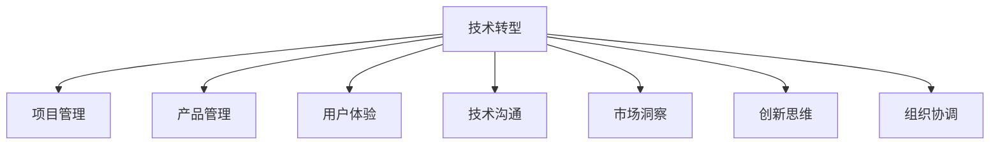

                 

# 从技术岗位到产品经理的转型

> 关键词：技术转型,产品管理,项目管理,用户体验,技术沟通,市场洞察,创新思维,组织协调

## 1. 背景介绍

### 1.1 问题由来
在快速发展的技术世界中，单一的技术岗位已经难以满足公司业务发展的需求。对于技术人才来说，具备跨部门协作、综合管理能力，实现从技术到产品的全面转型，已成为越来越多公司对人才的需求。

### 1.2 问题核心关键点
技术到产品转型的核心关键点包括：
- 技术基础：掌握核心技术，理解系统架构，具备编程和算法能力。
- 项目经验：具备良好的项目管理经验，能够应对项目时间、成本和资源管理。
- 用户视角：能够从用户需求出发，设计符合用户需求的解决方案。
- 业务理解：对公司业务和市场情况有深入了解，能够识别市场机会和风险。
- 沟通能力：具备出色的沟通技巧，能够清晰地传达技术观点，理解业务需求。
- 领导力：具备领导和管理能力，能够协调团队资源，推动项目顺利完成。

### 1.3 问题研究意义
技术到产品转型不仅是个人职业发展的需要，更是公司业务创新的关键。这种转型可以推动企业快速响应市场需求，提高产品竞争力，增强公司创新能力。

## 2. 核心概念与联系

### 2.1 核心概念概述

为更好地理解技术到产品的转型过程，本节将介绍几个密切相关的核心概念：

- 技术转型(Technical Transition)：指技术岗位的员工转变为产品管理岗位的过程，包括技术理解、项目管理、用户视角、业务洞察等多方面能力的提升。
- 产品管理(Product Management)：负责产品从需求到上市的全过程管理，需要结合技术、市场、用户等多方面因素综合决策。
- 项目管理(Project Management)：管理和控制项目进度、成本和资源，确保项目按时、按质完成。
- 用户体验(User Experience, UX)：关注用户在使用产品时的体验和感受，是产品设计的核心要素之一。
- 技术沟通(Technical Communication)：在技术团队与产品团队、市场团队之间进行有效的信息传递和沟通。
- 市场洞察(Market Insights)：通过市场分析，识别机会和风险，为产品决策提供依据。
- 创新思维(Innovation Mindset)：不断探索新技术、新方法，推动产品持续改进和创新。
- 组织协调(Organization Coordination)：在跨部门协作中协调资源，推动项目顺利实施。

这些核心概念之间的逻辑关系可以通过以下Mermaid流程图来展示：



这个流程图展示出技术到产品转型所需的多方面能力提升，每项能力都需要在实践中不断迭代和加强。

## 3. 核心算法原理 & 具体操作步骤
### 3.1 算法原理概述

技术到产品转型的核心在于，将技术专长和项目管理、用户体验、业务洞察等软技能结合起来，形成综合能力。其核心算法原理可以归纳为以下几方面：

1. **技术理解**：对核心技术有深入掌握，能够清晰理解系统架构和功能实现。
2. **项目管理**：掌握敏捷开发、Scrum等项目管理方法，能够高效管理项目进度和资源。
3. **用户视角**：通过用户调研、数据分析等方式，深入理解用户需求和痛点。
4. **业务洞察**：对公司业务和市场环境有全面了解，能够识别市场机会和风险。
5. **技术沟通**：具备清晰的表达和沟通能力，能够将技术细节转化为易于理解的业务需求。
6. **创新思维**：不断探索新技术、新方法，推动产品创新和改进。
7. **组织协调**：在跨部门协作中，协调资源，确保项目顺利推进。

### 3.2 算法步骤详解

技术到产品转型的具体操作步骤可以分解为以下几个关键步骤：

**Step 1: 自我评估**
- 评估自身技术基础，确定需要加强的领域。
- 通过项目实践，了解项目管理和用户体验等相关知识。

**Step 2: 提升技术深度**
- 深入学习核心技术，掌握系统架构，理解算法实现。
- 参加技术培训、技术会议，持续跟进技术前沿。

**Step 3: 提升项目管理能力**
- 学习项目管理方法，如敏捷开发、Scrum等，提升项目管理和协调能力。
- 参与项目管理实践，积累项目管理经验。

**Step 4: 提升用户体验和业务洞察能力**
- 通过用户调研、数据分析等方式，深入理解用户需求和痛点。
- 参加市场分析培训，提升对公司业务和市场环境的理解。

**Step 5: 提升沟通和创新能力**
- 参加技术沟通和团队协作培训，提升沟通技巧。
- 探索新技术、新方法，推动产品创新和改进。

**Step 6: 实践和反馈**
- 参与实际项目，将所学知识和技能应用到实践中。
- 收集反馈，不断调整和优化自己的工作方式。

### 3.3 算法优缺点

技术到产品转型的方法具有以下优点：
1. 提升综合能力：通过系统学习和实践，全面提升技术和管理能力。
2. 适应性强：可以适应公司不同的业务需求，具备更强的灵活性。
3. 持续改进：在实践中不断调整和优化，提升自身能力。

同时，该方法也存在一定的局限性：
1. 学习成本高：需要投入大量时间和精力进行学习和实践。
2. 适应期长：转型初期可能会面临适应困难，需要时间和耐心。
3. 需要跨部门协作：需要与不同部门协调合作，可能会遇到沟通难题。

尽管存在这些局限性，但就目前而言，技术到产品转型的方法仍然是实现全面职业发展的有效途径。未来相关研究的重点在于如何进一步降低转型成本，提升转型效率，同时兼顾技术和管理能力的发展。

### 3.4 算法应用领域

技术到产品转型的方法在多个行业和领域中得到了广泛应用，例如：

- 互联网公司：技术岗位员工转型为产品经理，推动产品创新和市场拓展。
- 传统企业：IT部门技术人员转型为产品负责人，提升企业数字化转型能力。
- 创业公司：技术创业者转型为产品经理，提高产品竞争力和市场占有率。
- 教育行业：技术教师转型为课程设计师，提升教学效果和用户体验。
- 医疗行业：技术人员转型为医疗产品负责人，推动医疗信息化和智能化进程。

除了上述这些经典应用外，技术到产品转型的方法也将不断拓展到更多行业和领域，为各行各业带来新的变革和机遇。

## 4. 数学模型和公式 & 详细讲解 & 举例说明
### 4.1 数学模型构建

本节将使用数学语言对技术到产品转型的数学模型进行更加严格的刻画。

记技术岗位员工为 $T$，产品管理岗位员工为 $P$。设 $f(T)$ 为技术基础提升函数，$g(P)$ 为项目管理能力提升函数，$h(UX)$ 为用户体验提升函数，$i(BI)$ 为业务洞察能力提升函数，$j(Comm)$ 为技术沟通能力提升函数，$k(IT)$ 为创新思维提升函数，$l(Coord)$ 为组织协调能力提升函数。

技术到产品转型的数学模型为：

$$
P = f(T) + g(T) + h(T) + i(T) + j(T) + k(T) + l(T)
$$

### 4.2 公式推导过程

根据上述定义，我们可以推导出技术到产品转型的具体过程。

假设初始技术岗位员工为 $T_0$，通过 $f$ 函数提升技术基础，变为 $T_1$。再通过 $g$ 函数提升项目管理能力，变为 $T_2$。依此类推，最终变为产品管理岗位员工 $P$。

具体推导如下：

$$
T_1 = f(T_0)
$$

$$
T_2 = g(T_1) + h(T_1) + i(T_1) + j(T_1) + k(T_1) + l(T_1)
$$

$$
P = f(T_2)
$$

### 4.3 案例分析与讲解

以下以一个具体案例来说明技术到产品转型的数学模型应用。

假设某互联网公司的一名技术工程师希望转型为产品经理，初始技术能力为 $T_0$。首先，通过参加技术培训和项目实践，提升技术基础，变为 $T_1$。然后，通过学习项目管理方法，积累项目管理经验，提升项目管理能力，变为 $T_2$。接着，通过用户调研和数据分析，提升用户体验和业务洞察能力，变为 $T_3$。最后，通过沟通培训和创新探索，提升技术沟通和创新思维能力，变为 $T_4$。最终，通过实践和反馈，成为一名合格的产品经理 $P$。

这个过程可以表示为：

$$
T_1 = f(T_0) = T_0 + \Delta f
$$

$$
T_2 = g(T_1) + h(T_1) + i(T_1) + j(T_1) + k(T_1) + l(T_1)
$$

$$
T_3 = f(T_2) = T_2 + \Delta f
$$

$$
T_4 = f(T_3) = T_3 + \Delta f
$$

$$
P = f(T_4) = T_4 + \Delta f
$$

其中 $\Delta f$ 表示提升函数的效果。通过不断的学习和实践，技术岗位员工能够逐步提升各方面的能力，最终实现技术到产品的转型。

## 5. 项目实践：代码实例和详细解释说明
### 5.1 开发环境搭建

在进行技术到产品转型的实践前，我们需要准备好开发环境。以下是使用Python进行项目管理实践的环境配置流程：

1. 安装Anaconda：从官网下载并安装Anaconda，用于创建独立的Python环境。

2. 创建并激活虚拟环境：
```bash
conda create -n project-env python=3.8 
conda activate project-env
```

3. 安装PyCharm：下载并安装PyCharm IDE，具备项目管理、代码管理、团队协作等功能。

4. 安装Git和GitHub：安装Git版本控制系统，注册GitHub账号并克隆项目管理相关的代码库。

5. 安装Jira或Trello：选择适合的项目管理工具，进行项目管理和任务跟踪。

完成上述步骤后，即可在`project-env`环境中开始项目管理实践。

### 5.2 源代码详细实现

下面我们以一个具体项目为例，给出使用Jira进行项目管理的PyCharm代码实现。

首先，定义项目需求和任务：

```python
from jira import Jira
jira = Jira('https://example.com', basic_auth=('username', 'password'))

project_id = '10001'
project = jira.get_project(project_id)
tasks = jira.search_issues(project_id)
```

然后，定义任务完成情况和反馈：

```python
for task in tasks:
    task_id = task.id
    task_name = task.fields.summary
    task_status = task.fields.status.name
    task_assignee = task.fields.assignee.name
    task_desc = task.fields.description
    task_subtasks = task.fields.subtasks
    
    # 更新任务状态
    if task_status == 'To Do':
        new_status = 'In Progress'
    elif task_status == 'In Progress':
        new_status = 'Review'
    elif task_status == 'Review':
        new_status = 'Done'
    
    jira.update_issue(task_id, fields={'status': new_status})
    
    # 提交反馈
    feedback = input(f"Task '{task_name}' status: {task_status}\nEnter feedback:")
    jira.add_comment(task_id, feedback)
```

最后，启动项目管理流程：

```python
while True:
    print("Enter task name or 'exit' to quit:")
    task_name = input()
    
    if task_name == 'exit':
        break
    
    tasks = jira.search_issues(project_id, 'summary ~ "%s"' % task_name)
    for task in tasks:
        task_id = task.id
        task_name = task.fields.summary
        task_status = task.fields.status.name
        task_assignee = task.fields.assignee.name
        task_desc = task.fields.description
        task_subtasks = task.fields.subtasks
        
        print(f"Task '{task_name}' status: {task_status}\nAssignee: {task_assignee}\nDescription: {task_desc}\nSubtasks:")
        for subtask in task_subtasks:
            print(f"- {subtask.fields.name}")
    
    action = input(f"Actions (add/sub, done, next): ")
    
    if action == 'add':
        new_task = jira.create_issue(project_id, fields={'project': project_id, 'summary': task_name, 'description': 'New task', 'assignee': 'your_username'})
        print(f"Task '{task_name}' added with ID {new_task.id}")
    elif action == 'sub':
        subtask_name = input("Enter subtask name:")
        subtask = jira.create_subtask(task_id, fields={'name': subtask_name, 'parent': task_id})
        print(f"Subtask '{subtask_name}' added to '{task_name}' with ID {subtask.id}")
    elif action == 'done':
        jira.update_issue(task_id, fields={'status': 'Done'})
        print(f"Task '{task_name}' marked as 'Done'")
    elif action == 'next':
        jira.update_issue(task_id, fields={'status': 'In Progress'})
        print(f"Task '{task_name}' marked as 'In Progress'")
    else:
        print("Invalid action. Please try again.")
```

以上就是使用PyCharm和Jira进行项目管理的完整代码实现。可以看到，通过Jira，我们能够轻松管理任务、提交反馈、更新状态，有效提升项目管理效率。

### 5.3 代码解读与分析

让我们再详细解读一下关键代码的实现细节：

**项目管理工具选择**：
- 通过比较Jira和Trello等项目管理工具，选择适合自身和团队的Jira进行实践。

**项目需求和任务定义**：
- 定义项目需求和任务，通过Jira搜索和获取任务详情。

**任务状态和反馈更新**：
- 根据任务状态，更新任务状态和提交反馈。

**项目管理流程启动**：
- 通过交互式界面，支持添加新任务、添加子任务、标记为完成等操作。

可以看到，通过Jira进行项目管理的代码实现非常简单，但功能强大，能够有效提升项目管理效率，为技术到产品转型提供有力支持。

当然，实际的项目管理实践还需考虑更多因素，如团队协作、任务分配、进度跟踪等，需要结合具体项目和团队实际情况进行调整和优化。

## 6. 实际应用场景
### 6.1 互联网公司项目

在互联网公司中，技术到产品转型的需求非常普遍。例如，某互联网公司的一名前端工程师希望转型为产品经理，可以通过以下步骤：

1. **自我评估**：评估自身技术基础，包括前端框架、开发工具等。
2. **提升技术深度**：深入学习前端技术，如React、Vue等，提升技术深度。
3. **提升项目管理能力**：学习敏捷开发、Scrum等项目管理方法，提升项目管理能力。
4. **提升用户体验和业务洞察能力**：通过用户调研、数据分析等方式，深入理解用户需求和痛点。
5. **提升沟通和创新能力**：参加技术沟通和团队协作培训，提升沟通技巧。
6. **实践和反馈**：参与实际项目，将所学知识和技能应用到实践中，收集反馈，不断调整和优化。

通过这一系列步骤，技术工程师能够逐步提升各方面能力，最终实现技术到产品的转型。

### 6.2 传统企业数字化转型

对于传统企业，技术到产品转型同样具有重要意义。例如，某传统企业的IT部门希望推动企业数字化转型，可以按照以下步骤进行：

1. **自我评估**：评估IT部门的整体技术基础和项目管理能力。
2. **提升技术深度**：引入先进的技术和工具，提升IT部门的技术水平。
3. **提升项目管理能力**：采用敏捷开发等项目管理方法，提升项目管理效率。
4. **提升用户体验和业务洞察能力**：通过用户调研、数据分析等方式，深入理解企业业务和用户需求。
5. **提升沟通和创新能力**：加强技术团队与业务团队的沟通协作，推动技术创新和业务协同。
6. **实践和反馈**：推动数字化转型项目，收集反馈，不断优化和改进。

通过这一系列步骤，IT部门能够逐步提升各方面能力，推动企业数字化转型，实现业务创新和提升。

### 6.3 创业公司产品开发

在创业公司中，技术到产品转型同样具有重要意义。例如，某创业公司的技术团队希望推出一款新产品，可以按照以下步骤进行：

1. **自我评估**：评估团队的技术基础和项目管理能力。
2. **提升技术深度**：引入先进的技术和工具，提升技术水平。
3. **提升项目管理能力**：采用敏捷开发等项目管理方法，提升项目管理效率。
4. **提升用户体验和业务洞察能力**：通过用户调研、数据分析等方式，深入理解用户需求和痛点。
5. **提升沟通和创新能力**：加强技术团队与业务团队的沟通协作，推动技术创新和产品迭代。
6. **实践和反馈**：推动产品开发，收集反馈，不断优化和改进。

通过这一系列步骤，技术团队能够逐步提升各方面能力，推动产品开发和市场拓展，实现公司的快速发展和创新。

### 6.4 教育行业课程设计

在教育行业中，技术到产品转型同样具有重要意义。例如，某教育机构的教师希望转型为课程设计师，可以按照以下步骤进行：

1. **自我评估**：评估自身技术基础和课程设计能力。
2. **提升技术深度**：提升技术基础，如编程、数据分析等。
3. **提升项目管理能力**：采用敏捷开发等项目管理方法，提升项目管理效率。
4. **提升用户体验和业务洞察能力**：通过用户调研、数据分析等方式，深入理解学生需求和痛点。
5. **提升沟通和创新能力**：加强与教学团队的沟通协作，推动课程创新和教学改进。
6. **实践和反馈**：推动课程设计，收集反馈，不断优化和改进。

通过这一系列步骤，教师能够逐步提升各方面能力，实现技术到产品的转型，提升教学效果和用户体验。

## 7. 工具和资源推荐
### 7.1 学习资源推荐

为了帮助开发者系统掌握技术到产品转型的理论和实践，这里推荐一些优质的学习资源：

1. 《敏捷开发实践指南》系列书籍：详细介绍了敏捷开发的理念和方法，为项目管理提供了理论基础。
2. 《用户体验设计：为产品而设计》书籍：介绍了用户体验设计的原则和方法，为提升用户体验提供了指导。
3. 《项目管理基础》在线课程：提供项目管理基础课程，涵盖项目规划、执行、监控等各个方面。
4. 《技术到产品：如何实现成功转型》课程：介绍技术到产品转型的步骤和策略，为转型提供实践指导。
5. 《产品管理手册》系列文章：涵盖产品管理的各个方面，为产品经理提供全面参考。

通过对这些资源的学习实践，相信你一定能够快速掌握技术到产品转型的精髓，并用于解决实际的转型问题。

### 7.2 开发工具推荐

高效的开发离不开优秀的工具支持。以下是几款用于技术到产品转型的常用工具：

1. Jira：项目管理工具，支持任务分配、进度跟踪、反馈提交等。
2. Trello：项目管理工具，以看板形式展示任务，便于团队协作。
3. GitHub：版本控制和协作平台，支持代码管理、问题跟踪、团队协作等功能。
4. Slack：团队协作工具，支持即时通讯、文件共享、任务分配等。
5. Zoom：视频会议工具，支持远程协作和沟通。
6. Google Drive：文件存储和共享平台，便于团队文件协作和共享。

合理利用这些工具，可以显著提升技术到产品转型的开发效率，加快创新迭代的步伐。

### 7.3 相关论文推荐

技术到产品转型技术的发展源于学界的持续研究。以下是几篇奠基性的相关论文，推荐阅读：

1. "The Agile Manifesto"（《敏捷宣言》）：敏捷开发的核心理念，为项目管理提供了理论基础。
2. "Designing User Experiences"（《用户体验设计》）：介绍了用户体验设计的原则和方法，为提升用户体验提供了指导。
3. "Project Management for the Information Age"（《项目管理》）：介绍了项目管理的各个方面，为项目管理提供了理论基础。
4. "The Lean Startup"（《精益创业》）：介绍了精益创业的理念和方法，为产品创新提供了指导。
5. "A Framework for Product Innovation"（《产品创新框架》）：介绍了产品创新的框架和方法，为产品设计提供了指导。

这些论文代表了大语言模型微调技术的发展脉络。通过学习这些前沿成果，可以帮助研究者把握学科前进方向，激发更多的创新灵感。

## 8. 总结：未来发展趋势与挑战
### 8.1 总结

本文对技术到产品转型方法进行了全面系统的介绍。首先阐述了技术到产品转型的研究背景和意义，明确了技术基础、项目管理、用户体验、业务洞察、技术沟通、创新思维、组织协调等多方面能力的提升对职业发展的重要性。其次，从原理到实践，详细讲解了技术到产品转型的数学模型和关键步骤，给出了技术到产品转型的完整代码实例。同时，本文还广泛探讨了技术到产品转型方法在互联网公司、传统企业、创业公司、教育行业等多个行业领域的应用前景，展示了技术到产品转型方法的巨大潜力。此外，本文精选了技术到产品转型技术的各类学习资源，力求为读者提供全方位的技术指引。

通过本文的系统梳理，可以看到，技术到产品转型不仅是个人职业发展的需要，更是公司业务创新的关键。技术到产品转型方法结合了技术和管理能力，推动企业快速响应市场需求，提升产品竞争力和市场占有率，加速数字化转型进程，带来企业创新和发展的巨大动力。未来，伴随技术到产品转型方法的不断进步，相信将有更多的公司和个人受益于这一转型过程，为技术到产品转型的深入发展注入新的动力。

### 8.2 未来发展趋势

展望未来，技术到产品转型技术将呈现以下几个发展趋势：

1. **全面化**：技术到产品转型将不再局限于单一技能提升，而是全面融合技术、管理、用户体验等多方面能力。
2. **智能化**：借助人工智能和大数据技术，提升项目管理、用户体验分析等环节的智能化水平。
3. **自动化**：采用自动化工具和流程，提高项目管理效率，降低人工成本。
4. **生态化**：结合生态系统建设，推动跨部门协作和资源共享，提升组织协调能力。
5. **国际化**：结合全球化视野，推动产品和服务的国际化发展，提升市场竞争力。

以上趋势凸显了技术到产品转型技术的广阔前景。这些方向的探索发展，必将进一步提升技术到产品转型方法的实践效果，推动企业快速响应市场需求，提升产品竞争力和市场占有率，加速数字化转型进程。

### 8.3 面临的挑战

尽管技术到产品转型技术已经取得了显著成就，但在迈向更加智能化、普适化应用的过程中，它仍面临诸多挑战：

1. **学习成本高**：需要投入大量时间和精力进行学习和实践。
2. **适应期长**：转型初期可能会面临适应困难，需要时间和耐心。
3. **跨部门协作**：需要与不同部门协调合作，可能会遇到沟通难题。
4. **资源分配**：需要合理分配资源，平衡技术和管理需求。
5. **风险管理**：需要加强风险管理，确保转型过程顺利进行。

尽管存在这些挑战，但就目前而言，技术到产品转型方法仍然是实现全面职业发展的有效途径。未来相关研究的重点在于如何进一步降低转型成本，提升转型效率，同时兼顾技术和管理能力的发展。

### 8.4 研究展望

面对技术到产品转型所面临的挑战，未来的研究需要在以下几个方面寻求新的突破：

1. **跨学科融合**：将技术和管理学等多学科知识融合，形成更加全面的知识体系。
2. **智能化工具**：开发更多智能化、自动化工具，提高项目管理效率，降低人工成本。
3. **生态系统建设**：建立跨部门协作的生态系统，推动资源共享和协作。
4. **全球化视野**：结合全球化视野，推动产品和服务的国际化发展。

这些研究方向的探索，必将引领技术到产品转型技术迈向更高的台阶，为构建技术和管理协同的智能系统铺平道路。面向未来，技术到产品转型技术还需要与其他技术进行更深入的融合，如知识表示、因果推理、强化学习等，多路径协同发力，共同推动技术到产品转型的深入发展。只有勇于创新、敢于突破，才能不断拓展技术到产品转型的边界，让技术到产品转型成为推动企业创新发展的有力工具。

## 9. 附录：常见问题与解答

**Q1：如何选择合适的项目管理工具？**

A: 选择合适的项目管理工具需要考虑以下因素：
1. 团队规模：选择适合团队规模的项目管理工具，避免大材小用或资源浪费。
2. 项目复杂度：选择支持复杂项目管理的工具，如依赖管理、迭代计划等。
3. 协作需求：选择支持团队协作的工具，如任务分配、进度跟踪、文件共享等。
4. 成本预算：选择性价比高的工具，避免高成本投入。
5. 功能需求：选择符合项目需求的功能，如敏捷开发、Scrum等。

通过综合考虑这些因素，可以选择最适合自身和团队的项目管理工具。

**Q2：如何平衡技术和管理需求？**

A: 平衡技术和管理需求可以通过以下方法实现：
1. 明确项目目标：确保项目目标清晰明确，技术与管理工作紧密结合。
2. 合理分工：明确技术和管理团队的职责，避免冲突和重复。
3. 定期沟通：定期举行技术和管理团队会议，确保信息同步。
4. 灵活调整：根据项目进展和需求，灵活调整技术和管理的资源配置。
5. 多轮迭代：通过多轮迭代，逐步优化技术和管理的结合效果。

通过这些方法，可以更好地平衡技术和管理需求，推动项目顺利实施。

**Q3：如何提高项目管理的效率？**

A: 提高项目管理效率可以通过以下方法实现：
1. 引入敏捷开发：采用敏捷开发方法，提高项目灵活性和响应速度。
2. 使用自动化工具：采用自动化工具，如Jira、Git等，提高项目管理效率。
3. 强化沟通协作：加强团队沟通协作，确保信息同步和任务明确。
4. 定期回顾改进：定期回顾项目进展，总结经验教训，改进项目管理方法。
5. 引入AI技术：利用AI和大数据技术，提高项目管理决策的智能化水平。

通过这些方法，可以显著提升项目管理的效率和效果。

**Q4：如何应对技术到产品转型中的挑战？**

A: 应对技术到产品转型中的挑战可以通过以下方法实现：
1. 系统学习：通过系统学习和实践，不断提升自己的技术和管理能力。
2. 团队协作：加强团队协作，建立跨部门协作机制。
3. 持续改进：持续改进项目管理方法和技术实现，提升项目质量。
4. 风险管理：加强风险管理，及时识别和应对项目风险。
5. 自我反思：定期反思和总结，持续优化和改进。

通过这些方法，可以更好地应对技术到产品转型中的挑战，推动转型过程顺利实施。

---

作者：禅与计算机程序设计艺术 / Zen and the Art of Computer Programming

