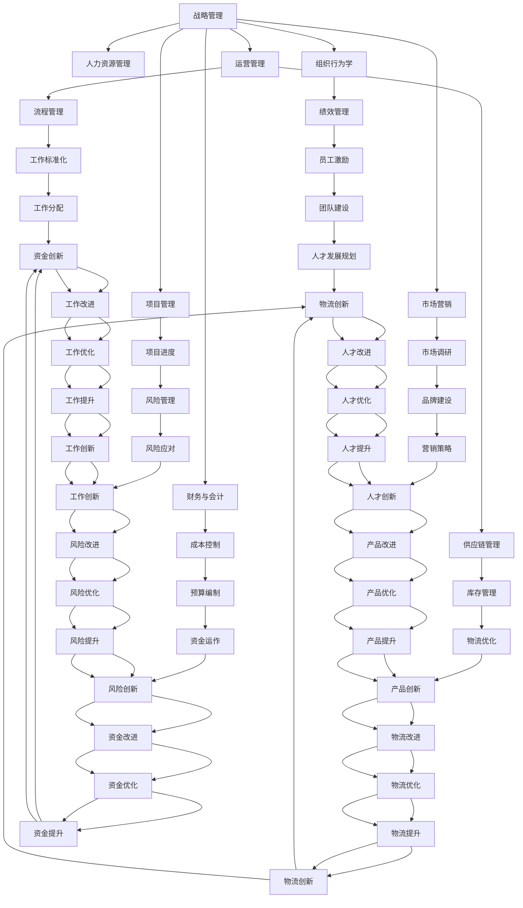

                 

# 从经典到实践：管理理论的落地

## 1. 背景介绍

### 1.1 问题由来

在过去的几十年里，管理学理论取得了长足的发展，从早期的经典理论如泰勒的科学管理理论、法约尔的行政组织理论，到近代的战略管理、领导力理论等，涌现出了许多影响深远的理论和模型。然而，尽管理论研究不断进步，但如何将这些理论应用于实际管理实践中，一直是管理学家和实践者共同面临的挑战。

现代企业在面对快速变化的市场环境、复杂多变的组织结构、多元化的人力资源等问题时，常常感到理论指导不足。部分原因在于理论研究过于抽象，缺乏具体的操作性指导；另一部分原因则是因为理论的适用性存在局限，不同组织有不同的特点，理论未必完全适用。

因此，从经典管理理论到实际操作，如何搭建起一座桥梁，将理论转化为具有可操作性的工具和方法，是管理实践中的一个重要课题。

### 1.2 问题核心关键点

管理的落地实践涉及多个核心关键点：

1. **理论适用性**：经典理论是否适用于当前的管理实践？哪些理论可以进行本土化改造？
2. **操作性指导**：如何将复杂的管理理论拆解为具体的工具和方法？
3. **数据驱动**：如何利用数据分析手段，辅助决策和执行？
4. **人本管理**：如何理解和激励员工，构建高效团队？
5. **技术应用**：如何将信息技术手段，如ERP、BI、AI等，融入管理流程中？
6. **风险管理**：如何在复杂环境中识别和管理风险？
7. **组织变革**：如何设计和管理组织变革，提升组织适应性？

通过深入探讨这些问题，本文将为管理学理论的落地实践提供详细指导和具体建议。

## 2. 核心概念与联系

### 2.1 核心概念概述

在本节中，我们将介绍几个核心管理概念及其相互关系：

- **战略管理**：规划组织目标，制定战略，并制定实施路径，确保组织的长期发展。
- **人力资源管理**：通过招聘、培训、绩效评估等手段，有效利用人力资源。
- **组织行为学**：研究组织成员的行为规律，及其对组织效率的影响。
- **运营管理**：通过流程优化、供应链管理等手段，提高运营效率。
- **财务与会计**：通过财务分析与会计控制，确保资金运营的效率与合规。
- **市场营销**：通过市场调研、产品定位、品牌建设等手段，提升产品销售和市场份额。
- **项目管理**：通过计划、执行、监控等手段，确保项目按时按质完成。

这些核心概念构成了管理学的基本框架，不同概念之间的相互作用，形成了一个有机整体。

### 2.2 核心概念原理和架构的 Mermaid 流程图



该图展示了管理概念之间的联系和相互作用，每个概念通过特定的流程和手段与其它概念相连，共同推动组织的运行和发展。

## 3. 核心算法原理 & 具体操作步骤

### 3.1 算法原理概述

管理学理论的落地实践，通常需要结合多个核心概念，通过系统化的工具和方法，将理论转化为具体的操作。其中，系统思考、数据分析、流程优化、人力资源管理等是常见的落地实践工具。

- **系统思考**：将复杂的管理问题拆解为多个可控的子系统，通过系统的视角来解决问题。
- **数据分析**：通过数据收集、分析和可视化手段，辅助决策和执行。
- **流程优化**：通过标准化和优化流程，提高运营效率。
- **人力资源管理**：通过科学的招聘、培训、绩效评估手段，最大化利用人力资源。

### 3.2 算法步骤详解

管理学理论的落地实践，可以按照以下步骤进行：

**Step 1: 明确管理目标和战略**

- 明确组织的目标和愿景，制定中长期战略计划。
- 分解战略计划，制定具体的执行路径和优先级。

**Step 2: 设计管理架构**

- 设计组织结构，明确各层级和职能。
- 确定关键岗位，明确职责和权限。

**Step 3: 实施流程优化**

- 识别和分析现有的业务流程，查找瓶颈和改进点。
- 设计新的业务流程，并进行流程优化。
- 实施流程优化，并持续监控和改进。

**Step 4: 人力资源管理**

- 通过科学的方法进行招聘和选拔，确保团队具备必要的技能和经验。
- 制定全面的培训计划，提高员工技能和知识水平。
- 建立完善的绩效评估和激励体系，激发员工积极性。

**Step 5: 数据分析和决策支持**

- 收集和整理数据，进行数据清洗和处理。
- 利用数据分析工具和方法，进行业务分析和决策支持。
- 将数据分析结果可视化，辅助决策和执行。

### 3.3 算法优缺点

管理学理论的落地实践具有以下优点：

1. **系统化管理**：通过系统化的管理工具和方法，确保管理过程条理清晰、高效有序。
2. **数据驱动决策**：借助数据分析手段，提供科学决策依据，减少主观判断带来的误差。
3. **流程标准化**：通过流程优化和标准化，提高运营效率，降低错误率。
4. **人力资源合理利用**：通过科学的招聘和培训，提高团队能力，确保组织目标的实现。

同时，管理学理论的落地实践也存在一些局限性：

1. **理论适配性**：不同的组织和环境有其特定的条件和需求，经典管理理论可能需要进行本土化改造。
2. **操作复杂性**：理论的落地实践可能需要设计复杂的流程和工具，增加了管理难度。
3. **数据质量问题**：数据的质量和完整性直接影响分析结果的准确性，数据获取和处理难度较大。
4. **员工接受度**：新的管理方法需要员工的理解和接受，可能遇到抵触情绪。

### 3.4 算法应用领域

管理学理论的落地实践，在多个领域均有应用，包括但不限于：

- **制造业**：通过精益生产和流程优化，提升生产效率和产品质量。
- **服务业**：通过流程标准化和数据驱动，提升客户满意度和运营效率。
- **医疗行业**：通过流程改进和数据分析，提高医疗服务质量和效率。
- **政府机构**：通过流程优化和绩效管理，提高公共服务水平。
- **教育领域**：通过流程设计和数据分析，优化教育资源配置，提升教学质量。

## 4. 数学模型和公式 & 详细讲解 & 举例说明

### 4.1 数学模型构建

本节将通过数学模型对管理学理论的落地实践进行系统性构建。

假设组织的目标是最大化利润，则目标函数为：

$$
\max_{x} \text{Profit}(x)
$$

其中，$x$ 表示组织的投入和产出变量，如成本、销售收入、市场份额等。

在模型中，我们需要引入约束条件，如生产能力、库存水平、资金限制等。例如，生产成本和市场需求的约束条件可以表示为：

$$
\text{Cost}(x) \leq \text{Budget}
$$

$$
\text{Demand}(x) \geq \text{MarketShare}
$$

其中，$\text{Cost}(x)$ 表示生产成本，$\text{Budget}$ 表示可用预算，$\text{Demand}(x)$ 表示市场需求，$\text{MarketShare}$ 表示市场份额。

### 4.2 公式推导过程

为了求解上述优化问题，我们通常采用线性规划(LP)或混合整数规划(MIP)等方法。

以线性规划为例，问题的解可以通过求解以下LP问题获得：

$$
\max_{x} c^T x
$$

$$
\text{subject to} \quad Ax \leq b
$$

$$
\text{and} \quad x \geq 0
$$

其中，$c$ 表示利润向量，$A$ 表示约束矩阵，$b$ 表示约束向量，$x$ 表示决策变量。

### 4.3 案例分析与讲解

以制造业的生产调度问题为例，假设工厂有多个车间和机器，每个机器有不同的生产能力和生产时间。目标是在满足生产需求和机器时间限制的情况下，最大化生产效率。

在模型中，我们将每个机器的生产能力作为决策变量，引入时间、产量、需求等约束条件，通过线性规划求解，得出最优的生产调度方案。

## 5. 项目实践：代码实例和详细解释说明

### 5.1 开发环境搭建

在进行管理学理论的落地实践项目中，我们通常需要使用Python和R等语言进行数据分析和建模。以下是在Python中进行线性规划的开发环境搭建步骤：

1. 安装Anaconda：从官网下载并安装Anaconda，用于创建独立的Python环境。

2. 创建并激活虚拟环境：
```bash
conda create -n py-env python=3.8 
conda activate py-env
```

3. 安装相关库：
```bash
pip install scipy sympy linear-programming
```

4. 准备数据：将管理问题的约束条件和目标函数整理成表格形式，并存入数据文件中。

### 5.2 源代码详细实现

以下是一个简单的线性规划问题的Python代码实现：

```python
import scipy.optimize

# 目标函数系数
c = [1, 2, 3]

# 约束条件系数和右侧值
A = [[1, 2], [3, 4], [5, 6]]
b = [10, 20, 30]

# 约束条件类型和决策变量范围
A_ub = [[1, 2], [3, 4], [5, 6]]
b_ub = [10, 20, 30]
x0_bounds = (0, None)

# 求解线性规划问题
result = scipy.optimize.linprog(c, A_ub=A_ub, b_ub=b_ub, bounds=x0_bounds)

print("最优解：", result.x)
print("最优值：", result.fun)
```

### 5.3 代码解读与分析

在上述代码中，我们使用了SciPy库中的`linprog`函数进行线性规划求解。其中：

- `c` 表示目标函数系数，即每项决策变量的边际利润。
- `A_ub` 和 `b_ub` 表示约束条件系数和右侧值，即每个约束条件的线性不等式。
- `x0_bounds` 表示决策变量的范围，即非负约束。

通过调用`linprog`函数，我们得到了最优解和最优值。

### 5.4 运行结果展示

假设上述线性规划问题的最优解为 $x_1 = 5, x_2 = 5$，则最优值 $z = 1 \times 5 + 2 \times 5 + 3 \times 5 = 40$。

这意味着，在满足约束条件的前提下，工厂可以分别安排5个单位的生产任务给第1个车间和第2个车间，以最大化生产效率。

## 6. 实际应用场景

### 6.1 制造业生产调度

在制造业中，生产调度是企业管理中的重要环节。通过优化生产调度，可以最大化生产效率，降低成本，提高产品质量。

例如，某汽车制造厂在生产某型号车辆时，需要同时使用多个车间和机器。每个车间和机器都有固定的生产时间和生产能力，如何合理分配任务，优化生产流程，是管理中的主要问题。

通过线性规划模型，我们可以求解最优的生产调度方案，确保每个车间和机器的利用率最大化，同时满足生产需求。

### 6.2 服务行业客户服务

服务行业中的客户服务管理，通常涉及多渠道服务、客户投诉处理、服务流程优化等问题。

例如，某航空公司在管理客户服务时，需要平衡不同服务渠道（如电话、网站、社交媒体）的资源投入，确保客户满意度最大化。

通过多目标优化模型，我们可以在不同服务渠道之间进行资源分配，确保客户服务质量，同时控制成本。

### 6.3 医疗行业病患管理

在医疗行业中，病患管理是管理中的重要部分。如何合理分配医疗资源，提升病患治疗效果，是管理中的主要问题。

例如，某医院在管理病患时，需要平衡手术室、住院部、门诊部的资源使用，确保病患治疗效果。

通过线性规划模型，我们可以求解最优的资源分配方案，确保病患得到最优质的医疗服务。

### 6.4 政府机构预算管理

政府机构在预算管理中，通常需要平衡不同项目和部门的预算分配，确保资金使用效率最大化。

例如，某市政府在管理预算时，需要平衡教育、医疗、基础设施等项目的资金投入，确保各项目的预算合理分配。

通过线性规划模型，我们可以求解最优的预算分配方案，确保资金使用效率最大化。

## 7. 工具和资源推荐

### 7.1 学习资源推荐

为了系统掌握管理学理论的落地实践，推荐以下学习资源：

1. 《管理学》系列书籍：经典的管理学教材，涵盖管理学理论和实践的各个方面。
2. Coursera《管理学导论》课程：由耶鲁大学开设，系统讲解管理学理论和方法。
3. 《运营管理》书籍：详细讲解运营管理的各个环节，包括流程优化、供应链管理等。
4. 《数据分析与决策支持》书籍：介绍数据分析方法在管理中的应用，提供实用的案例分析。
5. 《人力资源管理》书籍：系统讲解人力资源管理的各个方面，包括招聘、培训、绩效评估等。

### 7.2 开发工具推荐

进行管理学理论的落地实践，需要使用多种开发工具：

1. Python和R语言：常用的数据分析和建模工具，支持多种数学和统计方法。
2. Excel和Tableau：常用的数据可视化和报表工具，方便数据处理和展示。
3. SQL数据库：常用的数据存储和管理工具，支持复杂的数据查询和处理。
4. ERP系统：企业资源规划系统，支持全面的业务管理和流程控制。

### 7.3 相关论文推荐

管理学理论的落地实践，离不开学界的持续研究。以下是几篇经典的相关论文，推荐阅读：

1. "A Comparison of Systems Thinking and Analytical Tools in Management Research"：比较系统思考和分析工具在管理研究中的应用，探讨二者的优劣和互补性。
2. "Data-Driven Decision Making in Operations Management"：介绍数据驱动在运营管理中的应用，探讨数据和算法在管理决策中的作用。
3. "Human Resource Management: A Strategic Approach"：系统讲解人力资源管理的各个方面，提供战略性的管理思路。
4. "The Role of Operational Research in Supply Chain Management"：探讨运筹学在供应链管理中的应用，提供实用的优化方法。
5. "Strategic Management: A Stakeholder Approach"：探讨战略管理中的利益相关者视角，提供全面的管理思路。

## 8. 总结：未来发展趋势与挑战

### 8.1 研究成果总结

管理学理论的落地实践，已经取得了许多研究成果，涵盖多个领域和应用场景。主要包括以下几个方面：

1. **系统化管理工具**：开发了大量管理软件和工具，如ERP、BI、KM等，提升管理效率。
2. **数据驱动决策**：借助数据分析和可视化工具，提升决策的科学性和准确性。
3. **流程优化**：通过流程标准化和优化，提升运营效率和质量。
4. **人力资源管理**：科学的方法和工具，提高员工绩效和组织满意度。

### 8.2 未来发展趋势

管理学理论的落地实践将呈现以下几个发展趋势：

1. **人工智能应用**：引入人工智能技术，提升管理决策的智能化水平，如预测分析、风险管理等。
2. **跨学科融合**：管理学与其他学科如心理学、社会学、经济学等进行更深入的融合，提供更全面的管理视角。
3. **数据集成和分析**：利用大数据和云技术，实现数据集成和分析，提升数据利用效率。
4. **人本管理**：更注重员工心理和行为的研究，提升员工满意度和工作绩效。
5. **持续改进**：引入持续改进方法，如精益管理、六西格玛等，提升组织适应性和竞争力。

### 8.3 面临的挑战

尽管管理学理论的落地实践取得了许多进展，但仍面临以下挑战：

1. **数据质量问题**：数据质量对管理决策至关重要，但数据获取和处理难度较大。
2. **技术更新换代**：管理技术快速迭代，需要持续学习新技术和工具。
3. **组织变革难度**：组织变革涉及多方利益，推进难度较大。
4. **管理成本**：管理软件的引入和使用，增加了企业的管理成本。
5. **员工接受度**：新的管理方法需要员工的理解和接受，可能遇到抵触情绪。

### 8.4 研究展望

未来的管理学理论落地实践，需要在以下几个方面寻求新的突破：

1. **数据治理和质量管理**：建立有效的数据治理机制，提升数据质量。
2. **技术集成和优化**：利用大数据和AI技术，提升管理决策的智能化水平。
3. **人本管理创新**：引入更多的心理学和管理学新理论，提升员工满意度和组织绩效。
4. **跨领域应用**：将管理理论和方法应用到更多领域，如医疗、教育、政府等。
5. **管理哲学创新**：结合哲学和社会学的新思想，提供更加全面和深度的管理视角。

## 9. 附录：常见问题与解答

**Q1：如何选择合适的管理工具？**

A: 选择合适的管理工具需要考虑多个因素，如企业规模、业务特点、技术需求等。

1. **功能匹配**：工具的功能应与业务需求相匹配，确保工具能够支持业务管理。
2. **易用性**：工具的使用应该简洁易用，避免员工接受难度。
3. **成本效益**：工具的引入和使用应具有成本效益，避免过度投资。

**Q2：如何提升员工满意度？**

A: 提升员工满意度需要从多个方面进行努力：

1. **薪酬福利**：提供公平合理的薪酬和福利，确保员工的基本生活需求。
2. **职业发展**：提供职业发展机会，如培训、晋升等，提升员工的工作积极性。
3. **工作环境**：营造良好的工作环境，如合理的工作时间、舒适的工作空间等。
4. **沟通交流**：加强沟通交流，提升员工对企业的归属感和认同感。

**Q3：如何应对组织变革？**

A: 应对组织变革需要以下几个步骤：

1. **变革准备**：充分准备，制定详细的变革计划。
2. **沟通宣传**：加强沟通宣传，明确变革目标和意义，减少员工的抵触情绪。
3. **试点实施**：在小范围内进行试点实施，逐步推广。
4. **反馈调整**：收集员工反馈，及时调整变革策略，确保变革顺利推进。

**Q4：如何管理复杂项目？**

A: 管理复杂项目需要引入以下方法：

1. **项目管理工具**：使用项目管理工具，如PMP、SCRUM等，确保项目按时按质完成。
2. **风险管理**：识别和管理项目风险，确保项目顺利推进。
3. **跨部门协作**：加强跨部门协作，确保各部门的协同合作。
4. **质量控制**：建立质量控制体系，确保项目质量。

**Q5：如何提升组织适应性？**

A: 提升组织适应性需要从多个方面进行努力：

1. **灵活管理**：采用灵活的管理方式，提高组织的适应能力。
2. **持续改进**：引入持续改进方法，如精益管理、六西格玛等，提升组织效率。
3. **技术创新**：引入新技术和工具，提升管理决策的智能化水平。
4. **组织文化**：建立开放、包容的组织文化，提升员工的创新能力和积极性。

---

作者：禅与计算机程序设计艺术 / Zen and the Art of Computer Programming

