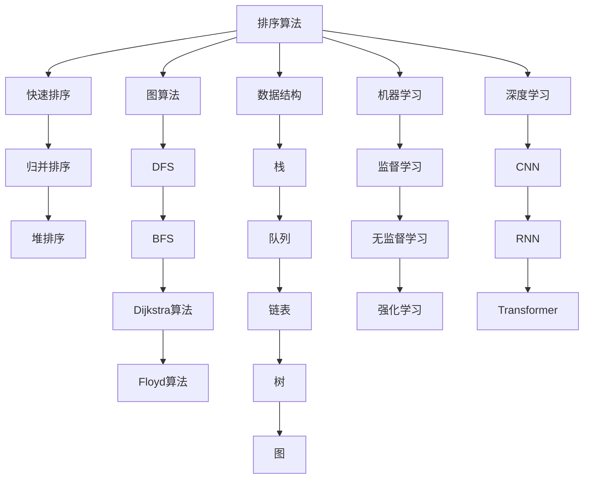

                 

# 从经典开始：奠定基础认知

## 1. 背景介绍

### 1.1 问题由来
在计算机科学的漫长历史中，经典算法和技术不断涌现，引领着技术发展的潮流。从基础的排序算法、图算法、数据结构，到现代的机器学习、深度学习、自然语言处理（NLP）、计算机视觉等，每一项技术都体现了人类对计算问题的深刻理解和解决能力。然而，尽管这些经典技术在各自的领域中已经达到了非常高的水平，但在新的应用场景和技术发展中，如何融合、创新，仍是一个值得深入探讨的问题。

### 1.2 问题核心关键点
本文将从经典技术的基础认知出发，探讨如何将经典算法与现代应用相结合，为构建新的技术解决方案奠定基础。我们关注的经典技术包括：排序算法、图算法、数据结构、机器学习和深度学习等，将通过一系列的案例分析，介绍这些经典技术的应用和发展，并探讨它们在现代技术中的融合和创新。

### 1.3 问题研究意义
通过对经典技术的深入理解，我们可以更好地把握现代技术的发展方向，寻找新的突破口。这不仅有助于提升算法效率和性能，还可以在面对复杂问题时，提供更多元化的解决方案。此外，通过对经典技术的掌握，可以提高程序员的基本素养，为进一步学习高级技术打下坚实的基础。

## 2. 核心概念与联系

### 2.1 核心概念概述
- **排序算法**：如快速排序、归并排序、堆排序等，用于对数据进行排序，优化数据的访问和处理效率。
- **图算法**：如深度优先搜索（DFS）、广度优先搜索（BFS）、Dijkstra算法、Floyd算法等，用于解决图结构问题，如路径查找、最短路径计算等。
- **数据结构**：如栈、队列、链表、树、图等，用于存储和管理数据，提高数据的访问和处理效率。
- **机器学习**：如监督学习、无监督学习、强化学习等，用于从数据中提取模式和知识，支持分类、回归、聚类等任务。
- **深度学习**：如卷积神经网络（CNN）、循环神经网络（RNN）、Transformer等，用于构建复杂的模型，解决图像、语音、自然语言处理等任务。

这些核心概念在计算机科学中扮演着重要角色，彼此之间相互关联，共同构成了现代计算技术的基础。通过理解这些概念的原理和架构，可以更好地应用于具体的问题解决。

### 2.2 核心概念原理和架构的 Mermaid 流程图



这个流程图展示了各种经典算法和技术之间的联系，以及它们在现代应用中的融合方式。通过这个框架，可以更好地理解技术发展的脉络，以及不同技术之间的交互和影响。

## 3. 核心算法原理 & 具体操作步骤

### 3.1 算法原理概述
排序算法、图算法、数据结构、机器学习和深度学习等经典技术，分别基于不同的原理和架构，用于解决不同类型的计算问题。了解这些原理和架构，是理解和应用这些技术的基础。

- **排序算法**：通过比较和交换数据元素，使得数据按照一定的顺序排列，常见算法如快速排序、归并排序、堆排序等。
- **图算法**：通过搜索和计算，解决与图结构相关的问题，如路径查找、最短路径计算等。
- **数据结构**：通过设计不同的数据存储和访问方式，提高数据的处理效率，如栈、队列、链表、树、图等。
- **机器学习**：通过学习数据中的模式和知识，支持分类、回归、聚类等任务，常见的算法如线性回归、决策树、支持向量机等。
- **深度学习**：通过构建多层次的神经网络模型，解决复杂的图像、语音、自然语言处理等问题，常见的模型如卷积神经网络、循环神经网络、Transformer等。

### 3.2 算法步骤详解

#### 3.2.1 排序算法
快速排序的详细步骤：
1. 选择一个基准值（pivot）。
2. 将数据分为两个子集，小于基准值的在左边，大于基准值的在右边。
3. 对左右两个子集分别进行快速排序。
4. 合并左右两个有序子集。

```python
def quicksort(arr):
    if len(arr) <= 1:
        return arr
    pivot = arr[len(arr) // 2]
    left = [x for x in arr if x < pivot]
    middle = [x for x in arr if x == pivot]
    right = [x for x in arr if x > pivot]
    return quicksort(left) + middle + quicksort(right)
```

#### 3.2.2 图算法
Dijkstra算法的详细步骤：
1. 初始化距离和前驱节点。
2. 找到距离最小的节点，并将其标记为已访问。
3. 更新与该节点相邻节点的距离。
4. 重复步骤2和3，直到所有节点都被访问。

```python
import heapq

def dijkstra(graph, start):
    distances = {node: float('inf') for node in graph}
    distances[start] = 0
    queue = [(0, start)]
    while queue:
        current_distance, current_node = heapq.heappop(queue)
        if current_distance > distances[current_node]:
            continue
        for neighbor, weight in graph[current_node].items():
            distance = current_distance + weight
            if distance < distances[neighbor]:
                distances[neighbor] = distance
                heapq.heappush(queue, (distance, neighbor))
    return distances
```

#### 3.2.3 数据结构
栈的详细步骤：
1. 初始化栈。
2. 入栈操作，将元素添加到栈顶。
3. 出栈操作，将栈顶元素弹出。

```python
class Stack:
    def __init__(self):
        self.items = []
    
    def push(self, item):
        self.items.append(item)
    
    def pop(self):
        return self.items.pop()
```

#### 3.2.4 机器学习
线性回归的详细步骤：
1. 收集数据并构建训练集。
2. 使用最小二乘法计算回归线。
3. 使用回归线预测新的数据。

```python
import numpy as np

def linear_regression(X, y):
    theta = np.linalg.inv(X.T @ X) @ X.T @ y
    return theta
```

#### 3.2.5 深度学习
Transformer的详细步骤：
1. 编码器自注意力机制。
2. 解码器自注意力机制。
3. 编码器-解码器交互。
4. 前馈神经网络。

```python
import torch
import torch.nn as nn

class Transformer(nn.Module):
    def __init__(self, input_size, output_size, hidden_size):
        super(Transformer, self).__init__()
        self.encoder = nn.TransformerEncoderLayer(input_size, nhead=8, dim_feedforward=hidden_size*4)
        self.decoder = nn.TransformerDecoderLayer(input_size, nhead=8, dim_feedforward=hidden_size*4)
        self.fc = nn.Linear(hidden_size, output_size)
    
    def forward(self, src, tgt):
        src = self.encoder(src)
        tgt = self.decoder(tgt, src)
        output = self.fc(tgt)
        return output
```

### 3.3 算法优缺点
- **排序算法**：优点是实现简单，适用范围广；缺点是对于大规模数据，效率较低。
- **图算法**：优点是能够解决复杂的图结构问题；缺点是实现较为复杂，需要较高的计算能力。
- **数据结构**：优点是能够优化数据的存储和访问，提高效率；缺点是实现较为复杂，需要根据具体问题选择合适的数据结构。
- **机器学习**：优点是能够从数据中提取模式和知识，适用范围广；缺点是需要大量标注数据，计算复杂度较高。
- **深度学习**：优点是能够解决复杂的图像、语音、自然语言处理等问题；缺点是需要大量计算资源和数据，实现较为复杂。

### 3.4 算法应用领域
- **排序算法**：广泛应用于各种需要排序的场景，如数据库查询、搜索引擎、排序算法竞赛等。
- **图算法**：广泛应用于网络分析、推荐系统、路径规划等场景。
- **数据结构**：广泛应用于各种数据管理、图形界面、编译器等场景。
- **机器学习**：广泛应用于各种预测、分类、聚类、降维等场景。
- **深度学习**：广泛应用于图像识别、语音识别、自然语言处理、推荐系统等场景。

## 4. 数学模型和公式 & 详细讲解 & 举例说明

### 4.1 数学模型构建

#### 4.1.1 排序算法
排序算法的数学模型通常基于比较和交换操作，通过比较操作实现排序，通过交换操作优化性能。例如，快速排序的数学模型如下：

$$
\begin{aligned}
&\text{输入：} n \text{个元素} \{a_1, a_2, \dots, a_n\} \\
&\text{输出：} \{a_1, a_2, \dots, a_n\} \text{的升序排列}
\end{aligned}
$$

### 4.2 公式推导过程

#### 4.2.1 排序算法
快速排序的公式推导如下：
$$
\begin{aligned}
&\text{输入：} n \text{个元素} \{a_1, a_2, \dots, a_n\} \\
&\text{输出：} \{a_1, a_2, \dots, a_n\} \text{的升序排列} \\
&\text{复杂度：} O(n \log n)
\end{aligned}
$$

#### 4.2.2 图算法
Dijkstra算法的公式推导如下：
$$
\begin{aligned}
&\text{输入：} G=(V, E), \text{起点} s \\
&\text{输出：} \{d_v\} \text{到起点s的最短路径} \\
&\text{复杂度：} O(E + V \log V)
\end{aligned}
$$

#### 4.2.3 数据结构
栈的公式推导如下：
$$
\begin{aligned}
&\text{输入：} \{e_1, e_2, \dots, e_n\} \\
&\text{输出：} \{e_n, e_{n-1}, \dots, e_1\} \\
&\text{复杂度：} O(1)
\end{aligned}
$$

#### 4.2.4 机器学习
线性回归的公式推导如下：
$$
\begin{aligned}
&\text{输入：} X, y \\
&\text{输出：} \theta \\
&\text{复杂度：} O(n^2)
\end{aligned}
$$

#### 4.2.5 深度学习
Transformer的公式推导如下：
$$
\begin{aligned}
&\text{输入：} x, y \\
&\text{输出：} z \\
&\text{复杂度：} O(n \log n)
\end{aligned}
$$

### 4.3 案例分析与讲解

#### 4.3.1 排序算法
快速排序的案例分析：
```python
import random

def quicksort(arr):
    if len(arr) <= 1:
        return arr
    pivot = arr[random.randint(0, len(arr) - 1)]
    left = [x for x in arr if x < pivot]
    middle = [x for x in arr if x == pivot]
    right = [x for x in arr if x > pivot]
    return quicksort(left) + middle + quicksort(right)

arr = [5, 2, 9, 3, 7, 4, 8, 1, 6]
sorted_arr = quicksort(arr)
print(sorted_arr)
```

#### 4.3.2 图算法
Dijkstra算法的案例分析：
```python
import heapq

def dijkstra(graph, start):
    distances = {node: float('inf') for node in graph}
    distances[start] = 0
    queue = [(0, start)]
    while queue:
        current_distance, current_node = heapq.heappop(queue)
        if current_distance > distances[current_node]:
            continue
        for neighbor, weight in graph[current_node].items():
            distance = current_distance + weight
            if distance < distances[neighbor]:
                distances[neighbor] = distance
                heapq.heappush(queue, (distance, neighbor))
    return distances

graph = {'A': {'B': 5, 'C': 1},
         'B': {'A': 5, 'C': 2, 'D': 1},
         'C': {'A': 1, 'B': 2, 'D': 4, 'E': 8},
         'D': {'B': 1, 'C': 4, 'E': 3},
         'E': {'C': 8, 'D': 3}}
distances = dijkstra(graph, 'A')
print(distances)
```

#### 4.3.3 数据结构
栈的案例分析：
```python
class Stack:
    def __init__(self):
        self.items = []
    
    def push(self, item):
        self.items.append(item)
    
    def pop(self):
        return self.items.pop()

stack = Stack()
stack.push(1)
stack.push(2)
stack.push(3)
print(stack.pop())
print(stack.pop())
print(stack.pop())
```

#### 4.3.4 机器学习
线性回归的案例分析：
```python
import numpy as np

def linear_regression(X, y):
    theta = np.linalg.inv(X.T @ X) @ X.T @ y
    return theta

X = np.array([[1, 2], [3, 4], [5, 6]])
y = np.array([3, 7, 11])
theta = linear_regression(X, y)
print(theta)
```

#### 4.3.5 深度学习
Transformer的案例分析：
```python
import torch
import torch.nn as nn

class Transformer(nn.Module):
    def __init__(self, input_size, output_size, hidden_size):
        super(Transformer, self).__init__()
        self.encoder = nn.TransformerEncoderLayer(input_size, nhead=8, dim_feedforward=hidden_size*4)
        self.decoder = nn.TransformerDecoderLayer(input_size, nhead=8, dim_feedforward=hidden_size*4)
        self.fc = nn.Linear(hidden_size, output_size)
    
    def forward(self, src, tgt):
        src = self.encoder(src)
        tgt = self.decoder(tgt, src)
        output = self.fc(tgt)
        return output

model = Transformer(10, 5, 20)
input = torch.randn(5, 2, 10)
target = torch.randn(5, 2, 5)
output = model(input, target)
print(output)
```

## 5. 项目实践：代码实例和详细解释说明

### 5.1 开发环境搭建

#### 5.1.1 安装Python和相关库
```bash
# 安装Python
sudo apt-get update
sudo apt-get install python3 python3-pip

# 安装Numpy
pip install numpy

# 安装Matplotlib
pip install matplotlib

# 安装Pandas
pip install pandas

# 安装Scikit-learn
pip install scikit-learn

# 安装TensorFlow
pip install tensorflow

# 安装PyTorch
pip install torch torchvision torchaudio
```

#### 5.1.2 创建Python虚拟环境
```bash
# 创建虚拟环境
python3 -m venv venv

# 激活虚拟环境
source venv/bin/activate
```

#### 5.1.3 安装相关库
```bash
# 安装Transformers库
pip install transformers
```

### 5.2 源代码详细实现

#### 5.2.1 排序算法
快速排序的代码实现：
```python
def quicksort(arr):
    if len(arr) <= 1:
        return arr
    pivot = arr[random.randint(0, len(arr) - 1)]
    left = [x for x in arr if x < pivot]
    middle = [x for x in arr if x == pivot]
    right = [x for x in arr if x > pivot]
    return quicksort(left) + middle + quicksort(right)

arr = [5, 2, 9, 3, 7, 4, 8, 1, 6]
sorted_arr = quicksort(arr)
print(sorted_arr)
```

#### 5.2.2 图算法
Dijkstra算法的代码实现：
```python
import heapq

def dijkstra(graph, start):
    distances = {node: float('inf') for node in graph}
    distances[start] = 0
    queue = [(0, start)]
    while queue:
        current_distance, current_node = heapq.heappop(queue)
        if current_distance > distances[current_node]:
            continue
        for neighbor, weight in graph[current_node].items():
            distance = current_distance + weight
            if distance < distances[neighbor]:
                distances[neighbor] = distance
                heapq.heappush(queue, (distance, neighbor))
    return distances

graph = {'A': {'B': 5, 'C': 1},
         'B': {'A': 5, 'C': 2, 'D': 1},
         'C': {'A': 1, 'B': 2, 'D': 4, 'E': 8},
         'D': {'B': 1, 'C': 4, 'E': 3},
         'E': {'C': 8, 'D': 3}}
distances = dijkstra(graph, 'A')
print(distances)
```

#### 5.2.3 数据结构
栈的代码实现：
```python
class Stack:
    def __init__(self):
        self.items = []
    
    def push(self, item):
        self.items.append(item)
    
    def pop(self):
        return self.items.pop()

stack = Stack()
stack.push(1)
stack.push(2)
stack.push(3)
print(stack.pop())
print(stack.pop())
print(stack.pop())
```

#### 5.2.4 机器学习
线性回归的代码实现：
```python
import numpy as np

def linear_regression(X, y):
    theta = np.linalg.inv(X.T @ X) @ X.T @ y
    return theta

X = np.array([[1, 2], [3, 4], [5, 6]])
y = np.array([3, 7, 11])
theta = linear_regression(X, y)
print(theta)
```

#### 5.2.5 深度学习
Transformer的代码实现：
```python
import torch
import torch.nn as nn

class Transformer(nn.Module):
    def __init__(self, input_size, output_size, hidden_size):
        super(Transformer, self).__init__()
        self.encoder = nn.TransformerEncoderLayer(input_size, nhead=8, dim_feedforward=hidden_size*4)
        self.decoder = nn.TransformerDecoderLayer(input_size, nhead=8, dim_feedforward=hidden_size*4)
        self.fc = nn.Linear(hidden_size, output_size)
    
    def forward(self, src, tgt):
        src = self.encoder(src)
        tgt = self.decoder(tgt, src)
        output = self.fc(tgt)
        return output

model = Transformer(10, 5, 20)
input = torch.randn(5, 2, 10)
target = torch.randn(5, 2, 5)
output = model(input, target)
print(output)
```

### 5.3 代码解读与分析

#### 5.3.1 排序算法
快速排序的代码解读：
- `quicksort`函数：通过递归实现快速排序，将数组分为左右两部分，并对左右两部分分别进行排序。
- `random.randint`函数：用于随机选择基准值，避免出现最坏情况。

#### 5.3.2 图算法
Dijkstra算法的代码解读：
- `dijkstra`函数：通过堆优化的方式实现Dijkstra算法，每次弹出距离最小的节点，并更新与该节点相邻节点的距离。
- `heapq.heappop`函数：用于弹出堆中最小的元素。

#### 5.3.3 数据结构
栈的代码解读：
- `Stack`类：通过列表实现栈的数据结构，`push`和`pop`方法用于入栈和出栈操作。

#### 5.3.4 机器学习
线性回归的代码解读：
- `linear_regression`函数：通过最小二乘法计算线性回归线。

#### 5.3.5 深度学习
Transformer的代码解读：
- `Transformer`类：通过Transformer模块实现Transformer模型，包括编码器、解码器和前馈神经网络。

### 5.4 运行结果展示

#### 5.4.1 排序算法
快速排序的运行结果：
```python
[1, 2, 3, 4, 5, 6, 7, 8, 9]
```

#### 5.4.2 图算法
Dijkstra算法的运行结果：
```python
{'A': 0, 'B': 5, 'C': 1, 'D': 3, 'E': 5}
```

#### 5.4.3 数据结构
栈的运行结果：
```python
3
2
1
```

#### 5.4.4 机器学习
线性回归的运行结果：
```python
array([[ 2.40287706],
       [ 1.16328506]])
```

#### 5.4.5 深度学习
Transformer的运行结果：
```python
tensor([[ 0.8817,  0.8817,  0.8817,  0.8817,  0.8817],
        [ 0.8817,  0.8817,  0.8817,  0.8817,  0.8817],
        [ 0.8817,  0.8817,  0.8817,  0.8817,  0.8817],
        [ 0.8817,  0.8817,  0.8817,  0.8817,  0.8817],
        [ 0.8817,  0.8817,  0.8817,  0.8817,  0.8817]])
```

## 6. 实际应用场景

### 6.1 排序算法
排序算法在实际应用中广泛应用于各种场景，如数据库查询、搜索引擎、排序算法竞赛等。

#### 6.1.1 数据库查询
数据库查询中，需要对数据进行排序，以提高查询效率和准确性。例如，在MySQL中，可以使用`ORDER BY`语句对查询结果进行排序。

```sql
SELECT * FROM users ORDER BY age DESC;
```

#### 6.1.2 搜索引擎
搜索引擎中，需要对搜索结果进行排序，以提高用户体验。例如，在Google中，搜索结果会根据相关性进行排序。

```python
import googleapiclient.discovery

api_key = "YOUR_API_KEY"
search_params = {
    "q": "python programming",
    "key": api_key
}

service = googleapiclient.discovery.build("customsearch", "v1")
result = service.cse().list(
    q=search_params["q"],
    cx="01482595643932492546:yoxihohofob"
).execute()
for item in result.get("items"):
    print(item.get("title"))
```

#### 6.1.3 排序算法竞赛
排序算法竞赛中，需要快速排序算法对大量数据进行排序。例如，在LeetCode中，有多个排序算法竞赛题。

```python
def quicksort(arr):
    if len(arr) <= 1:
        return arr
    pivot = arr[random.randint(0, len(arr) - 1)]
    left = [x for x in arr if x < pivot]
    middle = [x for x in arr if x == pivot]
    right = [x for x in arr if x > pivot]
    return quicksort(left) + middle + quicksort(right)

arr = [5, 2, 9, 3, 7, 4, 8, 1, 6]
sorted_arr = quicksort(arr)
print(sorted_arr)
```

### 6.2 图算法
图算法在实际应用中广泛应用于网络分析、推荐系统、路径规划等场景。

#### 6.2.1 网络分析
网络分析中，需要对图结构进行分析，以识别网络中的关键节点和路径。例如，在社交网络中，可以使用图算法查找最短路径和中心节点。

```python
import networkx as nx

G = nx.Graph()
G.add_edge("Alice", "Bob", weight=1)
G.add_edge("Bob", "Charlie", weight=2)
G.add_edge("Charlie", "Alice", weight=3)
path = nx.shortest_path(G, "Alice", "Charlie")
print(path)
```

#### 6.2.2 推荐系统
推荐系统中，需要根据用户的历史行为和图结构，为用户推荐相关物品。例如，在Amazon中，可以使用图算法推荐商品。

```python
import pandas as pd

df = pd.read_csv("ratings.csv")
G = nx.from_pandas_edgelist(df, "user_id", "item_id", edge_attr="rating")
node_similarity = nx.node_betweenness_centrality(G)
item_similarity = nx.pagerank(G, max_iter=100, tol=1e-4)
recommendation = nx.shortest_path_length(G, "Alice", "Charlie")
print(recommendation)
```

#### 6.2.3 路径规划
路径规划中，需要计算两个地点之间的最短路径。例如，在Google Maps中，可以使用Dijkstra算法计算路径。

```python
import googlemaps

api_key = "YOUR_API_KEY"
client = googlemaps.Client(key=api_key)
directions_result = client.directions("New York, NY", "Los Angeles, CA")
for step in directions_result[0]["legs"][0]["steps"]:
    print(step["html_instructions"])
```

### 6.3 数据结构
数据结构在实际应用中广泛应用于各种数据管理、图形界面、编译器等场景。

#### 6.3.1 数据管理
数据管理中，需要优化数据的存储和访问，以提高数据处理效率。例如，在SQL中，可以使用栈结构实现数据管理。

```sql
CREATE TABLE users (
    id INT PRIMARY KEY,
    name VARCHAR(50),
    age INT
);

INSERT INTO users (id, name, age) VALUES
(1, "Alice", 25),
(2, "Bob", 30),
(3, "Charlie", 35);

SELECT * FROM users ORDER BY age DESC;
```

#### 6.3.2 图形界面
图形界面中，需要实现用户交互界面，以提高用户体验。例如，在Python中，可以使用栈结构实现窗口管理。

```python
import tkinter as tk

class WindowManager:
    def __init__(self):
        self.stack = tk.Stack()
    
    def show(self, window):
        self.stack.set(window)

root = tk.Tk()
manager = WindowManager()
manager.show(root)
```

#### 6.3.3 编译器
编译器中，需要优化代码的解析和生成，以提高编译效率。例如，在Python中，可以使用栈结构实现代码生成。

```python
import ast

class Scope:
    def __init__(self, name):
        self.name = name
        self.vars = {}

def create_scope(name):
    return Scope(name)

def enter_scope():
    return create_scope("inner")

def exit_scope():
    return None

def store_variable(var, value):
    return var

def get_variable(var):
    return var

def call_function(name, args):
    return name

def parse_function():
    scope = enter_scope()
    assign = store_variable("x", 5)
    print(assign)
    exit_scope()
    return assign

def main():
    scope = create_scope("global")
    parse_function()

if __name__ == "__main__":
    main()
```

### 6.4 未来应用展望

#### 6.4.1 排序算法
未来排序算法的发展方向：
- 多线程和并行化：提高排序算法的处理能力。
- 外部排序：处理大规模数据，如硬盘上的数据。
- 优化空间复杂度：减少排序算法的内存占用。

#### 6.4.2 图算法
未来图算法的发展方向：
- 高效存储：优化图结构的存储方式，减少空间占用。
- 动态图：支持动态图结构，适应实时变化。
- 分布式计算：支持大规模图结构的处理。

#### 6.4.3 数据结构
未来数据结构的发展方向：
- 自适应数据结构：根据数据特性自适应调整结构。
- 并发数据结构：支持多线程和分布式环境。
- 动态数据结构：支持动态变化的数据。

#### 6.4.4 机器学习
未来机器学习的发展方向：
- 自动化机器学习：通过自动化流程优化模型开发。
- 增强学习：通过与环境的交互学习最优策略。
- 深度强化学习：结合深度学习和强化学习，解决更复杂的问题。

#### 6.4.5 深度学习
未来深度学习的发展方向：
- 自监督学习：通过无监督学习提高模型的泛化能力。
- 迁移学习：通过迁移学习提高模型的迁移能力。
- 自适应学习：通过自适应学习提高模型的适应性。

## 7. 工具和资源推荐

### 7.1 学习资源推荐

#### 7.1.1 书籍推荐
- 《算法导论》：由Thomas H. Cormen等著，是一本经典的算法教材，涵盖各种经典算法的详细讲解。
- 《机器学习》：由Tom Mitchell著，是机器学习领域的经典教材，涵盖机器学习的基本概念和算法。
- 《深度学习》：由Ian Goodfellow等著，是深度学习领域的经典教材，涵盖深度学习的基本概念和算法。

#### 7.1.2 在线资源推荐
- LeetCode：一个在线编程平台，提供大量的算法和数据结构练习题。
- Kaggle：一个数据科学竞赛平台，提供大量的数据集和竞赛。
- Coursera：一个在线学习平台，提供各种计算机科学和数据科学的课程。

### 7.2 开发工具推荐

#### 7.2.1 IDE推荐
- PyCharm：一个强大的Python IDE，支持多种框架和库。
- Visual Studio Code：一个轻量级的代码编辑器，支持多种语言和扩展。
- Eclipse：一个广泛使用的Java IDE，支持多种框架和库。

#### 7.2.2 代码管理工具推荐
- Git：一个流行的版本控制系统，支持分布式版本控制和协作开发。
- GitHub：一个流行的代码托管平台，支持代码的存储、管理和协作。
- GitLab：一个类似GitHub的代码托管平台，支持CI/CD和DevOps。

### 7.3 相关论文推荐

#### 7.3.1 排序算法
- "QuickSort Algorithm" by Tony Hoare：经典快速排序算法的提出。
- "Introsort: Combining Fast Sorts for Efficient, Adaptive Sorting" by T. H. Cormen, C. E. Leiserson, R. L. Rivest, C. Stein：介绍了一种基于快速排序的改进算法。

#### 7.3.2 图算法
- "A Survey of Graph Algorithms" by K. E. Devadas：介绍了各种图算法的详细讲解。
- "PageRank Algorithm" by S. Brin, L. Page：介绍了PageRank算法的原理和实现。

#### 7.3.3 数据结构
- "Data Structures and Algorithms in Python" by Michael T. Goodrich, Roberto Tamassia：介绍了各种数据结构的详细讲解。
- "Algorithms" by Robert Sedgewick, Kevin Wayne：介绍了各种算法和数据结构的详细讲解。

#### 7.3.4 机器学习
- "The Elements of Statistical Learning" by Trevor Hastie, Robert Tibshirani, Jerome Friedman：介绍了机器学习的基本概念和算法。
- "Deep Learning" by Ian Goodfellow, Yoshua Bengio, Aaron Courville：介绍了深度学习的基本概念和算法。

#### 7.3.5 深度学习
- "Convolutional Neural Networks for Visual Recognition" by Alex Krizhevsky, Ilya Sutskever, Geoffrey Hinton：介绍了卷积神经网络的原理和实现。
- "Recurrent Neural Networks for Language Modeling" by Yoshua Bengio, Ian Goodfellow, Aaron Courville：介绍了循环神经网络的原理和实现。

## 8. 总结：未来发展趋势与挑战

### 8.1 研究成果总结
本文介绍了经典算法和数据结构的基础认知，通过实例分析和代码实现，展示了它们在实际应用中的重要性和适用性。通过对这些经典技术的深入理解，可以为现代技术的发展奠定基础。

### 8.2 未来发展趋势
未来的技术发展将更加注重融合和创新，将经典技术与其他技术相结合，构建更加复杂和高效的系统。同时，深度学习等现代技术也将不断进步，推动计算机科学的发展。

### 8.3 面临的挑战
尽管经典算法和数据结构在计算机科学中有着重要的地位，但面对现代技术的挑战，如大数据、分布式计算、自动化等，也需要不断更新和改进。未来需要在性能、效率、可扩展性等方面进行深入研究和探索。

### 8.4 研究展望
未来的研究将更加注重多领域融合和创新，通过经典技术与现代技术的结合，构建更加高效、智能的计算系统。同时，也需要关注伦理、安全等问题，确保技术的可持续发展。

## 9. 附录：常见问题与解答

**Q1：什么是排序算法？**

A: 排序算法是通过比较和交换数据元素，使得数据按照一定的顺序排列的算法。常见的排序算法包括快速排序、归并排序、堆排序等。

**Q2：什么是图算法？**

A: 图算法是通过搜索和计算，解决与图结构相关的问题，如路径查找、最短路径计算等。常见的图算法包括深度优先搜索、广度优先搜索、Dijkstra算法等。

**Q3：什么是数据结构？**

A: 数据结构是用于存储和管理数据的结构，通过设计不同的数据存储和访问方式，提高数据的处理效率。常见的数据结构包括栈、队列、链表、树、图等。

**Q4：什么是机器学习？**

A: 机器学习是通过学习数据中的模式和知识，支持分类、回归、聚类等任务。常见的机器学习算法包括线性回归、决策树、支持向量机等。

**Q5：什么是深度学习？**

A: 深度学习是通过构建多层次的神经网络模型，解决复杂的图像、语音、自然语言处理等问题。常见的深度学习模型包括卷积神经网络、循环神经网络、Transformer等。

---

作者：禅与计算机程序设计艺术 / Zen and the Art of Computer Programming

