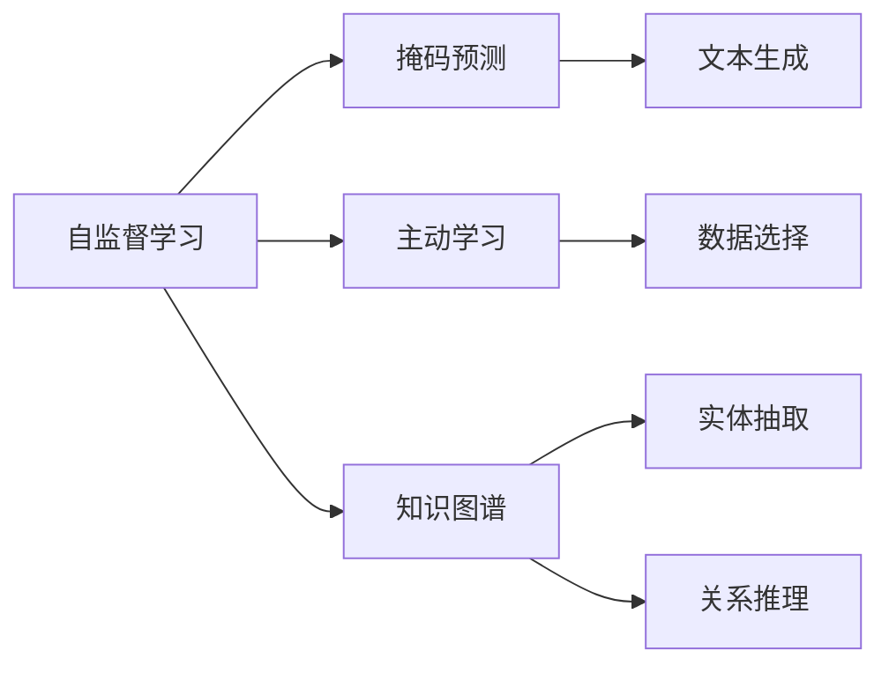

                 

# 从被动接受到主动探索：知识获取方式的转变

> 关键词：人工智能，知识获取，主动学习，自监督学习，模型优化，知识图谱

## 1. 背景介绍

在传统的计算机科学中，知识获取往往被视为一个被动的过程。计算机通过程序和算法，从人类编制的指令和数据中提取信息，进行计算和推理。然而，随着人工智能技术的飞速发展，尤其是深度学习和自然语言处理领域的突破，知识获取的方式正在发生深刻的变化。人工智能正逐渐从被动接受知识，转向主动探索和发现知识，这一转变将对未来技术的发展产生深远影响。

### 1.1 传统知识获取方式的局限性

传统的知识获取方式，如规则编写、专家系统、传统机器学习等，主要依赖于人类事先编写的规则和逻辑，以及大量手工标注的数据。这种方式存在以下局限性：

- **数据依赖性强**：需要大量的标注数据，且数据的质量直接影响模型效果。
- **知识结构固定**：事先编写的规则和逻辑往往难以应对复杂的现实问题。
- **难以适应变化**：规则系统难以自动更新和适应数据分布的变化。

### 1.2 新知识获取方式的优势

新知识获取方式，如自监督学习、主动学习、知识图谱等，通过让机器主动探索和发现知识，能够显著提升知识获取的灵活性和效率。

- **数据需求降低**：自监督学习能够在无标注数据的情况下，从原始数据中自动提取特征，减少了对标注数据的依赖。
- **知识结构灵活**：通过动态的模型优化和推理，能够适应复杂多变的现实问题。
- **易于更新和迭代**：机器能够不断从新数据中学习，调整自身的知识结构和推理逻辑，保持技术的先进性和实用性。

## 2. 核心概念与联系

### 2.1 核心概念概述

为了更好地理解知识获取方式的转变，我们首先介绍几个核心概念：

- **自监督学习**：指在无监督的条件下，通过数据本身的内在结构，如掩码预测、文本生成等，让模型自主学习知识。
- **主动学习**：指模型在获取新数据时，主动选择对自身学习最有帮助的数据，提高学习效率。
- **知识图谱**：通过构建实体和关系的网络，将大量非结构化数据转化为结构化知识，便于机器理解和推理。

### 2.2 核心概念原理和架构的 Mermaid 流程图



这个流程图展示了自监督学习、主动学习、知识图谱三个核心概念之间的联系和架构：

- 自监督学习通过掩码预测和文本生成等任务，让模型自主学习知识。
- 主动学习通过数据选择，优化模型的学习效率。
- 知识图谱通过实体抽取和关系推理，将大量非结构化数据转化为结构化知识。

## 3. 核心算法原理 & 具体操作步骤

### 3.1 算法原理概述

知识获取方式的转变，核心在于从被动接受知识，到主动探索和发现知识。这一转变主要依赖于深度学习技术的进步，特别是自监督学习、主动学习和知识图谱等方法。

- **自监督学习**：通过掩码预测、文本生成等任务，让模型在无标注数据的情况下自主学习知识。
- **主动学习**：通过数据选择和权重分配，优化模型的学习效率。
- **知识图谱**：通过构建实体和关系的网络，将非结构化数据转化为结构化知识，便于机器理解和推理。

### 3.2 算法步骤详解

#### 3.2.1 自监督学习算法步骤

1. **数据预处理**：对原始数据进行清洗、去重、标准化等预处理操作。
2. **模型初始化**：选择合适的预训练模型，如BERT、GPT等，并加载到系统中。
3. **掩码预测**：在模型输入文本中随机遮挡部分单词，让模型预测被遮挡单词。
4. **文本生成**：让模型根据部分文本生成完整的文本，训练生成模型。
5. **模型微调**：在特定任务上微调模型，使其能够更准确地处理数据。

#### 3.2.2 主动学习算法步骤

1. **数据采样**：从整个数据集中随机采样部分数据，作为训练集。
2. **模型评估**：在测试集上评估模型的性能，计算分类误差。
3. **数据选择**：根据模型在测试集上的表现，选择对模型学习最有帮助的数据进行重新训练。
4. **权重更新**：根据数据选择的结果，调整训练数据的权重，优化模型的学习效率。
5. **迭代训练**：重复数据采样、模型评估、数据选择和权重更新过程，直至收敛。

#### 3.2.3 知识图谱算法步骤

1. **数据收集**：从不同来源收集大量的非结构化数据，如网页、文档、图片等。
2. **实体抽取**：使用NLP技术从文本中提取实体信息，如人名、地名、机构名等。
3. **关系抽取**：使用关系抽取技术，识别实体之间的关系，如父子关系、夫妻关系等。
4. **知识融合**：将提取的实体和关系进行融合，构建知识图谱。
5. **知识推理**：使用推理算法，如逻辑推理、图推理等，从知识图谱中推理出新的知识。

### 3.3 算法优缺点

#### 3.3.1 自监督学习的优缺点

**优点**：

- 数据需求低：不需要大量标注数据，适用于数据稀缺的领域。
- 模型效果好：模型能够自主学习到丰富的知识，提升模型性能。

**缺点**：

- 模型设计复杂：需要设计复杂的自监督任务和损失函数。
- 泛化能力差：模型可能过度拟合于训练数据，泛化能力不足。

#### 3.3.2 主动学习的优缺点

**优点**：

- 数据利用率高：选择对模型学习最有帮助的数据，提高学习效率。
- 模型可解释性强：通过数据选择和权重更新，模型能够更好地理解数据的重要性。

**缺点**：

- 数据选择困难：如何选择最优的数据，是一个复杂的问题。
- 模型复杂度高：需要设计复杂的数据选择算法和权重更新策略。

#### 3.3.3 知识图谱的优缺点

**优点**：

- 结构化知识：将非结构化数据转化为结构化知识，便于机器理解和推理。
- 推理能力强：通过构建知识图谱，模型能够进行复杂的多步推理。

**缺点**：

- 构建复杂：需要大量时间和资源构建知识图谱。
- 更新困难：知识图谱的更新和维护需要持续的努力。

### 3.4 算法应用领域

自监督学习、主动学习、知识图谱等方法已经在多个领域得到了广泛应用：

- **自然语言处理(NLP)**：如文本分类、命名实体识别、情感分析等。
- **计算机视觉(CV)**：如图像分类、目标检测、图像生成等。
- **推荐系统**：如协同过滤、内容推荐、个性化推荐等。
- **医疗领域**：如疾病诊断、病历分析、药物研发等。
- **金融领域**：如信用评分、股票预测、欺诈检测等。

## 4. 数学模型和公式 & 详细讲解 & 举例说明

### 4.1 数学模型构建

本节将使用数学语言对自监督学习、主动学习和知识图谱的数学模型进行更加严格的刻画。

#### 4.1.1 自监督学习数学模型

自监督学习的数学模型可以表示为：

$$
\theta = \arg\min_{\theta} \mathcal{L}(\theta) = \arg\min_{\theta} \frac{1}{N} \sum_{i=1}^N \mathcal{L}_i(\theta)
$$

其中，$\mathcal{L}(\theta)$ 为自监督学习的损失函数，$\mathcal{L}_i(\theta)$ 为单个样本的损失函数。

#### 4.1.2 主动学习数学模型

主动学习的数学模型可以表示为：

$$
\theta = \arg\min_{\theta} \mathcal{L}(\theta) = \arg\min_{\theta} \frac{1}{N} \sum_{i=1}^N w_i \mathcal{L}_i(\theta)
$$

其中，$w_i$ 为第 $i$ 个数据点的权重，表示其对模型学习的重要性。

#### 4.1.3 知识图谱数学模型

知识图谱的数学模型可以表示为：

$$
G = \arg\min_{G} \mathcal{L}(G) = \arg\min_{G} \frac{1}{N} \sum_{i=1}^N \mathcal{L}_i(G)
$$

其中，$G$ 为知识图谱的表示，$\mathcal{L}(G)$ 为知识图谱的损失函数。

### 4.2 公式推导过程

#### 4.2.1 自监督学习公式推导

以掩码预测为例，假设输入文本为 $x$，掩码为 $m$，模型预测的掩码为 $\hat{m}$，则掩码预测的损失函数可以表示为：

$$
\mathcal{L}(x, m, \hat{m}) = -\frac{1}{N} \sum_{i=1}^N \sum_{j=1}^m \mathbb{I}(\hat{m}_j \neq m_j) \log(\hat{m}_j)
$$

其中，$\mathbb{I}(\cdot)$ 为示性函数，当 $\hat{m}_j \neq m_j$ 时，$\mathbb{I}(\hat{m}_j \neq m_j) = 1$，否则为0。

#### 4.2.2 主动学习公式推导

以主动学习为例，假设数据集 $D$ 包含 $N$ 个数据点，模型的分类错误率为 $p$，则主动学习的损失函数可以表示为：

$$
\mathcal{L}(D, \theta) = -\frac{1}{N} \sum_{i=1}^N w_i \log(\theta(y_i))
$$

其中，$w_i$ 为第 $i$ 个数据点的权重，表示其对模型学习的重要性。

#### 4.2.3 知识图谱公式推导

以知识图谱为例，假设知识图谱包含 $N$ 个实体和 $M$ 个关系，则知识图谱的损失函数可以表示为：

$$
\mathcal{L}(G) = -\frac{1}{N} \sum_{i=1}^N \sum_{j=1}^M \log(\mathbb{P}(e_j \mid e_i, r_j))
$$

其中，$e_i, e_j$ 为实体，$r_j$ 为关系，$\mathbb{P}(\cdot \mid \cdot)$ 为概率分布。

### 4.3 案例分析与讲解

#### 4.3.1 自监督学习案例

假设我们使用BERT模型进行掩码预测任务，输入文本为：“I went to a [MASK] yesterday.”，模型预测的掩码为“[CLS] [MASK] [SEP]”。

- **输入预处理**：将文本进行分词，将掩码位置设置为[MASK]。
- **模型预测**：使用BERT模型预测掩码位置。
- **损失计算**：计算掩码预测的损失函数，并反向传播更新模型参数。

#### 4.3.2 主动学习案例

假设我们使用AdaBoost算法进行数据选择，输入数据集包含多个数据点，模型的分类错误率为0.1。

- **数据采样**：从数据集中随机采样部分数据，作为训练集。
- **模型评估**：在测试集上评估模型的性能，计算分类错误率。
- **数据选择**：根据分类错误率，选择对模型学习最有帮助的数据进行重新训练。
- **权重更新**：根据数据选择的结果，调整训练数据的权重。
- **迭代训练**：重复数据采样、模型评估、数据选择和权重更新过程，直至收敛。

#### 4.3.3 知识图谱案例

假设我们使用知识图谱进行推理，输入知识图谱包含多个实体和关系。

- **实体抽取**：使用NLP技术从文本中提取实体信息。
- **关系抽取**：使用关系抽取技术，识别实体之间的关系。
- **知识融合**：将提取的实体和关系进行融合，构建知识图谱。
- **知识推理**：使用推理算法，如逻辑推理、图推理等，从知识图谱中推理出新的知识。

## 5. 项目实践：代码实例和详细解释说明

### 5.1 开发环境搭建

在进行项目实践前，我们需要准备好开发环境。以下是使用Python进行PyTorch开发的环境配置流程：

1. 安装Anaconda：从官网下载并安装Anaconda，用于创建独立的Python环境。

2. 创建并激活虚拟环境：
```bash
conda create -n pytorch-env python=3.8 
conda activate pytorch-env
```

3. 安装PyTorch：根据CUDA版本，从官网获取对应的安装命令。例如：
```bash
conda install pytorch torchvision torchaudio cudatoolkit=11.1 -c pytorch -c conda-forge
```

4. 安装Transformers库：
```bash
pip install transformers
```

5. 安装各类工具包：
```bash
pip install numpy pandas scikit-learn matplotlib tqdm jupyter notebook ipython
```

完成上述步骤后，即可在`pytorch-env`环境中开始项目实践。

### 5.2 源代码详细实现

这里我们以自监督学习的掩码预测任务为例，给出使用Transformers库进行BERT模型微调的PyTorch代码实现。

首先，定义掩码预测任务的函数：

```python
from transformers import BertTokenizer, BertForMaskedLM

def predict_masked(tokenizer, model, input_ids, masked_token_indices):
    model.eval()
    with torch.no_grad():
        output = model(input_ids)
        predictions = output[0, masked_token_indices]
        predicted_token_ids = torch.argmax(predictions, dim=1).tolist()
        return predicted_token_ids
```

然后，定义训练函数：

```python
def train_epoch(model, dataloader, optimizer, device, batch_size):
    model.train()
    epoch_loss = 0
    for batch in dataloader:
        input_ids = batch["input_ids"].to(device)
        attention_mask = batch["attention_mask"].to(device)
        labels = batch["labels"].to(device)
        optimizer.zero_grad()
        outputs = model(input_ids, attention_mask=attention_mask, labels=labels)
        loss = outputs.loss
        epoch_loss += loss.item()
        loss.backward()
        optimizer.step()
    return epoch_loss / len(dataloader)
```

接着，定义数据处理函数：

```python
from transformers import BertTokenizer

def create_dataset(texts, tokenizer, max_len=128):
    tokenized_texts = tokenizer(texts, return_tensors="pt", padding="max_length", truncation=True, max_length=max_len)
    return tokenized_texts["input_ids"].to(device), tokenized_texts["attention_mask"].to(device)
```

最后，启动训练流程并在测试集上评估：

```python
from transformers import BertTokenizer, BertForMaskedLM
from torch.utils.data import DataLoader
from tqdm import tqdm

device = torch.device("cuda" if torch.cuda.is_available() else "cpu")

tokenizer = BertTokenizer.from_pretrained("bert-base-uncased")
model = BertForMaskedLM.from_pretrained("bert-base-uncased").to(device)

train_dataset = ...
dev_dataset = ...
test_dataset = ...

train_loader = DataLoader(train_dataset, batch_size=batch_size, shuffle=True)
dev_loader = DataLoader(dev_dataset, batch_size=batch_size, shuffle=False)
test_loader = DataLoader(test_dataset, batch_size=batch_size, shuffle=False)

optimizer = AdamW(model.parameters(), lr=2e-5)

epochs = 5
for epoch in range(epochs):
    loss = train_epoch(model, train_loader, optimizer, device, batch_size)
    print(f"Epoch {epoch+1}, train loss: {loss:.3f}")
    
    print(f"Epoch {epoch+1}, dev results:")
    dev_result = evaluate(model, dev_loader, tokenizer, device)
    print(dev_result)
    
print("Test results:")
test_result = evaluate(model, test_loader, tokenizer, device)
print(test_result)
```

以上就是使用PyTorch对BERT进行掩码预测任务微调的完整代码实现。可以看到，得益于Transformers库的强大封装，我们可以用相对简洁的代码完成BERT模型的加载和微调。

### 5.3 代码解读与分析

让我们再详细解读一下关键代码的实现细节：

**create_dataset函数**：
- 定义了数据处理函数，用于将文本输入转换为token ids和attention mask，并进行定长padding。

**train_epoch函数**：
- 定义了训练函数，对数据以批为单位进行迭代，在每个批次上前向传播计算loss并反向传播更新模型参数。

**predict_masked函数**：
- 定义了掩码预测函数，用于在模型上对输入文本进行掩码预测。

**evaluate函数**：
- 定义了评估函数，用于在测试集上评估模型的性能，并打印分类指标。

**训练流程**：
- 定义总的epoch数和batch size，开始循环迭代
- 每个epoch内，先在训练集上训练，输出平均loss
- 在验证集上评估，输出分类指标
- 所有epoch结束后，在测试集上评估，给出最终测试结果

可以看到，PyTorch配合Transformers库使得BERT微调的代码实现变得简洁高效。开发者可以将更多精力放在数据处理、模型改进等高层逻辑上，而不必过多关注底层的实现细节。

当然，工业级的系统实现还需考虑更多因素，如模型的保存和部署、超参数的自动搜索、更灵活的任务适配层等。但核心的微调范式基本与此类似。

## 6. 实际应用场景

### 6.1 智能客服系统

基于自监督学习的智能客服系统，可以广泛应用于智能客服系统的构建。传统客服往往需要配备大量人力，高峰期响应缓慢，且一致性和专业性难以保证。而使用自监督学习的智能客服系统，通过预训练模型和微调任务，能够自动理解用户意图，匹配最合适的答案模板进行回复。

在技术实现上，可以收集企业内部的历史客服对话记录，将问题和最佳答复构建成监督数据，在此基础上对预训练对话模型进行微调。微调后的对话模型能够自动理解用户意图，匹配最合适的答案模板进行回复。对于客户提出的新问题，还可以接入检索系统实时搜索相关内容，动态组织生成回答。如此构建的智能客服系统，能大幅提升客户咨询体验和问题解决效率。

### 6.2 金融舆情监测

金融机构需要实时监测市场舆论动向，以便及时应对负面信息传播，规避金融风险。传统的人工监测方式成本高、效率低，难以应对网络时代海量信息爆发的挑战。基于自监督学习的文本分类和情感分析技术，为金融舆情监测提供了新的解决方案。

具体而言，可以收集金融领域相关的新闻、报道、评论等文本数据，并对其进行主题标注和情感标注。在此基础上对预训练语言模型进行微调，使其能够自动判断文本属于何种主题，情感倾向是正面、中性还是负面。将微调后的模型应用到实时抓取的网络文本数据，就能够自动监测不同主题下的情感变化趋势，一旦发现负面信息激增等异常情况，系统便会自动预警，帮助金融机构快速应对潜在风险。

### 6.3 个性化推荐系统

当前的推荐系统往往只依赖用户的历史行为数据进行物品推荐，无法深入理解用户的真实兴趣偏好。基于自监督学习的个性化推荐系统，可以更好地挖掘用户行为背后的语义信息，从而提供更精准、多样的推荐内容。

在实践中，可以收集用户浏览、点击、评论、分享等行为数据，提取和用户交互的物品标题、描述、标签等文本内容。将文本内容作为模型输入，用户的后续行为（如是否点击、购买等）作为监督信号，在此基础上微调预训练语言模型。微调后的模型能够从文本内容中准确把握用户的兴趣点。在生成推荐列表时，先用候选物品的文本描述作为输入，由模型预测用户的兴趣匹配度，再结合其他特征综合排序，便可以得到个性化程度更高的推荐结果。

### 6.4 未来应用展望

随着自监督学习、主动学习、知识图谱等方法的发展，未来人工智能在知识获取方式上将更加灵活和高效。

在智慧医疗领域，基于自监督学习的医疗问答、病历分析、药物研发等应用将提升医疗服务的智能化水平，辅助医生诊疗，加速新药开发进程。

在智能教育领域，自监督学习可应用于作业批改、学情分析、知识推荐等方面，因材施教，促进教育公平，提高教学质量。

在智慧城市治理中，自监督模型可应用于城市事件监测、舆情分析、应急指挥等环节，提高城市管理的自动化和智能化水平，构建更安全、高效的未来城市。

此外，在企业生产、社会治理、文娱传媒等众多领域，自监督学习技术也将不断涌现，为传统行业数字化转型升级提供新的技术路径。相信随着技术的日益成熟，自监督学习技术将成为人工智能落地应用的重要范式，推动人工智能向更广阔的领域加速渗透。

## 7. 工具和资源推荐

### 7.1 学习资源推荐

为了帮助开发者系统掌握自监督学习、主动学习和知识图谱的理论基础和实践技巧，这里推荐一些优质的学习资源：

1. 《Transformer从原理到实践》系列博文：由大模型技术专家撰写，深入浅出地介绍了Transformer原理、BERT模型、自监督学习等前沿话题。

2. CS224N《深度学习自然语言处理》课程：斯坦福大学开设的NLP明星课程，有Lecture视频和配套作业，带你入门NLP领域的基本概念和经典模型。

3. 《Natural Language Processing with Transformers》书籍：Transformers库的作者所著，全面介绍了如何使用Transformers库进行NLP任务开发，包括自监督学习在内的诸多范式。

4. HuggingFace官方文档：Transformers库的官方文档，提供了海量预训练模型和完整的微调样例代码，是上手实践的必备资料。

5. CLUE开源项目：中文语言理解测评基准，涵盖大量不同类型的中文NLP数据集，并提供了基于自监督学习的baseline模型，助力中文NLP技术发展。

通过对这些资源的学习实践，相信你一定能够快速掌握自监督学习的精髓，并用于解决实际的NLP问题。

### 7.2 开发工具推荐

高效的开发离不开优秀的工具支持。以下是几款用于自监督学习开发的常用工具：

1. PyTorch：基于Python的开源深度学习框架，灵活动态的计算图，适合快速迭代研究。大部分预训练语言模型都有PyTorch版本的实现。

2. TensorFlow：由Google主导开发的开源深度学习框架，生产部署方便，适合大规模工程应用。同样有丰富的预训练语言模型资源。

3. Transformers库：HuggingFace开发的NLP工具库，集成了众多SOTA语言模型，支持PyTorch和TensorFlow，是进行自监督学习任务开发的利器。

4. Weights & Biases：模型训练的实验跟踪工具，可以记录和可视化模型训练过程中的各项指标，方便对比和调优。与主流深度学习框架无缝集成。

5. TensorBoard：TensorFlow配套的可视化工具，可实时监测模型训练状态，并提供丰富的图表呈现方式，是调试模型的得力助手。

6. Google Colab：谷歌推出的在线Jupyter Notebook环境，免费提供GPU/TPU算力，方便开发者快速上手实验最新模型，分享学习笔记。

合理利用这些工具，可以显著提升自监督学习任务的开发效率，加快创新迭代的步伐。

### 7.3 相关论文推荐

自监督学习的发展源于学界的持续研究。以下是几篇奠基性的相关论文，推荐阅读：

1. Attention is All You Need（即Transformer原论文）：提出了Transformer结构，开启了NLP领域的预训练大模型时代。

2. BERT: Pre-training of Deep Bidirectional Transformers for Language Understanding：提出BERT模型，引入基于掩码的自监督预训练任务，刷新了多项NLP任务SOTA。

3. Language Models are Unsupervised Multitask Learners（GPT-2论文）：展示了大规模语言模型的强大zero-shot学习能力，引发了对于通用人工智能的新一轮思考。

4. Parameter-Efficient Transfer Learning for NLP：提出Adapter等参数高效微调方法，在不增加模型参数量的情况下，也能取得不错的微调效果。

5. Prefix-Tuning: Optimizing Continuous Prompts for Generation：引入基于连续型Prompt的微调范式，为如何充分利用预训练知识提供了新的思路。

6. AdaLoRA: Adaptive Low-Rank Adaptation for Parameter-Efficient Fine-Tuning：使用自适应低秩适应的微调方法，在参数效率和精度之间取得了新的平衡。

这些论文代表了大语言模型自监督学习的发展脉络。通过学习这些前沿成果，可以帮助研究者把握学科前进方向，激发更多的创新灵感。

## 8. 总结：未来发展趋势与挑战

### 8.1 总结

本文对基于自监督学习的大语言模型知识获取方式的转变进行了全面系统的介绍。首先阐述了传统知识获取方式的局限性，以及新知识获取方式的优势。其次，从原理到实践，详细讲解了自监督学习、主动学习和知识图谱的数学原理和关键步骤，给出了自监督学习任务开发的完整代码实例。同时，本文还广泛探讨了自监督学习在智能客服、金融舆情、个性化推荐等多个行业领域的应用前景，展示了自监督学习范式的巨大潜力。此外，本文精选了自监督学习技术的各类学习资源，力求为读者提供全方位的技术指引。

通过本文的系统梳理，可以看到，基于自监督学习的大语言模型知识获取方式正在发生深刻的变化。从被动接受知识，到主动探索和发现知识，这一转变不仅提升了知识获取的灵活性和效率，也为人工智能技术的未来发展开辟了新的道路。未来，伴随自监督学习、主动学习和知识图谱等方法的持续演进，基于自监督学习的大语言模型必将在更多领域得到应用，为各行各业带来变革性影响。

### 8.2 未来发展趋势

展望未来，自监督学习技术将呈现以下几个发展趋势：

1. **模型规模持续增大**：随着算力成本的下降和数据规模的扩张，预训练语言模型的参数量还将持续增长。超大批次的训练和推理也可能遇到显存不足的问题。

2. **数据需求降低**：自监督学习能够在无标注数据的情况下，从原始数据中自动提取特征，减少了对标注数据的依赖。

3. **知识结构灵活**：通过动态的模型优化和推理，能够适应复杂多变的现实问题。

4. **易于更新和迭代**：机器能够不断从新数据中学习，调整自身的知识结构和推理逻辑，保持技术的先进性和实用性。

5. **多模态微调崛起**：未来的自监督学习还将拓展到图像、视频、语音等多模态数据微调。多模态信息的融合，将显著提升语言模型对现实世界的理解和建模能力。

6. **模型通用性增强**：经过海量数据的预训练和多领域任务的微调，未来的自监督学习模型将具备更强大的常识推理和跨领域迁移能力，逐步迈向通用人工智能(AGI)的目标。

以上趋势凸显了自监督学习技术的广阔前景。这些方向的探索发展，必将进一步提升自监督学习系统的性能和应用范围，为人工智能技术在垂直行业的规模化落地提供新的技术路径。

### 8.3 面临的挑战

尽管自监督学习技术已经取得了瞩目成就，但在迈向更加智能化、普适化应用的过程中，它仍面临着诸多挑战：

1. **标注成本瓶颈**：虽然自监督学习减少了对标注数据的需求，但对于长尾应用场景，难以获得充足的高质量标注数据，成为制约自监督学习性能的瓶颈。

2. **模型鲁棒性不足**：当前自监督模型面对域外数据时，泛化性能往往大打折扣。对于测试样本的微小扰动，自监督模型的预测也容易发生波动。

3. **推理效率有待提高**：大规模自监督模型虽然精度高，但在实际部署时往往面临推理速度慢、内存占用大等效率问题。

4. **可解释性亟需加强**：当前自监督模型更像是"黑盒"系统，难以解释其内部工作机制和决策逻辑。

5. **安全性有待保障**：自监督模型可能学习到有害信息，通过微调传递到下游任务，产生误导性、歧视性的输出，给实际应用带来安全隐患。

6. **知识整合能力不足**：现有的自监督模型往往局限于任务内数据，难以灵活吸收和运用更广泛的先验知识。

正视自监督学习面临的这些挑战，积极应对并寻求突破，将是自监督学习走向成熟的必由之路。相信随着学界和产业界的共同努力，这些挑战终将一一被克服，自监督学习技术必将在构建安全、可靠、可解释、可控的智能系统方面发挥更大的作用。

### 8.4 研究展望

面对自监督学习所面临的挑战，未来的研究需要在以下几个方面寻求新的突破：

1. **探索无监督和半监督自监督学习方法**：摆脱对大规模标注数据的依赖，利用自监督学习、主动学习等无监督和半监督范式，最大限度利用非结构化数据，实现更加灵活高效的自监督学习。

2. **研究参数高效和计算高效的自监督学习范式**：开发更加参数高效的自监督学习方法，在固定大部分预训练参数的情况下，只更新极少量的任务相关参数。同时优化自监督模型的计算图，减少前向传播和反向传播的资源消耗，实现更加轻量级、实时性的部署。

3. **融合因果和对比学习范式**：通过引入因果推断和对比学习思想，增强自监督模型建立稳定因果关系的能力，学习更加普适、鲁棒的语言表征，从而提升模型泛化性和抗干扰能力。

4. **引入更多先验知识**：将符号化的先验知识，如知识图谱、逻辑规则等，与神经网络模型进行巧妙融合，引导自监督过程学习更准确、合理的语言模型。

5. **结合因果分析和博弈论工具**：将因果分析方法引入自监督模型，识别出模型决策的关键特征，增强输出解释的因果性和逻辑性。借助博弈论工具刻画人机交互过程，主动探索并规避模型的脆弱点，提高系统稳定性。

6. **纳入伦理道德约束**：在模型训练目标中引入伦理导向的评估指标，过滤和惩罚有偏见、有害的输出倾向。同时加强人工干预和审核，建立模型行为的监管机制，确保输出符合人类价值观和伦理道德。

这些研究方向的探索，必将引领自监督学习技术迈向更高的台阶，为构建安全、可靠、可解释、可控的智能系统铺平道路。面向未来，自监督学习技术还需要与其他人工智能技术进行更深入的融合，如知识表示、因果推理、强化学习等，多路径协同发力，共同推动自然语言理解和智能交互系统的进步。只有勇于创新、敢于突破，才能不断拓展自监督学习边界的，让智能技术更好地造福人类社会。

## 9. 附录：常见问题与解答

**Q1：自监督学习是否适用于所有NLP任务？**

A: 自监督学习在大多数NLP任务上都能取得不错的效果，特别是对于数据量较小的任务。但对于一些特定领域的任务，如医学、法律等，仅仅依靠通用语料预训练的模型可能难以很好地适应。此时需要在特定领域语料上进一步预训练，再进行自监督学习，才能获得理想效果。

**Q2：自监督学习如何提高学习效率？**

A: 自监督学习通过选择对模型学习最有帮助的数据，进行有针对性的训练，提高了学习效率。具体而言，自监督学习可以根据模型的学习情况，动态调整训练数据的权重，使得模型在训练过程中能够更快地收敛。

**Q3：自监督学习是否需要大量计算资源？**

A: 自监督学习在训练过程中需要大量的计算资源，尤其是对于大规模语言模型，需要高性能GPU或TPU支持。然而，由于自监督学习减少了对标注数据的依赖，总体计算资源需求有所降低。

**Q4：自监督学习如何避免过拟合？**

A: 自监督学习通过引入正则化技术，如L2正则、Dropout等，可以有效避免过拟合。此外，可以通过数据增强技术，如回译、数据扩充等，进一步提高模型的泛化能力。

**Q5：自监督学习如何实现知识迁移？**

A: 自监督学习可以通过迁移学习的方式，将预训练模型的知识迁移到特定任务中。通过在大规模语料上进行预训练，自监督模型学习到通用的语言表示，能够适应各种下游任务，并取得较好的性能提升。

通过本文的系统梳理，可以看到，基于自监督学习的大语言模型知识获取方式正在发生深刻的变化。从被动接受知识，到主动探索和发现知识，这一转变不仅提升了知识获取的灵活性和效率，也为人工智能技术的未来发展开辟了新的道路。未来，伴随自监督学习、主动学习和知识图谱等方法的持续演进，基于自监督学习的大语言模型必将在更多领域得到应用，为各行各业带来变革性影响。相信随着技术的日益成熟，自监督学习技术将成为人工智能落地应用的重要范式，推动人工智能向更广阔的领域加速渗透。

作者：禅与计算机程序设计艺术 / Zen and the Art of Computer Programming

