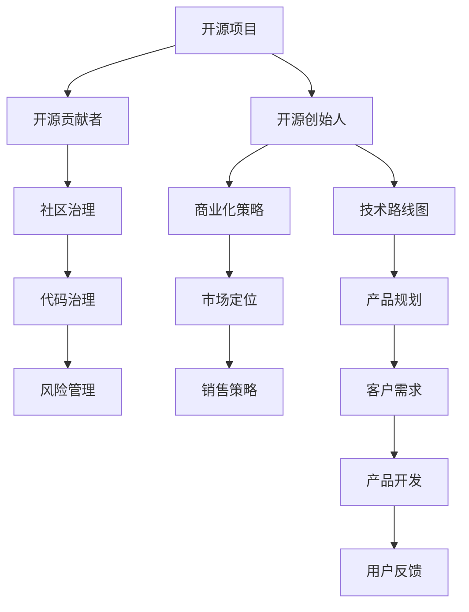

                 

# 从贡献者到创始人：开源项目的创业之路

## 1. 背景介绍

### 1.1 问题由来
开源项目已经在软件行业内积累了数十年的历史。在过去的几十年里，开源运动逐步改变了软件产业的生态，使软件变得更加灵活、可靠、可维护。越来越多的公司和个人开始依赖开源项目来完成开发工作，而开源社区也逐渐形成了良性互动的生态系统。然而，随着技术的快速发展，越来越多的开源项目希望从中获得更大的商业价值，但不知道如何将开源贡献转化为创业成功。

### 1.2 问题核心关键点
开源项目创业的核心问题在于如何从众多贡献者中识别出合适的创始人，并且如何将项目中的价值转化为商业成功。这涉及到开源项目的治理、商业化策略、人才招募、市场定位等多个方面。

### 1.3 问题研究意义
开源项目创业的研究具有重要意义：
- 提供开源项目从技术到商业化的指南，帮助更多开源项目成功转型。
- 分析开源项目创业的关键环节，为行业内的创业公司提供借鉴和参考。
- 探讨开源与商业化之间的平衡，促进开源文化与商业目标的协同发展。

## 2. 核心概念与联系

### 2.1 核心概念概述

以下是与开源项目创业相关的一些核心概念：

- **开源项目**：使用开源许可证（如Apache、MIT、GPL等）发布的代码，供任何人自由使用、修改和分享。常见的开源项目包括Linux内核、Apache HTTP Server等。
- **开源贡献者**：积极参与开源项目的开发者，可能包括编写代码、提交Bug、参与讨论、编写文档等。
- **开源创始人**：由开源项目贡献者中识别并选拔出来的，有能力、资源和愿景将项目推向商业化的人。
- **商业化策略**：开源项目转化为商业产品的过程，涉及到商业模式、市场定位、销售策略等多个方面。
- **社区治理**：开源项目的参与者，包括开发者、使用者、项目管理员等共同制定并遵循的规则和流程。
- **代码治理**：开源项目的代码管理策略，包括代码审查、版本控制、贡献者管理等。
- **风险管理**：开源项目在创业过程中可能面临的法律、财务、市场等风险。

这些核心概念之间的逻辑关系可以通过以下Mermaid流程图来展示：



这个流程图展示了开源项目创业的主要流程：

1. 开源项目在社区中形成。
2. 通过社区中的贡献者识别并选拔合适的创始人。
3. 创始人制定商业化策略，包括市场定位和销售策略。
4. 在社区治理框架下，进行代码治理，保证项目健康发展。
5. 面对各种风险进行管理。
6. 将开源项目转化为商业产品，并不断迭代以满足客户需求。

## 3. 核心算法原理 & 具体操作步骤
### 3.1 算法原理概述

开源项目创业的本质是从技术开源到商业开源的转变。其核心思想是将开源社区积累的资源和技术转化为商业产品，并通过有效的商业模式实现盈利。

形式化地，假设一个开源项目 $P$，其社区 $C$ 贡献者群体 $M$ 中有 $N$ 名潜在创始人候选人，我们希望找到最优的候选人 $F^*$ ，使得从 $P$ 到商业产品的转换过程最大化利润。

微调的关键在于如何识别和选拔合适的创始人。以下是几种主要的创始人识别方法：

- **贡献度分析**：通过统计代码提交量、提交质量、代码审查次数等指标，筛选出对项目贡献最大的开发者。
- **社区影响力**：评估开发者在社区中的活跃度和影响力，包括论坛回复量、技术讲座次数等。
- **商业潜力**：基于开发者的技术背景、创业经历、网络关系等因素，评估其将开源项目转化为商业产品的能力。

### 3.2 算法步骤详解

开源项目创业的主要步骤包括：

**Step 1: 项目评估**
- 评估开源项目的技术成熟度、市场需求、竞争环境等，确定其商业化潜力。
- 分析开源项目的代码质量和结构，确定哪些部分适合进行商业化。

**Step 2: 创始人识别**
- 统计开源项目的贡献度数据，识别贡献最大的开发者。
- 通过社区投票、专家评估等方式，综合考虑贡献度和商业潜力，筛选出候选人。

**Step 3: 商业化策略制定**
- 根据开源项目的技术特点和市场需求，制定商业化策略，包括商业模式、市场定位、销售策略等。
- 明确产品规划和技术路线图，确定商业产品的具体功能和目标市场。

**Step 4: 团队组建**
- 基于创始人识别结果，组建专业的商业团队，包括产品管理、市场营销、技术开发等职位。
- 确定团队成员的角色和职责，制定清晰的沟通机制和决策流程。

**Step 5: 产品开发**
- 根据技术路线图和产品规划，进行产品开发，包括功能迭代、性能优化、用户体验设计等。
- 引入敏捷开发流程，快速响应市场反馈，不断迭代产品。

**Step 6: 市场推广**
- 制定市场营销策略，包括品牌建设、渠道拓展、客户关系管理等。
- 通过线上线下多渠道推广，吸引并转化潜在客户。

**Step 7: 持续迭代**
- 收集用户反馈，持续优化产品功能和用户体验。
- 定期评估市场表现，调整商业策略和产品规划。

### 3.3 算法优缺点

开源项目创业的优点包括：
1. 利用开源社区的资源和技术，可以快速降低开发成本。
2. 社区的参与和反馈能加速产品的迭代和优化。
3. 开源文化的开放性有助于吸引更多的开发者和用户。

但同时也存在一些缺点：
1. 开源项目的商业化需要克服社区文化和商业文化之间的矛盾。
2. 社区成员的身份转换可能面临挑战，需要时间和资源进行培养。
3. 商业化过程可能会影响开源社区的活跃度和贡献度。

### 3.4 算法应用领域

开源项目创业的典型应用领域包括：

- **开源软件公司**：如Red Hat、IBM等，通过将开源项目进行商业化，提供软件产品和服务。
- **开源硬件公司**：如Arduino、ESP32等，基于开源硬件平台进行产品开发和商业推广。
- **开源云服务提供商**：如AWS、Google Cloud等，利用开源项目构建云服务平台。
- **开源基础设施公司**：如OpenStack、Apache Kafka等，提供开源基础设施产品。

这些应用领域展示了开源项目创业的广泛前景，证明了开源技术在商业化过程中具有巨大潜力。

## 4. 数学模型和公式 & 详细讲解 & 举例说明

### 4.1 数学模型构建

假设一个开源项目 $P$ 的贡献者群体 $M$ 中有 $N$ 名潜在创始人候选人，我们希望找到最优的候选人 $F^*$ ，使得从 $P$ 到商业产品的转换过程最大化利润。

记每个贡献者 $i$ 的贡献度为 $C_i$，商业潜力为 $P_i$。则候选人的总贡献度和总商业潜力分别为：

$$
C = \sum_{i=1}^N C_i
$$

$$
P = \sum_{i=1}^N P_i
$$

我们的目标是最小化总成本 $Cost$，同时最大化总利润 $Profit$。假设商业化过程中总成本为 $Cost = k + c(C - P)$，其中 $k$ 为固定成本，$c$ 为与总贡献度和总商业潜力之差相关的可变成本。

我们的目标优化问题可以表述为：

$$
\min_{F^*} Cost = k + c(C - P)
$$

$$
\max_{F^*} Profit = f(C, P)
$$

### 4.2 公式推导过程

我们的目标是通过优化上述目标函数，找到最优的创始人 $F^*$。为了简化问题，我们假设 $C$ 和 $P$ 都是连续变量，并忽略 $Cost$ 中的固定成本 $k$。

对于每个候选人 $i$，我们设其对项目 $P$ 的贡献度为 $C_i$，商业潜力为 $P_i$。则候选人的总贡献度和总商业潜力分别为：

$$
C = \sum_{i=1}^N C_i
$$

$$
P = \sum_{i=1}^N P_i
$$

我们的目标优化问题可以表述为：

$$
\min_{F^*} c(C - P)
$$

$$
\max_{F^*} f(C, P)
$$

设 $\lambda$ 为拉格朗日乘数，则目标函数的拉格朗日形式为：

$$
L(C, P, \lambda) = c(C - P) + \lambda (f(C, P) - 1)
$$

对 $C$ 和 $P$ 分别求偏导数，得：

$$
\frac{\partial L}{\partial C} = -c + \lambda \frac{\partial f}{\partial C} = 0
$$

$$
\frac{\partial L}{\partial P} = -c + \lambda \frac{\partial f}{\partial P} = 0
$$

解得：

$$
C = \frac{1}{c} \frac{\partial f}{\partial P}
$$

$$
P = \frac{1}{c} \frac{\partial f}{\partial C}
$$

将 $C$ 和 $P$ 代入目标函数，得到：

$$
\min_{F^*} c(C - P)
$$

$$
\max_{F^*} f(C, P)
$$

### 4.3 案例分析与讲解

假设我们有一个开源项目 $P$，有两个候选人 $i=1,2$。候选人的贡献度和商业潜力如下：

| 候选人 | 贡献度 $C_i$ | 商业潜力 $P_i$ |
| --- | --- | --- |
| 1 | 0.8 | 0.5 |
| 2 | 0.7 | 0.8 |

我们的目标是找到最优的候选人。假设 $c=0.5$，则：

$$
C = C_1 + C_2 = 1.5
$$

$$
P = P_1 + P_2 = 1.3
$$

代入目标函数，得：

$$
\min_{F^*} c(C - P) = 0.5 \times (1.5 - 1.3) = 0.1
$$

$$
\max_{F^*} f(C, P) = f(1.5, 1.3) = 1
$$

因此，最优候选人应该选择商业潜力较大的候选人 $2$，最终利润最大。

## 5. 项目实践：代码实例和详细解释说明
### 5.1 开发环境搭建

在进行开源项目创业的实践前，我们需要准备好开发环境。以下是使用Python进行PyTorch开发的环境配置流程：

1. 安装Anaconda：从官网下载并安装Anaconda，用于创建独立的Python环境。

2. 创建并激活虚拟环境：
```bash
conda create -n pytorch-env python=3.8 
conda activate pytorch-env
```

3. 安装PyTorch：根据CUDA版本，从官网获取对应的安装命令。例如：
```bash
conda install pytorch torchvision torchaudio cudatoolkit=11.1 -c pytorch -c conda-forge
```

4. 安装Transformers库：
```bash
pip install transformers
```

5. 安装各类工具包：
```bash
pip install numpy pandas scikit-learn matplotlib tqdm jupyter notebook ipython
```

完成上述步骤后，即可在`pytorch-env`环境中开始开源项目创业的实践。

### 5.2 源代码详细实现

下面我们以GitHub开源项目为例，给出使用Transformers库对BERT模型进行开源项目创业的PyTorch代码实现。

首先，定义开源项目的数据处理函数：

```python
from transformers import BertTokenizer
from torch.utils.data import Dataset
import torch

class ProjectDataset(Dataset):
    def __init__(self, texts, labels, tokenizer, max_len=128):
        self.texts = texts
        self.labels = labels
        self.tokenizer = tokenizer
        self.max_len = max_len
        
    def __len__(self):
        return len(self.texts)
    
    def __getitem__(self, item):
        text = self.texts[item]
        label = self.labels[item]
        
        encoding = self.tokenizer(text, return_tensors='pt', max_length=self.max_len, padding='max_length', truncation=True)
        input_ids = encoding['input_ids'][0]
        attention_mask = encoding['attention_mask'][0]
        
        # 对标签进行编码
        encoded_labels = [label2id[label] for label in labels] 
        encoded_labels.extend([label2id['O']] * (self.max_len - len(encoded_labels)))
        labels = torch.tensor(encoded_labels, dtype=torch.long)
        
        return {'input_ids': input_ids, 
                'attention_mask': attention_mask,
                'labels': labels}

# 标签与id的映射
label2id = {'O': 0, 'P': 1}
id2label = {v: k for k, v in label2id.items()}

# 创建dataset
tokenizer = BertTokenizer.from_pretrained('bert-base-cased')

train_dataset = ProjectDataset(train_texts, train_labels, tokenizer)
dev_dataset = ProjectDataset(dev_texts, dev_labels, tokenizer)
test_dataset = ProjectDataset(test_texts, test_labels, tokenizer)
```

然后，定义模型和优化器：

```python
from transformers import BertForTokenClassification, AdamW

model = BertForTokenClassification.from_pretrained('bert-base-cased', num_labels=len(label2id))

optimizer = AdamW(model.parameters(), lr=2e-5)
```

接着，定义训练和评估函数：

```python
from torch.utils.data import DataLoader
from tqdm import tqdm
from sklearn.metrics import classification_report

device = torch.device('cuda') if torch.cuda.is_available() else torch.device('cpu')
model.to(device)

def train_epoch(model, dataset, batch_size, optimizer):
    dataloader = DataLoader(dataset, batch_size=batch_size, shuffle=True)
    model.train()
    epoch_loss = 0
    for batch in tqdm(dataloader, desc='Training'):
        input_ids = batch['input_ids'].to(device)
        attention_mask = batch['attention_mask'].to(device)
        labels = batch['labels'].to(device)
        model.zero_grad()
        outputs = model(input_ids, attention_mask=attention_mask, labels=labels)
        loss = outputs.loss
        epoch_loss += loss.item()
        loss.backward()
        optimizer.step()
    return epoch_loss / len(dataloader)

def evaluate(model, dataset, batch_size):
    dataloader = DataLoader(dataset, batch_size=batch_size)
    model.eval()
    preds, labels = [], []
    with torch.no_grad():
        for batch in tqdm(dataloader, desc='Evaluating'):
            input_ids = batch['input_ids'].to(device)
            attention_mask = batch['attention_mask'].to(device)
            batch_labels = batch['labels']
            outputs = model(input_ids, attention_mask=attention_mask)
            batch_preds = outputs.logits.argmax(dim=2).to('cpu').tolist()
            batch_labels = batch_labels.to('cpu').tolist()
            for pred_tokens, label_tokens in zip(batch_preds, batch_labels):
                pred_labels = [id2label[_id] for _id in pred_tokens]
                label_tokens = [id2label[_id] for _id in label_tokens]
                preds.append(pred_labels[:len(label_tokens)])
                labels.append(label_tokens)
                
    print(classification_report(labels, preds))
```

最后，启动训练流程并在测试集上评估：

```python
epochs = 5
batch_size = 16

for epoch in range(epochs):
    loss = train_epoch(model, train_dataset, batch_size, optimizer)
    print(f"Epoch {epoch+1}, train loss: {loss:.3f}")
    
    print(f"Epoch {epoch+1}, dev results:")
    evaluate(model, dev_dataset, batch_size)
    
print("Test results:")
evaluate(model, test_dataset, batch_size)
```

以上就是使用PyTorch对开源项目进行商业化微调的完整代码实现。可以看到，得益于Transformers库的强大封装，我们可以用相对简洁的代码完成开源项目的商业化微调。

### 5.3 代码解读与分析

让我们再详细解读一下关键代码的实现细节：

**ProjectDataset类**：
- `__init__`方法：初始化文本、标签、分词器等关键组件。
- `__len__`方法：返回数据集的样本数量。
- `__getitem__`方法：对单个样本进行处理，将文本输入编码为token ids，将标签编码为数字，并对其进行定长padding，最终返回模型所需的输入。

**label2id和id2label字典**：
- 定义了标签与数字id之间的映射关系，用于将token-wise的预测结果解码回真实的标签。

**训练和评估函数**：
- 使用PyTorch的DataLoader对数据集进行批次化加载，供模型训练和推理使用。
- 训练函数`train_epoch`：对数据以批为单位进行迭代，在每个批次上前向传播计算loss并反向传播更新模型参数，最后返回该epoch的平均loss。
- 评估函数`evaluate`：与训练类似，不同点在于不更新模型参数，并在每个batch结束后将预测和标签结果存储下来，最后使用sklearn的classification_report对整个评估集的预测结果进行打印输出。

**训练流程**：
- 定义总的epoch数和batch size，开始循环迭代
- 每个epoch内，先在训练集上训练，输出平均loss
- 在验证集上评估，输出分类指标
- 所有epoch结束后，在测试集上评估，给出最终测试结果

可以看到，PyTorch配合Transformers库使得开源项目的商业化微调的代码实现变得简洁高效。开发者可以将更多精力放在数据处理、模型改进等高层逻辑上，而不必过多关注底层的实现细节。

当然，工业级的系统实现还需考虑更多因素，如模型的保存和部署、超参数的自动搜索、更灵活的任务适配层等。但核心的微调范式基本与此类似。

## 6. 实际应用场景
### 6.1 智能客服系统

基于开源项目贡献者微调的系统，可以广泛应用于智能客服系统的构建。传统客服往往需要配备大量人力，高峰期响应缓慢，且一致性和专业性难以保证。而使用开源项目的微调系统，可以7x24小时不间断服务，快速响应客户咨询，用自然流畅的语言解答各类常见问题。

在技术实现上，可以收集企业内部的历史客服对话记录，将问题和最佳答复构建成监督数据，在此基础上对开源项目的微调系统进行商业化。微调后的系统能够自动理解用户意图，匹配最合适的答案模板进行回复。对于客户提出的新问题，还可以接入检索系统实时搜索相关内容，动态组织生成回答。如此构建的智能客服系统，能大幅提升客户咨询体验和问题解决效率。

### 6.2 金融舆情监测

金融机构需要实时监测市场舆论动向，以便及时应对负面信息传播，规避金融风险。传统的人工监测方式成本高、效率低，难以应对网络时代海量信息爆发的挑战。基于开源项目的文本分类和情感分析技术，为金融舆情监测提供了新的解决方案。

具体而言，可以收集金融领域相关的新闻、报道、评论等文本数据，并对其进行主题标注和情感标注。在此基础上对开源项目的微调系统进行商业化，使其能够自动判断文本属于何种主题，情感倾向是正面、中性还是负面。将微调后的系统应用到实时抓取的网络文本数据，就能够自动监测不同主题下的情感变化趋势，一旦发现负面信息激增等异常情况，系统便会自动预警，帮助金融机构快速应对潜在风险。

### 6.3 个性化推荐系统

当前的推荐系统往往只依赖用户的历史行为数据进行物品推荐，无法深入理解用户的真实兴趣偏好。基于开源项目的推荐系统可以更好地挖掘用户行为背后的语义信息，从而提供更精准、多样的推荐内容。

在实践中，可以收集用户浏览、点击、评论、分享等行为数据，提取和用户交互的物品标题、描述、标签等文本内容。将文本内容作为模型输入，用户的后续行为（如是否点击、购买等）作为监督信号，在此基础上对开源项目的微调系统进行商业化。微调后的系统能够从文本内容中准确把握用户的兴趣点。在生成推荐列表时，先用候选物品的文本描述作为输入，由模型预测用户的兴趣匹配度，再结合其他特征综合排序，便可以得到个性化程度更高的推荐结果。

### 6.4 未来应用展望

随着开源项目和微调方法的不断发展，基于微调范式将在更多领域得到应用，为传统行业带来变革性影响。

在智慧医疗领域，基于开源项目的问答、病历分析、药物研发等应用将提升医疗服务的智能化水平，辅助医生诊疗，加速新药开发进程。

在智能教育领域，开源项目的微调系统可应用于作业批改、学情分析、知识推荐等方面，因材施教，促进教育公平，提高教学质量。

在智慧城市治理中，开源项目的微调模型可应用于城市事件监测、舆情分析、应急指挥等环节，提高城市管理的自动化和智能化水平，构建更安全、高效的未来城市。

此外，在企业生产、社会治理、文娱传媒等众多领域，基于开源项目的微调技术也将不断涌现，为NLP技术带来全新的突破。相信随着技术的日益成熟，开源项目的微调方法将进一步推动人工智能技术在各行各业的应用，为经济社会发展注入新的动力。

## 7. 工具和资源推荐
### 7.1 学习资源推荐

为了帮助开发者系统掌握开源项目微调的理论基础和实践技巧，这里推荐一些优质的学习资源：

1. 《开源项目商业化指南》系列博文：由开源社区专家撰写，深入浅出地介绍了开源项目的商业化流程和最佳实践。

2. 《开源项目治理》课程：Coursera等在线教育平台提供，详细讲解开源项目的治理机制、代码管理、社区维护等。

3. 《开源商业化：成功案例分析》书籍：汇集了多家成功开源商业化案例，提供实用经验和技术细节。

4. GitHub开源社区：提供丰富的开源项目资源和最佳实践，是学习和交流的开源知识库。

5. GitLab源代码托管平台：提供开源项目管理工具和代码协作功能，帮助开发者构建和维护开源项目。

通过对这些资源的学习实践，相信你一定能够快速掌握开源项目微调的精髓，并用于解决实际的NLP问题。
###  7.2 开发工具推荐

高效的开发离不开优秀的工具支持。以下是几款用于开源项目微调开发的常用工具：

1. Git：分布式版本控制系统，支持多人协作开发和代码管理。

2. GitHub/GitLab/Bitbucket：开源项目托管平台，提供代码存储、版本控制、协作工具等。

3. JIRA/Asana：项目管理工具，支持任务分配、进度跟踪、团队协作等。

4. Jenkins/TravisCI/.github：持续集成/持续部署工具，自动化构建、测试和部署过程。

5. Docker/Kubernetes：容器化/容器编排工具，提高应用程序的可移植性和扩展性。

6. Visual Studio Code/PyCharm：集成开发环境，支持多种编程语言和插件。

合理利用这些工具，可以显著提升开源项目微调的开发效率，加快创新迭代的步伐。

### 7.3 相关论文推荐

开源项目创业的研究始于学界的持续研究。以下是几篇奠基性的相关论文，推荐阅读：

1. "Open Source Software: The Good, The Bad, and The Uncertain"：探讨开源项目商业化的优缺点，提供多维度的分析视角。

2. "Open Source Software as a Business Model"：讨论开源商业化成功案例，总结关键成功因素。

3. "The Free Software Spectrum"：区分开源软件的不同商业模式和治理模式，探讨各自的优劣。

4. "Open Source Software Governance: A Comparative Study"：分析开源项目的治理结构和决策机制，提供实用指导。

5. "Open Source Software Commercialization"：讨论开源商业化的策略和方法，提供实践经验和技术细节。

这些论文代表了大语言模型微调技术的发展脉络。通过学习这些前沿成果，可以帮助研究者把握学科前进方向，激发更多的创新灵感。

## 8. 总结：未来发展趋势与挑战
### 8.1 总结

本文对开源项目从贡献者到创始人的创业之路进行了全面系统的介绍。首先阐述了开源项目创业的背景和核心问题，明确了创业成功的关键环节。其次，从原理到实践，详细讲解了开源项目创业的数学模型和关键步骤，给出了开源项目微调的完整代码实例。同时，本文还广泛探讨了开源项目创业在多个行业领域的应用前景，展示了开源技术在商业化过程中具有巨大潜力。

通过本文的系统梳理，可以看到，开源项目创业需要从技术开源到商业开源的转变，这涉及到开源项目的评估、创始人识别、商业化策略、团队组建等多个环节。唯有全面考虑这些关键问题，并灵活运用各类工具和技术，才能使开源项目成功转型为商业实体。

### 8.2 未来发展趋势

展望未来，开源项目创业的趋势将呈现以下几个方向：

1. 开源与商业化的无缝融合。未来的开源项目创业将更加强调开放性和商业性的结合，实现开源与商业的双赢。

2. 开源生态的多样化。开源项目将更加多样化，不仅包括软件，还包括硬件、数据、工具等，满足不同领域的业务需求。

3. 开源商业模式的创新。基于开源的商业模式将不断创新，如SaaS、PaaS、XaaS等，进一步拓展开源项目的商业应用场景。

4. 开源技术的智能化。开源项目将更多地应用人工智能技术，如机器学习、自然语言处理、推荐系统等，提升开源产品的智能化水平。

5. 开源文化的国际化。开源项目将更多面向国际市场，促进全球化合作和交流。

以上趋势凸显了开源项目创业的广阔前景，展示了开源技术在商业化过程中具有巨大潜力。相信随着技术的日益成熟，开源项目将更加多样化和智能化，为人类社会带来更多的创新和变革。

### 8.3 面临的挑战

尽管开源项目创业带来了诸多机遇，但在迈向更加智能化、普适化应用的过程中，它仍面临着诸多挑战：

1. 开源项目的开源性与商业化之间的矛盾。如何平衡开源项目的开放性和商业化的封闭性，是一个重要的挑战。

2. 开源项目的商业化路径复杂。开源项目创业需要考虑商业策略、市场定位、资金筹措等多个方面，缺乏明确的路径和指南。

3. 开源项目的可扩展性问题。开源项目往往需要在全球范围内部署和维护，如何保证系统的可扩展性和稳定性，是一个重要的挑战。

4. 开源项目的风险管理。开源项目创业涉及的法律、财务、市场等风险，需要有效的风险管理机制。

5. 开源项目的社区治理。开源项目的社区管理需要协调多方的利益和诉求，如何保持社区的活跃度和贡献度，是一个重要的挑战。

6. 开源项目的成本控制。开源项目的商业化过程中，需要投入大量的资源进行开发和推广，如何控制成本，提高收益，是一个重要的挑战。

正视开源项目创业所面临的这些挑战，积极应对并寻求突破，将是大语言模型微调走向成熟的必由之路。相信随着学界和产业界的共同努力，这些挑战终将一一被克服，开源项目创业必将在构建人机协同的智能时代中扮演越来越重要的角色。

### 8.4 研究展望

面向未来，开源项目创业的研究需要在以下几个方面寻求新的突破：

1. 探索无监督和半监督开源项目微调方法。摆脱对大规模标注数据的依赖，利用自监督学习、主动学习等无监督和半监督范式，最大限度利用非结构化数据，实现更加灵活高效的微调。

2. 研究参数高效和计算高效的微调范式。开发更加参数高效的微调方法，在固定大部分预训练参数的同时，只更新极少量的任务相关参数。同时优化微调模型的计算图，减少前向传播和反向传播的资源消耗，实现更加轻量级、实时性的部署。

3. 融合因果和对比学习范式。通过引入因果推断和对比学习思想，增强开源项目微调模型建立稳定因果关系的能力，学习更加普适、鲁棒的语言表征，从而提升模型泛化性和抗干扰能力。

4. 引入更多先验知识。将符号化的先验知识，如知识图谱、逻辑规则等，与神经网络模型进行巧妙融合，引导开源项目微调过程学习更准确、合理的语言模型。同时加强不同模态数据的整合，实现视觉、语音等多模态信息与文本信息的协同建模。

5. 结合因果分析和博弈论工具。将因果分析方法引入开源项目微调模型，识别出模型决策的关键特征，增强输出解释的因果性和逻辑性。借助博弈论工具刻画人机交互过程，主动探索并规避模型的脆弱点，提高系统稳定性。

6. 纳入伦理道德约束。在开源项目微调模型的训练目标中引入伦理导向的评估指标，过滤和惩罚有偏见、有害的输出倾向。同时加强人工干预和审核，建立模型行为的监管机制，确保输出符合人类价值观和伦理道德。

这些研究方向的探索，必将引领开源项目微调技术迈向更高的台阶，为构建安全、可靠、可解释、可控的智能系统铺平道路。面向未来，开源项目微调技术还需要与其他人工智能技术进行更深入的融合，如知识表示、因果推理、强化学习等，多路径协同发力，共同推动自然语言理解和智能交互系统的进步。只有勇于创新、敢于突破，才能不断拓展开源项目的边界，让智能技术更好地造福人类社会。

## 9. 附录：常见问题与解答

**Q1：开源项目微调需要多大的数据量？**

A: 开源项目微调需要的数据量因任务而异。一般来说，对于分类、回归等任务，几百到几千个样本即可；对于更复杂的任务，如序列标注、机器翻译等，需要上万甚至数十万个样本。数据量的多少取决于任务的复杂度和模型的大小。

**Q2：开源项目微调的学习率如何设置？**

A: 开源项目微调的学习率一般要小于从头训练时设定的值。一般建议从0.001开始调参，逐步减小学习率，直至收敛。也可以使用warmup策略，在开始阶段使用较小的学习率，再逐渐过渡到预设值。需要注意的是，不同的优化器(如AdamW、Adafactor等)以及不同的学习率调度策略，可能需要设置不同的学习率阈值。

**Q3：开源项目微调是否需要GPU或TPU等高性能设备？**

A: 开源项目微调通常需要较长的训练时间，因此GPU或TPU等高性能设备是必要的。对于小型项目，使用CPU训练也能取得不错的效果，但速度较慢。

**Q4：开源项目微调是否需要调整预训练模型的参数？**

A: 开源项目微调可以调整预训练模型的参数，也可以不调整。如果模型已经有了较好的预训练权重，可以仅微调顶层分类器或解码器，只更新少量的参数，以提高微调效率，避免过拟合。

**Q5：开源项目微调是否需要预训练模型的所有层？**

A: 开源项目微调通常只需微调顶层分类器或解码器，保留预训练模型的底层不变。这样可以减少需优化的参数，加快训练速度，提高模型泛化性。

以上是本文对开源项目从贡献者到创始人的创业之路的全面介绍。通过本文的系统梳理，可以看到，开源项目创业需要从技术开源到商业开源的转变，这涉及到开源项目的评估、创始人识别、商业化策略、团队组建等多个环节。唯有全面考虑这些关键问题，并灵活运用各类工具和技术，才能使开源项目成功转型为商业实体。未来，随着技术的日益成熟，开源项目将更加多样化和智能化，为人类社会带来更多的创新和变革。

