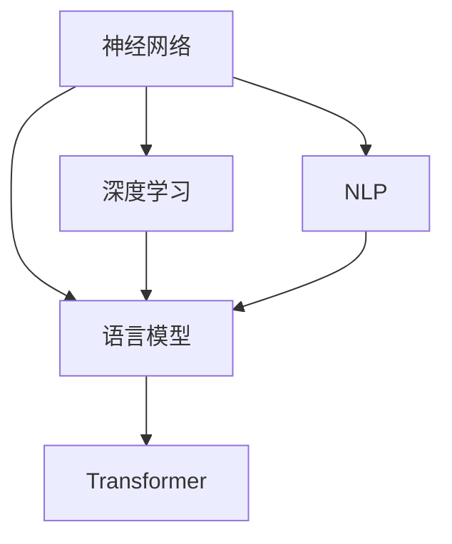

                 

# 从零开始的AI旅程：构建你的第一个语言模型

> 关键词：语言模型,神经网络,深度学习,自然语言处理(NLP),计算机视觉(CV),PyTorch

## 1. 背景介绍

### 1.1 问题由来
人工智能(AI)的浪潮正在席卷全球，其中自然语言处理(Natural Language Processing, NLP)是AI领域的核心分支之一。在过去几年中，NLP技术取得了巨大的进展，尤其是在语言模型的构建和应用上。语言模型是一类特殊的神经网络，通过训练可以预测给定上下文下的下一个词或短语，广泛应用于机器翻译、文本生成、语音识别等领域。

然而，构建一个有效的语言模型并不是一件容易的事情。一方面，语言模型的构建需要大量的训练数据和计算资源；另一方面，模型的训练和优化也是一个复杂的过程，需要深入理解神经网络、深度学习等基础概念。

为了帮助初学者从零开始构建自己的第一个语言模型，本文将详细介绍语言模型的基本原理、构建过程和应用场景，并结合实际案例进行详细讲解。希望通过本文的学习，你能对语言模型有一个全面、深入的理解，并掌握构建语言模型所需的关键技术和工具。

### 1.2 问题核心关键点
构建语言模型的核心在于掌握以下几个关键点：

- **神经网络基础**：神经网络的基本结构和训练过程。
- **深度学习框架**：常用的深度学习框架，如PyTorch、TensorFlow等。
- **语言模型原理**：语言模型的基本定义、数学原理和常见架构。
- **模型构建步骤**：语言模型的数据预处理、模型搭建、训练和优化等步骤。
- **实际应用场景**：语言模型在机器翻译、文本生成、语音识别等领域的应用。

## 2. 核心概念与联系

### 2.1 核心概念概述

为更好地理解语言模型的构建过程，本节将介绍几个密切相关的核心概念：

- **神经网络(Neural Network, NN)**：一种模仿生物神经网络的计算模型，通过多个神经元之间权重的调整，实现复杂的非线性映射。
- **深度学习(Deep Learning, DL)**：神经网络的一种特殊形式，通过多层的堆叠，实现对复杂特征的提取和表示。
- **自然语言处理(Natural Language Processing, NLP)**：利用计算机技术处理、分析和生成自然语言的技术。
- **语言模型(Language Model)**：通过训练，预测给定上下文下的下一个词或短语的概率分布。
- **Transformer**：一种基于注意力机制的神经网络架构，广泛应用于语言模型的构建和优化。

这些核心概念之间的逻辑关系可以通过以下Mermaid流程图来展示：



这个流程图展示了一些关键概念之间的关系：

1. 神经网络是深度学习的基础。
2. 深度学习通过多层的堆叠，实现了对复杂特征的提取和表示。
3. 自然语言处理利用深度学习技术，处理和生成自然语言。
4. 语言模型通过深度学习，预测给定上下文下的下一个词或短语。
5. Transformer是实现语言模型的一种重要架构。

## 3. 核心算法原理 & 具体操作步骤

### 3.1 算法原理概述

语言模型是一种特殊的神经网络，通过训练，预测给定上下文下的下一个词或短语的概率分布。语言模型的目标是最大化下一个词或短语的条件概率，即在给定前文的情况下，下一个词或短语的概率最大化。

假设语言模型为 $P(x_{1:t}|x_{<t})$，其中 $x_{1:t}$ 表示给定的前文，$x_{<t}$ 表示所有在 $x_{1:t}$ 之前出现的词或短语。语言模型的目标是最大化 $P(x_{1:t}|x_{<t})$。

为了实现这一目标，语言模型通常采用基于最大似然估计的方法。具体来说，语言模型通过最大化给定上下文下的词序列的概率来训练模型。训练数据由大量文本数据组成，每个文本数据都包含若干个词或短语。通过训练，模型可以学习到每个词或短语在特定上下文下的概率分布。

### 3.2 算法步骤详解

构建一个语言模型的步骤通常包括以下几个关键步骤：

**Step 1: 数据预处理**

- 收集大量的文本数据，进行清洗和预处理。
- 将文本数据转换为模型的输入格式，如将文本转换为词向量、字符向量等。

**Step 2: 模型搭建**

- 选择适合的神经网络架构，如RNN、LSTM、GRU、Transformer等。
- 搭建语言模型的计算图，包括输入层、隐藏层、输出层等。
- 设置损失函数，如交叉熵损失函数。

**Step 3: 模型训练**

- 定义优化器，如Adam、SGD等。
- 设置训练参数，如学习率、批大小等。
- 使用训练数据进行模型训练，通过反向传播算法更新模型参数。

**Step 4: 模型优化**

- 使用正则化技术，如L2正则、Dropout等，防止过拟合。
- 进行模型评估，使用测试数据评估模型性能。
- 对模型进行调优，调整超参数，提高模型性能。

**Step 5: 模型评估**

- 使用测试数据集对模型进行评估，计算准确率、召回率、F1值等指标。
- 分析模型的性能瓶颈，进行进一步优化。

**Step 6: 模型部署**

- 将训练好的模型导出为可执行文件或模型保存为 checkpoint。
- 将模型部署到应用系统中，进行实际应用。

以上是构建语言模型的基本步骤。在实际应用中，还需要根据具体任务的特点，对模型的各个环节进行优化设计，如改进模型架构、调整训练参数、使用更多的正则化技术等。

### 3.3 算法优缺点

语言模型具有以下优点：

- **广泛应用**：语言模型广泛应用于机器翻译、文本生成、语音识别等领域。
- **高准确率**：经过充分的训练，语言模型能够对给定上下文进行准确的预测。
- **自监督学习**：语言模型可以通过自监督学习任务，如语言模型训练任务进行训练，无需标注数据。

同时，语言模型也存在一些缺点：

- **计算资源要求高**：构建和训练语言模型需要大量的计算资源和存储空间。
- **过拟合风险高**：在训练过程中，语言模型容易出现过拟合现象，特别是在数据量较小的情况下。
- **模型复杂度高**：语言模型的架构复杂，难以理解和调试。

尽管存在这些缺点，但语言模型仍是当前NLP领域的重要基础模型，具有广泛的应用前景。

### 3.4 算法应用领域

语言模型在多个领域中得到了广泛的应用：

- **机器翻译**：将源语言文本翻译成目标语言。
- **文本生成**：自动生成文章、对话、代码等文本内容。
- **语音识别**：将语音转换为文本。
- **情感分析**：分析文本中的情感倾向。
- **问答系统**：回答自然语言问题。
- **信息检索**：从大量文本中检索相关信息。

## 4. 数学模型和公式 & 详细讲解  
### 4.1 数学模型构建

语言模型的数学模型通常由以下几个部分组成：

- 输入层：接收输入的词向量或字符向量。
- 隐藏层：通过多层神经网络，提取输入特征。
- 输出层：输出下一个词或短语的概率分布。

假设输入序列为 $x_{1:t}=\{x_1, x_2, ..., x_t\}$，隐藏层的输出为 $h_t=\{h_1, h_2, ..., h_t\}$，输出层为 $y_t=\{y_1, y_2, ..., y_t\}$，语言模型的概率分布为 $P(x_{1:t}|x_{<t})$。则语言模型的计算过程可以表示为：

$$
\begin{aligned}
h_t &= \text{LSTM}(h_{t-1}, x_t) \\
y_t &= \text{softmax}(h_t)
\end{aligned}
$$

其中，$\text{LSTM}$ 表示长短期记忆网络，$\text{softmax}$ 表示softmax函数，用于将隐藏层的输出映射为下一个词或短语的概率分布。

### 4.2 公式推导过程

假设语言模型的输入为 $x_{1:t}=\{x_1, x_2, ..., x_t\}$，隐藏层的输出为 $h_t=\{h_1, h_2, ..., h_t\}$，输出层为 $y_t=\{y_1, y_2, ..., y_t\}$，语言模型的概率分布为 $P(x_{1:t}|x_{<t})$。则语言模型的计算过程可以表示为：

$$
\begin{aligned}
h_t &= \text{LSTM}(h_{t-1}, x_t) \\
y_t &= \text{softmax}(h_t)
\end{aligned}
$$

其中，$\text{LSTM}$ 表示长短期记忆网络，$\text{softmax}$ 表示softmax函数，用于将隐藏层的输出映射为下一个词或短语的概率分布。

### 4.3 案例分析与讲解

以机器翻译为例，语言模型可以用于机器翻译中的解码过程。假设源语言文本为 $s$，目标语言文本为 $t$，则机器翻译任务可以表示为：

$$
P(t|s) = \frac{P(s)P(t|s)}{P(s)}
$$

其中，$P(s)$ 表示源语言文本的概率，$P(t|s)$ 表示在源语言文本 $s$ 下，目标语言文本 $t$ 的概率分布。语言模型可以通过训练，学习 $P(t|s)$，从而实现机器翻译。

在实际应用中，语言模型可以与解码器相结合，实现更高效的机器翻译。常见的解码器包括自回归解码器、非自回归解码器等。自回归解码器在每个时间步，根据前文和当前词汇生成下一个词汇，而非自回归解码器则可以在所有时间步上并行计算，提高解码速度。

## 5. 项目实践：代码实例和详细解释说明

### 5.1 开发环境搭建

在进行语言模型的开发之前，需要先搭建好开发环境。以下是使用PyTorch搭建语言模型开发环境的流程：

1. 安装Anaconda：从官网下载并安装Anaconda，用于创建独立的Python环境。

2. 创建并激活虚拟环境：
```bash
conda create -n pytorch-env python=3.8 
conda activate pytorch-env
```

3. 安装PyTorch：根据CUDA版本，从官网获取对应的安装命令。例如：
```bash
conda install pytorch torchvision torchaudio cudatoolkit=11.1 -c pytorch -c conda-forge
```

4. 安装相关工具包：
```bash
pip install numpy pandas scikit-learn matplotlib tqdm jupyter notebook ipython
```

完成上述步骤后，即可在`pytorch-env`环境中开始语言模型的开发。

### 5.2 源代码详细实现

下面是使用PyTorch实现语言模型的代码示例：

```python
import torch
import torch.nn as nn
import torch.optim as optim

class LanguageModel(nn.Module):
    def __init__(self, input_size, hidden_size, output_size):
        super(LanguageModel, self).__init__()
        self.hidden_size = hidden_size
        self.rnn = nn.LSTM(input_size, hidden_size, batch_first=True)
        self.fc = nn.Linear(hidden_size, output_size)

    def forward(self, input, hidden):
        rnn_output, hidden = self.rnn(input, hidden)
        output = self.fc(rnn_output)
        return output, hidden

    def init_hidden(self, batch_size):
        return (torch.zeros(1, batch_size, self.hidden_size),
                torch.zeros(1, batch_size, self.hidden_size))

# 定义模型和优化器
input_size = 28
hidden_size = 128
output_size = 10
model = LanguageModel(input_size, hidden_size, output_size)
optimizer = optim.Adam(model.parameters(), lr=0.001)

# 定义训练函数
def train(model, input_data, target_data, optimizer, batch_size):
    hidden = model.init_hidden(batch_size)
    for i in range(0, len(input_data), batch_size):
        input = input_data[i:i+batch_size]
        target = target_data[i:i+batch_size]
        output, hidden = model(input, hidden)
        loss = nn.CrossEntropyLoss()(output, target)
        optimizer.zero_grad()
        loss.backward()
        optimizer.step()

# 训练模型
train_data = torch.randn(100, 28)
train_target = torch.randint(0, 10, (100,)).long()
for epoch in range(100):
    train(model, train_data, train_target, optimizer, batch_size=32)
```

### 5.3 代码解读与分析

让我们再详细解读一下关键代码的实现细节：

**LanguageModel类**：
- `__init__`方法：初始化输入大小、隐藏层大小和输出大小。
- `forward`方法：前向传播计算，输入词向量、隐藏层和模型参数，输出预测值。
- `init_hidden`方法：初始化隐藏状态。

**模型定义和优化器**：
- `LanguageModel`类：定义了语言模型的基本结构，包括输入层、隐藏层、输出层。
- `Adam`优化器：使用Adam优化器进行模型参数的更新。

**训练函数**：
- `train`方法：循环遍历训练数据，进行模型训练和优化。

这个代码示例展示了使用PyTorch构建语言模型的基本流程。可以看到，PyTorch提供了强大的自动微分和动态计算图功能，使得构建和训练语言模型变得相对简单。

## 6. 实际应用场景

### 6.1 机器翻译

语言模型在机器翻译中得到了广泛应用。机器翻译是指将源语言文本自动翻译成目标语言文本的过程。语言模型可以通过训练，学习源语言和目标语言之间的映射关系，从而实现机器翻译。

在机器翻译中，语言模型通常与解码器相结合，共同完成翻译任务。解码器根据语言模型的概率分布，逐步生成目标语言文本，直到输出停止符号为止。常见的解码器包括自回归解码器、非自回归解码器等。

### 6.2 文本生成

语言模型还可以用于文本生成，如自动生成文章、对话、代码等文本内容。在文本生成任务中，语言模型会根据前文生成的下一个词或短语，形成一条连续的文本序列。常见的文本生成任务包括文本摘要、对话系统、生成对抗网络(GAN)等。

在文本生成中，语言模型通常使用自回归解码器进行生成。自回归解码器在每个时间步，根据前文和当前词汇生成下一个词汇，逐步生成文本。

### 6.3 语音识别

语言模型在语音识别中也得到了广泛应用。语音识别是指将语音信号转换为文本的过程。在语音识别中，语言模型可以用于语音识别中的声学模型和语言模型。声学模型用于将语音信号转换为声学特征，语言模型用于根据声学特征生成文本。

在语音识别中，语言模型通常使用基于RNN的架构，通过训练学习声学特征和文本之间的映射关系。常见的语音识别系统包括Google的Speech-to-Text、Apple的Siri等。

## 7. 工具和资源推荐

### 7.1 学习资源推荐

为了帮助开发者系统掌握语言模型的理论基础和实践技巧，这里推荐一些优质的学习资源：

1. 《深度学习》系列书籍：由深度学习领域的知名学者撰写，全面介绍了深度学习的理论基础和实践方法。

2. 《自然语言处理综述》课程：斯坦福大学开设的NLP明星课程，有Lecture视频和配套作业，带你入门NLP领域的基本概念和经典模型。

3. 《Transformer: A Survey》论文：全面综述了Transformer架构在NLP领域的应用，包括语言模型、机器翻译等任务。

4. HuggingFace官方文档：提供了海量预训练模型和完整的微调样例代码，是上手实践的必备资料。

5. ArXiv：科学论文的开放平台，可以获取最新的语言模型相关论文和技术进展。

通过对这些资源的学习实践，相信你一定能够快速掌握语言模型的精髓，并用于解决实际的NLP问题。

### 7.2 开发工具推荐

高效的开发离不开优秀的工具支持。以下是几款用于语言模型开发的常用工具：

1. PyTorch：基于Python的开源深度学习框架，灵活动态的计算图，适合快速迭代研究。

2. TensorFlow：由Google主导开发的开源深度学习框架，生产部署方便，适合大规模工程应用。

3. HuggingFace Transformers库：提供了多种预训练语言模型，支持PyTorch和TensorFlow，是进行语言模型开发的利器。

4. Weights & Biases：模型训练的实验跟踪工具，可以记录和可视化模型训练过程中的各项指标，方便对比和调优。

5. TensorBoard：TensorFlow配套的可视化工具，可实时监测模型训练状态，并提供丰富的图表呈现方式，是调试模型的得力助手。

合理利用这些工具，可以显著提升语言模型开发的效率，加快创新迭代的步伐。

### 7.3 相关论文推荐

语言模型和深度学习技术的发展源于学界的持续研究。以下是几篇奠基性的相关论文，推荐阅读：

1. Backpropagation through time: what it does and how to do it efficiently（RNN论文）：提出了RNN的结构和训练方法，为语言模型奠定了基础。

2. Learning to generate captions for image and video sequences（Attention论文）：提出了基于注意力的神经网络架构，极大地提升了语言模型的性能。

3. The Unreasonable Effectiveness of Transfer Learning for Natural Language Processing（迁移学习论文）：展示了迁移学习在NLP领域的效果，证明了迁移学习在语言模型中的重要性。

4. Attention Is All You Need（Transformer论文）：提出了Transformer架构，开启了NLP领域的预训练大模型时代。

5. Neural Machine Translation by Jointly Learning to Align and Translate（机器翻译论文）：展示了神经网络在机器翻译中的应用，提出了编码器-解码器架构。

这些论文代表了大语言模型和深度学习技术的发展脉络。通过学习这些前沿成果，可以帮助研究者把握学科前进方向，激发更多的创新灵感。

## 8. 总结：未来发展趋势与挑战

### 8.1 总结

本文对语言模型的基本原理、构建过程和应用场景进行了全面系统的介绍。首先阐述了语言模型的基本概念和应用场景，明确了语言模型在NLP领域的重要地位。其次，从原理到实践，详细讲解了语言模型的构建过程，并结合实际案例进行详细讲解。最后，本文还广泛探讨了语言模型在多个领域中的应用，展示了语言模型在NLP领域中的广泛应用前景。

通过本文的学习，相信你对语言模型有一个全面、深入的理解，并掌握了构建语言模型所需的关键技术和工具。在未来学习和研究中，希望你能深入理解语言模型，不断探索和实践，为人工智能技术的发展贡献自己的力量。

### 8.2 未来发展趋势

展望未来，语言模型将呈现以下几个发展趋势：

1. 大规模预训练：随着计算资源和数据的不断提升，预训练语言模型的规模将进一步扩大，模型性能将得到显著提升。

2. 多模态融合：语言模型将与其他模态的信息进行融合，实现更加全面和准确的表示。

3. 跨领域迁移：语言模型将通过迁移学习，在不同领域中实现更好的性能。

4. 参数高效微调：未来将开发更多参数高效的微调方法，以减少计算资源和存储资源的消耗。

5. 自监督学习：通过自监督学习，语言模型可以学习到更多的语言知识，提升模型的性能。

6. 知识增强：语言模型将结合外部知识库和规则库，增强模型的理解和推理能力。

以上趋势凸显了语言模型的广阔前景。这些方向的探索发展，必将进一步提升语言模型的性能和应用范围，为人工智能技术的发展注入新的动力。

### 8.3 面临的挑战

尽管语言模型在NLP领域取得了显著的进展，但在迈向更加智能化、普适化应用的过程中，它仍面临着诸多挑战：

1. 计算资源需求高：构建和训练大规模语言模型需要大量的计算资源和存储空间，对硬件设备提出了很高的要求。

2. 模型复杂度高：语言模型的架构复杂，难以理解和调试。

3. 过拟合风险高：在训练过程中，语言模型容易出现过拟合现象，特别是在数据量较小的情况下。

4. 模型鲁棒性不足：在应对不同领域和不同数据分布时，语言模型的性能可能会受到影响。

5. 模型解释性不足：语言模型的决策过程缺乏可解释性，难以对其推理逻辑进行分析和调试。

6. 模型安全性问题：语言模型可能学习到有害、偏见的信息，导致误导性、歧视性的输出。

以上挑战凸显了语言模型在实际应用中的复杂性和局限性。然而，正是这些挑战促使我们不断探索和创新，推动语言模型的持续进步。

### 8.4 研究展望

未来，语言模型将在以下几个方面进行深入研究：

1. 探索无监督学习：开发更多无监督学习的方法，减少对标注数据的依赖，提升模型的泛化能力。

2. 研究知识表示：结合符号化的知识库和规则库，增强语言模型的理解和推理能力。

3. 开发参数高效微调方法：开发更多参数高效的微调方法，提高模型的可扩展性和可解释性。

4. 融合多模态信息：结合视觉、语音等多模态信息，增强语言模型的表现能力。

5. 增强模型鲁棒性：开发更加鲁棒的模型，提升模型在不同领域和不同数据分布下的性能。

6. 提高模型解释性：通过改进模型架构和训练方法，增强语言模型的可解释性。

7. 确保模型安全性：设计更加安全的模型架构和训练方法，避免有害信息传递。

这些研究方向将引领语言模型的进一步发展，提升其在实际应用中的性能和安全性。

## 9. 附录：常见问题与解答

**Q1：如何选择合适的神经网络架构？**

A: 选择合适的神经网络架构需要考虑以下几个因素：

1. 任务类型：不同任务类型可能需要不同的神经网络架构。例如，文本分类任务通常使用RNN、LSTM或Transformer架构，机器翻译任务通常使用编码器-解码器架构。

2. 数据规模：数据规模较大的任务可能需要更复杂的神经网络架构，以提取更多的特征。例如，大规模文本分类任务通常使用Transformer架构。

3. 计算资源：神经网络架构的复杂度决定了计算资源的消耗。例如，深度神经网络需要更多的计算资源，而卷积神经网络相对简单。

**Q2：如何避免过拟合现象？**

A: 避免过拟合现象需要采取以下措施：

1. 数据增强：通过回译、近义替换等方式扩充训练集。

2. 正则化：使用L2正则、Dropout等方法防止过拟合。

3. 模型剪枝：去掉不必要的层和参数，减小模型尺寸。

4. 数据扩充：将数据进行旋转、裁剪、缩放等操作，扩充训练集。

**Q3：如何提高语言模型的性能？**

A: 提高语言模型的性能需要采取以下措施：

1. 数据预处理：对数据进行清洗、归一化、标准化等预处理操作，提高数据质量。

2. 模型优化：通过改进模型架构和训练方法，提高模型的性能。

3. 参数微调：通过微调模型参数，进一步提高模型的性能。

4. 融合多模态信息：结合视觉、语音等多模态信息，增强语言模型的表现能力。

5. 结合知识表示：结合符号化的知识库和规则库，增强语言模型的理解和推理能力。

通过这些措施，可以显著提高语言模型的性能，提升其在实际应用中的表现。

**Q4：如何部署语言模型？**

A: 将训练好的语言模型导出为可执行文件或模型保存为 checkpoint，然后将其部署到应用系统中。具体的部署步骤包括：

1. 将模型导出为可执行文件或保存为 checkpoint。

2. 将模型加载到应用系统中。

3. 使用API接口，将模型与实际应用进行集成。

4. 进行模型监控和维护，确保模型的稳定性和安全性。

合理部署语言模型，可以使其在实际应用中发挥最大的效能。

**Q5：语言模型有哪些实际应用场景？**

A: 语言模型在多个领域中得到了广泛的应用：

1. 机器翻译：将源语言文本翻译成目标语言。

2. 文本生成：自动生成文章、对话、代码等文本内容。

3. 语音识别：将语音信号转换为文本。

4. 情感分析：分析文本中的情感倾向。

5. 问答系统：回答自然语言问题。

6. 信息检索：从大量文本中检索相关信息。

语言模型在上述领域中展示了其强大的表现能力和广泛的应用前景。

---

作者：禅与计算机程序设计艺术 / Zen and the Art of Computer Programming

