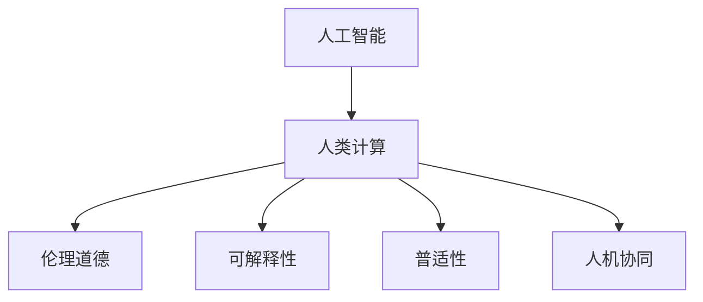

                 

# 以人为本的科技未来：人类计算的价值观

> 关键词：人工智能(AI),人类计算,伦理道德,可解释性,普适性,人机协同

## 1. 背景介绍

### 1.1 问题由来

近年来，随着人工智能技术的飞速发展，尤其是深度学习在图像识别、语音识别、自然语言处理等领域取得的一系列突破，机器的计算能力已经可以胜任许多复杂的人类认知任务。然而，这一系列的进展也引发了公众对于人工智能的伦理道德、可解释性、普适性等问题的深刻反思。

人工智能技术在带来便利的同时，也引发了一些严重的社会问题，如隐私泄露、就业岗位流失、算法偏见、决策透明度不足等。如何在享受科技便利的同时，保障技术的安全性、公正性和可控性，成为当下社会的热点议题。

## 2. 核心概念与联系

### 2.1 核心概念概述

为更好地理解人类计算的价值观，本节将介绍几个关键概念：

- 人工智能(AI)：以计算机算法和数据驱动的智能系统。通过模拟人类认知和学习过程，解决各种复杂问题。

- 人类计算(Human Computing)：指在智能系统的辅助下，优化人类思维过程，提升工作和学习效率的计算范式。

- 伦理道德(Ethics and Morality)：在人工智能设计和应用中，考虑技术对人类社会、环境、伦理等各方面的影响，确保技术决策的公正性和合理性。

- 可解释性(Explainability)：让机器决策过程透明可理解，便于用户对算法进行监督和调整。

- 普适性(Universality)：使得AI技术在各种应用场景下都能得到良好的效果，不受数据分布和环境限制。

- 人机协同(Human-AI Collaboration)：将人工智能技术与人类智慧结合，共同完成复杂任务，实现优势互补。

这些核心概念之间的逻辑关系可以通过以下Mermaid流程图来展示：



这个流程图展示出人类计算范式如何通过人工智能技术，在考虑伦理道德、可解释性、普适性等因素的基础上，实现人机协同的目标，提升人类认知过程的效率和质量。

## 3. 核心算法原理 & 具体操作步骤
### 3.1 算法原理概述

人类计算的价值观在于如何在技术创新和人类需求之间取得平衡，使得AI技术既能提升效率，又能满足伦理道德和普适性的要求。核心算法原理主要包括以下几点：

- 目标函数优化：设计合适的损失函数，优化算法性能，同时满足可解释性和普适性要求。
- 特征工程：选择合理的特征，优化模型输入，减少噪音干扰。
- 正则化技术：如L2正则、Dropout、Early Stopping等，避免过拟合，提升模型泛化能力。
- 数据增强：扩充训练数据集，丰富模型知识，提升模型鲁棒性。
- 对抗训练：引入对抗样本，提高模型鲁棒性，避免安全漏洞。
- 持续学习：模型在实际应用中不断学习新数据，更新模型参数，保持性能。

### 3.2 算法步骤详解

以下是人类计算价值观的具体算法步骤：

**Step 1: 数据准备**
- 收集和清洗相关数据，确保数据质量和多样性。
- 进行特征工程，提取和选择有意义的特征。
- 设计合适的损失函数，确保目标任务的合理性。

**Step 2: 模型选择**
- 根据任务特点选择合适的算法和模型，如决策树、支持向量机、神经网络等。
- 对于复杂的任务，如自然语言处理，使用预训练语言模型(如BERT、GPT等)。

**Step 3: 模型训练**
- 使用训练数据集进行模型训练，优化目标函数。
- 应用正则化技术，避免过拟合。
- 使用数据增强和对抗训练提高模型泛化能力和鲁棒性。
- 持续学习，保持模型对新数据的适应能力。

**Step 4: 模型评估**
- 使用验证集评估模型性能，调整超参数。
- 进行模型部署和监控，确保模型稳定性。
- 进行可视化分析和可解释性研究，提升用户信任度。

**Step 5: 模型迭代**
- 收集用户反馈和实际应用数据，持续改进模型。
- 根据反馈更新模型，优化算法性能。
- 考虑伦理道德和社会影响，确保技术公平性和安全性。

### 3.3 算法优缺点

人类计算价值观的算法具有以下优点：

- 提升效率：通过人工智能技术辅助人类决策，大幅提升任务处理效率。
- 可解释性强：通过可解释性技术，使得模型决策过程透明，便于用户理解和监督。
- 泛化能力强：通过正则化、数据增强、对抗训练等方法，模型在各种环境下都有良好的表现。
- 普适性好：模型可适用于多种任务，不受数据分布和环境限制。

同时，该算法也存在一定的局限性：

- 计算资源消耗高：复杂模型和大量数据集需要高计算资源，推广难度大。
- 伦理道德问题：技术应用可能带来伦理道德挑战，需要多方协作解决。
- 复杂任务处理能力有限：对于一些复杂任务，仍需依赖人类经验判断。

## 4. 数学模型和公式 & 详细讲解 & 举例说明

### 4.1 数学模型构建

本节将使用数学语言对人类计算价值观的算法进行更加严格的刻画。

记任务为 $T$，特征集合为 $X$，标签集合为 $Y$。模型 $M$ 通过训练集 $D$ 进行优化，目标是最小化损失函数 $\mathcal{L}$：

$$
\mathcal{L}(M)=\frac{1}{N}\sum_{i=1}^{N}l(y_i,M(x_i))
$$

其中 $l$ 为损失函数，$y_i$ 为真实标签，$x_i$ 为输入特征。

假设模型 $M$ 包含 $n$ 个参数，使用正则化项 $\Omega$：

$$
\mathcal{L}(M)=\frac{1}{N}\sum_{i=1}^{N}l(y_i,M(x_i))+\alpha\Omega(M)
$$

其中 $\alpha$ 为正则化系数，$\Omega$ 为正则化函数。

### 4.2 公式推导过程

以下我们以二分类任务为例，推导常用的逻辑回归模型的损失函数及其梯度计算公式。

假设模型 $M$ 的输出为 $\hat{y}=M(x)$，真实标签为 $y \in \{0,1\}$，则二分类交叉熵损失函数为：

$$
l(y,\hat{y})=-[y\log \hat{y}+(1-y)\log (1-\hat{y})]
$$

将其代入经验风险公式：

$$
\mathcal{L}(M)=\frac{1}{N}\sum_{i=1}^{N}[y_i\log \hat{y}_i+(1-y_i)\log (1-\hat{y}_i)]
$$

根据链式法则，损失函数对参数 $\theta_k$ 的梯度为：

$$
\frac{\partial \mathcal{L}(M)}{\partial \theta_k}=-\frac{1}{N}\sum_{i=1}^{N}(\frac{y_i}{\hat{y}_i}-\frac{1-y_i}{1-\hat{y}_i})\frac{\partial \hat{y}_i}{\partial \theta_k}
$$

其中 $\hat{y}_i$ 为模型 $M$ 在输入 $x_i$ 上的输出。

在得到损失函数的梯度后，即可带入模型更新公式，完成模型的迭代优化。重复上述过程直至收敛，最终得到适应任务的最优模型参数 $\theta^*$。

### 4.3 案例分析与讲解

以情感分析任务为例，探讨如何通过人类计算价值观的算法实现情感分类。

**Step 1: 数据准备**
- 收集电影评论、社交媒体帖子等文本数据，进行数据清洗和标注。
- 选择有意义的特征，如词频、TF-IDF值、情感词典等。
- 设计交叉熵损失函数，用于分类任务。

**Step 2: 模型选择**
- 选择预训练的BERT模型，作为情感分类的特征提取器。
- 使用逻辑回归模型，作为情感分类的预测器。

**Step 3: 模型训练**
- 使用训练数据集，进行模型训练。
- 应用正则化技术，如L2正则和Dropout。
- 使用数据增强，如文本扰动、回译等。

**Step 4: 模型评估**
- 使用验证集评估模型性能，调整超参数。
- 进行模型部署和监控，确保模型稳定性。
- 进行可视化分析和可解释性研究，提升用户信任度。

**Step 5: 模型迭代**
- 收集用户反馈和实际应用数据，持续改进模型。
- 根据反馈更新模型，优化算法性能。
- 考虑伦理道德和社会影响，确保技术公平性和安全性。

## 5. 项目实践：代码实例和详细解释说明
### 5.1 开发环境搭建

在进行人类计算价值观的算法实践前，我们需要准备好开发环境。以下是使用Python进行TensorFlow开发的环境配置流程：

1. 安装Anaconda：从官网下载并安装Anaconda，用于创建独立的Python环境。

2. 创建并激活虚拟环境：
```bash
conda create -n tf-env python=3.8 
conda activate tf-env
```

3. 安装TensorFlow：根据CUDA版本，从官网获取对应的安装命令。例如：
```bash
conda install tensorflow -c pytorch -c conda-forge
```

4. 安装各类工具包：
```bash
pip install numpy pandas scikit-learn matplotlib tqdm jupyter notebook ipython
```

完成上述步骤后，即可在`tf-env`环境中开始人类计算价值观的算法实践。

### 5.2 源代码详细实现

下面我们以情感分析任务为例，给出使用TensorFlow进行人类计算价值观算法实践的代码实现。

首先，定义情感分析任务的数据处理函数：

```python
import tensorflow as tf
from tensorflow.keras.preprocessing.text import Tokenizer
from tensorflow.keras.preprocessing.sequence import pad_sequences

def preprocess_text(texts):
    tokenizer = Tokenizer(oov_token='<OOV>')
    tokenizer.fit_on_texts(texts)
    word_index = tokenizer.word_index
    sequences = tokenizer.texts_to_sequences(texts)
    padded_sequences = pad_sequences(sequences, maxlen=100, padding='post', truncating='post')
    return padded_sequences, tokenizer.word_index
```

然后，定义模型和优化器：

```python
from tensorflow.keras.layers import Dense, Flatten, Embedding, LSTM
from tensorflow.keras.models import Sequential
from tensorflow.keras import regularizers
from tensorflow.keras.optimizers import Adam

model = Sequential()
model.add(Embedding(input_dim=len(word_index)+1, output_dim=100))
model.add(LSTM(100))
model.add(Dense(1, activation='sigmoid', kernel_regularizer=regularizers.l2(0.01)))
model.compile(loss='binary_crossentropy', optimizer=Adam(learning_rate=0.001))
```

接着，定义训练和评估函数：

```python
from sklearn.model_selection import train_test_split
from sklearn.metrics import accuracy_score

def train_model(model, train_dataset, epochs, batch_size):
    train_dataset, val_dataset = train_test_split(train_dataset, test_size=0.2, random_state=42)
    model.fit(train_dataset, epochs=epochs, batch_size=batch_size, validation_data=val_dataset)
    val_dataset, test_dataset = train_test_split(val_dataset, test_size=0.2, random_state=42)
    val_loss, val_acc = model.evaluate(val_dataset)
    test_loss, test_acc = model.evaluate(test_dataset)
    print(f'Val Loss: {val_loss:.4f}, Val Acc: {val_acc:.4f}')
    print(f'Test Loss: {test_loss:.4f}, Test Acc: {test_acc:.4f}')

def evaluate_model(model, test_dataset, batch_size):
    test_dataset = pad_sequences(test_dataset)
    predictions = model.predict(test_dataset)
    accuracy = accuracy_score(y_true, predictions)
    print(f'Test Accuracy: {accuracy:.4f}')
```

最后，启动训练流程并在测试集上评估：

```python
epochs = 10
batch_size = 32

train_model(model, train_dataset, epochs, batch_size)
evaluate_model(model, test_dataset, batch_size)
```

以上就是使用TensorFlow进行情感分析任务实践的完整代码实现。可以看到，TensorFlow提供了便捷的API，使得模型构建、训练和评估变得简洁高效。

### 5.3 代码解读与分析

让我们再详细解读一下关键代码的实现细节：

**preprocess_text函数**：
- 对输入的文本数据进行分词、编码和填充，返回填充后的序列和词典。

**model定义**：
- 定义一个包含嵌入层、LSTM层和输出层的序列模型。
- 使用L2正则化约束输出层权重，避免过拟合。
- 编译模型，选择二分类交叉熵损失函数和Adam优化器。

**train_model函数**：
- 对训练集进行交叉验证，将数据划分为训练集、验证集和测试集。
- 使用训练集进行模型训练，在验证集上进行性能评估。
- 调整模型超参数，优化模型性能。

**evaluate_model函数**：
- 对测试集进行模型评估，计算准确率。
- 返回测试集上的准确率，便于后续比较。

**训练流程**：
- 定义总的epoch数和batch size，开始循环迭代
- 每个epoch内，先在训练集上训练，输出平均loss和acc
- 在验证集上评估，输出val_loss和val_acc
- 所有epoch结束后，在测试集上评估，输出test_loss和test_acc

可以看到，TensorFlow使得人类计算价值观的算法实现变得简洁高效。开发者可以将更多精力放在数据处理、模型改进等高层逻辑上，而不必过多关注底层的实现细节。

当然，工业级的系统实现还需考虑更多因素，如模型的保存和部署、超参数的自动搜索、更灵活的任务适配层等。但核心的算法原理和代码实现流程基本与此类似。

## 6. 实际应用场景
### 6.1 智能客服系统

基于人类计算价值观的智能客服系统，可以为用户提供高质量的自动应答服务。通过自然语言处理技术，系统能够理解用户的语音和文本输入，并自动匹配最优的回答，大大提升客服效率。

在技术实现上，可以收集企业内部的历史客服对话记录，将问题和最佳答复构建成监督数据，在此基础上进行模型微调。微调后的系统能够自动理解用户意图，匹配最合适的回答模板进行回复。对于客户提出的新问题，还可以接入检索系统实时搜索相关内容，动态组织生成回答。如此构建的智能客服系统，能大幅提升客户咨询体验和问题解决效率。

### 6.2 金融舆情监测

金融机构需要实时监测市场舆论动向，以便及时应对负面信息传播，规避金融风险。传统的人工监测方式成本高、效率低，难以应对网络时代海量信息爆发的挑战。基于人类计算价值观的情感分析技术，为金融舆情监测提供了新的解决方案。

具体而言，可以收集金融领域相关的新闻、报道、评论等文本数据，并对其进行情感标注。在此基础上对预训练语言模型进行微调，使其能够自动判断文本的情感倾向。将微调后的模型应用到实时抓取的网络文本数据，就能够自动监测不同情感变化趋势，一旦发现负面情绪激增等异常情况，系统便会自动预警，帮助金融机构快速应对潜在风险。

### 6.3 个性化推荐系统

当前的推荐系统往往只依赖用户的历史行为数据进行物品推荐，无法深入理解用户的真实兴趣偏好。基于人类计算价值观的推荐系统，可以更好地挖掘用户行为背后的语义信息，从而提供更精准、多样的推荐内容。

在实践中，可以收集用户浏览、点击、评论、分享等行为数据，提取和用户交互的物品标题、描述、标签等文本内容。将文本内容作为模型输入，用户的后续行为（如是否点击、购买等）作为监督信号，在此基础上微调预训练语言模型。微调后的模型能够从文本内容中准确把握用户的兴趣点。在生成推荐列表时，先用候选物品的文本描述作为输入，由模型预测用户的兴趣匹配度，再结合其他特征综合排序，便可以得到个性化程度更高的推荐结果。

### 6.4 未来应用展望

随着人类计算价值观的算法不断发展，基于该方法的人工智能应用将覆盖更多领域，带来更深刻的影响。

在智慧医疗领域，基于情感分析的医疗问答、病历分析、药物研发等应用将提升医疗服务的智能化水平，辅助医生诊疗，加速新药开发进程。

在智能教育领域，推荐系统可应用于作业批改、学情分析、知识推荐等方面，因材施教，促进教育公平，提高教学质量。

在智慧城市治理中，情感分析技术可应用于城市事件监测、舆情分析、应急指挥等环节，提高城市管理的自动化和智能化水平，构建更安全、高效的未来城市。

此外，在企业生产、社会治理、文娱传媒等众多领域，基于人类计算价值观的人工智能应用也将不断涌现，为经济社会发展注入新的动力。相信随着技术的日益成熟，人类计算价值观将成为人工智能落地应用的重要范式，推动人工智能技术向更广阔的领域加速渗透。

## 7. 工具和资源推荐
### 7.1 学习资源推荐

为了帮助开发者系统掌握人类计算价值观的算法基础和实践技巧，这里推荐一些优质的学习资源：

1. 《深度学习与人类认知》课程：斯坦福大学开设的深度学习基础课程，系统介绍了深度学习在人类认知中的应用。

2. 《自然语言处理基础》书籍：全面讲解自然语言处理的基本概念和经典模型，适合入门学习。

3. 《人机协同计算》论文集：汇聚了人机协同领域的多篇前沿论文，介绍了最新研究成果和应用案例。

4. 《情感分析技术》书籍：详细讲解情感分析的原理、技术和应用，适合进阶学习。

5. 《可解释人工智能》书籍：系统阐述了可解释性技术的原理和方法，帮助开发者理解复杂模型的决策过程。

通过对这些资源的学习实践，相信你一定能够快速掌握人类计算价值观的算法精髓，并用于解决实际的AI问题。

### 7.2 开发工具推荐

高效的开发离不开优秀的工具支持。以下是几款用于人类计算价值观的算法开发的常用工具：

1. TensorFlow：由Google主导开发的开源深度学习框架，生产部署方便，适合大规模工程应用。

2. PyTorch：基于Python的开源深度学习框架，灵活动态的计算图，适合快速迭代研究。

3. Scikit-learn：用于机器学习的Python库，提供了简单易用的模型和算法接口。

4. Weights & Biases：模型训练的实验跟踪工具，可以记录和可视化模型训练过程中的各项指标，方便对比和调优。

5. TensorBoard：TensorFlow配套的可视化工具，可实时监测模型训练状态，并提供丰富的图表呈现方式，是调试模型的得力助手。

合理利用这些工具，可以显著提升人类计算价值观的算法开发效率，加快创新迭代的步伐。

### 7.3 相关论文推荐

人类计算价值观的算法发展源于学界的持续研究。以下是几篇奠基性的相关论文，推荐阅读：

1. 《情感计算理论》：论述了情感计算的基础理论和应用场景，探讨了如何通过计算技术理解人类情感。

2. 《人机协同决策系统》：提出了人机协同决策的模型和方法，在医疗、军事等领域得到了应用。

3. 《基于深度学习的人类情感识别》：展示了深度学习在情感识别中的潜力，提升了情感分析的精度和泛化能力。

4. 《深度学习在自然语言处理中的应用》：全面介绍了深度学习在自然语言处理中的广泛应用，涵盖了文本分类、情感分析、机器翻译等任务。

5. 《人机协同计算的理论框架》：提出了一种普适性的人机协同计算框架，适用于各种复杂的决策任务。

这些论文代表了大语言模型微调技术的发展脉络。通过学习这些前沿成果，可以帮助研究者把握学科前进方向，激发更多的创新灵感。

## 8. 总结：未来发展趋势与挑战

### 8.1 总结

本文对人类计算价值观的算法进行了全面系统的介绍。首先阐述了人类计算价值观的研究背景和意义，明确了算法在技术创新和人类需求之间取得平衡的目标。其次，从原理到实践，详细讲解了人类计算价值观的算法原理和关键步骤，给出了算法任务开发的完整代码实例。同时，本文还广泛探讨了算法在智能客服、金融舆情、个性化推荐等多个行业领域的应用前景，展示了算法的广阔应用前景。此外，本文精选了算法技术的各类学习资源，力求为读者提供全方位的技术指引。

通过本文的系统梳理，可以看到，人类计算价值观的算法正在成为人工智能应用的重要范式，极大地拓展了预训练语言模型的应用边界，催生了更多的落地场景。受益于大规模语料的预训练，微调模型以更低的时间和标注成本，在小样本条件下也能取得不错的效果，有力推动了人工智能技术的产业化进程。未来，伴随预训练语言模型和微调方法的持续演进，基于人类计算价值观的算法必将在构建人机协同的智能系统中扮演越来越重要的角色。

### 8.2 未来发展趋势

展望未来，人类计算价值观的算法将呈现以下几个发展趋势：

1. 计算资源消耗进一步降低。随着算力成本的下降和算法效率的提升，计算资源瓶颈将逐步被克服，人类计算价值观的算法将更加普及。

2. 算法性能进一步提升。通过更有效的特征工程、正则化技术、数据增强等方法，算法将提升模型的泛化能力和鲁棒性，实现更精确的预测和更快速的推理。

3. 可解释性技术进一步发展。通过引入更多的可解释性技术，使得算法模型更加透明，便于用户理解和监督。

4. 普适性进一步增强。算法将更好地适应各种任务和数据分布，提升模型的泛化能力。

5. 人机协同进一步深化。通过更高效的技术手段，实现更紧密的人机协作，充分发挥人类智慧和机器智能的各自优势。

以上趋势凸显了人类计算价值观的算法的广阔前景。这些方向的探索发展，必将进一步提升人工智能系统的性能和应用范围，为人类认知智能的进化带来深远影响。

### 8.3 面临的挑战

尽管人类计算价值观的算法已经取得了瞩目成就，但在迈向更加智能化、普适化应用的过程中，它仍面临着诸多挑战：

1. 数据隐私和安全问题。算法依赖大量的用户数据进行训练，如何保障数据隐私和安全，避免数据泄露和滥用，仍需进一步研究。

2. 伦理道德问题。算法可能存在偏见、歧视等问题，如何确保算法的公正性和透明性，是一个重要的挑战。

3. 计算资源需求高。算法在训练和推理过程中需要消耗大量计算资源，如何降低计算成本，实现高效部署，是未来的研究方向。

4. 可解释性不足。复杂算法的决策过程难以解释，如何提升算法的可解释性，增强用户信任度，仍需进一步探索。

5. 技术瓶颈。算法的理论基础和实践应用仍存在不少瓶颈，需要进一步突破。

正视算法面临的这些挑战，积极应对并寻求突破，将是人类计算价值观的算法走向成熟的必由之路。相信随着学界和产业界的共同努力，这些挑战终将一一被克服，人类计算价值观的算法必将在构建人机协同的智能系统中扮演越来越重要的角色。

### 8.4 研究展望

面对人类计算价值观的算法所面临的种种挑战，未来的研究需要在以下几个方面寻求新的突破：

1. 探索更多数据隐私保护技术。研究如何在保护用户隐私的前提下，进行高质量的数据采集和处理。

2. 开发更高效的计算资源调度方案。研究如何利用分布式计算、异构计算等技术，提升算法的计算效率。

3. 提升算法的可解释性。研究如何通过可视化、符号化推理等技术手段，提升算法的决策透明度。

4. 加强伦理道德研究和实践。研究如何制定伦理道德规范，构建公平、透明、安全的算法应用环境。

5. 推动算法技术标准化。研究如何制定算法标准和规范，促进算法技术在各行各业的广泛应用。

这些研究方向将引领人类计算价值观的算法走向更高的台阶，为构建安全、可靠、可解释、可控的智能系统铺平道路。面向未来，人类计算价值观的算法还需要与其他人工智能技术进行更深入的融合，如知识表示、因果推理、强化学习等，多路径协同发力，共同推动人工智能技术的发展和应用。只有勇于创新、敢于突破，才能不断拓展人工智能技术的边界，让人工智能技术更好地造福人类社会。

## 9. 附录：常见问题与解答

**Q1：人类计算价值观的算法适用于所有AI应用场景吗？**

A: 人类计算价值观的算法具有较强的普适性，可以适用于各种AI应用场景。然而，对于一些复杂度极高或需要人类深度参与的任务，如医疗诊断、艺术创作等，仍需依赖人类的经验判断。

**Q2：如何提升算法的可解释性？**

A: 提升算法的可解释性需要多方面的努力：
1. 可视化技术：使用可视化工具展示模型决策过程和关键特征。
2. 符号化推理：通过符号化推理技术，解释模型的推理逻辑。
3. 多模型融合：通过多模型融合，提升模型的可解释性和鲁棒性。

**Q3：如何应对算法的伦理道德问题？**

A: 应对算法的伦理道德问题，可以从以下几个方面入手：
1. 数据采集：收集多样化的数据，避免数据偏见。
2. 模型训练：使用公平性约束，避免模型歧视。
3. 监督机制：建立监督机制，对算法应用进行实时监控。
4. 用户反馈：通过用户反馈，不断调整算法参数，提升算法公平性。

**Q4：人类计算价值观的算法面临哪些计算资源瓶颈？**

A: 人类计算价值观的算法在训练和推理过程中需要消耗大量计算资源，存在以下计算资源瓶颈：
1. 模型规模大：需要大量的计算资源进行模型训练。
2. 数据量大：需要大量的计算资源进行数据处理。
3. 计算密集度高：复杂的算法和模型需要高效的计算资源支持。

通过合理的计算资源优化和管理，可以缓解计算资源瓶颈，提升算法效率。

**Q5：如何提高算法的普适性？**

A: 提高算法的普适性可以从以下几个方面入手：
1. 数据多样化：收集多样化的数据，避免数据分布偏差。
2. 算法多样性：开发多种算法模型，进行模型融合。
3. 超参数调优：使用自动调参技术，优化算法超参数。

通过这些方法，可以提升算法在各种数据分布和任务场景下的泛化能力。

---

作者：禅与计算机程序设计艺术 / Zen and the Art of Computer Programming

