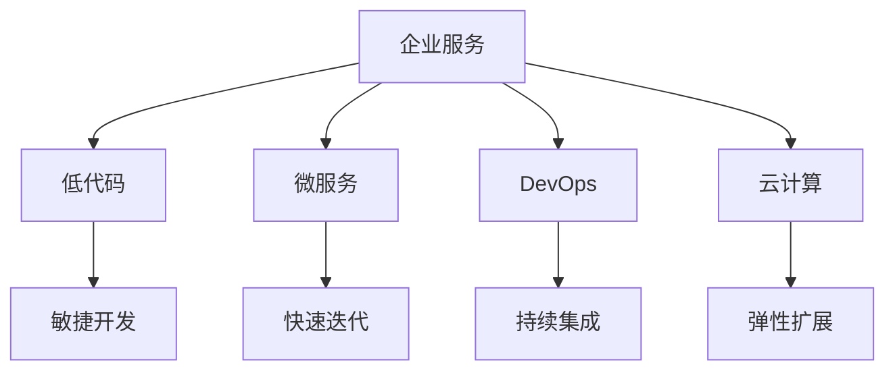

                 

# 企业服务创业：To B市场的蓝海

## 1. 背景介绍

### 1.1 问题由来
随着数字化转型成为企业发展的重要战略，企业服务市场也迎来了爆发式增长。企业服务旨在通过信息化手段，提升企业的运营效率、管理水平和创新能力。然而，尽管企业对数字化转型的需求日益迫切，市场上依然存在着不少痛点问题：

- **需求复杂多变**：企业需求受行业特性、业务规模、管理方式等因素影响，单一解决方案难以覆盖所有场景。
- **用户体验欠佳**：市面上的很多企业服务产品，在操作界面、流程设计、数据集成等方面存在问题，导致用户使用体验较差。
- **定制化需求高**：企业服务需高度贴合企业自身的业务流程和数据体系，“通用型”产品往往无法满足企业个性化需求。
- **业务价值有限**：部分企业服务更多聚焦于技术实现，缺乏对业务流程的深入理解和实际价值，难以帮助企业实现真正的效率提升。
- **市场竞争激烈**：随着市场竞争加剧，价格战成为常见手段，导致利润空间不断压缩，难以持续盈利。

这些问题严重制约了企业服务市场的健康发展，亟需一场颠覆性的创新，打破传统To B市场的瓶颈。

### 1.2 问题核心关键点
未来企业服务市场的核心在于，如何构建以用户为中心的、具备高度灵活性和创新力的数字化解决方案。具体来说，需要关注以下关键点：

- **用户体验为王**：在产品设计、流程优化、数据集成等方面，提升用户体验，让企业用户能够快速上手、无缝集成。
- **深度行业理解**：深入理解各行业业务场景和需求特点，提供针对性、场景化的解决方案。
- **数据驱动决策**：通过智能分析、决策支持工具，帮助企业管理者进行精准决策，提升管理效率。
- **敏捷定制能力**：具备灵活的定制化开发能力，快速响应企业客户的需求变化。
- **全面技术支持**：提供一揽子技术支持和服务，包括云部署、运维、升级等，确保系统长期稳定运行。

### 1.3 问题研究意义
研究如何构建面向企业用户的创新服务，对于推动数字化转型、提升企业效率、促进产业升级具有重要意义：

- **助力企业数字化转型**：企业服务通过信息化手段，帮助企业实现业务流程自动化、数据分析决策化，提高运营效率，降低成本。
- **驱动产业发展**：企业服务作为产业数字化、智能化的关键环节，能够推动更多传统行业向数字化方向转型，加速产业升级。
- **实现创新价值**：企业服务不仅能解决企业具体问题，还能带动新兴技术的应用，催生新的商业模式和产业链。
- **培育新业务增长点**：企业服务为B端市场提供了新型的收入来源，有助于企业在数字化浪潮中持续创新，保持竞争优势。

## 2. 核心概念与联系

### 2.1 核心概念概述

为更好地理解企业服务创业的思路和方法，本节将介绍几个关键概念：

- **企业服务(Enterprise Services)**：指针对企业用户的，提供信息化的数字化解决方案。包括ERP、CRM、HR、OA等各类应用。
- **To B市场(B2B Market)**：指面向企业用户的市场，与消费市场的To C相对。企业服务是To B市场的重要组成部分。
- **低代码(Low Code/No Code)**：一种通过图形化、拖拽等界面操作，简化开发过程，快速构建企业应用的技术。
- **微服务(Microservices)**：将应用拆分为多个独立的小服务模块，每个服务模块可独立开发、部署、运维。
- **DevOps**：涵盖开发、测试、部署、运维等全链路的软件开发模式，提高软件开发效率和系统稳定性。
- **云计算(Cloud Computing)**：通过互联网提供计算资源和软件服务，支持弹性扩展、按需计费、高可用等特性。

这些概念之间存在紧密的联系：
- 企业服务通过数字化手段解决企业问题，是To B市场的核心内容。
- 低代码和微服务技术提升开发效率和系统可扩展性，支持企业服务的敏捷开发和快速迭代。
- DevOps模式提升开发和运维效率，确保企业服务的稳定性。
- 云计算提供弹性和可扩展的基础设施支持，帮助企业服务实现高效运营。

### 2.2 核心概念原理和架构的 Mermaid 流程图(Mermaid 流程节点中不要有括号、逗号等特殊字符)



## 3. 核心算法原理 & 具体操作步骤

### 3.1 算法原理概述

企业服务的核心在于，通过信息化的数字化手段，解决企业用户的实际问题，提升运营效率和决策能力。在算法原理上，主要包括以下几个关键点：

1. **数据驱动**：企业服务需通过数据收集、分析、可视化和应用，帮助企业用户做出决策，实现业务自动化和智能化。
2. **流程优化**：基于业务流程，进行优化设计和自动化，减少人工干预，提升流程效率。
3. **用户体验优化**：界面设计、操作流程等方面，提升用户体验，减少用户学习成本。
4. **灵活定制**：具备高度灵活的定制能力，能够根据不同企业的业务需求，快速适配和定制化开发。
5. **全面技术支持**：提供一站式的技术支持，包括云部署、运维、升级等，确保系统长期稳定运行。

### 3.2 算法步骤详解

企业服务创业的主要算法步骤包括：

**Step 1: 需求调研与分析**
- 深入了解企业的业务流程、数据体系、管理方式、痛点问题等，形成详细的解决方案需求文档。
- 进行市场调研，分析竞品优劣势，找出创新突破点。

**Step 2: 产品设计与开发**
- 基于需求文档，进行产品设计，包括界面设计、流程设计、数据模型设计等。
- 选择低代码和微服务技术，进行敏捷开发，快速迭代产品原型。
- 通过DevOps模式，进行持续集成、测试和部署，确保产品稳定可靠。

**Step 3: 数据集成与分析**
- 集成企业的业务系统、数据源，实现数据共享和互操作。
- 利用数据挖掘、机器学习等技术，进行数据分析和可视化，帮助企业用户做出决策。

**Step 4: 用户反馈与迭代**
- 收集用户反馈，进行产品迭代，持续优化用户体验和功能。
- 根据用户需求，灵活调整产品方案，实现高度定制化。

**Step 5: 技术支持与服务**
- 提供全面的技术支持，包括云部署、运维、升级等。
- 定期发布新版本，进行技术升级和功能扩展。

### 3.3 算法优缺点

企业服务创业的算法具有以下优点：
1. **灵活定制**：通过低代码和微服务技术，快速响应用户需求变化。
2. **敏捷开发**：DevOps模式加速开发和部署，提高产品上线速度。
3. **数据驱动**：通过数据分析帮助企业用户做出精准决策，提升管理效率。
4. **全面技术支持**：提供一站式的技术支持，确保系统长期稳定运行。

同时，也存在一些局限性：
1. **技术门槛高**：需要掌握低代码、微服务、DevOps等多种技术，技术要求较高。
2. **成本高**：开发和运维成本较高，需要较强的资本投入和技术团队支持。
3. **市场教育**：企业对新技术的接受度较低，需要大量市场教育和推广工作。

### 3.4 算法应用领域

企业服务创业的算法广泛应用于各种行业和场景，例如：

- **ERP系统**：帮助企业实现供应链、财务管理、人力资源管理的数字化。
- **CRM系统**：提升企业客户管理、销售管理、客户服务等能力。
- **OA系统**：实现企业办公自动化，提升办公效率。
- **智能分析与决策系统**：通过大数据分析和智能算法，提供决策支持。
- **数字化营销**：帮助企业进行市场分析和营销自动化。
- **人才管理**：通过人才管理系统，优化人力资源管理和招聘流程。

除了上述这些经典应用外，企业服务创业的算法还适用于更多场景，如企业安全、项目管理、供应链优化等，为企业数字化转型提供全面的技术支持。

## 4. 数学模型和公式 & 详细讲解 & 举例说明

### 4.1 数学模型构建

本节将使用数学语言对企业服务创业的算法进行更加严格的刻画。

假设企业服务系统为 $S_{\theta}$，其中 $\theta$ 为系统的参数集合。定义系统在输入 $x$ 上的输出为 $y$，则系统满足如下数学模型：

$$
y = S_{\theta}(x)
$$

假设系统的输入 $x$ 为企业的业务需求，输出 $y$ 为系统的解决方案，则系统需满足以下条件：

1. **数据驱动**：通过数据分析，帮助企业用户做出决策。
2. **流程优化**：根据业务流程，进行优化设计和自动化。
3. **用户体验优化**：界面设计、操作流程等方面，提升用户体验。
4. **灵活定制**：具备高度灵活的定制能力，快速适配企业需求。
5. **全面技术支持**：提供一站式的技术支持。

### 4.2 公式推导过程

根据上述数学模型，企业服务系统的优化目标为：

$$
\min_{\theta} \sum_{i=1}^n \ell(S_{\theta}(x_i),y_i)
$$

其中 $\ell$ 为损失函数，$x_i$ 为第 $i$ 个输入需求，$y_i$ 为对应的输出解决方案，$n$ 为输入需求的数量。

以数据分析为例，假设系统通过机器学习模型进行数据分析，损失函数为均方误差，则有：

$$
\ell(y_i, S_{\theta}(x_i)) = (y_i - S_{\theta}(x_i))^2
$$

在实际应用中，往往需要结合多种算法和模型，进行多目标优化，以满足企业用户的多样化需求。例如，在智能分析与决策系统中，系统需同时优化决策模型的精度和用户界面的友好性，可通过多目标优化算法实现。

### 4.3 案例分析与讲解

以智能分析与决策系统为例，进行详细的案例分析。

假设某企业需要提升销售预测的准确性，但数据量不足，决策支持系统 $S_{\theta}$ 通过以下步骤进行处理：

1. **数据采集**：收集历史销售数据和市场环境数据。
2. **数据预处理**：进行数据清洗、归一化等预处理。
3. **数据分析**：利用机器学习模型，如LSTM、随机森林等，进行数据分析和预测。
4. **模型优化**：通过交叉验证、超参数调优等手段，提升模型的预测精度。
5. **决策支持**：将预测结果输出为仪表盘、报表等可视化形式，供企业管理层参考。

最终，通过数据驱动的决策支持系统，企业能够实现更精准的销售预测，提升决策效率。

## 5. 项目实践：代码实例和详细解释说明

### 5.1 开发环境搭建

在进行企业服务创业项目开发前，需要先准备好开发环境。以下是使用Python进行Django开发的环境配置流程：

1. 安装Anaconda：从官网下载并安装Anaconda，用于创建独立的Python环境。

2. 创建并激活虚拟环境：
```bash
conda create -n django-env python=3.8 
conda activate django-env
```

3. 安装Django：根据CUDA版本，从官网获取对应的安装命令。例如：
```bash
conda install django -c conda-forge
```

4. 安装Django-REST-framework：
```bash
pip install django-rest-framework
```

5. 安装各类工具包：
```bash
pip install numpy pandas scikit-learn matplotlib tqdm jupyter notebook ipython
```

完成上述步骤后，即可在`django-env`环境中开始企业服务创业项目的开发。

### 5.2 源代码详细实现

下面以一个简单的企业服务项目为例，展示企业服务的开发过程。

首先，定义模型的数据结构：

```python
from django.db import models

class Enterprise(models.Model):
    name = models.CharField(max_length=50)
    industry = models.CharField(max_length=50)
    size = models.IntegerField()
    # 其他字段...
```

然后，定义数据处理和模型训练函数：

```python
from sklearn.ensemble import RandomForestRegressor

def preprocess_data(data):
    # 数据清洗、归一化等预处理
    return processed_data

def train_model(data, model):
    # 将数据划分为训练集和测试集
    train_data, test_data = split_data(data)
    # 训练模型
    model.fit(train_data, train_labels)
    # 评估模型
    score = model.score(test_data, test_labels)
    return score
```

接着，实现企业服务系统的基本功能：

```python
from rest_framework import status
from rest_framework.decorators import api_view
from rest_framework.response import Response

@api_view(['POST'])
def predict_sell_price(request):
    data = request.data
    processed_data = preprocess_data(data)
    model = load_model()
    prediction = model.predict(processed_data)
    response = Response({'predicted_price': prediction})
    return response
```

最后，部署企业服务系统到云端：

```bash
gunicorn enterprise_service.wsgi:app --bind 0.0.0.0:8000
```

以上代码实现了企业服务系统的主要功能：数据预处理、模型训练、API接口等。开发者可根据实际需求，灵活扩展和优化系统功能。

### 5.3 代码解读与分析

让我们再详细解读一下关键代码的实现细节：

**数据处理函数preprocess_data**：
- 进行数据清洗、归一化等预处理，确保模型输入数据的格式一致性和准确性。

**模型训练函数train_model**：
- 将数据划分为训练集和测试集，训练模型，并评估模型性能。

**API接口predict_sell_price**：
- 接收用户请求，进行数据预处理，加载模型，输出预测结果。
- 利用Django和Django-REST-framework进行API开发，确保系统高效、可扩展。

企业服务系统的开发，不仅涉及技术栈的选择和实现，还需要对业务需求、用户界面、数据安全等方面进行全面考虑。因此，开发者需要具备系统的产品思维和项目管理能力，以确保项目的高效推进和成功交付。

## 6. 实际应用场景

### 6.1 智能制造

智能制造是制造业数字化转型的重要方向，通过物联网、云计算等技术手段，实现生产过程的智能化管理。企业服务在智能制造中发挥着关键作用，主要体现在以下几个方面：

- **设备管理**：利用传感器和物联网设备，实时采集生产设备状态，进行故障预测和预防性维护。
- **生产调度**：通过智能排程算法，优化生产计划，提高生产效率。
- **质量控制**：利用数据驱动的检测系统，实时监控产品质量，提升生产质量。
- **资源优化**：通过数据分析和优化，实现能源、物料的合理配置，降低生产成本。

### 6.2 智慧物流

智慧物流通过数字化手段，实现物流过程的智能化、高效化和透明化。企业服务在智慧物流中主要应用于以下几个方面：

- **订单管理**：通过企业服务系统，实现订单的自动化处理和跟踪，提升订单管理效率。
- **仓储管理**：利用仓储管理系统，优化仓库布局，提高仓储效率。
- **运输管理**：通过GPS和物联网技术，实时监控运输状态，提升运输效率。
- **需求预测**：利用数据分析，预测物流需求，优化物流计划。

### 6.3 智慧能源

智慧能源通过数字化手段，实现能源管理的智能化和优化。企业服务在智慧能源中主要应用于以下几个方面：

- **能源监控**：利用传感器和物联网设备，实时监控能源使用情况，进行能源消耗分析。
- **能源优化**：通过智能算法，优化能源使用策略，降低能源消耗成本。
- **故障预测**：通过数据分析，预测能源设备故障，进行预防性维护。

### 6.4 未来应用展望

随着企业服务技术的不断发展，未来将涌现更多创新的应用场景，推动企业数字化转型的深度应用：

- **金融科技**：利用数据分析和智能算法，提升金融风险控制和客户服务水平。
- **医疗健康**：通过数字化手段，实现医疗服务的智能化和高效化。
- **教育培训**：利用数据分析和智能算法，提升教育培训的效果和效率。
- **城市管理**：利用智慧城市技术，提升城市管理和公共服务的智能化水平。
- **环境保护**：通过数字化手段，实现环境监测和治理的智能化。

未来，企业服务将更多地融入到各行业的数字化转型中，推动产业升级和经济增长，成为数字经济的重要组成部分。

## 7. 工具和资源推荐

### 7.1 学习资源推荐

为了帮助开发者系统掌握企业服务创业的理论基础和实践技巧，这里推荐一些优质的学习资源：

1. 《企业信息化与数字化转型》系列博文：由企业信息化专家撰写，深入浅出地介绍了企业信息化发展的历史、现状和未来趋势。
2. 《企业数字化转型的实用指南》书籍：详细介绍了企业数字化转型的关键技术、实施步骤和管理策略，帮助企业实现数字化转型。
3. 《企业服务架构设计》书籍：介绍了企业服务架构的设计原则、技术选型和实施方法，是企业服务开发者的必读书籍。
4. 《企业服务技术栈》系列课程：涵盖企业服务技术栈中的各类技术，包括Django、Flask、Django-REST-framework等，适合开发者系统学习。
5. 《企业服务创业实战》在线课程：通过实际项目开发，帮助学员掌握企业服务创业的全流程开发和管理方法。

通过对这些资源的学习实践，相信你一定能够快速掌握企业服务创业的精髓，并用于解决实际的业务问题。

### 7.2 开发工具推荐

高效的开发离不开优秀的工具支持。以下是几款用于企业服务创业开发的常用工具：

1. Django：基于Python的企业级Web框架，灵活高效，适合快速开发和迭代。
2. Flask：轻量级的Web框架，易于上手，适合快速开发原型。
3. Django-REST-framework：基于Django的RESTful API框架，支持丰富的API开发功能。
4. GitLab CI/CD：持续集成和持续部署工具，支持自动化测试、部署和监控。
5. Docker：容器化技术，支持快速部署和扩展。
6. Kubernetes：容器编排工具，支持弹性扩展和高可用性。

合理利用这些工具，可以显著提升企业服务创业项目的开发效率，加快创新迭代的步伐。

### 7.3 相关论文推荐

企业服务创业的研究源于学界的持续探索。以下是几篇奠基性的相关论文，推荐阅读：

1. "Enterprise Service Architecture: A Framework for Designing IT Systems"（企业服务架构设计框架）：介绍了企业服务架构的设计原则和方法。
2. "Enterprise Services in Practice: A Survey"（企业服务的实践应用）：综述了企业服务在各行业中的应用案例和实践经验。
3. "Towards an Enterprise Service Maturity Model"（企业服务成熟度模型）：提出了企业服务成熟度的评估指标和模型，帮助企业评估和提升服务水平。
4. "Low-Code/No-Code for Business Applications: A Review and Future Research Directions"（低代码/无代码技术在企业应用中的应用）：综述了低代码/无代码技术在企业服务中的应用，探讨了未来研究的方向。
5. "DevOps in the Enterprise: A Case Study"（企业环境下的DevOps实践）：介绍了企业在DevOps实践中的经验和挑战。

这些论文代表了大规模企业服务创业的理论基础，通过学习这些前沿成果，可以帮助研究者把握学科前进方向，激发更多的创新灵感。

## 8. 总结：未来发展趋势与挑战

### 8.1 总结

本文对企业服务创业的算法原理和操作步骤进行了全面系统的介绍。首先阐述了企业服务在数字化转型中的重要地位和面临的挑战，明确了未来发展的核心方向。其次，从需求调研、产品设计、数据集成、用户反馈等方面，详细讲解了企业服务创业的全流程开发方法。同时，本文还探讨了企业服务在智能制造、智慧物流、智慧能源等领域的广泛应用，展示了企业服务创业的巨大潜力。

通过本文的系统梳理，可以看到，企业服务创业是推动数字化转型的关键力量，具有广阔的发展前景。企业服务创业不仅需要先进的技术支持，还需要深度理解各行业业务，持续进行技术创新和产品优化，方能在竞争激烈的市场中脱颖而出。

### 8.2 未来发展趋势

展望未来，企业服务创业的发展趋势主要体现在以下几个方面：

1. **技术创新不断加速**：随着AI、大数据、区块链等新兴技术的快速崛起，企业服务将迎来更多技术创新，推动各行业数字化转型的深度应用。
2. **跨行业协同加速**：企业服务将成为各行业数字化转型的重要引擎，推动不同行业的协同创新。
3. **平台化趋势显著**：企业服务将逐步平台化，形成完整的生态系统，为企业提供一站式数字化解决方案。
4. **用户体验持续优化**：通过数据驱动的个性化推荐和智能设计，提升用户体验，帮助企业快速落地数字化转型。
5. **开放生态构建**：企业服务将更加开放，通过API接口和数据共享，实现各应用间的协同互通。

### 8.3 面临的挑战

尽管企业服务创业的前景广阔，但也面临诸多挑战：

1. **需求复杂多变**：企业需求多样化，需求调研和分析难度较大。
2. **数据安全风险**：企业数据涉及隐私和安全问题，需要高度的数据安全保护措施。
3. **技术壁垒高**：企业服务涉及多种技术和工具，技术门槛较高。
4. **市场竞争激烈**：各企业服务提供商的竞争激烈，价格战频繁，市场空间有限。
5. **实施周期长**：企业服务涉及多部门协作，实施周期较长，容易遇到协调困难。

### 8.4 研究展望

未来，企业服务创业的研究方向主要包括以下几个方面：

1. **用户体验优化**：通过数据驱动和智能设计，提升用户体验，降低用户使用成本。
2. **技术创新应用**：结合新兴技术，如AI、大数据、区块链等，推动企业服务的深度应用。
3. **平台化生态建设**：构建开放平台，实现各应用间的协同互通，提升整体服务效率。
4. **标准化规范制定**：制定企业服务架构和数据标准的规范，提升企业服务的标准化水平。
5. **持续创新迭代**：通过持续的研发和迭代，不断提升企业服务的功能和性能。

总之，企业服务创业的未来发展离不开技术创新、行业深度理解和跨行业协同，只有不断提升企业服务的技术水平和用户体验，才能在市场竞争中立于不败之地。

## 9. 附录：常见问题与解答

**Q1：企业服务创业的商业模式有哪些？**

A: 企业服务创业的商业模式主要包括以下几种：
- **SaaS（软件即服务）**：通过订阅方式，提供企业服务软件，按使用量或用户数收费。
- **PaaS（平台即服务）**：提供基础设施平台，帮助企业实现业务数字化，按服务使用量收费。
- **IaaS（基础设施即服务）**：提供计算、存储、网络等基础设施服务，按使用量收费。
- **B2B（企业对企业）**：直接面向企业用户销售产品，提供定制化解决方案。
- **B2B2C（企业对企业对消费者）**：面向企业用户和消费者提供综合服务，形成生态系统。

**Q2：企业服务创业的难点在哪里？**

A: 企业服务创业的难点主要体现在以下几个方面：
- **需求调研**：企业需求复杂多变，调研和分析难度较大。
- **数据安全**：企业数据涉及隐私和安全问题，需要高度的数据安全保护措施。
- **技术门槛高**：企业服务涉及多种技术和工具，技术门槛较高。
- **市场竞争激烈**：各企业服务提供商的竞争激烈，价格战频繁，市场空间有限。
- **实施周期长**：企业服务涉及多部门协作，实施周期较长，容易遇到协调困难。

**Q3：企业服务创业需要哪些关键资源？**

A: 企业服务创业需要以下关键资源：
- **技术团队**：具备技术创新能力，能够快速开发和迭代产品。
- **行业专家**：具备行业背景，能够深入理解企业需求和业务流程。
- **资金支持**：具备充足的资金支持，能够持续投入研发和市场推广。
- **数据资源**：具备大量的数据资源，能够进行数据分析和决策支持。
- **客户资源**：具备丰富的客户资源，能够快速拓展市场和用户群体。

**Q4：企业服务创业的未来趋势是什么？**

A: 企业服务创业的未来趋势主要体现在以下几个方面：
- **技术创新不断加速**：随着AI、大数据、区块链等新兴技术的快速崛起，企业服务将迎来更多技术创新，推动各行业数字化转型的深度应用。
- **跨行业协同加速**：企业服务将成为各行业数字化转型的重要引擎，推动不同行业的协同创新。
- **平台化趋势显著**：企业服务将逐步平台化，形成完整的生态系统，为企业提供一站式数字化解决方案。
- **用户体验持续优化**：通过数据驱动和智能设计，提升用户体验，帮助企业快速落地数字化转型。
- **开放生态构建**：企业服务将更加开放，通过API接口和数据共享，实现各应用间的协同互通。

**Q5：企业服务创业应该如何进行市场推广？**

A: 企业服务创业的市场推广主要包括以下几个方面：
- **渠道建设**：通过线上线下渠道，如官网、社交媒体、行业会议等，进行市场推广。
- **营销活动**：通过各种营销活动，如广告投放、内容营销、网络推广等，提升品牌知名度。
- **客户体验**：通过提供优质的用户体验和售后服务，吸引和留住客户。
- **合作伙伴**：寻找合适的合作伙伴，共同推广和销售企业服务产品。
- **数据驱动**：利用数据分析和市场调研，制定精准的市场推广策略。

总之，企业服务创业需要综合运用技术、市场、产品等多方面的资源，通过持续的创新和优化，实现数字化转型的深度应用。

---

作者：禅与计算机程序设计艺术 / Zen and the Art of Computer Programming

