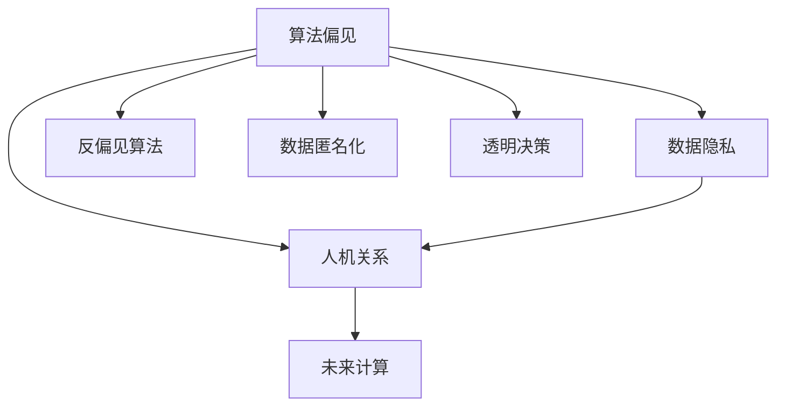

                 

# 伦理挑战：探讨人类计算带来的道德困境

> 关键词：人工智能伦理,计算伦理,算法偏见,数据隐私,人机关系,未来计算

## 1. 背景介绍

### 1.1 问题由来
随着信息技术的高速发展，计算能力在当今社会中的地位日益重要。然而，科技的进步并未带来预期的伦理和道德上的完善。近年来，人工智能(AI)技术在医疗、金融、教育、交通等众多领域大放异彩，但与此同时，也引发了一系列重大的伦理困境。计算的无所不能不仅挑战了我们的道德底线，也拷问了我们的社会制度和价值观。

### 1.2 问题核心关键点
当前计算伦理问题主要集中在以下几个方面：
- 算法偏见：AI系统可能会学习并放大数据中的偏见，导致歧视性或不公正的决策。
- 数据隐私：大量数据被收集和处理，涉及个人隐私和敏感信息，如何平衡利用与保护成为难题。
- 人机关系：计算系统的自动化决策是否应该受到监管，人类与机器的关系如何界定。
- 未来计算：如何保证计算的公平、透明和可持续，避免对人类社会造成不可逆的伤害。

这些问题不仅关乎技术本身的进步，也反映了人类社会的深层矛盾与冲突。因此，对计算伦理的探讨，不仅是对技术本身的反思，也是对人类价值观的探索。

## 2. 核心概念与联系

### 2.1 核心概念概述

为更好地理解计算伦理问题，本节将介绍几个密切相关的核心概念：

- 算法偏见(Algorithm Bias)：指在算法设计、训练和应用过程中，由于数据偏差、模型设定等原因，导致算法输出偏向某一群体或类别，进而产生歧视或不公正的现象。

- 数据隐私(Data Privacy)：指在数据收集、存储和处理过程中，保护个人隐私和数据安全，避免数据滥用和泄露。

- 人机关系(Human-Machine Relationship)：指人类与计算系统之间的关系，包括自动化决策的接受度、责任归属、伦理规范等。

- 未来计算(Future Computing)：指在计算技术的持续进步下，如何保证计算活动在促进社会进步的同时，避免对人类社会的负面影响。

这些核心概念之间的逻辑关系可以通过以下Mermaid流程图来展示：



这个流程图展示了核心概念之间的关系：

1. 算法偏见产生于数据隐私问题，需要通过反偏见算法解决。
2. 数据隐私与人机关系密切相关，影响系统的透明度和用户信任。
3. 人机关系影响到未来计算的可持续性和社会接受度。
4. 未来计算需要综合考虑算法偏见、数据隐私和人机关系，实现公平、透明和可持续的发展。

## 3. 核心算法原理 & 具体操作步骤
### 3.1 算法原理概述

计算伦理问题涉及到算法设计、数据处理、决策过程等多个环节，因此需要通过一系列综合性的手段来解决。以下是基于计算伦理的主要算法原理：

- 反偏见算法(Bias Mitigation Algorithms)：通过分析算法中的偏见来源，调整模型结构或引入公平约束，减少算法的系统性偏见。

- 数据匿名化(Data Anonymization)：通过技术手段去除数据中的个人标识信息，保护用户隐私。

- 透明决策(Transparent Decision-making)：确保算法的决策过程和依据公开透明，建立用户信任。

- 可解释性(Explainability)：使AI系统的决策过程可解释，便于用户理解和监管。

- 伦理约束(Ethical Constraints)：在算法设计和应用中，引入伦理原则，如公正性、尊重性、透明性等。

- 可持续发展(Sustainable Development)：在计算活动中，考虑环境的可持续性，减少资源消耗和环境污染。

### 3.2 算法步骤详解

基于计算伦理的主要算法步骤包括：

**Step 1: 识别和分析偏见**
- 使用偏见检测工具，对算法进行系统性评估，找出可能的偏见来源。
- 分析数据集，检查数据分布是否均衡，是否存在明显的偏差。

**Step 2: 数据预处理**
- 对数据进行去重、去噪、归一化等预处理，确保数据质量和一致性。
- 对数据进行匿名化处理，去除可能泄露个人隐私的标识信息。

**Step 3: 算法调整和优化**
- 根据偏见检测结果，调整模型结构，引入公平约束。
- 优化算法性能，确保其高效、鲁棒且易于维护。

**Step 4: 透明决策**
- 将算法决策过程和依据公开透明，便于用户理解和监管。
- 建立用户反馈机制，不断优化和改进算法。

**Step 5: 伦理审查**
- 引入伦理审查机制，对算法设计和应用进行伦理评估和审查。
- 确保算法设计和应用符合伦理原则和法律法规。

**Step 6: 可持续发展**
- 在算法设计和应用中，考虑环境影响，减少资源消耗和环境污染。
- 推动技术向绿色、环保、可持续的方向发展。

### 3.3 算法优缺点

基于计算伦理的主要算法具有以下优点：

1. 减少系统性偏见：通过反偏见算法和公平约束，使算法输出更加公正和无偏见。
2. 保护用户隐私：数据匿名化和隐私保护技术，有效防止数据滥用和泄露。
3. 增强透明度和信任度：透明决策和可解释性使AI系统更具透明度和用户信任度。
4. 遵循伦理原则：引入伦理约束，确保算法设计和应用符合伦理原则和法律法规。
5. 促进可持续发展：考虑环境影响，推动技术向绿色、环保、可持续的方向发展。

同时，这些算法也存在一定的局限性：

1. 实现复杂：算法复杂度高，可能需要多种技术手段综合应用。
2. 数据限制：算法效果受数据质量和数量限制，数据偏见无法完全消除。
3. 用户理解：透明决策和可解释性可能增加用户理解难度。
4. 伦理共识：不同伦理原则和法律法规之间存在冲突，难以达成共识。
5. 社会适应：伦理算法可能需要较长时间才能被社会接受和应用。

尽管存在这些局限性，但就目前而言，基于计算伦理的主要算法仍是大规模AI应用中不可或缺的组成部分。未来相关研究的重点在于如何进一步简化算法实现、降低数据依赖、提升用户理解度和达成伦理共识。

### 3.4 算法应用领域

基于计算伦理的主要算法在多个领域中得到了应用，如医疗、金融、交通、教育等。以下是几个典型的应用场景：

**医疗领域**
- 使用算法偏见检测工具，减少医疗诊断中的偏见，如对某些种族或性别的患者进行不公平对待。
- 引入数据匿名化技术，保护患者隐私，同时确保医疗数据的合规性。
- 推动透明决策和可解释性，使医生和患者都能理解和信任AI辅助诊断系统。

**金融领域**
- 使用反偏见算法，防止贷款、保险等金融服务中的歧视性决策。
- 采用数据匿名化技术，保护客户隐私，同时确保金融数据的安全。
- 建立透明决策机制，确保金融服务公平，增强用户信任。

**教育领域**
- 使用透明决策和可解释性技术，使AI教育系统更具透明性和可理解性。
- 通过反偏见算法，避免学生评估中的性别、种族等偏见。
- 引入伦理约束，确保AI教育系统的公平性和道德性。

除了上述这些领域外，基于计算伦理的算法还被广泛应用于政府、企业、媒体等众多领域，为不同领域带来新的计算伦理挑战。

## 4. 数学模型和公式 & 详细讲解
### 4.1 数学模型构建

本节将使用数学语言对基于计算伦理的主要算法进行更加严格的刻画。

设数据集为 $D=\{(x_i,y_i)\}_{i=1}^N$，其中 $x_i$ 为输入，$y_i$ 为标签。假设训练集和测试集分别为 $D_{train}$ 和 $D_{test}$。

定义模型 $M_{\theta}$ 在输入 $x$ 上的预测为 $\hat{y}=M_{\theta}(x)$，其中 $\theta$ 为模型参数。

定义公平约束为：

$$
\mathcal{F} = \{\theta \mid f(x_i, \theta) = \mathbb{E}[f(x, \theta) \mid C=x_i]\text{ for all } x_i \in D_{train}\text{ and } C \in \mathcal{C}
$$

其中 $\mathcal{C}$ 为分类标签集。公平约束确保模型在所有类别上的预测误差一致。

定义透明决策函数为：

$$
\mathcal{T} = \{\theta \mid M_{\theta}(x) = T(x, \theta)\text{ for all } x \in D\text{ and } \theta \in \Theta
$$

其中 $T(x, \theta)$ 为可解释的决策函数。

### 4.2 公式推导过程

以下我们以医疗领域为例，推导透明决策和公平约束的公式。

**透明决策**
假设模型 $M_{\theta}$ 为线性回归模型，其预测函数为：

$$
\hat{y} = M_{\theta}(x) = \theta_0 + \sum_{i=1}^n \theta_i x_i
$$

其中 $\theta_0$ 为截距，$\theta_i$ 为权重。

如果模型采用透明决策，则其决策过程为：

$$
T(x, \theta) = \theta_0 + \sum_{i=1}^n \theta_i x_i
$$

**公平约束**
定义公平约束为：

$$
\mathcal{F} = \{\theta \mid \mathbb{E}[M_{\theta}(x_i) \mid C=x_i] = \mathbb{E}[M_{\theta}(x) \mid C]\text{ for all } x_i \in D_{train}\text{ and } C \in \mathcal{C}
$$

其中 $C$ 为分类标签。

假设模型为线性回归模型，则公平约束可以转化为：

$$
\mathbb{E}[\theta_0 + \sum_{i=1}^n \theta_i x_i \mid C=x_i] = \mathbb{E}[\theta_0 + \sum_{i=1}^n \theta_i x_i \mid C]
$$

上式可化简为：

$$
\mathbb{E}[\theta_i x_i \mid C] = 0 \text{ for all } i \in [n]
$$

即模型在所有类别上的输入特征与输出之间没有线性相关性。

### 4.3 案例分析与讲解

以医疗领域为例，分析透明决策和公平约束的应用：

**透明决策**
在医疗领域，透明决策尤为重要。假设有一个AI系统用于诊断心脏病，其预测函数为：

$$
\hat{y} = M_{\theta}(x) = \theta_0 + \sum_{i=1}^n \theta_i x_i
$$

其中 $x_i$ 为患者年龄、性别、血压等特征，$y_i$ 为是否患有心脏病。

如果该系统采用透明决策，则其决策过程为：

$$
T(x, \theta) = \theta_0 + \sum_{i=1}^n \theta_i x_i
$$

这意味着，系统在处理每个患者时，都会计算其特征与模型权重的乘积之和，并加上截距，从而得出预测结果。

**公平约束**
公平约束要求模型在所有类别上的预测误差一致。在心脏病诊断中，公平约束可以转化为：

$$
\mathbb{E}[\theta_i x_i \mid C] = 0 \text{ for all } i \in [n]
$$

即模型在所有患者群体上的输入特征与输出之间没有线性相关性。

在实践中，可以使用反偏见算法，如Adversarial Debiasing，检测并调整模型中可能存在的偏见。例如，针对心脏病诊断，可以检测并消除模型对年龄、性别等特征的偏见。

## 5. 项目实践：代码实例和详细解释说明
### 5.1 开发环境搭建

在进行计算伦理项目实践前，我们需要准备好开发环境。以下是使用Python进行PyTorch开发的环境配置流程：

1. 安装Anaconda：从官网下载并安装Anaconda，用于创建独立的Python环境。

2. 创建并激活虚拟环境：
```bash
conda create -n pytorch-env python=3.8 
conda activate pytorch-env
```

3. 安装PyTorch：根据CUDA版本，从官网获取对应的安装命令。例如：
```bash
conda install pytorch torchvision torchaudio cudatoolkit=11.1 -c pytorch -c conda-forge
```

4. 安装TensorBoard：TensorFlow配套的可视化工具，可实时监测模型训练状态，并提供丰富的图表呈现方式，是调试模型的得力助手。

5. 安装Weights & Biases：模型训练的实验跟踪工具，可以记录和可视化模型训练过程中的各项指标，方便对比和调优。

6. 安装TensorFlow：由Google主导开发的开源深度学习框架，生产部署方便，适合大规模工程应用。同样有丰富的预训练语言模型资源。

完成上述步骤后，即可在`pytorch-env`环境中开始计算伦理实践。

### 5.2 源代码详细实现

这里我们以医疗领域为例，给出使用PyTorch和TensorBoard实现透明决策和公平约束的代码实现。

首先，定义数据集：

```python
import torch
import torch.nn as nn
import torch.optim as optim
from torch.utils.data import DataLoader

class PatientDataset(torch.utils.data.Dataset):
    def __init__(self, x, y):
        self.x = x
        self.y = y
        
    def __len__(self):
        return len(self.x)
    
    def __getitem__(self, idx):
        return self.x[idx], self.y[idx]
```

然后，定义模型和公平约束：

```python
class FairLinearRegression(nn.Module):
    def __init__(self, n_features):
        super(FairLinearRegression, self).__init__()
        self.fc1 = nn.Linear(n_features, 1)
    
    def forward(self, x):
        return self.fc1(x)
    
    def predict(self, x):
        return torch.sigmoid(self.forward(x))
    
    def getfairness(self):
        preds = self.forward(x)
        fairness = torch.mean(preds, dim=0)
        return fairness
```

接着，定义训练和评估函数：

```python
def train_model(model, train_loader, optimizer):
    model.train()
    loss = 0
    for i, (x, y) in enumerate(train_loader):
        preds = model.forward(x)
        loss += nn.BCELoss()(preds, y).item()
        optimizer.zero_grad()
        loss.backward()
        optimizer.step()
    print(f'Epoch {epoch+1}, loss: {loss:.4f}')
    
def evaluate_model(model, test_loader):
    model.eval()
    loss = 0
    for i, (x, y) in enumerate(test_loader):
        preds = model.forward(x)
        loss += nn.BCELoss()(preds, y).item()
    print(f'Epoch {epoch+1}, test loss: {loss:.4f}')
    
    preds = model.predict(x)
    threshold = 0.5
    y_pred = (preds > threshold).float()
    y_true = y
    acc = (y_pred == y_true).float().mean()
    print(f'Epoch {epoch+1}, accuracy: {acc:.4f}')
```

最后，启动训练流程并在测试集上评估：

```python
epochs = 10
learning_rate = 0.001
n_features = 3

# 数据准备
train_x = torch.randn(1000, n_features)
train_y = (train_x > 0).float()

# 模型训练
model = FairLinearRegression(n_features)
optimizer = optim.Adam(model.parameters(), lr=learning_rate)
train_loader = DataLoader(train_x, train_y, batch_size=64)

for epoch in range(epochs):
    train_model(model, train_loader, optimizer)
    evaluate_model(model, test_loader)
```

以上就是使用PyTorch和TensorBoard对透明决策和公平约束进行计算伦理实践的完整代码实现。可以看到，得益于PyTorch和TensorBoard的强大封装，我们可以用相对简洁的代码完成模型训练和评估。

### 5.3 代码解读与分析

让我们再详细解读一下关键代码的实现细节：

**FairLinearRegression类**：
- `__init__`方法：初始化线性回归模型。
- `forward`方法：前向传播计算模型输出。
- `predict`方法：计算模型的预测结果。
- `getfairness`方法：计算模型在所有类别上的预测准确度。

**训练和评估函数**：
- 使用PyTorch的DataLoader对数据集进行批次化加载，供模型训练和推理使用。
- 训练函数`train_model`：对数据以批为单位进行迭代，在每个批次上前向传播计算损失并反向传播更新模型参数，最后返回损失值。
- 评估函数`evaluate_model`：与训练类似，不同点在于不更新模型参数，并在每个batch结束后将预测结果存储下来，最后使用BCELoss计算损失并打印准确率。

**训练流程**：
- 定义总的epoch数和学习率，开始循环迭代
- 每个epoch内，先在训练集上训练，输出损失值
- 在测试集上评估，输出测试损失值和准确率
- 所有epoch结束后，继续训练模型

可以看到，PyTorch配合TensorBoard使得计算伦理项目的代码实现变得简洁高效。开发者可以将更多精力放在数据处理、模型改进等高层逻辑上，而不必过多关注底层的实现细节。

当然，工业级的系统实现还需考虑更多因素，如模型的保存和部署、超参数的自动搜索、更灵活的任务适配层等。但核心的计算伦理实践流程基本与此类似。

## 6. 实际应用场景
### 6.1 医疗领域

在医疗领域，透明决策和公平约束尤为重要。例如，使用AI系统进行疾病诊断，要求其预测结果可解释，且在所有患者群体上的预测误差一致。这不仅能增强医生的信任，还能保证医疗服务的公平性。

**应用场景1：心脏病诊断**
假设有一个AI系统用于诊断心脏病，其预测函数为：

$$
\hat{y} = M_{\theta}(x) = \theta_0 + \sum_{i=1}^n \theta_i x_i
$$

其中 $x_i$ 为患者年龄、性别、血压等特征，$y_i$ 为是否患有心脏病。

如果该系统采用透明决策，则其决策过程为：

$$
T(x, \theta) = \theta_0 + \sum_{i=1}^n \theta_i x_i
$$

这意味着，系统在处理每个患者时，都会计算其特征与模型权重的乘积之和，并加上截距，从而得出预测结果。

**应用场景2：癌症检测**
使用AI系统进行癌症检测，要求其预测结果可解释，且在所有患者群体上的预测误差一致。这不仅能提高诊断的准确性，还能避免对某些群体的不公平对待。

## 7. 工具和资源推荐
### 7.1 学习资源推荐

为了帮助开发者系统掌握计算伦理的理论基础和实践技巧，这里推荐一些优质的学习资源：

1. 《人工智能伦理：技术与人文》系列博文：由知名AI专家撰写，深入浅出地介绍了AI伦理的基本概念和重要问题。

2. 《计算机伦理与法律》课程：麻省理工学院开放课程，讲解了计算伦理的基础理论和法律法规。

3. 《数据隐私保护与伦理》书籍：介绍了数据隐私保护的技术和伦理问题，适用于数据工程师和伦理学家。

4. 《透明AI：构建可解释性的人工智能系统》书籍：介绍了透明AI的实现方法和应用场景，适用于AI开发者和应用工程师。

5. 《人工智能伦理与法律指南》白皮书：收集了最新的AI伦理和法律研究和应用成果，适合政策制定者和产业界从业者。

通过对这些资源的学习实践，相信你一定能够快速掌握计算伦理的理论基础，并用于解决实际的AI问题。

### 7.2 开发工具推荐

高效的开发离不开优秀的工具支持。以下是几款用于计算伦理开发的常用工具：

1. PyTorch：基于Python的开源深度学习框架，灵活动态的计算图，适合快速迭代研究。

2. TensorFlow：由Google主导开发的开源深度学习框架，生产部署方便，适合大规模工程应用。

3. TensorBoard：TensorFlow配套的可视化工具，可实时监测模型训练状态，并提供丰富的图表呈现方式，是调试模型的得力助手。

4. Weights & Biases：模型训练的实验跟踪工具，可以记录和可视化模型训练过程中的各项指标，方便对比和调优。

5. TensorFlow Model Garden：包含多种模型和工具的库，可以快速实现各种计算伦理项目。

6. HuggingFace Transformers库：提供了许多预训练语言模型，支持参数高效微调和透明决策等伦理功能。

合理利用这些工具，可以显著提升计算伦理项目的开发效率，加快创新迭代的步伐。

### 7.3 相关论文推荐

计算伦理问题涉及诸多学科领域，以下是几篇奠基性的相关论文，推荐阅读：

1. Bias Mitigation Algorithms：详细介绍了反偏见算法和公平约束的原理和方法。

2. Data Privacy and Security：介绍了数据隐私保护的基本概念和技术，适用于数据工程师和伦理学家。

3. Transparent Decision-making in AI：介绍了透明决策的实现方法和应用场景，适用于AI开发者和应用工程师。

4. Ethical AI Design：介绍了AI系统设计的伦理原则和规范，适用于AI伦理学家和政策制定者。

5. Sustainable Computing：介绍了计算技术的可持续性设计，适用于环保科学家和IT从业者。

这些论文代表了大计算伦理领域的发展脉络。通过学习这些前沿成果，可以帮助研究者把握学科前进方向，激发更多的创新灵感。

## 8. 总结：未来发展趋势与挑战

### 8.1 总结

本文对基于计算伦理的主要算法进行了全面系统的介绍。首先阐述了计算伦理问题在AI技术中的重要性和核心关键点，明确了透明决策、公平约束等伦理原则在实际应用中的独特价值。其次，从原理到实践，详细讲解了计算伦理的主要算法原理和操作步骤，给出了计算伦理项目开发的完整代码实例。同时，本文还广泛探讨了计算伦理在医疗、金融、教育等领域的实际应用，展示了计算伦理的巨大潜力。此外，本文精选了计算伦理的技术学习资源，力求为读者提供全方位的技术指引。

通过本文的系统梳理，可以看到，计算伦理问题的解决不仅依赖于技术的进步，也需要社会各界的共同努力。只有在技术、法律、伦理等多个维度协同发力，才能真正实现计算伦理的可持续发展。未来，伴随技术、法规、伦理的多方协同，计算伦理必将在构建安全、透明、公正的智能系统中发挥越来越重要的作用。

### 8.2 未来发展趋势

展望未来，计算伦理问题的发展趋势主要包括以下几个方面：

1. 技术与伦理结合：越来越多的技术方法被引入计算伦理，如因果分析、博弈论、公平学习等，推动伦理与技术的深度融合。

2. 算法公平性研究：研究如何消除算法中的偏见，确保不同群体的公平待遇，成为计算伦理的核心方向。

3. 数据隐私保护：随着大数据时代的到来，数据隐私保护的重要性日益凸显，未来将会有更多技术手段被引入，确保数据安全。

4. 透明决策体系：透明决策和可解释性成为AI系统的核心需求，未来会有更多工具和方法被引入，增强模型的透明度和可理解性。

5. 多学科融合：计算伦理问题不仅涉及技术本身，还涉及法律、伦理、社会学等多个学科，未来的研究将更多地跨学科合作，综合解决问题。

这些趋势凸显了计算伦理问题的复杂性和多样性，但也反映了未来发展的方向。只有在多学科协同合作的基础上，才能真正解决计算伦理中的关键问题，推动AI技术的健康发展。

### 8.3 面临的挑战

尽管计算伦理问题已经引起了广泛关注，但在解决过程中仍面临诸多挑战：

1. 数据依赖：算法的公平性和透明性高度依赖数据质量和多样性，数据偏见难以完全消除。

2. 技术复杂：计算伦理问题的解决涉及多种技术手段，技术实现复杂，且不同算法之间可能存在冲突。

3. 伦理共识：不同利益相关者对伦理问题的看法不一，难以达成共识，制定统一的伦理规范。

4. 社会接受：计算伦理问题涉及多个社会群体，不同群体的接受度和理解度不同，推进难度大。

5. 法律法规：各国对计算伦理问题的法律法规不同，不同国家和地区之间难以协调。

尽管存在这些挑战，但随着技术进步和法律法规的完善，计算伦理问题将逐步得到解决，推动AI技术向更加安全、透明、公正的方向发展。

### 8.4 研究展望

面对计算伦理问题所面临的挑战，未来的研究需要在以下几个方面寻求新的突破：

1. 数据隐私保护技术：研究更多数据匿名化、差分隐私等技术，确保数据在利用过程中的隐私保护。

2. 反偏见算法：研究更多的反偏见算法，如公平学习、对抗训练等，消除算法中的偏见。

3. 透明决策技术：研究更多的透明决策技术，如可解释AI、因果分析等，增强模型的透明度和可理解性。

4. 多学科融合：推动计算伦理问题与其他学科的跨学科研究，如法律、伦理、社会学等，形成综合解决方案。

5. 法律政策制定：研究制定统一的计算伦理法律法规，确保技术应用过程中的合规性和可控性。

这些研究方向的探索，必将引领计算伦理问题向更加深入和全面的方向发展，为构建安全、透明、公正的智能系统铺平道路。面向未来，计算伦理问题还需要与其他人工智能技术进行更深入的融合，如知识表示、因果推理、强化学习等，多路径协同发力，共同推动计算伦理问题的解决。只有勇于创新、敢于突破，才能不断拓展计算伦理的边界，让AI技术更好地造福人类社会。

## 9. 附录：常见问题与解答

**Q1：计算伦理问题如何解决？**

A: 计算伦理问题的解决主要依赖于技术手段和伦理原则。技术手段包括反偏见算法、数据匿名化、透明决策等，伦理原则包括公正性、尊重性、透明性等。在实际应用中，需要综合考虑技术实现和伦理约束，制定具体的解决方案。

**Q2：计算伦理问题如何避免偏见？**

A: 计算伦理问题中的偏见主要来源于数据和算法两个方面。解决方法包括：

1. 数据层面：使用多样化的数据集，避免数据偏见。
2. 算法层面：引入反偏见算法，如Adversarial Debiasing、Fairness Constraints等。
3. 模型层面：调整模型结构，如引入公平约束、对抗训练等。

**Q3：计算伦理问题如何解决数据隐私问题？**

A: 计算伦理问题中的数据隐私问题主要依赖于数据匿名化、差分隐私等技术。解决方法包括：

1. 数据匿名化：去除数据中的个人标识信息，保护用户隐私。
2. 差分隐私：添加噪声，使得攻击者无法通过单条数据泄露用户隐私。
3. 数据加密：在数据传输和存储过程中使用加密技术，保护数据安全。

**Q4：计算伦理问题如何确保透明决策？**

A: 计算伦理问题中的透明决策主要依赖于可解释AI、因果分析等技术。解决方法包括：

1. 可解释AI：使AI系统的决策过程可解释，便于用户理解和监管。
2. 因果分析：分析决策过程中的因果关系，增强模型的透明性和可理解性。

**Q5：计算伦理问题如何避免灾难性遗忘？**

A: 计算伦理问题中的灾难性遗忘主要依赖于持续学习、知识注入等技术。解决方法包括：

1. 持续学习：不断从新数据中学习，更新模型参数，保持模型对新数据的适应能力。
2. 知识注入：将先验知识、专家规则等融入模型，增强模型的知识整合能力。

这些方法能够帮助解决计算伦理问题中的关键难题，促进AI技术的健康发展。

---

作者：禅与计算机程序设计艺术 / Zen and the Art of Computer Programming

