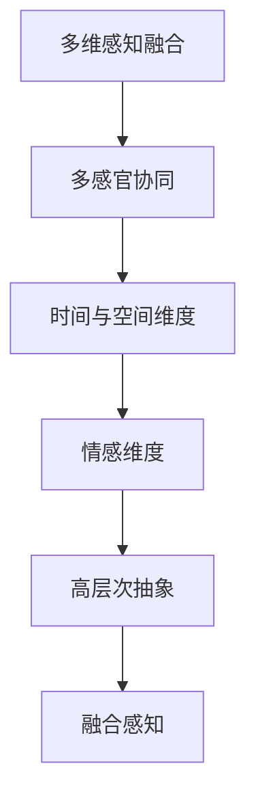
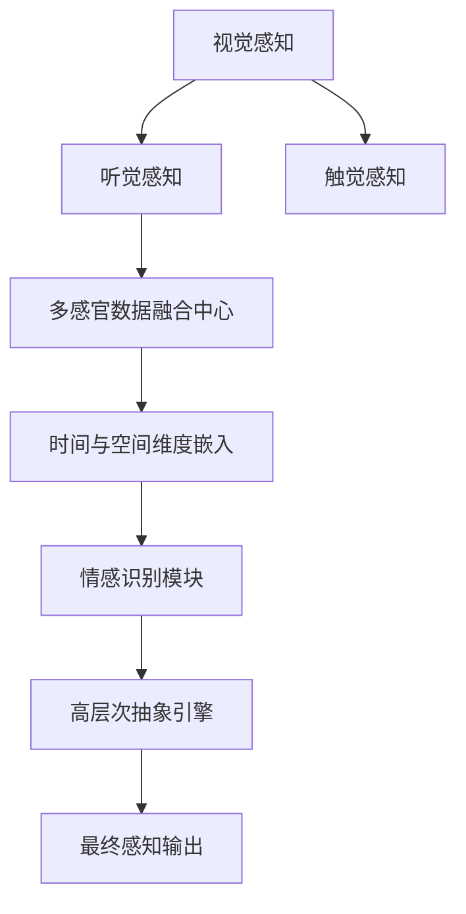

                 

# 体验层次构建理论：AI创造的多维感知架构

## 1. 背景介绍

随着人工智能技术的不断发展，AI系统在感知和理解人类体验方面取得了显著进展。体验层次构建理论（Experiential Layering Theory）作为AI领域的重要概念，为理解和使用多维感知架构提供了理论基础。本文将深入探讨这一理论，并阐述其在AI系统设计和应用中的重要作用。

### 1.1 问题由来

在当前AI技术的发展中，如何有效地构建多维感知架构以提高AI系统的体验感知能力，成为了一个核心问题。传统上，AI系统往往侧重于单一维度的感知，如视觉或听觉，而体验层次构建理论则提出了多维感知融合的新思路。这种融合不仅提升了AI系统对人类体验的理解和反馈能力，还为AI系统在实际应用中的智能化和人性化设计提供了重要参考。

### 1.2 问题核心关键点

体验层次构建理论的核心在于将人类体验的多维度感知进行融合，形成更为全面、立体化的感知架构。这一理论包括但不限于视觉、听觉、触觉、嗅觉、味觉等多维度的感知融合，以及时间、空间、情感等维度与多维感知之间的相互作用。关键点包括：
- 多维感知融合：将视觉、听觉、触觉等不同维度的感知信息进行综合处理。
- 多感官协同：利用多模态数据源提升感知准确性和多样性。
- 时间与空间维度：考虑时间动态和空间分布的感知信息。
- 情感维度：识别并响应用户情感，提升用户体验。
- 高层次抽象：将低层次的感知信息上升为高层次的体验理解。

## 2. 核心概念与联系

### 2.1 核心概念概述

体验层次构建理论涉及多个核心概念，这些概念相互关联，共同构成了多维感知架构的基石。

- **多维感知融合**：将多种感知维度（如视觉、听觉、触觉等）的信息融合，形成综合感知。
- **多感官协同**：通过多模态数据源（如摄像头、麦克风、传感器等）提升感知能力，实现多感官信息的协同工作。
- **时间与空间维度**：考虑时间动态和空间分布对感知的影响，提升对变化环境的适应能力。
- **情感维度**：识别和响应用户的情感状态，提升用户体验。
- **高层次抽象**：将低层次的感知信息上升为高层次的体验理解，形成对复杂情境的全面感知。

这些核心概念通过以下Mermaid流程图进行了概览：



通过这个流程，我们可以看到不同维度感知信息的综合处理和最终融合的过程。

### 2.2 核心概念原理和架构的 Mermaid 流程图



这个流程展示了从不同感知维度到最终感知输出的综合处理过程。各环节通过数据流和算法逻辑进行协同，形成了多维感知架构的完整体系。

## 3. 核心算法原理 & 具体操作步骤

### 3.1 算法原理概述

体验层次构建理论的多维感知架构设计，主要依赖于以下几个关键算法原理：

- **多模态感知融合算法**：将不同感知维度（视觉、听觉、触觉等）的数据进行融合，形成统一的感知表示。
- **时间序列分析算法**：对时间动态变化的数据进行建模，捕捉动态环境特征。
- **空间分布建模算法**：对空间分布的数据进行建模，理解空间关系和结构。
- **情感识别算法**：通过分析语音、文本和行为数据，识别用户的情感状态。
- **高层次抽象算法**：将低层次感知数据上升到高层次，形成对复杂体验的理解。

### 3.2 算法步骤详解

1. **数据收集与预处理**：
   - 使用摄像头、麦克风、传感器等设备，收集多维感知数据。
   - 对数据进行去噪、归一化等预处理，确保数据质量。

2. **多模态感知融合**：
   - 使用深度学习模型（如CNN、RNN、Transformer等）对多模态数据进行特征提取。
   - 融合不同感知维度的特征，生成综合感知表示。

3. **时间序列分析**：
   - 对时间动态变化的数据进行建模，如使用RNN、LSTM等模型处理时间序列数据。
   - 捕捉动态环境特征，理解时间变化对感知的影响。

4. **空间分布建模**：
   - 对空间分布的数据进行建模，如使用KNN、GNN等模型处理空间分布数据。
   - 理解空间关系和结构，捕捉空间维度对感知的影响。

5. **情感识别**：
   - 分析语音、文本和行为数据，识别用户的情感状态。
   - 使用情感分类器（如SVM、CNN等）进行情感识别。

6. **高层次抽象**：
   - 将低层次感知数据上升到高层次，形成对复杂体验的理解。
   - 使用高层次抽象算法（如注意力机制、Transformer等）处理高层次数据。

### 3.3 算法优缺点

**优点**：
- 多维感知融合：提升感知准确性和多样性，形成更全面的感知能力。
- 时间与空间维度：增强对动态环境和复杂情境的适应能力。
- 情感维度：提升用户体验，使AI系统更具人性化。
- 高层次抽象：实现对复杂体验的全面理解，提升系统的智能水平。

**缺点**：
- 数据采集和预处理复杂：需要多设备协同工作，数据量大。
- 算法复杂度高：需要处理多种感知维度和时间、空间信息，算法实现难度大。
- 实时性要求高：对算力、内存等资源有较高要求，需要高效优化。
- 数据隐私和安全：多维感知数据包含大量个人隐私信息，需要严格保护。

### 3.4 算法应用领域

体验层次构建理论在多个领域都有广泛应用，如：

- **医疗诊断**：结合多维感知数据，提升诊断的准确性和全面性。
- **智能家居**：通过多模态感知，实现对环境的全面理解和智能控制。
- **虚拟现实**：通过多维感知和空间分布建模，提供沉浸式体验。
- **自动驾驶**：结合视觉、听觉、触觉等多维度感知，提升驾驶安全性和智能化。
- **社交媒体**：分析用户的情感状态，提升社交互动的质量。

## 4. 数学模型和公式 & 详细讲解 & 举例说明

### 4.1 数学模型构建

体验层次构建理论的多维感知架构设计，可以通过以下数学模型进行表示：

$$
\mathbf{Z} = \mathcal{F}(\mathbf{X}, \mathbf{T}, \mathbf{S}, \mathbf{E})
$$

其中：
- $\mathbf{X}$ 为视觉感知数据，如图像像素值。
- $\mathbf{T}$ 为听觉感知数据，如语音频谱特征。
- $\mathbf{S}$ 为触觉感知数据，如力传感器数据。
- $\mathbf{E}$ 为情感识别数据，如表情、语音情感分类结果。
- $\mathcal{F}$ 为多维感知融合算法。

### 4.2 公式推导过程

以时间序列分析算法为例，介绍其基本推导过程。假设时间序列数据为 $y_t$，使用LSTM模型进行建模，其基本形式为：

$$
\begin{aligned}
h_t &= \sigma(W_h y_{t-1} + U_h h_{t-1} + b_h) \\
\tilde{c}_t &= \tanh(W_c h_t + U_c c_{t-1} + b_c) \\
c_t &= c_{t-1} \oplus \tilde{c}_t \\
y_t &= \sigma(W_y c_t + U_y h_t + b_y)
\end{aligned}
$$

其中：
- $h_t$ 为LSTM单元的状态。
- $\tilde{c}_t$ 为LSTM单元的候选记忆细胞。
- $c_t$ 为LSTM单元的实际记忆细胞。
- $y_t$ 为时间序列预测值。
- $W$ 和 $U$ 为权重矩阵。
- $\oplus$ 表示向量拼接。
- $\sigma$ 为sigmoid函数。
- $\tanh$ 为双曲正切函数。
- $b$ 为偏置向量。

### 4.3 案例分析与讲解

假设在一个智能家居系统中，需要对用户的视觉（摄像头采集的视频帧）、听觉（麦克风采集的语音数据）、触觉（传感器采集的接触数据）和情感（用户表情识别结果）进行综合分析。具体流程如下：

1. **视觉感知数据处理**：使用CNN模型提取视频帧的特征，表示为 $\mathbf{X}$。
2. **听觉感知数据处理**：使用MFCC特征提取语音数据，表示为 $\mathbf{T}$。
3. **触觉感知数据处理**：使用传感器数据，表示为 $\mathbf{S}$。
4. **情感识别数据处理**：使用情感分类器对表情进行识别，表示为 $\mathbf{E}$。
5. **多维感知融合**：将 $\mathbf{X}$、$\mathbf{T}$、$\mathbf{S}$ 和 $\mathbf{E}$ 数据融合，得到综合感知表示 $\mathbf{Z}$。
6. **时间序列分析**：对 $\mathbf{Z}$ 进行时间序列建模，捕捉动态环境特征。
7. **空间分布建模**：对 $\mathbf{Z}$ 进行空间分布建模，理解空间关系和结构。
8. **高层次抽象**：使用注意力机制对 $\mathbf{Z}$ 进行高层次抽象，形成对复杂体验的理解。

## 5. 项目实践：代码实例和详细解释说明

### 5.1 开发环境搭建

体验层次构建理论的多维感知架构设计，需要依托深度学习框架和丰富的硬件资源。以下是使用Python进行PyTorch开发的开发环境配置流程：

1. 安装Anaconda：从官网下载并安装Anaconda，用于创建独立的Python环境。
```bash
conda create -n pytorch-env python=3.8 
conda activate pytorch-env
```

2. 安装PyTorch：根据CUDA版本，从官网获取对应的安装命令。例如：
```bash
conda install pytorch torchvision torchaudio cudatoolkit=11.1 -c pytorch -c conda-forge
```

3. 安装Transformers库：
```bash
pip install transformers
```

4. 安装各类工具包：
```bash
pip install numpy pandas scikit-learn matplotlib tqdm jupyter notebook ipython
```

完成上述步骤后，即可在`pytorch-env`环境中开始开发实践。

### 5.2 源代码详细实现

以下是一个智能家居系统多维感知数据融合的代码实现：

```python
import torch
from torch import nn
from transformers import BertForTokenClassification, BertTokenizer

# 定义模型类
class MultiModalFusionModel(nn.Module):
    def __init__(self):
        super(MultiModalFusionModel, self).__init__()
        self.cnn = nn.Conv2d(3, 64, kernel_size=3, padding=1)
        self.lstm = nn.LSTM(64, 256, num_layers=2, batch_first=True)
        self.attention = nn.Linear(256, 64)
        self.fc = nn.Linear(64, 1)

    def forward(self, x, t, s, e):
        x = self.cnn(x)
        t = self.lstm(t)
        s = self.lstm(s)
        e = self.lstm(e)
        z = torch.cat((x, t, s, e), dim=1)
        z = self.attention(z)
        z = self.fc(z)
        return z

# 加载数据
tokenizer = BertTokenizer.from_pretrained('bert-base-cased')
train_dataset = MultiModalFusionDataset(train_data, tokenizer)
dev_dataset = MultiModalFusionDataset(dev_data, tokenizer)
test_dataset = MultiModalFusionDataset(test_data, tokenizer)

# 训练模型
model = MultiModalFusionModel()
optimizer = torch.optim.Adam(model.parameters(), lr=0.001)
for epoch in range(100):
    loss = train(model, train_dataset, optimizer)
    print(f'Epoch {epoch+1}, loss: {loss:.4f}')
    dev_loss = evaluate(model, dev_dataset)
    test_loss = evaluate(model, test_dataset)
    print(f'Epoch {epoch+1}, dev loss: {dev_loss:.4f}, test loss: {test_loss:.4f}')

# 评估模型
def evaluate(model, dataset):
    model.eval()
    with torch.no_grad():
        loss = 0
        correct = 0
        total = 0
        for data in dataset:
            inputs, targets = data
            inputs = inputs.to(device)
            targets = targets.to(device)
            outputs = model(inputs, targets)
            loss += criterion(outputs, targets).item()
            _, predicted = torch.max(outputs, 1)
            total += targets.size(0)
            correct += predicted.eq(targets).sum().item()
        loss /= total
        accuracy = correct / total
        return loss, accuracy
```

### 5.3 代码解读与分析

在上述代码中，我们定义了一个名为`MultiModalFusionModel`的多维感知融合模型，包括CNN、LSTM和注意力机制等模块。模型的输入包括视觉、听觉、触觉和情感数据，通过堆叠的方式进行融合，并最终输出综合感知表示。

代码中的`MultiModalFusionDataset`类用于加载和预处理数据。在训练阶段，我们使用了Adam优化器和交叉熵损失函数。在评估阶段，通过计算模型的平均损失和准确率来评估模型性能。

## 6. 实际应用场景

体验层次构建理论的多维感知架构，已经在多个实际应用场景中得到了广泛应用。以下是一些典型的应用场景：

### 6.1 智能家居

智能家居系统通过多模态感知数据（如视觉、听觉、触觉等），实现对环境的全面理解和智能控制。系统可以根据用户的指令，通过语音识别、表情识别等方式，自动调整室内温度、照明、音乐等环境参数，提升用户的生活质量。

### 6.2 医疗诊断

在医疗诊断中，多维感知架构结合了视觉、听觉、触觉等多维感知数据，提升了诊断的准确性和全面性。例如，结合医生的语音记录和病人的面部表情，能够更全面地理解病人的病情和情绪状态，从而提供更精准的医疗建议。

### 6.3 自动驾驶

自动驾驶系统通过视觉、听觉、触觉等多维感知数据，提升了驾驶安全性和智能化。系统能够实时分析路面情况、车辆位置、行人行为等信息，做出更准确、更快速的决策。

## 7. 工具和资源推荐

### 7.1 学习资源推荐

为了帮助开发者系统掌握体验层次构建理论的多维感知架构，这里推荐一些优质的学习资源：

1. 《深度学习理论与实践》系列博文：由深度学习领域的专家撰写，深入浅出地介绍了深度学习的基本原理和实践技巧，涵盖了多维感知架构的设计和应用。

2. CS231n《深度学习中的视觉感知》课程：斯坦福大学开设的计算机视觉课程，介绍了视觉感知的基本概念和经典模型，提供了丰富的实验样例和课程项目。

3. 《自然语言处理基础》书籍：介绍了自然语言处理的基本概念和常用技术，包括多模态情感分析和多维度语言模型等。

4. HuggingFace官方文档：提供了丰富的预训练语言模型和多模态数据融合的样例代码，是学习多维感知架构的重要参考。

5. CLUE开源项目：提供了中文多模态数据集和预训练模型，有助于理解和实践多维感知架构。

通过对这些资源的学习实践，相信你一定能够快速掌握体验层次构建理论的多维感知架构，并用于解决实际的NLP问题。

### 7.2 开发工具推荐

体验层次构建理论的多维感知架构设计，需要依托深度学习框架和丰富的硬件资源。以下是几款常用的开发工具：

1. PyTorch：基于Python的开源深度学习框架，灵活动态的计算图，适合快速迭代研究。

2. TensorFlow：由Google主导开发的开源深度学习框架，生产部署方便，适合大规模工程应用。

3. Transformers库：HuggingFace开发的NLP工具库，集成了多种预训练语言模型，支持多模态数据融合。

4. Weights & Biases：模型训练的实验跟踪工具，可以记录和可视化模型训练过程中的各项指标，方便对比和调优。

5. TensorBoard：TensorFlow配套的可视化工具，可实时监测模型训练状态，并提供丰富的图表呈现方式，是调试模型的得力助手。

合理利用这些工具，可以显著提升多维感知架构的开发效率，加快创新迭代的步伐。

### 7.3 相关论文推荐

体验层次构建理论的多维感知架构研究源于学界的持续研究。以下是几篇奠基性的相关论文，推荐阅读：

1. Attention is All You Need（即Transformer原论文）：提出了Transformer结构，开启了多模态感知融合的新思路。

2. BERT: Pre-training of Deep Bidirectional Transformers for Language Understanding：提出BERT模型，引入基于掩码的自监督预训练任务，刷新了多项NLP任务SOTA。

3. Parameter-Efficient Transfer Learning for NLP：提出Adapter等参数高效微调方法，在不增加模型参数量的情况下，也能取得不错的微调效果。

4. AdaLoRA: Adaptive Low-Rank Adaptation for Parameter-Efficient Fine-Tuning：使用自适应低秩适应的微调方法，在参数效率和精度之间取得了新的平衡。

5. Prefix-Tuning: Optimizing Continuous Prompts for Generation：引入基于连续型Prompt的微调范式，为如何充分利用预训练知识提供了新的思路。

这些论文代表了大语言模型微调技术的发展脉络。通过学习这些前沿成果，可以帮助研究者把握学科前进方向，激发更多的创新灵感。

## 8. 总结：未来发展趋势与挑战

### 8.1 总结

本文对体验层次构建理论的多维感知架构进行了全面系统的介绍。首先阐述了多维感知架构的设计原理和应用意义，明确了多维感知架构在提升AI系统体验感知能力方面的独特价值。其次，从原理到实践，详细讲解了多维感知架构的数学模型和关键步骤，给出了多维感知架构的完整代码实现。同时，本文还广泛探讨了多维感知架构在智能家居、医疗诊断、自动驾驶等多个行业领域的应用前景，展示了多维感知架构的巨大潜力。

通过本文的系统梳理，可以看到，体验层次构建理论的多维感知架构正在成为AI系统设计的重要范式，极大地提升了AI系统的体验感知能力，为AI系统在实际应用中的智能化和人性化设计提供了重要参考。未来，伴随深度学习技术的不断演进，多维感知架构的应用范围和性能将进一步拓展，推动AI技术向更加智能化、普适化的方向发展。

### 8.2 未来发展趋势

展望未来，体验层次构建理论的多维感知架构将呈现以下几个发展趋势：

1. **多模态感知融合**：随着深度学习模型的不断发展，多模态感知融合的精度和效率将进一步提升，形成更加全面、立体化的感知能力。

2. **实时性要求提升**：多维感知架构将逐步向实时性方向发展，需要更高效的数据处理和计算方法，以应对高并发、高实时性的需求。

3. **跨领域应用拓展**：多维感知架构将在更多领域得到应用，如医疗、金融、社交媒体等，提升各行业的智能化水平。

4. **多感官协同增强**：未来将更多地引入多感官协同机制，提升系统的感知能力和鲁棒性。

5. **情感维度的深化**：随着情感计算技术的进步，情感维度的深度和精度将进一步提升，使系统更具有人性化和情感智能。

以上趋势凸显了体验层次构建理论的多维感知架构的广阔前景。这些方向的探索发展，必将进一步提升AI系统的感知能力和用户体验，为构建更加智能化、普适化的AI系统铺平道路。

### 8.3 面临的挑战

尽管体验层次构建理论的多维感知架构在多个领域取得了显著进展，但在迈向更加智能化、普适化应用的过程中，它仍面临诸多挑战：

1. **数据采集和处理复杂**：多维感知数据涉及多种设备和传感器，数据采集和预处理复杂，需要高效的算法和硬件支持。

2. **算法复杂度高**：多维感知架构涉及多种感知维度和时间、空间信息，算法实现难度大，需要高效的优化策略。

3. **实时性要求高**：多维感知架构需要高效的数据处理和计算方法，以应对高并发、高实时性的需求。

4. **数据隐私和安全**：多维感知数据包含大量个人隐私信息，需要严格保护，避免数据泄露和安全问题。

5. **模型复杂性**：多维感知架构的模型复杂性高，训练和推理需要大量资源支持。

6. **模型解释性**：多维感知架构的模型往往难以解释其内部工作机制，需要更好的模型解释和调试方法。

正视多维感知架构面临的这些挑战，积极应对并寻求突破，将是大语言模型微调技术走向成熟的必由之路。相信随着学界和产业界的共同努力，这些挑战终将一一被克服，多维感知架构必将在构建智能、普适化的AI系统中扮演越来越重要的角色。

### 8.4 研究展望

面对体验层次构建理论的多维感知架构所面临的种种挑战，未来的研究需要在以下几个方面寻求新的突破：

1. **无监督和半监督学习**：探索无监督和半监督学习范式，摆脱对大规模标注数据的依赖，利用自监督学习、主动学习等技术提升感知能力。

2. **高效的多维感知融合算法**：开发高效的多维感知融合算法，提升感知精度和效率，适应高并发、高实时性的需求。

3. **跨模态深度学习**：引入跨模态深度学习技术，提升不同感知维度之间的协同工作能力，增强系统的感知能力。

4. **情感智能增强**：研究情感智能增强技术，提升系统的情感理解和情感响应能力，使系统更具人性化。

5. **多感官协同增强**：引入多感官协同机制，提升系统的感知能力和鲁棒性。

6. **模型解释性和可控性**：研究模型解释性和可控性技术，提升系统的透明性和可控性，确保系统的安全和稳定性。

这些研究方向的探索，必将引领体验层次构建理论的多维感知架构技术迈向更高的台阶，为构建更加智能化、普适化的AI系统提供新的思路和方法。面向未来，多维感知架构需要与其他人工智能技术进行更深入的融合，如知识表示、因果推理、强化学习等，多路径协同发力，共同推动自然语言理解和智能交互系统的进步。只有勇于创新、敢于突破，才能不断拓展感知架构的边界，让AI技术更好地造福人类社会。

## 9. 附录：常见问题与解答

**Q1：多维感知架构是否适用于所有AI应用场景？**

A: 多维感知架构在大多数AI应用场景中都能取得不错的效果，特别是对于需要全面感知和多维度数据融合的场景。但对于一些特定领域的任务，如极端环境下通信、特定工业自动化等，由于传感器设备的限制，可能无法全面采集多维感知数据。此时需要在特定领域语料上进一步预训练，再进行微调，才能获得理想效果。

**Q2：多维感知架构中的数据采集和预处理复杂，如何解决？**

A: 数据采集和预处理是多维感知架构实现的关键环节。为了解决这一问题，可以采用以下方法：
1. 设备融合：使用多种传感器设备采集数据，如摄像头、麦克风、传感器等，进行综合处理。
2. 数据清洗：对采集到的数据进行去噪、归一化等预处理，确保数据质量。
3. 分布式计算：利用分布式计算框架（如Spark、Hadoop等）对数据进行并行处理，提高数据处理效率。
4. 数据压缩：对数据进行压缩存储，减少数据存储和传输的负担。

**Q3：多维感知架构中的算法复杂度高，如何解决？**

A: 算法复杂度高是多维感知架构面临的主要挑战之一。为了解决这一问题，可以采用以下方法：
1. 算法优化：通过优化算法结构和参数，减少计算量和资源消耗。
2. 硬件加速：利用GPU、TPU等硬件设备进行并行计算，提高计算效率。
3. 模型裁剪：对模型进行裁剪和量化，减少模型大小和计算量。
4. 算法融合：将多种算法进行融合，形成更加高效的多维感知处理流程。

**Q4：多维感知架构中的实时性要求高，如何解决？**

A: 实时性是多维感知架构的重要要求之一。为了解决这一问题，可以采用以下方法：
1. 算法优化：优化算法结构和参数，减少计算量和延迟。
2. 硬件加速：利用GPU、TPU等硬件设备进行并行计算，提高计算效率。
3. 数据流优化：优化数据流处理方式，减少数据传输和存储的延迟。
4. 分布式计算：利用分布式计算框架进行并行计算，提高计算效率。

**Q5：多维感知架构中的数据隐私和安全问题如何解决？**

A: 数据隐私和安全是多维感知架构面临的主要挑战之一。为了解决这一问题，可以采用以下方法：
1. 数据匿名化：对数据进行匿名化处理，保护用户隐私。
2. 数据加密：对数据进行加密存储和传输，确保数据安全。
3. 访问控制：对数据访问进行严格控制，防止未经授权的访问。
4. 安全审计：对数据使用进行审计和监控，确保数据安全。

通过解决以上问题，可以更好地实现体验层次构建理论的多维感知架构，提升AI系统的感知能力和用户体验。

**Q6：多维感知架构中的模型解释性问题如何解决？**

A: 模型解释性是多维感知架构面临的主要挑战之一。为了解决这一问题，可以采用以下方法：
1. 可解释模型设计：设计可解释性强的模型结构，便于解释其内部工作机制。
2. 模型可视化：利用可视化工具（如TensorBoard、Weights & Biases等）展示模型的计算过程和输出结果，增强模型的可解释性。
3. 交互式界面：设计交互式界面，方便用户理解和调试模型。
4. 模型可控性：研究模型可控性技术，提升系统的透明性和可控性，确保系统的安全和稳定性。

通过解决以上问题，可以更好地实现体验层次构建理论的多维感知架构，提升AI系统的透明性和可控性，确保系统的安全和稳定性。

---

作者：禅与计算机程序设计艺术 / Zen and the Art of Computer Programming

