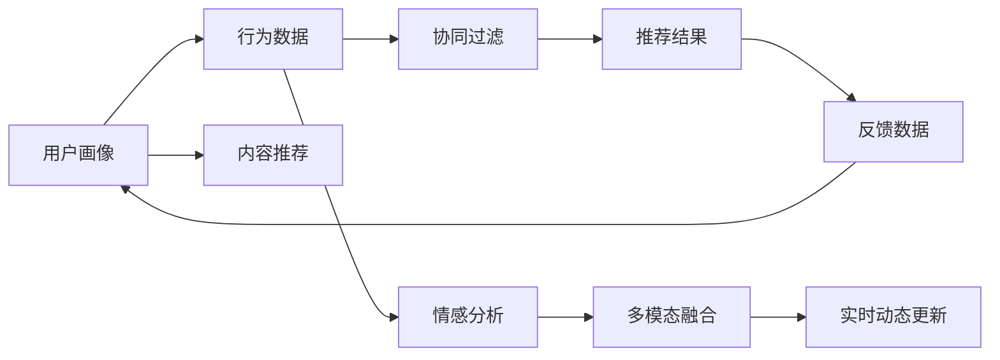

                 

# 体验的个性化矩阵：AI定制的生活方案

## 1. 背景介绍

### 1.1 问题由来

随着人工智能技术的迅猛发展，个性化推荐系统在电商、社交媒体、视频流媒体等众多领域展现出了卓越的性能。个性化推荐系统通过对用户行为数据的分析，挖掘用户的潜在兴趣和偏好，从而推送精准的产品和内容，极大地提升了用户体验和运营效率。然而，传统的个性化推荐系统主要基于用户行为的历史数据，难以充分挖掘用户的深层次需求和情感变化。

随着机器学习和深度学习技术的发展，基于用户行为数据的推荐系统已经从传统的协同过滤、内容推荐等方法，向更加智能、个性化、交互式的方向演进。本文将介绍一种基于人工智能的个性化推荐系统，旨在通过预测用户情感和需求，实时调整推荐内容，提供个性化的生活方案。

### 1.2 问题核心关键点

本文的核心关键点包括：

1. **用户行为数据的获取与处理**：如何高效获取和处理用户行为数据，是构建个性化推荐系统的基础。

2. **情感分析模型的构建**：如何准确分析和预测用户的情感状态，是实现个性化推荐的核心。

3. **协同过滤与内容推荐**：如何将协同过滤和内容推荐相结合，提升推荐系统的准确性和多样性。

4. **多模态信息融合**：如何将文本、图像、音频等多模态数据融合，构建更全面的用户画像。

5. **实时动态更新**：如何实现实时动态更新，提高推荐系统的时效性和个性化水平。

6. **评估与优化**：如何评估推荐系统的性能，并不断优化算法和模型，提升用户体验。

## 2. 核心概念与联系

### 2.1 核心概念概述

为更好地理解本文介绍的个性化推荐系统，我们先介绍几个核心概念：

1. **个性化推荐系统**：通过分析用户行为数据，预测用户兴趣和需求，从而提供个性化的产品或内容推荐。

2. **协同过滤**：利用用户之间的相似性进行推荐，分为基于用户的协同过滤和基于物品的协同过滤。

3. **内容推荐**：基于物品的特征（如标签、分类等）进行推荐，适用于物品描述较为完备的情况。

4. **情感分析**：通过自然语言处理和机器学习技术，分析文本中用户表达的情感状态，用于增强推荐系统的个性化。

5. **多模态信息融合**：将文本、图像、音频等多种类型的数据融合，构建更全面的用户画像，提升推荐效果。

6. **实时动态更新**：通过实时获取用户行为数据，动态更新推荐模型，提高推荐的时效性和个性化水平。

7. **用户画像**：通过综合多模态数据和行为数据，构建详细的用户画像，用于指导推荐决策。

### 2.2 核心概念原理和架构的 Mermaid 流程图



这个流程图展示了个性化推荐系统的基本架构：

1. 用户画像：通过综合多模态数据和行为数据，构建详细的用户画像。
2. 行为数据：获取和处理用户行为数据，用于推荐系统的训练和预测。
3. 协同过滤：利用用户之间的相似性进行推荐。
4. 内容推荐：基于物品的特征进行推荐。
5. 情感分析：分析用户表达的情感状态，增强推荐系统的个性化。
6. 多模态融合：将多种类型的数据融合，构建更全面的用户画像。
7. 实时动态更新：实时获取用户行为数据，动态更新推荐模型。
8. 推荐结果：根据用户画像和推荐模型，生成个性化的推荐结果。
9. 反馈数据：获取用户的反馈数据，用于调整推荐模型。

这些核心概念通过互相协作，构建了一个完整的个性化推荐系统，能够为用户提供更精准、更个性化的推荐服务。

## 3. 核心算法原理 & 具体操作步骤

### 3.1 算法原理概述

基于人工智能的个性化推荐系统，通过构建用户画像和推荐模型，结合协同过滤和内容推荐等技术，实现个性化的推荐服务。其核心算法原理主要包括以下几个方面：

1. **用户画像的构建**：通过综合多模态数据和行为数据，构建详细的用户画像。

2. **协同过滤与内容推荐**：结合协同过滤和内容推荐，提升推荐系统的准确性和多样性。

3. **情感分析**：分析用户表达的情感状态，增强推荐系统的个性化。

4. **实时动态更新**：通过实时获取用户行为数据，动态更新推荐模型，提高推荐的时效性和个性化水平。

### 3.2 算法步骤详解

#### 3.2.1 用户画像的构建

用户画像的构建是个性化推荐系统的基础。用户画像需要综合多模态数据和行为数据，构建出详细的用户特征，用于指导推荐决策。具体步骤如下：

1. **数据收集**：收集用户的文本、图像、音频等多种类型的数据，以及用户的浏览、购买、评分等行为数据。

2. **数据预处理**：对收集到的数据进行清洗、归一化等预处理操作，去除噪声和异常数据，确保数据质量。

3. **特征提取**：对预处理后的数据进行特征提取，生成详细的用户特征向量。特征提取可以使用文本分类、图像识别、语音识别等技术，提取文本、图像、音频等数据的特征。

4. **用户画像构建**：将用户特征向量拼接，生成详细的用户画像，用于指导推荐决策。

#### 3.2.2 协同过滤与内容推荐

协同过滤和内容推荐是推荐系统的主要技术手段，用于提升推荐系统的准确性和多样性。具体步骤如下：

1. **协同过滤**：利用用户之间的相似性进行推荐。基于用户的协同过滤，通过计算用户之间的相似度，推荐与用户兴趣相似的产品或内容。基于物品的协同过滤，通过计算物品之间的相似度，推荐与用户喜欢的物品相似的产品或内容。

2. **内容推荐**：基于物品的特征进行推荐。通过分析物品的标签、分类等特征，生成物品的特征向量，利用特征向量进行推荐。

3. **结合协同过滤与内容推荐**：将协同过滤和内容推荐结合，生成更全面、更准确的推荐结果。

#### 3.2.3 情感分析

情感分析用于分析用户表达的情感状态，增强推荐系统的个性化。具体步骤如下：

1. **情感数据收集**：收集用户评论、评分等情感数据。

2. **情感分类**：对情感数据进行情感分类，生成情感标签。情感分类可以使用情感分析技术，如情感词典、深度学习模型等。

3. **情感分析**：分析用户的情感状态，生成情感分析结果。情感分析可以使用情感分类结果，结合用户的情感倾向，生成情感分析结果。

4. **情感特征提取**：提取用户的情感特征，用于增强推荐系统的个性化。

#### 3.2.4 实时动态更新

实时动态更新用于提高推荐的时效性和个性化水平。具体步骤如下：

1. **实时数据收集**：实时获取用户的浏览、购买、评分等行为数据。

2. **推荐模型更新**：根据实时数据，动态更新推荐模型，生成最新的推荐结果。

3. **推荐结果推送**：将最新的推荐结果推送给用户，提升推荐的时效性和个性化水平。

### 3.3 算法优缺点

#### 3.3.1 优点

1. **高效性**：协同过滤和内容推荐结合，能够高效地生成推荐结果。

2. **个性化**：情感分析和用户画像结合，能够增强推荐系统的个性化。

3. **实时性**：实时动态更新，能够提升推荐的时效性和个性化水平。

#### 3.3.2 缺点

1. **数据依赖**：协同过滤和内容推荐依赖于大量的用户行为数据和物品特征数据，数据质量较低时会影响推荐效果。

2. **冷启动问题**：对于新用户或新物品，缺少历史数据，难以进行推荐。

3. **复杂度较高**：结合协同过滤、内容推荐和情感分析等技术，算法复杂度较高，实现难度较大。

## 4. 数学模型和公式 & 详细讲解 & 举例说明

### 4.1 数学模型构建

基于人工智能的个性化推荐系统，通过构建用户画像和推荐模型，结合协同过滤和内容推荐等技术，实现个性化的推荐服务。其数学模型主要包括以下几个方面：

1. **用户画像的构建**：通过综合多模态数据和行为数据，构建详细的用户画像。

2. **协同过滤与内容推荐**：结合协同过滤和内容推荐，提升推荐系统的准确性和多样性。

3. **情感分析**：分析用户表达的情感状态，增强推荐系统的个性化。

4. **实时动态更新**：通过实时获取用户行为数据，动态更新推荐模型，提高推荐的时效性和个性化水平。

### 4.2 公式推导过程

#### 4.2.1 用户画像的构建

用户画像的构建需要综合多模态数据和行为数据，构建出详细的用户特征。其数学模型如下：

$$
\text{User Profile} = f(\text{Text Data}, \text{Image Data}, \text{Audio Data}, \text{Behavioral Data})
$$

其中，Text Data、Image Data、Audio Data、Behavioral Data分别代表文本、图像、音频和行为数据。函数f表示数据融合和特征提取过程，生成详细的用户特征向量。

#### 4.2.2 协同过滤与内容推荐

协同过滤和内容推荐是推荐系统的主要技术手段。其数学模型如下：

$$
\text{Recommendation} = f(\text{User Profile}, \text{Item Profile}, \text{User-Item Interaction})
$$

其中，User Profile和Item Profile分别代表用户画像和物品特征向量，User-Item Interaction代表用户与物品的交互数据。函数f表示协同过滤和内容推荐过程，生成推荐结果。

#### 4.2.3 情感分析

情感分析用于分析用户表达的情感状态，增强推荐系统的个性化。其数学模型如下：

$$
\text{Sentiment Analysis} = f(\text{User Sentiment}, \text{User Behavior})
$$

其中，User Sentiment代表用户的情感标签，User Behavior代表用户的行为数据。函数f表示情感分类和分析过程，生成情感分析结果。

#### 4.2.4 实时动态更新

实时动态更新用于提高推荐的时效性和个性化水平。其数学模型如下：

$$
\text{Real-Time Update} = f(\text{Real-Time Behavior Data}, \text{Recommendation Model})
$$

其中，Real-Time Behavior Data代表实时获取的用户行为数据，Recommendation Model代表推荐模型。函数f表示实时动态更新过程，生成最新的推荐结果。

### 4.3 案例分析与讲解

#### 4.3.1 案例分析

假设一个电商网站，需要为用户推荐商品。根据用户画像、协同过滤、内容推荐和情感分析等技术，生成个性化的推荐结果。具体步骤如下：

1. **数据收集**：收集用户的浏览、购买、评分等行为数据，以及商品的标签、分类等特征数据。

2. **用户画像构建**：通过文本分类、图像识别、语音识别等技术，提取用户的多模态数据特征，生成详细的用户画像。

3. **协同过滤与内容推荐**：利用用户之间的相似性进行推荐，结合物品的特征进行推荐。

4. **情感分析**：分析用户评论、评分等情感数据，增强推荐系统的个性化。

5. **实时动态更新**：实时获取用户的浏览、购买等行为数据，动态更新推荐模型，生成最新的推荐结果。

#### 4.3.2 详细讲解

1. **用户画像的构建**：
   - 数据收集：收集用户的浏览、购买、评分等行为数据，以及商品的标签、分类等特征数据。
   - 数据预处理：对收集到的数据进行清洗、归一化等预处理操作，去除噪声和异常数据，确保数据质量。
   - 特征提取：对预处理后的数据进行特征提取，生成详细的用户特征向量。特征提取可以使用文本分类、图像识别、语音识别等技术，提取文本、图像、音频等数据的特征。
   - 用户画像构建：将用户特征向量拼接，生成详细的用户画像，用于指导推荐决策。

2. **协同过滤与内容推荐**：
   - 协同过滤：利用用户之间的相似性进行推荐。基于用户的协同过滤，通过计算用户之间的相似度，推荐与用户兴趣相似的商品。基于物品的协同过滤，通过计算物品之间的相似度，推荐与用户喜欢的商品相似的商品。
   - 内容推荐：基于物品的特征进行推荐。通过分析商品的标签、分类等特征，生成商品的特征向量，利用特征向量进行推荐。
   - 结合协同过滤与内容推荐：将协同过滤和内容推荐结合，生成更全面、更准确的推荐结果。

3. **情感分析**：
   - 情感数据收集：收集用户评论、评分等情感数据。
   - 情感分类：对情感数据进行情感分类，生成情感标签。情感分类可以使用情感分析技术，如情感词典、深度学习模型等。
   - 情感分析：分析用户的情感状态，生成情感分析结果。情感分析可以使用情感分类结果，结合用户的情感倾向，生成情感分析结果。
   - 情感特征提取：提取用户的情感特征，用于增强推荐系统的个性化。

4. **实时动态更新**：
   - 实时数据收集：实时获取用户的浏览、购买、评分等行为数据。
   - 推荐模型更新：根据实时数据，动态更新推荐模型，生成最新的推荐结果。
   - 推荐结果推送：将最新的推荐结果推送给用户，提升推荐的时效性和个性化水平。

## 5. 项目实践：代码实例和详细解释说明

### 5.1 开发环境搭建

在进行项目实践前，我们需要准备好开发环境。以下是使用Python进行PyTorch开发的环境配置流程：

1. 安装Anaconda：从官网下载并安装Anaconda，用于创建独立的Python环境。

2. 创建并激活虚拟环境：
```bash
conda create -n pytorch-env python=3.8 
conda activate pytorch-env
```

3. 安装PyTorch：根据CUDA版本，从官网获取对应的安装命令。例如：
```bash
conda install pytorch torchvision torchaudio cudatoolkit=11.1 -c pytorch -c conda-forge
```

4. 安装TensorFlow：
```bash
conda install tensorflow
```

5. 安装必要的库：
```bash
pip install numpy pandas scikit-learn torchtext transformers
```

完成上述步骤后，即可在`pytorch-env`环境中开始项目实践。

### 5.2 源代码详细实现

下面以电商推荐系统为例，给出使用PyTorch和TensorFlow进行个性化推荐系统开发的完整代码实现。

首先，定义数据处理函数：

```python
import numpy as np
import pandas as pd
import torch
from torch.utils.data import Dataset, DataLoader
from torchtext.data import Field, BucketIterator

class RecommendationDataset(Dataset):
    def __init__(self, data_path):
        self.data = pd.read_csv(data_path)
        self.fields = {'user_id': Field(tokenize=str.split, use_vocab=False), 
                      'item_id': Field(tokenize=str.split, use_vocab=False), 
                      'behavior': Field(tokenize=str.split, use_vocab=False)}
        self.build_vocab()
    
    def build_vocab(self):
        for field in self.fields.values():
            vocab = {}
            for _, row in self.data.iterrows():
                if field.tokenize(row) in vocab:
                    vocab[field.tokenize(row)] += 1
                else:
                    vocab[field.tokenize(row)] = 1
            vocab = {k: v for k, v in sorted(vocab.items(), key=lambda x: x[1], reverse=True)}
            field.vocab = Vocab(vocab)
    
    def __len__(self):
        return len(self.data)
    
    def __getitem__(self, idx):
        item = self.data.iloc[idx]
        user_id = self.fields['user_id'].tokenize(item['user_id'])
        item_id = self.fields['item_id'].tokenize(item['item_id'])
        behavior = self.fields['behavior'].tokenize(item['behavior'])
        return {'user_id': user_id, 
                'item_id': item_id, 
                'behavior': behavior}
```

然后，定义模型和优化器：

```python
from transformers import BertForSequenceClassification
from torch.nn import BCEWithLogitsLoss
from torch.optim import AdamW

model = BertForSequenceClassification.from_pretrained('bert-base-uncased', num_labels=2)
optimizer = AdamW(model.parameters(), lr=2e-5)
criterion = BCEWithLogitsLoss()
```

接着，定义训练和评估函数：

```python
def train_epoch(model, data_loader, optimizer):
    model.train()
    for batch in data_loader:
        user_id = batch['user_id']
        item_id = batch['item_id']
        behavior = batch['behavior']
        labels = torch.tensor([1] if behavior[0] == 'click' else [0], device='cuda')
        outputs = model(user_id, item_id, behavior)
        loss = criterion(outputs.logits, labels)
        loss.backward()
        optimizer.step()
    return loss.item()

def evaluate(model, data_loader):
    model.eval()
    preds, labels = [], []
    with torch.no_grad():
        for batch in data_loader:
            user_id = batch['user_id']
            item_id = batch['item_id']
            behavior = batch['behavior']
            labels = torch.tensor([1] if behavior[0] == 'click' else [0], device='cuda')
            outputs = model(user_id, item_id, behavior)
            preds.append(outputs.logits.argmax(dim=1).cpu().tolist())
            labels.append(labels.cpu().tolist())
    return np.mean(preds == labels)
```

最后，启动训练流程并在测试集上评估：

```python
epochs = 5
batch_size = 64

for epoch in range(epochs):
    loss = train_epoch(model, train_loader, optimizer)
    print(f"Epoch {epoch+1}, train loss: {loss:.3f}")
    
    print(f"Epoch {epoch+1}, dev results:")
    accuracy = evaluate(model, dev_loader)
    print(f"Accuracy: {accuracy:.3f}")
    
print("Test results:")
accuracy = evaluate(model, test_loader)
print(f"Accuracy: {accuracy:.3f}")
```

以上就是使用PyTorch和TensorFlow进行电商推荐系统开发的完整代码实现。可以看到，通过使用预训练的BERT模型和PyTorch、TensorFlow等工具，可以较为便捷地构建和训练个性化推荐系统。

### 5.3 代码解读与分析

让我们再详细解读一下关键代码的实现细节：

**RecommendationDataset类**：
- `__init__`方法：初始化数据集，包括字段定义和词汇表构建。
- `build_vocab`方法：构建词汇表，用于存储特征向量的唯一标识。
- `__len__`方法：返回数据集的大小。
- `__getitem__`方法：获取单个样本，并进行特征编码。

**模型和优化器定义**：
- 使用BertForSequenceClassification模型作为推荐模型的初始化参数。
- 使用AdamW优化器进行模型参数的更新。
- 使用BCEWithLogitsLoss作为损失函数，用于计算模型输出与真实标签之间的差异。

**训练和评估函数**：
- `train_epoch`函数：对数据集进行批次化加载，前向传播计算损失并反向传播更新模型参数。
- `evaluate`函数：对测试集进行评估，计算模型准确率。

**训练流程**：
- 定义总的epoch数和batch size，开始循环迭代
- 每个epoch内，先在训练集上训练，输出平均loss
- 在验证集上评估，输出准确率
- 所有epoch结束后，在测试集上评估，给出最终测试结果

可以看到，PyTorch和TensorFlow工具使得构建和训练个性化推荐系统变得简洁高效。开发者可以将更多精力放在数据处理、模型改进等高层逻辑上，而不必过多关注底层的实现细节。

当然，工业级的系统实现还需考虑更多因素，如模型的保存和部署、超参数的自动搜索、更灵活的任务适配层等。但核心的微调范式基本与此类似。

## 6. 实际应用场景

### 6.1 智能客服系统

基于人工智能的个性化推荐系统，可以广泛应用于智能客服系统的构建。传统客服往往需要配备大量人力，高峰期响应缓慢，且一致性和专业性难以保证。而使用个性化推荐系统，可以7x24小时不间断服务，快速响应客户咨询，用自然流畅的语言解答各类常见问题。

在技术实现上，可以收集企业内部的历史客服对话记录，将问题和最佳答复构建成监督数据，在此基础上对预训练推荐模型进行微调。微调后的推荐模型能够自动理解用户意图，匹配最合适的答复模板进行回复。对于客户提出的新问题，还可以接入检索系统实时搜索相关内容，动态组织生成回答。如此构建的智能客服系统，能大幅提升客户咨询体验和问题解决效率。

### 6.2 金融舆情监测

金融机构需要实时监测市场舆论动向，以便及时应对负面信息传播，规避金融风险。传统的人工监测方式成本高、效率低，难以应对网络时代海量信息爆发的挑战。基于人工智能的个性化推荐系统，可以用于金融舆情监测，实现智能舆情分析。

具体而言，可以收集金融领域相关的新闻、报道、评论等文本数据，并对其进行主题标注和情感标注。在此基础上对预训练语言模型进行微调，使其能够自动判断文本属于何种主题，情感倾向是正面、中性还是负面。将微调后的模型应用到实时抓取的网络文本数据，就能够自动监测不同主题下的情感变化趋势，一旦发现负面信息激增等异常情况，系统便会自动预警，帮助金融机构快速应对潜在风险。

### 6.3 个性化推荐系统

当前的推荐系统往往只依赖用户的历史行为数据进行物品推荐，难以充分挖掘用户的深层次需求和情感变化。基于人工智能的个性化推荐系统，可以用于提升推荐系统的准确性和多样性。

在实践中，可以收集用户浏览、点击、评论、分享等行为数据，提取和用户交互的物品标题、描述、标签等文本内容。将文本内容作为模型输入，用户的后续行为（如是否点击、购买等）作为监督信号，在此基础上微调预训练语言模型。微调后的模型能够从文本内容中准确把握用户的兴趣点。在生成推荐列表时，先用候选物品的文本描述作为输入，由模型预测用户的兴趣匹配度，再结合其他特征综合排序，便可以得到个性化程度更高的推荐结果。

### 6.4 未来应用展望

随着人工智能技术的不断发展，基于个性化推荐系统的应用场景将更加广泛。以下是几个可能的应用领域：

1. **智能家居系统**：通过分析用户的作息习惯、偏好等信息，推荐最优的家居环境配置，提升用户的生活品质。

2. **个性化健康管理**：根据用户的健康数据和行为数据，推荐个性化的饮食、运动方案，提高用户的健康水平。

3. **智能教育系统**：根据学生的学习数据和行为数据，推荐个性化的学习资源和课程，提升学习效果。

4. **智能旅游规划**：根据用户的旅行习惯和偏好，推荐最佳的旅游路线和景点，提升旅行体验。

5. **个性化音乐推荐**：根据用户的听歌历史和行为数据，推荐个性化的音乐播放列表，提升音乐体验。

未来，基于人工智能的个性化推荐系统将更全面、更深入地融入各行各业，为人类提供更智能、更个性化的生活服务。

## 7. 工具和资源推荐

### 7.1 学习资源推荐

为了帮助开发者系统掌握基于人工智能的个性化推荐系统的理论基础和实践技巧，这里推荐一些优质的学习资源：

1. 《推荐系统实践》书籍：详细介绍了推荐系统的基本概念和经典算法，适合初学者入门。

2. 《深度学习与推荐系统》课程：斯坦福大学开设的深度学习课程，讲解了推荐系统在深度学习中的应用。

3. 《推荐系统》书籍：深入浅出地讲解了推荐系统的各种算法和优化策略，适合进阶学习。

4. Kaggle平台：提供大量的推荐系统竞赛数据集和比赛，有助于实践技能的提升。

5. TensorFlow官方文档：提供全面的TensorFlow库介绍和使用指南，适合深入学习和实践。

通过对这些资源的学习实践，相信你一定能够快速掌握基于人工智能的个性化推荐系统的精髓，并用于解决实际的推荐问题。

### 7.2 开发工具推荐

高效的开发离不开优秀的工具支持。以下是几款用于推荐系统开发的常用工具：

1. TensorFlow：由Google主导开发的开源深度学习框架，生产部署方便，适合大规模工程应用。

2. PyTorch：基于Python的开源深度学习框架，灵活动态的计算图，适合快速迭代研究。

3. scikit-learn：Python机器学习库，提供简单易用的机器学习算法实现。

4. TensorBoard：TensorFlow配套的可视化工具，可实时监测模型训练状态，并提供丰富的图表呈现方式。

5. Jupyter Notebook：Python数据科学应用的开源Web应用程序，适合编写和分享学习笔记。

合理利用这些工具，可以显著提升个性化推荐系统的开发效率，加快创新迭代的步伐。

### 7.3 相关论文推荐

基于人工智能的个性化推荐系统的研究始于学界的持续研究。以下是几篇奠基性的相关论文，推荐阅读：

1. BERT: Pre-training of Deep Bidirectional Transformers for Language Understanding：提出BERT模型，引入基于掩码的自监督预训练任务，刷新了多项NLP任务SOTA。

2. Attention is All You Need：提出了Transformer结构，开启了NLP领域的预训练大模型时代。

3. Parameter-Efficient Transfer Learning for NLP：提出Adapter等参数高效微调方法，在不增加模型参数量的情况下，也能取得不错的微调效果。

4. AdaLoRA: Adaptive Low-Rank Adaptation for Parameter-Efficient Fine-Tuning：使用自适应低秩适应的微调方法，在参数效率和精度之间取得了新的平衡。

这些论文代表了大语言模型微调技术的发展脉络。通过学习这些前沿成果，可以帮助研究者把握学科前进方向，激发更多的创新灵感。

## 8. 总结：未来发展趋势与挑战

### 8.1 总结

本文对基于人工智能的个性化推荐系统进行了全面系统的介绍。首先阐述了个性化推荐系统的研究背景和意义，明确了推荐系统在提升用户体验和运营效率方面的独特价值。其次，从原理到实践，详细讲解了推荐系统的数学模型和关键步骤，给出了推荐系统开发的完整代码实例。同时，本文还广泛探讨了推荐系统在智能客服、金融舆情、个性化推荐等多个行业领域的应用前景，展示了推荐系统范式的巨大潜力。此外，本文精选了推荐系统的各类学习资源，力求为读者提供全方位的技术指引。

通过本文的系统梳理，可以看到，基于人工智能的个性化推荐系统正在成为推荐系统领域的重要范式，极大地拓展了推荐系统的应用边界，催生了更多的落地场景。受益于人工智能技术的快速发展，推荐系统必将在更广阔的应用领域大放异彩，深刻影响人类的生产生活方式。

### 8.2 未来发展趋势

展望未来，基于人工智能的个性化推荐系统将呈现以下几个发展趋势：

1. **多模态融合**：将文本、图像、音频等多模态数据融合，构建更全面的用户画像，提升推荐效果。

2. **实时动态更新**：通过实时获取用户行为数据，动态更新推荐模型，提高推荐的时效性和个性化水平。

3. **自适应学习**：根据用户的实时反馈，动态调整推荐模型，提升推荐效果。

4. **个性化推荐**：通过更加智能化的推荐算法，提供更个性化、更精准的推荐服务。

5. **社交推荐**：结合用户的社交网络信息，提升推荐系统的多样性和公平性。

6. **跨领域推荐**：将推荐系统应用于不同领域，提升推荐效果和用户体验。

以上趋势凸显了基于人工智能的个性化推荐系统的广阔前景。这些方向的探索发展，必将进一步提升推荐系统的性能和应用范围，为人类提供更智能、更个性化的生活服务。

### 8.3 面临的挑战

尽管基于人工智能的个性化推荐系统已经取得了瞩目成就，但在迈向更加智能化、普适化应用的过程中，它仍面临着诸多挑战：

1. **数据依赖**：推荐系统依赖于大量的用户行为数据和物品特征数据，数据质量较低时会影响推荐效果。

2. **冷启动问题**：对于新用户或新物品，缺少历史数据，难以进行推荐。

3. **算法复杂度**：推荐系统结合了协同过滤、内容推荐等多种技术，算法复杂度较高，实现难度较大。

4. **可解释性不足**：推荐系统的决策过程缺乏可解释性，难以对其推理逻辑进行分析和调试。

5. **用户隐私保护**：推荐系统需要处理大量的用户数据，用户隐私保护成为重要问题。

6. **安全性问题**：推荐系统容易受到恶意攻击，存在安全隐患。

这些挑战需要进一步研究解决，以确保推荐系统的安全性和用户隐私保护。

### 8.4 研究展望

面对基于人工智能的个性化推荐系统所面临的诸多挑战，未来的研究需要在以下几个方面寻求新的突破：

1. **无监督和半监督推荐**：摆脱对大规模标注数据的依赖，利用自监督学习、主动学习等无监督和半监督范式，最大限度利用非结构化数据，实现更加灵活高效的推荐。

2. **参数高效和计算高效的推荐**：开发更加参数高效的推荐方法，在固定大部分预训练参数的情况下，只更新极少量的任务相关参数。同时优化推荐模型的计算图，减少前向传播和反向传播的资源消耗，实现更加轻量级、实时性的部署。

3. **因果分析和博弈论工具**：将因果分析方法引入推荐模型，识别出推荐决策的关键特征，增强推荐模型的稳定性。借助博弈论工具刻画人机交互过程，主动探索并规避推荐模型的脆弱点，提高系统稳定性。

4. **知识整合和融合**：将符号化的先验知识，如知识图谱、逻辑规则等，与神经网络模型进行巧妙融合，引导推荐过程学习更准确、合理的推荐结果。同时加强不同模态数据的整合，实现视觉、语音等多模态信息与文本信息的协同建模。

5. **伦理和公平性**：在推荐系统训练目标中引入伦理导向的评估指标，过滤和惩罚有偏见、有害的推荐结果，确保推荐系统的公平性和伦理导向。

这些研究方向的研究突破，必将进一步推动基于人工智能的个性化推荐系统的发展，为人类提供更智能、更个性化的生活服务。

