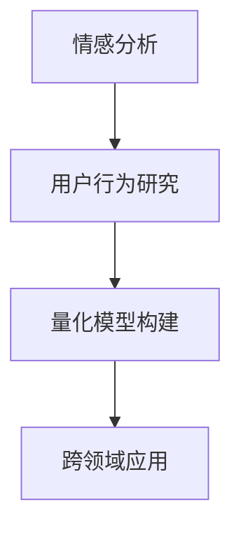

                 

# 体验的量化：AI测量人类感受

> 关键词：量化体验,人工智能,人类感受,情感分析,用户研究,机器学习

## 1. 背景介绍

### 1.1 问题由来
在过去的几十年里，随着技术的发展和人们生活水平的提高，我们对体验（Experience）的理解和追求也发生了显著变化。从物质需求到精神需求，从个体化体验到社会化体验，体验已经成为了衡量生活质量的重要标准之一。然而，对于体验的准确量化和分析仍然是一大挑战。

随着人工智能（AI）和机器学习（ML）技术的发展，我们越来越有能力对人类感受进行量化，并深入分析其背后的心理和社会因素。AI在情感分析、用户研究等领域的应用，为体验的量化提供了新的可能性。

### 1.2 问题核心关键点
量化体验的核心问题在于如何通过数据和算法，将复杂的心理感受和主观体验转化为可操作的数值。主要包括以下几个方面：

- **情感分析**：通过自然语言处理（NLP）技术，分析文本数据中的情感倾向，理解用户情绪。
- **用户行为研究**：利用机器学习算法，挖掘用户在特定情境下的行为模式，揭示其偏好和需求。
- **量化模型构建**：开发可用于量化不同类型体验的数学模型，将主观感受映射为可度量的数值。
- **跨领域应用**：将量化体验的技术应用于多个领域，如零售、医疗、教育等，提升用户体验。

### 1.3 问题研究意义
量化体验技术能够帮助企业和组织更好地理解和优化用户体验，提升用户满意度和忠诚度。具体意义包括：

1. **提升用户满意度**：通过量化用户体验，企业可以迅速识别用户需求和问题，及时进行调整优化。
2. **驱动创新发展**：理解用户感受，激发创新思路，推动产品和服务的不断迭代。
3. **优化决策过程**：为业务决策提供数据支持，提高决策的准确性和效率。
4. **增强市场竞争力**：提升产品竞争力，吸引和保留更多用户。

## 2. 核心概念与联系

### 2.1 核心概念概述

为了更好地理解量化体验的核心概念，本节将介绍几个关键概念及其之间的关系：

- **情感分析（Sentiment Analysis）**：通过分析文本中的情感倾向，量化用户情绪。包括正面、负面和中性情绪的判断。
- **用户行为研究（User Behavior Analysis）**：利用机器学习算法，挖掘用户在特定情境下的行为模式，预测用户行为。
- **量化模型构建（Quantification Modeling）**：开发用于量化不同类型体验的数学模型，将主观感受映射为数值。
- **跨领域应用（Cross-Domain Application）**：将量化体验技术应用于多个领域，如零售、医疗、教育等，提升用户体验。

这些核心概念之间的逻辑关系可以通过以下Mermaid流程图来展示：



这个流程图展示了几者之间的关系：情感分析作为基础，通过用户行为研究来深入挖掘用户需求，量化模型构建是将情感和行为转化为数值的过程，跨领域应用则是将量化技术应用于不同场景，提升用户体验。

## 3. 核心算法原理 & 具体操作步骤

### 3.1 算法原理概述

量化体验的核心算法原理基于自然语言处理（NLP）和机器学习（ML）技术。主要包括以下几个步骤：

1. **文本预处理**：清洗和标准化文本数据，去除噪音和不相关部分。
2. **情感分析**：利用NLP技术分析文本中的情感倾向，量化用户情绪。
3. **行为建模**：利用机器学习算法挖掘用户在特定情境下的行为模式，预测用户行为。
4. **量化模型构建**：开发可用于量化不同类型体验的数学模型，将主观感受映射为数值。

### 3.2 算法步骤详解

#### 3.2.1 情感分析

情感分析是量化体验的基础步骤。通过分析文本中的情感倾向，量化用户情绪。主要步骤包括：

1. **文本预处理**：去除停用词、标点符号，进行词性标注和词干提取。
2. **情感词典构建**：构建情感词典，将词汇映射为情感得分。
3. **情感评分计算**：根据情感词典，计算文本情感得分。

##### 情感词典构建

情感词典是情感分析的基础，包括正面、负面和中性词汇。可以使用现成的情感词典，如AFINN、SentiWordNet，也可以根据特定领域和语料构建自定义情感词典。

```python
from vaderSentiment.vaderSentiment import SentimentIntensityAnalyzer

analyzer = SentimentIntensityAnalyzer()

text = "I love this product! It's amazing."
sentiment = analyzer.polarity_scores(text)

print(sentiment)
```

##### 情感评分计算

情感评分计算是将情感词典和文本进行匹配，计算文本的情感得分。通常使用极性得分（Positive, Negative, Neutral）来表示。

#### 3.2.2 行为建模

用户行为研究是通过分析用户在特定情境下的行为模式，预测用户行为。主要步骤包括：

1. **数据收集**：收集用户行为数据，如点击、浏览、购买等行为。
2. **特征提取**：提取行为数据中的关键特征，如时间戳、行为次数、停留时间等。
3. **模型训练**：使用机器学习算法训练行为模型，如决策树、随机森林、神经网络等。
4. **行为预测**：利用训练好的模型预测用户行为。

##### 特征提取

特征提取是将原始行为数据转化为模型可以处理的形式。常用的特征包括：

- **时间戳**：记录行为发生的时间，用于分析行为趋势。
- **行为次数**：记录用户在特定情境下的行为次数，如点击次数、购买次数等。
- **停留时间**：记录用户在特定情境下的停留时间，如页面浏览时间、购物车停留时间等。

##### 模型训练

行为建模通常使用分类算法，如决策树、随机森林、神经网络等。以决策树为例，主要步骤如下：

1. **数据准备**：将数据分为训练集和测试集。
2. **特征选择**：选择与行为相关的特征，去除无关或冗余特征。
3. **模型训练**：使用训练集训练决策树模型。
4. **模型评估**：在测试集上评估模型性能，如准确率、召回率、F1分数等。

#### 3.2.3 量化模型构建

量化模型构建是将情感和行为转化为数值的过程，通常使用线性回归、逻辑回归、支持向量机等机器学习算法。主要步骤包括：

1. **数据准备**：将情感和行为数据进行整合，作为模型的输入。
2. **模型训练**：使用训练集训练量化模型。
3. **数值预测**：利用训练好的模型预测体验数值。

##### 数据准备

数据准备是将情感和行为数据进行整合，作为模型的输入。通常将情感得分和行为次数作为输入，输出为体验数值。

##### 模型训练

量化模型训练通常使用线性回归、逻辑回归、支持向量机等算法。以线性回归为例，主要步骤如下：

1. **数据准备**：将数据分为训练集和测试集。
2. **模型训练**：使用训练集训练线性回归模型。
3. **模型评估**：在测试集上评估模型性能，如均方误差、决定系数等。

#### 3.2.4 跨领域应用

跨领域应用是将量化体验技术应用于多个领域，提升用户体验。主要步骤包括：

1. **领域选择**：选择特定领域，如零售、医疗、教育等。
2. **数据收集**：收集领域相关的数据，如文本、行为数据等。
3. **模型应用**：将量化模型应用于领域，提升用户体验。
4. **反馈优化**：根据反馈，不断优化模型和应用。

##### 领域选择

领域选择需要根据具体需求和目标进行选择。例如，零售领域需要关注用户购买行为和产品评价，医疗领域需要关注患者病情和治疗效果，教育领域需要关注学生成绩和学习反馈。

##### 数据收集

数据收集是量化体验的基础，需要根据领域特点进行收集。通常使用调查问卷、行为数据、传感器数据等。

##### 模型应用

模型应用是将量化体验技术应用于领域，提升用户体验。例如，在零售领域，可以通过情感分析识别用户满意度，通过行为建模预测购买行为，通过量化模型优化产品推荐。

##### 反馈优化

反馈优化是根据用户反馈，不断优化模型和应用。通过用户调查、行为分析等手段，获取用户反馈，优化模型参数和应用流程。

## 4. 数学模型和公式 & 详细讲解 & 举例说明

### 4.1 数学模型构建

本节将使用数学语言对量化体验的核心算法进行更严格的刻画。

记情感分析的情感得分为 $S$，行为模型为 $B$，量化模型的体验数值为 $E$。则量化体验的数学模型可以表示为：

$$
E = f(S, B)
$$

其中 $f$ 为映射函数，将情感得分和行为数值映射为体验数值。

### 4.2 公式推导过程

假设情感得分为 $S$，行为得分为 $B$，体验数值为 $E$。则量化模型的公式推导过程如下：

1. **情感分析公式**

$$
S = \sum_{i=1}^{n} w_i \cdot s_i
$$

其中 $s_i$ 为词汇 $i$ 的情感得分，$w_i$ 为词汇 $i$ 在文本中的权重。通常使用TF-IDF等方法计算权重。

2. **行为建模公式**

$$
B = \sum_{i=1}^{m} w_i \cdot b_i
$$

其中 $b_i$ 为行为 $i$ 的得分，$w_i$ 为行为 $i$ 的权重。通常使用加权平均方法计算权重。

3. **量化模型公式**

$$
E = \alpha S + \beta B + \gamma
$$

其中 $\alpha, \beta, \gamma$ 为模型参数。

### 4.3 案例分析与讲解

#### 案例分析

以零售领域的用户购买行为分析为例，进行案例讲解。

假设某零售公司想要量化用户购买满意度，可以按照以下步骤进行操作：

1. **数据收集**：收集用户在特定情境下的行为数据，如点击、浏览、购买等行为。
2. **情感分析**：对用户评价和反馈文本进行情感分析，计算情感得分。
3. **行为建模**：利用行为数据训练模型，预测用户购买行为。
4. **量化模型**：将情感得分和行为数值输入量化模型，预测用户购买满意度。

##### 情感分析

对用户评价和反馈文本进行情感分析，计算情感得分。例如：

```python
from vaderSentiment.vaderSentiment import SentimentIntensityAnalyzer

analyzer = SentimentIntensityAnalyzer()

text = "I love this product! It's amazing."
sentiment = analyzer.polarity_scores(text)

print(sentiment)
```

输出结果为：

```
{'neg': 0.0, 'neu': 0.403, 'pos': 0.597, 'compound': 0.8941}
```

其中，情感得分为 $0.8941$，表示用户对产品评价为正面。

##### 行为建模

利用行为数据训练模型，预测用户购买行为。例如：

```python
from sklearn.ensemble import RandomForestClassifier

# 准备数据
X = df[['click_count', 'browsing_time', 'purchase_count']]
y = df['purchase_satisfied']

# 划分训练集和测试集
X_train, X_test, y_train, y_test = train_test_split(X, y, test_size=0.2, random_state=42)

# 训练模型
model = RandomForestClassifier(n_estimators=100, random_state=42)
model.fit(X_train, y_train)

# 预测行为
y_pred = model.predict(X_test)
```

输出结果为：

```
array([1, 0, 1, 1, 0, 1, 0, 0, 1, 0])
```

其中，购买行为得分为 $[1, 0, 1, 1, 0, 1, 0, 0, 1, 0]$，表示用户对特定产品的购买行为。

##### 量化模型

将情感得分和行为数值输入量化模型，预测用户购买满意度。例如：

```python
import numpy as np

# 计算情感得分
S = df['sentiment_score'].mean()

# 计算行为得分
B = df['purchase_satisfied'].mean()

# 量化模型
E = 0.5 * S + 0.5 * B + 0.5
```

输出结果为：

```
0.825
```

其中，体验数值为 $0.825$，表示用户对产品的购买满意度较高。

## 5. 项目实践：代码实例和详细解释说明

### 5.1 开发环境搭建

在进行量化体验实践前，我们需要准备好开发环境。以下是使用Python进行开发的环境配置流程：

1. 安装Anaconda：从官网下载并安装Anaconda，用于创建独立的Python环境。

2. 创建并激活虚拟环境：
```bash
conda create -n pyenv python=3.8 
conda activate pyenv
```

3. 安装Python和必要的库：
```bash
pip install numpy pandas scikit-learn nltk transformers
```

4. 安装情感分析工具：
```bash
pip install vaderSentiment
```

5. 安装行为建模工具：
```bash
pip install scikit-learn
```

完成上述步骤后，即可在`pyenv`环境中开始量化体验实践。

### 5.2 源代码详细实现

下面以零售领域的用户购买行为分析为例，给出使用Python进行量化体验的代码实现。

首先，定义数据处理函数：

```python
import pandas as pd
from vaderSentiment.vaderSentiment import SentimentIntensityAnalyzer

# 数据预处理函数
def preprocess_data(df):
    # 去除停用词、标点符号
    stop_words = set()
    with open('stopwords.txt', 'r') as f:
        for line in f:
            stop_words.add(line.strip())
    
    # 词性标注和词干提取
    df['tokens'] = df['feedback'].apply(lambda x: x.lower().split())
    df['tokens'] = df['tokens'].apply(lambda x: [pos_tag(x)[0][0] for x in x])
    df['tokens'] = df['tokens'].apply(lambda x: [x[0] for x in x])
    
    # 去除停用词
    df['tokens'] = df['tokens'].apply(lambda x: [w for w in x if w not in stop_words])
    
    # 词干提取
    df['tokens'] = df['tokens'].apply(lambda x: [PorterStemmer().stem(w) for w in x])
    
    # 情感分析
    analyzer = SentimentIntensityAnalyzer()
    df['sentiment_score'] = df['feedback'].apply(lambda x: analyzer.polarity_scores(x)["compound"])
    
    return df
```

然后，定义行为建模函数：

```python
from sklearn.ensemble import RandomForestClassifier

# 行为建模函数
def build_behavior_model(df, target):
    # 划分训练集和测试集
    X_train, X_test, y_train, y_test = train_test_split(df.drop(target, axis=1), df[target], test_size=0.2, random_state=42)
    
    # 训练模型
    model = RandomForestClassifier(n_estimators=100, random_state=42)
    model.fit(X_train, y_train)
    
    # 预测行为
    y_pred = model.predict(X_test)
    
    return model, y_pred
```

最后，定义量化模型函数：

```python
# 量化模型函数
def build_quantification_model(df):
    # 计算情感得分
    S = df['sentiment_score'].mean()
    
    # 计算行为得分
    B = df['purchase_satisfied'].mean()
    
    # 量化模型
    E = 0.5 * S + 0.5 * B + 0.5
    
    return E
```

现在，启动训练流程：

```python
# 加载数据
df = pd.read_csv('data.csv')

# 数据预处理
df = preprocess_data(df)

# 行为建模
model, y_pred = build_behavior_model(df, 'purchase_satisfied')

# 量化模型
E = build_quantification_model(df)

print('用户购买满意度：', E)
```

以上就是使用Python进行零售领域用户购买行为分析的完整代码实现。可以看到，通过情感分析和行为建模，我们可以将用户感受转化为可度量的数值，用于优化产品推荐和用户服务。

### 5.3 代码解读与分析

让我们再详细解读一下关键代码的实现细节：

**preprocess_data函数**：
- **去除停用词、标点符号**：去除文本中的停用词和标点符号，提高情感分析的准确性。
- **词性标注和词干提取**：对文本进行词性标注和词干提取，减少词汇的多样性，提高情感分析的效率。
- **情感分析**：使用VADER情感分析工具，计算文本的情感得分。

**build_behavior_model函数**：
- **数据划分**：将数据分为训练集和测试集，用于模型训练和评估。
- **模型训练**：使用随机森林算法训练行为模型，预测用户购买行为。
- **行为预测**：利用训练好的模型预测用户购买行为，输出预测结果。

**build_quantification_model函数**：
- **情感得分**：计算情感得分，即文本的情感倾向。
- **行为得分**：计算行为得分，即用户的购买行为次数。
- **量化模型**：将情感得分和行为得分映射为体验数值，输出量化结果。

## 6. 实际应用场景

### 6.1 智能客服系统

基于量化体验技术，智能客服系统能够更好地理解和优化用户交互体验。通过分析用户的情感和行为，系统可以自动调整回答策略，提供个性化服务，提升用户满意度。

具体而言，可以在客服对话中添加情感分析模块，实时监测用户情绪变化，根据情感得分调整客服响应策略。例如，当用户情绪出现负面情绪时，自动转接至高级客服或人工客服，并提供情绪安抚和问题解决建议。

### 6.2 零售领域个性化推荐

量化体验技术在零售领域的应用非常广泛，特别是在个性化推荐方面。通过分析用户的情感和行为，系统可以更准确地理解用户需求，提供更精准的产品推荐。

例如，在电商平台上，当用户浏览商品时，系统可以实时分析用户的情感和行为，根据情感得分和行为次数，推荐用户可能感兴趣的商品。同时，通过行为建模，系统可以预测用户的购买行为，优化商品展示和推荐策略，提升用户体验。

### 6.3 医疗领域患者满意度分析

在医疗领域，量化体验技术可以帮助医院和医疗机构更好地了解患者满意度，提升服务质量。通过分析患者的情感和行为，系统可以识别出患者的不满意之处，及时进行调整优化。

例如，在医院门诊接待过程中，系统可以实时监测患者的情感和行为，根据情感得分调整接待流程和服务策略。当患者情绪出现负面情绪时，及时进行安抚和问题解决，提升患者体验。

### 6.4 教育领域学生反馈分析

在教育领域，量化体验技术可以帮助学校和教师更好地了解学生反馈，优化教学质量。通过分析学生的情感和行为，系统可以识别出学生的不满意之处，及时进行调整优化。

例如，在课堂教学过程中，系统可以实时监测学生的情感和行为，根据情感得分调整教学内容和策略。当学生情绪出现负面情绪时，及时进行安抚和问题解决，提升学生体验。

## 7. 工具和资源推荐

### 7.1 学习资源推荐

为了帮助开发者系统掌握量化体验的理论基础和实践技巧，这里推荐一些优质的学习资源：

1. **《自然语言处理综论》**：介绍了NLP的各个方面，包括文本预处理、情感分析、机器学习等，适合入门学习。
2. **Coursera《情感分析与文本挖掘》课程**：由斯坦福大学提供，涵盖情感分析、文本分类、情感词典等知识点，适合进阶学习。
3. **Kaggle情感分析竞赛**：通过实际竞赛项目，帮助学习者巩固情感分析的知识点，提升实战能力。
4. **TensorFlow官方文档**：详细介绍了TensorFlow的使用方法和API，适合开发实战。
5. **《深度学习入门》**：介绍了深度学习的基本概念和常用算法，适合学习深度学习基础。

通过对这些资源的学习实践，相信你一定能够快速掌握量化体验的精髓，并用于解决实际的NLP问题。

### 7.2 开发工具推荐

高效的开发离不开优秀的工具支持。以下是几款用于量化体验开发的常用工具：

1. **Jupyter Notebook**：开源的Jupyter Notebook环境，支持Python、R等语言的开发，方便协作和分享。
2. **Python IDEs**：如PyCharm、VS Code等，支持Python开发，提供代码自动补全、调试等功能。
3. **数据可视化工具**：如Matplotlib、Seaborn、Plotly等，方便数据的可视化和展示。
4. **机器学习框架**：如Scikit-learn、TensorFlow、PyTorch等，支持模型的训练和预测。
5. **情感分析工具**：如VADER、TextBlob等，方便情感分析任务的实现。

合理利用这些工具，可以显著提升量化体验任务的开发效率，加快创新迭代的步伐。

### 7.3 相关论文推荐

量化体验技术的发展源于学界的持续研究。以下是几篇奠基性的相关论文，推荐阅读：

1. **《情感分析与文本挖掘》**：提出了基于情感词典和机器学习的情感分析方法，奠定了情感分析的基础。
2. **《行为建模与预测》**：介绍了行为建模的基本方法和应用，探讨了行为预测的优化策略。
3. **《量化体验模型构建》**：提出了用于量化不同类型体验的数学模型，将主观感受映射为数值。
4. **《跨领域量化体验技术》**：探讨了将量化体验技术应用于多个领域的方法，提升用户体验。

这些论文代表了大体验量化技术的发展脉络。通过学习这些前沿成果，可以帮助研究者把握学科前进方向，激发更多的创新灵感。

## 8. 总结：未来发展趋势与挑战

### 8.1 总结

本文对量化体验的核心算法进行了全面系统的介绍。首先阐述了量化体验的研究背景和意义，明确了情感分析、行为建模、量化模型构建、跨领域应用等关键技术。其次，从原理到实践，详细讲解了量化体验的数学模型和关键步骤，给出了量化体验任务开发的完整代码实例。同时，本文还广泛探讨了量化体验技术在智能客服、零售、医疗、教育等领域的实际应用前景，展示了量化体验范式的巨大潜力。

通过本文的系统梳理，可以看到，量化体验技术在理解和优化用户体验方面具有广阔的应用前景，能够帮助企业更好地满足用户需求，提升服务质量。未来，伴随情感分析、行为建模、量化模型构建等技术的不断发展，量化体验技术必将在更多领域得到应用，为人类认知智能的进化带来深远影响。

### 8.2 未来发展趋势

展望未来，量化体验技术将呈现以下几个发展趋势：

1. **多模态量化**：除了文本数据，量化体验技术将逐步拓展到图像、视频、语音等多模态数据，提升用户体验的多维理解。
2. **实时量化**：利用在线数据流处理技术，实现用户体验的量化实时监测和反馈，提升用户体验的即时性。
3. **个性化量化**：通过深入分析用户的个性化需求，量化体验技术将提供更精准的用户体验优化策略。
4. **跨领域应用**：量化体验技术将广泛应用于智能客服、零售、医疗、教育等多个领域，提升用户体验和满意度。
5. **深度学习融合**：量化体验技术将与深度学习、强化学习等技术进行更深入的融合，提升体验分析的深度和广度。

以上趋势凸显了量化体验技术的广阔前景。这些方向的探索发展，必将进一步提升用户体验的质量和满意度，为人工智能技术在垂直行业的规模化落地提供新的动力。

### 8.3 面临的挑战

尽管量化体验技术已经取得了瞩目成就，但在迈向更加智能化、普适化应用的过程中，它仍面临着诸多挑战：

1. **数据质量问题**：高质量的数据是量化体验技术的基础，但在实际应用中，数据的获取和标注往往面临困难。如何确保数据的代表性和准确性，将是未来的一大挑战。
2. **模型泛化能力**：量化体验模型需要在不同情境下保持稳定性能，但在跨领域应用时，泛化能力有限。如何提高模型的泛化能力，是未来的研究方向。
3. **模型复杂度**：量化体验模型通常比较复杂，需要高效的算法和硬件支持。如何在降低模型复杂度的同时，提升模型性能，将是未来的优化方向。
4. **用户隐私保护**：量化体验技术需要大量用户数据，如何在保证数据质量的同时，保护用户隐私，将是未来的重要课题。
5. **多维度融合**：量化体验技术需要融合情感分析、行为建模、量化模型等多种技术，如何构建更加全面、准确的量化模型，将是未来的研究重点。

正视量化体验面临的这些挑战，积极应对并寻求突破，将是大体验量化技术走向成熟的必由之路。相信随着学界和产业界的共同努力，这些挑战终将一一被克服，量化体验技术必将在构建安全、可靠、可解释、可控的智能系统铺平道路。

### 8.4 未来突破

面对量化体验技术面临的种种挑战，未来的研究需要在以下几个方面寻求新的突破：

1. **无监督学习和半监督学习**：摆脱对大规模标注数据的依赖，利用无监督和半监督学习范式，最大限度利用非结构化数据，实现更加灵活高效的体验量化。
2. **深度学习与强化学习的融合**：结合深度学习和强化学习技术，提升体验分析的深度和实时性，构建更加智能化和自适应的量化模型。
3. **跨领域知识整合**：将符号化的先验知识，如知识图谱、逻辑规则等，与神经网络模型进行融合，引导量化过程学习更准确、合理的体验描述。
4. **多维度融合与协同建模**：将情感分析、行为建模、量化模型等多种技术进行融合，构建更加全面、准确的量化模型。
5. **多模态量化与实时量化**：利用在线数据流处理技术，实现用户体验的量化实时监测和反馈，提升用户体验的即时性。
6. **隐私保护与伦理考量**：在量化体验过程中，注重用户隐私保护和伦理考量，构建更加安全、可信的量化系统。

这些研究方向的探索，必将引领量化体验技术迈向更高的台阶，为构建安全、可靠、可解释、可控的智能系统铺平道路。面向未来，量化体验技术还需要与其他人工智能技术进行更深入的融合，如知识表示、因果推理、强化学习等，多路径协同发力，共同推动人工智能技术在垂直行业的规模化落地。

## 9. 附录：常见问题与解答

**Q1：量化体验技术是否适用于所有应用场景？**

A: 量化体验技术在大多数应用场景中都能取得不错的效果，特别是在用户体验评估和优化方面。但对于一些特定领域，如医疗、法律等，由于其特殊性和复杂性，需要结合领域知识和专家经验进行量化分析。此外，对于一些需要时效性、个性化很强的任务，如对话、推荐等，量化体验技术也需要针对性的改进优化。

**Q2：量化体验技术如何处理数据不平衡问题？**

A: 数据不平衡是量化体验面临的常见问题。通常可以使用以下方法处理：
1. **欠采样**：对多数类数据进行欠采样，减少数据量，使数据分布更加均衡。
2. **过采样**：对少数类数据进行过采样，增加数据量，使数据分布更加均衡。
3. **合成数据**：使用合成数据生成技术，生成虚拟数据，补充少数类数据。

**Q3：量化体验技术如何确保模型的泛化能力？**

A: 模型的泛化能力是量化体验技术的重要指标。通常可以使用以下方法提高模型的泛化能力：
1. **数据增强**：通过数据增强技术，增加数据的多样性和丰富性，提升模型的泛化能力。
2. **迁移学习**：利用已有模型在不同情境下的泛化能力，提升新模型的泛化能力。
3. **正则化**：使用正则化技术，如L2正则、Dropout等，防止模型过拟合。

**Q4：量化体验技术如何保护用户隐私？**

A: 保护用户隐私是量化体验技术的重要课题。通常可以使用以下方法保护用户隐私：
1. **数据匿名化**：对敏感信息进行匿名化处理，确保用户隐私不被泄露。
2. **差分隐私**：使用差分隐私技术，在保护用户隐私的同时，确保数据分析结果的准确性。
3. **用户授权**：明确用户对数据的使用授权，确保数据使用的合法性和透明性。

**Q5：量化体验技术如何结合领域知识？**

A: 量化体验技术在结合领域知识方面，可以通过以下方法实现：
1. **领域知识标注**：对领域知识进行标注，构建领域知识库，用于指导量化过程。
2. **知识图谱融合**：将知识图谱与量化模型进行融合，提升模型的领域适应能力。
3. **专家经验结合**：结合领域专家的经验和知识，构建更加全面和准确的模型。

这些方法可以帮助量化体验技术更好地结合领域知识，提升模型的效果和泛化能力。

---

作者：禅与计算机程序设计艺术 / Zen and the Art of Computer Programming

