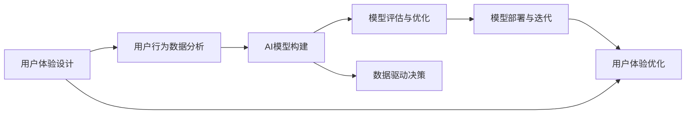

                 

# 体验设计师：AI时代的新兴职业

## 1. 背景介绍

随着人工智能(AI)技术的蓬勃发展，各行各业开始探索如何利用AI技术优化用户体验。在这股浪潮中，"体验设计师"这一新兴职业应运而生。体验设计师专注于利用AI技术，提升用户在各种产品和服务中的交互体验。本文将系统介绍体验设计师的角色定位、核心技能和应用场景，帮助读者理解这一职业的价值和前景。

## 2. 核心概念与联系

### 2.1 核心概念概述

体验设计师（Experience Designer）是AI时代的新兴职业，融合了用户体验设计（UX Design）和人工智能（AI）技术，以提升用户互动体验为核心目标。体验设计师的核心技能包括用户体验分析、AI模型构建和模型部署、数据驱动决策等。

在AI时代，体验设计师不仅需要具备传统UX设计的基本技能，如需求分析、用户研究、原型设计等，更需要掌握AI相关技术，如机器学习、自然语言处理、计算机视觉等，以实现对用户行为的预测和个性化推荐。

体验设计师的应用场景涵盖了各种智能产品和服务，如智能客服、智能推荐、智能家居、智能医疗等。通过AI技术，体验设计师能够分析用户行为数据，预测用户需求，提供个性化体验，从而提升用户满意度，增加产品粘性。

### 2.2 核心概念原理和架构的 Mermaid 流程图



这个Mermaid流程图展示了体验设计师工作的核心流程：

1. **用户体验设计**：通过用户研究和需求分析，设计出符合用户期望的产品功能和服务流程。
2. **用户行为数据分析**：收集用户行为数据，识别出潜在的用户需求和行为模式。
3. **AI模型构建**：基于用户行为数据，构建预测模型，如推荐系统、情感分析等，以提升用户体验。
4. **模型评估与优化**：通过不断的实验和评估，优化模型性能，提高预测准确率。
5. **数据驱动决策**：基于模型预测结果，制定产品策略和设计方案，确保用户需求得到满足。
6. **模型部署与迭代**：将优化后的模型部署到实际产品中，不断迭代改进。
7. **用户体验优化**：根据模型反馈和用户反馈，持续优化产品体验。

这些步骤紧密相连，形成了一个闭环反馈系统，确保用户体验持续优化。

## 3. 核心算法原理 & 具体操作步骤

### 3.1 算法原理概述

体验设计师的核心工作之一是构建和优化AI模型，以提升用户体验。AI模型通常基于机器学习算法，包括但不限于监督学习、无监督学习和强化学习。本文将重点介绍监督学习模型，它通过有标注数据进行训练，以预测用户行为和需求。

监督学习模型的训练过程一般包括以下步骤：

1. **数据准备**：收集用户行为数据，并进行预处理，如去噪、归一化等。
2. **模型选择**：选择适合的监督学习算法，如线性回归、逻辑回归、决策树等。
3. **模型训练**：使用标注数据训练模型，调整模型参数以最小化预测误差。
4. **模型评估**：使用测试数据评估模型性能，如准确率、召回率、F1值等。
5. **模型优化**：根据评估结果，调整模型结构或参数，进一步提升模型性能。
6. **模型部署**：将训练好的模型部署到实际应用中，进行实时预测。

### 3.2 算法步骤详解

以推荐系统为例，展示监督学习模型的详细步骤：

**步骤1：数据准备**

假设推荐系统需要预测用户对某商品的兴趣。收集历史用户行为数据，包括用户ID、商品ID、浏览时间、购买记录等。将这些数据进行清洗、去重，并划分为训练集和测试集。

**步骤2：模型选择**

选择线性回归模型进行训练。线性回归模型的公式为：

$$
y = \beta_0 + \beta_1 x_1 + \beta_2 x_2 + \ldots + \beta_n x_n
$$

其中，$y$表示用户对商品的兴趣，$\beta_0$为截距，$\beta_1, \beta_2, \ldots, \beta_n$为特征系数。

**步骤3：模型训练**

将训练集数据代入模型公式，求解出系数$\beta_0, \beta_1, \beta_2, \ldots, \beta_n$，使模型预测结果与真实标签之间的误差最小化。

**步骤4：模型评估**

使用测试集数据对模型进行评估，计算预测值与真实值的误差，如均方误差、平均绝对误差等。

**步骤5：模型优化**

根据评估结果，调整模型参数，如增加正则化项、引入新特征等，以提升模型性能。

**步骤6：模型部署**

将训练好的模型集成到推荐系统中，实时接收用户行为数据，预测用户对商品的兴趣，推荐相关商品。

### 3.3 算法优缺点

监督学习模型具有以下优点：

1. **准确性高**：有标注数据指导模型学习，能够较为准确地预测用户行为。
2. **可解释性强**：通过分析模型参数，可以解释模型预测的逻辑和依据。
3. **泛化能力强**：通过不断优化模型，能够适应新用户和新商品，提高模型泛化能力。

同时，监督学习模型也存在以下缺点：

1. **依赖标注数据**：需要大量高质量的标注数据，标注成本较高。
2. **过拟合风险**：在标注数据不足的情况下，模型容易过拟合，泛化性能下降。
3. **计算成本高**：模型训练和评估需要大量的计算资源和时间。

### 3.4 算法应用领域

监督学习模型在推荐系统、情感分析、智能客服等领域都有广泛应用。以推荐系统为例，通过分析用户历史行为数据，预测用户对商品的兴趣，并提供个性化推荐，大大提升了用户购物体验。

## 4. 数学模型和公式 & 详细讲解

### 4.1 数学模型构建

以推荐系统为例，推荐模型可以表示为：

$$
\hat{y} = f(x; \theta)
$$

其中，$\hat{y}$为推荐结果，$x$为用户行为数据，$\theta$为模型参数。

### 4.2 公式推导过程

以线性回归模型为例，假设训练集为$(x_1, y_1), (x_2, y_2), \ldots, (x_n, y_n)$，其中$x_i = [x_{i1}, x_{i2}, \ldots, x_{in}]^T$，$y_i$为标签。

根据最小二乘法，求解模型参数$\theta$，使预测值$\hat{y}$与真实值$y$之间的误差最小化。

最小二乘法的目标函数为：

$$
\min_{\theta} \sum_{i=1}^n (\hat{y}_i - y_i)^2
$$

求导得到：

$$
\frac{\partial}{\partial \theta} \sum_{i=1}^n (\hat{y}_i - y_i)^2 = -2 \sum_{i=1}^n (\hat{y}_i - y_i) x_i
$$

将上述公式展开，得到：

$$
\theta = (X^TX)^{-1} X^Ty
$$

其中，$X = [x_1, x_2, \ldots, x_n]^T$，$y = [y_1, y_2, \ldots, y_n]^T$。

### 4.3 案例分析与讲解

假设一个电商平台的推荐系统，收集了用户浏览商品的历史数据，包括商品ID、浏览时间等。使用线性回归模型预测用户对商品的兴趣，并将预测结果推荐给用户。具体步骤如下：

1. **数据准备**：收集用户历史浏览数据，包括商品ID、浏览时间、用户ID等。
2. **特征工程**：将浏览时间转换为小时数，增加用户ID、商品ID等特征。
3. **模型选择**：选择线性回归模型进行训练。
4. **模型训练**：使用标注数据训练模型，求解系数$\theta$。
5. **模型评估**：使用测试集数据评估模型性能，如准确率、召回率等。
6. **模型优化**：根据评估结果，调整模型参数，如增加正则化项、引入新特征等。
7. **模型部署**：将训练好的模型集成到推荐系统中，实时接收用户行为数据，预测用户对商品的兴趣，推荐相关商品。

## 5. 项目实践：代码实例和详细解释说明

### 5.1 开发环境搭建

体验设计师需要使用Python和相关的AI库，如TensorFlow、PyTorch、Scikit-learn等。以下是在Python环境中搭建开发环境的详细步骤：

1. **安装Python**：下载并安装Python，建议选择版本为3.7及以上。
2. **安装TensorFlow**：使用pip安装TensorFlow，建议安装最新版本。
3. **安装PyTorch**：使用pip安装PyTorch，建议安装最新版本。
4. **安装Scikit-learn**：使用pip安装Scikit-learn，建议安装最新版本。
5. **安装其他依赖库**：安装其他相关库，如Numpy、Pandas等。

### 5.2 源代码详细实现

以推荐系统为例，展示代码实现：

```python
import numpy as np
import pandas as pd
from sklearn.linear_model import LinearRegression
from sklearn.metrics import mean_squared_error

# 读取数据
data = pd.read_csv('user_behavior.csv')

# 数据预处理
X = data[['browsing_time', 'user_id', 'item_id']]
y = data['interest']

# 模型训练
model = LinearRegression()
model.fit(X, y)

# 模型评估
test_data = pd.read_csv('test_user_behavior.csv')
X_test = test_data[['browsing_time', 'user_id', 'item_id']]
y_test = test_data['interest']
predictions = model.predict(X_test)
mse = mean_squared_error(y_test, predictions)
print('MSE:', mse)
```

### 5.3 代码解读与分析

代码中，首先使用Pandas库读取数据，并进行数据预处理，将用户行为数据和商品ID等特征合并到X中，将用户兴趣标签合并到y中。然后，使用Scikit-learn库中的LinearRegression模型进行训练，并使用均方误差（MSE）作为评估指标。最后，将训练好的模型部署到推荐系统中，实时预测用户兴趣，进行个性化推荐。

## 6. 实际应用场景

### 6.1 智能客服系统

智能客服系统是体验设计师的重要应用场景之一。通过AI技术，体验设计师可以构建智能客服机器人，帮助用户快速解决问题，提升用户满意度。具体而言，智能客服系统可以包括：

1. **问题分类**：通过自然语言处理技术，将用户输入的问题进行分类，如常见问题、复杂问题、紧急问题等。
2. **知识库查询**：将用户问题与知识库中的问题和答案进行匹配，提供相关答案。
3. **问题解答**：根据知识库查询结果，智能客服机器人给出相关解答。
4. **用户反馈**：收集用户反馈，不断优化智能客服系统的回答质量。

### 6.2 智能推荐系统

智能推荐系统是体验设计师的另一重要应用场景。通过AI技术，体验设计师可以构建个性化推荐系统，根据用户历史行为数据，推荐相关商品、文章、视频等内容。具体而言，智能推荐系统可以包括：

1. **用户画像**：通过分析用户历史行为数据，构建用户画像，如兴趣、年龄、性别等。
2. **内容推荐**：根据用户画像和内容特征，推荐相关商品、文章、视频等。
3. **推荐算法**：使用协同过滤、内容推荐、混合推荐等算法，提升推荐精度。
4. **实时更新**：根据用户行为数据，实时更新推荐模型，提升推荐效果。

### 6.3 智能家居系统

智能家居系统是体验设计师的潜在应用场景。通过AI技术，体验设计师可以构建智能家居系统，根据用户行为数据，自动调整家居设备，提升用户舒适度和便利性。具体而言，智能家居系统可以包括：

1. **用户行为分析**：通过分析用户行为数据，识别用户需求和行为模式。
2. **设备控制**：根据用户行为数据，自动控制家居设备，如灯光、空调、电视等。
3. **情境感知**：根据用户行为数据和设备状态，提供情境感知服务，如提醒用户休息、调节温度等。
4. **个性化推荐**：根据用户行为数据，推荐相关家居设备，提升用户体验。

### 6.4 未来应用展望

随着AI技术的不断进步，体验设计师将面临更多新的应用场景，如智能医疗、智能交通、智能城市等。体验设计师需要不断学习和探索，拓展AI技术在各个领域的应用，提升用户体验。

## 7. 工具和资源推荐

### 7.1 学习资源推荐

为了帮助体验设计师掌握AI技术和用户体验设计，以下是一些推荐的学习资源：

1. **机器学习课程**：Coursera和edX等在线平台提供了丰富的机器学习课程，涵盖线性回归、决策树、随机森林等算法。
2. **自然语言处理课程**：斯坦福大学和麻省理工学院等高校提供了自然语言处理课程，涵盖词向量、句法分析、情感分析等技术。
3. **用户体验设计书籍**：如《用户体验设计全史》、《交互设计原理》等，帮助体验设计师理解用户体验设计的核心原则和方法。
4. **AI技术博客**：如Towards Data Science、KDnuggets等，涵盖AI技术的前沿进展和应用案例。

### 7.2 开发工具推荐

为了高效地开发体验设计师的项目，以下是一些推荐的开发工具：

1. **Python**：作为AI开发的主流语言，Python具有丰富的库和工具支持。
2. **TensorFlow**：开源的机器学习库，支持深度学习模型的构建和训练。
3. **PyTorch**：开源的深度学习库，具有灵活的张量操作和易于调试的特点。
4. **Scikit-learn**：开源的机器学习库，提供了简单易用的接口，支持各种算法。
5. **Jupyter Notebook**：交互式的开发环境，支持Python和R等多种语言，便于调试和展示。

### 7.3 相关论文推荐

体验设计师需要不断关注最新的研究成果，以下是一些推荐的相关论文：

1. **推荐系统综述**：《推荐系统：算法与实现》，介绍了推荐系统的基本原理和实现方法。
2. **智能客服研究**：《智能客服：理论与实践》，探讨了智能客服系统的构建和优化。
3. **情感分析应用**：《情感分析在社交媒体中的应用》，研究了情感分析在社交媒体上的应用和效果。
4. **自然语言处理进展**：《自然语言处理综述》，介绍了自然语言处理技术的前沿进展和应用案例。

## 8. 总结：未来发展趋势与挑战

### 8.1 研究成果总结

体验设计师作为AI时代的新兴职业，融合了用户体验设计和AI技术，为提升用户互动体验提供了新的可能性。体验设计师在智能客服、智能推荐、智能家居等领域的应用，已经取得了显著的成果。

### 8.2 未来发展趋势

1. **个性化推荐**：随着数据量的增加和AI技术的发展，个性化推荐将更加精准，用户满意度将进一步提升。
2. **智能家居**：智能家居系统将更加普及，通过AI技术，实现更高效、更智能的家居体验。
3. **智能医疗**：智能医疗系统将帮助医生更好地理解患者需求，提高诊疗效率和效果。
4. **智能交通**：智能交通系统将提升城市交通管理效率，改善居民出行体验。

### 8.3 面临的挑战

1. **数据隐私**：随着数据应用的深入，数据隐私和安全问题日益突出。体验设计师需要严格遵守数据隐私法规，保护用户数据。
2. **算法透明性**：AI算法的复杂性和黑盒特性，导致用户体验设计师难以理解和解释算法决策。需要开发更透明、可解释的AI算法。
3. **技术演进**：AI技术的快速发展，要求体验设计师不断学习新知识，掌握新技术，跟上技术演进的步伐。
4. **用户需求变化**：用户体验设计需要不断调整和优化，以适应用户需求的变化。需要建立持续的用户反馈机制，实时调整设计方案。

### 8.4 研究展望

1. **多模态交互**：未来的智能系统将支持多模态交互，如语音、图像、视频等，体验设计师需要掌握多模态技术，提升用户体验。
2. **边缘计算**：随着IoT设备的普及，体验设计师需要考虑边缘计算技术的应用，提升系统的实时性和可靠性。
3. **伦理道德**：随着AI技术的广泛应用，伦理道德问题日益突出。体验设计师需要建立伦理道德框架，确保技术的公平、公正和透明。

## 9. 附录：常见问题与解答

**Q1：体验设计师和UI/UX设计师有什么区别？**

A: 体验设计师与UI/UX设计师的主要区别在于对AI技术的掌握程度。UI/UX设计师主要关注用户界面和用户体验的设计，而体验设计师则利用AI技术，通过数据分析和模型构建，提升用户互动体验。

**Q2：如何提高AI推荐系统的精度？**

A: 提高AI推荐系统的精度可以从以下几个方面入手：

1. **数据质量**：确保数据质量和数据量，数据标注的准确性和完备性。
2. **特征工程**：选择合适的特征，并合理进行特征工程，提升模型的表达能力。
3. **模型选择**：选择合适的推荐算法，如协同过滤、内容推荐、混合推荐等，提升推荐精度。
4. **实时更新**：根据用户行为数据，实时更新推荐模型，提升推荐效果。
5. **用户反馈**：收集用户反馈，不断优化推荐系统，提升用户体验。

**Q3：如何确保智能家居系统的安全性和隐私保护？**

A: 确保智能家居系统的安全性和隐私保护，可以从以下几个方面入手：

1. **数据加密**：使用数据加密技术，确保用户数据在传输和存储过程中的安全性。
2. **权限控制**：通过权限控制技术，限制不同用户的访问权限，确保系统的安全性。
3. **异常检测**：建立异常检测机制，及时发现和处理系统异常行为，提升系统的安全性。
4. **数据匿名化**：对用户数据进行匿名化处理，保护用户隐私。
5. **法规遵守**：严格遵守数据隐私法规，保护用户数据隐私。

**Q4：如何设计智能客服系统的知识库？**

A: 设计智能客服系统的知识库，可以从以下几个方面入手：

1. **问题分类**：将用户问题进行分类，如常见问题、复杂问题、紧急问题等。
2. **答案结构化**：将答案进行结构化处理，如文本、图表、视频等，方便智能客服系统检索和展示。
3. **动态更新**：根据用户反馈和新问题，动态更新知识库，提升知识库的完备性和准确性。
4. **多渠道支持**：支持多渠道接入，如电话、邮件、社交媒体等，提升知识库的覆盖范围。
5. **用户反馈**：收集用户反馈，不断优化知识库，提升智能客服系统的回答质量。

**Q5：如何优化智能推荐系统的算法？**

A: 优化智能推荐系统的算法，可以从以下几个方面入手：

1. **模型选择**：选择合适的推荐算法，如协同过滤、内容推荐、混合推荐等，提升推荐精度。
2. **特征工程**：选择合适的特征，并合理进行特征工程，提升模型的表达能力。
3. **数据预处理**：对数据进行预处理，如去噪、归一化等，提升模型效果。
4. **实时更新**：根据用户行为数据，实时更新推荐模型，提升推荐效果。
5. **用户反馈**：收集用户反馈，不断优化推荐系统，提升用户体验。

**Q6：如何设计智能家居系统的情境感知功能？**

A: 设计智能家居系统的情境感知功能，可以从以下几个方面入手：

1. **用户行为分析**：通过分析用户行为数据，识别用户需求和行为模式。
2. **设备控制**：根据用户行为数据，自动控制家居设备，如灯光、空调、电视等。
3. **情境感知算法**：使用情境感知算法，如基于上下文的推荐、基于情感分析的推荐等，提升系统感知能力。
4. **数据融合**：将不同来源的数据进行融合，提升系统感知精度。
5. **用户反馈**：收集用户反馈，不断优化情境感知功能，提升用户体验。

---

作者：禅与计算机程序设计艺术 / Zen and the Art of Computer Programming

