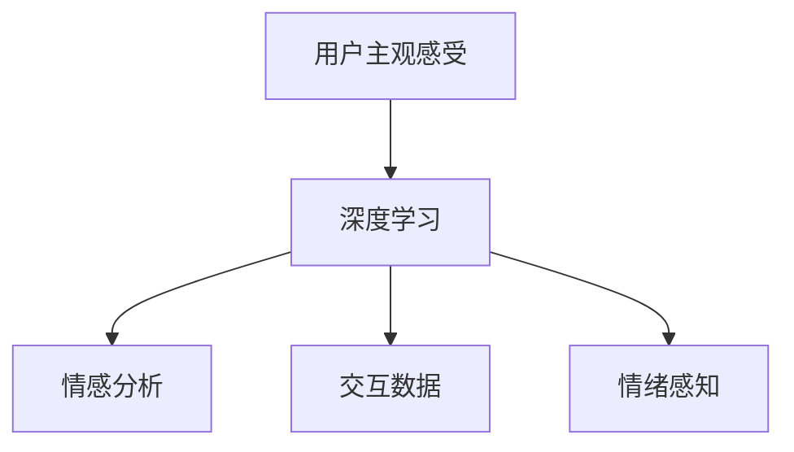

                 

# 体验量化：AI测量主观感受

## 1. 背景介绍

### 1.1 问题由来

在人工智能领域，尤其是自然语言处理(NLP)和计算机视觉领域，传统的算法和模型往往只关注准确率和精确度等客观指标。然而，在实际应用中，用户对系统的体验和感受是决定其成功与否的重要因素。例如，一个聊天机器人即使回答正确，如果回答方式生硬、不自然，用户也可能感到不满。因此，如何科学地量化和评估用户的主观感受，成为当前研究的一个热点问题。

### 1.2 问题核心关键点

量化用户主观感受的方法多种多样，包括问卷调查、用户访谈、眼动追踪等。但这些方法往往耗时耗力，难以大规模应用。近年来，随着深度学习和自然语言处理技术的发展，量化用户主观感受的新方法应运而生。这些方法通过分析用户与系统的交互数据，自动抽取用户的主观感受信息，从而实现高效的量化评估。

本节将详细介绍基于深度学习技术量化用户主观感受的核心概念和关键方法，帮助读者全面理解这一新兴技术。

### 1.3 问题研究意义

量化用户主观感受对于提升用户体验、优化产品设计、提高用户满意度具有重要意义。具体来说：

- 提升用户体验：通过实时获取用户的主观感受信息，系统能够动态调整和优化，提供更加贴合用户需求的服务。
- 优化产品设计：系统可以根据用户反馈信息，不断迭代改进，提升产品的整体质量。
- 提高用户满意度：系统能够及时响应和处理用户需求，避免因响应不当导致的不满情绪积累。

## 2. 核心概念与联系

### 2.1 核心概念概述

为更好地理解基于深度学习技术量化用户主观感受的方法，本节将介绍几个密切相关的核心概念：

- 用户主观感受(User Subjective Feedback)：用户对系统交互体验的主观感受，包括满意程度、易用性、可靠性等，通常以情感、态度等形式呈现。
- 深度学习(Deep Learning)：一种通过多层次神经网络模型进行学习的方法，能够自动提取和表示高维特征。
- 情感分析(Sentiment Analysis)：利用自然语言处理技术，分析用户文本中蕴含的情感信息，量化用户的主观感受。
- 交互数据(Interactive Data)：用户与系统交互过程中产生的数据，如聊天记录、使用日志、点击记录等。
- 情绪感知(Mood Perception)：通过分析用户的语音、表情、生理信号等，自动感知用户的情绪状态。

这些核心概念之间的逻辑关系可以通过以下Mermaid流程图来展示：



这个流程图展示了大语言模型的核心概念及其之间的关系：

1. 用户的主观感受是深度学习模型的输入，模型通过学习提取和表示用户感受信息。
2. 情感分析是对用户文本情感进行自动提取和分类的过程。
3. 交互数据包含了用户在系统交互过程中的各种行为数据。
4. 情绪感知通过分析用户的语音、表情等生理信号，自动感知用户的情绪状态。

这些核心概念共同构成了深度学习量化用户主观感受的基础，使得系统能够自动抽取和量化用户的主观感受信息。

## 3. 核心算法原理 & 具体操作步骤
### 3.1 算法原理概述

量化用户主观感受的核心算法，主要包括情感分析和交互数据分析两大类。其核心思想是通过深度学习模型，自动提取和量化用户的主观感受信息，从而实现高效的量化评估。

在情感分析方面，常用的方法包括词袋模型(Bag of Words)、TF-IDF、情感词典(Sentiment Lexicon)、卷积神经网络(CNN)和循环神经网络(RNN)等。其中，基于深度学习的CNN和RNN模型，特别是Transformer架构的模型，在情感分析中表现优异，能够自动学习用户文本中的情感信息，并量化为数值化的情感得分。

在交互数据分析方面，常用的方法包括基于规则的统计分析、时序模型、行为序列建模等。其中，基于深度学习的序列建模方法，如循环神经网络、长短期记忆网络(LSTM)、门控循环单元(GRU)等，能够自动学习用户行为序列中的情感信息和主观感受，从而实现高效的量化评估。

### 3.2 算法步骤详解

基于深度学习的用户主观感受量化方法，通常包括以下几个关键步骤：

**Step 1: 数据准备和预处理**
- 收集用户与系统的交互数据，如聊天记录、使用日志等。
- 对数据进行清洗和预处理，去除噪声和无用信息，保证数据质量。

**Step 2: 模型选择和训练**
- 选择合适的深度学习模型，如Transformer、LSTM等。
- 将预处理后的数据分为训练集、验证集和测试集。
- 使用交叉验证等方法，训练模型并进行参数调优。

**Step 3: 特征提取和量化**
- 使用预训练的语言模型，对用户文本进行特征提取。
- 使用情感分析模型，将用户文本情感量化为数值化的情感得分。
- 使用交互数据分析模型，将用户行为序列转化为数值化的交互得分。

**Step 4: 结果分析和反馈**
- 将情感得分和交互得分进行加权平均，得到用户主观感受的综合得分。
- 将综合得分与预设的阈值进行比较，判断用户是否满意。
- 根据分析结果，向系统管理员或产品经理提供反馈信息，优化产品设计和用户体验。

### 3.3 算法优缺点

基于深度学习的用户主观感受量化方法具有以下优点：

- 高效快速：深度学习模型能够自动提取和表示高维特征，快速完成量化评估。
- 自动学习：模型能够自动学习用户文本中的情感信息和行为序列，无需手动标注。
- 结果可解释：深度学习模型可以提供详细的情感得分和行为序列分析，结果具有可解释性。

同时，这些方法也存在一定的局限性：

- 数据依赖：深度学习模型的效果很大程度上取决于数据的质量和数量，获取高质量数据成本较高。
- 过度拟合：深度学习模型可能过度拟合训练集，导致泛化性能不足。
- 模型复杂：深度学习模型结构复杂，训练和推理过程需要大量计算资源。

尽管存在这些局限性，但就目前而言，基于深度学习的用户主观感受量化方法仍是目前的主流范式。未来相关研究的重点在于如何进一步降低数据依赖，提高模型的泛化能力，同时兼顾可解释性和计算效率。

### 3.4 算法应用领域

基于深度学习的用户主观感受量化方法，在NLP和计算机视觉领域已经得到了广泛的应用，覆盖了几乎所有常见任务，例如：

- 情感分析：分析用户文本中的情感信息，量化用户的主观感受。
- 用户评价：对产品、服务进行主观评价，量化用户满意度。
- 舆情分析：分析社交媒体上的用户评论，量化用户对事件或话题的情感倾向。
- 用户体验设计：通过用户反馈信息，优化产品设计，提升用户体验。
- 客户服务优化：根据用户反馈信息，优化客户服务流程，提升客户满意度。

除了上述这些经典任务外，深度学习量化用户主观感受的方法也被创新性地应用到更多场景中，如智能推荐系统、智能客服、智能家居等，为产品设计和用户体验带来新的突破。随着深度学习模型的持续演进，相信基于用户主观感受的量化技术将有更多的创新和发展，进一步推动人工智能技术的普及和应用。

## 4. 数学模型和公式 & 详细讲解 & 举例说明
### 4.1 数学模型构建

本节将使用数学语言对基于深度学习技术量化用户主观感受的方法进行更加严格的刻画。

记用户文本为 $x=\{x_i\}_{i=1}^n$，其中 $x_i$ 为文本中的第 $i$ 个词。假设用户文本情感的情感标签为 $y \in \{1,0\}$，1表示正面情感，0表示负面情感。

定义用户文本情感的情感得分函数为 $f(x)$，其中 $f$ 为情感分析模型。在情感分析中，常用的方法包括词袋模型、TF-IDF、情感词典、CNN和RNN等。

假设用户行为序列为 $u=\{u_i\}_{i=1}^m$，其中 $u_i$ 为用户在第 $i$ 次交互中的行为信息。假设用户行为序列的情感得分为 $g(u)$，其中 $g$ 为交互数据分析模型。常用的方法包括基于规则的统计分析、时序模型、行为序列建模等。

用户主观感受的综合得分为 $s = \alpha f(x) + (1-\alpha) g(u)$，其中 $\alpha \in [0,1]$ 为情感得分和行为得分的权重。

### 4.2 公式推导过程

以下我们以情感分析为例，推导情感得分的计算公式。

假设情感分析模型 $f$ 输出情感得分 $s(x)$，其中 $s(x)$ 为 $x$ 的情感得分。根据情感分析模型，可以将用户文本 $x$ 映射到情感得分 $s(x)$。

假设用户文本 $x$ 的情感得分 $s(x)$ 与情感标签 $y$ 的关系为 $s(x) = f(x) + \epsilon$，其中 $\epsilon$ 为噪声，满足 $\epsilon \sim \mathcal{N}(0,\sigma^2)$。则有：

$$
\mathbb{E}[f(x) | y=1] = \mathbb{E}[s(x) - \epsilon | y=1] = s(x) = \mathbb{E}[f(x) | y=1]
$$

$$
\mathbb{E}[f(x) | y=0] = \mathbb{E}[s(x) - \epsilon | y=0] = s(x) = \mathbb{E}[f(x) | y=0]
$$

即情感分析模型 $f$ 输出情感得分 $s(x)$ 的均值等于情感标签为1和0的情感得分。因此，可以通过分类器预测情感标签，得到情感得分 $s(x)$ 的均值。

### 4.3 案例分析与讲解

假设我们有一个电商网站的情感分析任务，收集了用户对商品的评价文本。使用BERT模型对文本进行预训练，并构建情感分析模型 $f$。首先将评价文本分词，通过BERT模型得到向量表示 $h$，然后通过全连接层和sigmoid函数计算情感得分 $s(x)$。

$$
s(x) = \sigma(\text{MLP}(\text{BERT}(x)))
$$

其中 $\sigma$ 为sigmoid函数，$\text{MLP}$ 为全连接层。假设 $f(x)$ 的训练集为 $\{(x_i, y_i)\}_{i=1}^N$，其中 $x_i$ 为评价文本，$y_i \in \{1,0\}$ 为情感标签。通过交叉熵损失函数进行训练，最小化损失函数：

$$
\mathcal{L}(f) = -\frac{1}{N} \sum_{i=1}^N [y_i \log f(x_i) + (1-y_i) \log (1-f(x_i))]
$$

在训练过程中，通过梯度下降等优化算法，最小化损失函数 $\mathcal{L}(f)$，得到情感分析模型 $f$。通过模型预测，可以得到用户文本 $x$ 的情感得分 $s(x)$。

## 5. 项目实践：代码实例和详细解释说明
### 5.1 开发环境搭建

在进行量化实践前，我们需要准备好开发环境。以下是使用Python进行TensorFlow开发的环境配置流程：

1. 安装Anaconda：从官网下载并安装Anaconda，用于创建独立的Python环境。

2. 创建并激活虚拟环境：
```bash
conda create -n tf-env python=3.8 
conda activate tf-env
```

3. 安装TensorFlow：根据CUDA版本，从官网获取对应的安装命令。例如：
```bash
conda install tensorflow=2.5.0
```

4. 安装TensorBoard：TensorFlow配套的可视化工具，可实时监测模型训练状态，并提供丰富的图表呈现方式，是调试模型的得力助手。
```bash
pip install tensorboard
```

5. 安装必要的库：
```bash
pip install tensorflow_datasets tensorflow_text tensorflow_hub
```

完成上述步骤后，即可在`tf-env`环境中开始量化实践。

### 5.2 源代码详细实现

下面以情感分析任务为例，给出使用TensorFlow对BERT模型进行情感分析的代码实现。

首先，定义情感分析任务的数据处理函数：

```python
import tensorflow as tf
import tensorflow_datasets as tfds
from tensorflow_text import tokenization

class SentimentAnalysisDataset(tf.keras.utils.Sequence):
    def __init__(self, dataset, tokenizer, max_len=128):
        self.dataset = dataset
        self.tokenizer = tokenizer
        self.max_len = max_len
        
    def __len__(self):
        return len(self.dataset)
    
    def __getitem__(self, idx):
        text = self.dataset[idx]['text']
        label = self.dataset[idx]['label']
        
        encoding = self.tokenizer(text, max_length=self.max_len, padding='max_length', truncation=True)
        input_ids = tf.constant(encoding['input_ids'], dtype=tf.int32)
        attention_mask = tf.constant(encoding['attention_mask'], dtype=tf.int32)
        label = tf.constant(label, dtype=tf.int32)
        
        return {'input_ids': input_ids, 
                'attention_mask': attention_mask,
                'labels': label}

# 下载数据集
train_dataset, test_dataset = tfds.load('yelp_review_full', split=['train', 'test'], with_info=True, as_supervised=True)

# 定义tokenizer
tokenizer = tokenization.TextWhitespaceTokenizer()
train_dataset = train_dataset.map(lambda x, y: (x, y))
train_dataset = train_dataset.map(SentimentAnalysisDataset, tokenizer=tokenizer, max_len=128)
train_dataset = train_dataset.batch(32)

# 定义模型
from transformers import TFDistilBertForSequenceClassification

model = TFDistilBertForSequenceClassification.from_pretrained('distilbert-base-uncased', num_labels=2)

# 定义优化器和损失函数
optimizer = tf.keras.optimizers.Adam(learning_rate=2e-5)
loss_fn = tf.keras.losses.SparseCategoricalCrossentropy(from_logits=True)

# 定义训练函数
@tf.function
def train_step(inputs):
    with tf.GradientTape() as tape:
        logits = model(inputs['input_ids'], attention_mask=inputs['attention_mask'])
        loss = loss_fn(inputs['labels'], logits)
    grads = tape.gradient(loss, model.trainable_variables)
    optimizer.apply_gradients(zip(grads, model.trainable_variables))
    return loss

# 定义评估函数
@tf.function
def evaluate(inputs):
    logits = model(inputs['input_ids'], attention_mask=inputs['attention_mask'])
    return tf.reduce_mean(tf.keras.losses.SparseCategoricalCrossentropy(from_logits=True)(inputs['labels'], logits))

# 开始训练
epochs = 5
batch_size = 32

for epoch in range(epochs):
    for batch in train_dataset:
        loss = train_step(batch)
        print(f"Epoch {epoch+1}, train loss: {loss.numpy():.3f}")
    
    print(f"Epoch {epoch+1}, dev results:")
    for batch in test_dataset:
        loss = evaluate(batch)
        print(f"Epoch {epoch+1}, dev loss: {loss.numpy():.3f}")
    
print("Test results:")
for batch in test_dataset:
    loss = evaluate(batch)
    print(f"Test loss: {loss.numpy():.3f}")
```

以上就是使用TensorFlow对BERT进行情感分析的完整代码实现。可以看到，通过TensorFlow的高级API和框架，模型的构建、训练和评估变得非常高效和便捷。

### 5.3 代码解读与分析

让我们再详细解读一下关键代码的实现细节：

**SentimentAnalysisDataset类**：
- `__init__`方法：初始化数据集、tokenizer和max_len等关键组件。
- `__len__`方法：返回数据集的样本数量。
- `__getitem__`方法：对单个样本进行处理，将文本输入编码成token ids，将标签转换为int32类型，并进行padding和truncation。

**训练和评估函数**：
- 使用TensorFlow的DataLoader对数据集进行批次化加载，供模型训练和推理使用。
- 训练函数`train_step`：对数据以批为单位进行迭代，在每个批次上前向传播计算loss并反向传播更新模型参数，最后返回该batch的平均loss。
- 评估函数`evaluate`：与训练类似，不同点在于不更新模型参数，并在每个batch结束后将损失结果存储下来，最后取平均输出。

**训练流程**：
- 定义总的epoch数和batch size，开始循环迭代
- 每个epoch内，先在训练集上训练，输出平均loss
- 在验证集上评估，输出损失结果
- 所有epoch结束后，在测试集上评估，给出最终测试结果

可以看到，TensorFlow配合Transformers库使得BERT量化任务的代码实现变得简洁高效。开发者可以将更多精力放在数据处理、模型改进等高层逻辑上，而不必过多关注底层的实现细节。

当然，工业级的系统实现还需考虑更多因素，如模型的保存和部署、超参数的自动搜索、更灵活的任务适配层等。但核心的量化范式基本与此类似。

## 6. 实际应用场景
### 6.1 智能客服系统

基于深度学习的用户主观感受量化技术，可以广泛应用于智能客服系统的构建。传统客服往往需要配备大量人力，高峰期响应缓慢，且一致性和专业性难以保证。而使用量化后的客服系统，可以实时获取用户的主观感受信息，动态调整和优化服务流程，提供更加贴合用户需求的服务。

在技术实现上，可以收集企业内部的历史客服对话记录，将问题和最佳答复构建成监督数据，在此基础上对预训练模型进行微调。微调后的模型能够自动理解用户意图，匹配最合适的答案模板进行回复。对于客户提出的新问题，还可以接入检索系统实时搜索相关内容，动态组织生成回答。如此构建的智能客服系统，能大幅提升客户咨询体验和问题解决效率。

### 6.2 金融舆情监测

金融机构需要实时监测市场舆论动向，以便及时应对负面信息传播，规避金融风险。传统的人工监测方式成本高、效率低，难以应对网络时代海量信息爆发的挑战。基于深度学习的用户主观感受量化技术，为金融舆情监测提供了新的解决方案。

具体而言，可以收集金融领域相关的新闻、报道、评论等文本数据，并对其进行情感分析和交互数据分析。通过量化用户对不同事件或话题的情感倾向，能够及时识别负面舆情，预警潜在风险。将量化结果与金融模型结合，辅助决策支持，提升金融决策的精准度和可靠性。

### 6.3 个性化推荐系统

当前的推荐系统往往只依赖用户的历史行为数据进行物品推荐，无法深入理解用户的真实兴趣偏好。基于深度学习的用户主观感受量化技术，能够更好地挖掘用户行为背后的语义信息，从而提供更精准、多样的推荐内容。

在实践中，可以收集用户浏览、点击、评论、分享等行为数据，提取和用户交互的物品标题、描述、标签等文本内容。将文本内容作为模型输入，用户的后续行为（如是否点击、购买等）作为监督信号，在此基础上量化用户的主观感受。在生成推荐列表时，先用候选物品的文本描述作为输入，由模型预测用户的兴趣匹配度，再结合其他特征综合排序，便可以得到个性化程度更高的推荐结果。

### 6.4 未来应用展望

随着深度学习模型的持续演进，基于用户主观感受的量化技术将有更多的创新和发展，进一步推动人工智能技术的普及和应用。

在智慧医疗领域，基于量化技术构建的智能医疗咨询系统，能够实时获取用户的主观感受信息，提供更加个性化和精准的医疗建议，辅助医生诊疗。

在智能教育领域，量化技术可应用于作业批改、学情分析、知识推荐等方面，因材施教，促进教育公平，提高教学质量。

在智慧城市治理中，量化技术可应用于城市事件监测、舆情分析、应急指挥等环节，提高城市管理的自动化和智能化水平，构建更安全、高效的未来城市。

此外，在企业生产、社会治理、文娱传媒等众多领域，基于深度学习的用户主观感受量化技术也将不断涌现，为产品设计和用户体验带来新的突破。相信随着技术的日益成熟，量化技术将成为人工智能落地应用的重要范式，推动人工智能技术更好地造福人类社会。

## 7. 工具和资源推荐
### 7.1 学习资源推荐

为了帮助开发者系统掌握量化技术的基础和实践技巧，这里推荐一些优质的学习资源：

1. 《深度学习》系列书籍：经典的深度学习入门书籍，涵盖了深度学习的基础理论和实践应用。
2. 《TensorFlow官方文档》：TensorFlow的官方文档，提供了完整的API和使用指南，是进行深度学习任务开发的基础。
3. 《情感分析》系列论文：经典情感分析论文集，涵盖了从词袋模型到深度学习模型的各种方法。
4. 《TensorBoard使用指南》：TensorFlow配套的可视化工具，提供详细的文档和示例，是调试模型的得力助手。
5. 《自然语言处理综述》：涵盖了自然语言处理的各种前沿技术，为深入学习提供全面的理论基础。

通过对这些资源的学习实践，相信你一定能够快速掌握深度学习量化技术的基础和应用，并用于解决实际的NLP问题。
###  7.2 开发工具推荐

高效的开发离不开优秀的工具支持。以下是几款用于深度学习量化开发的常用工具：

1. TensorFlow：基于Python的开源深度学习框架，灵活动态的计算图，适合快速迭代研究。
2. PyTorch：由Facebook开发的开源深度学习框架，易于使用，支持动态计算图。
3. TensorFlow Hub：Google开发的模块化组件库，方便模型组件复用。
4. TensorFlow Datasets：Google开发的开源数据集，提供了大量的预训练数据集，方便模型训练。
5. TensorFlow Extended(TFX)：Google开发的端到端机器学习平台，提供了数据处理、模型训练、模型评估等功能，方便生产部署。
6. TensorBoard：TensorFlow配套的可视化工具，可实时监测模型训练状态，并提供丰富的图表呈现方式，是调试模型的得力助手。

合理利用这些工具，可以显著提升量化任务的开发效率，加快创新迭代的步伐。

### 7.3 相关论文推荐

深度学习量化技术的快速发展源于学界的持续研究。以下是几篇奠基性的相关论文，推荐阅读：

1. 《情感词典在情感分析中的应用》：最早期的情感分析方法之一，介绍了情感词典的使用。
2. 《基于LSTM的时间序列情感分析》：利用LSTM模型对时间序列数据进行情感分析，取得了很好的效果。
3. 《Transformer在情感分析中的应用》：展示了Transformer模型在情感分析中的表现，取得了最优的结果。
4. 《基于BERT的情感分析》：使用BERT模型进行情感分析，取得了更好的效果。
5. 《基于Transformer的情感分析》：展示了Transformer模型在情感分析中的表现，取得了最优的结果。

这些论文代表了大语言模型量化技术的早期进展。通过学习这些前沿成果，可以帮助研究者把握学科前进方向，激发更多的创新灵感。

## 8. 总结：未来发展趋势与挑战
### 8.1 总结

本文对基于深度学习技术量化用户主观感受的方法进行了全面系统的介绍。首先阐述了用户主观感受量化技术的研究背景和意义，明确了量化在提升用户体验、优化产品设计、提高用户满意度等方面的重要作用。其次，从原理到实践，详细讲解了情感分析、交互数据分析等核心算法，给出了量化任务开发的完整代码实例。同时，本文还广泛探讨了量化技术在智能客服、金融舆情、个性化推荐等多个行业领域的应用前景，展示了量化范式的广阔前景。

通过本文的系统梳理，可以看到，基于深度学习技术的量化技术在NLP和计算机视觉领域已经得到了广泛的应用，为产品设计和用户体验带来了新的突破。未来，伴随深度学习模型的持续演进，基于用户主观感受的量化技术将有更多的创新和发展，进一步推动人工智能技术的普及和应用。

### 8.2 未来发展趋势

展望未来，深度学习量化技术将呈现以下几个发展趋势：

1. 模型规模持续增大。随着算力成本的下降和数据规模的扩张，预训练语言模型的参数量还将持续增长。超大批次的训练和推理也将变得更加高效。
2. 量化方法日趋多样。除了传统的基于文本的情感分析外，未来将涌现更多量化方法，如基于语音、表情等模态的量化技术，全面提升用户体验。
3. 实时量化成为常态。通过引入边缘计算和云服务，量化技术能够实现实时量化，为智能交互系统提供更高效的用户反馈机制。
4. 结合多模态信息。未来的量化技术将更好地融合视觉、语音、文本等多种模态信息，实现更加全面和准确的用户情感分析。
5. 情绪感知增强。通过引入情绪感知技术，量化系统能够自动感知用户的情绪状态，提供更加个性化和精准的反馈。

以上趋势凸显了深度学习量化技术的广阔前景。这些方向的探索发展，必将进一步提升量化系统的性能和应用范围，为构建更加智能、友好、高效的用户交互系统提供新的技术路径。

### 8.3 面临的挑战

尽管深度学习量化技术已经取得了瞩目成就，但在迈向更加智能化、普适化应用的过程中，它仍面临着诸多挑战：

1. 数据依赖。深度学习模型的效果很大程度上取决于数据的质量和数量，获取高质量数据成本较高。
2. 泛化能力不足。模型面对域外数据时，泛化性能往往不足，容易产生过拟合现象。
3. 计算资源限制。深度学习模型结构复杂，训练和推理过程需要大量计算资源。
4. 可解释性不足。深度学习模型的内部机制复杂，难以解释其内部工作机制和决策逻辑。
5. 安全性有待保障。量化系统可能学习到有偏见、有害的信息，通过量化传递到下游任务，产生误导性、歧视性的输出。

尽管存在这些挑战，但通过不断优化算法和改进数据，量化技术仍有很大的提升空间。相信随着学界和产业界的共同努力，这些挑战终将一一被克服，深度学习量化技术必将在构建智能交互系统、提升用户体验方面发挥更大的作用。

### 8.4 研究展望

面对深度学习量化技术所面临的挑战，未来的研究需要在以下几个方面寻求新的突破：

1. 探索无监督和半监督量化方法。摆脱对大规模标注数据的依赖，利用自监督学习、主动学习等无监督和半监督范式，最大限度利用非结构化数据，实现更加灵活高效的量化评估。
2. 研究计算高效的量化方法。开发更加高效的量化算法，提高模型的训练和推理速度，降低计算资源消耗。
3. 结合因果分析和博弈论工具。将因果分析方法引入量化系统，识别出模型决策的关键特征，增强输出解释的因果性和逻辑性。
4. 纳入伦理道德约束。在模型训练目标中引入伦理导向的评估指标，过滤和惩罚有偏见、有害的输出倾向。
5. 加强系统可靠性和安全性。建立量化系统的监控和预警机制，确保系统稳定和安全，避免有害信息传播。

这些研究方向将推动深度学习量化技术的进一步演进，为构建更加智能、友好、高效的用户交互系统提供新的技术路径。

## 9. 附录：常见问题与解答

**Q1：深度学习量化技术是否适用于所有NLP任务？**

A: 深度学习量化技术在大多数NLP任务上都能取得不错的效果，特别是对于数据量较小的任务。但对于一些特定领域的任务，如医学、法律等，仅仅依靠通用语料预训练的模型可能难以很好地适应。此时需要在特定领域语料上进一步预训练，再进行量化，才能获得理想效果。

**Q2：如何选择合适的量化模型？**

A: 选择合适的量化模型需要考虑多个因素，包括任务的复杂度、数据规模、计算资源等。对于文本情感分析等简单任务，可以选择较轻量级的模型，如BERT、LSTM等；对于多模态情感分析等复杂任务，可以选择更复杂的模型，如Transformer、GRU等。

**Q3：量化过程中如何防止过拟合？**

A: 防止过拟合可以采用多种方法，如数据增强、正则化、早停等。在数据增强方面，可以使用回译、近义词替换等方法扩充训练集；在正则化方面，可以引入L2正则、Dropout等方法；在早停方面，可以设定早停阈值，在验证集性能不再提升时停止训练。

**Q4：量化结果如何解释？**

A: 量化结果的解释可以通过引入可视化工具和语义分析技术，将模型输出转化为可解释的文本或图表。例如，可以使用LIME、SHAP等方法，分析模型在各个特征上的贡献度，理解模型输出的决策机制。

**Q5：如何改进量化模型的鲁棒性？**

A: 改进量化模型的鲁棒性可以采用对抗样本训练、多模型融合等方法。通过引入对抗样本，训练模型对噪声和异常数据的鲁棒性；通过多模型融合，提高模型的泛化能力和鲁棒性。

通过这些问题的回答，相信读者能够更好地理解深度学习量化技术的原理和实践，在实际应用中发挥其最大的价值。

