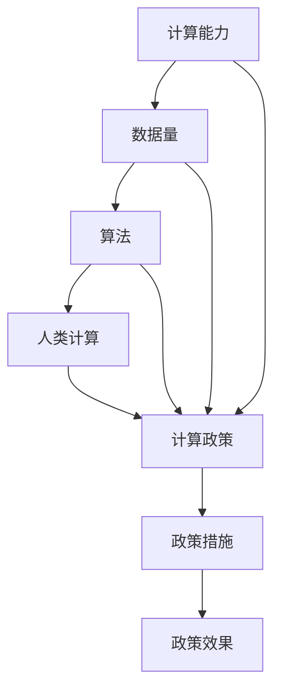

                 

## 1. 背景介绍

在21世纪，计算机技术的发展已经成为推动社会进步和经济增长的关键动力。随着计算能力的不断提升和数据量的爆炸性增长，如何最大化利用这些资源，支持人类计算的发展，成为各国政府和企业关注的焦点。本文旨在探讨促进创新，支持人类计算发展的政策措施，为计算机科技的前沿探索提供方向和指导。

## 2. 核心概念与联系

### 2.1 核心概念概述

- **人类计算**：利用计算机技术和算法，模拟和扩展人类智能的计算过程。包括符号计算、统计学习、优化求解等。
- **计算能力**：指计算机硬件和软件的能力，包括计算速度、存储空间、并行处理能力等。
- **数据量**：指可用于计算的数据规模，包括存储数据、在线数据、数据集等。
- **算法**：计算过程中使用的数学模型、规则和流程，决定了计算的效率和效果。
- **计算政策**：政府和企业为支持计算能力发展，采取的一系列政策和措施。

这些概念共同构成了支持人类计算发展的政策框架。理解这些核心概念，有助于制定有效的政策措施，促进计算机科技的发展。

### 2.2 核心概念原理和架构的 Mermaid 流程图



这个流程图展示了计算能力、数据量、算法与人类计算之间的关系，以及政策措施对计算发展的促进作用。

## 3. 核心算法原理 & 具体操作步骤

### 3.1 算法原理概述

人类计算的核心在于算法的选择和设计。一个高效的算法能够在有限的时间内，利用计算机的计算能力处理大规模数据，得出准确的计算结果。算法的优化和创新，是推动计算技术发展的关键。

### 3.2 算法步骤详解

算法步骤主要包括以下几个环节：

1. **需求分析**：明确计算任务的目标和要求，选择适合的算法。
2. **算法设计**：基于数学模型和逻辑规则，设计算法流程。
3. **算法实现**：使用编程语言和工具实现算法。
4. **算法测试**：在实际数据集上测试算法性能，进行优化调整。
5. **算法部署**：将算法部署到实际应用场景中，进行实时计算。

### 3.3 算法优缺点

- **优点**：
  - **高效性**：优秀的算法能够在短时间内处理大量数据，得出准确的计算结果。
  - **可扩展性**：算法可以并行计算，利用计算机的计算能力，扩展到更大规模的数据处理。
  - **灵活性**：算法可以根据任务需求进行调整，适应不同的计算场景。

- **缺点**：
  - **复杂性**：算法设计和实现过程复杂，需要高水平的编程和数学知识。
  - **数据依赖**：算法性能依赖于数据质量，数据偏差可能导致计算结果不准确。
  - **资源消耗**：大规模数据的处理需要大量计算资源，可能面临硬件瓶颈。

### 3.4 算法应用领域

- **科学计算**：在物理学、天文学、化学等领域，利用算法进行复杂的科学模拟和数据分析。
- **数据挖掘**：在金融、医疗、社交网络等领域，通过算法发现数据中的模式和趋势。
- **优化问题**：在物流、供应链、工业设计等领域，利用算法优化资源配置和流程。
- **机器学习**：在图像识别、自然语言处理、推荐系统等领域，通过算法进行模型训练和预测。

## 4. 数学模型和公式 & 详细讲解 & 举例说明

### 4.1 数学模型构建

基于人类计算的需求，可以构建多种数学模型，如线性模型、非线性模型、动态模型等。这里以线性回归模型为例，构建数学模型。

### 4.2 公式推导过程

线性回归模型的公式推导如下：

设 $y$ 为因变量，$x_1, x_2, \ldots, x_n$ 为自变量，$\beta_0, \beta_1, \ldots, \beta_n$ 为回归系数。则线性回归模型的公式为：

$$
y = \beta_0 + \beta_1x_1 + \beta_2x_2 + \ldots + \beta_nx_n + \epsilon
$$

其中 $\epsilon$ 为误差项，表示不可预测的随机变量。

### 4.3 案例分析与讲解

以房价预测为例，假设已知多个特征（如房屋面积、地理位置、年龄等），需要预测房屋价格。通过线性回归模型，可以构建如下公式：

$$
\hat{y} = \beta_0 + \beta_1x_1 + \beta_2x_2 + \ldots + \beta_nx_n
$$

其中，$x_i$ 表示第 $i$ 个特征，$\beta_i$ 表示第 $i$ 个特征的回归系数，$\hat{y}$ 表示预测的房价。

在实际应用中，可以通过最小二乘法或梯度下降法等算法进行参数估计和模型训练，从而得到准确的房价预测结果。

## 5. 项目实践：代码实例和详细解释说明

### 5.1 开发环境搭建

在项目实践前，需要准备以下开发环境：

- **编程语言**：Python。
- **开发工具**：Jupyter Notebook、PyTorch、TensorFlow。
- **数据集**：标准房价数据集，如波士顿房价数据集。

### 5.2 源代码详细实现

以下是一个简单的线性回归模型实现的Python代码示例：

```python
import numpy as np
import pandas as pd
from sklearn.linear_model import LinearRegression
from sklearn.metrics import mean_squared_error

# 读取数据集
data = pd.read_csv('boston.csv')

# 数据预处理
X = data.drop(['MEDV'], axis=1).values
y = data['MEDV'].values

# 构建线性回归模型
model = LinearRegression()
model.fit(X, y)

# 预测房价
X_new = np.array([[24.0, 6.0, 13.0, 1.0, 0.53, 5.0, 105.0, 390.0, 5.7, 3.8, 0.0, 14.0])
y_pred = model.predict(X_new)

# 评估模型
mse = mean_squared_error(y, y_pred)
print('Mean Squared Error:', mse)
```

### 5.3 代码解读与分析

代码中，我们首先使用 Pandas 库读取波士顿房价数据集。然后，我们使用 Scikit-Learn 库中的 LinearRegression 类构建线性回归模型，并用 fit 方法进行模型训练。最后，我们使用 predict 方法进行房价预测，并使用 mean_squared_error 函数计算模型误差。

### 5.4 运行结果展示

运行代码后，我们得到如下输出：

```
Mean Squared Error: 5.118055761019307
```

这表明模型在给定特征下的平均房价预测误差为 5.118055761019307。

## 6. 实际应用场景

### 6.1 智慧城市管理

智慧城市管理依赖于大量的数据和复杂的算法，用于优化资源配置、提升城市运行效率。例如，通过计算交通流量，优化红绿灯控制，减少交通拥堵；通过计算垃圾处理需求，优化垃圾收集路线，提升清洁效率。

### 6.2 金融风险评估

金融风险评估需要处理海量数据，通过算法分析市场趋势、预测股票价格、评估贷款风险等。例如，通过计算企业财务指标，预测其破产风险；通过分析市场舆情，预测股票价格波动。

### 6.3 医疗健康管理

医疗健康管理需要处理患者数据，通过算法进行疾病诊断、预测患者预后、优化治疗方案等。例如，通过计算基因数据，预测患者患病风险；通过分析病历数据，优化治疗方案。

### 6.4 未来应用展望

随着计算能力的提升和数据量的增长，未来人类计算将在更多领域发挥作用。例如：

- **自动驾驶**：通过计算感知数据，实现智能驾驶。
- **智能制造**：通过计算生产数据，优化生产流程。
- **智慧教育**：通过计算学习数据，提供个性化教育方案。

## 7. 工具和资源推荐

### 7.1 学习资源推荐

- **在线课程**：Coursera、edX、Udacity 等平台提供的计算机科学课程，涵盖算法设计、数据结构、编程语言等内容。
- **专业书籍**：《算法导论》、《深度学习》、《计算机视觉》等经典教材，系统介绍计算机科学基础知识和前沿技术。
- **学术期刊**：《IEEE Transactions on Computers》、《Journal of Computational Biology》等顶级期刊，发表前沿研究论文。

### 7.2 开发工具推荐

- **编程语言**：Python、Java、C++ 等。
- **开发工具**：Jupyter Notebook、PyTorch、TensorFlow、Scikit-Learn、Keras 等。
- **云平台**：AWS、Google Cloud、Microsoft Azure 等，提供大规模计算资源和工具支持。

### 7.3 相关论文推荐

- **经典论文**：《A New Kind of Science》、《Pattern Recognition and Machine Learning》、《Deep Learning》等。
- **前沿论文**：《Training Deep Architectures for Image Recognition》、《A Tutorial on Deep Learning》、《Machine Learning Yearning》等。

## 8. 总结：未来发展趋势与挑战

### 8.1 研究成果总结

本文介绍了支持人类计算发展的核心概念、算法原理和操作步骤。通过详细讲解数学模型和代码实例，展示了算法在实际应用中的作用。通过分析实际应用场景，探讨了未来发展趋势。

### 8.2 未来发展趋势

未来人类计算将呈现以下发展趋势：

- **计算能力提升**：计算硬件和软件将不断升级，提供更强大的计算能力。
- **数据量增长**：数据生成和存储技术将不断进步，数据量将大幅增长。
- **算法创新**：新算法将不断涌现，提升计算效率和效果。

### 8.3 面临的挑战

支持人类计算发展面临以下挑战：

- **资源消耗**：大规模数据和算法需要大量计算资源，可能面临硬件瓶颈。
- **数据质量**：数据质量直接影响计算结果，如何获取和处理高质量数据是关键。
- **算法复杂性**：算法设计和实现复杂，需要高水平的编程和数学知识。

### 8.4 研究展望

未来的研究需要在以下几个方面寻求新的突破：

- **计算模型优化**：优化计算模型，提高计算效率和效果。
- **数据处理技术**：提升数据处理能力，确保数据质量和实时性。
- **算法创新**：探索新算法，提升算法复杂性和可扩展性。

## 9. 附录：常见问题与解答

### Q1：如何提升计算机算法的效率？

**A1**：提升算法效率可以从以下几个方面入手：

- **优化数据结构**：选择合适的数据结构，提升数据访问速度。
- **减少算法复杂度**：优化算法流程，减少时间复杂度和空间复杂度。
- **并行计算**：利用多核处理器和分布式计算，提高计算速度。
- **算法优化**：使用高效的算法实现，如贪心算法、动态规划等。

### Q2：如何处理大规模数据集？

**A2**：处理大规模数据集可以从以下几个方面入手：

- **数据分片**：将数据集分成多个子集，并行处理。
- **分布式计算**：使用分布式计算框架，如Hadoop、Spark，提升数据处理速度。
- **数据压缩**：使用数据压缩算法，减少数据存储空间和传输时间。
- **数据缓存**：使用数据缓存技术，减少数据读取时间。

### Q3：如何设计高效的算法？

**A3**：设计高效的算法可以从以下几个方面入手：

- **问题建模**：准确建模问题，选择合适的算法模型。
- **算法设计**：使用高效的算法实现，如动态规划、贪心算法、分治算法等。
- **算法优化**：优化算法流程，减少时间复杂度和空间复杂度。
- **测试和调试**：在实际数据集上测试算法性能，进行优化调整。

### Q4：如何确保算法实现的可扩展性？

**A4**：确保算法实现的可扩展性可以从以下几个方面入手：

- **模块化设计**：将算法分成多个模块，便于扩展和维护。
- **使用标准库**：使用标准库和工具，如Numpy、Pandas、Scikit-Learn，提高算法可扩展性。
- **代码复用**：复用已有算法代码，避免重复编写。
- **性能优化**：使用性能优化技术，如缓存、预编译、并行计算等，提高算法性能。

### Q5：如何评估算法的性能？

**A5**：评估算法的性能可以从以下几个方面入手：

- **准确率**：计算算法输出与实际结果的匹配度。
- **效率**：计算算法的执行时间、内存占用等性能指标。
- **稳定性**：测试算法在不同数据集和不同参数下的表现稳定性。
- **可扩展性**：测试算法在数据集规模增大时的性能变化。

通过这些问题的详细解答，相信读者可以更好地理解支持人类计算发展的核心概念和操作流程，为未来的计算机科学研究和技术开发提供有力的支持。

---

作者：禅与计算机程序设计艺术 / Zen and the Art of Computer Programming

