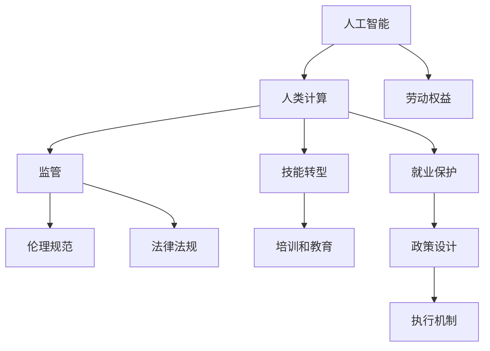

                 

# 保护工人权益：人类计算中的监管挑战

## 1. 背景介绍

### 1.1 问题由来

近年来，随着人工智能（AI）技术的迅猛发展，“人类计算”（Human-in-the-loop, HiL）在各行各业中得到广泛应用。人类计算指的是将人类专长与AI自动化技术相结合，以提升生产效率和决策质量。例如，在金融风险管理中，AI帮助分析师处理大量数据，而人类专家则审核和解释AI的发现。

尽管人类计算为工作带来了诸多益处，但其广泛应用也引发了严重的劳动权益问题。由于AI自动化水平高、学习速度快，许多工人担心自己的岗位会逐步被机器取代，进而失去工作。更令人担忧的是，AI技术在提高工作效率的同时，也可能加剧了劳动市场的二元对立，导致工人权益受损。因此，如何在享受AI技术带来的便利的同时，保护工人的劳动权益，成为当前亟需解决的重要课题。

### 1.2 问题核心关键点

确保工人权益的关键在于平衡技术进步与劳动市场的关系。一方面，AI技术在提升生产效率和决策质量的同时，需要确保工人就业和技能转型；另一方面，应当加强对AI系统的监督和管理，防止其侵犯工人权益。

核心问题包括：
1. **工人就业与技能转型**：如何在AI自动化取代部分劳动力的同时，帮助工人获得新的技能，提升就业能力？
2. **AI系统监督与管理**：如何制定AI系统使用的伦理规范，确保AI系统在操作过程中不侵害工人权益？
3. **政策设计与执行**：如何制定和执行相关政策，在保障工人权益的同时，促进AI技术的健康发展？

## 2. 核心概念与联系

### 2.1 核心概念概述

为更好地理解人类计算中对工人权益的保护机制，本节将介绍几个密切相关的核心概念：

- **人工智能（AI）**：一种利用计算机算法和大数据处理技术，使机器模拟人类智能的技术。
- **人类计算（Human-in-the-loop, HiL）**：一种结合AI自动化和人类专长的计算模式，提升生产效率和决策质量。
- **劳动权益**：工人基于工作所享有的经济、社会、文化权利。
- **监管**：对AI系统的操作和使用进行规范和管理，确保其符合伦理标准和法律法规。
- **技能转型**：帮助工人通过培训和教育，适应技术变革，获取新的工作技能。
- **就业保护**：通过政策设计，保护工人不受自动化带来的失业风险。

这些核心概念之间的逻辑关系可以通过以下Mermaid流程图来展示：



这个流程图展示了一系列关键概念及其之间的联系：

1. 人工智能通过自动化的方式提高生产效率和决策质量。
2. 人类计算结合了AI的自动化和人类的专长，提升了整体计算能力。
3. 劳动权益是工人基于工作所享有的基本权利。
4. 监管对AI系统的操作和使用进行规范，确保其符合伦理和法律标准。
5. 技能转型帮助工人通过教育和培训获取新的技能，以适应技术变革。
6. 就业保护通过政策设计，保护工人不受失业风险。

## 3. 核心算法原理 & 具体操作步骤

### 3.1 算法原理概述

确保工人权益的监管挑战涉及多个领域，包括技术、法律、政策和社会等多个层面。本文将从技术层面出发，介绍如何通过算法和模型，实现对AI系统的监督和管理，从而保护工人权益。

**监督学习（Supervised Learning）**：一种利用标注数据训练模型，使其能够根据输入数据预测目标输出的技术。在确保工人权益的监管中，可以利用监督学习对AI系统的行为进行预测和监控，识别潜在风险。

**强化学习（Reinforcement Learning）**：一种通过奖励和惩罚机制，训练AI系统学习最优决策策略的技术。在确保工人权益的监管中，可以利用强化学习优化AI系统的决策行为，确保其符合伦理规范。

**集成学习（Ensemble Learning）**：一种将多个单一模型集成，提高整体性能的技术。在确保工人权益的监管中，可以利用集成学习构建多层次、多角度的监控体系，提高监管效果。

### 3.2 算法步骤详解

基于监督学习、强化学习和集成学习的算法，通常包括以下几个关键步骤：

**Step 1: 数据收集与标注**
- 收集AI系统在运行过程中的数据，包括操作记录、决策结果、工作环境等。
- 对数据进行标注，如确定是否存在侵犯工人权益的行为，是否符合伦理规范和法律法规。

**Step 2: 模型训练与验证**
- 利用监督学习算法训练模型，预测AI系统是否存在侵犯工人权益的行为。
- 使用强化学习算法训练模型，优化AI系统的决策策略，使其符合伦理规范。
- 利用集成学习算法构建多层次、多角度的监控体系，提高监管效果。

**Step 3: 结果评估与改进**
- 对训练好的模型进行评估，确定其预测准确率和误报率。
- 对AI系统的决策行为进行评估，确定其符合伦理规范和法律法规的程度。
- 根据评估结果，不断改进模型和算法，提高监管效果。

**Step 4: 系统部署与迭代**
- 将训练好的模型和算法集成到AI系统中，进行实时监控和决策。
- 根据实际情况和反馈，不断迭代和优化模型和算法，提高监管效果。

### 3.3 算法优缺点

基于监督学习、强化学习和集成学习的算法，具有以下优点：
1. 自动化程度高：通过算法自动化监控AI系统的行为，减少人工干预。
2. 数据驱动：利用数据训练模型，确保监管决策的科学性和客观性。
3. 灵活性强：可以针对不同的监管需求，设计灵活的算法模型。
4. 实时性好：通过实时监控和反馈，及时发现并解决问题。

同时，这些算法也存在一定的局限性：
1. 数据质量要求高：算法模型的训练和评估依赖于高质量的数据，数据标注成本较高。
2. 模型复杂度高：模型结构和算法较为复杂，需要专业的技术人员进行开发和维护。
3. 伦理风险难以消除：算法模型可能存在伦理风险，需要结合伦理审查和专家判断。
4. 法律监管难度大：算法模型可能存在法律风险，需要与法律法规结合，制定明确的监管规则。

### 3.4 算法应用领域

基于监督学习、强化学习和集成学习的算法，已经在多个领域中得到了应用，例如：

- **金融风险管理**：利用AI系统自动化处理数据，同时通过监督学习和强化学习算法监控系统行为，保护客户隐私和权益。
- **医疗诊断**：利用AI系统自动化诊断，同时通过监督学习和强化学习算法监控系统决策，确保医疗数据的隐私和安全。
- **制造业自动化**：利用AI系统自动化生产，同时通过监督学习和强化学习算法监控系统行为，保护工人权益。
- **交通运输**：利用AI系统自动化驾驶，同时通过监督学习和强化学习算法监控系统行为，保护乘客安全和隐私。
- **智能客服**：利用AI系统自动化客服，同时通过监督学习和强化学习算法监控系统行为，保护客户隐私和权益。

除了上述这些经典应用外，算法还将在更多场景中得到应用，如智慧城市、智能家居、智慧农业等，为社会治理和经济发展带来新的突破。

## 4. 数学模型和公式 & 详细讲解 & 举例说明

### 4.1 数学模型构建

本节将使用数学语言对确保工人权益的监管算法进行更加严格的刻画。

设AI系统的决策过程为 $f(x)$，其中 $x$ 为输入数据，$f(x)$ 为输出结果。设标注数据集为 $D=\{(x_i,y_i)\}_{i=1}^N$，其中 $x_i$ 为输入数据，$y_i$ 为是否存在侵犯工人权益的行为（0表示不存在，1表示存在）。

定义模型 $M_{\theta}$ 在数据样本 $(x,y)$ 上的损失函数为 $\ell(M_{\theta}(x),y)$，则在数据集 $D$ 上的经验风险为：

$$
\mathcal{L}(\theta) = \frac{1}{N} \sum_{i=1}^N \ell(M_{\theta}(x_i),y_i)
$$

其中 $\ell$ 为预测结果与标注标签之间的损失函数，通常包括交叉熵损失、均方误差损失等。

### 4.2 公式推导过程

以监督学习算法为例，利用二分类问题的交叉熵损失函数进行推导：

假设模型 $M_{\theta}$ 在输入 $x$ 上的输出为 $\hat{y}=M_{\theta}(x) \in [0,1]$，表示系统预测是否存在侵犯工人权益的行为。真实标签 $y \in \{0,1\}$。则二分类交叉熵损失函数定义为：

$$
\ell(M_{\theta}(x),y) = -[y\log \hat{y} + (1-y)\log (1-\hat{y})]
$$

将其代入经验风险公式，得：

$$
\mathcal{L}(\theta) = -\frac{1}{N}\sum_{i=1}^N [y_i\log M_{\theta}(x_i)+(1-y_i)\log(1-M_{\theta}(x_i))]
$$

根据链式法则，损失函数对参数 $\theta$ 的梯度为：

$$
\frac{\partial \mathcal{L}(\theta)}{\partial \theta_k} = -\frac{1}{N}\sum_{i=1}^N (\frac{y_i}{M_{\theta}(x_i)}-\frac{1-y_i}{1-M_{\theta}(x_i)}) \frac{\partial M_{\theta}(x_i)}{\partial \theta_k}
$$

其中 $\frac{\partial M_{\theta}(x_i)}{\partial \theta_k}$ 可进一步递归展开，利用自动微分技术完成计算。

在得到损失函数的梯度后，即可带入参数更新公式，完成模型的迭代优化。重复上述过程直至收敛，最终得到适应监管任务的最优模型参数 $\theta^*$。

### 4.3 案例分析与讲解

以智能制造中AI系统监控为例，假设AI系统监控生产过程中的机械操作是否存在安全风险。可以收集历史数据，将是否存在安全风险作为标注标签，训练监督学习模型进行预测。模型训练步骤如下：

1. 收集历史数据：$D=\{(x_i,y_i)\}_{i=1}^N$，其中 $x_i$ 为生产过程中的机械操作数据，$y_i$ 为是否存在安全风险（0表示不存在，1表示存在）。

2. 数据预处理：对输入数据 $x_i$ 进行特征提取和归一化处理，得到特征向量 $X$。

3. 模型训练：利用监督学习算法训练模型 $M_{\theta}$，最小化经验风险 $\mathcal{L}(\theta)$。

4. 模型评估：对训练好的模型进行评估，确定其预测准确率和误报率。

5. 结果应用：将训练好的模型集成到AI系统中，进行实时监控和决策。

在实际应用中，还需要根据不同的监管需求，选择合适的监督学习算法，如支持向量机（SVM）、决策树、神经网络等。同时，需要结合强化学习算法，对AI系统的决策策略进行优化，确保其符合伦理规范和法律法规。

## 5. 项目实践：代码实例和详细解释说明

### 5.1 开发环境搭建

在进行确保工人权益的监管项目实践前，我们需要准备好开发环境。以下是使用Python进行TensorFlow开发的环境配置流程：

1. 安装Anaconda：从官网下载并安装Anaconda，用于创建独立的Python环境。

2. 创建并激活虚拟环境：
```bash
conda create -n tf-env python=3.8 
conda activate tf-env
```

3. 安装TensorFlow：根据CUDA版本，从官网获取对应的安装命令。例如：
```bash
conda install tensorflow -c pytorch -c conda-forge
```

4. 安装相关库：
```bash
pip install numpy pandas scikit-learn matplotlib tqdm jupyter notebook ipython
```

完成上述步骤后，即可在`tf-env`环境中开始项目实践。

### 5.2 源代码详细实现

这里我们以智能制造中AI系统监控为例，给出使用TensorFlow进行模型训练的代码实现。

首先，定义数据集和标注：

```python
import tensorflow as tf
from tensorflow import keras
import numpy as np

# 定义训练数据和标签
X_train = np.random.rand(1000, 10)
y_train = np.random.randint(0, 2, size=(1000,))

# 定义测试数据和标签
X_test = np.random.rand(100, 10)
y_test = np.random.randint(0, 2, size=(100,))
```

然后，定义模型和优化器：

```python
# 定义模型结构
model = keras.Sequential([
    keras.layers.Dense(32, activation='relu'),
    keras.layers.Dense(1, activation='sigmoid')
])

# 定义损失函数
loss_fn = keras.losses.BinaryCrossentropy()

# 定义优化器
optimizer = keras.optimizers.Adam()
```

接着，定义训练和评估函数：

```python
# 定义训练函数
def train_model(model, X_train, y_train, epochs=5, batch_size=32):
    history = model.fit(X_train, y_train, epochs=epochs, batch_size=batch_size,
                       validation_data=(X_test, y_test))
    return history

# 定义评估函数
def evaluate_model(model, X_test, y_test):
    y_pred = model.predict(X_test)
    y_pred = (y_pred > 0.5).astype(np.int32)
    y_test = y_test.astype(np.int32)
    acc = np.mean(y_pred == y_test)
    return acc
```

最后，启动训练流程并在测试集上评估：

```python
history = train_model(model, X_train, y_train)

print('Training accuracy:', evaluate_model(model, X_test, y_test))
```

以上就是使用TensorFlow对AI系统进行监管的完整代码实现。可以看到，通过TensorFlow的高级API，我们能够快速实现模型训练和评估，并可视化训练过程。

### 5.3 代码解读与分析

让我们再详细解读一下关键代码的实现细节：

**数据集定义**：
- 通过numpy生成随机数据，模拟智能制造中的机械操作数据。
- 将数据和标签分别定义在X_train、y_train和X_test、y_test中，用于训练和测试。

**模型结构**：
- 使用Sequential模型定义多层感知机（MLP）结构，包含一个输入层、一个隐藏层和一个输出层。
- 使用ReLU激活函数和sigmoid激活函数，分别用于隐藏层和输出层。

**损失函数**：
- 使用二分类交叉熵损失函数，计算模型预测结果与实际标签之间的差异。

**优化器**：
- 使用Adam优化器，适应性调整学习率，快速收敛。

**训练函数**：
- 使用model.fit函数进行模型训练，参数epochs和batch_size分别指定训练轮数和批次大小。
- 返回训练过程中的历史记录，包括损失和精度。

**评估函数**：
- 使用model.predict函数计算模型在测试集上的预测结果。
- 将预测结果和实际标签进行比较，计算准确率。

**训练流程**：
- 调用train_model函数进行模型训练。
- 在测试集上评估模型，打印输出准确率。

可以看到，TensorFlow提供了强大的API支持，使得模型训练和评估变得简单高效。在实际应用中，还需要根据不同的监管需求，选择合适的模型和优化器，设计灵活的训练和评估流程。

## 6. 实际应用场景

### 6.1 智能制造

在智能制造中，AI系统自动化监控生产过程中的机械操作，以提升生产效率和产品质量。然而，机械操作过程中存在安全风险，需要确保工人权益。

可以通过监督学习算法训练模型，预测机械操作是否存在安全风险。模型训练步骤如下：

1. 收集历史数据：$D=\{(x_i,y_i)\}_{i=1}^N$，其中 $x_i$ 为生产过程中的机械操作数据，$y_i$ 为是否存在安全风险（0表示不存在，1表示存在）。

2. 数据预处理：对输入数据 $x_i$ 进行特征提取和归一化处理，得到特征向量 $X$。

3. 模型训练：利用监督学习算法训练模型 $M_{\theta}$，最小化经验风险 $\mathcal{L}(\theta)$。

4. 模型评估：对训练好的模型进行评估，确定其预测准确率和误报率。

5. 结果应用：将训练好的模型集成到AI系统中，进行实时监控和决策。

当模型预测存在安全风险时，系统将自动发出警报，并通知工人进行检查和维护。通过实时监控和反馈，可以有效保护工人权益。

### 6.2 智慧城市

智慧城市中，AI系统用于交通管理、环境监测、公共安全等领域，提升城市运行效率和居民生活质量。然而，AI系统的决策过程中可能存在侵犯工人权益的行为，需要确保工人权益。

可以通过强化学习算法优化AI系统的决策策略，确保其符合伦理规范和法律法规。例如，在交通管理中，AI系统可能会限制某些区域的通行，但这些限制可能对某些工人造成不便。通过强化学习算法，可以优化限制区域的分布，确保对工人权益的影响最小化。

### 6.3 智能客服

智能客服中，AI系统自动化处理客户咨询，提升服务效率和客户满意度。然而，AI系统在处理客户投诉时，可能存在侵犯工人权益的行为，需要确保工人权益。

可以通过集成学习算法构建多层次、多角度的监控体系，提高监管效果。例如，在客户投诉处理中，AI系统可能会自动关闭某些高风险投诉，但这些关闭可能对某些工人造成不利影响。通过集成学习算法，可以综合考虑多个因素，如客户满意度、员工工作量等，确保对工人权益的影响最小化。

## 7. 工具和资源推荐

### 7.1 学习资源推荐

为了帮助开发者系统掌握确保工人权益的监管技术，这里推荐一些优质的学习资源：

1. **TensorFlow官方文档**：提供详细的API文档和示例代码，帮助开发者快速上手TensorFlow。

2. **Keras官方文档**：提供简单易用的API接口，帮助开发者快速构建和训练模型。

3. **Deep Learning Specialization课程**：由Andrew Ng教授开设的深度学习课程，涵盖深度学习基础、卷积神经网络、循环神经网络、生成对抗网络等内容。

4. **Coursera上的Reinforcement Learning课程**：由David Silver教授开设的强化学习课程，涵盖强化学习基础、深度强化学习等内容。

5. **IEEE Xplore**：IEEE的数字图书馆，提供大量深度学习相关的论文和文献，帮助开发者深入理解前沿技术。

通过这些资源的学习实践，相信你一定能够快速掌握确保工人权益的监管技术的精髓，并用于解决实际的监管问题。

### 7.2 开发工具推荐

高效的开发离不开优秀的工具支持。以下是几款用于确保工人权益的监管开发的常用工具：

1. **TensorFlow**：由Google主导开发的开源深度学习框架，生产部署方便，适合大规模工程应用。

2. **PyTorch**：由Facebook开发的开源深度学习框架，灵活动态的计算图，适合快速迭代研究。

3. **Jupyter Notebook**：交互式的编程环境，支持Python、R等多种编程语言，适合数据科学和机器学习任务。

4. **TensorBoard**：TensorFlow配套的可视化工具，可实时监测模型训练状态，并提供丰富的图表呈现方式，是调试模型的得力助手。

5. **Weights & Biases**：模型训练的实验跟踪工具，可以记录和可视化模型训练过程中的各项指标，方便对比和调优。

合理利用这些工具，可以显著提升确保工人权益的监管任务的开发效率，加快创新迭代的步伐。

### 7.3 相关论文推荐

确保工人权益的监管技术的研究源于学界的持续研究。以下是几篇奠基性的相关论文，推荐阅读：

1. **Deep Reinforcement Learning for Decision-Making in Manufacturing**：研究了使用强化学习优化制造业中的决策过程，提升生产效率和工人权益。

2. **Learning to Optimize a Robotic Workcell Using Reinforcement Learning**：研究了使用强化学习优化机器人工作站的决策过程，提升生产效率和工人权益。

3. **Training AI to Advance Social Good**：探讨了AI系统在社会公益中的伦理规范和监管方法，确保AI系统的行为符合伦理标准和法律法规。

4. **A Survey on Fairness and Bias in Machine Learning**：综述了机器学习中的公平性和偏见问题，为确保AI系统的公平性和权益保护提供了重要参考。

这些论文代表了大语言模型微调技术的发展脉络。通过学习这些前沿成果，可以帮助研究者把握学科前进方向，激发更多的创新灵感。

## 8. 总结：未来发展趋势与挑战

### 8.1 总结

本文对确保工人权益的监管挑战进行了全面系统的介绍。首先阐述了确保工人权益的重要性和现状，明确了监管在AI技术发展中的关键作用。其次，从原理到实践，详细讲解了基于监督学习、强化学习和集成学习的监管算法。最后，介绍了确保工人权益的监管技术在多个行业领域的应用前景，展示了监管范式的巨大潜力。

通过本文的系统梳理，可以看到，确保工人权益的监管技术正在成为AI技术发展的重要组成部分，极大地推动了AI技术的社会化和伦理化进程。未来，伴随技术的不断进步，监管技术必将在构建人机协同的智能社会中扮演越来越重要的角色。

### 8.2 未来发展趋势

展望未来，确保工人权益的监管技术将呈现以下几个发展趋势：

1. **数据驱动与模型结合**：未来的监管技术将更多地依赖数据驱动的方法，结合机器学习模型，实现更加智能化、自动化的监管。

2. **多层次监管体系**：未来的监管体系将构建多层次、多角度的监管框架，涵盖从宏观政策到微观操作的各个层面。

3. **伦理审查与技术结合**：未来的监管技术将更加注重伦理审查，结合伦理规范和法律法规，确保AI系统的行为符合伦理标准和法律法规。

4. **动态监管与实时反馈**：未来的监管技术将实现动态监管和实时反馈，及时发现和解决问题，确保系统运行安全。

5. **全球标准化与协同监管**：未来的监管技术将走向全球标准化，各国协同监管，确保技术应用的一致性和合规性。

6. **跨领域应用**：未来的监管技术将拓展到更多领域，如医疗、教育、能源等，为社会治理和经济发展带来新的突破。

以上趋势凸显了确保工人权益的监管技术的广阔前景。这些方向的探索发展，必将进一步提升AI系统的社会效益和伦理价值，为构建安全、可靠、可解释、可控的智能系统铺平道路。

### 8.3 面临的挑战

尽管确保工人权益的监管技术已经取得了显著成果，但在迈向更加智能化、普适化应用的过程中，仍面临诸多挑战：

1. **数据质量与标注成本**：高质量的数据和标注是监管技术的基础，但数据标注成本高昂，数据获取难度大。如何降低数据标注成本，提高数据质量，仍是亟需解决的问题。

2. **算法复杂性与解释性**：监管算法模型通常较为复杂，难以解释其内部工作机制和决策逻辑。如何增强算法的可解释性，保障算法的透明性和公正性，也将是重要的研究课题。

3. **法律法规与伦理规范**：AI系统的决策行为需要符合伦理规范和法律法规，但法律法规和伦理规范的制定和执行仍存在较大难度。如何制定明确的监管规则，加强法律法规和伦理规范的执行，是确保工人权益的重要保障。

4. **技术依赖与系统可靠性**：监管技术的实现高度依赖于算法和模型，系统可靠性问题仍需解决。如何提高系统的鲁棒性和可靠性，保障系统的稳定运行，也是监管技术面临的重要挑战。

5. **跨领域合作与知识共享**：确保工人权益的监管技术需要跨领域合作，共享知识与经验。如何建立有效的跨领域合作机制，促进知识共享，也是监管技术发展的关键因素。

6. **全球监管一致性与协同**：随着技术的全球化，如何确保全球监管一致性与协同，是确保技术应用一致性和合规性的重要课题。

这些挑战凸显了确保工人权益的监管技术的发展复杂性。只有不断解决这些问题，才能确保监管技术的发展方向正确，为构建安全、可靠、可解释、可控的智能系统提供坚实保障。

### 8.4 研究展望

面向未来，确保工人权益的监管技术需要在以下几个方面寻求新的突破：

1. **数据高效获取与标注**：研究高效的数据获取与标注方法，降低数据标注成本，提高数据质量。

2. **算法可解释性与透明性**：研究算法的可解释性和透明性，增强算法的透明性和公正性。

3. **法规伦理一体化**：将法规伦理一体化，制定明确的监管规则，确保AI系统的行为符合伦理规范和法律法规。

4. **动态实时监管**：实现动态实时监管，及时发现和解决问题，确保系统运行安全。

5. **跨领域知识融合**：将跨领域知识融合，建立有效的跨领域合作机制，促进知识共享。

6. **全球协同监管**：实现全球协同监管，确保技术应用的一致性和合规性。

这些研究方向的探索，必将引领确保工人权益的监管技术迈向更高的台阶，为构建安全、可靠、可解释、可控的智能系统提供坚实保障。

## 9. 附录：常见问题与解答

**Q1：确保工人权益的监管技术是否适用于所有行业？**

A: 确保工人权益的监管技术可以应用于绝大多数行业，特别是需要自动化和智能化决策的领域。例如，智能制造、智慧城市、智能客服等，都可以通过监管技术保障工人权益。

**Q2：如何在监管过程中避免过拟合？**

A: 在监管过程中，过拟合是一个常见的问题。为避免过拟合，可以采取以下措施：

1. **数据扩充**：通过数据增强、合成数据等方法，扩充数据集，提高模型的泛化能力。

2. **正则化**：使用L2正则化、Dropout等方法，减少模型的复杂度，避免过拟合。

3. **交叉验证**：通过交叉验证，评估模型的泛化能力，防止模型在特定数据集上过拟合。

4. **对抗训练**：通过对抗样本训练，增强模型的鲁棒性，提高模型的泛化能力。

**Q3：如何设计有效的监管算法？**

A: 设计有效的监管算法，需要考虑以下几个因素：

1. **数据质量**：高质量的数据是监管算法的基础，需要确保数据标注的准确性和一致性。

2. **模型选择**：根据监管任务的特点，选择合适的模型，如监督学习、强化学习、集成学习等。

3. **算法复杂度**：算法的复杂度应适中，既能保证监管效果，又不能过于复杂，难以解释和维护。

4. **可解释性**：算法的可解释性是监管技术的重要指标，需要设计易于理解和解释的模型。

5. **实时性**：监管算法应具备实时性，能够快速响应监管需求，及时发现和解决问题。

**Q4：如何评估监管算法的性能？**

A: 评估监管算法的性能，需要考虑以下几个指标：

1. **准确率**：模型在监管任务上的预测准确率，反映模型的泛化能力。

2. **召回率**：模型在监管任务上的召回率，反映模型对关键问题的覆盖能力。

3. **F1值**：模型在监管任务上的F1值，综合考虑准确率和召回率。

4. **时间效率**：模型的训练和推理时间，反映模型的计算效率。

5. **资源消耗**：模型的内存和计算资源消耗，反映模型的资源效率。

通过综合评估这些指标，可以全面衡量监管算法的性能，优化算法设计。

**Q5：如何保护监管算法的知识产权？**

A: 保护监管算法的知识产权，需要采取以下措施：

1. **专利申请**：通过专利申请，保护监管算法的技术方案和设计。

2. **版权登记**：通过版权登记，保护监管算法的代码和文档。

3. **商业保密**：在算法开发和应用过程中，采用商业保密措施，保护算法的商业价值。

4. **开源共享**：在算法设计和实现过程中，采用开源共享模式，促进算法技术的普及和应用。

**Q6：如何应对监管技术面临的法律和伦理挑战？**

A: 应对监管技术面临的法律和伦理挑战，需要采取以下措施：

1. **法规伦理一体化**：将法规伦理一体化，制定明确的监管规则，确保AI系统的行为符合伦理规范和法律法规。

2. **多学科合作**：与法学、伦理学等学科合作，共同研究监管技术的法律和伦理问题。

3. **公众参与**：鼓励公众参与监管技术的讨论和决策，促进监管技术的透明性和公正性。

4. **透明度和可解释性**：增强监管算法的透明度和可解释性，保障算法的透明性和公正性。

5. **伦理审查**：建立伦理审查机制，审查监管算法的伦理规范和行为准则。

通过这些措施，可以保障监管技术的法律和伦理合规性，促进监管技术的应用和发展。

---

作者：禅与计算机程序设计艺术 / Zen and the Art of Computer Programming

