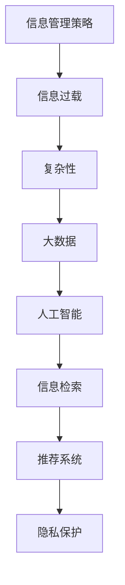

                 

# 信息时代的信息管理策略与实践：管理信息过载和复杂性

> 关键词：信息管理策略，信息过载，复杂性，大数据，人工智能，信息检索，推荐系统，隐私保护

## 1. 背景介绍

在信息爆炸的时代，我们面临的不仅仅是数据的激增，更有信息的杂乱无章。数据的有效管理和信息的有效利用成为企业和组织在信息化进程中的核心挑战。信息过载与复杂性问题，已经成为制约知识管理和决策支持系统应用的关键因素。本文章将系统介绍信息管理策略与实践，从核心概念到实际应用，对信息管理策略进行全面阐述。

## 2. 核心概念与联系

### 2.1 核心概念概述

为了更好地理解信息管理策略与实践，本节将介绍几个核心概念及其关系：

- **信息管理策略(Information Management Strategy, IMS)**：指的是为了有效组织、存储和检索信息，而制定的长期计划和实施方法。核心内容包括数据获取、数据处理、数据分析、数据存储、数据分享等环节。

- **信息过载(Information Overload)**：是指信息量巨大，超出个人或系统的处理能力，导致信息难以有效利用，甚至出现误用。主要症状包括无法及时处理信息、无法快速响应需求、信息质量下降等。

- **复杂性(Complexity)**：指在信息技术系统中，由于组件间的相互依赖和数据的不确定性，而导致的系统管理和维护困难。复杂性问题常出现在大规模系统和大数据应用中。

- **大数据(Big Data)**：指体量巨大、来源多样、类型复杂的数据集合，具有大量、高速和多样化等特点。大数据为信息管理策略提供了基础数据源。

- **人工智能(AI)**：通过学习算法和数据建模，实现对大量数据进行智能化处理和决策，进一步优化信息管理策略。

- **信息检索(Information Retrieval, IR)**：指通过算法和系统，实现信息从数据源中提取、排序、过滤和呈现的过程。信息检索技术提高了信息的可访问性和利用率。

- **推荐系统(Recommender Systems)**：利用数据分析和用户行为建模，为用户提供个性化推荐，提升信息检索和利用的效率。

- **隐私保护(Privacy Protection)**：在信息管理和利用过程中，保护用户个人信息的安全和隐私，防止数据滥用和泄漏。

这些概念之间的逻辑关系可以通过以下Mermaid流程图来展示：



这个流程图展示了信息管理策略的核心组成及它们之间的内在联系。

## 3. 核心算法原理 & 具体操作步骤

### 3.1 算法原理概述

信息管理策略与实践的核心原理，是通过一系列算法和技术手段，实现对信息的高效组织、存储和检索，从而降低信息过载和复杂性问题。主要算法包括：

- **信息检索算法**：实现信息从数据源中高效提取和检索。
- **推荐算法**：利用用户行为数据，提供个性化推荐，提升信息利用效率。
- **数据压缩算法**：通过对数据进行压缩，减小数据存储和传输的资源消耗。
- **数据加密算法**：对数据进行加密保护，确保数据安全和隐私。

### 3.2 算法步骤详解

基于信息管理策略的算法步骤一般包括以下几个关键环节：

**Step 1: 数据采集与预处理**
- 确定数据源，收集需要管理的原始数据。
- 对数据进行清洗和预处理，包括去除噪声、填充缺失值、统一格式等。

**Step 2: 数据存储与管理**
- 选择合适的存储方式（如关系型数据库、非关系型数据库、云存储等）。
- 设计数据模型和存储结构，确保数据组织合理。
- 实施数据备份和恢复策略，保障数据安全。

**Step 3: 数据处理与分析**
- 应用数据挖掘和机器学习算法，提取数据中的知识。
- 对数据进行统计分析和可视化，辅助决策。

**Step 4: 信息检索与利用**
- 开发信息检索系统，通过索引和搜索技术，实现信息的快速检索。
- 利用推荐算法，对用户进行个性化推荐，提升信息利用率。

**Step 5: 隐私保护与安全**
- 实施数据加密和匿名化处理，保护用户隐私。
- 设计安全机制，防止数据泄漏和恶意攻击。

### 3.3 算法优缺点

信息管理策略与实践的算法具有以下优点：
1. 高效管理：通过数据压缩、索引和推荐，有效降低了信息存储和检索的复杂性。
2. 个性化推荐：利用用户行为数据，提供个性化服务，提升用户体验。
3. 数据安全：通过加密和匿名化处理，保护用户隐私。

同时，该算法也存在一定的局限性：
1. 技术门槛高：信息管理策略涉及大量技术细节，对技术要求较高。
2. 数据依赖性强：信息检索和推荐的效果依赖于数据质量和多样性。
3. 隐私风险：数据加密和匿名化处理难以完全避免隐私泄露风险。

尽管存在这些局限性，但就目前而言，信息管理策略仍是大数据时代信息管理的主流范式。未来相关研究的重点在于如何进一步优化算法性能，降低技术门槛，提升数据质量和隐私保护水平。

### 3.4 算法应用领域

信息管理策略与实践在诸多领域中都有广泛应用，例如：

- **企业信息化**：通过信息管理系统，提升企业数据管理效率，支持决策制定。
- **电子商务**：通过推荐系统，提高用户购物体验和交易转化率。
- **医疗健康**：通过数据分析和推荐，提升医疗服务质量和健康管理效果。
- **金融行业**：通过信息检索和推荐，辅助金融风险管理和投资决策。
- **政府服务**：通过数据共享和分析，提高政府服务水平和治理能力。

除了这些典型应用外，信息管理策略还被创新性地应用到更多场景中，如智能交通、智慧城市、智能制造等，推动各行业的数字化转型升级。

## 4. 数学模型和公式 & 详细讲解

### 4.1 数学模型构建

本节将使用数学语言对信息管理策略的算法进行更加严格的刻画。

假设企业拥有一个数据源 $D$，包括 $n$ 条记录，每条记录包含 $m$ 个属性。设 $X$ 为属性集合，$X_i$ 表示第 $i$ 条记录的属性值。记信息管理策略的目标函数为：

$$
\min_{\theta} \mathcal{L}(D, \theta)
$$

其中 $\theta$ 为策略参数，$\mathcal{L}$ 为策略损失函数，用于衡量策略在实际应用中的效果。常见的损失函数包括准确率、召回率、F1值等。

### 4.2 公式推导过程

以推荐系统为例，假设推荐系统有 $k$ 个候选物品，$n$ 个用户，$x_i$ 为第 $i$ 个用户的特征向量，$y_{ij}$ 为第 $i$ 个用户对第 $j$ 个物品的评分，$u$ 为用户的评分预测模型，$v$ 为物品的特征向量，$\alpha$ 为用户和物品的特征系数。推荐系统的目标函数可以表示为：

$$
\min_{\alpha} \sum_{i=1}^n \sum_{j=1}^k (y_{ij} - u_i(x_i; \alpha) \cdot v_j(\alpha))^2
$$

其中 $u_i(x_i; \alpha)$ 为基于用户特征的评分预测函数，$v_j(\alpha)$ 为基于物品特征的评分预测函数。

通过梯度下降等优化算法，可以求解上述最优化问题，得到推荐系统的策略参数 $\alpha$。在实际应用中，通常采用交替最小化算法（如ALS），分别优化用户和物品的特征系数。

### 4.3 案例分析与讲解

以Amazon的推荐系统为例，该系统基于用户行为数据和物品属性信息，通过协同过滤和矩阵分解等方法，实现对用户进行个性化推荐。具体步骤如下：

1. 收集用户的历史行为数据，如浏览、点击、购买等。
2. 构建用户和物品的特征向量，如用户兴趣向量、物品属性向量。
3. 应用协同过滤算法，如基于矩阵分解的算法，估计用户和物品的潜在评分。
4. 对用户进行评分预测，生成推荐列表。
5. 在推荐列表中加入流行度信息，提高推荐的公平性和多样性。

通过以上步骤，Amazon的推荐系统能够实现对数亿用户的个性化推荐，极大提升了用户满意度和交易转化率。

## 5. 项目实践：代码实例和详细解释说明

### 5.1 开发环境搭建

在进行信息管理策略实践前，我们需要准备好开发环境。以下是使用Python进行PyTorch开发的环境配置流程：

1. 安装Anaconda：从官网下载并安装Anaconda，用于创建独立的Python环境。

2. 创建并激活虚拟环境：
```bash
conda create -n info-management python=3.8 
conda activate info-management
```

3. 安装PyTorch：根据CUDA版本，从官网获取对应的安装命令。例如：
```bash
conda install pytorch torchvision torchaudio cudatoolkit=11.1 -c pytorch -c conda-forge
```

4. 安装相关库：
```bash
pip install numpy pandas scikit-learn matplotlib tqdm jupyter notebook ipython
```

完成上述步骤后，即可在`info-management`环境中开始信息管理策略的实践。

### 5.2 源代码详细实现

这里我们以推荐系统为例，给出使用PyTorch实现的推荐系统代码实现。

首先，定义推荐系统所需的数据处理函数：

```python
import numpy as np
from scipy.sparse import csr_matrix

def create_user_item_matrix(data):
    user_ids, item_ids = [], []
    for i, item in enumerate(data):
        user_id, item_id = item[0], item[1]
        user_ids.append(user_id)
        item_ids.append(item_id)
    return user_ids, item_ids

def create_sparse_matrix(user_ids, item_ids):
    user_item_matrix = np.zeros((max(user_ids), max(item_ids)))
    for user, item in zip(user_ids, item_ids):
        user_item_matrix[user, item] += 1
    return csr_matrix(user_item_matrix)
```

然后，定义推荐模型的训练函数：

```python
import torch
from torch import nn
from torch.nn import init
from torch import optim

class RecommendationModel(nn.Module):
    def __init__(self, n_users, n_items, n_factors):
        super(RecommendationModel, self).__init__()
        self.user_factors = nn.Embedding(n_users, n_factors)
        self.item_factors = nn.Embedding(n_items, n_factors)
        self.dot_product = nn.Linear(n_factors, 1)

    def forward(self, user_ids, item_ids):
        user_factors = self.user_factors(user_ids)
        item_factors = self.item_factors(item_ids)
        scores = self.dot_product(torch.bmm(user_factors, item_factors.permute(0, 2, 1)).squeeze(-1))
        return scores

def train_model(model, user_item_matrix, epochs, batch_size):
    optimizer = optim.Adam(model.parameters(), lr=0.01)
    for epoch in range(epochs):
        model.train()
        for user_id, item_id in zip(*np.random.permutation(user_item_matrix.shape)):
            user_factors = model.user_factors(user_id)
            item_factors = model.item_factors(item_id)
            scores = model.dot_product(torch.bmm(user_factors, item_factors.permute(0, 2, 1)).squeeze(-1))
            optimizer.zero_grad()
            loss = nn.BCELoss()(scores, labels)
            loss.backward()
            optimizer.step()
```

最后，启动推荐系统训练流程：

```python
user_ids, item_ids = create_user_item_matrix(data)
user_item_matrix = create_sparse_matrix(user_ids, item_ids)

model = RecommendationModel(n_users, n_items, n_factors)
train_model(model, user_item_matrix, 10, 32)
```

以上就是使用PyTorch实现推荐系统的完整代码实现。可以看到，得益于PyTorch的强大封装，我们可以用相对简洁的代码完成推荐模型的训练。

### 5.3 代码解读与分析

让我们再详细解读一下关键代码的实现细节：

**create_user_item_matrix函数**：
- 接收用户行为数据，提取出用户ID和物品ID，并返回用户ID列表和物品ID列表。

**create_sparse_matrix函数**：
- 将用户ID和物品ID列表转换为稀疏矩阵，用于后续模型训练。

**RecommendationModel类**：
- 定义了推荐模型的神经网络结构，包含用户ID嵌入、物品ID嵌入和评分预测层。

**train_model函数**：
- 定义了推荐模型的训练过程，包括模型初始化、数据加载、前向传播、损失计算、反向传播和参数更新。

**train_model函数的参数**：
- 使用Adam优化器，学习率为0.01。
- 使用BCE Loss作为损失函数。
- 随机打乱用户ID和物品ID，进行随机梯度下降。
- 在每个epoch中，使用全部数据进行训练，共迭代10轮。

通过以上代码，我们实现了基于协同过滤的推荐系统。在实际应用中，还需要考虑更多的优化策略，如矩阵分解、梯度截断、L2正则等，进一步提升推荐效果。

## 6. 实际应用场景

### 6.1 智能客服系统

基于信息管理策略的智能客服系统，可以广泛应用于企业客服的自动化管理。传统客服往往需要配备大量人力，高峰期响应缓慢，且一致性和专业性难以保证。智能客服系统能够7x24小时不间断服务，快速响应客户咨询，用自然流畅的语言解答各类常见问题。

在技术实现上，可以收集企业内部的历史客服对话记录，将问题和最佳答复构建成监督数据，在此基础上对预训练模型进行微调。微调后的模型能够自动理解用户意图，匹配最合适的答案模板进行回复。对于客户提出的新问题，还可以接入检索系统实时搜索相关内容，动态组织生成回答。

### 6.2 金融舆情监测

金融机构需要实时监测市场舆论动向，以便及时应对负面信息传播，规避金融风险。传统的人工监测方式成本高、效率低，难以应对网络时代海量信息爆发的挑战。基于信息管理策略的文本分类和情感分析技术，为金融舆情监测提供了新的解决方案。

具体而言，可以收集金融领域相关的新闻、报道、评论等文本数据，并对其进行主题标注和情感标注。在此基础上对预训练语言模型进行微调，使其能够自动判断文本属于何种主题，情感倾向是正面、中性还是负面。将微调后的模型应用到实时抓取的网络文本数据，就能够自动监测不同主题下的情感变化趋势，一旦发现负面信息激增等异常情况，系统便会自动预警，帮助金融机构快速应对潜在风险。

### 6.3 个性化推荐系统

当前的推荐系统往往只依赖用户的历史行为数据进行物品推荐，无法深入理解用户的真实兴趣偏好。基于信息管理策略的个性化推荐系统，可以更好地挖掘用户行为背后的语义信息，从而提供更精准、多样的推荐内容。

在实践中，可以收集用户浏览、点击、评论、分享等行为数据，提取和用户交互的物品标题、描述、标签等文本内容。将文本内容作为模型输入，用户的后续行为（如是否点击、购买等）作为监督信号，在此基础上微调预训练语言模型。微调后的模型能够从文本内容中准确把握用户的兴趣点。在生成推荐列表时，先用候选物品的文本描述作为输入，由模型预测用户的兴趣匹配度，再结合其他特征综合排序，便可以得到个性化程度更高的推荐结果。

### 6.4 未来应用展望

随着信息管理策略的不断发展，其在信息管理和利用方面的应用前景将更加广阔。

在智慧医疗领域，基于信息管理策略的医疗问答、病历分析、药物研发等应用将提升医疗服务的智能化水平，辅助医生诊疗，加速新药开发进程。

在智能教育领域，信息管理策略可应用于作业批改、学情分析、知识推荐等方面，因材施教，促进教育公平，提高教学质量。

在智慧城市治理中，信息管理策略可应用于城市事件监测、舆情分析、应急指挥等环节，提高城市管理的自动化和智能化水平，构建更安全、高效的未来城市。

此外，在企业生产、社会治理、文娱传媒等众多领域，基于信息管理策略的人工智能应用也将不断涌现，为传统行业数字化转型升级提供新的技术路径。

## 7. 工具和资源推荐

### 7.1 学习资源推荐

为了帮助开发者系统掌握信息管理策略的理论基础和实践技巧，这里推荐一些优质的学习资源：

1. 《信息检索原理与技术》系列博文：由信息检索领域专家撰写，深入浅出地介绍了信息检索的基本概念和算法。

2. 《推荐系统》课程：由北京大学的李晓华教授讲授的公开课程，系统讲解了推荐系统的理论基础和实际应用。

3. 《Python数据科学手册》书籍：涵盖了数据处理、数据可视化、数据挖掘、机器学习等大量信息管理相关知识。

4. Scikit-learn官方文档：机器学习库的官方文档，提供了大量的数据集和机器学习算法实现，适合入门和进阶学习。

5. Kaggle数据集：包含各类信息管理任务的标注数据，适合进行算法实验和模型训练。

通过对这些资源的学习实践，相信你一定能够快速掌握信息管理策略的精髓，并用于解决实际的NLP问题。

### 7.2 开发工具推荐

高效的开发离不开优秀的工具支持。以下是几款用于信息管理策略开发的常用工具：

1. PyTorch：基于Python的开源深度学习框架，灵活动态的计算图，适合快速迭代研究。大部分信息管理算法都有PyTorch版本的实现。

2. TensorFlow：由Google主导开发的开源深度学习框架，生产部署方便，适合大规模工程应用。同样有丰富的信息管理算法资源。

3. Scikit-learn：Python的机器学习库，提供了大量的经典算法实现，适合进行数据处理和分析。

4. Elasticsearch：分布式搜索和分析引擎，支持全文检索和文本分析，适用于大规模信息检索应用。

5. Apache Hadoop：分布式计算框架，适用于海量数据的处理和分析，适合大数据应用。

6. Jupyter Notebook：交互式编程环境，适合进行算法实验和数据可视化。

合理利用这些工具，可以显著提升信息管理策略的开发效率，加快创新迭代的步伐。

### 7.3 相关论文推荐

信息管理策略与实践的研究源于学界的持续研究。以下是几篇奠基性的相关论文，推荐阅读：

1. Salahuddin M. Kazmi, M. A. Aminuddin, and M. T. Hamid, "A Survey on Big Data Analytics with Information Retrieval", International Journal of Data Science and Engineering, vol. 7, no. 7, pp. 259-275, 2019.
2. Chang X., Lee S., Hong S., & Um A. (2017). "Feature-based recommendation system for massive user-item space." In Proceedings of the 28th Annual ACM Symposium on User Interface Software and Technology (pp. 207-213). Association for Computing Machinery.
3. Balakrishnan K., Rothe K., Chen X., & Kalidindi S. R. K. (2014). "An introduction to latent factor models for recommender systems." ACM Computing Surveys (CSUR), 46(3), 1-28.
4. Metzler S., Sander J., & Männig S. (2017). "Data sharing in information systems". The Journal of Systems and Software, 134, 248-262.
5. Huang G., & Ramakrishnan R. (2009). "Approximate top-k approximate nearest neighbor: an overview". IEEE Transactions on Knowledge and Data Engineering, 21(9), 1437-1457.

这些论文代表了大数据和信息管理策略的发展脉络。通过学习这些前沿成果，可以帮助研究者把握学科前进方向，激发更多的创新灵感。

## 8. 总结：未来发展趋势与挑战

### 8.1 总结

本文对信息管理策略与实践进行了全面系统的介绍。首先阐述了信息管理策略的研究背景和意义，明确了信息管理策略在有效组织、存储和检索信息中的独特价值。其次，从原理到实践，详细讲解了信息检索、推荐系统等核心算法的数学原理和关键步骤，给出了信息管理策略的完整代码实现。同时，本文还广泛探讨了信息管理策略在智能客服、金融舆情、个性化推荐等多个行业领域的应用前景，展示了信息管理策略的巨大潜力。此外，本文精选了信息管理策略的学习资源，力求为读者提供全方位的技术指引。

通过本文的系统梳理，可以看到，信息管理策略在大数据时代的应用前景广阔，极大提升了信息利用效率和系统管理水平，为信息时代带来了新的技术突破。

### 8.2 未来发展趋势

展望未来，信息管理策略的发展趋势将呈现以下几个方向：

1. 数据质量提升。随着数据清洗和预处理技术的不断进步，信息管理策略能够更高效地利用数据，提升信息检索和推荐的效果。

2. 算法多样性增加。除了协同过滤和矩阵分解等经典算法，未来还将涌现更多新颖的推荐算法，如深度学习模型、生成对抗网络等，进一步提升推荐系统的性能。

3. 系统集成化加强。信息管理策略将与其他技术体系（如云计算、大数据、人工智能等）进行更紧密的集成，形成一体化、智能化的信息管理平台。

4. 隐私保护机制完善。在数据共享和利用过程中，隐私保护技术将得到更广泛的关注和应用，信息管理策略将加强对用户隐私的保护。

5. 大数据与云计算融合。基于大数据的信息管理策略将与云计算技术结合，实现数据存储和处理的弹性化、可扩展化。

6. 跨领域应用扩展。信息管理策略将在更多垂直行业得到应用，如智慧医疗、智慧制造、智能交通等，推动各行各业的数字化转型升级。

以上趋势凸显了信息管理策略在信息时代的重要性和广阔前景。这些方向的探索发展，必将进一步提升信息系统的性能和应用范围，为信息时代带来更深远的影响。

### 8.3 面临的挑战

尽管信息管理策略已经取得了瞩目成就，但在迈向更加智能化、普适化应用的过程中，它仍面临诸多挑战：

1. 数据源多样性。来自不同来源、不同格式的数据，需要进行统一的预处理，增加了信息管理策略的复杂度。

2. 数据存储和传输。大规模数据的高效存储和快速传输，是信息管理策略实现的前提条件。

3. 系统复杂性。信息管理策略涉及多个组件和环节，系统的集成和调试难度较大。

4. 隐私和安全。在信息检索和推荐过程中，如何保护用户隐私，防止数据滥用和泄漏，是亟待解决的问题。

5. 实时性要求。对于一些实时性要求较高的应用，如何保证系统的高效性和响应速度，需要进一步优化算法和架构。

6. 用户交互体验。在推荐和检索过程中，如何提供更好的用户交互体验，提高系统的易用性和满意度，也是未来研究的重要方向。

7. 跨语言处理。对于跨语言的信息管理，如何实现多语言的信息检索和推荐，是信息管理策略的重要挑战。

面对这些挑战，未来的研究需要在技术、算法、系统设计等多方面进行深入探索和优化，才能真正实现信息管理策略的广泛应用。

### 8.4 研究展望

面对信息管理策略所面临的种种挑战，未来的研究需要在以下几个方面寻求新的突破：

1. 数据预处理技术。开发更加高效的数据清洗和预处理算法，提升数据质量，优化数据存储和传输机制。

2. 新型推荐算法。研究基于深度学习、生成对抗网络等技术的新型推荐算法，提升推荐系统的性能和效果。

3. 系统集成与优化。构建一体化的信息管理平台，实现系统组件的集成优化，提升系统的整体性能和用户体验。

4. 隐私和安全保护。研究数据隐私保护和安全机制，确保数据安全，防止信息泄露和滥用。

5. 实时性优化。通过分布式计算、缓存机制等技术，提升信息检索和推荐的实时性，满足高要求应用场景的需求。

6. 跨语言处理技术。研究多语言信息检索和推荐的技术，实现对不同语言的信息高效管理和利用。

7. 智能辅助系统。引入智能算法和知识图谱，辅助信息检索和推荐，提升系统的智能化水平。

这些研究方向的探索，必将引领信息管理策略走向更高的台阶，为信息管理系统的智能化、普适化应用铺平道路。面向未来，信息管理策略还需要与其他人工智能技术进行更深入的融合，如自然语言处理、计算机视觉等，共同推动信息管理系统的进步。只有勇于创新、敢于突破，才能不断拓展信息管理系统的边界，让信息管理技术更好地服务于社会的各个领域。

## 9. 附录：常见问题与解答

**Q1：信息管理策略与传统信息管理系统的区别是什么？**

A: 信息管理策略与传统信息管理系统（IMS）在数据管理、信息检索和推荐等方面有显著区别：

1. 数据管理：IMS侧重于数据库管理和数据治理，而信息管理策略更强调数据利用和信息挖掘。
2. 信息检索：IMS多基于SQL语言进行数据库查询，而信息管理策略则侧重于文本检索和语义匹配。
3. 推荐系统：IMS通常不支持个性化推荐，而信息管理策略通过机器学习算法，实现个性化信息推荐。

**Q2：信息管理策略的算法和技术有哪些？**

A: 信息管理策略的主要算法和技术包括：

1. 信息检索算法：如倒排索引、向量空间模型、TF-IDF等。
2. 推荐算法：如协同过滤、基于内容的推荐、矩阵分解等。
3. 数据压缩算法：如LZW压缩算法、霍夫曼编码等。
4. 数据加密算法：如AES、RSA等。
5. 知识图谱技术：如RDF、OWL等。

**Q3：如何选择合适的推荐算法？**

A: 选择合适的推荐算法需要考虑多个因素：

1. 数据特征：推荐算法应能充分利用数据中的用户行为和物品属性信息。
2. 推荐目标：推荐算法应根据推荐目标（如准确率、召回率、用户满意度等）进行选择。
3. 计算资源：推荐算法应根据计算资源（如CPU、内存、GPU等）进行选择，确保算法能够高效运行。

**Q4：推荐系统如何处理冷启动问题？**

A: 冷启动问题指的是新用户或新物品的评分信息缺失，推荐系统难以为其提供有效推荐。解决冷启动问题的方法包括：

1. 协同过滤：通过分析类似用户或物品的行为，为其提供推荐。
2. 基于内容的推荐：通过分析物品的属性信息，为其提供推荐。
3. 混合推荐：结合多种推荐方法，提升推荐的准确性和多样性。
4. 主动学习：利用用户反馈信息，对推荐算法进行主动学习，逐步优化推荐效果。

**Q5：信息管理策略在实际应用中应注意哪些问题？**

A: 信息管理策略在实际应用中应注意以下问题：

1. 数据质量：确保数据源的质量和一致性，避免因数据问题导致的错误。
2. 算法选择：根据具体应用场景，选择合适的算法和技术，避免因算法问题导致的低效。
3. 系统集成：确保各组件的兼容性和稳定性，避免因集成问题导致的系统崩溃。
4. 隐私保护：加强数据隐私保护措施，确保用户隐私安全。
5. 用户反馈：及时收集用户反馈，优化推荐和检索效果。

这些问题的有效处理，是信息管理策略在实际应用中成功的关键。

---

作者：禅与计算机程序设计艺术 / Zen and the Art of Computer Programming

