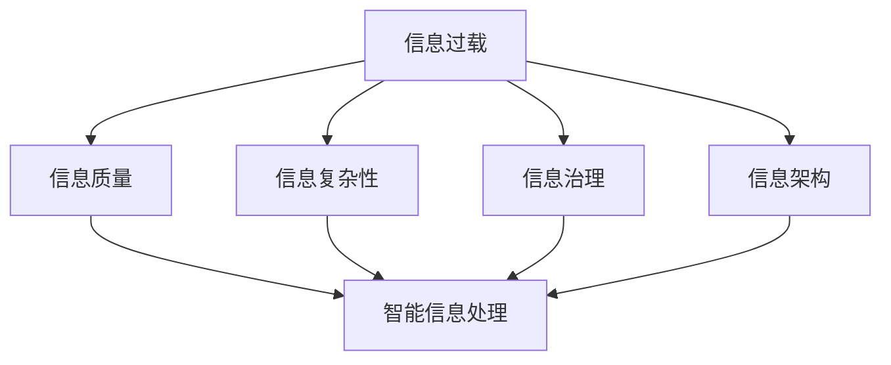

                 

# 信息时代的信息管理策略与实践：管理信息过载和复杂性

## 1. 背景介绍

### 1.1 问题由来
信息时代，伴随着互联网和移动互联网的普及，我们已处于一个信息爆炸的时代。全球数据以指数级增长，每个人每秒都在产生、接收、处理大量的信息。这种信息过载不仅使人们难以高效工作，还严重影响了我们的认知和决策。与此同时，随着技术的进步和应用的扩展，信息系统的复杂性也日益增加，这进一步加剧了信息管理与处理的难度。

在这样的背景下，管理信息过载和复杂性，提升信息系统的效能和稳定性，成为了信息时代亟待解决的重要问题。本文将深入探讨如何通过有效的信息管理策略和实践，在信息爆炸和复杂性的双重挑战下，构建稳定、高效、智能的信息系统。

### 1.2 问题核心关键点
信息过载和复杂性的核心问题在于：

1. **信息量爆炸性增长**：随着互联网的普及，全球信息量以爆炸性速度增长，给个人和组织带来了前所未有的信息处理压力。
2. **信息质量参差不齐**：互联网和社交媒体上的信息质量参差不齐，良莠不齐，使得有效信息难以区分，增加了信息处理的复杂性。
3. **系统复杂性增加**：技术的不断进步和应用的扩展，使得信息系统的结构和功能越来越复杂，管理和维护难度不断增加。
4. **信息处理效率低下**：现有的信息管理方法难以应对海量信息，信息处理效率低下，导致决策延迟和工作效率下降。
5. **信息安全和隐私问题**：信息过载和复杂性还带来了信息安全和隐私保护方面的新挑战，如数据泄露、隐私侵犯等。

解决这些问题，不仅需要先进的技术手段，更需要创新的信息管理策略和实践。本文将通过深入分析信息管理的关键要素，探讨如何通过数据治理、信息架构、智能处理等策略，应对信息过载和复杂性，提升信息系统的效能和稳定性。

## 2. 核心概念与联系

### 2.1 核心概念概述

为了更好地理解信息管理策略，本节将介绍几个密切相关的核心概念：

- **信息过载**：指信息量远超过个人或系统处理能力的现象，导致有效信息难以获取，决策效率下降。
- **信息质量**：指信息的准确性、完整性、一致性、及时性和相关性等质量属性，直接影响信息系统的效能。
- **信息复杂性**：指信息系统结构和功能的复杂程度，包括数据结构复杂、业务流程复杂、技术架构复杂等。
- **信息治理**：通过制定规范、标准和流程，对信息进行有效的规划、收集、存储、管理和利用。
- **信息架构**：指信息系统的组织结构和信息模型的设计，包括数据模型、元数据、信息分类和组织方式。
- **智能信息处理**：利用人工智能技术，对信息进行自动化处理和智能分析，提升信息处理效率和质量。

这些核心概念之间的逻辑关系可以通过以下Mermaid流程图来展示：



这个流程图展示了一个典型的信息管理生态系统，包括信息过载、信息质量、信息复杂性、信息治理、信息架构和智能信息处理等关键要素。它们相互影响，共同构成了一个完整的信息管理系统。

## 3. 核心算法原理 & 具体操作步骤

### 3.1 算法原理概述

信息管理的目标是通过有效的策略和技术手段，提升信息系统的效能和稳定性。核心算法原理主要围绕以下几个方面展开：

1. **信息治理**：通过制定规范、标准和流程，对信息进行有效的规划、收集、存储、管理和利用。
2. **信息架构**：设计信息系统的组织结构和信息模型的设计，包括数据模型、元数据、信息分类和组织方式。
3. **智能信息处理**：利用人工智能技术，对信息进行自动化处理和智能分析，提升信息处理效率和质量。

### 3.2 算法步骤详解

基于上述原理，信息管理的具体操作步骤如下：

**Step 1: 信息需求分析**

首先，进行全面的信息需求分析，明确信息系统需要处理的信息类型、数量和质量要求。信息需求分析应包括对业务流程的深入理解，以及对信息系统的未来扩展和升级的需求预测。

**Step 2: 信息治理策略制定**

制定信息治理策略，明确信息的收集、存储、管理和利用规范。信息治理策略应包括数据质量管理、元数据管理、数据安全管理、数据生命周期管理等内容。

**Step 3: 信息架构设计**

设计信息架构，包括数据模型、元数据、信息分类和组织方式。信息架构应符合数据治理策略的要求，支持业务流程和数据分析的需要。

**Step 4: 智能信息处理技术选型**

根据信息处理需求，选择合适的智能信息处理技术，如自然语言处理、机器学习、数据挖掘等。

**Step 5: 数据质量管理**

实施数据质量管理措施，包括数据清洗、数据校验、数据归档和数据迁移等，确保数据的质量和完整性。

**Step 6: 信息安全保障**

设计信息安全保障措施，包括访问控制、数据加密、安全审计和应急响应等，确保数据的安全性和隐私性。

**Step 7: 信息系统集成**

将信息治理、信息架构和智能信息处理技术进行集成，构建完整的信息管理系统。

**Step 8: 系统测试与部署**

对构建的信息管理系统进行全面测试，验证系统功能和性能，确保系统的稳定性和可靠性。

**Step 9: 系统监控与维护**

对运行中的信息管理系统进行实时监控和维护，及时发现和解决系统问题和异常。

### 3.3 算法优缺点

信息管理的算法具有以下优点：

1. **系统化管理**：通过信息治理和信息架构的设计，实现对信息的系统化管理，提升信息处理效率和质量。
2. **智能化处理**：利用智能信息处理技术，实现对信息的自动化处理和智能分析，提升信息处理的效率和准确性。
3. **数据质量保障**：通过数据质量管理措施，确保数据的质量和完整性，提升信息系统的可信度。
4. **信息安全保障**：通过信息安全保障措施，确保数据的安全性和隐私性，防止数据泄露和滥用。

同时，该算法也存在一定的局限性：

1. **高成本**：信息治理和信息架构设计需要投入大量人力和资源，初期成本较高。
2. **复杂度增加**：信息架构的复杂性可能会增加系统的管理和维护难度。
3. **技术依赖**：信息管理高度依赖于智能信息处理技术，技术升级和维护成本较高。
4. **风险管理**：信息治理和安全保障措施需要持续监控和管理，风险管理难度较大。

尽管存在这些局限性，但就目前而言，信息治理和智能信息处理仍是信息管理的主流范式。未来相关研究的重点在于如何进一步降低信息治理和信息架构设计的成本，提高系统的智能化和自适应能力，同时兼顾数据安全和隐私保护等因素。

### 3.4 算法应用领域

信息管理方法在多个领域得到广泛应用，例如：

1. **企业信息化**：帮助企业构建稳定、高效、智能的信息管理系统，提升业务运营效率和决策支持能力。
2. **政府信息化**：帮助政府构建公共信息服务平台，提升政务服务质量和透明度，实现数字化治理。
3. **医疗信息化**：通过信息管理提升医院的管理效率和医疗质量，实现电子病历、医疗影像等数据的高效处理和分析。
4. **金融信息化**：通过信息管理提升金融机构的运营效率和风险管理能力，实现精准的客户服务和风险预测。
5. **智慧城市**：构建智能城市信息基础设施，实现城市运行管理和公共服务的智能化。
6. **电子商务**：通过信息管理提升电商平台的用户体验和运营效率，实现精准的营销和客户管理。

除了上述这些典型应用外，信息管理方法还在工业互联网、智能制造、智慧农业等多个领域得到创新性的应用，为各行业的数字化转型提供了强大的技术支撑。

## 4. 数学模型和公式 & 详细讲解 & 举例说明

### 4.1 数学模型构建

信息管理的数学模型主要围绕数据治理、信息架构和智能信息处理展开。以下是几个关键的数学模型：

1. **数据质量模型**：定义数据的准确性、完整性、一致性、及时性和相关性等质量属性，用于评估和提升数据质量。
2. **信息架构模型**：设计信息系统的组织结构和信息模型的设计，包括数据模型、元数据、信息分类和组织方式。
3. **智能信息处理模型**：利用人工智能技术，对信息进行自动化处理和智能分析，提升信息处理效率和质量。

### 4.2 公式推导过程

以下我们以数据质量模型为例，推导其核心公式。

假设数据集为 $D=\{x_1, x_2, ..., x_n\}$，其中 $x_i$ 为第 $i$ 条数据。设 $Q_i$ 为数据 $x_i$ 的质量得分，$W_i$ 为数据 $x_i$ 的权重，$Q$ 为数据集 $D$ 的平均质量得分。则数据质量模型可以表示为：

$$
Q = \frac{1}{\sum_{i=1}^n W_i} \sum_{i=1}^n W_i Q_i
$$

其中 $W_i$ 表示数据 $x_i$ 的权重，可以通过数据的重要性、敏感性等因素进行评估。

### 4.3 案例分析与讲解

以企业信息化为例，分析如何通过信息管理提升企业的运营效率和决策支持能力。

**案例背景**：一家制造型企业，拥有庞大的生产线、仓储系统和销售网络。企业每天产生大量的生产数据、采购数据和销售数据，但由于信息管理混乱，导致数据质量不高，信息处理效率低下，影响企业的决策和运营效率。

**解决方案**：

1. **信息需求分析**：通过全面分析企业的业务流程，明确了生产、采购和销售等环节的信息需求，制定了详细的信息治理策略。
2. **数据质量管理**：实施数据清洗和校验措施，确保数据的准确性和完整性。同时引入数据质量监控系统，实时监测数据质量，及时发现和解决数据问题。
3. **信息架构设计**：设计了统一的数据模型和元数据标准，将生产、采购和销售等数据整合到统一的信息架构中，实现了数据的集中管理和共享。
4. **智能信息处理**：利用自然语言处理技术，实现了生产、采购和销售等环节的自动化处理和智能分析，提升了信息处理效率和质量。
5. **信息安全保障**：设计了访问控制和数据加密措施，确保数据的安全性和隐私性。

通过实施上述信息管理策略，企业实现了信息的高效管理和智能处理，提升了运营效率和决策支持能力。

## 5. 项目实践：代码实例和详细解释说明

### 5.1 开发环境搭建

在进行信息管理系统的开发实践前，我们需要准备好开发环境。以下是使用Python进行开发的环境配置流程：

1. 安装Anaconda：从官网下载并安装Anaconda，用于创建独立的Python环境。

2. 创建并激活虚拟环境：
```bash
conda create -n infosys-env python=3.8 
conda activate infosys-env
```

3. 安装PyTorch：根据CUDA版本，从官网获取对应的安装命令。例如：
```bash
conda install pytorch torchvision torchaudio cudatoolkit=11.1 -c pytorch -c conda-forge
```

4. 安装Pandas：
```bash
pip install pandas
```

5. 安装Matplotlib和Seaborn：
```bash
pip install matplotlib seaborn
```

6. 安装Flask：用于构建信息管理系统的前端界面。
```bash
pip install flask
```

7. 安装Flask-SQLAlchemy：用于管理数据库。
```bash
pip install flask-sqlalchemy
```

完成上述步骤后，即可在`infosys-env`环境中开始信息管理系统的开发实践。

### 5.2 源代码详细实现

下面我们以构建一个简化的信息管理系统为例，给出使用Flask框架进行开发的PyTorch代码实现。

首先，定义数据质量和信息架构的模型：

```python
from transformers import BertTokenizer, BertForTokenClassification
from transformers import AutoTokenizer, AutoModelForSequenceClassification
from transformers import AutoConfig

class DataQualityModel:
    def __init__(self, model_name, device):
        self.tokenizer = BertTokenizer.from_pretrained(model_name)
        self.model = BertForTokenClassification.from_pretrained(model_name)
        self.device = device
        
    def get_quality_score(self, text):
        encoded_input = self.tokenizer(text, return_tensors='pt', padding=True, truncation=True, max_length=512)
        input_ids = encoded_input['input_ids']
        attention_mask = encoded_input['attention_mask']
        
        model = self.model.to(self.device)
        model.eval()
        
        with torch.no_grad():
            outputs = model(input_ids, attention_mask=attention_mask)
            quality_score = outputs.logits.argmax(dim=2).to('cpu').tolist()[0][0]
        
        return quality_score

class InformationArchitectureModel:
    def __init__(self, model_name, device):
        self.tokenizer = AutoTokenizer.from_pretrained(model_name)
        self.model = AutoModelForSequenceClassification.from_pretrained(model_name, num_labels=1)
        self.device = device
        
    def get_info_architecture_score(self, text):
        encoded_input = self.tokenizer(text, return_tensors='pt', padding=True, truncation=True, max_length=512)
        input_ids = encoded_input['input_ids']
        attention_mask = encoded_input['attention_mask']
        
        model = self.model.to(self.device)
        model.eval()
        
        with torch.no_grad():
            outputs = model(input_ids, attention_mask=attention_mask)
            info_architecture_score = outputs.logits.argmax(dim=2).to('cpu').tolist()[0][0]
        
        return info_architecture_score
```

然后，定义信息管理系统的核心功能：

```python
from flask import Flask, request, jsonify

app = Flask(__name__)

@app.route('/get_quality_score', methods=['POST'])
def get_quality_score():
    data = request.json
    text = data['text']
    quality_model = DataQualityModel('bert-base-cased', 'cuda')
    quality_score = quality_model.get_quality_score(text)
    return jsonify({'quality_score': quality_score})

@app.route('/get_info_architecture_score', methods=['POST'])
def get_info_architecture_score():
    data = request.json
    text = data['text']
    architecture_model = InformationArchitectureModel('bert-base-cased', 'cuda')
    architecture_score = architecture_model.get_info_architecture_score(text)
    return jsonify({'info_architecture_score': architecture_score})

if __name__ == '__main__':
    app.run(debug=True)
```

最后，启动信息管理系统：

```bash
flask run --host=0.0.0.0
```

在上述代码中，我们通过使用Bert模型进行文本分类，实现了数据质量和信息架构的评估。将输入文本作为模型输入，获取质量得分和信息架构得分。通过Flask框架，我们构建了信息管理系统的前端界面，支持用户提交文本，获取评估得分。

### 5.3 代码解读与分析

让我们再详细解读一下关键代码的实现细节：

**DataQualityModel类**：
- `__init__`方法：初始化BERT模型，并进行模型的加载和设备设置。
- `get_quality_score`方法：对输入文本进行BERT分类，获取质量得分。

**InformationArchitectureModel类**：
- `__init__`方法：初始化BERT模型，并进行模型的加载和设备设置。
- `get_info_architecture_score`方法：对输入文本进行BERT分类，获取信息架构得分。

**Flask框架**：
- 通过`@app.route`装饰器定义API接口，实现对信息管理系统的功能封装。
- 使用`request.json`获取前端提交的数据，并进行相应的处理。
- 使用`jsonify`函数将处理结果转换为JSON格式，返回给前端。

**启动信息管理系统**：
- 使用`flask run`命令启动信息管理系统，设置监听地址为0.0.0.0，以便外部访问。

通过上述代码实现，我们构建了一个简单的信息管理系统，实现了对文本数据的评估和分析。在实际应用中，可以进一步扩展系统功能，如数据可视化、报表生成、用户权限管理等，提升信息管理的智能化和用户体验。

## 6. 实际应用场景

### 6.1 智能客服系统

智能客服系统是信息管理在客户服务领域的重要应用。通过构建智能客服系统，企业能够实现24/7的客户服务，提升客户满意度和运营效率。

在实践中，可以收集企业的历史客服对话记录，利用信息管理方法对对话数据进行清洗、分类和分析，构建智能客服模型。微调后的模型能够自动理解用户意图，匹配最合适的答案模板进行回复。对于客户提出的新问题，还可以接入检索系统实时搜索相关内容，动态组织生成回答。如此构建的智能客服系统，能大幅提升客户咨询体验和问题解决效率。

### 6.2 金融舆情监测

金融机构需要实时监测市场舆论动向，以便及时应对负面信息传播，规避金融风险。传统的人工监测方式成本高、效率低，难以应对网络时代海量信息爆发的挑战。利用信息管理方法，构建基于自然语言处理和情感分析的金融舆情监测系统，可以实时监控金融市场舆情，自动识别负面信息并及时预警，帮助金融机构快速应对潜在风险。

### 6.3 个性化推荐系统

当前的推荐系统往往只依赖用户的历史行为数据进行物品推荐，难以深入理解用户的真实兴趣偏好。利用信息管理方法，构建基于用户行为和语义信息的个性化推荐系统，可以更好地挖掘用户行为背后的语义信息，从而提供更精准、多样的推荐内容。

在实践中，可以收集用户浏览、点击、评论、分享等行为数据，提取和用户交互的物品标题、描述、标签等文本内容。将文本内容作为模型输入，用户的后续行为（如是否点击、购买等）作为监督信号，在此基础上微调预训练语言模型。微调后的模型能够从文本内容中准确把握用户的兴趣点。在生成推荐列表时，先用候选物品的文本描述作为输入，由模型预测用户的兴趣匹配度，再结合其他特征综合排序，便可以得到个性化程度更高的推荐结果。

### 6.4 未来应用展望

随着信息管理方法的不断发展，未来将在更多领域得到应用，为传统行业带来变革性影响。

在智慧医疗领域，基于信息管理技术的医疗问答、病历分析、药物研发等应用将提升医疗服务的智能化水平，辅助医生诊疗，加速新药开发进程。

在智能教育领域，信息管理方法可应用于作业批改、学情分析、知识推荐等方面，因材施教，促进教育公平，提高教学质量。

在智慧城市治理中，信息管理技术可应用于城市事件监测、舆情分析、应急指挥等环节，提高城市管理的自动化和智能化水平，构建更安全、高效的未来城市。

此外，在企业生产、社会治理、文娱传媒等众多领域，信息管理技术也将不断涌现，为NLP技术带来全新的突破。相信随着预训练语言模型和微调方法的不断进步，信息管理技术必将在构建人机协同的智能时代中扮演越来越重要的角色。

## 7. 工具和资源推荐

### 7.1 学习资源推荐

为了帮助开发者系统掌握信息管理策略的理论基础和实践技巧，这里推荐一些优质的学习资源：

1. 《数据治理：数据管理与治理的理论与实践》系列书籍：深入浅出地介绍了数据治理的理论基础和实践方法，是信息管理的经典教材。
2. 《信息架构：企业与组织信息设计》系列书籍：介绍了信息架构的原理、方法和实践案例，帮助构建高效的信息系统。
3. 《Python数据科学手册》系列书籍：介绍了Python在数据管理、数据处理和数据可视化等方面的应用，是数据管理的实用工具书。
4. 《机器学习实战》系列书籍：介绍了机器学习在数据处理和智能分析中的应用，提供了大量的代码实例和实践案例。
5. 《信息安全基础》系列课程：介绍了信息安全的原理、方法和实践案例，帮助构建安全的信息系统。
6. 《智慧城市建设与应用》系列课程：介绍了智慧城市的原理、方法和实践案例，帮助构建智慧城市的信息基础设施。

通过对这些资源的学习实践，相信你一定能够快速掌握信息管理的精髓，并用于解决实际的业务问题。

### 7.2 开发工具推荐

高效的开发离不开优秀的工具支持。以下是几款用于信息管理开发的常用工具：

1. Python：Python语言具有丰富的库和框架，适合进行数据管理、数据分析和智能处理等任务。
2. PyTorch：基于Python的开源深度学习框架，适合进行自然语言处理和智能分析等任务。
3. Flask：基于Python的Web框架，适合构建信息管理系统的前端界面。
4. SQLAlchemy：基于Python的ORM框架，适合管理关系型数据库。
5. Elasticsearch：分布式搜索和分析引擎，适合处理大规模文本数据。
6. Apache Spark：大数据处理引擎，适合进行大规模数据处理和分析。
7. Hadoop：大数据分布式计算平台，适合处理海量数据。

合理利用这些工具，可以显著提升信息管理的开发效率，加快创新迭代的步伐。

### 7.3 相关论文推荐

信息管理方法的发展源于学界的持续研究。以下是几篇奠基性的相关论文，推荐阅读：

1. 《数据治理：概念、技术和方法论》：详细介绍了数据治理的理论基础和实践方法，为信息管理提供了理论支撑。
2. 《信息架构设计：理论、方法和案例》：介绍了信息架构的设计原则和实践方法，帮助构建高效的信息系统。
3. 《自然语言处理中的深度学习》：介绍了深度学习在自然语言处理中的应用，展示了信息管理的最新进展。
4. 《智能推荐系统：方法与实现》：介绍了推荐系统的理论和实践，展示了信息管理的潜在应用。
5. 《信息安全：概念、技术和实践》：介绍了信息安全的理论基础和实践方法，为信息管理的安全保障提供了指导。

这些论文代表了大信息管理方法的发展脉络。通过学习这些前沿成果，可以帮助研究者把握学科前进方向，激发更多的创新灵感。

## 8. 总结：未来发展趋势与挑战

### 8.1 总结

本文对信息管理策略进行了全面系统的介绍。首先阐述了信息过载和复杂性的研究背景和意义，明确了信息治理和智能信息处理在信息时代的重要作用。其次，从原理到实践，详细讲解了信息管理的核心算法和操作步骤，给出了信息管理系统的代码实现。同时，本文还广泛探讨了信息管理方法在智能客服、金融舆情、个性化推荐等多个领域的应用前景，展示了信息管理方法的广阔应用场景。

通过本文的系统梳理，可以看到，信息管理策略在信息时代具有重要的实践价值，能够帮助企业提升运营效率和决策支持能力，构建高效、智能的信息系统。未来，伴随信息治理和智能信息处理技术的不断发展，信息管理必将在更多行业领域发挥更大的作用。

### 8.2 未来发展趋势

展望未来，信息管理技术将呈现以下几个发展趋势：

1. **数据治理自动化**：通过自动化工具和智能算法，实现数据质量的自动监测和治理，提升数据管理效率。
2. **智能信息架构**：利用人工智能技术，实现信息架构的自动化设计和优化，提升信息管理的智能化水平。
3. **数据与业务深度融合**：通过数据驱动的决策支持系统，实现数据与业务的深度融合，提升业务运营效率。
4. **多模态信息管理**：融合视觉、语音、文本等多模态信息，提升信息处理的全面性和准确性。
5. **数据安全与隐私保护**：通过隐私计算、联邦学习等技术，提升数据安全性和隐私保护水平，确保数据安全。
6. **智能分析与决策支持**：利用机器学习和自然语言处理技术，实现信息的智能分析和决策支持，提升决策质量。

以上趋势凸显了信息管理技术的广阔前景。这些方向的探索发展，必将进一步提升信息系统的效能和稳定性，为各行业的数字化转型提供强大的技术支撑。

### 8.3 面临的挑战

尽管信息管理技术已经取得了一定的成就，但在迈向更加智能化、普适化应用的过程中，仍面临诸多挑战：

1. **数据质量问题**：数据质量是信息管理的核心，但数据质量管理需要投入大量人力和资源，初期成本较高。
2. **技术复杂性**：信息管理涉及数据治理、信息架构和智能信息处理等多个技术领域，技术复杂性高。
3. **数据安全问题**：信息管理需要处理大量的敏感数据，数据安全问题不容忽视。
4. **数据共享与协作**：跨部门、跨组织的数据共享与协作，是信息管理中的重要挑战。
5. **人才短缺问题**：信息管理涉及多学科知识，需要复合型人才，但目前相关人才短缺。

尽管存在这些挑战，但信息管理技术在各行业的应用前景广阔，未来需要各方共同努力，攻克技术难题，实现信息管理的全面应用。

### 8.4 研究展望

面向未来，信息管理技术需要在以下几个方面寻求新的突破：

1. **自动化数据治理**：开发更加智能化的数据治理工具，实现数据质量管理的自动化。
2. **智能信息架构设计**：利用人工智能技术，实现信息架构设计的自动化和优化。
3. **跨模态信息融合**：研究多模态信息的融合和协同建模，提升信息处理的全面性和准确性。
4. **隐私计算与联邦学习**：研究隐私计算和联邦学习技术，实现数据安全与共享的平衡。
5. **智能分析与决策支持**：研究智能分析与决策支持方法，提升信息处理的智能化水平。

这些研究方向的探索，必将引领信息管理技术迈向更高的台阶，为各行业的数字化转型提供强大的技术支撑。相信随着技术的发展，信息管理必将成为信息时代的重要支撑，为各行业的数字化转型提供坚实的基础。

## 9. 附录：常见问题与解答

**Q1：什么是信息管理？**

A: 信息管理是指对信息进行规划、收集、存储、管理和利用的过程，包括信息需求分析、信息治理、信息架构设计、智能信息处理等多个环节。

**Q2：信息管理有哪些关键要素？**

A: 信息管理的关键要素包括数据质量、信息架构、智能信息处理等，这些要素相互影响，共同构成了一个完整的信息管理系统。

**Q3：如何进行数据质量管理？**

A: 数据质量管理主要通过数据清洗、数据校验、数据归档和数据迁移等措施，确保数据的质量和完整性。

**Q4：如何构建信息架构？**

A: 信息架构设计主要通过数据模型、元数据、信息分类和组织方式的设计，实现信息的高效管理和共享。

**Q5：智能信息处理如何实现？**

A: 智能信息处理主要利用自然语言处理、机器学习、数据挖掘等人工智能技术，实现信息的自动化处理和智能分析。

通过以上分析和讲解，相信你对信息管理策略有了更深刻的理解。掌握信息管理策略，能够帮助企业在信息时代构建高效、智能的信息系统，提升运营效率和决策支持能力，实现数字化转型。相信未来信息管理技术将会得到更广泛的应用，为各行业带来更多的变革和突破。

