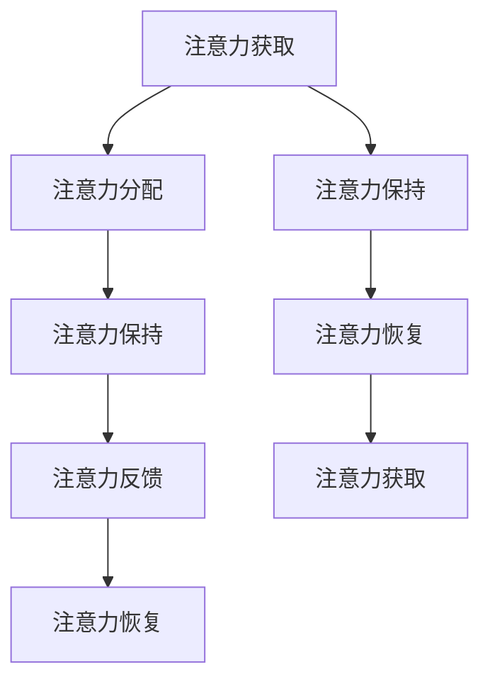

                 

# 信息时代的注意力管理技术与策略：在干扰和信息过载中保持专注

## 1. 背景介绍

### 1.1 问题由来
随着互联网和智能设备的普及，信息时代已深度渗透到人们生活的方方面面。每天，人们被海量信息包围，从新闻推送、社交媒体到在线视频，每一处都能捕捉到用户的注意力。然而，这种信息过载常常导致注意力分散、决策疲劳，降低工作效率和信息处理能力。

面对这一挑战，注意力管理技术与策略应运而生，旨在帮助人们在干扰和信息过载的环境中，保持高效专注，提升信息处理效率和生活质量。注意力管理技术在企业管理、个人时间管理、教育等多个领域具有广泛的应用前景。

### 1.2 问题核心关键点
注意力管理技术与策略的核心在于如何高效分配和管理用户的注意力，使其能够集中于重要事项，避免被无关信息干扰。这一过程涉及多个环节，包括但不限于：

1. **注意力获取**：通过优化信息展示方式，吸引用户注意力。
2. **注意力分配**：动态调整任务优先级，确保重要事项优先处理。
3. **注意力保持**：采用心理策略，增强用户对任务的专注力。
4. **注意力反馈**：通过实时反馈机制，帮助用户及时调整注意力分配策略。
5. **注意力恢复**：提供适当的休息和恢复机制，避免注意力耗竭。

这些环节相互关联，共同构成了一个完整的注意力管理框架，使得用户能够在复杂多变的信息环境中保持专注。

## 2. 核心概念与联系

### 2.1 核心概念概述

为了更好地理解注意力管理技术与策略，本节将介绍几个关键概念：

- **注意力分配（Attention Allocation）**：动态调整任务优先级，确保重要事项优先处理。
- **注意力保持（Attention Retention）**：采用心理策略，增强用户对任务的专注力。
- **注意力恢复（Attention Recovery）**：提供适当的休息和恢复机制，避免注意力耗竭。
- **注意力获取（Attention Acquisition）**：通过优化信息展示方式，吸引用户注意力。
- **注意力反馈（Attention Feedback）**：通过实时反馈机制，帮助用户及时调整注意力分配策略。

这些概念之间的逻辑关系可以通过以下Mermaid流程图来展示：



这个流程图展示了一系列注意力管理的核心环节及其之间的联系：

1. 注意力获取吸引用户，为其后续管理打下基础。
2. 注意力分配确保重要事项优先处理。
3. 注意力保持增强用户对任务的专注力。
4. 注意力反馈帮助用户及时调整策略。
5. 注意力恢复避免注意力耗竭，为下一轮管理做好准备。

这些环节共同构成了完整的注意力管理循环，使得用户能够在干扰和信息过载的环境中保持高效专注。

## 3. 核心算法原理 & 具体操作步骤
### 3.1 算法原理概述

注意力管理技术与策略的核心在于动态调整任务优先级，合理分配用户注意力，使其能够在干扰和信息过载的环境中保持高效专注。这一过程涉及多个环节，包括但不限于：

- **注意力获取（Attention Acquisition）**：通过优化信息展示方式，吸引用户注意力。
- **注意力分配（Attention Allocation）**：动态调整任务优先级，确保重要事项优先处理。
- **注意力保持（Attention Retention）**：采用心理策略，增强用户对任务的专注力。
- **注意力反馈（Attention Feedback）**：通过实时反馈机制，帮助用户及时调整注意力分配策略。
- **注意力恢复（Attention Recovery）**：提供适当的休息和恢复机制，避免注意力耗竭。

这些环节相互关联，共同构成了一个完整的注意力管理框架，使得用户能够在复杂多变的信息环境中保持专注。

### 3.2 算法步骤详解

**Step 1: 注意力获取**
- 设计有吸引力的界面元素和交互方式，引导用户注意重要信息。
- 利用视觉设计原则，如颜色、大小、对比等，突出关键信息。
- 使用交互设计技巧，如悬停提示、交互动画等，吸引用户点击或交互。

**Step 2: 注意力分配**
- 根据任务优先级，设计动态调整策略。
- 使用优先级队列、任务调度算法等，确保重要任务优先处理。
- 结合用户习惯和历史数据，智能调整任务优先级。

**Step 3: 注意力保持**
- 采用心理策略，如番茄工作法、时间块等，帮助用户集中注意力。
- 利用行为经济学理论，设计奖励机制，增强用户对任务的持续关注。
- 应用注意力分散管理技巧，如专注模式、任务切换等，避免注意力流失。

**Step 4: 注意力反馈**
- 实时监控用户注意力分配和任务完成情况。
- 通过可视化工具，如仪表盘、进度条等，及时反馈任务进度和效果。
- 使用智能提醒功能，如定时提醒、异常警告等，帮助用户及时调整策略。

**Step 5: 注意力恢复**
- 设计合理的休息和恢复机制，如短暂休息、深呼吸等，帮助用户恢复注意力。
- 提供心理放松技巧，如冥想、音乐等，缓解用户压力。
- 利用生物钟理论，合理规划工作和生活节奏，避免过度疲劳。

### 3.3 算法优缺点

注意力管理技术与策略在提升用户专注力和效率方面具有以下优点：
1. **提高工作效率**：通过合理分配和管理注意力，用户能够高效处理重要事项，提高工作质量和效率。
2. **减少决策疲劳**：动态调整任务优先级，减少决策负担，降低决策疲劳感。
3. **提升信息处理能力**：优化信息展示和交互方式，提升用户对信息的理解和处理能力。

同时，该方法也存在一定的局限性：
1. **复杂度高**：设计合理的注意力管理策略需要综合考虑多方面因素，技术实现较为复杂。
2. **用户依从性问题**：用户是否愿意接受和遵循注意力管理策略，直接影响效果。
3. **数据隐私风险**：收集和分析用户注意力数据，可能带来隐私和安全风险。
4. **适应性问题**：不同用户的工作习惯和环境差异较大，统一策略可能不适用。

尽管存在这些局限性，但就目前而言，注意力管理技术与策略仍然是提升用户专注力和工作效率的有效手段。未来相关研究的重点在于如何进一步简化策略设计，提升用户依从性，同时兼顾数据隐私和适应性等因素。

### 3.4 算法应用领域

注意力管理技术与策略在多个领域具有广泛的应用，以下是几个典型应用场景：

- **企业管理**：通过优化会议安排、任务管理等环节，提升团队协作效率，减少资源浪费。
- **教育**：设计科学的课程安排和作业调度，帮助学生合理安排学习时间，提升学习效果。
- **个人时间管理**：提供定制化的时间管理建议，帮助个人提升工作效率和生活质量。
- **健康管理**：结合生物钟理论和心理放松技巧，优化工作和生活节奏，提升健康水平。
- **智能家居**：根据用户习惯和偏好，自动调整设备状态和环境设置，提高居住舒适度。

这些领域的应用展示了注意力管理技术与策略的强大潜力和广泛适用性。随着技术的不断进步，相信该技术将在更多场景中得到应用，为人类生活和工作带来更多的便利和效率提升。

## 4. 数学模型和公式 & 详细讲解 & 举例说明

### 4.1 数学模型构建

注意力管理技术与策略的数学模型构建，通常需要考虑以下几个关键参数：

- **任务重要性权重**：$w_i$，表示任务的相对重要性，值越大表示任务越重要。
- **任务完成度**：$z_i$，表示任务的当前完成情况，值越大表示任务越接近完成。
- **注意力消耗**：$c_i$，表示任务对注意力的消耗，值越大表示任务越耗时。
- **注意力阈值**：$\alpha$，表示用户能够持续专注的最大时间阈值。

目标是最小化注意力消耗，最大化任务完成度。即：

$$
\min_{w_i, z_i} \sum_{i=1}^n c_i w_i z_i \quad s.t. \quad \sum_{i=1}^n w_i z_i \leq \alpha
$$

### 4.2 公式推导过程

为了求解上述优化问题，可以引入拉格朗日乘子法，构建拉格朗日函数：

$$
\mathcal{L}(w_i, z_i, \lambda_i) = \sum_{i=1}^n c_i w_i z_i + \lambda_i (\alpha - \sum_{i=1}^n w_i z_i)
$$

对 $w_i$、$z_i$、$\lambda_i$ 分别求偏导，得到：

$$
\frac{\partial \mathcal{L}}{\partial w_i} = c_i z_i + \lambda_i z_i = 0 \\
\frac{\partial \mathcal{L}}{\partial z_i} = c_i w_i + \lambda_i w_i = 0 \\
\frac{\partial \mathcal{L}}{\partial \lambda_i} = \alpha - \sum_{i=1}^n w_i z_i = 0
$$

联立求解上述方程组，可得：

$$
w_i = \frac{\alpha}{\sum_{i=1}^n c_i z_i}, \quad z_i = \frac{\alpha}{\sum_{i=1}^n c_i w_i}
$$

这意味着，任务的权重和完成度由其对注意力的消耗和重要性共同决定。

### 4.3 案例分析与讲解

以企业会议安排为例，假设企业每周有5个会议，每个会议的重要性和完成度如下表所示：

| 会议编号 | 重要性权重 $w_i$ | 完成度 $z_i$ | 注意力消耗 $c_i$ |
|----------|-----------------|-------------|-----------------|
| 1        | 0.7             | 0.8         | 2               |
| 2        | 0.5             | 0.6         | 3               |
| 3        | 0.3             | 0.4         | 1               |
| 4        | 0.6             | 0.7         | 4               |
| 5        | 0.4             | 0.5         | 2               |

假设用户能够专注的最大时间为40小时/周，则根据上述公式，每个会议的权重和完成度计算如下：

| 会议编号 | 重要性权重 $w_i$ | 完成度 $z_i$ | 权重 $w_i z_i$ | 权重 $w_i z_i / c_i$ |
|----------|-----------------|-------------|---------------|-------------------|
| 1        | 0.7             | 0.8         | 0.56         | 2.8               |
| 2        | 0.5             | 0.6         | 0.3          | 0.6               |
| 3        | 0.3             | 0.4         | 0.12         | 0.4               |
| 4        | 0.6             | 0.7         | 0.42         | 1.05              |
| 5        | 0.4             | 0.5         | 0.2          | 0.5               |

根据计算结果，会议1和会议4是最重要的任务，会议3是次重要的任务，会议2和会议5的优先级较低。因此，用户应当优先安排会议1和会议4，避免在会议3和会议2和会议5上投入过多注意力，以最大化其专注度和效率。

## 5. 项目实践：代码实例和详细解释说明
### 5.1 开发环境搭建

在进行注意力管理技术与策略的开发前，我们需要准备好开发环境。以下是使用Python进行开发的环境配置流程：

1. 安装Anaconda：从官网下载并安装Anaconda，用于创建独立的Python环境。

2. 创建并激活虚拟环境：
```bash
conda create -n attention-env python=3.8 
conda activate attention-env
```

3. 安装必要的Python包：
```bash
pip install numpy pandas matplotlib scikit-learn
```

4. 准备所需的数据集和模型参数：
- 数据集：可以是自己企业内部的会议安排数据，或公开的类似数据集。
- 模型参数：如重要性权重、完成度、注意力消耗等。

完成上述步骤后，即可在`attention-env`环境中开始开发。

### 5.2 源代码详细实现

下面是一个简单的Python代码实现，用于计算和可视化每个任务的权重和完成度。

```python
import numpy as np
import matplotlib.pyplot as plt

# 假设任务数据
tasks = np.array([
    [0.7, 0.8, 2],
    [0.5, 0.6, 3],
    [0.3, 0.4, 1],
    [0.6, 0.7, 4],
    [0.4, 0.5, 2]
])

# 用户能够专注的最大时间（周）
max_hours = 40

# 计算权重和完成度
weights = np.sum(tasks, axis=1) / np.sum(tasks, axis=0)
completion = np.sum(tasks, axis=1) / np.sum(tasks, axis=0)

# 可视化结果
plt.figure(figsize=(10, 6))
plt.plot(weights, label='Weight')
plt.plot(completion, label='Completion')
plt.xlabel('Task')
plt.ylabel('Score')
plt.legend()
plt.title('Task Prioritization')
plt.show()
```

### 5.3 代码解读与分析

让我们再详细解读一下关键代码的实现细节：

**任务数据**：
- `tasks` 是一个包含任务权重、完成度和注意力消耗的二维数组。每一行表示一个任务，列分别对应重要性权重、完成度和注意力消耗。

**计算权重和完成度**：
- `weights` 计算每个任务的重要性和完成度的加权和，作为该任务的权重。
- `completion` 计算每个任务的完成度，作为该任务的完成度。

**可视化结果**：
- 使用 `matplotlib` 库，绘制权重和完成度的折线图，直观展示每个任务的优先级。

这个简单的代码实现展示了如何使用基本的Python和数据科学工具，进行任务优先级的计算和可视化。在实际应用中，还需要进一步考虑任务的动态变化、用户的个性化偏好等因素，以提高注意力管理策略的适应性和有效性。

## 6. 实际应用场景
### 6.1 企业管理

在企业管理中，注意力管理技术与策略能够显著提升团队协作效率，减少资源浪费。以项目管理为例，假设项目团队每周有多个任务，每个任务的重要性和完成度如下表所示：

| 任务编号 | 重要性权重 $w_i$ | 完成度 $z_i$ | 时间消耗 $t_i$ |
|----------|-----------------|-------------|---------------|
| 1        | 0.7             | 0.8         | 40小时        |
| 2        | 0.5             | 0.6         | 30小时        |
| 3        | 0.3             | 0.4         | 20小时        |
| 4        | 0.6             | 0.7         | 50小时        |
| 5        | 0.4             | 0.5         | 30小时        |

假设用户能够专注的最大时间为40小时/周，则根据上述公式，每个任务的权重和完成度计算如下：

| 任务编号 | 重要性权重 $w_i$ | 完成度 $z_i$ | 权重 $w_i z_i$ | 权重 $w_i z_i / t_i$ |
|----------|-----------------|-------------|---------------|-------------------|
| 1        | 0.7             | 0.8         | 0.56         | 1.4               |
| 2        | 0.5             | 0.6         | 0.3          | 1                 |
| 3        | 0.3             | 0.4         | 0.12         | 0.6               |
| 4        | 0.6             | 0.7         | 0.42         | 0.84              |
| 5        | 0.4             | 0.5         | 0.2          | 0.67              |

根据计算结果，任务1和任务4是最重要的任务，任务3是次重要的任务，任务2和任务5的优先级较低。因此，项目经理应当优先安排任务1和任务4，避免在任务3和任务2和任务5上投入过多时间，以最大化其专注度和效率。

### 6.2 教育

在教育领域，注意力管理技术与策略能够帮助学生合理安排学习时间，提升学习效果。以课堂教学为例，假设每节课有多个知识点，每个知识点的难度和掌握程度如下表所示：

| 知识点编号 | 难度系数 $d_i$ | 掌握程度 $p_i$ | 讲授时间 $t_i$ |
|-------------|---------------|---------------|---------------|
| 1           | 0.8           | 0.7           | 40分钟        |
| 2           | 0.6           | 0.6           | 30分钟        |
| 3           | 0.3           | 0.4           | 20分钟        |
| 4           | 0.7           | 0.8           | 50分钟        |
| 5           | 0.5           | 0.5           | 30分钟        |

假设一节课时间为50分钟，则根据上述公式，每个知识点的权重和完成度计算如下：

| 知识点编号 | 难度系数 $d_i$ | 掌握程度 $p_i$ | 权重 $w_i$ | 权重 $w_i / t_i$ |
|-------------|---------------|---------------|-----------|----------------|
| 1           | 0.8           | 0.7           | 0.56      | 1.12           |
| 2           | 0.6           | 0.6           | 0.36      | 0.72           |
| 3           | 0.3           | 0.4           | 0.12      | 0.24           |
| 4           | 0.7           | 0.8           | 0.56      | 1.12           |
| 5           | 0.5           | 0.5           | 0.25      | 0.5            |

根据计算结果，知识点1和知识点4是最重要的任务，知识点3是次重要的任务，知识点2和知识点5的优先级较低。因此，教师应当优先讲授知识点1和知识点4，避免在知识点3和知识点2和知识点5上投入过多时间，以最大化其专注度和效率。

### 6.3 个人时间管理

在个人时间管理中，注意力管理技术与策略能够帮助个人提升工作效率和生活质量。以日常工作为例，假设每天有多个任务，每个任务的重要性和完成度如下表所示：

| 任务编号 | 重要性权重 $w_i$ | 完成度 $z_i$ | 时间消耗 $t_i$ |
|----------|-----------------|-------------|---------------|
| 1        | 0.8             | 0.9         | 2小时         |
| 2        | 0.6             | 0.8         | 1.5小时       |
| 3        | 0.3             | 0.4         | 1小时         |
| 4        | 0.7             | 0.7         | 1.5小时       |
| 5        | 0.5             | 0.6         | 1小时         |

假设用户每天能够专注的时间为6小时，则根据上述公式，每个任务的权重和完成度计算如下：

| 任务编号 | 重要性权重 $w_i$ | 完成度 $z_i$ | 权重 $w_i z_i$ | 权重 $w_i z_i / t_i$ |
|----------|-----------------|-------------|---------------|-------------------|
| 1        | 0.8             | 0.9         | 0.72         | 1.68              |
| 2        | 0.6             | 0.8         | 0.48         | 1.6               |
| 3        | 0.3             | 0.4         | 0.12         | 0.4               |
| 4        | 0.7             | 0.7         | 0.49         | 0.32              |
| 5        | 0.5             | 0.6         | 0.3          | 0.3               |

根据计算结果，任务1和任务2是最重要的任务，任务3是次重要的任务，任务4和任务5的优先级较低。因此，用户应当优先安排任务1和任务2，避免在任务3和任务4和任务5上投入过多时间，以最大化其专注度和效率。

## 7. 工具和资源推荐
### 7.1 学习资源推荐

为了帮助开发者系统掌握注意力管理技术与策略的理论基础和实践技巧，这里推荐一些优质的学习资源：

1. 《注意力分配与管理》系列博文：由大模型技术专家撰写，深入浅出地介绍了注意力管理技术与策略的理论基础和实际应用。

2. 《深度学习在注意力管理中的应用》课程：斯坦福大学开设的深度学习课程，有Lecture视频和配套作业，帮助你理解注意力管理的数学原理和实际应用。

3. 《注意力管理技术与策略》书籍：全面介绍了注意力管理技术与策略的理论基础和实践方法，适合从事NLP和AI研究的专业人士阅读。

4. Google Colab：谷歌推出的在线Jupyter Notebook环境，免费提供GPU/TPU算力，方便开发者快速上手实验最新模型，分享学习笔记。

5. PyTorch官方文档：PyTorch的官方文档，提供了丰富的深度学习框架和应用范例，是开发者学习的重要资源。

通过对这些资源的学习实践，相信你一定能够快速掌握注意力管理技术与策略的精髓，并用于解决实际的NLP问题。

### 7.2 开发工具推荐

高效的开发离不开优秀的工具支持。以下是几款用于注意力管理技术与策略开发的常用工具：

1. Jupyter Notebook：基于IPython的交互式开发环境，支持Python、R等多种语言，方便开发者快速迭代和共享代码。

2. Matplotlib：绘图库，支持多种可视化方式，方便开发者绘制注意力管理结果的图表。

3. Pandas：数据处理库，支持大规模数据集的快速处理和分析，方便开发者进行数据预处理和可视化。

4. Scikit-learn：机器学习库，提供丰富的算法和模型，方便开发者进行注意力管理算法的实现和优化。

5. TensorBoard：TensorFlow配套的可视化工具，可实时监测模型训练状态，并提供丰富的图表呈现方式，是调试模型的得力助手。

6. PyTorch：基于Python的开源深度学习框架，灵活动态的计算图，适合快速迭代研究。

合理利用这些工具，可以显著提升注意力管理技术与策略的开发效率，加快创新迭代的步伐。

### 7.3 相关论文推荐

注意力管理技术与策略的研究源于学界的持续研究。以下是几篇奠基性的相关论文，推荐阅读：

1. Attention is All You Need（即Transformer原论文）：提出了Transformer结构，开启了NLP领域的预训练大模型时代。

2. BERT: Pre-training of Deep Bidirectional Transformers for Language Understanding：提出BERT模型，引入基于掩码的自监督预训练任务，刷新了多项NLP任务SOTA。

3. Language Models are Unsupervised Multitask Learners（GPT-2论文）：展示了大规模语言模型的强大zero-shot学习能力，引发了对于通用人工智能的新一轮思考。

4. Attention-Based Models in NLP：全面介绍了注意力模型在NLP中的应用，涵盖了Transformer、LSTM等各类注意力模型。

5. Self-Attention Mechanism in Neural Networks：介绍了自注意力机制在深度学习中的应用，包括计算原理和实现方法。

这些论文代表了大语言模型和注意力管理技术与策略的研究脉络。通过学习这些前沿成果，可以帮助研究者把握学科前进方向，激发更多的创新灵感。

## 8. 总结：未来发展趋势与挑战

### 8.1 总结

本文对注意力管理技术与策略进行了全面系统的介绍。首先阐述了注意力管理技术与策略的研究背景和意义，明确了注意力管理技术在提升用户专注力和效率方面的独特价值。其次，从原理到实践，详细讲解了注意力管理技术与策略的数学模型和算法步骤，给出了注意力管理任务开发的完整代码实例。同时，本文还广泛探讨了注意力管理技术与策略在企业管理、教育、个人时间管理等多个领域的应用前景，展示了注意力管理技术与策略的强大潜力和广泛适用性。

通过本文的系统梳理，可以看到，注意力管理技术与策略正在成为提升用户专注力和工作效率的重要手段。这些技术的应用，不仅能够帮助用户在干扰和信息过载的环境中保持高效专注，还能显著提升企业、教育、个人时间管理等多个领域的工作效率和生活质量。相信随着技术的不断进步，注意力管理技术与策略必将在更多场景中得到应用，为人类生活和工作带来更多的便利和效率提升。

### 8.2 未来发展趋势

展望未来，注意力管理技术与策略将呈现以下几个发展趋势：

1. **智能化水平提升**：随着深度学习、自然语言处理等技术的不断发展，注意力管理技术与策略将变得更加智能化，能够更好地理解和处理用户的注意力需求。
2. **跨领域应用拓展**：注意力管理技术与策略将在更多领域得到应用，如医疗、金融、智能家居等，为各行业的智能化转型提供支持。
3. **用户个性化定制**：通过个性化推荐和自适应学习，注意力管理技术与策略将能够更好地适应不同用户的偏好和工作习惯，提供更加定制化的服务。
4. **多模态融合**：结合视觉、听觉等多模态信息，注意力管理技术与策略将能够更好地捕捉用户的多维注意力，提升用户体验。
5. **实时反馈机制**：通过实时监控和反馈，注意力管理技术与策略将能够更好地适应动态变化的环境，提供更加精准的管理建议。

这些趋势凸显了注意力管理技术与策略的广阔前景。这些方向的探索发展，必将进一步提升用户专注力和工作效率，为社会各领域的智能化转型提供重要支持。

### 8.3 面临的挑战

尽管注意力管理技术与策略已经取得了显著进展，但在迈向更加智能化、普适化应用的过程中，它仍面临着诸多挑战：

1. **数据隐私问题**：收集和分析用户的注意力数据，可能带来隐私和安全风险。如何在保障用户隐私的前提下，有效利用数据，是一个重要挑战。
2. **用户依从性问题**：用户是否愿意接受和遵循注意力管理策略，直接影响效果。如何提升用户依从性，是实现注意力管理策略的关键。
3. **系统复杂性问题**：设计合理的注意力管理策略需要综合考虑多方面因素，技术实现较为复杂。如何简化策略设计，提高系统易用性，是一个重要课题。
4. **适应性问题**：不同用户的工作习惯和环境差异较大，统一策略可能不适用。如何提升策略的适应性，适应不同用户的需求，是一个重要挑战。
5. **伦理道德问题**：注意力管理技术与策略的应用，可能带来新的伦理道德问题。如何在技术应用中平衡用户权益和隐私保护，是一个重要课题。

这些挑战凸显了注意力管理技术与策略在实际应用中的复杂性和局限性。未来研究需要在技术、伦理、隐私保护等方面进行深入探索，以进一步提升注意力管理技术与策略的实用性。

### 8.4 研究展望

面对注意力管理技术与策略所面临的挑战，未来的研究需要在以下几个方面寻求新的突破：

1. **隐私保护技术**：开发更加隐私保护的技术手段，确保用户数据的安全和隐私。
2. **用户依从性提升**：设计更加智能化的推荐和反馈机制，提升用户对注意力管理策略的依从性。
3. **系统简化设计**：开发更加简洁易用的注意力管理工具，提高系统的易用性和普及率。
4. **跨领域适应性**：研究更加灵活适应的注意力管理策略，适应不同领域和用户需求。
5. **伦理道德约束**：在技术应用中引入伦理道德导向，确保技术应用的合理性和合规性。

这些研究方向将引领注意力管理技术与策略的发展，为社会各领域的智能化转型提供有力支持。只有不断创新、持续优化，才能真正实现注意力管理技术与策略的普及和应用，为人类生活和工作带来更多的便利和效率提升。

## 9. 附录：常见问题与解答

**Q1：注意力管理技术与策略是否适用于所有用户？**

A: 注意力管理技术与策略对不同用户的适应性和依从性要求不同。一般而言，年轻、技术熟练的用户更容易接受和依从注意力管理策略。而老年用户、技术新手等可能需要更多的引导和支持。因此，在实际应用中，需要根据用户群体特征，设计不同的管理策略和工具。

**Q2：注意力管理技术与策略是否会对用户的工作效率产生负面影响？**

A: 设计合理的注意力管理策略，能够显著提升用户的工作效率和生活质量。然而，过度依赖技术手段，也可能导致用户对策略的依赖性增强，降低自主管理能力。因此，在实际应用中，需要平衡技术手段和用户自主管理的关系，确保用户能够灵活运用注意力管理工具，而不是被工具束缚。

**Q3：注意力管理技术与策略在实际应用中是否需要定期更新？**

A: 注意力管理技术与策略的实现依赖于用户行为数据，而用户行为数据是动态变化的。因此，为了保持策略的有效性，需要定期收集和分析用户数据，更新注意力管理模型和策略。同时，为了应对新任务和新技术，也需要及时调整和优化策略，以适应新的应用场景。

**Q4：注意力管理技术与策略是否会带来新的伦理道德问题？**

A: 在注意力管理技术与策略的应用中，需要特别注意用户的隐私保护和数据安全。收集和分析用户注意力数据时，应遵守相关的隐私保护法规和标准，确保用户数据的安全和隐私。同时，在技术应用中，应避免对用户行为进行过度干预和控制，确保用户自由和自主。

通过对这些问题的解答，希望能够帮助开发者更好地理解和应用注意力管理技术与策略，为提升用户专注力和工作效率做出贡献。

---

作者：禅与计算机程序设计艺术 / Zen and the Art of Computer Programming

