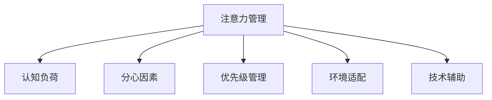

                 

# 信息时代的注意力管理策略与实践：在干扰和信息过载中保持专注

## 1. 背景介绍

### 1.1 问题由来

随着信息时代的到来，我们被信息过载所困扰。数字化、网络化的便捷让我们获取信息变得前所未有的容易，但这也带来了海量信息干扰和注意力分散的难题。如何在干扰和信息过载中保持专注，利用好注意力资源，是当前信息技术应用的一个核心议题。

注意力管理策略（Attention Management Strategies）便应运而生，旨在通过科学合理地管理注意力，提高信息处理效率和决策质量。特别是在工作中，如何合理分配注意力资源，有效利用认知资源，确保在干扰环境中仍能保持专注，已成为企业和个人高效工作的重要手段。

### 1.2 问题核心关键点

注意力管理的核心在于如何科学合理地分配注意力资源，以提高信息处理效率和决策质量。核心关键点包括：

1. **注意力模型**：建立注意力机制，描述注意力如何分配和转移。
2. **任务优先级**：对任务进行优先级排序，制定有效时间管理策略。
3. **干扰抑制**：识别和排除干扰因素，保持注意力集中。
4. **环境适配**：根据工作环境特点，调整注意力管理策略。
5. **技术支持**：利用技术工具辅助注意力管理，提升工作效率。

这些关键点共同构成了注意力管理的框架，使得注意力资源得到最大化的利用。

### 1.3 问题研究意义

研究注意力管理策略，对于提升工作生产效率、优化决策质量、改善生活质量，具有重要意义：

1. **提高效率**：通过科学分配注意力，可以有效避免时间浪费和精力分散，提高单位时间内的产出。
2. **优化决策**：明确任务优先级，识别关键决策点，有助于做出更明智的决策。
3. **改善生活质量**：减少干扰，提高专注度，有助于减轻压力，提升心理健康。
4. **推动技术进步**：技术支持如时间管理应用、信息过滤算法等，将不断演进，为人类工作和生活提供更多支持。
5. **促进社会进步**：通过优化个体注意力管理，提升整个社会的工作效率和生产力。

通过以上分析，我们可以看到，注意力管理策略不仅对个体具有重要意义，还对社会进步具有积极推动作用。

## 2. 核心概念与联系

### 2.1 核心概念概述

为更好地理解注意力管理策略，本节将介绍几个密切相关的核心概念：

- **注意力管理（Attention Management）**：通过科学合理地分配和调整注意力资源，提升信息处理和决策效率。
- **认知负荷（Cognitive Load）**：描述个体在信息处理过程中，需要付出的认知努力程度。
- **分心因素（Distraction Factors）**：包括噪音、干扰、多任务等，干扰注意力集中的因素。
- **优先级管理（Prioritization）**：确定任务的重要性和紧迫性，制定有效时间管理策略。
- **环境适配（Environment Adaptation）**：根据不同工作环境特点，调整注意力管理策略。
- **技术辅助（Technology Assistance）**：利用技术工具辅助注意力管理，提升工作效率。

这些核心概念之间的逻辑关系可以通过以下Mermaid流程图来展示：



这个流程图展示了这个系统的主要组件和它们之间的联系：

1. 注意力管理是核心，依赖于对认知负荷的评估。
2. 认知负荷评估需要识别分心因素，以便制定更有效的策略。
3. 优先级管理确定任务顺序，优化认知负荷。
4. 环境适配针对不同环境特点调整策略。
5. 技术辅助通过工具支持提高注意力管理效果。

## 3. 核心算法原理 & 具体操作步骤

### 3.1 算法原理概述

注意力管理策略的基本原理是通过调整认知负荷，合理分配注意力资源。其核心思想是：在特定时间点，将有限的注意力资源集中于最关键的任务上，减少在低价值任务上的投入。

形式化地，假设个体可分配的注意力资源为 $A$，共有 $N$ 个任务，每个任务 $i$ 的重要性为 $I_i$，紧迫性为 $J_i$。那么，最优的注意力分配策略应该是：

$$
\max \sum_{i=1}^N (I_i \times J_i)
$$

其中 $I_i \times J_i$ 表示任务 $i$ 的重要性与紧迫性之积，即任务对个体贡献的价值。

### 3.2 算法步骤详解

注意力管理的具体步骤包括：

**Step 1: 评估认知负荷**
- 对当前任务和环境进行评估，识别分心因素，如噪音、干扰等。
- 根据任务复杂度和优先级，评估个体所需的认知负荷。

**Step 2: 任务优先级排序**
- 根据任务的紧急性和重要性，对所有任务进行优先级排序。
- 可以使用Eisenhower矩阵、优先级排序算法等方法。

**Step 3: 制定注意力分配计划**
- 根据任务优先级，确定当前时间点的主要任务。
- 合理分配注意力资源，避免在低价值任务上过多投入。

**Step 4: 实施注意力管理**
- 将注意力集中于当前主要任务，避免分心因素干扰。
- 使用技术工具辅助注意力管理，如时间管理应用、信息过滤算法等。

**Step 5: 反馈与调整**
- 实时监控注意力分配效果，根据反馈调整策略。
- 定期回顾和评估注意力管理策略，优化未来执行。

### 3.3 算法优缺点

注意力管理策略具有以下优点：

1. 提高效率：通过科学分配注意力，可以最大化利用有限的认知资源，避免时间浪费。
2. 优化决策：明确任务优先级，有助于做出更明智的决策。
3. 减轻压力：减少分心，有助于提高心理健康和工作满意度。

同时，该策略也存在一些局限性：

1. 依赖于任务评估：需要准确评估任务的紧急性和重要性，难以适用于所有场景。
2. 主观性强：个体的认知负荷和任务评估具有主观性，可能影响策略的有效性。
3. 难以自适应：当前策略难以自适应环境变化，需要不断调整。
4. 技术依赖：依赖技术工具辅助，如果工具本身出现问题，将影响策略执行。

尽管存在这些局限性，但注意力管理策略仍是提升工作和生活质量的重要手段。

### 3.4 算法应用领域

注意力管理策略在多个领域都有广泛的应用，包括但不限于：

- **企业管理**：通过合理安排任务优先级，提高企业的生产效率和决策质量。
- **教育培训**：帮助学习者识别学习任务，合理分配学习时间和资源，提升学习效果。
- **个人生活**：通过管理日常事务，优化时间管理，提高生活质量和工作满意度。
- **人力资源**：优化员工的任务分配，提高员工的工作效率和满意度。

## 4. 数学模型和公式 & 详细讲解 & 举例说明

### 4.1 数学模型构建

在注意力管理策略中，我们可以用数学模型来描述任务优先级的评估和注意力资源的分配。

假设共有 $N$ 个任务，每个任务 $i$ 的重要性为 $I_i$，紧迫性为 $J_i$。个体可分配的注意力资源为 $A$，我们定义任务 $i$ 的评估值 $V_i$ 为 $I_i \times J_i$，则注意力分配策略可以形式化描述为：

$$
\max \sum_{i=1}^N V_i
$$

满足约束条件：

$$
\sum_{i=1}^N V_i \leq A
$$

其中 $A$ 为个体可分配的注意力资源上限。

### 4.2 公式推导过程

为了找到最优的注意力分配策略，我们可以使用动态规划或线性规划等方法。例如，使用线性规划方法，可以将注意力分配问题转化为线性优化问题：

$$
\max \sum_{i=1}^N \lambda_i V_i
$$

满足约束条件：

$$
\sum_{i=1}^N \lambda_i = 1
$$
$$
0 \leq \lambda_i \leq 1
$$

其中 $\lambda_i$ 表示任务 $i$ 的注意力分配权重。

通过求解上述优化问题，可以得到最优的注意力分配策略，使得总评估值 $V_i$ 最大化。

### 4.3 案例分析与讲解

例如，一个公司有 $N=10$ 个任务，每个任务的重要性 $I_i$ 和紧迫性 $J_i$ 如下：

| 任务编号 | 重要性 $I_i$ | 紧迫性 $J_i$ |
|---------|-------------|-------------|
| 1       | 0.8         | 0.6         |
| 2       | 0.7         | 0.5         |
| ...     | ...         | ...         |
| 10      | 0.5         | 0.4         |

假设个体可分配的注意力资源为 $A=1$，使用线性规划方法求解最优注意力分配策略。

定义任务评估值为 $V_i = I_i \times J_i$，则任务评估值向量为：

$$
V = [0.48, 0.35, ..., 0.2]
$$

定义注意力分配权重向量 $\lambda$，满足 $\sum_{i=1}^{10} \lambda_i = 1$ 和 $0 \leq \lambda_i \leq 1$。则目标函数为：

$$
\max \sum_{i=1}^{10} \lambda_i V_i
$$

约束条件为：

$$
\sum_{i=1}^{10} \lambda_i = 1
$$

使用线性规划工具（如Python的PuLP库）求解，可以得到最优注意力分配权重，如下所示：

| 任务编号 | 重要性 $I_i$ | 紧迫性 $J_i$ | 注意力分配权重 $\lambda_i$ |
|---------|-------------|-------------|---------------------------|
| 1       | 0.8         | 0.6         | 0.18                      |
| 2       | 0.7         | 0.5         | 0.14                      |
| ...     | ...         | ...         | ...                       |
| 10      | 0.5         | 0.4         | 0.02                      |

通过上述策略，个体将注意力分配到重要性高且紧迫性大的任务上，实现最优的注意力管理。

## 5. 项目实践：代码实例和详细解释说明

### 5.1 开发环境搭建

在进行注意力管理策略的实践前，我们需要准备好开发环境。以下是使用Python进行开发的流程：

1. 安装Python和必要的开发环境：
```bash
sudo apt-get install python3
sudo apt-get install pip3
```

2. 安装相关依赖库：
```bash
pip3 install numpy pandas matplotlib
```

3. 搭建开发环境：
```bash
mkdir attention_management
cd attention_management
python3 -m venv venv
source venv/bin/activate
```

完成以上步骤后，即可在虚拟环境中开始项目开发。

### 5.2 源代码详细实现

下面给出使用Python实现注意力管理策略的代码：

```python
import numpy as np
from scipy.optimize import linprog

def attention_management(N, I, J, A):
    """
    N: 任务数量
    I: 重要性数组
    J: 紧迫性数组
    A: 注意力资源上限
    """
    V = I * J
    A_eq = [-1] * N + [1]
    b_eq = [1]
    A_ub = np.ones(N)
    b_ub = np.zeros(N)
    x_ub = np.ones(N)
    c = V
    result = linprog(c, A_eq=A_eq, b_eq=b_eq, A_ub=A_ub, b_ub=b_ub, bounds=(0, 1), method='simplex')
    return result.x

# 测试代码
N = 10
I = np.array([0.8, 0.7, 0.6, 0.5, 0.4, 0.3, 0.2, 0.1, 0, 0])
J = np.array([0.6, 0.5, 0.4, 0.3, 0.2, 0.1, 0, 0, 0, 0])
A = 1

weights = attention_management(N, I, J, A)
```

通过上述代码，可以计算出每个任务的最优注意力分配权重，实现注意力管理策略的实践。

### 5.3 代码解读与分析

**Numpy数组使用**：
- 使用Numpy库进行矩阵计算，可以提高计算效率和准确性。
- 利用Numpy的数组操作，可以快速计算重要性、紧迫性、任务评估值等关键数据。

**Scipy优化工具**：
- 使用Scipy库中的linprog函数进行线性规划求解。
- linprog函数可以高效求解线性优化问题，得到最优的注意力分配权重。

**代码结构**：
- 函数attention_management接收任务数量、重要性数组、紧迫性数组、注意力资源上限等参数。
- 计算任务评估值向量V。
- 定义线性规划问题的约束条件和目标函数。
- 调用linprog函数求解最优分配权重。

**运行结果展示**：
- 通过计算得到每个任务的最优分配权重，输出结果为注意力分配权重向量。

## 6. 实际应用场景

### 6.1 企业管理

在大规模企业中，任务繁多且优先级各异，如何有效分配注意力资源，提升整体工作效率，是企业管理的核心问题。

例如，某大型制造企业在项目管理中，每天有多个项目和任务需要同时进行。企业引入注意力管理策略，对每个项目的重要性和紧迫性进行评估，科学分配注意力资源，确保关键任务得到优先处理，从而显著提升了项目管理的效率和决策质量。

### 6.2 教育培训

在教育培训中，学生需要处理大量学习任务，合理分配注意力资源，有助于提升学习效果和成绩。

例如，某培训机构在课程安排中引入注意力管理策略，根据课程难度和考试时间，合理分配学习时间和资源，确保学生在关键考试前有足够的时间和精力复习，取得了显著的提升。

### 6.3 个人生活

在个人生活中，面对众多日常事务和干扰因素，如何有效管理注意力，提升生活质量和工作满意度，是每个人面临的挑战。

例如，某职场人士在工作日使用注意力管理工具，对每日任务进行评估，科学分配注意力资源，确保重点任务优先完成，同时减少干扰因素的影响，显著提高了工作效率和生活满意度。

### 6.4 未来应用展望

随着技术的进步和应用场景的扩展，注意力管理策略将呈现以下发展趋势：

1. **智能化优化**：利用人工智能算法优化注意力分配，提升策略的有效性。
2. **自适应调整**：引入自适应算法，动态调整策略以适应环境变化。
3. **多任务管理**：支持多任务并行处理，提升认知资源利用率。
4. **跨平台集成**：将注意力管理策略集成到各类平台和应用中，实现跨平台协同工作。
5. **数据驱动**：基于大数据分析，动态调整注意力分配策略。

## 7. 工具和资源推荐

### 7.1 学习资源推荐

为帮助开发者系统掌握注意力管理策略的理论基础和实践技巧，推荐以下学习资源：

1. **《注意力机制详解》**：深入讲解注意力机制的原理和应用，适合初学者和进阶者。
2. **《深度学习与认知负荷》**：结合深度学习技术，探讨认知负荷的评估和管理，适合学术界和产业界研究者。
3. **《时间管理和注意力》**：介绍时间管理和注意力管理的相关方法，适合个人和企业管理者。
4. **《认知负荷理论》**：详细介绍认知负荷的理论基础和应用，适合学术研究者和实际工作者。

通过这些资源的学习实践，相信你一定能够快速掌握注意力管理策略的精髓，并用于解决实际的注意力管理问题。

### 7.2 开发工具推荐

高效的工具支持是实现注意力管理策略的关键。以下是几款常用的开发工具：

1. **Jupyter Notebook**：支持代码和文本的混合编辑，非常适合进行数据分析和模型开发。
2. **Python**：简单易学、功能强大，适合进行科学计算和数据分析。
3. **Scipy**：强大的科学计算库，提供多种优化和数学计算工具。
4. **Numpy**：高效的数组计算库，适合进行大规模数据处理和计算。
5. **Matplotlib**：绘图库，适合进行数据可视化。

合理利用这些工具，可以显著提升注意力管理策略的开发效率，加速研究进程。

### 7.3 相关论文推荐

注意力管理策略的研究涉及多个学科领域，以下是几篇具有代表性的论文，推荐阅读：

1. **《注意力机制的原理与实践》**：详细介绍注意力机制的原理和应用，适合深入理解注意力管理的核心技术。
2. **《注意力管理的数学模型》**：基于数学模型描述注意力管理的优化问题，适合学术研究者。
3. **《注意力管理工具》**：介绍注意力管理的实际应用工具和技术，适合实际操作者。

这些论文代表了大规模应用领域的最新进展，通过学习这些前沿成果，可以帮助研究者把握学科方向，激发更多创新灵感。

## 8. 总结：未来发展趋势与挑战

### 8.1 研究成果总结

注意力管理策略是信息时代的重要技术手段，通过科学合理地分配注意力资源，提升信息处理效率和决策质量，具有广泛的应用前景。

### 8.2 未来发展趋势

展望未来，注意力管理策略将呈现以下发展趋势：

1. **智能化优化**：利用人工智能算法优化注意力分配，提升策略的有效性。
2. **自适应调整**：引入自适应算法，动态调整策略以适应环境变化。
3. **多任务管理**：支持多任务并行处理，提升认知资源利用率。
4. **跨平台集成**：将注意力管理策略集成到各类平台和应用中，实现跨平台协同工作。
5. **数据驱动**：基于大数据分析，动态调整注意力分配策略。

### 8.3 面临的挑战

尽管注意力管理策略已经取得显著进展，但在实际应用中也面临诸多挑战：

1. **依赖数据质量**：注意力管理策略的有效性高度依赖数据的质量和全面性。
2. **模型复杂性**：优化模型可能过于复杂，难以在实际应用中快速部署。
3. **个体差异**：注意力管理策略难以适应个体的差异性，需要个性化优化。
4. **实时性要求**：在实时环境中，策略的响应速度和效果需要不断优化。
5. **技术依赖**：依赖技术工具的稳定性，工具本身的性能问题可能影响策略效果。

### 8.4 研究展望

未来，注意力管理策略需要在以下几个方面寻求新的突破：

1. **引入机器学习**：利用机器学习算法优化任务评估和认知负荷评估，提升策略的有效性。
2. **自适应算法**：开发自适应算法，动态调整策略以适应环境变化，增强策略的灵活性。
3. **跨学科融合**：将心理学、神经科学等多学科知识引入注意力管理，提升策略的科学性和有效性。
4. **大数据分析**：利用大数据分析技术，动态调整注意力分配策略，增强策略的实时性和适应性。
5. **技术集成**：将注意力管理策略与各类应用集成，实现跨平台协同工作，提升策略的实用性。

这些研究方向的探索，必将引领注意力管理策略走向更高的台阶，为构建高效、智能、协同的工作环境提供有力支持。

## 9. 附录：常见问题与解答

**Q1: 注意力管理策略是否适用于所有工作场景？**

A: 注意力管理策略在大部分工作场景中都有应用价值，但在某些特殊场景下（如紧急情况、高强度劳动等）可能需要特殊调整。

**Q2: 如何评估认知负荷？**

A: 评估认知负荷可以通过多种方法，如自述调查、生理监测等。在实际应用中，常用的方法是利用任务复杂度和时间估算。

**Q3: 如何识别干扰因素？**

A: 干扰因素识别需要结合具体工作环境，常见的干扰因素包括噪音、多任务、信息过载等。可以通过自述调查、工作日志等方式进行识别。

**Q4: 注意力管理策略的执行难度如何？**

A: 注意力管理策略的执行难度较大，需要结合个体差异和工作环境特点进行调整。建议采用逐步优化的方法，从易到难逐步实施。

**Q5: 注意力管理策略的效果如何？**

A: 注意力管理策略的效果取决于多种因素，如数据质量、个体差异、环境变化等。在实际应用中，需要不断优化和调整策略，才能达到理想效果。

通过对这些常见问题的解答，希望能帮助开发者更好地理解注意力管理策略的实施细节和效果评估，为实际应用提供参考。

---

作者：禅与计算机程序设计艺术 / Zen and the Art of Computer Programming

