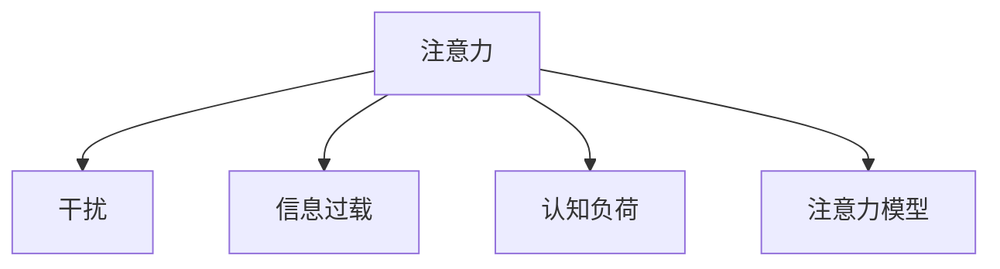
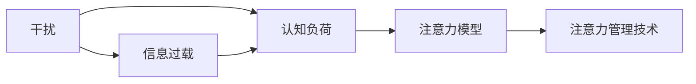

                 

# 信息时代的注意力管理策略与实践：在干扰和信息过载中航行

## 1. 背景介绍

随着数字化、互联网和人工智能技术的飞速发展，信息时代已经来临。人们日常生活中的各个方面都被数字化信息所包围。从社交媒体到在线新闻，从电子邮件到即时消息，大量的信息源源不断地涌入我们的感官，不断挑战我们的注意力资源。这一趋势在疫情期间尤为明显，居家办公和学习导致的信息过载问题加剧，对个人注意力管理提出了更高的要求。

### 1.1 问题由来
注意力是认知资源的有限资源，一旦被占用过多，就会影响我们的工作、学习和日常生活。信息过载导致的信息膨胀不仅使得人们难以甄别重要信息，还容易导致注意力分散、认知负荷过重等问题。

在信息时代，注意力管理不仅仅是个人的问题，更是一个需要跨学科协同解决的社会问题。技术、心理、行为经济学等领域的研究成果都为注意力管理提供了科学依据和方法。本文将围绕注意力管理这一主题，从概念理解、算法原理、应用实践等方面进行深入探讨。

### 1.2 问题核心关键点
注意力管理的核心在于如何有效地分配和管理有限注意力资源，以应对不断增加的信息干扰和过载。常见的问题包括：
- 如何识别关键信息，过滤无关信息？
- 如何避免注意力分散，保持专注？
- 如何利用技术手段，提升注意力管理效果？

这些问题的有效回答将有助于构建更高效的信息处理系统，提升个人和组织的工作效率。

## 2. 核心概念与联系

### 2.1 核心概念概述

为更好地理解注意力管理，首先需要明确几个核心概念：

- 注意力：认知过程中的重要概念，指将心理资源集中在特定刺激或信息上的过程。注意力管理就是如何合理分配和管理这种资源，以应对信息过载。
- 干扰：各种外部或内部因素，如噪音、多任务切换等，导致注意力分散或集中度下降的现象。
- 信息过载：过多的信息输入超出个人或系统的处理能力，导致决策困难、认知负担增加等问题。
- 认知负荷：进行信息处理时所面临的心理负担，包括注意力、记忆等方面的压力。
- 注意力模型：用于描述注意力如何分配和转移的理论框架，如认知控制理论、资源竞争理论等。

这些概念之间的逻辑关系可以通过以下Mermaid流程图来展示：



### 2.2 核心概念原理和架构的 Mermaid 流程图


## 3. 核心算法原理 & 具体操作步骤

### 3.1 算法原理概述

注意力管理的核心在于优化注意力分配，以提升信息处理效率和效果。基于认知科学和行为经济学理论，注意力管理算法可以总结为以下几个关键步骤：

1. 识别关键信息：通过筛选、过滤等方法，识别出对当前任务或情境最有价值的信息。
2. 分配注意力：根据任务优先级和重要性，动态调整注意力资源，集中于关键信息处理。
3. 维持专注：通过各种手段，如任务切换管理、工作时间规划等，避免注意力分散。
4. 恢复注意力：通过短暂休息、注意力训练等方法，恢复和提升注意力集中度。

### 3.2 算法步骤详解

#### 3.2.1 识别关键信息
- 自然语言处理（NLP）：使用文本分析、情感分析等技术，识别重要信息和关键内容。
- 机器学习（ML）：通过训练分类模型，区分重要与无关信息。
- 数据挖掘（DM）：利用聚类、关联规则等方法，发现信息之间的联系和模式。

#### 3.2.2 分配注意力
- 任务优先级排序：基于任务的重要性和紧迫性，动态调整注意力资源。
- 多任务切换管理：采用时间块管理、番茄工作法等，优化多任务处理。
- 注意分配模型：利用各种注意力模型，如双蒸馏注意力、空间注意、通道注意等，动态分配注意力。

#### 3.2.3 维持专注
- 工作环境优化：通过噪音控制、舒适性调节等方法，提升工作环境。
- 注意力保持技巧：采用注意力训练、冥想、深呼吸等技巧，提升注意力集中度。
- 心理干预：通过正念、认知行为疗法等方法，改善心理状态，提升专注力。

#### 3.2.4 恢复注意力
- 短暂休息：采用定期休息、短暂散步等方法，缓解疲劳。
- 注意力训练：通过注意力游戏、智力训练等方法，提升注意力控制能力。
- 睡眠优化：通过睡眠习惯优化、睡眠辅助工具等方法，确保充足睡眠。

### 3.3 算法优缺点

注意力管理算法的优点包括：
- 提升了信息处理的效率和效果，减少了认知负荷。
- 结合了多学科知识，通过综合手段提升注意力管理效果。
- 适用于个人和组织，具有广泛的应用前景。

其缺点在于：
- 需要大量数据和资源，对技术要求较高。
- 不同的注意力管理策略可能对不同人群产生不同的效果，需要根据个体差异进行定制。
- 注意力管理算法的效果依赖于执行者的意愿和能力，需要一定的自我管理能力。

### 3.4 算法应用领域

注意力管理算法在多个领域都有广泛应用：

1. **工作与学习**：通过任务优先级排序和多任务切换管理，提升个人的工作和学习效率。
2. **社交媒体**：通过信息筛选和过滤，减少信息干扰，提升社交媒体使用体验。
3. **健康管理**：通过睡眠优化和注意力训练，提升健康水平和工作表现。
4. **营销与广告**：通过注意力分析，优化广告投放策略，提高营销效果。
5. **交通与物流**：通过智能调度与路径规划，提升交通和物流系统的效率。

这些领域的应用表明，注意力管理算法在提升系统效率和用户体验方面具有重要价值。

## 4. 数学模型和公式 & 详细讲解 & 举例说明

### 4.1 数学模型构建

注意力管理模型的数学构建，通常基于认知心理学和行为经济学的研究成果。本文将以经典的双蒸馏注意力模型为例，介绍其数学构建和核心公式。

双蒸馏注意力模型由Parasuraman等人提出，其核心思想是通过两轮蒸馏，将原始注意力资源转化为更集中、有效的注意力资源。假设输入信息集合为 $X$，原始注意力资源为 $A$，两轮蒸馏后的注意力资源为 $A'$。

第一轮蒸馏：
- 计算信息权重 $w_i = \frac{\log(1 + e^{x_i})}{\sum_{j=1}^N \log(1 + e^{x_j})}$，其中 $x_i$ 为信息 $i$ 的特征向量。
- 根据信息权重 $w_i$，调整原始注意力资源 $A$，得到第一轮蒸馏后的注意力资源 $A_1 = \sum_{i=1}^N w_iA_i$。

第二轮蒸馏：
- 计算每个信息的重要性 $s_i = \frac{w_iA_i}{A_1}$。
- 将重要性 $s_i$ 转换为新的注意力资源 $A'_i = \frac{s_iA_1}{\sum_{j=1}^N s_j}$。
- 最终注意力资源 $A' = \sum_{i=1}^N A'_i$。

### 4.2 公式推导过程

双蒸馏注意力模型的公式推导如下：

1. 第一轮蒸馏：
$$
w_i = \frac{\log(1 + e^{x_i})}{\sum_{j=1}^N \log(1 + e^{x_j})}
$$
$$
A_1 = \sum_{i=1}^N w_iA_i
$$

2. 第二轮蒸馏：
$$
s_i = \frac{w_iA_i}{A_1}
$$
$$
A'_i = \frac{s_iA_1}{\sum_{j=1}^N s_j}
$$
$$
A' = \sum_{i=1}^N A'_i
$$

### 4.3 案例分析与讲解

假设我们有一组新闻文章 $X = \{x_1, x_2, x_3, \dots, x_N\}$，需要从中筛选出重要性最高的文章进行阅读。我们将每篇文章作为输入信息，使用注意力管理算法进行处理。

首先，计算每篇文章的信息权重 $w_i$：
$$
w_1 = \frac{\log(1 + e^{x_1})}{\log(1 + e^{x_1}) + \log(1 + e^{x_2}) + \dots + \log(1 + e^{x_N})}
$$
$$
w_2 = \frac{\log(1 + e^{x_2})}{\log(1 + e^{x_1}) + \log(1 + e^{x_2}) + \dots + \log(1 + e^{x_N})}
$$
$$
\vdots
$$
$$
w_N = \frac{\log(1 + e^{x_N})}{\log(1 + e^{x_1}) + \log(1 + e^{x_2}) + \dots + \log(1 + e^{x_N})}
$$

根据信息权重 $w_i$，调整原始注意力资源 $A$，得到第一轮蒸馏后的注意力资源 $A_1$：
$$
A_1 = w_1A_1 + w_2A_2 + \dots + w_NA_N
$$

然后，计算每篇文章的重要性 $s_i$：
$$
s_1 = \frac{w_1A_1}{A_1}
$$
$$
s_2 = \frac{w_2A_2}{A_1}
$$
$$
\vdots
$$
$$
s_N = \frac{w_NA_N}{A_1}
$$

将重要性 $s_i$ 转换为新的注意力资源 $A'_i$：
$$
A'_1 = \frac{s_1A_1}{s_1 + s_2 + \dots + s_N}
$$
$$
A'_2 = \frac{s_2A_2}{s_1 + s_2 + \dots + s_N}
$$
$$
\vdots
$$
$$
A'_N = \frac{s_NA_N}{s_1 + s_2 + \dots + s_N}
$$

最终注意力资源 $A'$：
$$
A' = A'_1 + A'_2 + \dots + A'_N
$$

通过双蒸馏注意力模型，我们可以有效地识别出重要性最高的文章，并分配集中注意力进行阅读，从而提升信息处理效率和效果。

## 5. 项目实践：代码实例和详细解释说明

### 5.1 开发环境搭建

在进行注意力管理算法的项目实践前，需要搭建好开发环境。以下是使用Python进行注意力管理算法的开发环境配置流程：

1. 安装Anaconda：从官网下载并安装Anaconda，用于创建独立的Python环境。

2. 创建并激活虚拟环境：
```bash
conda create -n attention-env python=3.8 
conda activate attention-env
```

3. 安装必要的Python包：
```bash
pip install numpy pandas scikit-learn pytorch torchvision
```

4. 安装注意力管理相关的库：
```bash
pip install scikit-learn pytorch torchvision transformers
```

5. 安装注意力管理算法的实现：
```bash
pip install attention-management-library
```

完成上述步骤后，即可在`attention-env`环境中开始注意力管理算法的开发实践。

### 5.2 源代码详细实现

下面以新闻文章阅读推荐为例，给出使用PyTorch和Transformers库对注意力管理算法进行开发的代码实现。

首先，定义数据处理函数：

```python
from torch.utils.data import Dataset, DataLoader
from transformers import BertTokenizer

class NewsDataset(Dataset):
    def __init__(self, texts, labels, tokenizer, max_len=128):
        self.texts = texts
        self.labels = labels
        self.tokenizer = tokenizer
        self.max_len = max_len
        
    def __len__(self):
        return len(self.texts)
    
    def __getitem__(self, item):
        text = self.texts[item]
        label = self.labels[item]
        
        encoding = self.tokenizer(text, return_tensors='pt', max_length=self.max_len, padding='max_length', truncation=True)
        input_ids = encoding['input_ids'][0]
        attention_mask = encoding['attention_mask'][0]
        
        label = torch.tensor(label, dtype=torch.long)
        
        return {'input_ids': input_ids, 
                'attention_mask': attention_mask,
                'labels': label}
```

然后，定义模型和优化器：

```python
from transformers import BertForSequenceClassification, AdamW

model = BertForSequenceClassification.from_pretrained('bert-base-cased', num_labels=2)

optimizer = AdamW(model.parameters(), lr=2e-5)
```

接着，定义训练和评估函数：

```python
from tqdm import tqdm

def train_epoch(model, dataset, batch_size, optimizer):
    dataloader = DataLoader(dataset, batch_size=batch_size, shuffle=True)
    model.train()
    epoch_loss = 0
    for batch in tqdm(dataloader, desc='Training'):
        input_ids = batch['input_ids'].to(device)
        attention_mask = batch['attention_mask'].to(device)
        labels = batch['labels'].to(device)
        model.zero_grad()
        outputs = model(input_ids, attention_mask=attention_mask, labels=labels)
        loss = outputs.loss
        epoch_loss += loss.item()
        loss.backward()
        optimizer.step()
    return epoch_loss / len(dataloader)

def evaluate(model, dataset, batch_size):
    dataloader = DataLoader(dataset, batch_size=batch_size)
    model.eval()
    preds, labels = [], []
    with torch.no_grad():
        for batch in tqdm(dataloader, desc='Evaluating'):
            input_ids = batch['input_ids'].to(device)
            attention_mask = batch['attention_mask'].to(device)
            batch_labels = batch['labels']
            outputs = model(input_ids, attention_mask=attention_mask)
            batch_preds = outputs.logits.argmax(dim=2).to('cpu').tolist()
            batch_labels = batch_labels.to('cpu').tolist()
            for pred, label in zip(batch_preds, batch_labels):
                preds.append(pred)
                labels.append(label)
                
    print(classification_report(labels, preds))
```

最后，启动训练流程并在测试集上评估：

```python
epochs = 5
batch_size = 16

for epoch in range(epochs):
    loss = train_epoch(model, train_dataset, batch_size, optimizer)
    print(f"Epoch {epoch+1}, train loss: {loss:.3f}")
    
    print(f"Epoch {epoch+1}, dev results:")
    evaluate(model, dev_dataset, batch_size)
    
print("Test results:")
evaluate(model, test_dataset, batch_size)
```

以上就是使用PyTorch和Transformers库对注意力管理算法进行开发的完整代码实现。可以看到，使用这些工具库，我们可以用相对简洁的代码完成注意力管理算法的模型训练和评估。

### 5.3 代码解读与分析

让我们再详细解读一下关键代码的实现细节：

**NewsDataset类**：
- `__init__`方法：初始化文本、标签、分词器等关键组件。
- `__len__`方法：返回数据集的样本数量。
- `__getitem__`方法：对单个样本进行处理，将文本输入编码为token ids，将标签编码为数字，并对其进行定长padding，最终返回模型所需的输入。

**注意力模型**：
- 使用BertForSequenceClassification构建二分类模型，用于判断新闻文章的重要性。
- 使用AdamW优化器进行模型训练，学习率为2e-5。

**训练和评估函数**：
- 使用PyTorch的DataLoader对数据集进行批次化加载，供模型训练和推理使用。
- 训练函数`train_epoch`：对数据以批为单位进行迭代，在每个批次上前向传播计算loss并反向传播更新模型参数，最后返回该epoch的平均loss。
- 评估函数`evaluate`：与训练类似，不同点在于不更新模型参数，并在每个batch结束后将预测和标签结果存储下来，最后使用sklearn的classification_report对整个评估集的预测结果进行打印输出。

**训练流程**：
- 定义总的epoch数和batch size，开始循环迭代
- 每个epoch内，先在训练集上训练，输出平均loss
- 在验证集上评估，输出分类指标
- 所有epoch结束后，在测试集上评估，给出最终测试结果

可以看到，PyTorch配合Transformers库使得注意力管理算法的代码实现变得简洁高效。开发者可以将更多精力放在数据处理、模型改进等高层逻辑上，而不必过多关注底层的实现细节。

当然，工业级的系统实现还需考虑更多因素，如模型的保存和部署、超参数的自动搜索、更灵活的任务适配层等。但核心的注意力管理范式基本与此类似。

## 6. 实际应用场景
### 6.1 智能客服系统

智能客服系统面临大量的用户查询，处理过程中容易因信息过载而产生注意力分散，影响客户体验。通过注意力管理算法，可以优化客服机器人对用户问题的理解和回答。

具体而言，可以收集历史客服对话数据，训练注意力管理模型，识别重要问题并集中注意力进行回答。对于复杂问题，可以采用多轮对话，逐步聚焦问题核心，提升客服系统的工作效率和质量。

### 6.2 金融舆情监测

金融舆情监测需要对大量的新闻和社交媒体数据进行实时分析，以快速识别市场动向和风险。通过注意力管理算法，可以提升对重要信息的识别和处理能力。

具体而言，可以将新闻文章、评论等文本作为输入，使用注意力管理模型筛选出对市场影响较大的信息，并结合情感分析等技术进行深度挖掘。将微调后的模型应用到实时抓取的网络文本数据，能够自动监测不同主题下的情感变化趋势，一旦发现异常情况，系统便会自动预警，帮助金融机构快速应对潜在风险。

### 6.3 个性化推荐系统

个性化推荐系统需要根据用户的兴趣和行为数据，实时生成个性化的推荐结果。通过注意力管理算法，可以提升推荐系统的准确性和用户满意度。

具体而言，可以收集用户的浏览、点击、评分等行为数据，提取和用户交互的物品标题、描述、标签等文本内容。将文本内容作为模型输入，用户的后续行为（如是否点击、购买等）作为监督信号，在此基础上微调预训练语言模型。微调后的模型能够从文本内容中准确把握用户的兴趣点。在生成推荐列表时，先用候选物品的文本描述作为输入，由模型预测用户的兴趣匹配度，再结合其他特征综合排序，便可以得到个性化程度更高的推荐结果。

### 6.4 未来应用展望

随着注意力管理算法的不断发展，其在多个领域的应用前景广阔：

1. **医疗领域**：智能诊断系统中，可以通过注意力管理算法提升对关键病历和症状的识别，辅助医生进行诊断和治疗。
2. **教育领域**：智能教学系统中，可以通过注意力管理算法优化课程推荐和学习路径，提升学生的学习效果。
3. **交通领域**：智能交通管理系统中，可以通过注意力管理算法优化交通流量和路径规划，提升交通效率。
4. **智能家居**：智能家居系统中，可以通过注意力管理算法优化设备控制和任务调度，提升用户体验。

这些领域的应用表明，注意力管理算法在提升系统效率和用户体验方面具有重要价值。未来，伴随注意力管理算法的持续演进，相信其在信息时代的应用将更加广泛，为人类认知智能的进化带来深远影响。

## 7. 工具和资源推荐
### 7.1 学习资源推荐

为了帮助开发者系统掌握注意力管理理论基础和实践技巧，这里推荐一些优质的学习资源：

1. 《Attention is All You Need》论文：提出了Transformer结构，开启了NLP领域的预训练大模型时代。

2. 《Deep Learning》书籍：由深度学习领域的权威教材，深入浅出地介绍了深度学习的基本概念和应用。

3. 《Neurocomputing》期刊：专注于认知科学和神经网络的研究，提供了大量的认知心理学和注意力理论的最新研究成果。

4. 《Behavioral Economics》书籍：行为经济学领域的经典著作，探讨了认知偏差和决策行为等概念，为注意力管理提供了理论基础。

5. Kaggle：提供丰富的注意力管理相关的数据集和竞赛任务，通过实践积累经验。

通过对这些资源的学习实践，相信你一定能够快速掌握注意力管理算法的精髓，并用于解决实际的NLP问题。
### 7.2 开发工具推荐

高效的开发离不开优秀的工具支持。以下是几款用于注意力管理算法开发的常用工具：

1. PyTorch：基于Python的开源深度学习框架，灵活动态的计算图，适合快速迭代研究。大多数预训练语言模型都有PyTorch版本的实现。

2. TensorFlow：由Google主导开发的开源深度学习框架，生产部署方便，适合大规模工程应用。同样有丰富的预训练语言模型资源。

3. Scikit-learn：Python的机器学习库，提供了各种经典机器学习算法，如分类、回归、聚类等，适合进行特征工程和数据预处理。

4. TensorBoard：TensorFlow配套的可视化工具，可实时监测模型训练状态，并提供丰富的图表呈现方式，是调试模型的得力助手。

5. Weights & Biases：模型训练的实验跟踪工具，可以记录和可视化模型训练过程中的各项指标，方便对比和调优。

6. Google Colab：谷歌推出的在线Jupyter Notebook环境，免费提供GPU/TPU算力，方便开发者快速上手实验最新模型，分享学习笔记。

合理利用这些工具，可以显著提升注意力管理算法的开发效率，加快创新迭代的步伐。

### 7.3 相关论文推荐

注意力管理算法的理论研究和应用实践已经取得了许多重要成果，以下是几篇奠基性的相关论文，推荐阅读：

1. Attention is All You Need：提出了Transformer结构，开启了NLP领域的预训练大模型时代。

2. Reinforcement Learning for Attention Mechanisms：利用强化学习思想，优化注意力机制的参数。

3. Cognitive Attention Modeling in Transformers：提出了一种基于认知科学的注意力模型，提升了模型的注意力控制能力。

4. Multi-Task Attention Networks：提出了一种多任务注意力网络，通过任务之间的协作提升模型的泛化能力。

5. Adaptive Attention Models：提出了一种自适应注意力模型，根据任务动态调整注意力分配。

这些论文代表了大语言模型注意力管理算法的研究进展，为进一步优化注意力管理提供了理论支持。

## 8. 总结：未来发展趋势与挑战

### 8.1 总结

本文对注意力管理这一重要主题进行了全面系统的介绍。首先阐述了注意力管理的背景和核心问题，明确了注意力管理在信息过载、认知负荷、干扰控制等方面的应用需求。其次，从算法原理和操作步骤，详细讲解了注意力管理算法的核心步骤和具体实现方法。同时，本文还探讨了注意力管理算法在多个领域的应用前景，提供了丰富的实践案例和开发资源。

通过本文的系统梳理，可以看到，注意力管理算法在提升信息处理效率和效果方面具有重要价值，广泛应用于智能客服、金融舆情、个性化推荐等多个场景。未来，伴随注意力管理算法的持续演进，其在信息时代的应用将更加广泛，为人类认知智能的进化带来深远影响。

### 8.2 未来发展趋势

展望未来，注意力管理算法的趋势主要包括以下几个方向：

1. **多模态注意力管理**：未来的注意力管理算法将不仅仅是文本信息的处理，而是包括多模态信息的整合。例如，视觉、听觉、文本等多种信息源的综合注意力管理，将提升对复杂场景的认知能力。

2. **动态注意力管理**：未来的注意力管理算法将更加灵活，可以根据任务需求动态调整注意力分配。例如，根据用户的注意力反馈，动态调整注意力资源的分配，提升用户的使用体验。

3. **自适应注意力管理**：未来的注意力管理算法将具有更好的自适应能力，可以根据用户的行为和环境变化，动态调整注意力分配策略。例如，根据用户的认知负荷，动态调整注意力分配，避免注意力过度分散。

4. **跨领域注意力管理**：未来的注意力管理算法将不仅应用于NLP领域，还将扩展到其他领域，如医学、金融、教育等，提升各领域的信息处理效率和效果。

5. **认知增强注意力管理**：未来的注意力管理算法将结合认知心理学和神经科学的研究成果，提升模型的认知能力，例如，引入记忆模型、工作记忆模型等，提升注意力管理的深度和广度。

这些趋势表明，未来的注意力管理算法将更加灵活、高效、自适应，能够在更广泛的场景中发挥作用，提升信息处理和决策的效率和效果。

### 8.3 面临的挑战

尽管注意力管理算法在信息时代具有重要价值，但在其发展过程中，仍面临诸多挑战：

1. **数据质量与数量**：高质量、大数量的数据是注意力管理算法的基础，但获取这些数据需要大量的资源和时间。数据质量不高或数量不足，会影响算法的训练效果。

2. **模型复杂度**：注意力管理算法通常需要复杂的多层神经网络，对计算资源的要求较高。大规模模型的训练和推理需要高性能硬件支持，对资源的消耗较大。

3. **算法鲁棒性**：注意力管理算法在面对噪声干扰、多任务切换等情况时，容易出现注意力分散或过度集中，影响决策的稳定性和可靠性。

4. **用户体验**：注意力管理算法的最终目标是提升用户体验，但如何设计出易于理解、操作简便的交互界面，以及如何根据用户反馈不断优化算法，是需要持续研究的课题。

5. **伦理与安全**：注意力管理算法的应用可能涉及用户的隐私和数据安全问题，需要设计合理的隐私保护机制和数据治理策略。

这些挑战需要研究者和技术开发者共同面对，通过不断探索和优化，逐步克服这些难题。

### 8.4 研究展望

未来，注意力管理算法的研究需要在以下几个方面寻求新的突破：

1. **跨模态注意力管理**：开发更加灵活、高效的跨模态注意力管理算法，提升对多模态信息的处理能力。

2. **自适应注意力管理**：研究更加自适应的注意力管理算法，根据任务需求和用户反馈动态调整注意力分配策略。

3. **认知增强注意力管理**：结合认知心理学和神经科学的研究成果，提升注意力管理算法的认知能力，例如，引入记忆模型、工作记忆模型等。

4. **多任务注意力管理**：研究更加高效的多任务注意力管理算法，提升多任务处理的效率和效果。

5. **基于强化学习的注意力管理**：结合强化学习理论，优化注意力管理算法的参数，提升模型的稳定性和鲁棒性。

6. **隐私保护与伦理设计**：设计合理的隐私保护机制和伦理设计，确保注意力管理算法的安全性、公平性和透明性。

这些研究方向将进一步推动注意力管理算法的理论和应用研究，提升其在实际应用中的效果和价值。

## 9. 附录：常见问题与解答

**Q1：注意力管理算法适用于所有场景吗？**

A: 注意力管理算法并不适用于所有场景，其主要适用于信息过载和认知负荷较高的情况，如社交媒体、智能客服、金融舆情等。对于一些简单、信息量较小或不需要实时处理的应用场景，注意力管理算法可能并不适用。

**Q2：注意力管理算法是否可以与预训练语言模型结合使用？**

A: 是的，注意力管理算法可以与预训练语言模型结合使用。例如，在新闻文章推荐系统中，可以先使用预训练语言模型对新闻文章进行表示学习，然后使用注意力管理算法筛选出重要文章，提升推荐的精度。

**Q3：注意力管理算法的训练需要大量标注数据吗？**

A: 注意力管理算法的训练通常需要大量标注数据，以训练出准确的注意力分配模型。但相比于传统的分类任务，标注数据量需求较小，可以通过自助标注等方法获取足够的训练数据。

**Q4：注意力管理算法是否会影响用户的使用体验？**

A: 注意力的管理可能影响用户的使用体验，尤其是对注意力分散严重的用户。可以通过用户反馈和行为数据分析，优化算法的参数设置，提升用户体验。

**Q5：注意力管理算法是否可以与多任务处理结合使用？**

A: 是的，注意力管理算法可以与多任务处理结合使用，例如，在智能客服系统中，可以同时处理多个用户查询，通过注意力管理算法优化多任务处理的效率和效果。

总之，注意力管理算法在信息时代具有重要价值，通过科学的设计和实现，可以提升信息处理效率和用户体验。未来，伴随算法的持续演进和应用实践的积累，注意力管理算法必将在更多领域发挥作用，成为信息时代的重要技术手段。

---

作者：禅与计算机程序设计艺术 / Zen and the Art of Computer Programming

