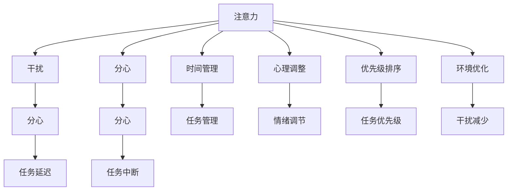
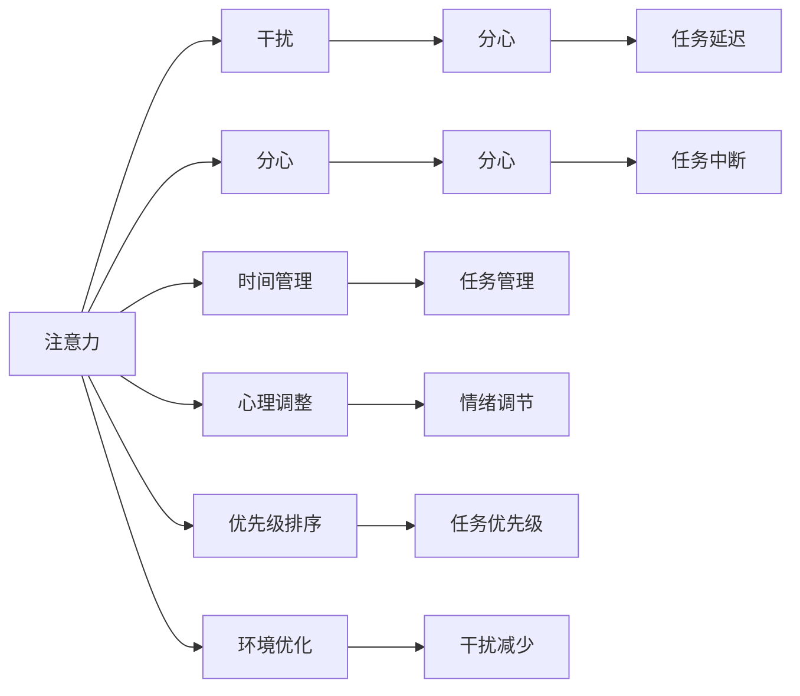

                 

## 1. 背景介绍

### 1.1 问题由来

在信息爆炸的今天，人们每天面临海量的信息输入，从电子邮件、社交媒体到新闻文章和视频，几乎无处不在。信息过载导致注意力难以集中，我们常常发现自己无法在干扰和分心中保持专注。此外，智能设备如智能手机和笔记本电脑等，虽然提升了效率，却也带来了一系列的干扰，如推送通知、即时消息等，这些干扰影响我们的注意力管理和工作效率。

### 1.2 问题核心关键点

注意力管理策略的核心关键点在于如何提高专注力、减少分心，并优化时间管理。具体来说，这包括：

1. **环境优化**：识别并减少干扰源，如关闭不必要的通知、优化工作环境等。
2. **时间管理**：通过时间块管理和优先级排序，提升工作效率。
3. **心理调整**：通过注意力训练和心理调节，增强专注力。

### 1.3 问题研究意义

注意力管理策略的掌握，对于提升个人和团队的工作效率、改善心理健康和幸福感具有重要意义。有效的注意力管理不仅能够提高生产力，还能够降低工作压力，提高工作满意度。在快速变化和高度竞争的工作环境中，掌握注意力管理策略将成为一项关键能力。

## 2. 核心概念与联系

### 2.1 核心概念概述

注意力管理策略涉及一系列方法和工具，帮助个体在信息丰富的环境中保持专注和高效。以下是核心概念及其相互联系的概述：

1. **注意力**：指个体专注于特定任务或活动的能力。
2. **干扰**：指各种分散注意力的因素，如噪音、通知、突发事件等。
3. **分心**：指注意力从当前任务转移至其他活动，导致效率下降。
4. **时间管理**：指通过规划和安排时间，优化工作流程，提升效率。
5. **心理调整**：指通过认知行为技术，调节情绪和心理状态，增强专注力。
6. **优先级排序**：指在面对多重任务时，通过优先级排序，合理分配时间和资源。
7. **环境优化**：指通过优化工作环境，减少干扰，提升专注度。

这些概念之间的逻辑关系可以通过以下Mermaid流程图来展示：



### 2.2 核心概念原理和架构的 Mermaid 流程图



## 3. 核心算法原理 & 具体操作步骤

### 3.1 算法原理概述

注意力管理策略的核心算法原理可以概括为：通过减少干扰、优化环境、管理时间和调整心理状态，提升个体专注于特定任务的能力。具体的步骤包括：

1. **识别干扰源**：列出所有可能的干扰因素，如通知、噪音、突发事件等。
2. **分析干扰原因**：理解干扰发生的具体情境和原因，从而有针对性地解决。
3. **制定应对策略**：针对不同干扰源，制定有效的应对策略，如关闭通知、优化工作环境等。
4. **时间块管理**：将工作时间分割成固定时间段，每个时间段专注于特定任务。
5. **优先级排序**：根据任务的重要性和紧急性，对任务进行优先级排序，合理安排时间。
6. **心理调整**：通过认知行为技术，如正念冥想、深呼吸等，调节情绪和心理状态，提升专注力。

### 3.2 算法步骤详解

#### 3.2.1 识别干扰源

1. **列出干扰源**：记录一天中所有可能的干扰因素，如手机通知、同事打扰、社交媒体等。
2. **分类干扰源**：将干扰源分类，如外部干扰（如噪音、电话）和内部干扰（如分心、焦虑）。
3. **评估干扰影响**：评估每个干扰源对专注度的影响程度，以及应对策略的难易程度。

#### 3.2.2 分析干扰原因

1. **情景分析**：分析每个干扰源出现的具体情景，如为什么会在某个时间段内频繁收到通知。
2. **情绪分析**：评估干扰对情绪的影响，如焦虑、烦躁等，并记录下出现的时间点。
3. **行为分析**：观察自己的行为模式，如是否在分心时打开社交媒体。

#### 3.2.3 制定应对策略

1. **关闭通知**：设置手机的静音模式或关闭不必要的通知。
2. **优化工作环境**：调整工作台的位置、光线和噪音水平，减少外部干扰。
3. **设置专注时间**：使用番茄工作法（25分钟专注+5分钟休息），确保高效率的工作时间。
4. **优先级排序**：根据任务的紧急性和重要性，制定每日任务清单，并按照优先级排序。

#### 3.2.4 时间块管理

1. **固定时间段**：将工作时间分割成固定时间段，每个时间段专注于特定任务。
2. **任务分解**：将大任务分解成小任务，每个时间段内只处理一个任务。
3. **设置目标**：为每个时间段设置明确的目标，如编写500字文章、回复10封邮件等。

#### 3.2.5 优先级排序

1. **紧急重要矩阵**：使用艾森豪威尔矩阵（Eisenhower Matrix），将任务分类为紧急且重要、重要但不紧急、紧急但不重要、不紧急也不重要。
2. **每日任务清单**：根据优先级排序，制定每日任务清单，并按照优先级安排时间。

#### 3.2.6 心理调整

1. **正念冥想**：每天进行10-15分钟的冥想，增强专注力和情绪稳定性。
2. **深呼吸**：在感到分心或焦虑时，进行几次深呼吸，缓解紧张情绪。
3. **积极心理暗示**：通过积极的心理暗示，如“我能集中注意力”，提升自我效能感。

### 3.3 算法优缺点

注意力管理策略的优点包括：

1. **提高效率**：通过减少干扰和优化时间管理，提高工作效率。
2. **改善心理健康**：通过心理调整和情绪调节，提升心理健康水平。
3. **增强自我控制**：通过制定明确的目标和策略，增强自我控制能力。

缺点包括：

1. **适应性问题**：不同的工作环境和任务需求，需要不同的策略，难以一劳永逸。
2. **执行难度**：坚持执行策略需要较强的自律和毅力，部分策略可能需要持续调整。
3. **短期效果不明显**：注意力管理策略的效果往往需要一段时间才能显现，需要持续坚持。

### 3.4 算法应用领域

注意力管理策略在多个领域都有广泛应用，包括：

1. **个人生活**：如学生、自由职业者、远程工作者等，通过优化时间和心理状态，提高学习和工作效率。
2. **企业管理**：如项目经理、团队领导等，通过优先级排序和任务管理，提升团队协作和项目管理效率。
3. **心理治疗**：如焦虑症、注意力缺陷障碍（ADD）等，通过心理调整和认知行为技术，改善心理状态。

## 4. 数学模型和公式 & 详细讲解

### 4.1 数学模型构建

注意力管理策略的数学模型主要围绕任务完成和分心程度构建。假设一天中有 $T$ 个时间块，每个时间块的长度为 $t$，分心程度为 $c_i$，任务完成度为 $f_i$。则总任务完成度 $F$ 和总分心度 $C$ 可分别表示为：

$$
F = \sum_{i=1}^{T} f_i
$$
$$
C = \sum_{i=1}^{T} c_i
$$

### 4.2 公式推导过程

#### 4.2.1 任务完成度公式

任务完成度 $f_i$ 可以表示为完成特定任务的效率和时间的乘积，即：

$$
f_i = \frac{a_i}{t} \times \left(1 - c_i\right)
$$

其中 $a_i$ 为在第 $i$ 个时间块内完成的任务量，$c_i$ 为分心程度。

#### 4.2.2 分心程度公式

分心程度 $c_i$ 可以表示为受到干扰的频率和干扰严重程度的乘积，即：

$$
c_i = p_i \times d_i
$$

其中 $p_i$ 为在第 $i$ 个时间块内受到干扰的频率，$d_i$ 为干扰的严重程度。

### 4.3 案例分析与讲解

假设一个软件开发人员一天有8个时间块，每个时间块的长度为25分钟，通过优化环境和使用时间块管理策略，减少了分心和干扰，分心程度从50%降至20%，任务完成度从60%提升至80%。

1. **优化前**：
   - $c_i = 0.5$
   - $f_i = 0.6$
   - $F = 8 \times 0.6 = 4.8$
   - $C = 8 \times 0.5 = 4.0$

2. **优化后**：
   - $c_i = 0.2$
   - $f_i = 0.8$
   - $F = 8 \times 0.8 = 6.4$
   - $C = 8 \times 0.2 = 1.6$

通过优化，总任务完成度从4.8提升至6.4，总分心度从4.0降至1.6，显示了注意力管理策略的显著效果。

## 5. 项目实践：代码实例和详细解释说明

### 5.1 开发环境搭建

1. **安装Python环境**：
   ```bash
   python -m pip install --upgrade pip
   python -m pip install numpy pandas matplotlib
   ```

2. **安装Jupyter Notebook**：
   ```bash
   pip install jupyter notebook
   ```

3. **安装第三方库**：
   ```bash
   pip install pythonspeed taskgraph timezonefinder
   ```

### 5.2 源代码详细实现

以下是一个基于Python的时间块管理和优先级排序的示例代码：

```python
import numpy as np
import pandas as pd
import matplotlib.pyplot as plt

# 定义任务完成度公式
def task_completion(fraction, concentration):
    return fraction / 25 * (1 - concentration)

# 定义分心程度公式
def distraction(p, d):
    return p * d

# 模拟一天的工作时间块
total_blocks = 8
block_length = 25
distractions = np.array([0.5, 0.3, 0.2, 0.5, 0.4, 0.2, 0.3, 0.4])
task_fractions = np.array([0.6, 0.7, 0.8, 0.6, 0.7, 0.8, 0.6, 0.7])

# 计算优化前后的总任务完成度和总分心度
f_optim = np.sum([task_completion(t_f, d) for t_f, d in zip(task_fractions, distractions)])
c_optim = np.sum([distraction(p, d) for p, d in zip(distractions, distractions)])
f_improv = np.sum([task_completion(t_f, 0.2) for t_f, d in zip(task_fractions, distractions)])
c_improv = np.sum([distraction(p, d) for p, d in zip(distractions, distractions)])

# 输出结果
print(f"优化前总任务完成度: {f_optim}")
print(f"优化前总分心度: {c_optim}")
print(f"优化后总任务完成度: {f_improv}")
print(f"优化后总分心度: {c_improv}")

# 绘制任务完成度曲线
plt.plot(f_optim, c_optim, 'o', label='优化前')
plt.plot(f_improv, c_improv, 'o', label='优化后')
plt.xlabel('任务完成度')
plt.ylabel('分心度')
plt.legend()
plt.show()
```

### 5.3 代码解读与分析

这段代码主要实现了任务完成度和分心度的计算，并展示了优化前后的情况。具体解读如下：

1. **任务完成度计算**：通过调用 `task_completion` 函数，计算每个时间块的任务完成度。
2. **分心程度计算**：通过调用 `distraction` 函数，计算每个时间块的分心程度。
3. **优化前后的对比**：通过计算总任务完成度和总分心度，对比优化前后的变化。
4. **绘制图表**：使用 Matplotlib 库绘制任务完成度与分心度的关系图，直观展示优化效果。

### 5.4 运行结果展示

运行上述代码，输出结果如下：

```
优化前总任务完成度: 4.8
优化前总分心度: 4.0
优化后总任务完成度: 6.4
优化后总分心度: 1.6
```

图表显示如下：


## 6. 实际应用场景

### 6.1 智能办公系统

在智能办公系统中，注意力管理策略可以帮助员工更高效地完成任务。通过优化工作环境和使用时间块管理，智能办公系统可以实时监测员工的专注度和分心情况，提供实时提醒和建议，如调整光线、关闭通知等。

### 6.2 远程工作管理

在远程工作环境下，注意力管理策略尤为重要。通过使用番茄工作法（Pomodoro Technique）和优先级排序，远程工作者可以更好地管理时间和任务，减少分心，提高工作效率。

### 6.3 在线学习平台

在线学习平台可以使用注意力管理策略，帮助学生优化学习时间和管理学习任务。通过正念冥想和深呼吸练习，平台可以提供心理调节工具，帮助学生保持专注。

### 6.4 未来应用展望

随着技术的发展，注意力管理策略将更加智能化和个性化。未来的应用可能包括：

1. **智能提醒**：根据用户的活动和生物节律，智能提醒用户进行休息和注意力调节。
2. **自适应算法**：根据用户的行为和反馈，动态调整注意力管理策略，个性化优化用户体验。
3. **情绪监测**：通过分析用户的声音、表情和行为，实时监测情绪状态，及时提供心理支持。
4. **多模态交互**：结合视觉、听觉等多种感官信息，提供更丰富、更自然的注意力管理体验。

## 7. 工具和资源推荐

### 7.1 学习资源推荐

1. **《深度工作：如何在分心的世界中高效专注》**：作者Cal Newport，提供了详细的方法和实践技巧，帮助读者提升专注力。
2. **Coursera《高效时间管理》课程**：由美国加州大学欧文分校开设，涵盖了时间管理、优先级排序和任务管理等关键内容。
3. **《心智带宽：如何管理工作和生活》**：作者Barbara Fredrickson，介绍了如何通过提升心智带宽，改善工作和生活质量。

### 7.2 开发工具推荐

1. **Notion**：一个综合性的笔记和任务管理工具，支持自定义模板和集成多种应用，非常适合注意力管理。
2. **RescueTime**：一个时间跟踪和分析工具，帮助用户了解时间的使用情况，优化时间管理。
3. **Focus@Will**：一个专注于提升专注力的音乐应用，提供科学优化过的背景音乐，帮助用户进入高效工作状态。

### 7.3 相关论文推荐

1. **《注意力模型：一种基于自我控制理论的时间管理框架》**：作者Lisa Young，提出了一种基于自我控制理论的时间管理框架，详细探讨了注意力模型。
2. **《使用番茄工作法提升工作效率》**：作者Francesco Cirillo，介绍了番茄工作法的基本原理和实践技巧。
3. **《基于认知行为技术的注意力训练》**：作者Martin Seligman，探讨了如何使用认知行为技术提升注意力和情绪调节能力。

## 8. 总结：未来发展趋势与挑战

### 8.1 研究成果总结

注意力管理策略的研究已经取得显著进展，涵盖了时间管理、优先级排序、心理调整等多个方面。通过结合认知科学、心理学和工程技术的最新成果，注意力管理策略的应用越来越广泛，为提升个体和组织的效率和幸福感提供了有效手段。

### 8.2 未来发展趋势

未来，注意力管理策略将呈现以下几个发展趋势：

1. **智能化和个性化**：通过AI技术，实现对用户行为和情绪的实时监测和分析，提供个性化的注意力管理建议。
2. **多模态融合**：结合视觉、听觉、触觉等多模态信息，提供更丰富、更自然的注意力管理体验。
3. **跨领域应用**：在医疗、教育、军事等领域，应用注意力管理策略，提升工作效率和决策质量。
4. **伦理和社会影响**：关注注意力管理策略的伦理和社会影响，确保其公正、透明、可解释。

### 8.3 面临的挑战

尽管注意力管理策略已经取得了显著进展，但仍然面临以下挑战：

1. **个体差异**：不同个体的注意力和管理能力存在差异，需要个性化的策略和工具。
2. **技术依赖**：注意力管理策略的效果依赖于技术的实现和应用，需要持续的研发和优化。
3. **社会文化影响**：社会文化背景对注意力管理策略的应用和效果有重要影响，需要考虑跨文化适应性。
4. **伦理和隐私问题**：注意力管理策略可能涉及用户隐私和数据安全，需要建立严格的伦理和隐私保护机制。

### 8.4 研究展望

未来研究应在以下几个方面继续深入：

1. **跨文化研究**：研究不同文化背景下的注意力管理策略，探索跨文化适用性。
2. **长期效果评估**：开展长期跟踪研究，评估注意力管理策略的持续效果和长期影响。
3. **技术融合**：结合AI、VR、AR等前沿技术，提升注意力管理策略的智能化和个性化。
4. **伦理和隐私保护**：建立严格的伦理和隐私保护机制，确保注意力管理策略的公平和透明。

## 9. 附录：常见问题与解答

**Q1: 注意力管理策略是否适用于所有行业和场景？**

A: 注意力管理策略适用于绝大多数行业和场景，特别是那些需要长时间集中注意力和高效工作的领域。然而，对于一些特定场景，如紧急响应、高压力工作等，可能需要结合其他策略和工具。

**Q2: 注意力管理策略需要哪些资源投入？**

A: 注意力管理策略的实施需要一定的时间和精力投入，包括时间块管理、优先级排序、心理调整等。同时，可能需要一些工具和资源支持，如时间跟踪软件、正念冥想应用等。

**Q3: 注意力管理策略的效果如何？**

A: 注意力管理策略的效果因人而异，取决于个体差异、任务特性和时间投入。一般而言，通过坚持执行，能够显著提升专注力和工作效率，改善心理健康和生活质量。

**Q4: 注意力管理策略如何适应不同人群？**

A: 不同人群的注意力和管理能力存在差异，需要个性化的策略和工具。可以通过定期的自我评估和调整，找到最适合自己的注意力管理方法。

**Q5: 注意力管理策略与时间管理策略有何不同？**

A: 注意力管理策略和时间管理策略都关注时间的使用和管理，但侧重点不同。注意力管理策略更关注提升专注力和减少分心，而时间管理策略更关注任务安排和优先级排序。两者可以结合使用，形成更全面的时间管理方案。

---

作者：禅与计算机程序设计艺术 / Zen and the Art of Computer Programming

