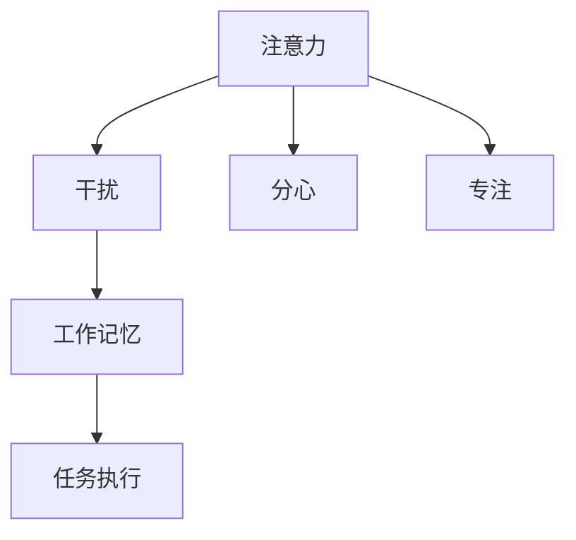

                 

# 信息时代的注意力管理策略：在干扰和分心中航行

在信息时代，海量的数据和不断的技术进步为我们提供了前所未有的便利和机遇，但同时也带来了注意力管理的挑战。如何在这个信息爆炸的环境中保持专注，高效处理信息，成为了一项重要的技能。本文将系统性地探讨信息时代注意力管理策略的核心概念、算法原理、具体操作步骤，并通过数学模型和案例分析，提出实用的解决方案，以帮助读者在干扰和分心中航行，提升工作效率和信息处理能力。

## 1. 背景介绍

### 1.1 问题由来
在信息时代，数字化和网络化已经渗透到我们生活的方方面面，各种信息源（如社交媒体、邮件、即时通讯等）不断地向我们推送内容，这既是一种便利，也是一种干扰。根据《2021年全球数字报告》，全球使用互联网和社交媒体的用户数量已经超过了50亿，这意味着我们每天要面对的信息量是巨大的，如何在干扰中保持注意力集中，高效处理信息，成为了一个亟待解决的问题。

### 1.2 问题核心关键点
注意力管理（Attention Management）的核心在于如何在干扰和分心中保持专注，从而提高工作效率和信息处理能力。其关键点包括：
1. 识别和评估干扰源。了解哪些因素会分散注意力，如社交媒体、即时消息、邮件等。
2. 设计有效的注意力管理策略。制定具体的方法，如时间管理、任务优先级排序、环境优化等。
3. 实施和持续优化。将注意力管理策略应用于实际工作，并根据反馈进行持续优化。

### 1.3 问题研究意义
在信息时代，注意力管理不仅是一项个人技能，也是一项提升团队和组织效率的关键技能。通过科学有效的注意力管理策略，可以显著提高个人和团队的信息处理能力，减少因注意力分散而导致的错误和低效，从而在复杂多变的环境中保持竞争优势。

## 2. 核心概念与联系

### 2.1 核心概念概述

为了更好地理解注意力管理策略，本节将介绍几个密切相关的核心概念：

- **注意力（Attention）**：指个体在特定时刻对某项任务或信息的关注程度。高注意力意味着更集中、更专注。
- **干扰（Distraction）**：指干扰个体注意力的事物或环境因素，如噪音、通知、社交媒体等。
- **分心（Distractibility）**：指个体在面对干扰时分心或偏离任务的可能性。
- **专注（Concentration）**：指个体长时间保持注意力的状态，对任务的全神贯注。
- **工作记忆（Working Memory）**：指个体在当前任务中能够有效运用的认知资源，与注意力密切相关。

这些核心概念之间的逻辑关系可以通过以下Mermaid流程图来展示：



这个流程图展示了几项核心概念及其之间的关系：

1. 注意力受到干扰和分心的影响，但同时也依赖于工作记忆。
2. 专注是一种理想状态的注意力表现。
3. 工作记忆是执行任务的基础。

通过理解这些核心概念，我们可以更好地把握注意力管理策略的工作原理和优化方向。

## 3. 核心算法原理 & 具体操作步骤

### 3.1 算法原理概述

注意力管理的核心思想是通过识别和评估干扰源，设计有效的注意力管理策略，从而在干扰和分心中保持专注，提高工作效率和信息处理能力。其基本框架包括：

1. **识别干扰源**：评估当前环境中的干扰因素，如社交媒体、即时消息、邮件等。
2. **设定注意力策略**：根据任务需求和个人偏好，设计具体的注意力管理策略。
3. **实施注意力策略**：将注意力管理策略应用于实际工作，如时间管理、任务优先级排序、环境优化等。
4. **评估和优化**：持续评估注意力管理策略的效果，根据反馈进行优化。

### 3.2 算法步骤详解

以下是一个详细的注意力管理策略操作步骤：

1. **干扰评估**
   - **数据收集**：记录每日使用各种干扰源的时间，如社交媒体、即时消息、邮件等。
   - **分析评估**：计算干扰时间占总时间的比例，识别主要干扰源。

2. **设定策略**
   - **时间管理**：根据任务的紧急程度和重要性，设定每日的工作时间段和休息时间段。
   - **任务优先级排序**：使用Eisenhower矩阵（紧急-重要矩阵）或类似方法，对任务进行优先级排序。
   - **环境优化**：调整工作环境，减少干扰，如关闭通知、使用专注模式等。

3. **实施策略**
   - **任务执行**：按照优先级顺序执行任务，集中注意力在当前任务上。
   - **定期休息**：使用番茄工作法（Pomodoro Technique），每工作25分钟休息5分钟。
   - **工具辅助**：使用注意力管理工具，如Focus@Will、RescueTime等，帮助跟踪和控制干扰。

4. **评估和优化**
   - **效果评估**：通过任务完成率、错误率等指标评估注意力管理策略的效果。
   - **反馈优化**：根据评估结果和反馈，调整和优化注意力管理策略。

### 3.3 算法优缺点

注意力管理策略的优势在于其系统的、科学的方法论，能够帮助个体识别干扰源，设定有效的管理策略，并持续优化。但该方法也存在以下缺点：

**优点**：
- 系统性：通过评估和优化，能够全面识别和应对干扰源。
- 科学性：基于心理学和行为科学的理论，设计合理的管理策略。
- 可操作性：具体的方法和工具，易于实施和应用。

**缺点**：
- 依赖个体差异：不同个体的干扰源和偏好不同，需要个性化调整。
- 需要时间和努力：建立和实施有效的注意力管理策略需要一定的时间和努力。
- 可能降低部分灵活性：严格的时间管理可能会限制一定的灵活性。

### 3.4 算法应用领域

注意力管理策略在多个领域中都有广泛应用，包括但不限于：

1. **个人工作**：通过科学管理个人时间和任务，提升个人工作效率。
2. **团队管理**：通过优化团队协作流程，减少会议和沟通中的干扰，提高团队整体效率。
3. **教育培训**：通过优化学习环境和时间管理，提升学生的学习效果和教师的教学质量。
4. **企业运营**：通过优化工作流程和管理策略，提升企业运营效率和员工满意度。
5. **健康生活**：通过合理安排工作和休息时间，提升生活质量和健康水平。

## 4. 数学模型和公式 & 详细讲解 & 举例说明

### 4.1 数学模型构建

注意力管理策略的数学模型可以基于信息处理理论构建，主要包括以下几个组成部分：

- **任务优先级**：使用Eisenhower矩阵或类似方法，将任务分为紧急和重要两个维度。
- **时间分配**：通过时间块（Time Blocking）方法，将一天分成若干时间块，每个时间块专注于特定任务。
- **干扰评估**：通过时间统计和分析，评估各种干扰源对注意力的影响。
- **注意力集中度**：通过工作记忆理论，计算个体在特定任务上的注意力集中度。

### 4.2 公式推导过程

假设一个典型工作日为8小时，其中包含N个任务，每个任务的时间为$t_i$，紧急程度为$e_i$，重要性为$i_i$。则任务优先级可以通过Eisenhower矩阵计算为：

$$
P_i = \frac{e_i \times i_i}{N}
$$

将一天划分为M个时间块，每个时间块持续时间为$\tau$。则时间分配可以表示为：

$$
T_{ij} = \begin{cases}
t_i & \text{if } P_i \geq \text{P}_{\text{thresh}} \\
0 & \text{if } P_i < \text{P}_{\text{thresh}}
\end{cases}
$$

其中$\text{P}_{\text{thresh}}$为任务优先级阈值。

干扰评估可以通过时间统计方法进行，假设各种干扰源$D_j$的干扰时间为$I_j$，则总干扰时间$I$可以表示为：

$$
I = \sum_{j} I_j
$$

注意力集中度$C$可以通过工作记忆理论计算，假设个体的工作记忆容量为$C_{\text{max}}$，则注意力集中度可以表示为：

$$
C = \frac{C_{\text{max}} - I}{C_{\text{max}}}
$$

### 4.3 案例分析与讲解

假设一个软件开发工程师一天的工作时间为8小时，任务列表如下：

- 紧急且重要：修复Bug，占2小时
- 重要但不紧急：项目规划，占2小时
- 紧急但不重要：参加会议，占1小时
- 不重要且不紧急：邮件处理，占1小时

使用Eisenhower矩阵计算任务优先级：

$$
P_1 = \frac{1 \times 1}{4} = 0.25 \\
P_2 = \frac{0 \times 2}{4} = 0 \\
P_3 = \frac{1 \times 0}{4} = 0 \\
P_4 = \frac{0 \times 0}{4} = 0
$$

根据任务优先级，分配时间块：

$$
\text{Time Block 1: 2小时 (修复Bug)} \\
\text{Time Block 2: 2小时 (项目规划)} \\
\text{Time Block 3: 1小时 (参加会议)} \\
\text{Time Block 4: 1小时 (邮件处理)}
$$

假设各种干扰源的干扰时间分别为：

- 社交媒体：2小时
- 即时消息：1小时
- 电话：0.5小时

则总干扰时间为：

$$
I = 2 + 1 + 0.5 = 3.5 \text{小时}
$$

计算注意力集中度：

$$
C = \frac{C_{\text{max}} - I}{C_{\text{max}}} = \frac{C_{\text{max}} - 3.5}{C_{\text{max}}}
$$

## 5. 项目实践：代码实例和详细解释说明

### 5.1 开发环境搭建

在进行注意力管理策略的实践前，我们需要准备好开发环境。以下是使用Python进行开发的环境配置流程：

1. 安装Anaconda：从官网下载并安装Anaconda，用于创建独立的Python环境。
2. 创建并激活虚拟环境：
```bash
conda create -n attention-env python=3.8 
conda activate attention-env
```
3. 安装相关库：
```bash
pip install pandas numpy matplotlib jupyter
```

完成上述步骤后，即可在`attention-env`环境中开始注意力管理策略的开发和实践。

### 5.2 源代码详细实现

以下是一个简单的Python代码示例，用于演示如何使用Eisenhower矩阵和番茄工作法（Pomodoro Technique）进行时间管理和注意力管理：

```python
import pandas as pd
from tqdm import tqdm
import time

# 任务列表
tasks = [
    {"name": "修复Bug", "duration": 120, "priority": 1},
    {"name": "项目规划", "duration": 120, "priority": 1},
    {"name": "参加会议", "duration": 60, "priority": 2},
    {"name": "邮件处理", "duration": 60, "priority": 0}
]

# 干扰源列表
distractions = [
    {"name": "社交媒体", "duration": 150},
    {"name": "即时消息", "duration": 90},
    {"name": "电话", "duration": 45}
]

# 总工作时间
total_hours = 8

# 时间块大小
time_block_size = 15

# 番茄工作法参数
pomodoro_duration = 25
pomodoro_rest = 5

# 计算任务优先级矩阵
task_priorities = []
for task in tasks:
    task_priorities.append(task["priority"])

# 使用Eisenhower矩阵计算任务优先级
def calculate_priorities(priorities):
    return priorities

# 计算每个任务的时间块分配
def allocate_time_blocks(tasks, time_block_size):
    time_blocks = []
    for task in tasks:
        time_blocks.append(task["duration"])
    return time_blocks

# 实施番茄工作法
def run_pomodoro(tasks, time_block_size, pomodoro_duration, pomodoro_rest):
    completed_tasks = []
    for task in tasks:
        for i in range(task["duration"]):
            # 执行番茄工作法
            for j in range(pomodoro_duration):
                time.sleep(time_block_size)
                print(f"正在执行任务 {task['name']}，剩余 {task['duration'] - i} 分钟")
            print(f"休息 {pomodoro_rest} 分钟")
    return completed_tasks

# 计算总干扰时间和注意力集中度
def calculate_interruptions(distractions, total_hours):
    total_interruptions = 0
    for distraction in distractions:
        total_interruptions += distraction["duration"]
    attention_concentration = 1 - total_interruptions / total_hours
    return attention_concentration

# 计算注意力管理策略效果
def evaluate_strategy(tasks, distractions, total_hours, time_block_size, pomodoro_duration, pomodoro_rest):
    task_priorities = calculate_priorities(task_priorities)
    time_blocks = allocate_time_blocks(tasks, time_block_size)
    completed_tasks = run_pomodoro(tasks, time_block_size, pomodoro_duration, pomodoro_rest)
    total_interruptions = calculate_interruptions(distractions, total_hours)
    attention_concentration = 1 - total_interruptions / total_hours
    return attention_concentration

# 输出注意力管理策略效果
attention_concentration = evaluate_strategy(tasks, distractions, total_hours, time_block_size, pomodoro_duration, pomodoro_rest)
print(f"注意力集中度：{attention_concentration:.2f}")
```

### 5.3 代码解读与分析

让我们再详细解读一下关键代码的实现细节：

**任务列表和干扰源列表**：
- `tasks`变量：定义了若干个任务的持续时间、优先级。
- `distractions`变量：定义了若干个干扰源的持续时间。

**时间块大小和番茄工作法参数**：
- `time_block_size`变量：定义了每个时间块的持续时间。
- `pomodoro_duration`变量：定义了每个番茄工作法的持续时间。
- `pomodoro_rest`变量：定义了每个番茄工作法后的休息时间。

**Eisenhower矩阵和任务优先级计算**：
- `calculate_priorities`函数：计算任务的优先级，这里使用了简单的列表排序方法。

**时间块分配和番茄工作法实施**：
- `allocate_time_blocks`函数：计算每个任务的时间块分配。
- `run_pomodoro`函数：实现了番茄工作法，逐步执行任务和休息。

**干扰时间和注意力集中度计算**：
- `calculate_interruptions`函数：计算总干扰时间，并计算注意力集中度。

**策略效果评估**：
- `evaluate_strategy`函数：综合计算任务优先级、时间块分配、干扰时间和注意力集中度，并输出注意力集中度。

可以看到，上述代码示例展示了如何使用Eisenhower矩阵和番茄工作法进行注意力管理策略的实施和评估。开发者可以根据具体任务和环境进行调整和优化。

## 6. 实际应用场景

### 6.1 知识型工作者的日常管理

对于知识型工作者，如软件开发者、研究人员等，注意力管理策略可以显著提升工作效率。通过Eisenhower矩阵，将任务按照紧急和重要程度排序，确保最重要的任务能够优先得到处理。结合番茄工作法，进行短时间、高强度的任务执行，有助于保持高注意力集中度，提高工作产出。

### 6.2 团队协作中的高效沟通

在团队协作中，干扰和分心常常导致沟通效率低下。通过设定明确的沟通时间和任务优先级，限制社交媒体、即时消息等干扰源的使用，团队成员可以更专注地参与讨论和决策，提高会议和沟通的效果。

### 6.3 学生学习的策略优化

对于学生而言，注意力管理策略可以提升学习效果。通过Eisenhower矩阵，将学习任务按照优先级排序，确保重要和紧急的复习和作业能够优先完成。结合番茄工作法，进行短时间、高强度的学习，有助于保持注意力集中，提高学习效率。

### 6.4 远程工作的自我管理

远程工作环境下，干扰和分心问题尤为突出。通过设定明确的工作时间段和休息时间段，限制社交媒体、即时消息等干扰源的使用，远程工作者可以更专注地完成任务，提高工作效率。结合番茄工作法，进行短时间、高强度的任务执行，有助于保持高注意力集中度，提升远程工作的满意度。

## 7. 工具和资源推荐

### 7.1 学习资源推荐

为了帮助开发者系统掌握注意力管理策略的理论基础和实践技巧，这里推荐一些优质的学习资源：

1. **《深度工作》（Deep Work）**：Cal Newport著，深入探讨了如何在信息时代保持专注，提升工作效率。
2. **《番茄工作法图解》（The Pomodoro Technique）**：Francesco Cirillo著，详细介绍番茄工作法的具体实施方法和效果。
3. **Coursera《注意力与大脑科学》（Attention and Cognitive Processing）**：由约翰霍普金斯大学开设的课程，通过神经科学角度，解释注意力的工作原理。
4. **EdX《高效时间管理》（Effective Time Management）**：由MIT开放课程联盟开设的课程，介绍了多种时间管理策略，包括Eisenhower矩阵和番茄工作法。
5. **WorkflowMax博客**：专注于提高工作效率和项目管理，提供丰富的注意力管理策略案例和工具推荐。

通过对这些资源的学习实践，相信你一定能够系统掌握注意力管理策略的理论基础和实践技巧，并在实际工作中发挥其潜力。

### 7.2 开发工具推荐

高效的开发离不开优秀的工具支持。以下是几款用于注意力管理策略开发的常用工具：

1. **RescueTime**：一款时间跟踪工具，可以帮助用户了解和优化工作时间分配，减少干扰源的使用。
2. **Focus@Will**：一款专为提高注意力而设计的音乐应用，通过优化听觉环境，帮助用户集中注意力。
3. **Trello**：一款任务管理工具，可以通过任务清单、优先级排序等功能，帮助用户管理任务和优先级。
4. **Pomodone**：一款番茄工作法辅助工具，可以帮助用户自动记录和统计番茄时间，优化工作节奏。
5. **Time Doctor**：一款时间管理和生产力工具，可以帮助用户记录和分析时间使用情况，识别和减少干扰源的使用。

合理利用这些工具，可以显著提升注意力管理策略的实施效果，加快创新迭代的步伐。

### 7.3 相关论文推荐

注意力管理策略的研究源于学界的持续研究。以下是几篇奠基性的相关论文，推荐阅读：

1. **《注意力是如何工作的》（How Attention Works）**：通过神经科学实验，揭示注意力的工作机制。
2. **《Eisenhower矩阵：分清主次，提高效率》（The Eisenhower Matrix: Differentiating Between Urgent and Important）**：介绍了Eisenhower矩阵的原理和应用。
3. **《番茄工作法的科学原理》（The Science of the Pomodoro Technique）**：通过实验和分析，探讨番茄工作法的效果和适用场景。
4. **《注意力管理与认知负荷》（Attention Management and Cognitive Load）**：探讨注意力管理策略对认知负荷的影响，提出优化建议。
5. **《工作记忆与信息处理》（Working Memory and Information Processing）**：通过工作记忆理论，解释注意力集中度的计算方法。

这些论文代表了大注意力管理策略的发展脉络。通过学习这些前沿成果，可以帮助研究者把握学科前进方向，激发更多的创新灵感。

## 8. 总结：未来发展趋势与挑战

### 8.1 总结

本文对注意力管理策略进行了全面系统的介绍。首先阐述了注意力管理的背景和意义，明确了注意力管理在信息时代的重要性和应用场景。其次，从原理到实践，详细讲解了注意力管理策略的数学模型和操作步骤，并通过案例分析，展示了注意力管理策略的具体实施效果。最后，本文还广泛探讨了注意力管理策略在多个领域的应用前景，展示了其巨大的潜力。

通过本文的系统梳理，可以看到，注意力管理策略在提升个人和团队的工作效率、优化工作流程、减少干扰和分心中发挥了重要作用。未来的发展趋势将进一步推动这一领域的创新和优化，使其在更广泛的应用场景中发挥更大的作用。

### 8.2 未来发展趋势

展望未来，注意力管理策略将呈现以下几个发展趋势：

1. **技术融合**：随着AI技术的发展，注意力管理策略将与智能助手、自然语言处理等技术进一步融合，提供更加智能和个性化的注意力管理服务。
2. **数据驱动**：通过分析用户数据，个性化定制注意力管理策略，实现更加精准和高效的管理。
3. **跨平台应用**：注意力管理策略将不再局限于传统的桌面应用，通过移动端、智能穿戴设备等平台，实现更便捷和多样化的应用。
4. **多模态整合**：结合视觉、听觉、触觉等多种感官信息，提供更加全面的注意力管理解决方案。
5. **心理学支持**：引入心理学和认知科学的新研究成果，进一步优化注意力管理策略的效果。

这些趋势将推动注意力管理策略向更加智能化、个性化和集成化方向发展，进一步提升信息时代的工作效率和生活质量。

### 8.3 面临的挑战

尽管注意力管理策略已经取得了一定的进展，但在迈向更加智能化、普适化应用的过程中，仍然面临以下挑战：

1. **用户个性化差异**：不同用户的干扰源、工作习惯和偏好各异，如何设计通用且个性化的管理策略，仍需进一步研究。
2. **技术适配性**：现有工具和方法需要与各种工作环境和任务场景无缝适配，如何提高技术适配性，仍需优化和改进。
3. **心理和生理影响**：长时间高强度的工作和注意力管理，可能对用户的心理和生理产生负面影响，如何平衡效率和健康，仍需进一步探索。
4. **技术依赖**：注意力管理策略的实施需要依赖各种工具和技术，如何降低技术依赖，提升用户体验，仍需研究。
5. **数据隐私和安全**：用户数据隐私和安全问题日益突出，如何保障用户数据隐私，仍需加强数据保护措施。

### 8.4 研究展望

面对注意力管理策略所面临的挑战，未来的研究需要在以下几个方面寻求新的突破：

1. **个性化定制**：结合用户行为数据和心理模型，实现更加个性化和精准的管理策略。
2. **跨场景适配**：开发能够适应不同工作场景和任务需求的管理策略，提高技术适配性。
3. **健康和效率平衡**：探索如何平衡高效工作和高强度注意力管理，降低对用户健康的影响。
4. **隐私保护**：引入隐私保护技术，确保用户数据隐私和安全，增强用户信任。
5. **智能决策支持**：引入人工智能技术，通过智能决策支持系统，提供更加智能化和个性化的管理建议。

这些研究方向的探索，将推动注意力管理策略向更加智能化、普适化、个性化和隐私保护的方向发展，为构建高效、健康、智能的工作和生活环境铺平道路。

## 9. 附录：常见问题与解答

**Q1: 注意力管理策略是否适用于所有用户？**

A: 注意力管理策略适用于大多数用户，但不同用户的工作习惯、干扰源和个人偏好各异，需要根据具体需求进行调整和优化。

**Q2: 实施注意力管理策略需要哪些工具？**

A: 实施注意力管理策略需要多种工具和技术的支持，如时间跟踪工具（如RescueTime）、音乐应用（如Focus@Will）、任务管理工具（如Trello）等。

**Q3: 如何评估注意力管理策略的效果？**

A: 可以通过任务完成率、错误率、休息时间、注意力集中度等指标评估注意力管理策略的效果。

**Q4: 注意力管理策略对健康有何影响？**

A: 长时间高强度的工作和注意力管理可能对用户的心理和生理产生负面影响，需要注意工作和休息的平衡，避免过度疲劳。

**Q5: 注意力管理策略的未来发展方向有哪些？**

A: 未来发展的方向包括技术融合、数据驱动、跨平台应用、多模态整合和心理学支持等，以提升管理策略的智能化和个性化水平。

---

作者：禅与计算机程序设计艺术 / Zen and the Art of Computer Programming

