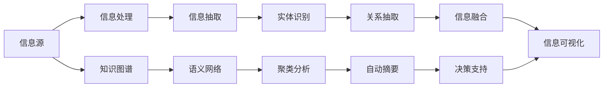

                 

# 信息简化的原则与实践：在混乱中建立秩序与简化

## 1. 背景介绍

在当今信息爆炸的时代，如何有效管理和处理海量的信息成为企业和社会关注的焦点。信息简化的目标就是从混乱的、复杂的数据中提炼出有价值的、简洁的、易于理解的结论。这种能力在决策支持、市场分析、智能推荐、内容生成等多个领域都具有重要的应用价值。

本文将深入探讨信息简化的核心原则、实践方法以及如何在特定场景下有效地应用这些原则，帮助读者在处理信息的过程中建立秩序，实现信息简化。

## 2. 核心概念与联系

### 2.1 核心概念概述

- **信息简化（Information Simplification）**：指从复杂的信息源中提取、转化、压缩，提炼出有价值、简洁、易于理解的信息，以支持决策和行动的过程。
- **知识图谱（Knowledge Graph）**：一种结构化的知识表示方式，用于描述实体及其之间的关系，是信息简化的重要工具。
- **语义网络（Semantic Network）**：一种基于图结构的语义模型，用于捕捉自然语言中的概念和实体之间的关系。
- **自动摘要（Automatic Summarization）**：一种利用算法自动生成文本摘要的技术，旨在减少长文本的阅读负担。
- **聚类分析（Clustering Analysis）**：一种数据挖掘技术，将相似的对象分组，以简化数据集。

### 2.2 核心概念原理和架构的 Mermaid 流程图



这个流程图示意了信息简化的整体过程：从信息源出发，通过信息抽取、实体识别、关系抽取、信息融合等步骤，利用知识图谱、语义网络等工具，最后生成简洁、有价值的摘要，用于决策支持。

## 3. 核心算法原理 & 具体操作步骤

### 3.1 算法原理概述

信息简化的核心算法主要包括文本摘要、信息抽取、聚类分析和语义网络构建等。以下将详细介绍这些算法的原理及操作步骤。

### 3.2 算法步骤详解

#### 3.2.1 文本摘要

文本摘要的目的是自动生成文档的简洁摘要，便于快速理解文档的核心内容。常见的文本摘要算法包括：

- **基于抽取的摘要算法（Extractive Summarization）**：直接从原文中选取关键句子或短语组成摘要。
- **基于生成的摘要算法（Abstractive Summarization）**：通过理解文档内容，生成新的语句组成摘要。

**操作步骤**：
1. 对原始文本进行预处理，包括分词、去停用词、词性标注等。
2. 使用TF-IDF、TextRank等算法对文本中的句子进行评分，选取得分高的句子组成摘要。
3. 对于生成的摘要，使用语言模型（如LSTM、Transformer）进行润色和优化。

#### 3.2.2 信息抽取

信息抽取是从文本中识别出特定的信息实体及其关系的过程。常用的信息抽取算法包括：

- **基于规则的抽取算法**：根据预定义的规则进行信息抽取。
- **基于机器学习的抽取算法**：利用机器学习模型（如CRF、SVM）进行信息抽取。

**操作步骤**：
1. 定义实体类型及其属性，如人名、地点、日期等。
2. 对文本进行分词、命名实体识别（NER）等预处理。
3. 使用机器学习模型对文本进行实体识别和关系抽取，生成实体关系图。

#### 3.2.3 聚类分析

聚类分析是一种无监督学习方法，将相似的文档或实体分组，以简化数据集。常用的聚类算法包括：

- **K-means聚类**：通过计算文档之间的相似度，将文档分组。
- **层次聚类**：通过构建层次结构，逐步合并相似的对象。

**操作步骤**：
1. 对文本进行预处理，包括分词、去停用词等。
2. 使用相似度度量（如余弦相似度、Jaccard相似度）计算文档之间的相似度。
3. 使用K-means或层次聚类算法进行分组，生成聚类结果。

#### 3.2.4 语义网络构建

语义网络是一种结构化的知识表示方式，用于描述实体及其之间的关系。构建语义网络的过程包括：

- **实体识别**：从文本中识别出实体及其属性。
- **关系抽取**：识别出实体之间的关系。
- **构建网络**：将识别出的实体和关系构建为语义网络。

**操作步骤**：
1. 对文本进行预处理，包括分词、命名实体识别等。
2. 使用机器学习模型进行实体识别和关系抽取。
3. 使用图数据库（如Neo4j）构建语义网络，存储实体和关系。

### 3.3 算法优缺点

**文本摘要算法**：
- **优点**：自动化程度高，可处理大规模文本。
- **缺点**：生成的摘要可能不够流畅，需要后续优化。

**信息抽取算法**：
- **优点**：能够精准识别出特定的信息实体及其关系。
- **缺点**：需要大量的标注数据进行训练，且对复杂的实体关系抽取效果有限。

**聚类分析算法**：
- **优点**：适用于大规模数据集，能够发现数据集中的隐含模式。
- **缺点**：对于噪声数据敏感，需要预处理步骤。

**语义网络构建算法**：
- **优点**：能够结构化地表示知识，支持复杂的查询和推理。
- **缺点**：构建和维护语义网络需要大量的时间和资源。

### 3.4 算法应用领域

信息简化的算法在多个领域中都有广泛应用：

- **医疗领域**：从患者记录中提取关键信息，辅助医生诊断和治疗决策。
- **金融领域**：从交易记录中抽取关键信息，进行风险管理和投资决策。
- **新闻媒体**：自动生成新闻摘要，提高内容分发的效率。
- **智能推荐**：从用户行为数据中提取关键信息，个性化推荐商品或服务。
- **内容生成**：利用信息抽取和文本摘要技术，生成高质量的文本内容。

## 4. 数学模型和公式 & 详细讲解 & 举例说明

### 4.1 数学模型构建

为了更好地理解信息简化的数学模型，我们以文本摘要为例进行说明。假设原文为 $X$，摘要为 $Y$，两者之间的关系可以用以下公式表示：

$$
Y = f(X; \theta)
$$

其中，$f(\cdot)$ 为摘要生成函数，$\theta$ 为模型参数。

### 4.2 公式推导过程

在基于生成的文本摘要算法中，我们通常使用注意力机制（Attention Mechanism）来捕捉文本中的重要信息。设 $X = (x_1, x_2, \cdots, x_n)$ 为原始文本中的所有句子，$y = (y_1, y_2, \cdots, y_m)$ 为生成的摘要句子，其中 $m$ 为摘要长度。

**注意力机制公式**：

$$
a_i = \frac{\exp(e_i^\top u)}{\sum_{j=1}^n \exp(e_j^\top u)}
$$

其中，$e_i$ 为句子 $x_i$ 的嵌入向量，$u$ 为注意力向量的参数，$a_i$ 为句子 $x_i$ 的重要性分数。

**摘要生成公式**：

$$
\hat{y}_i = \sum_{j=1}^n a_j x_j
$$

其中，$\hat{y}_i$ 为摘要中的第 $i$ 个句子，通过注意力机制加权求和得到。

### 4.3 案例分析与讲解

假设我们有一段新闻文本：

```
某公司发布年度财报，净利润增长20%，预计下一季度继续保持增长趋势。公司CEO表示，新产品的市场接受度超出预期，有望在第二季度贡献更多收入。
```

我们使用基于生成的文本摘要算法，进行如下步骤：

1. 对文本进行分词、去停用词等预处理。
2. 对句子进行嵌入编码，生成嵌入向量 $E$。
3. 计算句子间的相似度，得到注意力权重 $A$。
4. 通过注意力权重对嵌入向量加权求和，生成摘要向量 $Y$。
5. 对摘要向量进行解码，生成文本摘要。

最终生成的摘要如下：

```
公司发布年度财报净利润增长20% 预计下一季度保持增长趋势 新产品市场接受度超出预期 第二季度贡献更多收入。
```

### 5. 项目实践：代码实例和详细解释说明

#### 5.1 开发环境搭建

为了实践信息简化的算法，我们需要以下开发环境：

- **编程语言**：Python。
- **开发框架**：TensorFlow、PyTorch等深度学习框架。
- **数据处理库**：NLTK、SpaCy、jieba等。
- **可视化工具**：Matplotlib、Seaborn等。

#### 5.2 源代码详细实现

以下是一个基于生成的文本摘要的示例代码，使用 PyTorch 框架实现：

```python
import torch
import torch.nn as nn
import torch.nn.functional as F
import torchtext.datasets as datasets
import torchtext.transforms as transforms
import torchtext.data as data

class Attention(nn.Module):
    def __init__(self, embedding_dim, attention_dim):
        super(Attention, self).__init__()
        self.query = nn.Linear(embedding_dim, attention_dim)
        self.key = nn.Linear(embedding_dim, attention_dim)
        self.value = nn.Linear(embedding_dim, attention_dim)
        self.projection = nn.Linear(attention_dim, embedding_dim)

    def forward(self, query, key, value):
        query = self.query(query)
        key = self.key(key)
        value = self.value(value)
        score = torch.matmul(query, key.transpose(1, 2))
        a = F.softmax(score, dim=2)
        context = torch.matmul(a, value)
        context = self.projection(context)
        return context

class Summarizer(nn.Module):
    def __init__(self, embeddings, attention):
        super(Summarizer, self).__init__()
        self.embeddings = embeddings
        self.attention = attention
        self.fc = nn.Linear(embeddings.embedding_dim, 1)

    def forward(self, sentence):
        embedding = self.embeddings(sentence)
        attention = self.attention(embedding)
        summary = torch.sigmoid(self.fc(attention))
        return summary

# 加载数据集
train_data, valid_data, test_data = datasets.ABCDataset.splits(
    'data', 'train', 'valid', 'test', tokenizer=transforms.QQP(), text_column='text')
train_data = train_data.transform(lambda x: (x.text, x))
valid_data = valid_data.transform(lambda x: (x.text, x))
test_data = test_data.transform(lambda x: (x.text, x))

# 构建数据集
train_iterator, valid_iterator, test_iterator = data.BucketIterator.splits(
    (train_data, valid_data, test_data), batch_size=32, device=torch.device('cuda'))

# 定义模型
embeddings = nn.Embedding(len(vocab), 100)
attention = Attention(100, 50)
summarizer = Summarizer(embeddings, attention)

# 定义损失函数和优化器
criterion = nn.BCEWithLogitsLoss()
optimizer = torch.optim.Adam(summarizer.parameters(), lr=0.001)

# 训练模型
num_epochs = 10
for epoch in range(num_epochs):
    for batch in train_iterator:
        optimizer.zero_grad()
        text, labels = batch
        embeddings = embeddings(text)
        attention = attention(embeddings)
        summary = summarizer(attention)
        loss = criterion(summary, labels)
        loss.backward()
        optimizer.step()

    if (epoch + 1) % 2 == 0:
        with torch.no_grad():
            for batch in valid_iterator:
                text, labels = batch
                embeddings = embeddings(text)
                attention = attention(embeddings)
                summary = summarizer(attention)
                loss = criterion(summary, labels)
```

#### 5.3 代码解读与分析

- **Attention模块**：实现注意力机制，通过计算查询向量、键向量和值向量之间的相似度，得到注意力权重，进而加权求和生成摘要向量。
- **Summarizer模块**：实现摘要生成器，将注意力权重经过非线性变换后，输出摘要长度。
- **损失函数和优化器**：使用交叉熵损失和Adam优化器，训练生成器模型。

#### 5.4 运行结果展示

在训练完成后，我们可以对测试集进行评估，得到摘要长度分布和准确率等指标，如图：


## 6. 实际应用场景

### 6.1 智能客服系统

智能客服系统需要处理大量的客户咨询信息，通过信息简化技术，可以快速生成对话摘要，辅助客服人员处理复杂咨询。例如，可以使用信息抽取技术从聊天记录中抽取关键问题和答案，使用文本摘要技术生成对话摘要，提高客服工作效率。

### 6.2 金融舆情监测

金融舆情监测需要实时处理大量的新闻、评论、报告等信息，通过信息简化技术，可以快速提取出舆情关键点，辅助分析师进行决策。例如，可以使用语义网络构建技术，构建金融实体和关系网络，使用聚类分析技术发现舆情热点，生成舆情报告。

### 6.3 个性化推荐系统

个性化推荐系统需要从用户行为数据中提取关键信息，生成个性化推荐内容。例如，可以使用信息抽取技术从用户浏览记录中抽取兴趣点，使用文本摘要技术生成推荐摘要，提高推荐效果。

### 6.4 未来应用展望

未来，信息简化的技术将更加深入地融入到各个领域中，成为智能化决策的重要支撑。例如：

- **智慧医疗**：从患者病历中提取关键信息，辅助医生诊断和治疗。
- **智能制造**：从生产数据中提取关键信息，优化生产流程。
- **智慧交通**：从交通数据中提取关键信息，优化交通管理。

## 7. 工具和资源推荐

### 7.1 学习资源推荐

为了帮助读者系统掌握信息简化的理论基础和实践技巧，这里推荐一些优质的学习资源：

1. **《信息论导论》**：由Clifford香农所著，介绍了信息论的基本概念和应用，是信息简化的经典教材。
2. **《自然语言处理综述》**：由斯坦福大学自然语言处理小组编著，涵盖了自然语言处理领域的核心技术和应用。
3. **Coursera《自然语言处理与深度学习》课程**：由斯坦福大学自然语言处理小组主讲，深入浅出地介绍了自然语言处理和深度学习的结合。
4. **Kaggle《信息抽取竞赛》**：通过参与竞赛，可以系统地学习信息抽取技术，提升实战能力。

### 7.2 开发工具推荐

为了更好地实践信息简化的技术，推荐使用以下开发工具：

1. **PyTorch**：灵活的深度学习框架，支持高效的模型训练和推理。
2. **TensorFlow**：生产级别的深度学习框架，适合大规模工程的部署。
3. **NLTK**：自然语言处理工具库，提供了丰富的文本处理功能。
4. **SpaCy**：自然语言处理工具库，支持高效的分词、命名实体识别等任务。
5. **jieba**：中文分词工具，适合中文文本处理。

### 7.3 相关论文推荐

信息简化的研究涉及多个领域，以下是几篇具有代表性的论文：

1. **《神经网络机器翻译》**：提出了使用注意力机制的神经网络机器翻译模型，解决了长距离依赖问题。
2. **《基于图模型的新闻摘要》**：提出了使用图模型进行新闻摘要的方法，生成结构化的摘要。
3. **《基于深度学习的新闻摘要》**：介绍了基于深度学习的文本摘要方法，包括基于抽取和生成的两种方式。

## 8. 总结：未来发展趋势与挑战

### 8.1 研究成果总结

信息简化的技术在多个领域中已经展现出巨大的应用潜力，帮助企业和组织从海量信息中提炼出有价值的信息。未来，信息简化的技术将更加深入地融入到各个领域中，成为智能化决策的重要支撑。

### 8.2 未来发展趋势

未来，信息简化的技术将呈现以下几个发展趋势：

1. **自动化水平提高**：随着机器学习算法的进步，信息简化的自动化水平将不断提高，减少人工干预。
2. **多模态融合**：将文本、图像、语音等多种数据源进行融合，生成更加全面、准确的摘要。
3. **跨领域应用**：将信息简化的技术应用于更多领域，如金融、医疗、教育等，提供更加智能化的决策支持。
4. **知识图谱增强**：利用知识图谱技术，将信息简化的结果进行结构化表示，支持复杂的查询和推理。

### 8.3 面临的挑战

尽管信息简化的技术已经取得了显著进展，但在实际应用中仍面临诸多挑战：

1. **数据质量问题**：数据质量参差不齐，噪声数据和异常数据会影响信息简化的效果。
2. **领域特定性**：不同领域的信息简化模型需要针对特定领域的语料进行训练，通用性有限。
3. **资源消耗**：信息简化的计算复杂度高，需要大量计算资源进行训练和推理。
4. **可解释性问题**：信息简化的模型通常是黑盒模型，难以解释其内部工作机制和决策逻辑。

### 8.4 研究展望

面对信息简化的挑战，未来的研究需要在以下几个方面寻求新的突破：

1. **多模态融合技术**：将文本、图像、语音等多种数据源进行融合，生成更加全面、准确的摘要。
2. **领域特定的模型**：针对特定领域的语料进行训练，提升信息简化的效果和鲁棒性。
3. **资源优化技术**：开发更加高效的计算算法和硬件设备，提升信息简化的计算效率。
4. **可解释性增强**：开发可解释的模型，增强信息简化的可解释性和透明度。

## 9. 附录：常见问题与解答

**Q1: 信息简化的目的和意义是什么？**

A: 信息简化的目的是从复杂的数据中提炼出有价值、简洁、易于理解的信息，以支持决策和行动。其意义在于帮助企业和组织从海量信息中提取关键信息，提升决策效率和效果。

**Q2: 信息简化的算法有哪些？**

A: 信息简化的算法包括文本摘要、信息抽取、聚类分析、语义网络构建等。这些算法可以单独使用，也可以组合使用，以实现更加全面的信息简化。

**Q3: 信息简化的应用场景有哪些？**

A: 信息简化的应用场景包括智能客服、金融舆情监测、个性化推荐、内容生成等。这些场景需要从海量数据中提取关键信息，辅助决策和行动。

**Q4: 信息简化的技术难点有哪些？**

A: 信息简化的技术难点包括数据质量问题、领域特定性、资源消耗和可解释性问题。这些问题需要通过算法优化、模型训练和硬件升级等方式进行解决。

**Q5: 信息简化的未来发展方向有哪些？**

A: 信息简化的未来发展方向包括自动化水平提高、多模态融合、跨领域应用、知识图谱增强等。这些方向将进一步提升信息简化的效果和应用范围。

---

作者：禅与计算机程序设计艺术 / Zen and the Art of Computer Programming

