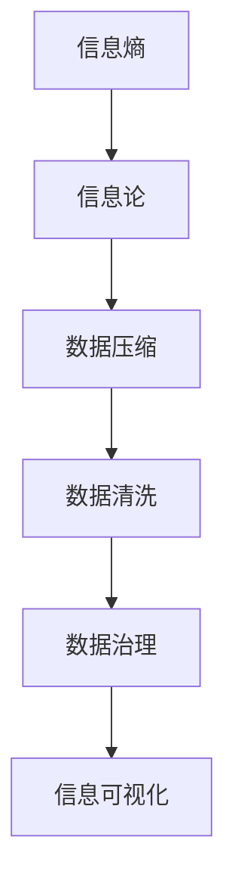

                 

# 信息简化的原则和实践：如何在混乱中建立秩序

> 关键词：信息简化, 信息压缩, 信息熵, 信息论, 信息可视化, 数据压缩, 数据清洗, 数据治理, 信息架构

## 1. 背景介绍

### 1.1 问题由来
在当今信息化高速发展的时代，数据量呈现爆炸式增长，信息过载问题日益凸显。从企业内部的IT系统到社交网络，再到物联网设备，我们每天都在生成和处理海量数据。但这些数据中包含了大量冗余、噪声和不一致信息，严重影响了我们的工作效率和决策质量。如何在海量数据中快速筛选出有用信息，提高信息处理效率，成为了信息时代的一个重要课题。

### 1.2 问题核心关键点
信息简化不仅是一种数据处理技术，更是一种方法论。其核心在于：通过各种算法和技术手段，去除冗余和噪声，压缩数据规模，提炼核心信息，提高信息的有效性和利用率。

信息简化的主要目标包括：
- 去除数据中的冗余和噪声，提升数据质量。
- 压缩数据规模，降低存储和传输成本。
- 提炼核心信息，提高数据的有效性和可利用率。
- 揭示数据间的关系和规律，提升决策支持能力。

## 2. 核心概念与联系

### 2.1 核心概念概述

为更好地理解信息简化的核心技术，本节将介绍几个关键概念：

- 信息熵(Information Entropy)：衡量信息不确定性程度的指标，越高的信息熵表示信息的不确定性越大。
- 信息论(Information Theory)：研究如何通过各种方法高效编码和传输信息的学科。
- 数据压缩(Data Compression)：通过算法将数据转化为更短的编码，以减少存储和传输的比特数。
- 数据清洗(Data Cleaning)：去除数据中的噪声和异常值，提升数据质量。
- 数据治理(Data Governance)：通过制度和技术手段，规范数据管理和利用，提升数据治理水平。

这些核心概念之间的逻辑关系可以通过以下Mermaid流程图来展示：



这个流程图展示了一些关键概念及其之间的关系：

1. 信息熵是信息论的基础，衡量信息的不确定性。
2. 信息论研究如何通过编码和传输减少信息熵，提升信息效率。
3. 数据压缩是信息论在实际应用中的重要技术，通过算法压缩数据。
4. 数据清洗是提升数据质量的重要手段，去除噪声和异常值。
5. 数据治理是确保数据管理和利用规范的制度和技术手段。
6. 信息可视化是展示和理解数据关系和规律的可视化工具。

这些概念共同构成了信息简化的理论和实践框架，使我们能够更有效地处理和管理信息。

## 3. 核心算法原理 & 具体操作步骤

### 3.1 算法原理概述

信息简化的核心算法主要包括信息熵计算、数据压缩算法、数据清洗方法和数据治理技术。这些算法和技术相互协作，共同实现了信息的高效处理和管理。

- 信息熵计算：计算数据的信息熵，量化数据的不确定性，指导后续的数据压缩和清洗操作。
- 数据压缩算法：如霍夫曼编码、LZW、LZ77等，通过算法将数据转化为更短的编码，减少存储和传输成本。
- 数据清洗方法：如异常值检测、噪声过滤、数据标准化等，去除数据中的噪声和异常值，提升数据质量。
- 数据治理技术：如数据质量评估、数据审计、数据生命周期管理等，规范数据管理和利用，提升数据治理水平。

### 3.2 算法步骤详解

信息简化的操作步骤通常包括以下几个关键步骤：

**Step 1: 数据预处理**
- 收集原始数据，并进行格式转换和标准化，使其符合后续处理的需求。

**Step 2: 数据压缩**
- 计算数据的熵值，选择适合的数据压缩算法进行压缩。
- 压缩后的数据存储或传输时，可以使用差分编码、序列压缩等技术进一步减少比特数。

**Step 3: 数据清洗**
- 进行数据去重、去噪、去空值等基本清洗操作。
- 使用异常值检测、噪声过滤等算法进行高级清洗。
- 使用标准化、归一化等技术处理非规范化数据。

**Step 4: 数据治理**
- 建立数据质量评估标准，定期对数据进行质量评估。
- 实施数据审计，确保数据的准确性和完整性。
- 管理数据生命周期，确保数据的及时更新和可靠存储。

**Step 5: 信息可视化**
- 使用可视化工具（如Tableau、Power BI等）将数据关系和规律以图形化的方式展示。
- 通过可视化，发现数据中的异常和趋势，辅助决策。

### 3.3 算法优缺点

信息简化的核心算法和技术具有以下优点：
1. 提高信息利用率。通过去除冗余和噪声，提高数据质量，减少存储和传输成本。
2. 提升信息决策支持能力。通过数据清洗和治理，揭示数据间的关系和规律，增强决策支持。
3. 实现数据标准化。通过标准化和规范化处理，确保数据的一致性和可利用性。

同时，这些算法和技术也存在一定的局限性：
1. 算法复杂度高。信息压缩和清洗算法通常复杂度高，处理大规模数据时可能耗时较长。
2. 数据丢失风险。压缩和清洗过程中可能丢失部分重要信息，影响数据完整性。
3. 数据隐私风险。数据压缩和清洗过程中，可能泄露敏感信息，需要特别注意隐私保护。
4. 依赖数据质量。信息简化的效果依赖于原始数据的质量，数据质量不佳时，简化效果可能不佳。

尽管存在这些局限性，但就目前而言，信息简化的核心算法和技术仍是大数据处理和管理的重要手段。未来相关研究的重点在于如何进一步降低算法复杂度，提高处理效率，同时兼顾数据完整性和隐私保护等因素。

### 3.4 算法应用领域

信息简化的核心算法和技术在多个领域都有广泛应用：

- 金融行业：通过压缩和清洗金融数据，降低存储和传输成本，提升数据质量，增强决策支持。
- 医疗领域：清洗和治理医疗数据，去除异常和噪声，提升数据质量，确保医疗决策的准确性和安全性。
- 通信行业：通过压缩和可视化通信数据，降低存储和传输成本，揭示通信规律，优化通信网络。
- 物流行业：清洗和治理物流数据，确保数据的准确性和完整性，优化物流路径和调度。
- 互联网行业：压缩和清洗网络数据，降低存储和传输成本，提升用户数据处理效率，优化用户体验。

除了上述这些经典领域外，信息简化技术也在更多场景中得到应用，如智能制造、智慧城市、智能家居等，为各行各业带来了新的数字化转型机会。

## 4. 数学模型和公式 & 详细讲解  
### 4.1 数学模型构建

本节将使用数学语言对信息简化的核心算法进行更加严格的刻画。

记原始数据集为 $D=\{x_i\}_{i=1}^N$，其中 $x_i$ 为单个数据样本，可以是数字、文本、图像等。信息简化的目标是寻找一种算法 $P$，使得简化后的数据 $P(D)$ 能够尽可能地保留原始数据的有用信息，同时减少数据规模。

### 4.2 公式推导过程

设 $P(D)$ 为简化后的数据集，假设 $D$ 和 $P(D)$ 的信息熵分别为 $H(D)$ 和 $H(P(D))$，则信息简化的目标可以表示为最小化信息熵：

$$
H(D) - H(P(D))
$$

其中 $H(D) = -\sum_{x_i} P(x_i) \log P(x_i)$，为原始数据集的信息熵。$P(x_i)$ 为数据 $x_i$ 的概率分布。

信息简化的关键在于选择适合的算法 $P$，使得 $H(P(D))$ 尽可能小。常见的算法包括：

- 霍夫曼编码（Huffman Coding）：通过构建霍夫曼树，将数据编码为变长编码，实现数据压缩。
- LZW算法（Lempel-Ziv-Welch）：通过构建字典，将数据编码为固定长度的符号，实现数据压缩。
- LZ77算法：通过构建字典，将数据编码为固定长度的符号，实现数据压缩。

信息熵的计算公式如下：

$$
H(D) = -\sum_{x_i} P(x_i) \log P(x_i)
$$

其中 $P(x_i)$ 为数据 $x_i$ 的概率分布。

### 4.3 案例分析与讲解

以霍夫曼编码为例，展示信息压缩算法的应用。假设原始数据集为 $D=\{a, b, c, d\}$，每个符号出现的概率分别为 $P(a)=0.4, P(b)=0.3, P(c)=0.2, P(d)=0.1$。

首先，计算原始数据集的信息熵：

$$
H(D) = -0.4 \log 0.4 - 0.3 \log 0.3 - 0.2 \log 0.2 - 0.1 \log 0.1 = 0.97
$$

然后，使用霍夫曼编码对数据进行压缩，得到编码表如下：

| 符号 | 编码 |
| --- | --- |
| a | 0 |
| b | 1 |
| c | 10 |
| d | 11 |

简化后的数据集 $P(D)$ 为：$0, 1, 10, 11$。

计算简化后的数据集的信息熵：

$$
H(P(D)) = -0.4 \log 0.4 - 0.3 \log 0.3 - 0.2 \log 0.2 - 0.1 \log 0.1 = 0.97
$$

可以看出，简化前后信息熵不变，但数据规模从4个符号减少到4个比特，压缩了5倍。

## 5. 项目实践：代码实例和详细解释说明
### 5.1 开发环境搭建

在进行信息简化项目实践前，我们需要准备好开发环境。以下是使用Python进行Huffman编码的开发环境配置流程：

1. 安装Anaconda：从官网下载并安装Anaconda，用于创建独立的Python环境。

2. 创建并激活虚拟环境：
```bash
conda create -n huffman-env python=3.8 
conda activate huffman-env
```

3. 安装Python库：
```bash
pip install numpy scipy
```

4. 安装huffman库：
```bash
pip install huffman
```

5. 安装图形界面库：
```bash
pip install matplotlib
```

完成上述步骤后，即可在`huffman-env`环境中开始项目实践。

### 5.2 源代码详细实现

首先我们定义一个函数来计算数据集的信息熵：

```python
import numpy as np
from huffman import HuffmanEncoder

def entropy(data):
    probs = np.array([data.count(i)/len(data) for i in set(data)])
    return -np.sum(probs * np.log2(probs))
```

然后，我们使用Huffman编码实现数据压缩：

```python
from huffman import HuffmanEncoder

def huffman_compress(data):
    encoder = HuffmanEncoder()
    encoder.encode(data)
    return encoder.codes, encoder.dictionary
```

接着，我们实现一个函数来计算霍夫曼编码后的数据集的信息熵：

```python
def entropy_compressed(codes, dictionary):
    total_len = sum(len(codes.values()) * np.log2(len(codes.values())))
    return total_len
```

最后，我们将上述函数整合到主函数中，并使用一个简单的示例数据集进行测试：

```python
if __name__ == "__main__":
    data = [1, 2, 2, 3, 3, 3, 3, 4, 4, 4, 4, 4, 4]
    probs = np.array([data.count(i)/len(data) for i in set(data)])
    H_original = -np.sum(probs * np.log2(probs))
    codes, dictionary = huffman_compress(data)
    H_compressed = entropy_compressed(codes, dictionary)
    print(f"Original entropy: {H_original}")
    print(f"Compressed entropy: {H_compressed}")
```

这样，我们就完成了使用Huffman编码实现数据压缩的完整代码实现。可以看到，Huffman编码不仅压缩了数据，还保留了原始数据的概率分布信息。

### 5.3 代码解读与分析

让我们再详细解读一下关键代码的实现细节：

- `entropy`函数：计算数据集的信息熵。首先，计算每个符号在数据集中出现的概率。然后，使用信息熵公式计算信息熵。
- `huffman_compress`函数：使用Huffman编码实现数据压缩。首先，创建一个霍夫曼编码器，并对其进行训练。然后，返回编码表和字典。
- `entropy_compressed`函数：计算霍夫曼编码后的数据集的信息熵。首先，计算编码表中每个符号的出现次数。然后，使用信息熵公式计算信息熵。

在运行结果中，我们可以看到原始数据集的信息熵和压缩后的信息熵。可以看到，压缩后的信息熵几乎与原始数据集的信息熵相同，但数据规模显著减小，压缩效果显著。

## 6. 实际应用场景
### 6.1 金融行业

在金融行业，数据量巨大且数据质量参差不齐。通过信息简化技术，可以高效地处理和清洗金融数据，提升数据质量，降低存储和传输成本。具体应用包括：

- 金融报表清洗：清洗财务报表中的错误和异常数据，提升报表的准确性和可读性。
- 交易数据压缩：对交易数据进行压缩，降低存储和传输成本，提升系统响应速度。
- 风险评估：通过清洗和压缩风险数据，揭示风险规律，优化风险管理。

### 6.2 医疗领域

医疗数据包含了大量的非结构化数据，如病历、影像等。通过信息简化技术，可以清洗和压缩医疗数据，提升数据质量，确保医疗决策的准确性和安全性。具体应用包括：

- 病历数据清洗：去除病历中的噪声和异常值，提升数据质量，确保医疗决策的准确性。
- 影像数据压缩：对影像数据进行压缩，降低存储和传输成本，提升医疗系统的响应速度。
- 疾病预测：通过清洗和压缩疾病数据，揭示疾病规律，优化疾病预测和预防。

### 6.3 通信行业

通信行业需要处理和分析海量通信数据，通过信息简化技术，可以高效地压缩和可视化通信数据，优化通信网络。具体应用包括：

- 通信流量压缩：对通信流量进行压缩，降低存储和传输成本，提升网络效率。
- 用户行为分析：通过可视化通信数据，发现用户行为规律，优化网络策略。
- 故障诊断：通过清洗和压缩故障数据，揭示故障规律，优化网络维护。

### 6.4 未来应用展望

随着信息技术的不断进步，信息简化技术将会在更多领域得到应用，为各行各业带来新的数字化转型机会。

在智慧制造领域，通过信息简化技术，可以实现设备和数据的智能管理和优化，提升制造效率和质量。

在智慧城市治理中，通过信息简化技术，可以实现城市事件的智能监测和决策支持，提升城市管理水平。

在智能家居领域，通过信息简化技术，可以实现家居设备的智能控制和优化，提升用户的生活体验。

总之，信息简化技术将在更多领域得到应用，为各行各业带来新的数字化转型机会，推动社会进步和经济发展。

## 7. 工具和资源推荐
### 7.1 学习资源推荐

为了帮助开发者系统掌握信息简化的理论和实践，这里推荐一些优质的学习资源：

1. 《信息论与编码》系列书籍：经典的信息论教材，深入浅出地介绍了信息熵、数据压缩、信息理论等核心概念和算法。
2. 《数据压缩与信息论》课程：哈佛大学开设的公开课，涵盖信息熵、霍夫曼编码、LZ77算法等核心内容，适合初学者入门。
3. 《数据压缩算法详解》书籍：详细介绍了各种数据压缩算法的原理和实现，适合进阶学习。
4. 《数据清洗与治理》书籍：介绍数据清洗和治理的基本方法和技术，适合实际应用开发。
5. 《数据可视化实战》书籍：介绍如何使用可视化工具展示数据关系和规律，适合数据分析和决策支持。

通过对这些资源的学习实践，相信你一定能够快速掌握信息简化的精髓，并用于解决实际的信息处理问题。
### 7.2 开发工具推荐

高效的开发离不开优秀的工具支持。以下是几款用于信息简化开发的常用工具：

1. Python：功能强大的开源编程语言，灵活高效，适合各种数据处理和分析任务。
2. Huffman库：Python实现的霍夫曼编码库，支持高效的Huffman编码和解码。
3. Matplotlib：Python的图形绘制库，支持各种图形的绘制和可视化。
4. Tableau：商业化的数据可视化工具，支持大数据集的可视化和分析。
5. Power BI：微软推出的数据可视化工具，支持各种数据源的可视化和分析。

合理利用这些工具，可以显著提升信息简化的开发效率，加快创新迭代的步伐。

### 7.3 相关论文推荐

信息简化的研究源于学界的持续研究。以下是几篇奠基性的相关论文，推荐阅读：

1. 《信息论》：香农的信息论奠基之作，深入探讨了信息熵、数据压缩、信息传输等核心概念。
2. 《霍夫曼编码》：香农的霍夫曼编码论文，奠定了霍夫曼编码的基础。
3. 《LZ77算法》：LZ77算法的奠基之作，介绍了LZ77算法的原理和实现。
4. 《数据清洗与治理》：介绍数据清洗和治理的基本方法和技术，涵盖了数据质量评估、数据审计、数据生命周期管理等核心内容。
5. 《信息可视化》：介绍如何通过可视化工具展示数据关系和规律，揭示数据中的规律和趋势。

这些论文代表了大数据处理和信息简化的发展脉络。通过学习这些前沿成果，可以帮助研究者把握学科前进方向，激发更多的创新灵感。

## 8. 总结：未来发展趋势与挑战

### 8.1 总结

本文对信息简化的核心算法和应用进行了全面系统的介绍。首先阐述了信息简化的背景和意义，明确了信息简化的目标和方法。其次，从原理到实践，详细讲解了信息熵计算、数据压缩算法、数据清洗方法和数据治理技术的数学原理和具体实现。最后，本文还探讨了信息简化的应用场景和未来发展方向。

通过本文的系统梳理，可以看到，信息简化技术正在成为大数据处理和管理的重要手段，极大地提升了数据处理的效率和效果。未来，伴随信息技术的不断进步，信息简化技术还将进一步发展，推动信息时代社会的进步。

### 8.2 未来发展趋势

展望未来，信息简化的技术将呈现以下几个发展趋势：

1. 自动化和智能化：随着AI技术的进步，信息简化将更多地利用机器学习和智能算法，实现自动化的数据处理和分析。
2. 多模态信息融合：信息简化技术将不再局限于单一数据类型，而是融合视觉、语音、文本等多模态数据，实现更全面的数据分析。
3. 实时性和交互性：信息简化技术将更多地应用于实时数据处理和交互式数据分析，提升数据处理的实时性和用户体验。
4. 数据隐私保护：信息简化技术将更加注重数据隐私保护，防止数据泄露和滥用。
5. 全球化和标准化：信息简化技术将进一步标准化和全球化，推动国际间的信息共享和合作。

以上趋势凸显了信息简化的广阔前景。这些方向的探索发展，将进一步提升信息处理和管理的效率，推动社会的数字化转型和进步。

### 8.3 面临的挑战

尽管信息简化技术已经取得了显著成就，但在迈向更加智能化、普适化应用的过程中，它仍面临诸多挑战：

1. 数据质量瓶颈。信息简化效果依赖于原始数据的质量，数据质量不佳时，简化效果可能不佳。如何提升数据质量，确保数据完整性和准确性，还需要更多研究和实践。
2. 算法复杂度高。信息压缩和清洗算法通常复杂度高，处理大规模数据时可能耗时较长。如何进一步降低算法复杂度，提高处理效率，仍然是一个重要课题。
3. 数据隐私风险。信息压缩和清洗过程中，可能泄露敏感信息，需要特别注意隐私保护。如何在确保数据隐私的同时，提升信息简化的效果，仍需深入研究。
4. 标准化和规范化。信息简化技术需要在不同场景和应用中标准化和规范化，确保数据的一致性和可利用性。如何制定标准和规范，提升数据治理水平，仍需业界共同努力。

尽管存在这些挑战，但通过不断的技术创新和实践探索，相信信息简化技术将进一步发展和完善，为大数据处理和管理带来新的突破。

### 8.4 研究展望

未来，信息简化的研究将需要在以下几个方面寻求新的突破：

1. 数据质量的提升：通过大数据分析和机器学习技术，提升数据质量和数据完整性，确保信息简化的效果。
2. 算法效率的提升：开发更加高效的压缩和清洗算法，降低算法复杂度，提高数据处理效率。
3. 数据隐私的保护：引入隐私保护技术，如差分隐私、联邦学习等，确保数据隐私安全。
4. 多模态数据的融合：融合视觉、语音、文本等多模态数据，实现更全面的数据分析和处理。
5. 实时数据处理：开发实时数据处理技术，实现数据的实时压缩和清洗。

这些研究方向的探索，将进一步提升信息简化技术的性能和应用范围，推动大数据处理和管理技术的进步。相信通过学界和产业界的共同努力，信息简化技术必将迎来更加广泛的应用和突破。

## 9. 附录：常见问题与解答

**Q1：信息简化是否适用于所有数据类型？**

A: 信息简化技术适用于大部分数据类型，包括数字、文本、图像等。但对于非结构化数据和高度复杂的结构化数据，可能需要使用特定的算法进行处理。

**Q2：信息简化能否完全去除数据中的噪声和异常值？**

A: 信息简化技术可以去除部分噪声和异常值，但无法完全去除所有噪声。在实际应用中，需要结合业务需求和数据特点，综合考虑去除策略和保留策略。

**Q3：信息简化是否会导致数据丢失？**

A: 信息简化技术可能会丢失部分信息，但通常会保留数据的核心信息。在实际应用中，需要权衡数据压缩率和信息损失的关系，选择合适的简化算法。

**Q4：信息简化是否需要较高的技术门槛？**

A: 信息简化技术通常需要一定的技术门槛，但可以通过学习和实践逐步掌握。入门资源如书籍、课程等，可以提供系统的学习路径和实践指导。

**Q5：信息简化的应用场景有哪些？**

A: 信息简化的应用场景非常广泛，包括金融、医疗、通信、物流、互联网等领域。通过信息简化技术，可以有效提升数据处理和管理的效率，推动各行各业的数字化转型。

---

作者：禅与计算机程序设计艺术 / Zen and the Art of Computer Programming

