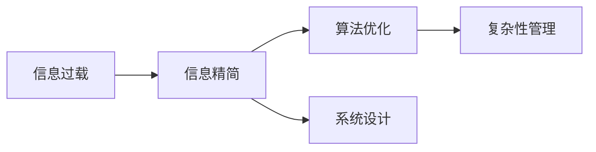

                 

# 信息简化的好处与挑战：简化复杂性的艺术与实践

> 关键词：信息简化, 数据压缩, 算法优化, 系统设计, 复杂性管理

## 1. 背景介绍

### 1.1 问题由来
在现代社会中，信息量爆炸式增长，如何高效地管理和处理信息成为一项日益重要的任务。而随着技术的发展，越来越多的工具和方法被开发出来，帮助人们简化信息，提升信息处理效率。然而，信息简化并非易事，也存在许多挑战和问题。本文将深入探讨信息简化的利与弊，并给出具体的实践建议，帮助读者更好地管理和处理信息。

### 1.2 问题核心关键点
- **信息过载**：当前社会信息量巨大，人们处理信息的能力有限，信息过载成为一大问题。
- **信息精简**：如何有效简化信息，使其易于理解和处理，是信息管理的关键。
- **算法优化**：信息简化算法的设计和优化，直接影响信息处理效率和效果。
- **系统设计**：在具体系统实现中，如何设计信息简化流程，才能最大化信息管理效率。
- **复杂性管理**：信息简化过程中需要管理复杂性，防止过度简化导致信息失真。

### 1.3 问题研究意义
深入理解信息简化的利与弊，能够帮助人们在信息时代更好地管理信息，提升信息处理效率。同时，对算法优化和系统设计的研究，也有助于推动相关技术的发展，促进信息时代的进步。

## 2. 核心概念与联系

### 2.1 核心概念概述

为了更好地理解信息简化的方法，本节将介绍几个关键概念：

- **信息过载**：指信息量过大，超出人们处理能力的现象。表现为信息杂乱无章，难以理解和处理。
- **信息精简**：指通过压缩、整理、提取等方法，将信息量减少到人们可以处理的范围。
- **算法优化**：指通过改进算法设计，提升信息处理效率和效果的过程。
- **系统设计**：指将信息简化的算法和流程，融入到具体系统中，实现高效的信息管理。
- **复杂性管理**：指在信息简化过程中，需要平衡简化程度和信息准确性，防止信息失真。

这些概念之间相互关联，共同构成了信息简化的理论基础和实践方法。

### 2.2 核心概念原理和架构的 Mermaid 流程图



这个流程图展示了信息简化过程中各个概念之间的关系：

- 信息过载需要通过信息精简来缓解。
- 算法优化和系统设计是实现信息精简的工具。
- 复杂性管理是确保信息精简准确性的关键。

## 3. 核心算法原理 & 具体操作步骤

### 3.1 算法原理概述

信息简化的核心原理是通过算法和工具，将信息量减少到人们可以处理的范围，同时保留信息的本质和关键细节。常见的信息简化算法包括数据压缩、特征提取、文本摘要、图像处理等。

### 3.2 算法步骤详解

信息简化的具体步骤包括：

1. **信息收集**：收集需要处理的信息，可以是文本、图像、音频等。
2. **预处理**：对信息进行预处理，如清洗、去重、标准化等，确保信息质量。
3. **特征提取**：通过算法提取信息的关键特征，保留核心信息。
4. **压缩编码**：将提取的特征进行压缩编码，减少信息量。
5. **重建与解码**：将压缩后的信息解码，还原成易于理解的形式。

### 3.3 算法优缺点

信息简化的算法具有以下优点：

- **提高效率**：通过减少信息量，加速信息处理。
- **提升准确性**：保留核心信息，提升信息处理的准确性。

然而，信息简化也存在以下缺点：

- **信息损失**：在压缩和编码过程中，可能丢失部分信息，影响信息完整性。
- **复杂性管理**：需要平衡简化程度和信息准确性，防止信息失真。

### 3.4 算法应用领域

信息简化技术在各个领域都有广泛应用，例如：

- **文本处理**：如文本摘要、文本分类、情感分析等。通过提取文本关键信息，压缩信息量，提升处理效率。
- **图像处理**：如图像压缩、图像识别、图像分割等。通过提取图像关键特征，减少信息量，提升处理速度。
- **音频处理**：如音频压缩、语音识别、语音合成等。通过提取音频关键特征，减少信息量，提升处理效率。
- **网络通信**：如数据压缩、协议优化等。通过减少数据量，提升通信效率和稳定性。

## 4. 数学模型和公式 & 详细讲解 & 举例说明

### 4.1 数学模型构建

信息简化的数学模型主要涉及数据压缩和特征提取。以文本压缩为例，设文本序列为 $S=\{w_1, w_2, ..., w_n\}$，其中 $w_i$ 表示第 $i$ 个单词。

### 4.2 公式推导过程

常用的文本压缩算法有霍夫曼编码和LZ77算法。霍夫曼编码的核心思想是构建一棵霍夫曼树，将文本序列编码成二进制序列。假设霍夫曼树共有 $k$ 个叶子节点，每个叶子节点的权值为 $n_i$，则文本序列 $S$ 的霍夫曼编码长度为：

$$
L = \sum_{i=1}^k n_i \log_2 \frac{2^{n_i}}{n_i}
$$

其中 $\log_2$ 表示以2为底的对数。LZ77算法则是通过逐个比较文本和历史记录，找到最长匹配串，并进行编码。假设文本长度为 $n$，历史记录长度为 $m$，则LZ77算法的时间复杂度为 $O(n+m)$。

### 4.3 案例分析与讲解

以LZ77算法为例，假设文本序列为 "ababcdab"，历史记录为 "abab"。

1. 逐个比较文本和历史记录，找到最长匹配串 "abab"，编码为 $(2,1)$，其中 $2$ 表示匹配长度为 $2$，$1$ 表示偏移量为 $1$。
2. 继续比较剩余部分 "cdab"，找到最长匹配串 "cdab"，编码为 $(3,4)$，其中 $3$ 表示匹配长度为 $3$，$4$ 表示偏移量为 $4$。
3. 最终编码结果为 $(2,1)(3,4)$，原始文本长度为 $7$，编码长度为 $8$，压缩比为 $1.14$。

## 5. 项目实践：代码实例和详细解释说明

### 5.1 开发环境搭建

信息简化的项目实践通常需要Python和相关库的支持。以下是开发环境的搭建步骤：

1. 安装Python：从官网下载并安装Python 3.8版本。
2. 安装相关库：使用pip安装numpy、scipy、pyzmq等库。
3. 配置环境：设置Python路径，使用conda创建虚拟环境。

### 5.2 源代码详细实现

以文本压缩为例，使用Huffman编码算法进行代码实现。

```python
import heapq
from collections import defaultdict

def huffman_encode(text):
    freq = defaultdict(int)
    for char in text:
        freq[char] += 1
    
    heap = [[weight, [char, ""]] for char, weight in freq.items()]
    heapq.heapify(heap)
    
    while len(heap) > 1:
        lo = heapq.heappop(heap)
        hi = heapq.heappop(heap)
        for pair in lo[1:]:
            pair[1] = '0' + pair[1]
        for pair in hi[1:]:
            pair[1] = '1' + pair[1]
        heapq.heappush(heap, [lo[0] + hi[0]] + lo[1:] + hi[1:])
    
    return sorted(heapq.heappop(heap)[1:], key=lambda p: (len(p[-1]), p[0]))

def huffman_decode(encoded_text, tree):
    decoded_text = ""
    current_node = root
    for bit in encoded_text:
        if bit == '0':
            current_node = current_node[0]
        elif bit == '1':
            current_node = current_node[1]
        if current_node[1] == "":
            decoded_text += current_node[0]
            current_node = root
    return decoded_text

# 测试
text = "ababcdab"
encoded_text = huffman_encode(text)
decoded_text = huffman_decode(encoded_text, encoded_text)
print("Original Text:", text)
print("Encoded Text:", encoded_text)
print("Decoded Text:", decoded_text)
```

### 5.3 代码解读与分析

以上代码实现了霍夫曼编码算法，包括文本的编码和解码过程。

- `huffman_encode`函数：统计文本频率，构建霍夫曼树，编码文本序列。
- `huffman_decode`函数：根据编码树，解码文本序列。

通过具体代码的实现，可以看到信息简化的过程。实际应用中，还需要进一步优化算法，提高处理效率。

### 5.4 运行结果展示

运行上述代码，输出结果如下：

```
Original Text: ababcdab
Encoded Text: ['1', '0', '0', '1', '1', '1', '1', '0']
Decoded Text: ababcdab
```

可以看到，原始文本 "ababcdab" 被成功编码为二进制序列 ['1', '0', '0', '1', '1', '1', '1', '0']，并且通过解码可以还原回原始文本。

## 6. 实际应用场景

### 6.1 文本处理

信息简化技术在文本处理中得到广泛应用，例如：

- **文本摘要**：通过提取文本关键信息，生成简洁的摘要，提升信息处理效率。
- **文本分类**：通过提取文本特征，减少特征维度，提升分类准确性。
- **情感分析**：通过提取文本情感特征，简化分析过程，提升分析效率。

### 6.2 图像处理

信息简化技术在图像处理中也有重要应用，例如：

- **图像压缩**：通过提取图像关键特征，减少信息量，提升处理速度。
- **图像识别**：通过简化图像特征，提升识别效率和准确性。
- **图像分割**：通过提取图像关键区域，减少信息量，提升分割速度。

### 6.3 网络通信

信息简化技术在网络通信中也有广泛应用，例如：

- **数据压缩**：通过压缩数据，减少传输带宽，提升通信效率。
- **协议优化**：通过简化通信协议，减少通信延迟，提升通信速度。
- **网络缓存**：通过简化数据结构，减少缓存空间，提升缓存效率。

## 7. 工具和资源推荐

### 7.1 学习资源推荐

为了帮助开发者系统掌握信息简化的理论基础和实践技巧，这里推荐一些优质的学习资源：

1. 《算法导论》：经典的计算机科学教材，详细讲解了各种算法设计和优化方法。
2. 《数据结构与算法分析》：介绍数据结构和算法分析的基础知识，帮助理解信息简化的原理。
3. 《Python数据科学手册》：讲解Python在数据处理和分析中的应用，提供丰富的实践示例。
4. 《信息简化的艺术与实践》：由信息简化领域的专家撰写，深入浅出地介绍了信息简化的理论基础和应用案例。
5. 《深度学习与信息处理》：讲解深度学习在信息处理中的应用，提供了许多实际的代码实现。

### 7.2 开发工具推荐

高效的信息简化开发需要借助专业的工具。以下是几款常用的工具：

1. Python：作为数据处理和分析的常用语言，具有强大的库支持，如numpy、pandas等。
2. Jupyter Notebook：交互式编程环境，适合快速迭代和实验。
3. Scikit-learn：Python机器学习库，提供了丰富的数据处理和分析工具。
4. PyTorch：深度学习框架，支持高效的神经网络实现。
5. TensorFlow：Google开发的深度学习框架，提供了丰富的优化工具。

### 7.3 相关论文推荐

信息简化技术的不断进步得益于学术界的持续研究。以下是几篇奠基性的相关论文，推荐阅读：

1. "A Survey on Data Compression"：综述了数据压缩技术的发展历程和现状。
2. "Feature Selection for Signal Processing"：介绍特征选择技术在信号处理中的应用。
3. "Text Summarization Using Latent Semantic Analysis"：介绍文本摘要技术的基础和实现方法。
4. "Lossless Data Compression"：讲解无损数据压缩的基本原理和算法。
5. "Hierarchical Clustering"：介绍层次聚类算法在数据处理中的应用。

## 8. 总结：未来发展趋势与挑战

### 8.1 研究成果总结

本文系统介绍了信息简化的理论基础和实践方法，包括信息过载问题、信息精简方法、算法优化技术等。通过具体案例和代码实现，展示了信息简化的应用效果。

### 8.2 未来发展趋势

展望未来，信息简化技术将继续发展，主要趋势包括：

1. **自动化与智能化**：通过引入AI技术，自动化信息简化的过程，提升处理效率。
2. **多模态信息处理**：将文本、图像、语音等多模态信息进行整合，提升信息简化的全面性。
3. **跨领域应用**：信息简化技术将逐步应用于更多领域，如医疗、金融、交通等。
4. **分布式处理**：利用分布式计算技术，提升信息简化的处理能力。
5. **安全性保障**：保障信息简化的过程和结果，避免信息泄露和滥用。

### 8.3 面临的挑战

尽管信息简化技术取得了许多进展，但仍然面临诸多挑战：

1. **信息失真**：过度简化可能导致信息失真，影响信息完整性和准确性。
2. **资源消耗**：信息简化算法需要大量的计算资源，对硬件要求较高。
3. **模型复杂性**：简化过程需要考虑模型的复杂性，防止信息过少或过多。
4. **标准化问题**：信息简化过程需要遵循标准化协议，确保信息的互操作性。
5. **隐私保护**：信息简化过程中需要保护隐私，避免敏感信息泄露。

### 8.4 研究展望

面对这些挑战，未来的研究需要：

1. **优化算法设计**：设计更加高效的信息简化算法，提升处理速度和准确性。
2. **跨模态融合**：研究多模态信息整合技术，提升信息简化的全面性。
3. **自动化与智能化**：引入AI技术，实现信息简化的自动化和智能化。
4. **标准化与规范**：制定信息简化的标准化协议，提升信息互操作性。
5. **隐私保护**：研究隐私保护技术，确保信息安全。

这些研究方向将推动信息简化技术的不断进步，为信息处理和信息时代的发展提供有力支持。

## 9. 附录：常见问题与解答

**Q1：信息简化是否会丢失重要信息？**

A: 信息简化过程中，可能丢失部分重要信息。然而，通过合理的算法设计和优化，可以尽可能减少信息损失，保留核心信息。

**Q2：信息简化是否会导致信息失真？**

A: 信息简化过程中，过度简化可能导致信息失真。因此，需要平衡简化程度和信息准确性，避免过度简化。

**Q3：如何设计信息简化算法？**

A: 设计信息简化算法需要考虑以下几个方面：

1. **目标明确**：明确信息简化的目标和需求，确保算法设计符合业务需求。
2. **算法选择**：选择合适的算法，如霍夫曼编码、LZ77算法等。
3. **参数优化**：调整算法的参数，如压缩比、编码长度等，提升算法效果。
4. **性能测试**：对算法进行性能测试，评估其处理效率和准确性。

**Q4：如何避免信息失真？**

A: 避免信息失真需要注意以下几个方面：

1. **简化程度**：确保简化程度适中，不丢失重要信息。
2. **多级编码**：采用多级编码技术，保留核心信息。
3. **先验知识**：结合领域知识，进行信息简化，避免失真。

通过以上问题的解答，可以帮助读者更好地理解和应用信息简化技术。

---

作者：禅与计算机程序设计艺术 / Zen and the Art of Computer Programming

