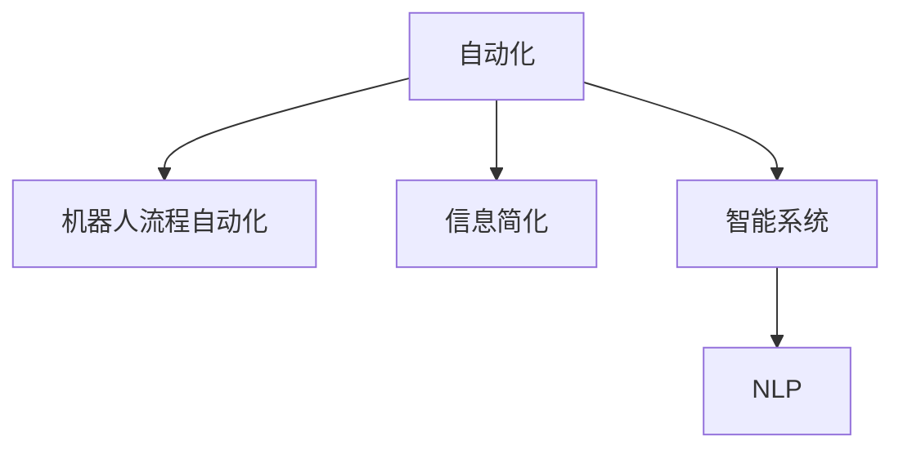
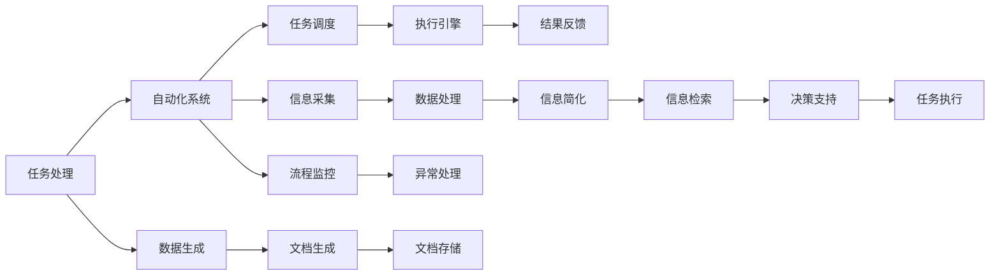

                 

# 信息简化的工具和自动化：利用技术简化你的生活和工作流程

> 关键词：自动化, 信息简化, 人工智能, 技术简化, 智能系统, 机器学习, 工作流程优化, 机器人流程自动化, 自然语言处理

## 1. 背景介绍

### 1.1 问题由来
在现代社会，信息过载成为不争的事实，人们每天都要面对大量冗余和复杂的任务。无论是个人工作还是企业运营，高效的信息管理和任务处理都显得至关重要。这种背景下，自动化技术、人工智能(AI)和信息简化工具的迅猛发展，为解决这一问题提供了新的解决方案。

**背景概述**：
- **信息过载**：随着互联网和数字化技术的发展，信息量呈爆炸式增长。工作和学习中的信息检索、文档整理、任务调度等任务变得异常繁琐和复杂。
- **低效流程**：传统的任务处理方式耗时耗力，容易出错，且难以扩展。自动化工具的应用可以减少重复性劳动，提升效率。
- **技术进步**：人工智能、机器学习、自然语言处理(NLP)等技术的突破，使得信息处理和任务自动化变得更加智能化。

### 1.2 问题核心关键点
如何通过技术手段简化复杂的信息处理任务，提升工作效率，是本文探讨的核心问题。主要关注点包括：

- 如何利用AI和机器学习算法自动化重复性任务？
- 如何设计高效的信息管理工具，减少人工操作？
- 如何构建智能系统，辅助决策和任务调度？
- 如何优化工作流程，实现自动化流程的智能化？

## 2. 核心概念与联系

### 2.1 核心概念概述

为更好地理解如何利用技术简化信息处理，本节将介绍几个关键概念：

- **自动化(Automation)**：通过编程或特定工具实现的任务自动执行，以减少人工操作，提高效率。自动化可以应用在各个领域，包括数据处理、文档生成、任务调度等。

- **机器人流程自动化(RPA)**：一种自动化技术，通过模拟人工操作，自动执行规则定义的业务流程。RPA通常使用视觉识别和脚本执行，特别适合处理重复性高的任务。

- **信息简化(Information Simplification)**：通过自动化的工具和技术，减少信息量、优化信息结构，提升信息处理效率。信息简化可以帮助快速抓取关键信息，减少认知负荷。

- **智能系统(Intelligent Systems)**：利用AI和机器学习技术，构建能够自主学习和决策的系统。智能系统可以自适应环境变化，提供更加智能化的信息处理和任务执行。

- **自然语言处理(NLP)**：AI的一个分支，专注于理解和生成人类语言的技术。NLP在信息检索、文本摘要、情感分析等任务中发挥重要作用。

这些核心概念之间的逻辑关系可以通过以下Mermaid流程图来展示：



这个流程图展示了自动化技术在不同领域的应用，以及信息简化和智能系统如何通过NLP技术实现信息处理和任务自动化的智能化。

### 2.2 核心概念原理和架构的 Mermaid 流程图

由于空间限制，以下仅展示部分核心概念的原理和架构：



该图展示了自动化系统从任务处理到结果反馈的全过程，其中涉及了数据采集、处理、信息简化、信息检索、决策支持和任务执行等关键步骤。

## 3. 核心算法原理 & 具体操作步骤

### 3.1 算法原理概述

本节将介绍利用技术简化信息处理任务的基本原理。通过自动化、机器人流程自动化、信息简化和智能系统，可以将复杂的信息处理任务转换为更加简洁和高效的操作。

**基本原理**：
- **自动化处理**：将复杂的任务分解为多个自动化步骤，减少人工干预，提高处理效率。
- **信息简化**：通过提取和精简关键信息，减少信息冗余，提高信息处理速度。
- **智能决策**：利用AI和机器学习算法，自动化处理复杂决策，提高决策的准确性和效率。

### 3.2 算法步骤详解

下面详细阐述利用技术简化信息处理的具体步骤：

1. **任务分解与定义**：将复杂任务分解为若干可自动化处理的步骤，并定义每个步骤的具体要求和输入输出。

2. **数据采集与预处理**：使用API或数据抓取工具，从不同来源收集数据，并进行数据清洗、去重和格式转换等预处理工作。

3. **信息简化与抽取**：利用NLP技术进行文本分析，提取关键信息和关键词，构建简化的信息模型。

4. **自动化执行与监控**：将简化后的信息模型输入自动化系统，执行预设的自动化流程，并实时监控流程执行情况，及时发现并处理异常。

5. **结果反馈与优化**：根据执行结果，进行反馈分析，优化自动化流程和信息模型，持续提升信息处理效率。

### 3.3 算法优缺点

基于技术的信息简化工具和自动化流程具有以下优点：

- **提升效率**：自动化和信息简化大大减少了人工干预，提高了信息处理速度和工作效率。
- **降低成本**：通过减少人工操作和数据冗余，降低了信息处理和运营成本。
- **提高准确性**：利用AI和机器学习算法，提升了决策的准确性和自动化流程的鲁棒性。

然而，这些技术也存在一些局限性：

- **依赖技术**：工具和算法的效果依赖于技术的成熟度，技术失效或漏洞可能导致错误。
- **数据质量**：信息简化和自动化执行依赖高质量的数据输入，数据错误或偏差可能影响结果。
- **初始投资高**：开发和部署自动化系统需要较高的初始投入，对于中小企业可能难以承担。
- **复杂性增加**：自动化流程的设计和维护需要专业知识，可能增加复杂性和学习成本。

### 3.4 算法应用领域

基于技术的信息简化和自动化工具在多个领域均有应用，包括但不限于：

- **企业运营**：用于订单处理、客户服务、供应链管理等，通过自动化减少人工操作，提高运营效率。
- **医疗健康**：用于患者信息管理、医疗记录处理、医疗咨询等，通过信息简化和智能决策，提升医疗服务质量。
- **金融服务**：用于财务报表分析、风险评估、投资决策等，通过自动化和智能系统，提供精准的金融服务。
- **教育培训**：用于课程设计、学生评估、学习推荐等，通过信息简化和个性化推荐，优化教育资源配置。
- **政府服务**：用于行政审批、公共服务、政策分析等，通过自动化和智能系统，提升政府工作效率和服务质量。

## 4. 数学模型和公式 & 详细讲解 & 举例说明

### 4.1 数学模型构建

本节将使用数学语言对信息简化和自动化的基本模型进行描述。

**信息简化模型**：
- **输入**：原始信息 $X$，形式为文本、数据等。
- **处理**：利用NLP技术提取关键信息 $I$，并进行信息精简。
- **输出**：简化后的信息 $S$，形式为关键词、摘要等。

数学表示为：
$$ S = f(I) $$

**自动化执行模型**：
- **输入**：简化后的信息 $S$，形式为指令、任务等。
- **处理**：利用自动化工具和算法执行任务 $A$，生成结果 $R$。
- **输出**：执行结果 $R$，形式为数据、文档等。

数学表示为：
$$ R = g(S) $$

### 4.2 公式推导过程

**信息简化公式推导**：
假设原始信息 $X$ 包含 $n$ 个单词，利用NLP技术提取关键词，统计单词出现频率，构建关键词集合 $K$。
$$ K = \{ w_1, w_2, ..., w_m \} $$
其中 $w_i$ 表示第 $i$ 个关键词。

计算每个关键词 $w_i$ 的权重 $w_i$，作为信息简化后权重分布。
$$ w_i = \frac{\text{出现次数}}{\text{总单词数}} $$

最终简化后的信息 $S$ 为：
$$ S = \{ w_1, w_2, ..., w_m \} $$

**自动化执行公式推导**：
假设简化后的信息 $S$ 包含 $m$ 个指令，每个指令 $s_j$ 对应一个自动化任务 $a_j$，执行结果为 $r_j$。

根据指令 $s_j$ 执行任务 $a_j$，生成结果 $r_j$。
$$ r_j = a_j(s_j) $$

最终执行结果 $R$ 为：
$$ R = \{ r_1, r_2, ..., r_m \} $$

### 4.3 案例分析与讲解

以企业订单处理为例，分析信息简化和自动化的应用：

**原始订单信息**：包含客户信息、订单详情、配送信息等，格式复杂，数据量大。

**信息简化**：使用NLP技术提取关键词，如订单号、客户ID、配送地址等，构建简化的信息模型。

**自动化执行**：根据简化后的信息模型，执行自动化流程，包括订单确认、配货、配送等步骤。

**结果反馈**：记录执行结果和反馈信息，进行自动化流程优化，提升处理效率和准确性。

## 5. 项目实践：代码实例和详细解释说明

### 5.1 开发环境搭建

在进行信息简化和自动化项目开发前，需要先搭建开发环境：

1. **安装Python**：从官网下载并安装Python，确保版本为3.8以上。
2. **安装相关库**：使用pip安装必要的Python库，如NLTK、spaCy、pandas、numpy等。
3. **配置开发环境**：使用Anaconda创建虚拟环境，避免与其他项目冲突。

### 5.2 源代码详细实现

以下是使用Python实现信息简化和自动化的一个简要示例代码：

```python
import nltk
from nltk.corpus import stopwords
from nltk.tokenize import word_tokenize
from nltk.stem import WordNetLemmatizer
from sklearn.feature_extraction.text import CountVectorizer

# 输入原始信息
raw_text = "Sample text for analysis"

# 信息简化
# 1. 分词和词干提取
tokens = word_tokenize(raw_text)
lemmatizer = WordNetLemmatizer()
tokens = [lemmatizer.lemmatize(token) for token in tokens if token not in stopwords.words('english')]

# 2. 关键词提取
vectorizer = CountVectorizer()
features = vectorizer.fit_transform(tokens)
keywords = vectorizer.get_feature_names_out()
weighted_keywords = features.toarray().flatten()

# 自动化执行
# 假设关键词作为指令执行自动化流程
automation_result = execute_automation(keywords)

# 输出简化后的信息和执行结果
print("简化的信息模型：", keywords)
print("执行结果：", automation_result)
```

**代码解释**：
- **分词和词干提取**：使用nltk库进行分词和词干提取，去除停用词，保留关键信息。
- **关键词提取**：使用CountVectorizer进行文本向量化，提取关键词。
- **自动化执行**：执行自定义的自动化流程，返回执行结果。
- **结果输出**：输出简化后的信息模型和执行结果。

### 5.3 代码解读与分析

**分词与词干提取**：
- **目的**：通过分词和词干提取，去除无意义的停用词，提取关键信息。
- **实现**：使用nltk库进行分词，并使用WordNetLemmatizer进行词干提取，去除停用词。

**关键词提取**：
- **目的**：将原始文本转化为关键词集合，便于后续自动化处理。
- **实现**：使用CountVectorizer进行文本向量化，提取关键词。

**自动化执行**：
- **目的**：根据关键词执行自动化流程，生成结果。
- **实现**：执行自定义的自动化函数，返回结果。

**结果输出**：
- **目的**：展示简化后的信息和执行结果。
- **实现**：通过print函数输出信息模型和执行结果。

## 6. 实际应用场景

### 6.1 企业运营管理

**场景描述**：
某企业需要对大量的订单信息进行自动化处理，包括订单确认、配货、配送等步骤。

**信息简化**：
- **原始订单信息**：包含客户信息、订单详情、配送信息等，格式复杂，数据量大。
- **简化信息模型**：提取订单号、客户ID、配送地址等关键信息，构建简化的信息模型。

**自动化执行**：
- **自动化流程**：使用RPA工具自动执行订单确认、配货、配送等步骤。
- **执行结果**：生成订单确认单、配送记录等，提升处理效率。

### 6.2 金融风险管理

**场景描述**：
某金融机构需要实时监控市场动态，评估风险，生成决策报告。

**信息简化**：
- **原始数据**：包含股票、债券、商品等市场数据，格式复杂，数据量大。
- **简化信息模型**：提取市场趋势、价格波动等关键信息，构建简化的信息模型。

**自动化执行**：
- **自动化流程**：使用AI算法实时监控市场动态，生成风险报告。
- **执行结果**：生成风险评估报告，提供决策依据。

### 6.3 智慧医疗

**场景描述**：
某医院需要对患者信息进行自动化处理，包括病历管理、诊断决策等。

**信息简化**：
- **原始病历信息**：包含详细的历史记录、病情描述、检查结果等，格式复杂，数据量大。
- **简化信息模型**：提取病情、检查结果等关键信息，构建简化的信息模型。

**自动化执行**：
- **自动化流程**：使用智能系统自动处理病历信息，生成诊断报告。
- **执行结果**：提供诊断报告，辅助医生决策。

### 6.4 未来应用展望

未来，基于技术的信息简化和自动化将迎来更广泛的应用，为各行各业带来新的变革。以下是几个可能的未来应用方向：

- **智能客服**：通过自动化工具和信息简化，构建智能客服系统，提供24/7不间断服务。
- **自动化设计**：使用AI和机器学习算法，自动化设计流程，提高设计效率和创新能力。
- **智能物流**：利用自动化和信息简化，优化物流流程，提升配送效率。
- **智慧城市**：构建智能城市管理系统，实现智能交通、智能安防、智能环保等功能。

## 7. 工具和资源推荐

### 7.1 学习资源推荐

为帮助开发者深入学习信息简化和自动化的技术，推荐以下学习资源：

1. **《Python自然语言处理》书籍**：介绍Python在NLP中的应用，包括文本分析、情感分析、文本分类等。
2. **Coursera《机器学习》课程**：斯坦福大学开设的机器学习课程，涵盖监督学习、无监督学习、强化学习等内容。
3. **Kaggle平台**：提供大量数据集和机器学习竞赛，有助于实践和提升技能。
4. **Google AI博客**：Google AI团队发布的博客，涵盖最新的AI技术和发展趋势。
5. **Arxiv论文库**：涵盖前沿的AI和NLP研究论文，了解最新研究进展。

### 7.2 开发工具推荐

以下是几个常用的信息简化和自动化开发工具：

1. **Python编程语言**：简单易学，拥有丰富的库和框架，适合信息简化和自动化开发。
2. **RPA工具**：如UiPath、Blue Prism等，用于自动化流程执行，减少人工操作。
3. **自然语言处理工具**：如NLTK、spaCy、Hugging Face Transformers等，提供丰富的NLP功能。
4. **数据处理工具**：如Pandas、NumPy、Dask等，用于数据处理和分析。
5. **可视化工具**：如Matplotlib、Seaborn、Plotly等，用于数据可视化。

### 7.3 相关论文推荐

以下是几篇关于信息简化和自动化的重要论文，推荐阅读：

1. **"Rethinking Reasoning in Neural Networks"**：探讨如何利用神经网络进行自动化决策，提升推理能力。
2. **"BERT: Pre-training of Deep Bidirectional Transformers for Language Understanding"**：提出BERT模型，通过自监督预训练提升NLP任务性能。
3. **"Attention is All You Need"**：提出Transformer结构，通过自注意力机制提升NLP任务性能。
4. **"Human-level control through deep reinforcement learning"**：利用深度强化学习算法，自动化复杂决策。
5. **"AdaLoRA: Adaptive Low-Rank Adaptation for Parameter-Efficient Fine-Tuning"**：提出参数高效微调方法，提升模型效率和性能。

## 8. 总结：未来发展趋势与挑战

### 8.1 研究成果总结

基于技术的信息简化和自动化技术在多个领域展示了巨大的应用潜力，推动了各行各业效率提升和智能化转型。主要成果包括：

- **自动化工具**：减少了人工操作，提升了信息处理效率和工作质量。
- **信息简化技术**：提取关键信息，减少了信息冗余，提高了信息处理速度。
- **智能决策系统**：利用AI和机器学习算法，提高了决策的准确性和效率。

### 8.2 未来发展趋势

未来，信息简化和自动化技术将进一步发展，推动各行各业智能化水平提升：

1. **自动化流程的智能化**：通过引入AI和机器学习算法，自动化流程将更加智能和灵活。
2. **跨领域应用拓展**：信息简化和自动化技术将在更多领域得到应用，推动跨领域融合。
3. **数据驱动决策**：基于大数据和深度学习算法，提升决策的科学性和准确性。
4. **人机协同**：实现人与自动化系统的协同工作，提升工作效率和用户体验。

### 8.3 面临的挑战

尽管信息简化和自动化技术带来了诸多便利，但也面临一些挑战：

1. **技术依赖**：自动化工具和算法的效果依赖于技术的成熟度，技术失效或漏洞可能导致错误。
2. **数据质量**：信息简化和自动化执行依赖高质量的数据输入，数据错误或偏差可能影响结果。
3. **成本投入**：开发和部署自动化系统需要较高的初始投入，对于中小企业可能难以承担。
4. **系统复杂性**：自动化流程的设计和维护需要专业知识，可能增加复杂性和学习成本。

### 8.4 研究展望

未来，信息简化和自动化技术的研究将集中在以下几个方面：

1. **提升系统鲁棒性**：研究如何提高自动化系统的鲁棒性和抗干扰能力。
2. **增强系统可解释性**：通过引入可解释性技术，提升自动化系统的透明性和可理解性。
3. **优化系统性能**：研究如何优化信息处理和自动化执行的效率和精度。
4. **拓展应用场景**：探索更多应用场景，推动信息简化和自动化技术在各领域的广泛应用。

## 9. 附录：常见问题与解答

### Q1：如何选择合适的自动化工具和算法？

A：选择合适的自动化工具和算法需要考虑以下几个因素：
1. **任务复杂度**：自动化任务的复杂度决定了是否需要引入高级算法，如机器学习或深度学习。
2. **数据类型**：不同类型的数据可能需要不同的处理方式，如图像、文本、音频等。
3. **性能要求**：自动化任务对性能的要求不同，需要根据实际需求选择合适的工具和算法。
4. **可扩展性**：自动化系统需要具备良好的可扩展性，以便未来根据需要调整和扩展。

### Q2：自动化流程中如何避免错误？

A：避免自动化流程中错误需要以下几个步骤：
1. **数据清洗**：确保输入数据的质量和一致性，减少数据错误和偏差。
2. **算法验证**：使用测试数据集验证算法的准确性和鲁棒性，确保算法稳定可靠。
3. **异常监控**：实时监控自动化流程的执行情况，及时发现并处理异常。
4. **人工干预**：在关键节点引入人工干预，确保自动化流程的正确性和可解释性。

### Q3：信息简化技术的应用有哪些局限性？

A：信息简化技术的应用存在以下局限性：
1. **依赖算法**：信息简化效果依赖算法的质量和参数设置，不同算法可能产生不同结果。
2. **数据限制**：信息简化需要高质量的数据输入，数据不足可能影响结果。
3. **语义理解**：信息简化技术的理解能力有限，可能无法完全理解复杂文本。
4. **应用场景限制**：信息简化技术可能不适用于某些特定领域或特定任务。

### Q4：如何构建智能系统？

A：构建智能系统需要以下几个步骤：
1. **需求分析**：明确系统的功能需求和目标。
2. **算法选择**：选择合适的算法和技术，进行系统设计。
3. **数据准备**：准备数据集，进行数据预处理和清洗。
4. **系统实现**：根据需求设计和实现系统，进行测试和优化。
5. **部署和监控**：部署系统并进行实时监控，及时发现并处理问题。

### Q5：信息简化和自动化技术未来有哪些发展方向？

A：信息简化和自动化技术的未来发展方向包括：
1. **自动化流程的智能化**：引入AI和机器学习算法，提升自动化流程的智能化水平。
2. **跨领域应用拓展**：推动信息简化和自动化技术在更多领域的应用，推动跨领域融合。
3. **数据驱动决策**：基于大数据和深度学习算法，提升决策的科学性和准确性。
4. **人机协同**：实现人与自动化系统的协同工作，提升工作效率和用户体验。

通过不断探索和创新，信息简化和自动化技术必将为各行各业带来更高效、更智能的工作方式，提升整体生产力和创新能力。

---

作者：禅与计算机程序设计艺术 / Zen and the Art of Computer Programming

