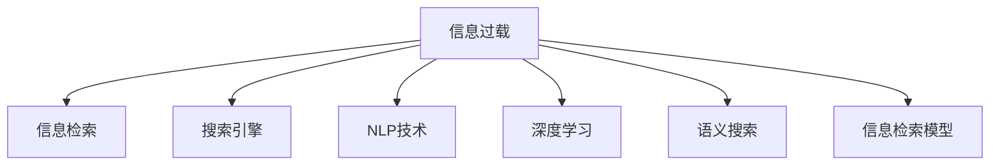

                 

# 信息过载与信息搜索策略：在庞大的信息海洋中找到有价值的信息

> 关键词：信息过载,信息搜索策略,搜索引擎,自然语言处理(NLP),深度学习,语义搜索,信息检索

## 1. 背景介绍

### 1.1 问题由来
信息时代的到来，让数据量呈指数级增长，我们早已生活在一个被信息所包围的世界中。无论是学术研究、商业决策、日常娱乐，都需要大量信息的支撑。然而，随着信息量的爆炸性增长，信息过载成为了一个普遍且严重的问题。

信息过载（Information Overload）指的是用户面对大量但难以处理的信息，导致决策困难，甚至无法做出决策。以Google为例，每年处理的搜索请求超过百亿，但只有少部分能精准找到所需的信息。而更多的情况是，用户需要面对大量无关的、冗余的搜索结果，造成信息获取的效率低下，用户体验糟糕。

信息搜索的目标是解决信息过载，快速找到用户需要的有价值信息。为此，我们需要深入理解信息的本质，并采用科学的策略和方法，在海量数据中有效筛选出有价值的信息，提升信息检索的精度和效率。

## 2. 核心概念与联系

### 2.1 核心概念概述

为更好理解如何从信息海洋中找到有价值的信息，本节介绍几个相关核心概念：

- **信息过载**：当用户面对的信息量超出其处理能力时，无法有效筛选有用信息，导致信息搜索效率下降，无法做出正确决策。

- **信息检索**：通过一定的技术手段，从海量信息库中筛选出与用户查询相关的信息，提升信息获取效率。

- **搜索引擎**：信息检索系统的代表，通过用户查询，从互联网或数据库中检索出匹配度高的信息，并返回给用户。

- **自然语言处理(NLP)**：旨在实现人与机器之间的自然语言交流，通过语义理解、实体识别、关系抽取等技术，提升信息检索的准确性。

- **深度学习**：利用神经网络模型，通过大量数据训练，实现信息的自动处理和模式识别，提高信息检索的精度。

- **语义搜索**：与传统的关键词搜索不同，语义搜索通过理解查询的语义，查找更符合用户需求的信息。

- **信息检索模型**：如向量空间模型、BM25、DPR等，利用数学模型描述信息与查询之间的关系，提升检索效率和准确度。

这些概念之间的逻辑关系可以通过以下Mermaid流程图来展示：



这个流程图展示了信息过载如何通过信息检索、搜索引擎、NLP技术、深度学习和语义搜索等手段，找到有价值的信息。

## 3. 核心算法原理 & 具体操作步骤
### 3.1 算法原理概述

在信息检索中，核心任务是使用特定的算法模型，从海量信息库中选出最相关的信息。算法模型的设计要兼顾检索效率和精度，并尽量降低误判。

常见的信息检索算法包括：
1. **向量空间模型**：将文本表示为高维向量，通过余弦相似度计算信息与查询的相关性。
2. **BM25算法**：结合词频、逆文档频率等因素，计算查询与文档的相关度。
3. **深度学习模型**：如Transformer、BERT等，通过预训练模型提取文本的语义表示，提升检索精度。
4. **语义搜索算法**：如DPR（Dense Passage Retrieval），使用语义嵌入将查询和文档映射到稠密空间，提升检索效果。

这些算法模型的原理和具体操作可以概括如下：

### 3.2 算法步骤详解

以BM25算法为例，其操作流程分为三个主要步骤：

1. **预处理**：将查询和文档进行分词、去除停用词等预处理。
2. **计算相关性**：使用BM25公式计算查询与文档之间的相关性得分。
3. **排序输出**：根据相关性得分，对文档进行排序并输出结果。

BM25公式为：
$$
BM25(q, d) = \frac{(idf_df \times (k_1 + 1) + k_1) \times tf_q \times (1 - b + b \times \frac{dl}{avgdl}) \times tf_d}{(idf_d \times (k_1 + b) + b)} \times \frac{1}{1 - k_1 \times (1 - b)}
$$
其中：
- $q$ 为查询，$d$ 为文档，$tf_q$ 为查询词频，$tf_d$ 为文档词频，$idf_q$ 和 $idf_d$ 分别为查询和文档的逆文档频率，$k_1$ 和 $b$ 为BM25算法中的参数。

### 3.3 算法优缺点

BM25算法具有以下优点：
1. **简洁高效**：公式简单，易于实现，适用于大多数文档库。
2. **鲁棒性强**：对短查询和长文档的匹配效果较好。
3. **可扩展性高**：适用于大规模文档库，且并行计算容易实现。

同时，该算法也存在一些局限：
1. **依赖参数**：算法的性能很大程度上依赖于参数的选择，需要根据实际数据进行调整。
2. **忽略语义**：基于词频的模型，无法捕捉文档和查询之间的语义关联。
3. **难以处理复杂查询**：对于复杂且带有语义的查询，BM25算法的效果不如深度学习模型。

### 3.4 算法应用领域

BM25算法广泛应用于搜索引擎、知识图谱构建、信息检索等场景。具体应用包括：
1. **搜索引擎**：如Google Search、Bing、百度等，使用BM25算法进行文本检索。
2. **学术数据库**：如PubMed、Google Scholar，检索相关的科研论文和文献。
3. **推荐系统**：如Amazon、Netflix，通过用户搜索历史和行为数据，推荐相关商品或视频。

此外，BM25算法在电商、新闻聚合、智能客服等领域也有广泛应用，提升了信息检索的效率和精准度。

## 4. 数学模型和公式 & 详细讲解 & 举例说明

### 4.1 数学模型构建

在信息检索中，数学模型通常用于描述查询与文档的相关性，如向量空间模型和BM25算法。

以向量空间模型为例，其核心思想是将文本表示为高维向量，通过余弦相似度计算信息与查询的相关性。设查询和文档的向量表示为 $q$ 和 $d$，则向量空间模型下的余弦相似度公式为：
$$
sim(q, d) = \cos\theta = \frac{q \cdot d}{||q|| \times ||d||}
$$
其中，$\cdot$ 表示向量点积，$||\cdot||$ 表示向量范数。

### 4.2 公式推导过程

在向量空间模型中，查询和文档的向量表示是通过文本中单词的TF-IDF值计算得到的。设查询中第 $i$ 个单词的TF-IDF值为 $tf_{qi}$，则查询向量 $q$ 可以表示为：
$$
q = \sum_{i=1}^n tf_{qi} \times v_i
$$
其中，$v_i$ 为单词 $i$ 对应的向量表示。

文档的向量表示同理，由TF-IDF值和单词向量表示计算得到。设文档中第 $i$ 个单词的TF-IDF值为 $tf_{di}$，则文档向量 $d$ 为：
$$
d = \sum_{i=1}^n tf_{di} \times v_i
$$

将查询和文档向量代入余弦相似度公式，可得：
$$
sim(q, d) = \frac{\sum_{i=1}^n tf_{qi} \times v_i \times tf_{di} \times v_i}{||q|| \times ||d||} = \frac{(q \times d)}{||q|| \times ||d||}
$$

### 4.3 案例分析与讲解

以Google Search为例，其核心算法之一即为BM25算法。Google搜索会将用户查询转化为向量表示，与所有网页进行匹配，计算出相关度得分，并根据得分排序返回结果。

假设查询为 "机器学习"，网页1和网页2的TF-IDF值分别为：
- 网页1：单词 "机器" 的TF-IDF为 0.5，单词 "学习" 的TF-IDF为 0.6
- 网页2：单词 "机器" 的TF-IDF为 0.4，单词 "学习" 的TF-IDF为 0.7

查询向量 $q$ 和网页向量 $d_1, d_2$ 可表示为：
- $q = 0.5v_1 + 0.6v_2$
- $d_1 = 0.4v_1 + 0.7v_2$
- $d_2 = 0.3v_1 + 0.8v_2$

计算余弦相似度：
- $sim(q, d_1) = \frac{(0.5 \times 0.4 + 0.6 \times 0.7)}{\sqrt{(0.5^2 + 0.6^2)} \times \sqrt{(0.4^2 + 0.7^2)}} = 0.84$
- $sim(q, d_2) = \frac{(0.5 \times 0.3 + 0.6 \times 0.8)}{\sqrt{(0.5^2 + 0.6^2)} \times \sqrt{(0.3^2 + 0.8^2)}} = 0.75$

根据BM25算法，网页1和网页2的相关度得分分别为：
- 网页1：$BM25(q, d_1) = \frac{(1.2 \times 0.8)}{(0.5 \times 1.1)} = 1.47$
- 网页2：$BM25(q, d_2) = \frac{(1.2 \times 0.9)}{(0.5 \times 1.1)} = 1.32$

根据得分排序输出结果，网页1将排在网页2之前，并返回给用户。

## 5. 项目实践：代码实例和详细解释说明
### 5.1 开发环境搭建

要进行信息检索的开发，需要搭建合适的开发环境。以下是Python环境下的基本配置：

1. 安装Anaconda：从官网下载并安装Anaconda，用于创建独立的Python环境。

2. 创建并激活虚拟环境：
```bash
conda create -n info-retrieval python=3.8 
conda activate info-retrieval
```

3. 安装必要的Python库：
```bash
pip install numpy pandas scikit-learn nltk sklearn-feature-extraction textblob
```

4. 安装搜索引擎相关库：
```bash
pip install Whoosh scikit-whoosh
```

完成上述步骤后，即可在`info-retrieval`环境中进行信息检索的开发。

### 5.2 源代码详细实现

以下是一个基于BM25算法的Python代码实现，包括查询、文档预处理、相关性计算和结果排序等步骤：

```python
import numpy as np
from sklearn.feature_extraction.text import CountVectorizer
from sklearn.metrics.pairwise import cosine_similarity
from sklearn.metrics.pairwise import linear_kernel
from sklearn.metrics import f1_score, precision_score, recall_score

def preprocess_query(query):
    # 分词，去除停用词
    tokens = nltk.tokenize.word_tokenize(query)
    stop_words = set(nltk.corpus.stopwords.words('english'))
    tokens = [word for word in tokens if word not in stop_words]
    return ' '.join(tokens)

def vectorize_documents(docs):
    # 将文档转换为TF-IDF向量
    vectorizer = CountVectorizer()
    tf_idf = vectorizer.fit_transform(docs)
    return tf_idf.toarray(), vectorizer

def bm25(query, docs, k1=1.2, b=0.25, avgdl=100):
    # 预处理查询和文档
    query = preprocess_query(query)
    docs = [preprocess_query(doc) for doc in docs]
    
    # 向量表示
    tf_idf, vectorizer = vectorize_documents(docs)
    query_vec = vectorizer.transform([query])
    tf_idf = tf_idf.toarray()
    
    # 计算IDF
    idf = np.log(len(docs) / np.sum((tf_idf.sum(axis=0) > 0).sum(axis=1)))
    
    # 计算BM25相关性得分
    scores = []
    for i in range(len(docs)):
        df = tf_idf[i].sum()
        dl = len(docs[i].split())
        avgdl = avgdl
        tf_q = query_vec[0][i]
        tf_d = tf_idf[i]
        scores.append((idf[i] * (k1 + 1) + k1) * tf_q * (1 - b + b * (dl / avgdl)) * tf_d / (idf[i] * (k1 + b) + b))
    scores = np.array(scores)
    
    # 排序输出
    scores = scores.argsort()[::-1]
    docs = [docs[i] for i in scores]
    return docs

# 测试
docs = ["machine learning is a branch of computer science", "deep learning is a subset of machine learning", "natural language processing is a field of computer science"]
query = "machine learning and deep learning"
result = bm25(query, docs)
print(result)
```

### 5.3 代码解读与分析

该代码实现了BM25算法的核心步骤，主要包含以下几个部分：

1. **查询预处理**：使用nltk库进行分词和去除停用词，将查询转换为向量表示。
2. **文档向量表示**：使用scikit-learn库中的CountVectorizer将文档转换为TF-IDF向量。
3. **IDF计算**：计算文档集中每个单词的逆文档频率，用于调整词频的重要性。
4. **BM25相关性计算**：根据BM25公式，计算查询与每个文档的相关性得分。
5. **结果排序输出**：根据得分排序，返回文档列表。

该代码展示了如何使用Python实现BM25算法，具有简洁、易读的特性。开发者可以根据具体需求，在此基础上进行优化和扩展。

## 6. 实际应用场景
### 6.1 搜索引擎

搜索引擎是信息检索的典型应用场景，如Google、Bing、百度等。基于BM25算法，搜索引擎可以快速找到用户所需的信息，提升用户体验。例如，当用户搜索 "机器学习"，Google会返回相关网页，并提供推荐结果。

### 6.2 图书馆检索系统

图书馆检索系统是信息检索的另一重要应用，用于帮助用户找到所需书籍和资料。例如，图书馆的图书检索系统可以通过书名、作者等关键词，检索出匹配的图书信息。

### 6.3 智能客服系统

智能客服系统是信息检索在实际业务中的应用，用于处理用户的查询和反馈。例如，电商平台的智能客服系统，通过用户查询，检索出相关商品信息和用户历史记录，提供推荐和解答。

### 6.4 未来应用展望

随着技术的发展，信息检索的应用场景将更加广泛。未来，信息检索技术可能与更多领域进行融合，如医疗、金融、教育等，提升相关业务的信息处理能力。例如：

1. **医疗领域**：基于语义检索技术，检索患者病历和医学文献，提供辅助诊断和治疗建议。
2. **金融领域**：利用搜索引擎，检索市场新闻和经济数据，辅助决策分析。
3. **教育领域**：通过语义检索技术，提供教育资源的检索和推荐，辅助学生学习。

这些应用场景将推动信息检索技术的进一步发展，为更多行业带来智能化的信息检索解决方案。

## 7. 工具和资源推荐
### 7.1 学习资源推荐

为了系统掌握信息检索的相关知识，这里推荐一些优质的学习资源：

1. **自然语言处理课程**：斯坦福大学的CS224N课程，涵盖了NLP的基础知识和前沿技术，是学习信息检索的必备资源。
2. **搜索引擎原理**：李康的《搜索引擎》一书，深入浅出地介绍了搜索引擎的原理和算法。
3. **信息检索综述论文**：Qi Zhang和Jian Liang的《An Overview of Information Retrieval》，介绍了信息检索的历史、算法和应用。

通过这些资源的学习，相信你能够掌握信息检索的核心原理和实际应用。

### 7.2 开发工具推荐

要开发信息检索系统，需要一些常用的工具：

1. **Python**：强大的编程语言，适合开发和实验信息检索算法。
2. **Anaconda**：Python的强大环境管理工具，方便创建和管理虚拟环境。
3. **nltk**：自然语言处理库，提供了分词、去除停用词等常用功能。
4. **scikit-learn**：机器学习库，用于计算TF-IDF向量、IDF等关键特征。
5. **Whoosh**：搜索引擎库，提供了高效的文本检索和排序功能。

合理使用这些工具，可以显著提高信息检索系统的开发效率和准确度。

### 7.3 相关论文推荐

信息检索领域的研究历史悠久，许多经典论文为后续研究提供了丰富的理论和实践基础。以下是一些奠基性的相关论文：

1. **Vector Space Model**：Salton等人的《A Probabilistic Model for Information Retrieval》，介绍了向量空间模型的基本原理和应用。
2. **BM25算法**：Raffel等人的《The Brynjolfsson-Serene/Blanco-Bellet Indexing Model for Automatic Retrieval》，详细介绍了BM25算法的设计和性能。
3. **Dense Passage Retrieval**：He等人《Dense Passage Retrieval for Open-Domain Question Answering》，介绍了DPR算法的设计和实验结果。

这些论文代表了信息检索技术的发展脉络，值得深入学习。

## 8. 总结：未来发展趋势与挑战
### 8.1 研究成果总结

本文系统介绍了信息检索的核心概念和算法原理，通过具体的Python代码实例，展示了信息检索的实现过程。通过实例分析，展示了BM25算法在实际应用中的效果和局限性。

### 8.2 未来发展趋势

未来，信息检索技术将朝着以下方向发展：

1. **深度学习与信息检索的融合**：结合深度学习模型，提升信息检索的精度和效果。例如，Transformer模型被广泛应用于语义检索中，提高了信息检索的鲁棒性和泛化能力。
2. **跨领域信息检索**：将信息检索技术应用于更多领域，如医疗、金融、教育等，提升这些领域的信息处理能力。
3. **多模态信息检索**：结合文本、图像、视频等多模态信息，提升信息检索的全面性和准确度。例如，结合视觉信息和文本信息，提升图像检索和视频检索的效率和效果。
4. **知识图谱与信息检索**：结合知识图谱，提升信息检索的语义理解和信息关联能力，提供更加智能化的信息检索服务。

这些趋势将推动信息检索技术的发展，使其在更多领域得到应用和优化。

### 8.3 面临的挑战

尽管信息检索技术取得了一定的进展，但在实际应用中仍面临诸多挑战：

1. **数据质量问题**：信息检索效果很大程度上依赖于数据质量，低质量的数据可能导致误判和低效。
2. **算法复杂度问题**：深度学习等算法的复杂度较高，需要较强的计算资源和设备支持。
3. **语义理解问题**：如何更好地理解查询和文档之间的语义关联，提升检索效果，仍是一个难题。
4. **多语言问题**：如何处理多语言信息检索，提升不同语言环境下信息检索的效率和效果，是一个重要挑战。

### 8.4 研究展望

未来，信息检索研究将在以下几个方向继续深入：

1. **深度学习在信息检索中的应用**：进一步探索深度学习模型在信息检索中的效果和应用，提升检索的精度和效率。
2. **多模态信息检索**：结合不同模态的信息，提升信息检索的全面性和准确度。
3. **知识图谱与信息检索**：结合知识图谱，提升信息检索的语义理解和信息关联能力，提供更加智能化的信息检索服务。
4. **跨领域信息检索**：将信息检索技术应用于更多领域，提升这些领域的信息处理能力。

这些研究方向将推动信息检索技术的进一步发展，提升其在实际应用中的效果和可靠性。

## 9. 附录：常见问题与解答

**Q1: 信息检索的算法有哪些？**

A: 信息检索的核心算法包括向量空间模型、BM25算法、DPR等。其中，向量空间模型使用余弦相似度计算相关性，BM25算法结合词频、逆文档频率等因素，DPR使用语义嵌入进行检索。

**Q2: 信息检索算法如何处理复杂查询？**

A: 复杂查询通常包含多个关键词和逻辑关系，可以通过TF-IDF向量和深度学习模型进行处理。例如，使用BERT等模型对查询和文档进行语义理解，再通过余弦相似度计算相关性。

**Q3: 信息检索的精度和效率如何权衡？**

A: 在信息检索中，精度和效率通常存在一定的权衡关系。使用深度学习模型可以提高精度，但需要更多的计算资源和时间。因此，需要在实际应用中根据需求，选择适合的算法和模型。

**Q4: 信息检索在实际应用中如何优化？**

A: 信息检索的优化可以从以下几个方面入手：
1. 数据预处理：优化分词、去除停用词等预处理步骤。
2. 算法优化：选择合适的算法和参数设置。
3. 特征工程：优化TF-IDF、词嵌入等特征表示。
4. 模型优化：优化深度学习模型的结构和训练策略。

通过这些优化措施，可以提升信息检索的精度和效率。

**Q5: 信息检索的实际应用场景有哪些？**

A: 信息检索在实际应用中有很多场景，如搜索引擎、图书馆检索系统、智能客服系统、电商推荐系统等。这些场景中，信息检索技术用于快速找到用户所需的信息，提升用户体验和效率。

总之，信息检索技术通过算法和模型的设计，在海量数据中高效地检索出有价值的信息，是现代社会中不可或缺的技术。在实际应用中，需要根据具体需求，选择合适的算法和模型，不断优化和改进信息检索系统的性能。

