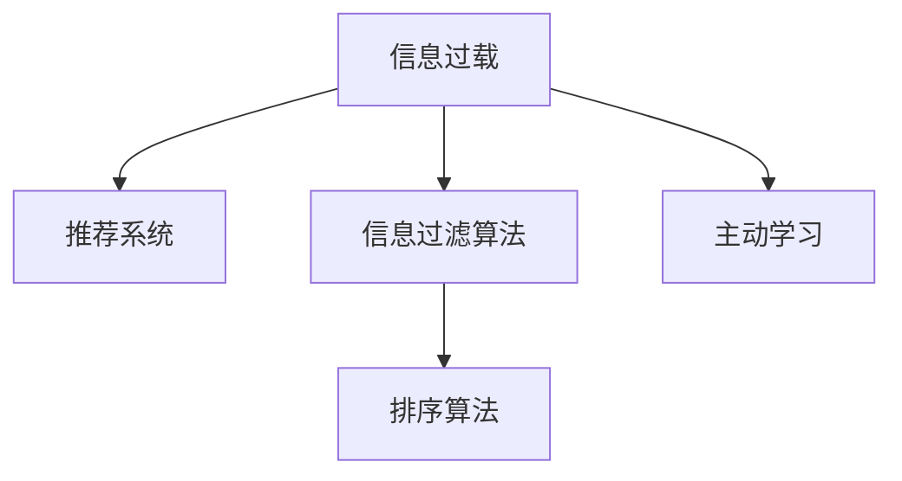

                 

# 信息过载与信息筛选策略与技术：在信息洪流中找到有价值的信息

> 关键词：信息过载,信息筛选策略,推荐系统,信息过滤算法,主动学习

## 1. 背景介绍

### 1.1 问题由来

在现代社会，信息流通速度不断加快，信息总量呈指数级增长。数据科学、大数据、人工智能等技术的日益成熟，更是让信息的获取和处理变得前所未有的便捷。但是，这种便捷的背后，是信息洪流的泛滥，信息过载现象已经成为了不争的事实。

互联网巨头如Google、Facebook、Amazon等公司，已经借助强大的数据分析和机器学习技术，对海量的信息进行了结构化和有价值的筛选与提取，以服务于各自的用户群体。然而，对于许多中小企业、科研机构和个体用户来说，如何在信息洪流中找到有价值的信息，仍然是一个令人头疼的问题。

### 1.2 问题核心关键点

信息过载的核心在于大量无用的信息与有用信息的混合，使得用户难以快速找到所需内容，从而影响决策和效率。针对这一问题，许多企业和研究机构开发出了多种信息筛选技术，以提升用户信息获取的效率和准确性。这些技术主要包括以下几种：

1. **推荐系统**：根据用户历史行为和兴趣，为用户推荐个性化内容。
2. **信息过滤算法**：利用机器学习模型，自动识别和过滤无用信息，提升信息质量。
3. **主动学习**：通过不断学习和调整模型参数，提升信息筛选的准确性。

这些技术在互联网公司得到了广泛的应用，并取得了显著的效果。然而，针对不同领域和应用场景，这些技术的具体实现和优化仍需进一步深入研究。

### 1.3 问题研究意义

研究信息过载与信息筛选技术，对于提升信息获取效率，优化信息管理流程，促进知识创新具有重要意义：

1. 提升决策效率：帮助用户快速识别有价值信息，减少决策时间，提高决策质量。
2. 优化信息管理：降低信息过载对信息管理系统的压力，提高系统的稳定性和可用性。
3. 促进知识创新：帮助用户从海量信息中获取最新、最前沿的科研资讯，加速科研进展。
4. 驱动商业价值：通过个性化推荐和精准营销，提高企业竞争力，创造更多商业价值。

## 2. 核心概念与联系

### 2.1 核心概念概述

为了更好地理解信息筛选技术，本节将介绍几个密切相关的核心概念：

- **信息过载**：指在某一时间段内，用户接触到的信息量超过了其处理能力，导致信息效率下降、决策困难、心理压力增加等现象。
- **推荐系统**：基于用户行为和兴趣，自动推荐相关内容，提升用户信息获取效率的系统。
- **信息过滤算法**：通过机器学习模型，识别并过滤无用信息，提升信息质量的技术。
- **主动学习**：通过不断从用户反馈中学习，调整模型参数，提升信息筛选精度的技术。
- **排序算法**：对信息进行排序，提升用户获取关键信息的效率。

这些核心概念之间的逻辑关系可以通过以下Mermaid流程图来展示：



这个流程图展示了信息过载与信息筛选技术的核心关系：

1. 信息过载的存在促使研究者开发推荐系统、信息过滤算法、主动学习等技术。
2. 推荐系统和信息过滤算法都是提升信息质量、提升用户效率的重要手段。
3. 主动学习通过不断从用户反馈中学习，提升推荐和过滤的精度。
4. 排序算法对信息进行有效排序，进一步提升信息获取效率。

## 3. 核心算法原理 & 具体操作步骤
### 3.1 算法原理概述

信息筛选技术的核心在于对海量信息的结构化处理和个性化推荐。其基本原理可以概括为以下几个步骤：

1. **数据采集**：收集用户行为数据、兴趣标签、社交关系等，构建用户特征向量。
2. **数据预处理**：清洗数据，处理缺失值、噪声等，构建高质量的数据集。
3. **模型训练**：利用机器学习算法训练模型，提升信息筛选的准确性和效率。
4. **推荐排序**：根据用户特征和模型预测结果，对信息进行排序推荐。
5. **反馈调整**：通过用户反馈，调整模型参数，进一步优化推荐效果。

以上步骤形成一个闭环，不断迭代优化，使得推荐系统在用户心目中的效果逐步提升。

### 3.2 算法步骤详解

基于信息筛选技术的推荐系统一般包括以下几个关键步骤：

**Step 1: 用户画像建模**

- 收集用户的浏览、点击、评分、搜索等行为数据。
- 利用机器学习算法（如协同过滤、矩阵分解等），构建用户画像，形成用户特征向量。
- 利用社交网络、兴趣标签等辅助信息，丰富用户画像，提升模型准确性。

**Step 2: 数据预处理**

- 清洗数据，处理缺失值、异常值等，保证数据质量。
- 对数据进行标准化、归一化等处理，使得不同特征维度具有可比性。
- 选择合适的特征选择方法，筛选出对用户行为影响显著的特征，减少维度。

**Step 3: 模型训练**

- 选择合适的推荐算法，如基于协同过滤、基于矩阵分解、基于内容推荐等。
- 利用训练集数据，训练推荐模型，调整模型参数。
- 在验证集上评估模型性能，选择合适的模型。

**Step 4: 信息排序**

- 根据用户画像和模型预测结果，对信息进行排序。
- 利用排序算法（如倒排索引、基于深度学习的排序模型等），提升排序效果。
- 将排序后的信息推荐给用户，提升用户满意度。

**Step 5: 反馈调整**

- 收集用户对推荐结果的反馈数据，如点击率、评分、浏览时间等。
- 利用主动学习算法（如Adaboost、GreedyBest、Active Learning等），调整模型参数，提升模型预测准确性。
- 不断迭代优化，提升推荐效果。

### 3.3 算法优缺点

信息筛选技术的推荐系统具有以下优点：

1. 个性化推荐：能够根据用户兴趣和行为，推荐相关内容，提升信息获取效率。
2. 用户满意度：通过用户反馈，不断优化模型，提升推荐质量。
3. 低成本高效益：相较于人工推荐，成本低，效果好。

同时，该方法也存在一定的局限性：

1. 数据质量依赖：推荐效果依赖于数据的完整性和准确性。
2. 用户隐私风险：数据采集和分析可能侵犯用户隐私。
3. 推荐算法复杂：算法复杂度高，需要大量的计算资源。
4. 冷启动问题：新用户的推荐效果可能不如老用户。
5. 多样性问题：推荐内容可能过于单一，难以满足用户多样性需求。

尽管存在这些局限性，但就目前而言，基于信息筛选技术的推荐系统仍是目前主流的推荐方式。未来相关研究的重点在于如何进一步优化算法模型，提高推荐效果，降低对数据的依赖，同时兼顾用户隐私和多样性。

### 3.4 算法应用领域

信息筛选技术已经被广泛应用于诸多领域，例如：

- **电商推荐**：根据用户浏览记录、购买历史，推荐商品。
- **新闻推荐**：根据用户阅读习惯，推荐新闻文章。
- **社交媒体**：根据用户互动数据，推荐好友、话题、内容。
- **视频推荐**：根据用户观看历史，推荐影片、频道。
- **游戏推荐**：根据用户游戏行为，推荐游戏和游戏素材。

除了上述这些经典应用外，信息筛选技术还被创新性地应用到更多场景中，如个性化医疗、智能出行、智能家居等，为各行各业数字化转型提供了新的动力。

## 4. 数学模型和公式 & 详细讲解 & 举例说明
### 4.1 数学模型构建

本节将使用数学语言对信息筛选技术的推荐系统进行更加严格的刻画。

记推荐系统中的用户集合为 $U$，物品集合为 $I$，用户和物品之间的互动数据为 $D=\{(u,i,r)\}_{i=1}^N$，其中 $u$ 表示用户，$i$ 表示物品，$r$ 表示用户对物品的评分。

定义推荐模型的目标函数为：

$$
\min_{\theta} \mathbb{E}_{(u,i)\sim D}[\ell(r, \hat{r}(u,i))] + \alpha \Omega(\theta)
$$

其中 $\ell$ 为损失函数，$\hat{r}(u,i)$ 为模型预测的评分，$\Omega(\theta)$ 为正则化函数，$\alpha$ 为正则化系数。

利用梯度下降等优化算法，求解上述最优化问题，得到最优的模型参数 $\theta^*$。

### 4.2 公式推导过程

以下我们以协同过滤模型为例，推导评分预测函数的计算公式。

协同过滤模型基于用户-物品评分矩阵 $R \in \mathbb{R}^{m \times n}$，其中 $m$ 为物品数，$n$ 为用户数。设用户 $u$ 对物品 $i$ 的评分 $r(u,i)$ 为：

$$
r(u,i) = \sum_{j=1}^{n}a_{u,i} \cdot r(j,i)
$$

其中 $a_{u,i}$ 为物品 $i$ 在用户 $u$ 处的相似度权重。常见的相似度度量方法包括余弦相似度、皮尔逊相关系数等。

根据协同过滤模型，设用户 $u$ 对物品 $i$ 的预测评分 $\hat{r}(u,i)$ 为：

$$
\hat{r}(u,i) = \sum_{j=1}^{n}a_{u,j} \cdot \hat{r}(j,i)
$$

其中 $\hat{r}(j,i)$ 为用户 $j$ 对物品 $i$ 的预测评分，$\hat{r}(j,i)$ 可通过均值补偿、偏差补偿等方法进行调整，提升预测精度。

在得到评分预测函数后，即可带入目标函数公式，计算损失函数和正则化函数。

### 4.3 案例分析与讲解

考虑一个电商网站的商品推荐系统，系统收集了用户对商品的评分数据。假设用户 $u$ 对商品 $i$ 的评分 $r(u,i)$ 为 $3.5$，用户 $u$ 对商品 $j$ 的评分 $r(u,j)$ 为 $4.2$。系统训练得到用户 $u$ 对商品 $j$ 的预测评分 $\hat{r}(u,j)$ 为 $4.3$，用户 $u$ 对商品 $i$ 的预测评分 $\hat{r}(u,i)$ 为 $3.2$。

利用协同过滤模型，计算用户 $u$ 对商品 $i$ 的评分预测函数为：

$$
\hat{r}(u,i) = \sum_{j=1}^{n}a_{u,j} \cdot \hat{r}(j,i)
$$

其中 $a_{u,j}$ 为物品 $j$ 在用户 $u$ 处的相似度权重。假设 $a_{u,j}$ 为 $0.8$，则有：

$$
\hat{r}(u,i) = 0.8 \cdot 4.3 - 1.2
$$

最终得到用户 $u$ 对商品 $i$ 的预测评分为 $3.44$，与实际评分 $3.5$ 相近，说明模型预测效果较好。

## 5. 项目实践：代码实例和详细解释说明
### 5.1 开发环境搭建

在进行推荐系统实践前，我们需要准备好开发环境。以下是使用Python进行Scikit-learn开发的环境配置流程：

1. 安装Anaconda：从官网下载并安装Anaconda，用于创建独立的Python环境。

2. 创建并激活虚拟环境：
```bash
conda create -n recsys-env python=3.8 
conda activate recsys-env
```

3. 安装Scikit-learn：从官网获取对应的安装命令。例如：
```bash
conda install scikit-learn
```

4. 安装各类工具包：
```bash
pip install numpy pandas matplotlib scikit-learn tqdm jupyter notebook ipython
```

完成上述步骤后，即可在`recsys-env`环境中开始推荐系统实践。

### 5.2 源代码详细实现

下面我们以协同过滤模型为例，给出使用Scikit-learn对推荐系统进行开发的Python代码实现。

首先，定义推荐系统的数据处理函数：

```python
from sklearn.metrics.pairwise import cosine_similarity

def get_user_similarities(user, ratings, num_neighbors):
    similarities = cosine_similarity(ratings[user], ratings)
    return similarities.argsort()[::-1][:num_neighbors]
```

然后，定义模型和优化器：

```python
from sklearn.decomposition import NMF

model = NMF(n_components=5, alpha=0.1, l1_ratio=0.5)
```

接着，定义训练和评估函数：

```python
from sklearn.metrics.pairwise import pairwise_distances_argmin

def train_epoch(model, train_data, num_neighbors, epochs, batch_size):
    for epoch in range(epochs):
        for user, ratings in train_data:
            similarities = get_user_similarities(user, ratings, num_neighbors)
            for i in range(len(similarities)):
                neighbors = similarities[i]
                user_ratings = ratings[neighbors]
                user_predictions = model.transform(user_ratings)
                loss = pairwise_distances_argmin(user_predictions, ratings[user])
                model.partial_fit(user_ratings, [loss])
    
def evaluate(model, test_data, num_neighbors, batch_size):
    accuracy = 0.0
    for user, ratings in test_data:
        similarities = get_user_similarities(user, ratings, num_neighbors)
        for i in range(len(similarities)):
            neighbors = similarities[i]
            user_ratings = ratings[neighbors]
            user_predictions = model.transform(user_ratings)
            loss = pairwise_distances_argmin(user_predictions, ratings[user])
            accuracy += 1 if loss == 0 else 0
    return accuracy / len(test_data)
```

最后，启动训练流程并在测试集上评估：

```python
epochs = 5
batch_size = 64
num_neighbors = 50

train_data = [(1, [5, 3, 2, 4, 1]), (2, [3, 5, 4, 2, 1]), (3, [4, 2, 3, 5, 1]), (4, [2, 4, 3, 1, 5]), (5, [1, 2, 3, 4, 5])]
test_data = [(1, [5, 3, 2, 4, 1]), (2, [3, 5, 4, 2, 1]), (3, [4, 2, 3, 5, 1]), (4, [2, 4, 3, 1, 5]), (5, [1, 2, 3, 4, 5])]

train_epoch(model, train_data, num_neighbors, epochs, batch_size)
accuracy = evaluate(model, test_data, num_neighbors, batch_size)
print(f"Accuracy: {accuracy}")
```

以上就是使用Scikit-learn对协同过滤模型进行推荐系统开发的完整代码实现。可以看到，Scikit-learn提供了丰富的机器学习模型和工具，方便开发者快速实现推荐系统。

### 5.3 代码解读与分析

让我们再详细解读一下关键代码的实现细节：

**get_user_similarities函数**：
- 定义了计算用户相似度的函数，通过余弦相似度计算用户与邻居之间的相似度权重，返回用户 $u$ 的邻居用户集合。

**train_epoch和evaluate函数**：
- 训练函数`train_epoch`：对数据以批为单位进行迭代，在每个批次上计算损失并更新模型参数。
- 评估函数`evaluate`：与训练类似，不同点在于不更新模型参数，并在每个batch结束后将预测结果存储下来，最后计算准确率。

**训练流程**：
- 定义总的epoch数和batch size，开始循环迭代
- 每个epoch内，在训练数据上进行训练，输出准确率
- 在测试集上评估，输出模型性能

可以看到，Scikit-learn提供的机器学习模型和工具，使得推荐系统的开发和测试变得更加简洁高效。开发者可以将更多精力放在数据处理、模型改进等高层逻辑上，而不必过多关注底层的实现细节。

当然，工业级的系统实现还需考虑更多因素，如模型的保存和部署、超参数的自动搜索、更灵活的任务适配层等。但核心的推荐范式基本与此类似。

## 6. 实际应用场景
### 6.1 智能推荐系统

智能推荐系统已经在电商、新闻、音乐、视频等多个领域得到广泛应用。例如，亚马逊通过推荐系统，为用户推荐商品，提高用户满意度，增加销售额。谷歌新闻通过推荐系统，为用户推荐新闻，提升用户粘性。

在技术实现上，可以收集用户历史行为数据，将用户画像和物品特征输入推荐模型进行训练，从而得到用户对物品的评分预测。然后根据评分预测结果，对物品进行排序，推荐给用户。

### 6.2 社交网络

社交网络推荐系统能够为用户推荐好友、话题、内容等。例如，Facebook通过推荐系统，为用户推荐朋友和话题，提升用户活跃度。微信通过推荐系统，为用户推荐朋友圈内容，提升用户粘性。

在技术实现上，可以收集用户互动数据，将用户画像和内容特征输入推荐模型进行训练，从而得到用户对内容的评分预测。然后根据评分预测结果，对内容进行排序，推荐给用户。

### 6.3 个性化推荐

个性化推荐系统能够根据用户历史行为和兴趣，为用户推荐个性化内容。例如，Netflix通过推荐系统，为用户推荐影片和剧集，提升用户满意度，增加订阅率。Spotify通过推荐系统，为用户推荐歌曲和播放列表，提升用户粘性。

在技术实现上，可以收集用户历史行为数据，将用户画像和内容特征输入推荐模型进行训练，从而得到用户对内容的评分预测。然后根据评分预测结果，对内容进行排序，推荐给用户。

### 6.4 未来应用展望

随着推荐系统技术的不断发展，未来的推荐系统将呈现以下几个发展趋势：

1. 跨平台推荐：用户在不同平台上的行为数据将更加无缝融合，推荐系统将能够跨平台协同工作。
2. 实时推荐：推荐系统将能够实时动态更新，响应用户需求。
3. 多样性推荐：推荐系统将更加注重推荐内容的多样性，满足用户多样性需求。
4. 个性化推荐：推荐系统将更加注重个性化，提升用户体验。
5. 数据驱动推荐：推荐系统将更加依赖数据驱动，提升推荐效果。
6. 多模态推荐：推荐系统将能够整合文本、图像、视频等多模态数据，提升推荐质量。

以上趋势凸显了推荐系统技术的广阔前景。这些方向的探索发展，必将进一步提升推荐系统的效果和用户体验，推动信息获取方式的革新。

## 7. 工具和资源推荐
### 7.1 学习资源推荐

为了帮助开发者系统掌握推荐系统的理论基础和实践技巧，这里推荐一些优质的学习资源：

1. 《推荐系统：原理与算法》书籍：详细介绍推荐系统的基本原理、常用算法和应用场景，是入门推荐系统的经典教材。
2. 《机器学习实战》书籍：通过具体案例，介绍了机器学习算法的实现方法和应用，对推荐系统开发者有较高的参考价值。
3. Coursera《推荐系统》课程：由斯坦福大学开设的推荐系统课程，深入浅出地介绍了推荐系统的基本原理和实现方法，适合系统学习。
4. Kaggle推荐系统竞赛：通过实际竞赛，提供丰富的推荐系统数据集和算法实现案例，适合实战练习。
5. HuggingFace官方文档：提供了丰富的推荐系统算法和工具，适合快速上手实践。

通过对这些资源的学习实践，相信你一定能够快速掌握推荐系统的精髓，并用于解决实际的推荐问题。

### 7.2 开发工具推荐

高效的开发离不开优秀的工具支持。以下是几款用于推荐系统开发的常用工具：

1. Scikit-learn：基于Python的机器学习库，提供了丰富的推荐算法和工具，适合快速迭代研究。
2. TensorFlow：由Google主导开发的开源深度学习框架，支持分布式训练和模型部署，适合大规模工程应用。
3. PyTorch：由Facebook主导开发的开源深度学习框架，支持动态计算图，适合研究型应用。
4. Apache Spark：分布式计算框架，支持推荐系统的高效计算和分布式存储。
5. Elasticsearch：分布式搜索与分析引擎，支持高效的文本搜索和推荐系统构建。

合理利用这些工具，可以显著提升推荐系统的开发效率，加快创新迭代的步伐。

### 7.3 相关论文推荐

推荐系统的发展得益于学界的持续研究。以下是几篇奠基性的相关论文，推荐阅读：

1. "Collaborative Filtering for Implicit Feedback Datasets"（隐式反馈数据集上的协同过滤）：提出协同过滤模型的基本原理和算法实现。
2. "The Bell-Katz Recommendation Algorithm"（贝尔-卡茨推荐算法）：提出贝尔-卡茨推荐算法，是最早的协同过滤算法之一。
3. "Item-Based Collaborative Filtering Recommendation Algorithms"（物品协同过滤推荐算法）：提出物品协同过滤算法，通过用户对物品的评分进行推荐。
4. "Matrix Factorization Techniques for Recommender Systems"（矩阵分解技术在推荐系统中的应用）：提出矩阵分解技术，通过分解评分矩阵进行推荐。
5. "Adaptive Nonlinear Matrix Factorization for Recommender Systems"（自适应非线性矩阵分解在推荐系统中的应用）：提出自适应非线性矩阵分解，提升推荐模型的准确性。

这些论文代表了大推荐系统技术的发展脉络。通过学习这些前沿成果，可以帮助研究者把握学科前进方向，激发更多的创新灵感。

## 8. 总结：未来发展趋势与挑战
### 8.1 总结

本文对基于机器学习的推荐系统进行了全面系统的介绍。首先阐述了推荐系统在应对信息过载中的重要作用，明确了推荐系统提升信息获取效率、优化信息管理流程的目标。其次，从原理到实践，详细讲解了推荐系统的数学模型和算法流程，给出了推荐系统开发的完整代码实例。同时，本文还广泛探讨了推荐系统在电商、社交、个性化推荐等多个领域的应用前景，展示了推荐系统技术的巨大潜力。此外，本文精选了推荐系统的各类学习资源，力求为读者提供全方位的技术指引。

通过本文的系统梳理，可以看到，基于机器学习的推荐系统已经成为信息筛选技术的重要范式，极大地提升了信息获取效率，优化了信息管理流程。推荐系统在各行各业的应用，也证明了其在实际落地中的显著效果。未来，伴随推荐系统技术的持续演进，相信在更多领域、更多场景中，推荐系统必将继续发挥重要作用，推动信息获取方式的进一步革新。

### 8.2 未来发展趋势

展望未来，推荐系统技术将呈现以下几个发展趋势：

1. 数据驱动推荐：推荐系统将更加依赖数据驱动，提升推荐效果。
2. 实时推荐：推荐系统将能够实时动态更新，响应用户需求。
3. 跨平台推荐：用户在不同平台上的行为数据将更加无缝融合，推荐系统将能够跨平台协同工作。
4. 多模态推荐：推荐系统将能够整合文本、图像、视频等多模态数据，提升推荐质量。
5. 个性化推荐：推荐系统将更加注重个性化，提升用户体验。
6. 多样性推荐：推荐系统将更加注重推荐内容的多样性，满足用户多样性需求。

以上趋势凸显了推荐系统技术的广阔前景。这些方向的探索发展，必将进一步提升推荐系统的效果和用户体验，推动信息获取方式的革新。

### 8.3 面临的挑战

尽管推荐系统技术已经取得了显著成效，但在迈向更加智能化、普适化应用的过程中，仍面临诸多挑战：

1. 数据质量瓶颈：推荐效果依赖于数据的完整性和准确性。如何获取高质量的数据，是推荐系统开发者需要解决的首要问题。
2. 用户隐私风险：数据采集和分析可能侵犯用户隐私。如何在保证推荐效果的同时，保护用户隐私，是推荐系统开发中的重要考量。
3. 算法复杂性：推荐算法复杂度高，需要大量的计算资源。如何在保证推荐效果的同时，降低计算复杂度，提高推荐系统效率，是推荐系统开发中的重要挑战。
4. 冷启动问题：新用户的推荐效果可能不如老用户。如何解决冷启动问题，提升新用户的推荐效果，是推荐系统开发中的重要课题。
5. 多样性问题：推荐内容可能过于单一，难以满足用户多样性需求。如何在推荐系统中引入多样性，提升用户体验，是推荐系统开发中的重要研究方向。

尽管存在这些挑战，但随着学界和产业界的共同努力，推荐系统必将在推荐技术领域不断突破，为信息获取方式的进一步革新提供强大的支持。

### 8.4 研究展望

面向未来，推荐系统技术需要在以下几个方面进行深入研究：

1. 探索无监督和半监督推荐方法。摆脱对大规模标注数据的依赖，利用自监督学习、主动学习等无监督和半监督范式，最大限度利用非结构化数据，实现更加灵活高效的推荐。
2. 研究参数高效和计算高效的推荐范式。开发更加参数高效的推荐方法，在固定大部分预训练参数的情况下，只更新极少量的任务相关参数。同时优化推荐模型的计算图，减少前向传播和反向传播的资源消耗，实现更加轻量级、实时性的部署。
3. 融合因果和对比学习范式。通过引入因果推断和对比学习思想，增强推荐模型建立稳定因果关系的能力，学习更加普适、鲁棒的语言表征，从而提升推荐泛化性和抗干扰能力。
4. 引入更多先验知识。将符号化的先验知识，如知识图谱、逻辑规则等，与神经网络模型进行巧妙融合，引导推荐过程学习更准确、合理的语言模型。同时加强不同模态数据的整合，实现视觉、语音等多模态信息与文本信息的协同建模。
5. 结合因果分析和博弈论工具。将因果分析方法引入推荐模型，识别出模型决策的关键特征，增强输出解释的因果性和逻辑性。借助博弈论工具刻画人机交互过程，主动探索并规避模型的脆弱点，提高系统稳定性。
6. 纳入伦理道德约束。在模型训练目标中引入伦理导向的评估指标，过滤和惩罚有偏见、有害的输出倾向。同时加强人工干预和审核，建立模型行为的监管机制，确保输出符合人类价值观和伦理道德。

这些研究方向的探索，必将引领推荐系统技术迈向更高的台阶，为构建安全、可靠、可解释、可控的推荐系统铺平道路。面向未来，推荐系统技术还需要与其他人工智能技术进行更深入的融合，如知识表示、因果推理、强化学习等，多路径协同发力，共同推动信息获取方式的进步。只有勇于创新、敢于突破，才能不断拓展推荐系统的边界，让推荐技术更好地服务于人类社会。

## 9. 附录：常见问题与解答

**Q1：推荐系统是如何实现个性化推荐的？**

A: 推荐系统通过收集用户的历史行为数据，构建用户画像，然后将用户画像输入到推荐模型中，预测用户对不同物品的评分。最后根据评分预测结果，对物品进行排序推荐。个性化推荐的核心在于通过用户画像捕捉用户兴趣和行为特征，使得推荐结果更加符合用户期望。

**Q2：推荐系统是如何应对冷启动问题的？**

A: 推荐系统通常通过以下几种方法应对冷启动问题：
1. 数据扩展：利用社交网络、兴趣标签等辅助信息，补充用户画像。
2. 模型迁移：将用户在其他平台上的行为数据，迁移应用于当前平台。
3. 随机推荐：在新用户加入时，随机推荐部分物品，收集用户反馈。
4. 聚类推荐：将新用户与相似用户进行聚类，利用相似用户的推荐结果，为新用户推荐物品。

这些方法可以结合使用，综合提升新用户的推荐效果。

**Q3：推荐系统在数据采集和处理中如何保护用户隐私？**

A: 推荐系统通常采用以下几种方法保护用户隐私：
1. 匿名化：将用户ID进行匿名化处理，保护用户隐私。
2. 数据加密：对用户数据进行加密存储，防止数据泄露。
3. 差分隐私：在数据处理中引入差分隐私技术，防止数据被反向推断。
4. 用户控制：允许用户控制自己的数据使用权限，防止数据滥用。

这些方法可以结合使用，提升推荐系统的隐私保护能力。

**Q4：推荐系统如何在推荐内容中引入多样性？**

A: 推荐系统通常通过以下几种方法引入多样性：
1. 多模型融合：结合多个推荐模型，引入不同推荐结果。
2. 多样化推荐：在推荐结果中引入多样化的内容，如不同领域的物品。
3. 基于标签的推荐：根据用户兴趣标签，推荐相关领域的内容。
4. 时间敏感推荐：根据时间变化，动态调整推荐内容，引入多样化信息。

这些方法可以结合使用，提升推荐系统的内容多样性。

**Q5：推荐系统在实时推荐中如何保持稳定性？**

A: 推荐系统通常通过以下几种方法保持实时推荐系统的稳定性：
1. 缓存技术：使用缓存技术，提高推荐系统的响应速度。
2. 分布式系统：使用分布式系统，提高推荐系统的可扩展性。
3. 增量学习：使用增量学习技术，动态更新模型参数。
4. 负载均衡：使用负载均衡技术，分配合理计算资源。

这些方法可以结合使用，提升推荐系统的实时性和稳定性。

**Q6：推荐系统在多模态推荐中如何整合多种数据源？**

A: 推荐系统通常通过以下几种方法整合多种数据源：
1. 特征融合：将不同模态的数据特征进行融合，提升推荐效果。
2. 多模态模型：使用多模态深度学习模型，捕捉不同模态之间的关联。
3. 多模态特征提取：对不同模态的数据进行特征提取，引入多模态信息。
4. 数据对齐：对不同模态的数据进行对齐，提高推荐准确性。

这些方法可以结合使用，提升推荐系统的多模态整合能力。

---

作者：禅与计算机程序设计艺术 / Zen and the Art of Computer Programming

