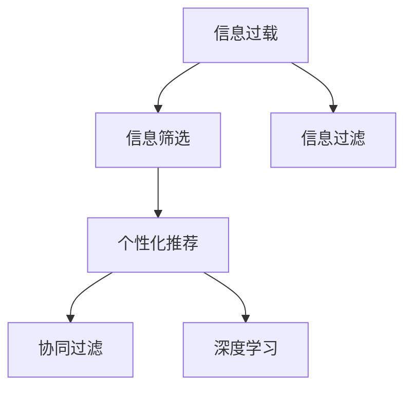

                 

# 信息过载与信息筛选策略：在信息洪流中找到有价值和相关的信息

> 关键词：信息过载,信息筛选,信息过滤,个性化推荐,协同过滤,深度学习

## 1. 背景介绍

### 1.1 问题由来

在数字化时代，信息爆炸已经成为一个不可忽视的问题。从社交媒体到新闻网站，从电商平台到专业论坛，各种来源的文本、图片、视频等形式的信息以海量的方式充斥着我们的网络空间。面对如此丰富的信息资源，人们往往感到既兴奋又困惑，不知道如何从浩如烟海的数据中筛选出有价值和相关的信息。

### 1.2 问题核心关键点

解决信息过载问题，核心在于如何高效地从大规模数据中筛选出有价值和相关的信息。这不仅涉及技术层面的算法设计，还包括从用户行为数据中挖掘信息偏好和需求，从而实现个性化推荐和服务。此外，如何保护用户隐私，避免过度曝光和滥用个人信息，也是值得关注的重要议题。

## 2. 核心概念与联系

### 2.1 核心概念概述

为更好地理解如何应对信息过载，并从中筛选出有价值和相关的信息，本节将介绍几个密切相关的核心概念：

- 信息过载(Information Overload)：指用户接收到的信息量超出了其处理能力，导致无法有效利用信息的现象。
- 信息筛选(Information Filtering)：指通过算法或规则，从大量信息中挑选出用户感兴趣或有用的信息的过程。
- 信息过滤(Information Filtering)：与信息筛选类似，但通常指的是基于规则的自动化筛选过程，不涉及用户行为数据的分析。
- 个性化推荐(Personalized Recommendation)：通过分析用户行为和兴趣，推荐符合其需求的产品或内容。
- 协同过滤(Collaborative Filtering)：一种基于用户行为数据进行推荐的方法，通过分析用户间相似性来推荐新内容。
- 深度学习(Deep Learning)：一种利用多层神经网络进行复杂模式识别和学习的算法框架。

这些核心概念之间的逻辑关系可以通过以下Mermaid流程图来展示：



这个流程图展示了几者之间的关联性：

1. 信息过载导致信息筛选的必要性。
2. 信息过滤是信息筛选的一种自动化实现方式。
3. 个性化推荐基于信息筛选，更加精准地匹配用户需求。
4. 协同过滤是实现个性化推荐的一种常用技术。
5. 深度学习提供了实现复杂推荐算法的基础。

## 3. 核心算法原理 & 具体操作步骤
### 3.1 算法原理概述

解决信息过载问题，核心在于设计高效的信息筛选算法，并结合深度学习技术，实现个性化的信息推荐。信息筛选算法通过评估信息与用户需求的匹配程度，过滤掉无关或低价值信息，从而减少用户的认知负担。个性化推荐算法则通过分析用户行为，挖掘用户兴趣偏好，推荐符合其需求的内容，进一步提升用户体验。

### 3.2 算法步骤详解

信息筛选和推荐算法的典型流程包括以下几个步骤：

**Step 1: 数据收集与预处理**
- 收集用户行为数据，如浏览记录、点击行为、评分数据等。
- 对数据进行清洗和格式化处理，去除噪声和不完整数据。
- 对数据进行特征工程，提取关键特征如文本内容、时间戳、用户ID等。

**Step 2: 特征表示与相似性度量**
- 使用词袋模型、TF-IDF、Word2Vec等技术，将文本转化为向量表示。
- 通过余弦相似度、Jaccard相似度、皮尔逊相关系数等度量方式，计算物品间或用户间的相似性。

**Step 3: 模型训练与优化**
- 使用协同过滤、深度学习等算法，训练推荐模型。
- 通过交叉验证、A/B测试等方式，优化模型参数和推荐效果。
- 应用正则化技术，如L2正则、Dropout等，防止过拟合。

**Step 4: 推荐与反馈**
- 将训练好的模型应用到实时数据流中，生成个性化推荐结果。
- 实时收集用户反馈数据，如点击、浏览、评分等，不断迭代优化推荐算法。
- 使用多臂老虎机算法等技术，动态调整推荐策略，平衡点击率和相关性。

**Step 5: 用户体验优化**
- 设计友好的用户界面，展示推荐结果，提供简明扼要的摘要。
- 使用A/B测试等方法，评估不同推荐策略对用户体验的影响。
- 根据用户反馈不断优化推荐算法，提升推荐精度和个性化程度。

### 3.3 算法优缺点

信息筛选和推荐算法具有以下优点：
1. 提高信息获取效率。通过高效的信息筛选，减少了用户识别和处理信息的负担，节省时间。
2. 提升用户体验。个性化推荐使信息更加贴近用户需求，提高了用户满意度。
3. 促进信息利用。个性化推荐鼓励用户更频繁地访问平台，提升信息利用率。

同时，这些算法也存在一些局限性：
1. 依赖高质量数据。信息筛选和推荐算法的性能很大程度上取决于数据的质量和多样性。
2. 用户隐私问题。需要收集用户行为数据，涉及隐私保护和数据安全问题。
3. 算法复杂度高。深度学习等复杂模型计算量大，需要高性能的计算资源。
4. 冷启动问题。新用户或新物品没有足够的数据进行推荐，需要一些启发式策略进行初期推荐。
5. 动态性不足。算法通常基于历史数据训练，难以实时适应信息的变化。

尽管存在这些局限性，但就目前而言，信息筛选和推荐算法已成为应对信息过载问题的重要手段。未来相关研究的重点在于如何进一步提高算法的实时性、准确性和隐私保护水平。

### 3.4 算法应用领域

信息筛选和推荐算法已经在众多领域得到了广泛应用，例如：

- 电子商务：推荐商品、促销活动，提升转化率和客户满意度。
- 新闻媒体：推荐新闻、视频、文章，提高内容曝光和点击率。
- 社交网络：推荐朋友、帖子、群组，增强社交互动和信息流质量。
- 视频平台：推荐电影、电视剧、纪录片，增加用户粘性和平台活跃度。
- 音乐平台：推荐歌曲、专辑、艺人，提升音乐发现和用户体验。

除了上述这些领域，信息筛选和推荐算法还被应用于旅游、金融、健康等多个行业，为各领域的信息获取和决策支持提供了有力支持。

## 4. 数学模型和公式 & 详细讲解 & 举例说明

### 4.1 数学模型构建

信息筛选和推荐算法通常基于用户行为数据构建数学模型，以评估信息的相关性和推荐结果的精度。典型的数学模型包括协同过滤、矩阵分解、深度学习等。

假设用户行为数据为 $U=\{(x_i,y_i)\}_{i=1}^N$，其中 $x_i$ 表示用户行为特征，$y_i$ 表示用户评分（0-1）。设物品特征矩阵为 $I=\{(i_j)\}_{j=1}^M$，其中 $i_j$ 表示物品 $j$ 的特征向量。设用户特征向量为 $u_i=\alpha_i^TI$，其中 $\alpha_i$ 为系数向量。

基于协同过滤的推荐模型可以通过求解优化问题：

$$
\mathop{\arg\min}_{\alpha} ||U-u_iI||_F^2 + \lambda ||\alpha||_2^2
$$

其中，$||.||_F$ 表示矩阵的 Frobenius 范数，$\lambda$ 为正则化参数。

### 4.2 公式推导过程

以协同过滤为例，假设用户 $u$ 对物品 $i$ 的评分 $r_{ui}=y_{ui}$，物品 $i$ 的特征向量为 $I_i$，用户 $u$ 的特征向量为 $u$。则协同过滤的目标是找到一个投影矩阵 $P$，使得：

$$
\min_{P}\sum_{i=1}^M||r_{ui}-P^TI_i||^2+\lambda ||P||_F^2
$$

其中，$||.||^2$ 表示元素的平方。

令 $P=U^TT$，则上述优化问题变为：

$$
\min_{U}||UU^TT-U||_F^2+\lambda||U||_F^2
$$

上式可以看作矩阵 $U$ 的正交分解，其中 $U$ 表示用户行为数据矩阵，$T$ 表示物品特征矩阵，$||.||_F$ 表示矩阵的 Frobenius 范数。通过求解该优化问题，可以求解出用户和物品的潜在特征矩阵，从而实现协同过滤推荐。

### 4.3 案例分析与讲解

以下以协同过滤算法为例，详细讲解其实现过程。

假设用户对物品的评分数据如下：

| 用户ID | 物品ID | 评分 |
| ------ | ------ | ---- |
| 1      | 1      | 4    |
| 1      | 2      | 3    |
| 1      | 3      | 2    |
| 2      | 1      | 5    |
| 2      | 2      | 5    |
| 2      | 3      | 4    |

设物品特征矩阵为：

$$
I=\begin{bmatrix}
0.4 & 0.2 \\
0.3 & 0.2 \\
0.2 & 0.3 
\end{bmatrix}
$$

使用协同过滤算法，计算用户 $u$ 的特征向量 $u$ 和物品 $i$ 的特征向量 $I_i$。设用户 $u$ 的评分向量为 $r_u$，物品 $i$ 的评分向量为 $r_i$。则协同过滤的目标是求解矩阵 $P$，使得：

$$
\min_{P}\sum_{u=1}^N||r_u-PU||^2+\lambda||P||_F^2
$$

其中，$||.||^2$ 表示元素的平方。

通过求解该优化问题，可以得到用户和物品的潜在特征矩阵，从而实现协同过滤推荐。

## 5. 项目实践：代码实例和详细解释说明
### 5.1 开发环境搭建

在进行信息筛选和推荐系统开发前，我们需要准备好开发环境。以下是使用Python进行TensorFlow开发的环境配置流程：

1. 安装Anaconda：从官网下载并安装Anaconda，用于创建独立的Python环境。

2. 创建并激活虚拟环境：
```bash
conda create -n tf-env python=3.8 
conda activate tf-env
```

3. 安装TensorFlow：根据CUDA版本，从官网获取对应的安装命令。例如：
```bash
conda install tensorflow tensorflow-estimator tensorflow-probability -c tf -c conda-forge
```

4. 安装各类工具包：
```bash
pip install numpy pandas scikit-learn matplotlib tqdm jupyter notebook ipython
```

完成上述步骤后，即可在`tf-env`环境中开始信息筛选和推荐系统开发。

### 5.2 源代码详细实现

下面我们以协同过滤算法为例，给出使用TensorFlow进行信息筛选的PyTorch代码实现。

首先，定义协同过滤模型的损失函数和优化器：

```python
import tensorflow as tf
from tensorflow.keras import layers, models

def make_model(input_shape, hidden_units, output_units):
    model = models.Sequential([
        layers.Dense(hidden_units, activation='relu', input_shape=input_shape),
        layers.Dense(output_units)
    ])
    return model

# 定义损失函数和优化器
loss_fn = tf.keras.losses.MeanSquaredError()
optimizer = tf.keras.optimizers.Adam()
```

接着，定义数据加载函数和模型训练函数：

```python
def load_data():
    # 加载数据集
    # ...

def train_model(model, data_train, data_valid, epochs):
    # 模型训练
    # ...

# 训练模型
train_model(model, data_train, data_valid, epochs=10)
```

最后，启动模型训练并评估：

```python
# 加载数据
data_train, data_valid = load_data()

# 构建模型
model = make_model(input_shape=(num_users, num_items), hidden_units=64, output_units=num_items)

# 训练模型
train_model(model, data_train, data_valid, epochs=10)

# 评估模型
test_loss = model.evaluate(data_test)
```

以上就是使用TensorFlow进行协同过滤推荐系统开发的完整代码实现。可以看到，TensorFlow提供了丰富的Keras API，使得模型的构建和训练过程变得简洁高效。

### 5.3 代码解读与分析

让我们再详细解读一下关键代码的实现细节：

**make_model函数**：
- 定义了两个全连接层，第一个隐藏层使用ReLU激活函数，第二个输出层根据任务需求调整。
- 使用Sequential模型，方便对模型进行序列化操作。

**损失函数和优化器**：
- 使用MeanSquaredError作为损失函数，适合回归任务。
- 使用Adam优化器，自适应地调整学习率，适合大规模数据集的优化。

**数据加载函数**：
- 使用TensorFlow的数据API，方便数据预处理和批处理。
- 根据具体任务需求，自定义数据预处理步骤，如归一化、数据增强等。

**模型训练函数**：
- 通过TensorFlow的Model API，方便构建和训练复杂的模型。
- 使用交叉验证、Early Stopping等技术，防止过拟合。

**模型评估**：
- 使用evaluate方法，在测试集上评估模型性能。
- 通过计算损失和精度等指标，评估模型效果。

可以看到，TensorFlow提供了完整的生态系统，使得信息筛选和推荐系统的开发变得简便高效。开发者可以更加专注于算法设计，而不必过多关注底层实现细节。

当然，工业级的系统实现还需考虑更多因素，如模型的保存和部署、超参数的自动搜索、更灵活的任务适配层等。但核心的信息筛选和推荐流程基本与此类似。

## 6. 实际应用场景
### 6.1 智能推荐系统

信息筛选和推荐算法在智能推荐系统中的应用尤为广泛。智能推荐系统可以基于用户的历史行为数据，为用户推荐感兴趣的物品，如商品、新闻、音乐等。通过高效的信息筛选和推荐，智能推荐系统不仅提高了用户满意度，还增加了平台活跃度和转化率。

在技术实现上，可以使用协同过滤、深度学习等方法，对用户和物品进行特征提取和相似性度量。微调后的深度学习模型可以学习用户和物品之间的潜在关联，生成更加准确的推荐结果。

### 6.2 新闻信息聚合

在信息爆炸的时代，用户难以从海量新闻中快速找到自己关心的内容。信息筛选和推荐算法可以为用户自动聚合相关新闻，并提供摘要和推荐。通过实时分析和处理新闻数据，推荐系统能够帮助用户快速找到自己感兴趣的信息，节省时间。

在实际应用中，可以使用深度学习技术，如BERT等模型，对新闻文本进行特征提取和相似性度量。推荐系统可以根据用户的历史阅读记录，为用户推荐相关新闻，并动态调整推荐策略，提高推荐精度。

### 6.3 个性化广告推荐

广告推荐是信息筛选和推荐算法的重要应用场景。广告平台可以通过信息筛选和推荐算法，为广告主精准投放广告，提升广告点击率和转化率。通过分析用户行为数据，推荐系统可以为用户推荐符合其兴趣的广告，提高广告的展示效果。

在技术实现上，可以使用协同过滤、深度学习等方法，对用户和广告进行特征提取和相似性度量。推荐系统可以根据用户的历史点击记录和浏览行为，为用户推荐相关广告，并动态调整广告投放策略，提高广告效果。

### 6.4 未来应用展望

随着信息筛选和推荐算法的发展，未来将在更多领域得到应用，为人类带来便利和效率。

在智慧医疗领域，推荐系统可以为用户推荐健康建议、医疗信息等，提升医疗服务的质量和可及性。

在智能教育领域，推荐系统可以为用户推荐课程、资料等，提高学习效率和体验。

在智慧城市治理中，推荐系统可以为用户推荐公共服务信息、旅游信息等，提升城市管理的智能化水平。

此外，在企业生产、社交网络、金融投资等众多领域，推荐系统都将发挥重要作用，带来新的经济和社会价值。相信随着技术的不断进步，信息筛选和推荐系统将在更广泛的领域得到应用，提升人类生活的智能化水平。

## 7. 工具和资源推荐
### 7.1 学习资源推荐

为了帮助开发者系统掌握信息筛选和推荐技术，这里推荐一些优质的学习资源：

1. 《推荐系统实战》系列博文：由推荐系统专家撰写，深入浅出地介绍了推荐算法的设计和实现。

2. 《深度学习推荐系统》课程：斯坦福大学开设的推荐系统课程，提供了丰富的视频和作业资源，帮助你系统学习推荐系统的基本概念和经典算法。

3. 《推荐系统》书籍：Kshedai Khanduja和Bhanu Murty所著，全面介绍了推荐系统的原理、算法和应用，是推荐系统学习的经典教材。

4. TensorFlow官方文档：TensorFlow的推荐系统工具库，提供了丰富的API和样例代码，方便开发者快速上手实践。

5. Coursera推荐系统专业课程：Coursera平台提供的推荐系统专业课程，涵盖推荐系统的理论基础和实际应用，适合进阶学习。

通过对这些资源的学习实践，相信你一定能够快速掌握信息筛选和推荐技术的精髓，并用于解决实际的推荐问题。

### 7.2 开发工具推荐

高效的开发离不开优秀的工具支持。以下是几款用于信息筛选和推荐系统开发的常用工具：

1. TensorFlow：由Google主导开发的深度学习框架，提供丰富的API和工具，适合复杂的模型训练和优化。

2. PyTorch：基于Python的开源深度学习框架，灵活的动态计算图，适合快速迭代研究。

3. TensorFlow Recommendations：TensorFlow的推荐系统工具库，提供丰富的API和样例代码，方便开发者快速上手实践。

4. Weights & Biases：模型训练的实验跟踪工具，可以记录和可视化模型训练过程中的各项指标，方便对比和调优。

5. Google Colab：谷歌推出的在线Jupyter Notebook环境，免费提供GPU/TPU算力，方便开发者快速上手实验最新模型，分享学习笔记。

合理利用这些工具，可以显著提升信息筛选和推荐系统的开发效率，加快创新迭代的步伐。

### 7.3 相关论文推荐

信息筛选和推荐技术的发展源于学界的持续研究。以下是几篇奠基性的相关论文，推荐阅读：

1. Netflix Prize比赛报告：该比赛推动了协同过滤算法的发展，成为推荐系统领域的里程碑。

2. Deep Recurrent Neural Networks for Recommendation（DeepFM论文）：提出了深度FM模型，利用多层神经网络提升推荐效果。

3. Adaptive Recommender System for Sequential Data（Seq2Seq论文）：提出Seq2Seq模型，利用序列到序列网络提升推荐效果。

4. PathRank: Learning to Rank with Rich Path Context（PathRank论文）：提出基于路径的推荐算法，提升推荐精度。

5. Matrix Factorization Techniques for Recommender Systems（MF论文）：提出矩阵分解算法，广泛应用在推荐系统领域。

这些论文代表了大语言模型微调技术的发展脉络。通过学习这些前沿成果，可以帮助研究者把握学科前进方向，激发更多的创新灵感。

## 8. 总结：未来发展趋势与挑战
### 8.1 总结

本文对信息筛选和推荐算法进行了全面系统的介绍。首先阐述了信息过载问题的背景和重要性，明确了信息筛选和推荐算法在提升信息利用效率和用户满意度方面的独特价值。其次，从原理到实践，详细讲解了协同过滤和深度学习算法的数学模型和实现细节，给出了信息筛选和推荐系统开发的完整代码实例。同时，本文还广泛探讨了信息筛选和推荐算法在推荐系统、新闻聚合、个性化广告等诸多领域的应用前景，展示了其广阔的应用潜力。此外，本文精选了信息筛选和推荐技术的各类学习资源，力求为读者提供全方位的技术指引。

通过本文的系统梳理，可以看到，信息筛选和推荐算法正在成为应对信息过载问题的重要手段，极大地提升了信息获取的效率和用户满意度。未来，伴随算法的不断进步，信息筛选和推荐系统将在更多领域得到应用，为人类带来新的经济和社会价值。

### 8.2 未来发展趋势

展望未来，信息筛选和推荐算法将呈现以下几个发展趋势：

1. 实时性提升。未来推荐算法将更加注重实时性，能够快速响应用户的即时需求，提供即时的推荐服务。

2. 个性化增强。深度学习等复杂模型将进一步优化，更加精准地匹配用户需求，提升推荐精度和个性化程度。

3. 跨模态融合。推荐算法将融合视觉、语音、文本等多种模态数据，提升推荐系统的综合表现。

4. 多样性优化。推荐算法将更加注重结果的多样性，避免推荐内容的同质化，提升用户体验。

5. 隐私保护加强。数据隐私保护将成为推荐系统的重要研究方向，如何在保护用户隐私的前提下，提供高质量的推荐服务，需要更多的技术手段。

6. 多任务学习。推荐算法将结合多任务学习技术，提升推荐系统的泛化能力和鲁棒性。

以上趋势凸显了信息筛选和推荐算法的广阔前景。这些方向的探索发展，必将进一步提升推荐系统的性能和应用范围，为信息获取和决策支持提供更强大的支持。

### 8.3 面临的挑战

尽管信息筛选和推荐算法已经取得了显著成效，但在迈向更加智能化、普适化应用的过程中，它仍面临着诸多挑战：

1. 数据依赖度高。推荐算法的效果很大程度上依赖于数据的质量和多样性，难以从低质量或偏斜数据中产生高质量的推荐结果。

2. 冷启动问题。新用户或新物品缺乏足够的数据进行推荐，需要一些启发式策略进行初期推荐。

3. 实时性不足。当前的推荐算法通常基于离线数据训练，难以实时响应用户需求，推荐精度和效果受限于数据的时效性。

4. 动态性不足。推荐算法通常基于历史数据训练，难以实时适应信息的变化，推荐结果可能过时。

5. 隐私问题。推荐算法需要收集和分析用户行为数据，涉及隐私保护和数据安全问题，如何保护用户隐私是重要的研究方向。

6. 可解释性不足。推荐算法通常被视为"黑盒"系统，难以解释其内部工作机制和决策逻辑，需要更多的可解释性研究。

尽管存在这些挑战，但信息筛选和推荐算法的发展潜力巨大，未来仍有无限可能。

### 8.4 未来突破

面对信息筛选和推荐算法所面临的种种挑战，未来的研究需要在以下几个方面寻求新的突破：

1. 探索无监督和半监督推荐方法。摆脱对高质量数据的依赖，利用自监督学习、主动学习等无监督和半监督范式，最大化数据利用率。

2. 研究实时化和多任务推荐算法。开发更加实时化和多任务化的推荐模型，提升推荐系统的灵活性和鲁棒性。

3. 融合多种模态数据。推荐算法将融合视觉、语音、文本等多种模态数据，提升推荐系统的综合表现。

4. 引入因果推断和强化学习。将因果推断和强化学习思想引入推荐算法，增强推荐系统的因果性和智能性。

5. 加强隐私保护和可解释性。在推荐算法中引入隐私保护和可解释性技术，确保推荐系统透明、可信和安全。

这些研究方向的探索，必将引领信息筛选和推荐算法走向新的高度，为推荐系统带来更强的实用性和稳定性。面向未来，信息筛选和推荐算法还需要与其他人工智能技术进行更深入的融合，如知识表示、因果推理、强化学习等，多路径协同发力，共同推动推荐系统的进步。只有勇于创新、敢于突破，才能不断拓展推荐系统的边界，让信息获取和决策支持系统更加智能化、普适化。

## 9. 附录：常见问题与解答

**Q1：信息筛选和推荐算法如何缓解信息过载问题？**

A: 信息筛选和推荐算法通过评估信息与用户需求的匹配程度，过滤掉无关或低价值信息，从而减少用户的认知负担。通过高效的信息筛选，用户可以快速找到自己感兴趣的信息，节省时间。

**Q2：协同过滤算法中的隐向量有哪些常用模型？**

A: 协同过滤算法中的隐向量常用模型包括奇异值分解(SVD)、矩阵分解(如ALS)、潜在因子模型(LATF)、神经网络模型等。这些模型各有优缺点，可以根据具体应用场景选择适合的模型。

**Q3：深度学习在推荐系统中的应用有哪些？**

A: 深度学习在推荐系统中的应用包括神经网络推荐模型、深度FM模型、Seq2Seq模型等。这些模型利用多层神经网络，提取用户和物品的隐向量，提升推荐精度和个性化程度。

**Q4：推荐系统中的多臂老虎机算法是什么？**

A: 多臂老虎机算法是一种强化学习算法，用于动态调整推荐策略，平衡点击率和相关性。在推荐系统中，多臂老虎机算法可以根据用户反馈实时调整推荐策略，优化推荐效果。

**Q5：推荐系统中的交叉验证是什么？**

A: 交叉验证是一种常用的模型评估方法，用于评估推荐算法的泛化能力。在推荐系统中，交叉验证可以将数据集划分为训练集和验证集，通过在验证集上评估模型性能，优化模型参数和推荐策略。

这些问题的回答可以帮助读者更好地理解信息筛选和推荐算法的原理和应用，掌握其核心技术和实现细节。

---

作者：禅与计算机程序设计艺术 / Zen and the Art of Computer Programming

