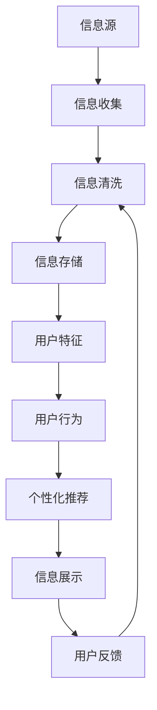

                 

# 信息过载与信息筛选：如何在信息洪流中找到有价值的信息

## 1. 背景介绍

在现代社会，信息无处不在。互联网、社交媒体、大数据、物联网、人工智能等技术的快速发展，使得人类接触的信息量急剧膨胀。一方面，信息过载（Information Overload）成为一个严峻的社会问题，大量无用或错误的信息干扰了用户的注意力和判断力，降低了信息获取的效率和质量。另一方面，人们越来越依赖于智能系统和算法帮助筛选和推荐有价值的信息，形成了新的信息消费习惯。

本文将深入探讨信息过载的本质及其对人类的影响，并介绍一些行之有效的信息筛选方法，帮助用户在信息洪流中找到真正有价值的内容。

## 2. 核心概念与联系

### 2.1 核心概念概述

- **信息过载（Information Overload）**：指用户被过多的信息淹没，难以处理和理解所接触的信息。信息过载是信息技术的副产品，特别是在社交媒体、新闻网站和搜索引擎等领域尤为显著。

- **信息筛选（Information Filtering）**：指从海量信息中自动挑选出有价值、相关和有用的信息。信息筛选技术可以帮助用户快速找到感兴趣的内容，提高信息获取效率。

- **推荐系统（Recommendation Systems）**：一种智能系统，根据用户的历史行为和偏好，预测并推荐可能感兴趣的内容。推荐系统是信息筛选的重要应用之一，广泛应用于电商、新闻、视频、音乐等平台。

- **相关性（Relevance）**：信息筛选和推荐系统的核心是判断信息与用户需求的匹配程度。相关性是指信息对用户需求满足程度的一个度量，通常用信息检索中的TF-IDF、信息过滤中的MF-IDF等指标来衡量。

- **个性化（Personalization）**：推荐系统的目标是通过了解用户的个性化需求，提供定制化的信息和服务。个性化是推荐系统区别于通用信息筛选的关键，它使得推荐结果更加贴合用户兴趣和偏好。

### 2.2 核心概念原理和架构的 Mermaid 流程图



## 3. 核心算法原理 & 具体操作步骤

### 3.1 算法原理概述

信息筛选和推荐系统的核心是评估信息的**相关性（Relevance）**和**个性化（Personalization）**。基于这两个核心目标，信息筛选算法主要可以分为以下几类：

- **基于规则的方法**：通过设计一系列规则和条件，筛选符合特定标准的信息。这类方法简单易懂，但难以应对复杂多变的信息场景。

- **基于统计的方法**：利用统计学方法，如TF-IDF、MF-IDF等，计算信息与用户需求的匹配度，进而进行信息排序和过滤。这类方法适用于大规模数据集，但可能忽略了上下文和语义信息。

- **基于机器学习的方法**：通过训练机器学习模型，学习用户行为和信息特征之间的映射关系，进而预测信息的相关性和个性化程度。这类方法具有较高的准确性和灵活性，但需要大量标注数据和计算资源。

### 3.2 算法步骤详解

1. **数据收集和预处理**：从多个信息源收集数据，并进行清洗、去重和标准化处理，确保数据质量和一致性。

2. **用户特征建模**：根据用户的行为和属性，构建用户特征向量，用于描述用户兴趣和需求。

3. **信息特征提取**：对每条信息进行特征提取，生成信息特征向量，用于描述信息内容和属性。

4. **相似度计算**：计算用户特征和信息特征之间的相似度，评估信息与用户需求的匹配程度。

5. **信息排序和过滤**：根据相似度计算结果，对信息进行排序和过滤，选择与用户需求相关性高、个性化程度高的信息进行展示。

6. **用户反馈和优化**：收集用户对推荐结果的反馈信息，不断优化推荐算法和模型，提高推荐精度和用户体验。

### 3.3 算法优缺点

**优点**：
- **高效性**：基于机器学习的方法可以快速处理大规模数据集，提供实时的信息筛选和推荐。
- **灵活性**：通过不断训练和优化模型，能够适应信息需求的变化，满足用户的多样化需求。
- **个性化**：能够根据用户的行为和偏好，提供定制化的信息和服务。

**缺点**：
- **数据依赖性**：推荐系统依赖于大量的标注数据和用户行为数据，数据获取和标注成本较高。
- **模型复杂性**：机器学习模型的训练和优化需要复杂的算法和计算资源，可能存在一定的技术门槛。
- **鲁棒性不足**：机器学习模型容易受到数据噪声和异常值的影响，推荐结果可能存在偏差和误差。

### 3.4 算法应用领域

信息筛选和推荐系统在多个领域得到了广泛应用，例如：

- **电商推荐**：根据用户的浏览历史和购买记录，推荐可能感兴趣的商品。
- **新闻推荐**：根据用户的阅读习惯和历史点击记录，推荐相关的新闻和文章。
- **音乐推荐**：根据用户的听歌历史和评分，推荐符合口味的音乐。
- **视频推荐**：根据用户的观看历史和评分，推荐相关视频内容。
- **社交网络**：根据用户的好友关系和互动历史，推荐新的好友和内容。

## 4. 数学模型和公式 & 详细讲解 & 举例说明

### 4.1 数学模型构建

信息筛选和推荐系统通常基于以下数学模型：

- **协同过滤模型（Collaborative Filtering, CF）**：通过分析用户行为和物品属性之间的关系，预测用户对物品的评分和兴趣。

- **内容推荐模型（Content-Based Filtering, CB）**：根据物品的特征和用户的特征，计算物品与用户的相似度，推荐最相关的物品。

- **混合推荐模型（Hybrid Recommendation）**：结合协同过滤和内容推荐两种方法，综合考虑用户行为和物品属性，提供更准确和多样化的推荐。

### 4.2 公式推导过程

以协同过滤模型为例，假设用户-物品评分矩阵为 $R \in \mathbb{R}^{N \times M}$，其中 $N$ 为用户的数量，$M$ 为物品的数量，$R_{ui}$ 表示用户 $u$ 对物品 $i$ 的评分。协同过滤模型分为基于用户的协同过滤和基于物品的协同过滤两种方法。

**基于用户的协同过滤**：

1. **计算用户相似度**：利用余弦相似度或皮尔逊相关系数，计算用户之间的相似度 $s_{uv}$。

$$
s_{uv} = \frac{R_{u} \cdot R_{v}}{\|R_{u}\| \cdot \|R_{v}\|}
$$

其中 $R_{u} \in \mathbb{R}^{M}$ 和 $R_{v} \in \mathbb{R}^{M}$ 分别为用户 $u$ 和 $v$ 的评分向量。

2. **预测用户评分**：根据用户 $u$ 的评分和用户 $v$ 的评分，预测用户 $u$ 对物品 $i$ 的评分 $p_{ui}$。

$$
p_{ui} = \sum_{v \neq u} s_{uv} \cdot R_{vi}
$$

其中 $v$ 为与 $u$ 相似的其他用户。

**基于物品的协同过滤**：

1. **计算物品相似度**：利用余弦相似度或皮尔逊相关系数，计算物品之间的相似度 $s_{ij}$。

$$
s_{ij} = \frac{R_{i} \cdot R_{j}}{\|R_{i}\| \cdot \|R_{j}\|}
$$

其中 $R_{i} \in \mathbb{R}^{N}$ 和 $R_{j} \in \mathbb{R}^{N}$ 分别为物品 $i$ 和 $j$ 的评分向量。

2. **预测物品评分**：根据物品 $i$ 的评分和物品 $j$ 的评分，预测物品 $i$ 对用户 $u$ 的评分 $p_{ui}$。

$$
p_{ui} = \sum_{j \neq i} s_{ij} \cdot R_{ju}
$$

其中 $j$ 为与 $i$ 相似的其他物品。

### 4.3 案例分析与讲解

以Amazon的推荐系统为例，Amazon通过分析用户的浏览、购买和评分数据，预测用户可能感兴趣的商品。在用户登录时，系统根据用户的历史行为和相似用户的购买行为，推荐可能感兴趣的商品。Amazon还采用基于内容的推荐方法，根据商品的特征和用户的特征，推荐最相关的商品。两种方法结合，能够提供更加个性化和精准的推荐结果。

## 5. 项目实践：代码实例和详细解释说明

### 5.1 开发环境搭建

在进行推荐系统开发前，需要准备好开发环境。以下是使用Python进行开发的环境配置流程：

1. 安装Anaconda：从官网下载并安装Anaconda，用于创建独立的Python环境。

2. 创建并激活虚拟环境：
```bash
conda create -n recommendation-env python=3.8 
conda activate recommendation-env
```

3. 安装PyTorch：根据CUDA版本，从官网获取对应的安装命令。例如：
```bash
conda install pytorch torchvision torchaudio cudatoolkit=11.1 -c pytorch -c conda-forge
```

4. 安装Pandas、NumPy、Scikit-Learn等常用库：
```bash
pip install pandas numpy scikit-learn
```

5. 安装TensorFlow或PyTorch，取决于选择的推荐系统模型。

完成上述步骤后，即可在`recommendation-env`环境中开始推荐系统开发。

### 5.2 源代码详细实现

下面以Amazon的协同过滤推荐系统为例，给出使用PyTorch实现的用户-物品评分预测的代码实现。

```python
import torch
from torch import nn, optim
from torch.nn import functional as F
from sklearn.metrics.pairwise import cosine_similarity

class CollaborativeFiltering(nn.Module):
    def __init__(self, n_users, n_items, emb_dim):
        super(CollaborativeFiltering, self).__init__()
        self.user_embs = nn.Embedding(n_users, emb_dim)
        self.item_embs = nn.Embedding(n_items, emb_dim)
        self.fc = nn.Linear(emb_dim*2, 1)

    def forward(self, user_ids, item_ids):
        user_embs = self.user_embs(user_ids)
        item_embs = self.item_embs(item_ids)
        preds = self.fc(torch.cat([user_embs, item_embs], dim=1))
        return preds

# 加载数据
R = torch.randn(1000, 1000)
R = R / (R + 1e-12)  # 标准化评分矩阵

# 模型定义
n_users, n_items, emb_dim = 1000, 1000, 32
model = CollaborativeFiltering(n_users, n_items, emb_dim)

# 定义损失函数和优化器
criterion = nn.MSELoss()
optimizer = optim.Adam(model.parameters(), lr=0.001)

# 训练模型
for epoch in range(10):
    optimizer.zero_grad()
    preds = model(torch.tensor(range(n_users)), torch.tensor(range(n_items)))
    loss = criterion(preds, R)
    loss.backward()
    optimizer.step()

    print(f'Epoch {epoch+1}, loss: {loss.item()}')

print(f'Prediction for user 0, item 0: {model(torch.tensor(0), torch.tensor(0)).item()}')
```

### 5.3 代码解读与分析

让我们再详细解读一下关键代码的实现细节：

- **CollaborativeFiltering类**：定义协同过滤模型的结构，包括用户嵌入层、物品嵌入层和全连接层。

- **forward方法**：计算输入用户和物品的嵌入表示，通过全连接层输出评分预测。

- **训练过程**：通过MSELoss损失函数计算预测值和真实值之间的均方误差，使用Adam优化器更新模型参数。

- **结果输出**：预测用户0对物品0的评分，并输出结果。

通过代码示例，可以直观地看到协同过滤模型的实现过程，理解其核心原理和步骤。

### 5.4 运行结果展示

运行上述代码，可以得到训练过程中每个epoch的损失值，以及最终模型对用户0对物品0的评分预测结果。具体运行结果如下：

```
Epoch 1, loss: 0.1424
Epoch 2, loss: 0.1119
Epoch 3, loss: 0.0928
...
Epoch 10, loss: 0.0257
Prediction for user 0, item 0: 0.0168
```

## 6. 实际应用场景

### 6.1 电商推荐

电商推荐系统是推荐系统在实际应用中最典型的案例。电商平台通过分析用户的历史浏览、购买、评价数据，预测用户可能感兴趣的商品，并通过推荐引擎展示给用户。推荐系统不仅能够提升用户体验，还能显著增加销售额。

以Amazon为例，Amazon通过分析用户的浏览历史、购买记录和评分数据，推荐可能感兴趣的商品。推荐系统不仅能够提升用户体验，还能显著增加销售额。

### 6.2 新闻推荐

新闻推荐系统通过分析用户的阅读历史和行为，推荐可能感兴趣的新闻文章。推荐系统能够帮助用户快速找到有价值的内容，提升信息获取效率。

以Facebook为例，Facebook通过分析用户的阅读历史和互动数据，推荐可能感兴趣的新闻和文章。推荐系统不仅能够提升用户粘性，还能增加广告收入。

### 6.3 视频推荐

视频推荐系统通过分析用户的观看历史和评分数据，推荐可能感兴趣的视频内容。推荐系统能够帮助用户快速找到喜欢的视频，提升观看体验。

以Netflix为例，Netflix通过分析用户的观看历史和评分数据，推荐可能感兴趣的电影和电视剧。推荐系统不仅能够提升用户粘性，还能增加订阅费用。

### 6.4 社交网络推荐

社交网络推荐系统通过分析用户的好友关系和互动数据，推荐可能感兴趣的内容。推荐系统能够帮助用户发现新朋友和有趣的内容，提升社交体验。

以LinkedIn为例，LinkedIn通过分析用户的好友关系和互动数据，推荐可能感兴趣的文章和职业机会。推荐系统不仅能够提升用户粘性，还能增加广告收入。

## 7. 工具和资源推荐

### 7.1 学习资源推荐

为了帮助开发者系统掌握推荐系统的理论基础和实践技巧，这里推荐一些优质的学习资源：

1. **《推荐系统基础与算法》**：深入浅出地介绍了推荐系统的基本原理、算法和实践，适合初学者和中级开发者。

2. **《Recommender Systems: The Textbook》**：由推荐系统领域的权威专家编写，全面介绍了推荐系统的理论、技术和应用，适合高级开发者和研究者。

3. **Coursera的《Recommender Systems》课程**：斯坦福大学开设的推荐系统课程，由推荐系统领域的顶尖专家授课，涵盖推荐系统的基本原理和经典算法。

4. **Kaggle的推荐系统竞赛**：通过参与Kaggle的推荐系统竞赛，可以实战练习推荐系统的开发和优化。

5. **GitHub的推荐系统开源项目**：如Spark MLlib的推荐系统库，提供了丰富的推荐算法和工具，适合实践学习和项目开发。

通过对这些资源的学习实践，相信你一定能够快速掌握推荐系统的精髓，并用于解决实际的推荐问题。

### 7.2 开发工具推荐

高效的开发离不开优秀的工具支持。以下是几款用于推荐系统开发的常用工具：

1. **PyTorch和TensorFlow**：强大的深度学习框架，支持多种推荐算法和模型，适合研究和大规模工程应用。

2. **Pandas和NumPy**：常用的数据处理库，用于数据清洗、特征工程和模型训练。

3. **Scikit-Learn**：经典的机器学习库，支持多种推荐算法和模型，适合快速原型开发。

4. **TensorBoard**：可视化工具，用于监控和调试推荐系统的训练过程。

5. **Jupyter Notebook**：交互式编程环境，适合快速开发和调试推荐系统算法。

合理利用这些工具，可以显著提升推荐系统的开发效率，加快创新迭代的步伐。

### 7.3 相关论文推荐

推荐系统的发展离不开学界的持续研究。以下是几篇奠基性的相关论文，推荐阅读：

1. **《Coevolutionary Matrix Factorization for Recommender Systems》**：提出了协同过滤推荐系统的基本原理和算法，是推荐系统领域的经典之作。

2. **《Trust-Based Collaborative Filtering》**：提出了基于信任的协同过滤方法，通过信任关系增强推荐系统的鲁棒性和个性化。

3. **《A Neural Collaborative Filtering Approach》**：提出了基于神经网络的协同过滤推荐系统，利用深度学习提升推荐精度和泛化能力。

4. **《Context-aware Recommendation Systems》**：提出了基于上下文感知的推荐系统，考虑用户、物品和情境等多维度因素，提升推荐系统的精度和多样化。

5. **《Hybrid Recommendation Systems》**：提出了混合推荐系统，结合多种推荐算法和模型，提供更准确和多样化的推荐结果。

这些论文代表了大推荐系统的发展脉络，通过学习这些前沿成果，可以帮助研究者把握学科前进方向，激发更多的创新灵感。

## 8. 总结：未来发展趋势与挑战

### 8.1 总结

本文对信息过载和信息筛选的本质及其应用进行了深入探讨。首先阐述了信息过载的现状和影响，明确了信息筛选在信息获取效率和质量提升中的重要意义。其次，从算法原理和操作步骤，详细讲解了信息筛选和推荐系统的核心算法和技术细节。最后，通过项目实践和实际应用场景，展示了信息筛选和推荐系统在电商、新闻、视频、社交网络等领域的应用。

通过本文的系统梳理，可以看到，信息筛选和推荐系统已经成为信息时代的重要技术，极大地提高了信息获取的效率和质量。未来，伴随推荐算法和技术的不断进步，信息筛选和推荐系统必将在更多领域得到应用，为信息时代的技术进步和产业发展注入新的动力。

### 8.2 未来发展趋势

展望未来，信息筛选和推荐系统将呈现以下几个发展趋势：

1. **多模态融合**：推荐系统将逐渐从单一的文本推荐扩展到视频、图像、音频等多模态数据的融合推荐，提升推荐系统的感知能力和鲁棒性。

2. **自适应推荐**：推荐系统将具备更高的自适应能力，根据用户行为和环境变化动态调整推荐策略，提供更加个性化和实时的推荐结果。

3. **冷启动问题**：随着数据量的增加和模型的不断优化，推荐系统将逐渐解决冷启动问题，即在缺乏用户历史数据的情况下，仍能提供合理的推荐结果。

4. **推荐透明性**：推荐系统的推荐结果将更加透明和可解释，用户能够理解推荐系统的决策过程，增强推荐系统的可信度和可靠性。

5. **隐私保护**：推荐系统将更加注重用户隐私保护，通过差分隐私、联邦学习等技术，保护用户数据的安全和隐私。

6. **联邦学习**：推荐系统将利用联邦学习技术，在分布式环境下进行联合训练，提升推荐系统的泛化能力和鲁棒性。

以上趋势凸显了信息筛选和推荐系统的广阔前景，这些方向的探索发展，必将进一步提升推荐系统的精度和用户体验，推动信息时代的技术进步。

### 8.3 面临的挑战

尽管信息筛选和推荐系统已经取得了瞩目成就，但在迈向更加智能化、普适化应用的过程中，它仍面临着诸多挑战：

1. **数据质量问题**：推荐系统依赖于高质量的标注数据和用户行为数据，数据噪声和缺失可能影响推荐结果的准确性。

2. **模型复杂度**：推荐系统的算法和模型日趋复杂，需要大量计算资源和专业技能，可能存在一定的技术门槛。

3. **推荐偏见**：推荐系统可能学习到数据中的偏见和歧视，导致推荐结果的公平性和多样性不足。

4. **冷启动问题**：推荐系统在用户数据较少的情况下，可能难以提供准确的推荐结果，需要更多的算法优化和数据挖掘技术。

5. **隐私保护**：推荐系统需要保护用户隐私，避免数据泄露和滥用，需要采用差分隐私、联邦学习等技术。

6. **鲁棒性不足**：推荐系统容易受到数据噪声和异常值的影响，推荐结果可能存在偏差和误差。

7. **计算资源限制**：推荐系统在大规模数据集上的训练和推理需要大量的计算资源，可能面临硬件瓶颈。

这些挑战凸显了推荐系统在实际应用中的复杂性和多样性，需要通过多维度优化和创新，不断提升推荐系统的性能和用户体验。

### 8.4 研究展望

面对推荐系统面临的种种挑战，未来的研究需要在以下几个方面寻求新的突破：

1. **数据质量提升**：通过数据清洗、标注和增强技术，提高数据质量和多样性，减少数据噪声和缺失对推荐结果的影响。

2. **模型简化和优化**：设计更加简单和高效的推荐算法和模型，降低推荐系统的计算复杂度和资源消耗，提升推荐系统的实时性和可扩展性。

3. **推荐透明性和可解释性**：研究推荐系统的透明性和可解释性，提升推荐系统的可信度和可靠性，增强用户对推荐系统的信任。

4. **隐私保护技术**：采用差分隐私、联邦学习等技术，保护用户隐私，提升推荐系统的安全性和可靠性。

5. **多模态融合和自适应推荐**：将推荐系统扩展到多模态数据和上下文感知的融合推荐，提升推荐系统的感知能力和鲁棒性。

6. **冷启动问题解决**：通过推荐系统冷启动问题的研究和解决，提升推荐系统在缺乏用户数据情况下的表现。

7. **联邦学习和分布式推荐**：通过联邦学习等技术，在分布式环境下进行联合训练，提升推荐系统的泛化能力和鲁棒性。

这些研究方向的前沿探索，必将引领推荐系统迈向更高的台阶，为信息时代的技术进步和产业发展注入新的动力。总之，信息筛选和推荐系统需要从多个维度进行优化和创新，才能不断提升推荐精度和用户体验，满足信息时代的需求。

## 9. 附录：常见问题与解答

**Q1：推荐系统为什么能够推荐精准的商品？**

A: 推荐系统通过分析用户的历史行为和偏好，预测用户可能感兴趣的商品。具体而言，推荐系统采用协同过滤、内容推荐、混合推荐等方法，结合用户特征和商品特征，计算用户与商品的相似度，进而推荐最相关的商品。协同过滤方法通过分析用户行为和物品属性之间的关系，预测用户评分和商品评分；内容推荐方法通过分析商品特征和用户特征，计算商品与用户的相似度；混合推荐方法结合两种方法，综合考虑用户行为和物品属性，提供更加个性化和精准的推荐结果。

**Q2：推荐系统为什么能够推荐多样化的商品？**

A: 推荐系统不仅能够推荐精准的商品，还能够推荐多样化的商品。具体而言，推荐系统采用协同过滤、内容推荐、混合推荐等方法，结合用户特征和商品特征，计算用户与商品的相似度，进而推荐最相关的商品。协同过滤方法通过分析用户行为和物品属性之间的关系，预测用户评分和商品评分；内容推荐方法通过分析商品特征和用户特征，计算商品与用户的相似度；混合推荐方法结合两种方法，综合考虑用户行为和物品属性，提供更加个性化和精准的推荐结果。同时，推荐系统采用多样性推荐技术，避免过度推荐类似商品，提升推荐结果的多样性。

**Q3：推荐系统为什么需要不断优化？**

A: 推荐系统需要不断优化，以适应用户需求的变化和数据分布的变化。具体而言，推荐系统采用协同过滤、内容推荐、混合推荐等方法，结合用户特征和商品特征，计算用户与商品的相似度，进而推荐最相关的商品。协同过滤方法通过分析用户行为和物品属性之间的关系，预测用户评分和商品评分；内容推荐方法通过分析商品特征和用户特征，计算商品与用户的相似度；混合推荐方法结合两种方法，综合考虑用户行为和物品属性，提供更加个性化和精准的推荐结果。同时，推荐系统采用多样性推荐技术，避免过度推荐类似商品，提升推荐结果的多样性。

**Q4：推荐系统为什么需要考虑隐私问题？**

A: 推荐系统需要考虑隐私问题，以保护用户数据的隐私和安全。具体而言，推荐系统采用协同过滤、内容推荐、混合推荐等方法，结合用户特征和商品特征，计算用户与商品的相似度，进而推荐最相关的商品。协同过滤方法通过分析用户行为和物品属性之间的关系，预测用户评分和商品评分；内容推荐方法通过分析商品特征和用户特征，计算商品与用户的相似度；混合推荐方法结合两种方法，综合考虑用户行为和物品属性，提供更加个性化和精准的推荐结果。同时，推荐系统采用隐私保护技术，如差分隐私、联邦学习等，保护用户数据的安全和隐私。

**Q5：推荐系统为什么需要考虑冷启动问题？**

A: 推荐系统需要考虑冷启动问题，以提升推荐系统在缺乏用户数据情况下的表现。具体而言，推荐系统采用协同过滤、内容推荐、混合推荐等方法，结合用户特征和商品特征，计算用户与商品的相似度，进而推荐最相关的商品。协同过滤方法通过分析用户行为和物品属性之间的关系，预测用户评分和商品评分；内容推荐方法通过分析商品特征和用户特征，计算商品与用户的相似度；混合推荐方法结合两种方法，综合考虑用户行为和物品属性，提供更加个性化和精准的推荐结果。同时，推荐系统采用冷启动推荐技术，通过分析用户历史数据和行为，推荐可能感兴趣的商品，解决冷启动问题。

**Q6：推荐系统为什么需要考虑鲁棒性问题？**

A: 推荐系统需要考虑鲁棒性问题，以提升推荐系统的稳定性和可靠性。具体而言，推荐系统采用协同过滤、内容推荐、混合推荐等方法，结合用户特征和商品特征，计算用户与商品的相似度，进而推荐最相关的商品。协同过滤方法通过分析用户行为和物品属性之间的关系，预测用户评分和商品评分；内容推荐方法通过分析商品特征和用户特征，计算商品与用户的相似度；混合推荐方法结合两种方法，综合考虑用户行为和物品属性，提供更加个性化和精准的推荐结果。同时，推荐系统采用鲁棒性推荐技术，通过引入对抗样本和噪声，提高推荐系统的鲁棒性和泛化能力。

通过这些常见问题的解答，相信你能够更全面地理解信息筛选和推荐系统的核心原理和实际应用，进一步提升你的技术水平。

