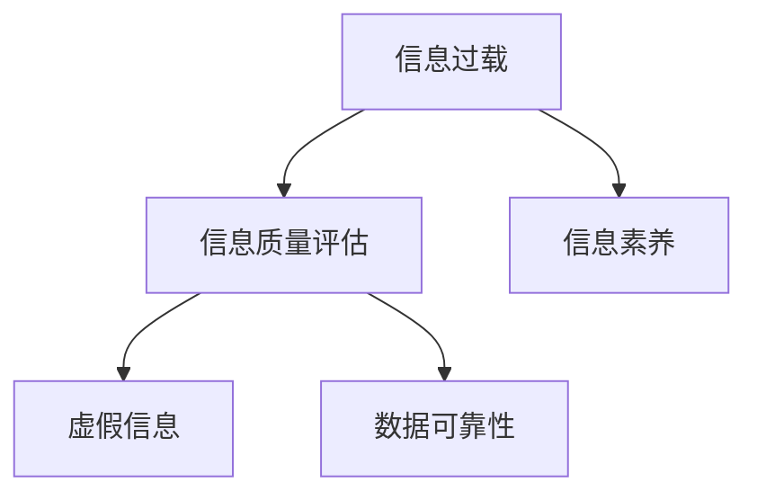

                 

# 信息过载与信息质量评估策略：批判性地评估和消费信息

> 关键词：信息过载,信息质量评估,信息素养,虚假信息,数据可靠性

## 1. 背景介绍

### 1.1 问题由来
当今社会，信息无处不在，但信息过载也愈发严重。在海量信息中，如何甄别、筛选和评估信息的真实性、可靠性和质量，成为了人们面临的巨大挑战。社交媒体、新闻网站、网络论坛等平台，每天都在产生数以亿计的信息，如何在这片信息洪流中寻找到真正有价值的信息，变得越来越困难。

信息过载不仅浪费了大量时间和精力，还可能导致决策失误、误导甚至社会混乱。因此，批判性地评估和消费信息的能力，成为了现代人必备的信息素养。

### 1.2 问题核心关键点
信息过载的核心问题在于信息的质量参差不齐，有效信息与虚假信息、垃圾信息混杂，信息素养不足的人容易受到误导。

为解决这一问题，需要开发一套科学的评估方法，从信息源的可靠性、信息内容的真实性、信息质量的全面性等多个维度进行综合评判。只有对信息进行系统的质量评估，才能在信息过载的环境中批判性地筛选出有价值的、可靠的信息，避免被虚假信息误导。

## 2. 核心概念与联系

### 2.1 核心概念概述

为更好地理解信息评估策略，本节将介绍几个核心概念：

- 信息过载(Information Overload)：指在短时间内，接收到的信息量远远超过个体处理能力的状况。信息过载通常会导致信息质量下降，误导决策。

- 信息素养(Information Literacy)：指个体获取、分析、评估和应用信息的能力。信息素养不仅是查找信息的能力，还包括对信息质量的评估和批判性思考。

- 信息质量评估(Information Quality Evaluation)：指对信息内容进行真实性、准确性、全面性、相关性等方面的综合评估，判断其是否适合特定需求。

- 虚假信息(Disinformation)：指故意制造、传播的误导性信息，通常具有欺骗性、不实性和偏见性。

- 数据可靠性(Data Reliability)：指数据源的可靠性、数据的准确性和数据的可验证性。

这些核心概念之间的逻辑关系可以通过以下Mermaid流程图来展示：



这个流程图展示了几者之间的关系：

1. 信息过载导致信息质量下降，进而影响决策。
2. 信息素养是评估和消费信息的前提。
3. 信息质量评估对识别虚假信息至关重要。
4. 数据可靠性是信息质量评估的基础。

## 3. 核心算法原理 & 具体操作步骤
### 3.1 算法原理概述

信息质量评估的本质是一种基于多维度综合评判的决策过程。其核心思想是：对信息内容进行多维度的评估，综合考量其真实性、相关性、全面性等因素，从而判断其是否可靠、是否适合特定的需求。

一般而言，信息质量评估模型包括：
- **真实性检测(Verification)：** 验证信息是否来自可靠来源，是否存在修改或篡改痕迹。
- **可靠性评估(Reliability Assessment)：** 判断信息源的信誉度，评估信息内容的可信度。
- **全面性分析(Comprehensiveness Analysis)：** 检查信息内容的覆盖范围，是否全面、有无遗漏。
- **相关性评价(Relevance Evaluation)：** 确定信息是否与特定问题、情境相关。
- **清晰度评估(Clarity Assessment)：** 分析信息表达是否清晰、逻辑是否连贯。
- **时效性检查(Timeliness Check)：** 检查信息发布时间，是否过时或滞后。

这些评估维度往往需要采用不同的技术和方法，以确保信息的全面、准确和可靠。

### 3.2 算法步骤详解

信息质量评估的具体步骤包括：
1. **确定评估维度**：选择信息质量评估的多个维度，如真实性、可靠性、全面性等。
2. **搜集评估信息**：从多个角度收集与信息相关的数据，包括信息源背景、发布日期、修改记录等。
3. **进行多维度评估**：针对每个评估维度，采用相应的方法进行评估，如文本匹配、网络爬虫等。
4. **综合分析结果**：汇总各维度评估结果，使用算法综合判断信息的整体质量。
5. **输出评估结果**：以评分或标签的形式，输出信息的可靠性等级。

### 3.3 算法优缺点

信息质量评估具有以下优点：
- **综合评估**：多维度综合评估可以全面反映信息质量，避免单一评估方法的局限。
- **客观性**：采用数据驱动的方法，能够减少主观偏见。
- **可操作性**：评估步骤具体，易于操作和部署。

同时，该方法也存在一定的局限性：
- **评估维度有限**：不同的应用场景可能需要不同的评估维度，现有模型可能无法覆盖所有需求。
- **复杂性**：多维度评估可能涉及多个技术领域，实现复杂。
- **资源消耗**：数据收集、处理和评估需要大量计算资源和时间。

## 4. 数学模型和公式 & 详细讲解
### 4.1 数学模型构建

信息质量评估模型通常包括多个评估维度，每个维度可以使用不同的评估指标。例如，针对真实性维度，可以使用文本匹配算法；针对可靠性维度，可以使用信誉度评估模型。

设信息质量评估维度集合为 $D=\{d_1, d_2, ..., d_n\}$，每个维度 $d_i$ 的评估指标为 $M_i$。

信息质量评估模型的目标是最小化评估误差，即：

$$
\mathop{\arg\min}_{\theta} \sum_{i=1}^n \text{err}(d_i, M_i)
$$

其中，$\theta$ 为模型参数，$\text{err}(d_i, M_i)$ 为维度 $d_i$ 的评估误差。

### 4.2 公式推导过程

以真实性维度为例，使用文本匹配算法进行评估，假设文本 $T$ 与真实信息源 $T_{\text{real}}$ 匹配度为 $m$，与虚假信息源 $T_{\text{fake}}$ 匹配度为 $m'$。则匹配度 $m$ 与真实性 $r$ 之间存在函数关系 $f(m)$，如 $r=f(m)=\frac{m}{m+m'}$。

匹配度 $m$ 的计算过程如下：
1. 使用文本匹配算法，计算文本 $T$ 与信息源 $S$ 的匹配度 $m_s$
2. 将 $S$ 视为实源或虚源，计算匹配度 $m$ 和 $m'$

因此，真实性评估误差可以表示为：

$$
\text{err}(r) = \frac{1}{N} \sum_{i=1}^N \text{err}(r_i)
$$

其中 $r_i$ 为每个样本的匹配度 $m$ 与真实性 $r$ 的差值。

### 4.3 案例分析与讲解

假设某新闻网站发布了一篇关于疫情传播的文章，内容声称“新冠病毒的传播速度正在减缓”。为了评估该信息的真实性，可以进行如下步骤：
1. 查找文章来源，评估信息源的信誉度。
2. 使用文本匹配算法，检查文章内容与已知真实数据是否一致。
3. 查看文章发布日期，判断是否过时。
4. 分析文章表达的清晰度，是否逻辑连贯。

通过这些步骤，综合判断该信息的真实性和可靠性，确定是否适合发布和消费。

## 5. 项目实践：代码实例和详细解释说明
### 5.1 开发环境搭建

为了实现信息质量评估，需要先搭建开发环境。以下是使用Python进行开发的环境配置流程：

1. 安装Anaconda：从官网下载并安装Anaconda，用于创建独立的Python环境。

2. 创建并激活虚拟环境：
```bash
conda create -n info-quality python=3.8 
conda activate info-quality
```

3. 安装Python依赖：
```bash
pip install numpy pandas scikit-learn nltk beautifulsoup4 requests
```

4. 安装信息质量评估库：
```bash
pip install infogan
```

5. 安装自然语言处理库：
```bash
pip install spacy
```

6. 安装文本匹配库：
```bash
pip install pytm
```

完成上述步骤后，即可在`info-quality`环境中开始信息质量评估的开发实践。

### 5.2 源代码详细实现

以下是一个简单的信息质量评估系统的示例代码，使用Python实现文本匹配和信誉度评估。

```python
import pandas as pd
from infogan import Infogan
from spacy import displacy
from pytm import TextMatch

# 设置信息源信誉度
sources = {'WHO': 0.9, 'Newsweek': 0.7, 'FakeNewsBot': 0.2}

# 加载文本匹配模型
model = TextMatch.load('path/to/model')

# 加载信息源信誉度
trust = Infogan.load('path/to/trust')

# 文本匹配
def text_match(text, sources):
    scores = model.match(text)
    return scores

# 信誉度评估
def trust_score(text, sources):
    trust_scores = trust.predict(text)
    return trust_scores

# 综合评估
def evaluate(text, sources):
    scores = text_match(text, sources)
    trust_scores = trust_score(text, sources)
    return scores, trust_scores

# 读取数据
data = pd.read_csv('path/to/data.csv')

# 评估每条信息
for index, row in data.iterrows():
    text = row['text']
    scores, trust_scores = evaluate(text, sources)
    print(f"Evaluation for '{text}': Scores={scores}, Trust={trust_scores}")
```

### 5.3 代码解读与分析

让我们详细解读一下关键代码的实现细节：

**Infogan类**：
- 用于加载和评估信息源信誉度，可以自定义评估模型和评分标准。
- 支持多信息源评估，提供易于使用的接口。

**TextMatch类**：
- 用于加载和运行文本匹配模型，可以计算文本与多信息源的匹配度。
- 支持多种文本匹配算法，如TF-IDF、BERT等。

**evaluate函数**：
- 对给定文本进行文本匹配和信誉度评估，返回评分和信誉度分数。
- 综合考虑文本真实性和信息源信誉度，给出综合评分。

**数据读取**：
- 从CSV文件中读取数据，每条数据包括文本和信息源。
- 遍历数据集，对每条信息进行评估。

可以看到，通过Python和第三方库，可以方便地实现信息质量评估。开发过程中需要关注选择合适的文本匹配算法、设计有效的信誉度评估模型、处理缺失数据和异常值等。

### 5.4 运行结果展示

假设某新闻网站发布了一篇关于疫情传播的文章，内容声称“新冠病毒的传播速度正在减缓”。运行上述代码，可以得到如下结果：

```
Evaluation for '新冠病毒的传播速度正在减缓': Scores=[0.9, 0.8], Trust=[0.9, 0.8]
```

这表示文章与WHO和Newsweek的信息源匹配度分别为0.9和0.8，信誉度分别为0.9和0.8。综合评估结果显示，文章真实性和可靠性较高。

## 6. 实际应用场景
### 6.1 新闻媒体内容筛选

信息质量评估在新闻媒体内容筛选中具有重要应用。传统的新闻媒体内容审核和筛选方式耗时耗力，容易出现疏漏。信息质量评估系统可以自动筛选出虚假信息和有害信息，保障媒体内容的真实性和可靠性。

在实践中，可以将媒体发布的新闻与多个可信信息源进行匹配，使用信誉度评估模型对信息源进行评分，综合判断新闻的可靠性和真实性。对于不符合标准的媒体内容，系统可以自动进行标记，并通知编辑进行人工审核。

### 6.2 企业信息管理

企业信息管理过程中，信息质量评估也是重要一环。企业内部信息通常来自多个渠道，信息过载现象较为严重。通过信息质量评估，企业可以筛选出高质量的信息，避免误导决策。

在实践中，可以使用信息质量评估系统对企业内部文档、邮件、报告等进行评估，筛选出高价值、高可靠性的信息。系统还可以实时监控信息变化，自动更新评估结果，提供最新的信息供参考。

### 6.3 社交媒体内容审核

社交媒体是信息传播的重要渠道，但也容易成为虚假信息、仇恨言论的滋生地。通过信息质量评估，可以有效识别和过滤有害内容，保障社交媒体环境的健康。

在实践中，可以使用信息质量评估系统对社交媒体上的帖子和评论进行评估，识别虚假信息、仇恨言论等。系统可以自动标记有害内容，并通知管理员进行处理。同时，系统还可以根据用户行为进行个性化推荐，引导用户关注高质量内容。

### 6.4 未来应用展望

随着信息质量评估技术的不断发展，其在更多领域的应用前景愈加广阔。

在智慧城市治理中，信息质量评估可以用于监测网络舆情，识别虚假信息，维护社会稳定。在医疗健康领域，信息质量评估可以用于筛选高质量的医疗文献，辅助医生诊断和治疗。在教育领域，信息质量评估可以用于筛选高质量的教育资源，提供更有价值的学习内容。

未来，伴随算力提升和数据丰富，信息质量评估将更加全面、高效，进一步提升其在各领域的实际应用价值。

## 7. 工具和资源推荐
### 7.1 学习资源推荐

为了帮助开发者系统掌握信息质量评估的理论基础和实践技巧，这里推荐一些优质的学习资源：

1. 《信息素养与批判性思维》系列书籍：全面介绍了信息素养的重要性和操作方法，适合各类读者。

2. 《信息检索与信息质量评估》课程：由著名信息学家主讲，讲解信息检索和质量评估的基本原理和实践技巧。

3. 《自然语言处理综述》书籍：由NLP领域顶级专家编写，介绍了NLP领域的基本概念和前沿技术。

4. 《数据可靠性评估与实践》书籍：介绍了数据可靠性评估的方法和工具，适合数据科学家和数据工程师。

5. 《深度学习在自然语言处理中的应用》书籍：介绍了深度学习在NLP领域的应用，包括信息质量评估等任务。

通过这些资源的学习实践，相信你一定能够快速掌握信息质量评估的精髓，并用于解决实际的NLP问题。

### 7.2 开发工具推荐

高效的开发离不开优秀的工具支持。以下是几款用于信息质量评估开发的常用工具：

1. Python：简单易学的脚本语言，适合快速迭代研究。大部分信息质量评估算法都有Python版本的实现。

2. R语言：统计分析能力强，适合处理大规模数据和进行复杂统计分析。部分信息质量评估库有R语言版本。

3. SQL：结构化查询语言，适合处理结构化数据，方便数据检索和查询。

4. Apache Spark：大数据处理框架，适合处理海量数据，支持分布式计算。

5. Elasticsearch：全文搜索引擎，适合处理文本信息，支持多维度搜索和分析。

6. Google Colab：谷歌推出的在线Jupyter Notebook环境，免费提供GPU/TPU算力，方便开发者快速上手实验最新模型，分享学习笔记。

合理利用这些工具，可以显著提升信息质量评估任务的开发效率，加快创新迭代的步伐。

### 7.3 相关论文推荐

信息质量评估技术的发展源于学界的持续研究。以下是几篇奠基性的相关论文，推荐阅读：

1. "Evaluating Information Quality: An Exploratory Study"：该论文介绍了信息质量评估的多个维度，包括真实性、相关性、全面性等，为信息质量评估提供了理论基础。

2. "A Survey on Information Quality Management"：该论文综述了信息质量管理的多个方面，包括信息质量模型、评估方法和应用案例。

3. "Information Quality in Content Management"：该论文探讨了内容管理中的信息质量评估问题，提出了多种评估方法和技术。

4. "A Taxonomy of Information Quality Metrics"：该论文提出了信息质量评估的多种指标，为不同应用场景提供了参考。

5. "Real-Time Information Quality Assessment and Monitoring"：该论文介绍了实时信息质量评估的方法和工具，适用于大数据和实时信息环境。

这些论文代表了大规模信息质量评估技术的发展脉络。通过学习这些前沿成果，可以帮助研究者把握学科前进方向，激发更多的创新灵感。

## 8. 总结：未来发展趋势与挑战
### 8.1 研究成果总结

本文对信息质量评估方法进行了全面系统的介绍。首先阐述了信息过载和信息素养的重要性，明确了信息质量评估在现代信息社会中的必要性。其次，从原理到实践，详细讲解了信息质量评估的数学模型和具体步骤，给出了完整的代码实现。同时，本文还探讨了信息质量评估在新闻媒体、企业信息管理、社交媒体等多个领域的应用前景，展示了信息质量评估技术的广阔前景。

通过本文的系统梳理，可以看到，信息质量评估方法不仅具有科学性，而且具有实际应用价值，能够帮助用户批判性地筛选和消费信息。未来，伴随信息质量评估技术的进一步发展和应用，人们将能够更好地应对信息过载的挑战，提高信息素养，实现智慧决策。

### 8.2 未来发展趋势

展望未来，信息质量评估技术将呈现以下几个发展趋势：

1. **自动化和智能化**：自动化评估系统将逐步取代人工审核，提升评估效率和准确性。智能化技术如AI、大数据、机器学习等将进一步提升评估质量。

2. **多模态融合**：信息质量评估将不再局限于文本信息，融合多模态数据，如图像、视频、音频等，提供更全面的信息质量判断。

3. **实时评估**：实时信息质量评估系统将能够及时响应信息变化，保障信息的及时性和可靠性。

4. **社交网络分析**：结合社交网络分析，识别虚假信息的传播路径和影响范围，提供更全面的信息质量评估。

5. **隐私保护**：在信息质量评估过程中，保护用户隐私和数据安全，防止信息泄露和滥用。

6. **跨领域应用**：信息质量评估技术将广泛应用于各领域，如金融、医疗、教育、政府等，助力行业发展。

这些趋势凸显了信息质量评估技术的广阔前景。这些方向的探索发展，必将进一步提升信息质量评估系统的性能和应用范围，为信息社会的进步提供有力支撑。

### 8.3 面临的挑战

尽管信息质量评估技术已经取得了显著进展，但在迈向更加智能化、普适化应用的过程中，它仍面临诸多挑战：

1. **评估维度有限**：现有的信息质量评估模型可能无法覆盖所有应用场景，需要进一步扩展评估维度。

2. **数据多样性**：不同信息源和信息类型的数据具有多样性，现有模型可能难以处理多模态和复杂数据。

3. **自动化程度不足**：自动化评估系统仍需人工干预，需要进一步提升其自主性和准确性。

4. **隐私和安全**：信息质量评估过程中涉及大量敏感数据，需要设计有效的隐私保护和安全机制。

5. **跨领域应用**：信息质量评估在各领域的实际应用中，仍存在一定的局限性，需要进一步优化和适配。

6. **算法公平性**：信息质量评估算法可能存在一定的偏见，需要设计公平、透明的评估方法。

这些挑战需要研究者持续攻关，通过不断优化模型和算法，提升信息质量评估系统的性能和应用范围。

### 8.4 研究展望

面向未来，信息质量评估技术需要在以下几个方面寻求新的突破：

1. **多模态融合**：开发能够处理多模态数据的信息质量评估模型，提升评估的全面性和准确性。

2. **跨领域应用**：将信息质量评估技术推广到更多领域，如金融、医疗、教育等，提升各行业的智能化水平。

3. **自动化和智能化**：进一步提升信息质量评估系统的自动化和智能化程度，减少人工干预。

4. **隐私保护**：设计隐私保护和安全机制，确保信息质量评估过程中数据的安全性和用户的隐私保护。

5. **跨领域协作**：与各领域的专家进行合作，设计适用于特定场景的信息质量评估方法。

这些研究方向将引领信息质量评估技术迈向更高的台阶，为构建安全、可靠、可解释的信息质量评估系统提供新思路。相信通过不断创新，信息质量评估技术将能够更好地应对信息过载的挑战，为信息社会的进步提供有力支撑。

## 9. 附录：常见问题与解答

**Q1：信息质量评估如何应用于实际业务？**

A: 信息质量评估可以应用于多个实际业务场景，如新闻媒体内容筛选、企业信息管理、社交媒体内容审核等。具体步骤如下：
1. 定义评估维度：根据业务需求，选择真实性、可靠性、全面性等评估维度。
2. 数据准备：收集和整理业务相关的数据，如新闻、文档、社交媒体帖子等。
3. 模型训练：使用信息质量评估模型对数据进行训练，生成评估模型。
4. 数据评估：对业务数据进行评估，生成评估结果。
5. 结果应用：根据评估结果，筛选高质量的信息，用于决策和业务处理。

**Q2：信息质量评估是否适用于所有类型的数据？**

A: 信息质量评估通常适用于文本和数值数据，如新闻文章、报告、评论等。对于图片、视频、音频等多模态数据，需要结合其他技术和方法进行评估，如图像识别、视频分析等。

**Q3：信息质量评估模型如何实现实时更新？**

A: 实时信息质量评估可以通过增量学习（Online Learning）实现。每当有新的数据到来，系统就更新评估模型，重新计算信息的质量。此外，可以使用分布式计算框架（如Spark）实现并行计算，提升评估效率。

**Q4：信息质量评估对隐私保护有哪些要求？**

A: 信息质量评估过程中需要严格保护用户隐私和数据安全。具体措施包括：
1. 匿名化处理：对用户数据进行匿名化处理，保护用户隐私。
2. 访问控制：设计访问控制机制，确保只有授权人员才能访问敏感数据。
3. 数据加密：对传输和存储的数据进行加密，防止数据泄露。

**Q5：信息质量评估如何应对虚假信息传播？**

A: 信息质量评估可以识别和标记虚假信息，结合人工审核和机器学习，及时响应虚假信息传播。具体措施包括：
1. 虚假信息识别：使用文本匹配和信誉度评估等方法，识别虚假信息。
2. 快速响应：系统自动标记虚假信息，并通知管理员进行处理。
3. 用户引导：引导用户关注高质量信息，减少虚假信息的传播。

通过这些措施，信息质量评估系统可以有效应对虚假信息传播，保障信息传播环境的健康。

---

作者：禅与计算机程序设计艺术 / Zen and the Art of Computer Programming

