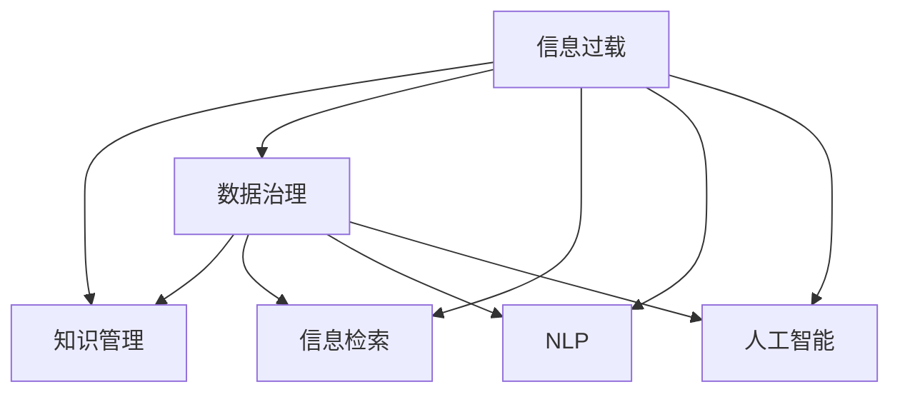

                 

# 信息过载与知识管理策略与实践：管理和组织信息

> 关键词：信息过载,知识管理,数据存储,数据治理,信息检索,自然语言处理,人工智能

## 1. 背景介绍

### 1.1 问题由来
在当今数字化时代，信息爆炸已经成为一个普遍存在的现象。各种形式的数据——文本、图像、视频、音频——每天都在以指数级的速度增长。信息过载不仅仅是技术问题，更是一个全球性的社会和经济问题。无论是个人用户还是企业机构，都在面对海量数据的挑战，信息过载的问题越来越严峻。

### 1.2 问题核心关键点
信息过载的核心在于，信息的产生速度快于人们处理信息的能力。海量的信息不仅使得知识发现变得困难，更可能淹没潜在的有用信息，影响决策过程。解决信息过载的问题，关键在于有效管理和组织信息，使其成为可被利用的知识资产。

## 2. 核心概念与联系

### 2.1 核心概念概述

为了更好地理解信息管理和知识管理的策略与实践，本文将介绍几个核心概念：

- **信息过载（Information Overload）**：指的是信息量远远超过个体或组织处理能力的状态，导致信息利用率低下，甚至造成决策上的误导。

- **知识管理（Knowledge Management）**：涉及识别、创建、获取、传播、评估、整合和利用知识的过程，旨在使组织和个体能更有效地利用知识以实现目标。

- **数据治理（Data Governance）**：确保数据的质量、安全和可用性，涵盖数据标准、数据生命周期、数据管理和数据质量控制等方面。

- **信息检索（Information Retrieval）**：通过算法和工具，从大量数据中自动发现有用的信息。

- **自然语言处理（Natural Language Processing, NLP）**：使计算机能够理解、解释和生成人类语言的技术。

- **人工智能（Artificial Intelligence, AI）**：通过机器学习等技术，模拟人类智能活动，以完成特定任务。

这些概念之间的逻辑关系可以通过以下Mermaid流程图来展示：



这个流程图展示的信息管理与知识管理的核心概念及其之间的关系：

1. 信息过载需要通过数据治理进行管理。
2. 数据治理有助于提高信息检索的效率。
3. 信息检索是实现知识管理的关键技术之一。
4. 自然语言处理和人工智能进一步提升了信息处理的能力和质量。

这些概念共同构成了信息管理和知识管理的框架，为组织和个人提供了有效应对信息过载的方法。

## 3. 核心算法原理 & 具体操作步骤
### 3.1 算法原理概述

信息管理和知识管理的核心在于，如何将海量的信息转化为有用的知识，并确保这些知识能够被有效地利用。这通常通过以下步骤实现：

1. **数据采集与清洗**：从不同来源获取数据，并对数据进行清洗，去除噪声和冗余信息。
2. **数据存储与管理**：利用数据治理技术，确保数据的一致性、完整性和安全性。
3. **知识提取与表示**：通过信息检索和NLP技术，将数据转化为知识单元，如概念、事实和规则等。
4. **知识组织与集成**：使用知识图谱、本体等技术，对知识进行组织和集成，形成知识库。
5. **知识共享与传播**：通过门户、社交网络等平台，促进知识在组织内部的传播和共享。

### 3.2 算法步骤详解

信息管理和知识管理的具体步骤通常包括以下几个关键步骤：

**Step 1: 数据采集与清洗**
- 定义数据采集的范围和频率，确保数据的全面性和及时性。
- 使用ETL工具进行数据清洗，去除无关、重复和错误数据。
- 应用数据验证和异常检测技术，确保数据质量。

**Step 2: 数据存储与管理**
- 选择适当的数据存储技术，如关系型数据库、NoSQL数据库等。
- 设计数据模型，明确数据的结构、属性和关系。
- 实施数据治理策略，包括数据标准、数据安全、数据质量控制等。

**Step 3: 知识提取与表示**
- 使用信息检索技术，如倒排索引、布尔查询等，从海量数据中筛选相关知识。
- 应用自然语言处理技术，如词法分析、句法分析、语义分析等，提取知识单元。
- 将知识单元转化为易于理解和应用的形式，如知识图谱、本体等。

**Step 4: 知识组织与集成**
- 设计知识组织框架，如层级结构、分类体系等。
- 建立知识图谱，将知识节点和关系可视化。
- 实现知识库的集成，支持知识的查询、检索和应用。

**Step 5: 知识共享与传播**
- 开发知识门户，提供知识搜索、浏览和共享功能。
- 使用协作工具，促进知识在组织内的共享与传播。
- 利用社交网络，促进知识在更广泛范围内的传播。

### 3.3 算法优缺点

信息管理和知识管理的方法具有以下优点：

- 提高了信息处理的效率和效果。通过有效的数据治理和知识提取，可以显著减少冗余信息，提升信息检索的准确性和相关性。
- 增强了知识的应用和创新能力。知识库的建立和知识共享机制的实施，为组织和个人提供了丰富的知识资源，促进了知识的整合和创新。
- 提升了决策的科学性和准确性。通过结构化和系统化的知识管理，减少了决策过程中的主观性和偏差，提高了决策的科学性和准确性。

同时，该方法也存在一定的局限性：

- 技术复杂度高。信息管理和知识管理涉及多种技术和工具，需要较高的技术门槛。
- 数据隐私和安全风险。数据治理和知识共享过程中，存在数据泄露和滥用的风险。
- 知识库建设成本高。知识库的建设和维护需要大量的人力和物力投入，成本较高。
- 知识老化问题。知识库的内容需要定期更新，否则容易导致知识库内容的滞后和失效。

尽管存在这些局限性，但就目前而言，信息管理和知识管理仍是应对信息过载、提升组织和个人竞争力的有效方法。未来相关研究的重点在于如何进一步简化技术流程，降低成本，同时兼顾数据隐私和安全。

### 3.4 算法应用领域

信息管理和知识管理的应用领域广泛，包括但不限于以下几个方面：

- 企业知识管理：通过建立企业知识库，促进知识的共享和利用，提升企业创新能力和决策质量。
- 政府信息管理：通过信息治理和知识提取，提高政府的透明度和效率，促进公共服务的优化。
- 学术研究：通过知识图谱和本体技术，构建学术知识网络，促进知识的传播和创新。
- 教育培训：通过教育知识库和在线学习平台，提供丰富的教育资源，支持个性化学习。
- 医疗健康：通过医疗知识库和临床决策支持系统，提高医疗服务的质量和效率。

## 4. 数学模型和公式 & 详细讲解
### 4.1 数学模型构建

信息管理和知识管理过程中，涉及多种数学模型和方法，以下是其中的几个：

- **倒排索引模型**：用于信息检索，通过将单词映射到文档，实现快速查询和检索。
- **TF-IDF模型**：用于信息检索，衡量单词在文档中的重要性和普遍性。
- **本体构建模型**：用于知识表示，通过构建本体，将知识节点和关系建模。
- **关联规则模型**：用于数据挖掘，从数据中发现关联规则，提取有用的知识。

### 4.2 公式推导过程

以TF-IDF模型为例，其核心公式为：

$$
TF(t,d) = \frac{f(t,d)}{\sum_{t'} f(t',d)}
$$

$$
IDF(t) = \log\frac{N}{df(t)}
$$

其中，$f(t,d)$表示单词$t$在文档$d$中出现的频率，$N$表示总文档数，$df(t)$表示包含单词$t$的文档数。TF-IDF值越高，表示单词在文档中越重要。

### 4.3 案例分析与讲解

假设有一篇文档关于“人工智能”，其TF-IDF值如下：

| 单词 | TF-IDF值 |
| --- | --- |
| 人工智能 | 0.5 |
| 机器学习 | 0.3 |
| 深度学习 | 0.2 |

假设另一篇文档关于“机器学习”，其TF-IDF值如下：

| 单词 | TF-IDF值 |
| --- | --- |
| 机器学习 | 0.8 |
| 深度学习 | 0.6 |
| 神经网络 | 0.5 |

通过计算TF-IDF值，我们可以发现，第一篇文档中的“人工智能”和第二篇文档中的“机器学习”具有更高的相关性。这表明，在信息检索和知识管理中，TF-IDF值是衡量单词重要性的重要指标。

## 5. 项目实践：代码实例和详细解释说明
### 5.1 开发环境搭建

在进行信息管理和知识管理实践前，我们需要准备好开发环境。以下是使用Python进行信息检索和知识管理的开发环境配置流程：

1. 安装Python：下载并安装Python，推荐使用3.8以上版本。

2. 安装必要的Python库：安装必要的Python库，如NumPy、pandas、scikit-learn等。

3. 安装信息检索库：安装ElasticSearch、Apache Solr等搜索引擎。

4. 安装知识管理库：安装OpenCalais、PROV-Onto等知识管理工具。

完成上述步骤后，即可在开发环境中开始信息管理和知识管理的实践。

### 5.2 源代码详细实现

以下是一个简单的信息检索示例，使用ElasticSearch进行全文检索：

```python
from elasticsearch import Elasticsearch

es = Elasticsearch([{'host': 'localhost', 'port': 9200}])

query = {
    'query': {
        'match': {
            'text': '人工智能'
        }
    }
}

result = es.search(index='index_name', body=query)
print(result['hits']['hits'])
```

使用OpenCalais进行知识提取和表示的示例：

```python
from open_calais import Calais

calais = Calais()
calais.start()

# 提取关键词和关系
document = calais.add('这是一段关于人工智能的文本')
keywords, relations = document.keywords, document.relations

# 转换为知识图谱
knowledge_graph = calais.convert(keywords, relations)

print(knowledge_graph)
```

### 5.3 代码解读与分析

这里我们详细解读一下关键代码的实现细节：

**ElasticSearch代码**：
- 使用ElasticSearch库连接到本地ElasticSearch服务器。
- 定义查询条件，使用match查询文本中包含“人工智能”的文档。
- 执行搜索，并输出搜索结果。

**OpenCalais代码**：
- 使用OpenCalais库创建一个Calais对象。
- 调用start()方法，开始服务。
- 使用add()方法将文本添加到Calais中，获取关键词和关系。
- 使用convert()方法将关键词和关系转换为知识图谱。
- 输出知识图谱信息。

这些代码示例展示了如何利用ElasticSearch和OpenCalais进行信息检索和知识管理。

### 5.4 运行结果展示

ElasticSearch的运行结果示例：

```
{
  "hits": {
    "total": {
      "value": 2,
      "relation": "gte"
    },
    "max_score": 0.67262615,
    "hits": [
      {
        "_index": "index_name",
        "_type": "_doc",
        "_id": "1",
        "_score": 0.67262615,
        "_source": {
          "text": "这是一段关于人工智能的文本"
        }
      },
      {
        "_index": "index_name",
        "_type": "_doc",
        "_id": "2",
        "_score": 0.38993727,
        "_source": {
          "text": "人工智能和机器学习是现代科技的核心"
        }
      }
    ]
  }
}
```

OpenCalais的运行结果示例：

```
{
  "keywords": ["人工智能", "机器学习", "深度学习", "神经网络"],
  "relations": [
    {"from": "人工智能", "to": "机器学习", "type": "包含"},
    {"from": "机器学习", "to": "深度学习", "type": "包含"},
    {"from": "深度学习", "to": "神经网络", "type": "包含"}
  ],
  "knowledge_graph": {
    "人工智能": {
      "涉及领域": ["机器学习", "深度学习", "神经网络"]
    },
    "机器学习": {
      "涉及领域": ["深度学习", "神经网络"]
    },
    "深度学习": {
      "涉及领域": ["神经网络"]
    },
    "神经网络": {
      "涉及领域": []
    }
  }
}
```

以上结果展示了信息检索和知识管理的实际效果。

## 6. 实际应用场景
### 6.1 智慧城市

智慧城市建设是信息管理和知识管理的重要应用场景之一。通过集成各种传感器和智能设备，智慧城市可以实时获取大量的数据，如交通流量、环境质量、能源消耗等。利用信息管理和知识管理技术，可以对这些数据进行清洗、存储和分析，形成智慧城市的基础数据平台。

例如，在智慧交通系统中，通过分析实时交通数据，可以预测交通拥堵情况，优化交通信号灯的控制，减少交通延误。在智慧能源管理中，通过分析能源使用数据，可以优化能源分配，提高能源利用效率，减少能源浪费。

### 6.2 企业知识管理

企业知识管理是信息管理和知识管理的典型应用。企业通过建立知识库和知识管理系统，可以实现知识的共享和利用。

例如，在企业培训系统中，通过收集和整理员工的学习资料和培训记录，可以建立知识库，支持员工的学习和培训。在研发部门，通过知识库和协作工具，可以促进知识的交流和创新，提升研发效率。

### 6.3 个性化推荐系统

个性化推荐系统是信息管理和知识管理的另一重要应用。通过分析用户的历史行为和偏好，推荐系统可以为用户推荐感兴趣的内容，提高用户满意度和粘性。

例如，在电商平台中，通过分析用户的浏览、购买记录，可以推荐用户可能感兴趣的商品。在视频网站中，通过分析用户的观看历史，可以推荐用户可能喜欢的视频内容。

## 7. 工具和资源推荐
### 7.1 学习资源推荐

为了帮助开发者系统掌握信息管理和知识管理的理论基础和实践技巧，这里推荐一些优质的学习资源：

1. 《信息检索：原理与实践》：涵盖信息检索的基本原理和算法，适合初学者入门。

2. 《知识管理：框架、工具与实践》：介绍知识管理的理论框架和实践方法，适合有一定基础的学习者。

3. 《数据治理：策略与实践》：专注于数据治理的技术和工具，适合需要深入了解数据治理的开发者。

4. 《自然语言处理入门》：涵盖NLP的基本概念和应用场景，适合希望学习NLP技术的开发者。

5. 《人工智能基础》：介绍AI的基本概念和算法，适合对AI感兴趣的开发者。

通过对这些资源的学习实践，相信你一定能够快速掌握信息管理和知识管理的精髓，并用于解决实际的信息管理问题。

### 7.2 开发工具推荐

高效的开发离不开优秀的工具支持。以下是几款用于信息管理和知识管理的常用工具：

1. ElasticSearch：分布式全文检索和搜索技术，支持多数据源的数据检索和分析。

2. OpenCalais：知识提取和表示技术，支持从文本中提取关键词、关系和知识图谱。

3. Google BigQuery：大规模数据存储和分析平台，支持复杂的数据查询和统计。

4. Tableau：数据可视化工具，支持数据的交互式分析和探索。

5. KNIME：数据集成和分析工具，支持拖拽式的数据处理和分析流程设计。

合理利用这些工具，可以显著提升信息管理和知识管理的开发效率，加快创新迭代的步伐。

### 7.3 相关论文推荐

信息管理和知识管理的发展源于学界的持续研究。以下是几篇奠基性的相关论文，推荐阅读：

1. "A Survey on Information Retrieval Techniques"：对信息检索技术的全面综述。

2. "Semantic Web: The Next Generation of the Web"：关于语义网和本体的基础研究。

3. "Knowledge Discovery in Databases: Data Mining and Statistical Learning"：关于知识发现的经典著作。

4. "Information Retrieval: A Handbook of Theoretical Foundations and Recent Trends"：信息检索的理论基础和最新进展。

5. "Knowledge Management: An Interdisciplinary Approach to Its Theories, Practices, and Technologies"：知识管理领域的综合研究。

这些论文代表了大规模信息管理和知识管理的最新进展。通过学习这些前沿成果，可以帮助研究者把握学科前进方向，激发更多的创新灵感。

## 8. 总结：未来发展趋势与挑战

### 8.1 总结

本文对信息管理和知识管理的策略与实践进行了全面系统的介绍。首先阐述了信息过载的背景和意义，明确了信息管理和知识管理的核心目标。其次，从原理到实践，详细讲解了信息管理的数学模型和操作步骤，给出了信息管理任务开发的完整代码实例。同时，本文还广泛探讨了信息管理方法在智慧城市、企业知识管理、个性化推荐等领域的实际应用，展示了信息管理方法的广泛潜力。此外，本文精选了信息管理的各类学习资源，力求为读者提供全方位的技术指引。

通过本文的系统梳理，可以看到，信息管理和知识管理在应对信息过载、提升组织和个人竞争力方面具有重要价值。未来，伴随信息技术的不断进步，信息管理和知识管理技术将迎来更多的创新和发展，为构建更加智能、高效的未来社会提供有力支持。

### 8.2 未来发展趋势

展望未来，信息管理和知识管理技术将呈现以下几个发展趋势：

1. 技术集成化。未来的信息管理工具将更多地集成人工智能、机器学习等技术，提升信息检索和知识提取的精度和效率。

2. 用户个性化。随着用户行为数据的积累，信息管理工具将更加注重个性化服务，提升用户体验。

3. 大数据处理。随着数据量的不断增长，信息管理工具将更多地采用分布式计算和大数据处理技术，支持海量数据的高效处理。

4. 实时分析。未来的信息管理工具将更多地支持实时分析和实时更新，以快速响应外部变化和需求。

5. 跨领域融合。信息管理和知识管理将更多地与物联网、区块链、自然语言处理等领域融合，形成更加综合的信息管理解决方案。

以上趋势凸显了信息管理和知识管理技术的广阔前景。这些方向的探索发展，必将进一步提升信息管理和知识管理的精度和效率，为构建智能化的信息管理平台提供技术保障。

### 8.3 面临的挑战

尽管信息管理和知识管理技术已经取得了长足进步，但在迈向更加智能化、普适化应用的过程中，它仍面临诸多挑战：

1. 数据隐私和安全风险。在信息管理和知识管理过程中，数据隐私和安全问题不容忽视。如何保障数据安全，防止数据泄露和滥用，是一个重要课题。

2. 技术门槛高。信息管理和知识管理涉及多种技术和工具，需要较高的技术门槛。如何降低技术门槛，提升易用性，是一个迫切需求。

3. 知识图谱构建复杂。知识图谱的构建需要大量的人工干预和专家知识，成本较高。如何提高知识图谱的自动化构建能力，是一个重要研究方向。

4. 知识更新频繁。随着外部环境的变化，知识库需要频繁更新，才能保持其时效性和准确性。如何提高知识库的自动化更新能力，是一个重要课题。

5. 多源数据融合难。在信息管理中，不同数据源的数据格式和质量差异较大，如何实现多源数据的有效融合，是一个技术挑战。

6. 用户参与度低。信息管理工具的用户参与度较低，难以充分发挥其潜力。如何提高用户参与度，提升信息管理工具的普及度和使用效果，是一个重要课题。

这些挑战凸显了信息管理和知识管理技术的发展方向。解决这些挑战，需要跨学科的合作和创新，才能实现信息管理工具的广泛应用和深入发展。

### 8.4 研究展望

面对信息管理和知识管理面临的挑战，未来的研究需要在以下几个方面寻求新的突破：

1. 探索多源数据融合技术。提高多源数据的质量和一致性，实现高质量的数据整合。

2. 开发自动化知识图谱构建方法。减少人工干预，提高知识图谱构建的自动化和智能化。

3. 引入自然语言处理技术。提高信息检索和知识提取的精度和效果，支持更复杂的语义理解和处理。

4. 应用区块链技术。保障数据安全和隐私，防止数据泄露和滥用。

5. 引入深度学习技术。提升信息管理工具的自动化程度和智能化水平。

6. 引入用户参与机制。提高用户参与度，增强信息管理工具的实用性和普及度。

这些研究方向将引领信息管理和知识管理技术迈向更高的台阶，为构建智能化的信息管理平台提供技术保障。面向未来，信息管理和知识管理技术还需要与其他人工智能技术进行更深入的融合，多路径协同发力，共同推动信息管理系统的进步。

## 9. 附录：常见问题与解答

**Q1：信息管理和知识管理有哪些具体的技术实现方法？**

A: 信息管理和知识管理的技术实现方法多种多样，以下是其中的一些：

1. **信息检索技术**：如倒排索引、TF-IDF、向量空间模型等，用于从大规模数据中快速检索相关内容。

2. **自然语言处理技术**：如词法分析、句法分析、语义分析等，用于从文本中提取关键词、实体和关系。

3. **知识图谱技术**：如本体、RDF等，用于构建和表示知识节点和关系，支持知识的组织和查询。

4. **数据治理技术**：如数据清洗、数据标准化、数据安全等，用于确保数据的质量和安全性。

5. **数据可视化技术**：如Tableau、Power BI等，用于数据的高效可视化和探索。

这些技术可以通过不同的工具和库进行实现，如ElasticSearch、OpenCalais、Scikit-learn等。

**Q2：信息管理和知识管理在实际应用中面临哪些挑战？**

A: 信息管理和知识管理在实际应用中面临以下挑战：

1. **数据隐私和安全**：如何在保障数据隐私和安全的条件下，实现数据的存储、检索和共享，是一个重要课题。

2. **技术门槛高**：信息管理和知识管理涉及多种技术和工具，需要较高的技术门槛。

3. **知识库构建复杂**：知识库的构建需要大量的人工干预和专家知识，成本较高。

4. **数据融合困难**：不同数据源的数据格式和质量差异较大，如何实现多源数据的有效融合，是一个技术挑战。

5. **知识更新频繁**：随着外部环境的变化，知识库需要频繁更新，才能保持其时效性和准确性。

6. **用户参与度低**：信息管理工具的用户参与度较低，难以充分发挥其潜力。

解决这些挑战，需要跨学科的合作和创新，才能实现信息管理工具的广泛应用和深入发展。

**Q3：如何提高信息管理和知识管理工具的实用性？**

A: 提高信息管理和知识管理工具的实用性的方法包括：

1. **用户友好界面**：设计直观易用的界面，降低用户的学习成本。

2. **多平台支持**：支持多种平台和设备，方便用户在不同场景下使用。

3. **实时数据更新**：支持实时数据更新和分析，快速响应外部变化和需求。

4. **可视化展示**：提供丰富的数据可视化工具，帮助用户更直观地理解数据。

5. **个性化推荐**：根据用户的历史行为和偏好，提供个性化的信息和知识推荐。

6. **专家系统集成**：集成专家知识和规则，提供更准确的决策支持和建议。

通过这些方法的改进，信息管理和知识管理工具将更具实用性和易用性，更好地服务于用户需求。

**Q4：信息管理和知识管理在企业中的应用场景有哪些？**

A: 信息管理和知识管理在企业中的应用场景广泛，包括但不限于以下几个方面：

1. **知识库管理**：建立企业知识库，支持知识的存储、检索和利用。

2. **员工培训管理**：通过知识库和在线学习平台，支持员工的学习和培训。

3. **研发管理**：通过知识库和协作工具，促进知识的交流和创新，提升研发效率。

4. **客户服务管理**：通过知识库和客户支持系统，提高客户服务的质量和效率。

5. **供应链管理**：通过数据治理和信息检索，优化供应链管理，提升供应链的透明度和效率。

6. **市场营销管理**：通过数据分析和知识管理，支持市场营销策略的制定和优化。

这些应用场景展示了信息管理和知识管理在企业中的应用价值，为企业的数字化转型提供了有力支持。

**Q5：信息管理和知识管理的未来发展方向有哪些？**

A: 信息管理和知识管理的未来发展方向包括：

1. **自动化技术**：引入自动化技术，如机器学习、自然语言处理等，提高信息管理的效率和精度。

2. **多源数据融合**：实现多源数据的高效整合和利用，提升信息管理的全面性和准确性。

3. **实时分析与处理**：支持实时数据处理和分析，快速响应外部变化和需求。

4. **用户参与机制**：引入用户参与机制，提升信息管理工具的实用性和普及度。

5. **知识图谱构建**：提高知识图谱的自动化构建能力，减少人工干预，提高知识管理的智能化水平。

6. **跨领域融合**：与物联网、区块链、自然语言处理等领域融合，形成更加综合的信息管理解决方案。

这些发展方向将引领信息管理和知识管理技术迈向更高的台阶，为构建智能化的信息管理平台提供技术保障。

---

作者：禅与计算机程序设计艺术 / Zen and the Art of Computer Programming

