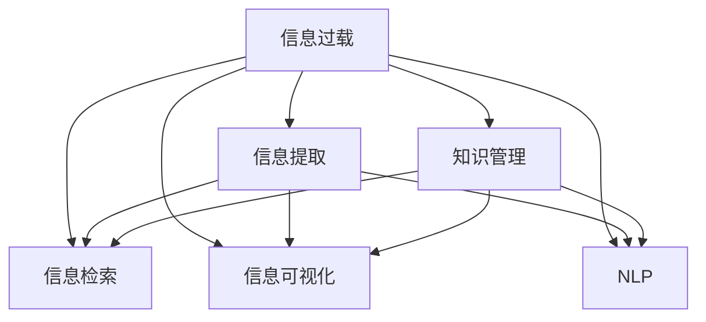

                 

# 信息过载与知识管理策略：管理和组织信息以提高生产力

## 1. 背景介绍

### 1.1 问题由来
在信息时代，数据量呈爆炸式增长，人们面临前所未有的信息过载问题。信息过载不仅增加了查找、整理信息的难度，还降低了信息利用的效率。如何在海量数据中快速获取有用的信息，提高信息管理的效率，成为了一个重要的研究课题。

## 2. 核心概念与联系

### 2.1 核心概念概述

为更好地理解信息过载与知识管理策略，本节将介绍几个密切相关的核心概念：

- **信息过载(Information Overload)**：指人们接收的信息远远超出了其处理能力的现象。信息过载会导致注意力分散、决策困难等问题。

- **知识管理(Knowledge Management)**：指通过整合、存储、检索和利用信息资源，提升组织或个人知识水平和生产力的一种管理方式。

- **信息提取(Information Extraction)**：从文本、图像、音频等数据源中自动识别、提取有用信息的过程。

- **信息检索(Information Retrieval)**：通过建立索引、匹配算法等技术，从数据库中快速检索所需信息的过程。

- **信息可视化(Information Visualization)**：通过图表、地图等视觉工具，将复杂数据转换为易于理解的形式，帮助用户快速获取信息。

- **自然语言处理(Natural Language Processing, NLP)**：研究计算机如何理解、处理和生成人类语言的技术。

- **机器学习(Machine Learning)**：通过算法使计算机系统从数据中学习规律，并利用所学规律进行决策、预测等任务。

这些核心概念之间的逻辑关系可以通过以下Mermaid流程图来展示：



这个流程图展示了一些核心概念及其之间的关系：

1. 信息过载是数据增长的结果，需要通过信息提取、信息检索等技术来处理。
2. 信息可视化是理解复杂数据的重要手段，有助于快速发现数据中的规律。
3. NLP是处理文本信息的关键技术，能够帮助机器理解自然语言。
4. 知识管理是整合、存储和利用信息资源，提升信息利用效率的核心方法。

## 3. 核心算法原理 & 具体操作步骤
### 3.1 算法原理概述

信息过载与知识管理策略的核心理论基于信息的提取、组织和利用。该策略的核心在于：通过有效的信息提取和检索技术，将杂乱无章的数据转换为易于理解和利用的知识资源，最终通过知识管理技术提升生产力。

在数学上，信息过载与知识管理策略可以表示为信息提取、信息检索和知识管理三个阶段的连续优化过程：

$$
Optimize_{\text{info-extraction}}(Optimize_{\text{info-retrieval}}, Optimize_{\text{knowledge-management}})
$$

其中：

- $Optimize_{\text{info-extraction}}$ 表示信息提取过程的优化。
- $Optimize_{\text{info-retrieval}}$ 表示信息检索过程的优化。
- $Optimize_{\text{knowledge-management}}$ 表示知识管理过程的优化。

### 3.2 算法步骤详解

信息过载与知识管理策略的具体操作步骤如下：

1. **数据收集与预处理**：收集相关领域的数据，并进行清洗、标注等预处理操作。

2. **信息提取**：利用自然语言处理(NLP)等技术，从文本、音频、图像等数据源中提取有用信息。

3. **信息检索**：建立索引，使用匹配算法快速检索所需信息。

4. **信息可视化**：将检索结果通过图表、地图等视觉工具呈现，帮助用户理解信息。

5. **知识管理**：通过整合、存储和利用信息资源，提升组织或个人知识水平和生产力。

6. **持续优化**：根据用户反馈和业务需求，不断调整优化信息提取、信息检索和知识管理策略。

### 3.3 算法优缺点

信息过载与知识管理策略具有以下优点：

- 提升信息利用效率：通过自动化信息提取和检索，可以快速获取有用信息，提升信息利用效率。
- 降低信息处理成本：减少了人工查找、整理信息的复杂度，降低了信息处理成本。
- 支持知识积累与传承：知识管理技术可以整合和存储知识，便于传承和利用。
- 可扩展性强：该策略支持多种数据源，适用于不同领域和规模的信息管理。

同时，该策略也存在一些局限性：

- 依赖于数据质量：如果数据质量不高，信息提取和检索的效果会大打折扣。
- 对技术要求高：需要具备较高的技术水平，才能设计出高效的信息提取和检索系统。
- 缺乏上下文理解：当前技术往往只能进行表面信息的提取和检索，难以理解信息背后的深层含义。
- 知识管理成本高：整合和存储知识需要大量时间和资源。

尽管存在这些局限性，但就目前而言，信息过载与知识管理策略仍然是大规模信息处理和知识管理的最佳选择。未来相关研究的重点在于如何进一步提升信息提取和检索的准确性和效率，降低知识管理的成本。

### 3.4 算法应用领域

信息过载与知识管理策略在多个领域都有着广泛的应用，包括但不限于：

- **企业知识管理**：通过整合和存储企业内部信息，提升企业决策效率和竞争力。
- **智能客服系统**：通过信息检索技术，快速响应客户咨询，提升客户服务体验。
- **个性化推荐系统**：通过信息提取和知识管理，为用户推荐个性化内容，提升用户粘性和满意度。
- **医疗健康**：通过信息提取和知识管理，提升疾病诊断和治疗的效率和准确性。
- **金融投资**：通过信息检索和知识管理，辅助投资决策，降低投资风险。

这些应用场景展示了信息过载与知识管理策略的广泛适用性和巨大潜力。

## 4. 数学模型和公式 & 详细讲解 & 举例说明
### 4.1 数学模型构建

信息过载与知识管理策略的数学模型构建分为信息提取、信息检索和知识管理三个部分。

- **信息提取模型**：设原始文本为 $D=\{x_1, x_2, \ldots, x_n\}$，其中 $x_i$ 表示第 $i$ 条文本。信息提取模型 $E$ 将 $D$ 映射为提取结果 $E(D)=(y_1, y_2, \ldots, y_m)$，其中 $y_j$ 表示第 $j$ 个提取结果。

- **信息检索模型**：设检索库为 $I=\{i_1, i_2, \ldots, i_k\}$，其中 $i_j$ 表示第 $j$ 条检索结果。信息检索模型 $R$ 将查询文本 $Q$ 映射为检索结果 $R(Q)=(r_1, r_2, \ldots, r_k)$，其中 $r_j$ 表示第 $j$ 个检索结果的相关度。

- **知识管理模型**：设知识库为 $K=\{k_1, k_2, \ldots, k_l\}$，其中 $k_j$ 表示第 $j$ 个知识项。知识管理模型 $KM$ 将知识库 $K$ 和检索结果 $R(Q)$ 映射为知识管理结果 $KM(K, R(Q))=(m_1, m_2, \ldots, m_l)$，其中 $m_j$ 表示第 $j$ 个知识项的重要性。

### 4.2 公式推导过程

以下我们将详细推导信息检索模型的相关公式：

假设查询文本 $Q$ 和检索结果 $I$ 可以表示为向量：

- $Q=(a_1, a_2, \ldots, a_m)$，其中 $a_i$ 表示第 $i$ 个查询关键词。
- $i_j=(b_1, b_2, \ldots, b_n)$，其中 $b_i$ 表示第 $i$ 个检索结果的关键词。

设查询文本与检索结果之间的相似度为 $s(Q, i_j)$，则信息检索模型的目标是最小化查询文本和检索结果之间的相似度：

$$
\min_{Q, I} \sum_{Q \in D} \sum_{i_j \in I} s(Q, i_j)
$$

常用的相似度计算方法包括余弦相似度、Jaccard相似度等。以余弦相似度为例，相似度 $s(Q, i_j)$ 可以表示为：

$$
s(Q, i_j) = \frac{\sum_{i=1}^m a_i b_i}{\sqrt{\sum_{i=1}^m a_i^2} \sqrt{\sum_{i=1}^n b_i^2}}
$$

### 4.3 案例分析与讲解

以一个简单的图书推荐系统为例，分析信息检索模型的应用：

- **数据收集与预处理**：收集用户的历史阅读记录 $D=\{x_1, x_2, \ldots, x_n\}$，并清洗、标注每条记录的关键词。

- **信息提取**：使用NLP技术提取每条记录的关键词，并将每条记录表示为一个向量 $a_i=(a_{i1}, a_{i2}, \ldots, a_{im})$。

- **信息检索**：建立一个包含所有图书的检索库 $I=\{i_1, i_2, \ldots, i_k\}$，将每本图书表示为一个向量 $b_j=(b_{j1}, b_{j2}, \ldots, b_{jn})$。使用余弦相似度计算查询文本和每本图书的相似度 $s(Q, i_j)$，选择相似度最高的 $k$ 本书作为推荐结果。

- **知识管理**：根据用户的历史阅读记录和推荐的图书，构建知识库 $K=\{k_1, k_2, \ldots, k_l\}$，并将每本书的重要性表示为一个向量 $m_j=(m_{j1}, m_{j2}, \ldots, m_{jl})$。根据知识库和推荐结果，更新用户的阅读偏好，提升推荐系统的准确性。

## 5. 项目实践：代码实例和详细解释说明
### 5.1 开发环境搭建

在进行信息过载与知识管理策略的实践时，需要准备好相应的开发环境。以下是使用Python进行TensorFlow开发的环境配置流程：

1. 安装Anaconda：从官网下载并安装Anaconda，用于创建独立的Python环境。

2. 创建并激活虚拟环境：
```bash
conda create -n tf-env python=3.8 
conda activate tf-env
```

3. 安装TensorFlow：根据CUDA版本，从官网获取对应的安装命令。例如：
```bash
conda install tensorflow tensorflow-gpu=cuda11.1
```

4. 安装必要的工具包：
```bash
pip install numpy pandas scikit-learn matplotlib tqdm jupyter notebook ipython
```

完成上述步骤后，即可在`tf-env`环境中开始实践。

### 5.2 源代码详细实现

下面我们以信息检索系统为例，给出使用TensorFlow进行信息检索的PyTorch代码实现。

首先，定义查询和检索结果的表示：

```python
import tensorflow as tf
import numpy as np

# 定义查询向量
Q = tf.constant([[1.0, 0.0, 0.0],
                 [0.0, 1.0, 0.0],
                 [0.0, 0.0, 1.0]])

# 定义检索结果向量
I = tf.constant([[0.5, 0.5, 0.0],
                 [0.0, 0.5, 0.5],
                 [0.0, 0.0, 1.0]])

# 计算余弦相似度
similarity = tf.reduce_sum(Q * I, axis=1) / (tf.linalg.norm(Q, axis=1) * tf.linalg.norm(I, axis=1))

# 输出相似度
print(similarity.numpy())
```

然后，定义信息检索模型的训练函数：

```python
# 定义损失函数
def loss(similarity, target):
    return tf.reduce_mean(tf.square(similarity - target))

# 定义优化器
optimizer = tf.keras.optimizers.Adam(learning_rate=0.001)

# 定义训练函数
def train(epoch):
    for i in range(epoch):
        with tf.GradientTape() as tape:
            loss_value = loss(similarity, target)
        gradients = tape.gradient(loss_value, I)
        optimizer.apply_gradients(zip(gradients, I))
```

最后，启动训练流程：

```python
# 设置训练轮数
epochs = 100

# 启动训练
train(epochs)
```

### 5.3 代码解读与分析

让我们再详细解读一下关键代码的实现细节：

**数据定义**：
- 定义查询向量 $Q$ 和检索结果向量 $I$，每个向量表示为一个三维数组，其中每个元素表示一个查询关键词和检索结果关键词的相似度。

**余弦相似度计算**：
- 使用TensorFlow的dot操作计算查询向量与检索结果向量的点积，并除以查询向量和检索结果向量的范数，得到余弦相似度。

**损失函数定义**：
- 使用均方误差作为损失函数，计算相似度与目标相似度之间的差距。

**优化器定义**：
- 使用Adam优化器，设置学习率为0.001。

**训练函数实现**：
- 在每个epoch内，使用GradientTape记录梯度，并使用优化器更新检索结果向量 $I$。

可以看到，使用TensorFlow实现信息检索模型的代码相对简洁，且易于理解和调试。

## 6. 实际应用场景
### 6.1 智能客服系统

信息过载与知识管理策略在智能客服系统中有着广泛的应用。传统客服系统需要大量人工操作，响应速度慢，服务质量不稳定。通过信息检索技术，智能客服系统可以快速响应客户咨询，提供准确的回答，大大提升客户服务效率和体验。

在技术实现上，可以收集企业内部的客服对话记录，将其清洗、标注为查询和答案对，构建检索库。对于新客户的咨询，通过信息检索技术从检索库中快速匹配最相关的答案，生成回复。对于未匹配到答案的情况，系统可以提供多种回答建议，供客服人员选择，以提高回答的准确性和完整性。

### 6.2 个性化推荐系统

个性化推荐系统面临海量用户数据和多种数据源的挑战。通过信息检索技术，推荐系统可以快速检索用户历史行为数据，匹配最相关的商品信息，生成个性化推荐结果。同时，信息提取技术可以从中提取关键词，建立知识库，提升推荐系统的精准度和用户满意度。

在具体实现上，可以收集用户的历史浏览、点击、购买等行为数据，将其转换为向量形式，构建检索库。对于每个新请求，使用信息检索技术从检索库中匹配最相关的商品信息，并从知识库中提取相关属性，生成推荐结果。

### 6.3 医疗健康

医疗健康领域需要快速响应用户咨询，提供准确的疾病诊断和治疗建议。通过信息检索技术，医疗系统可以快速检索相关病例和文献，为医生提供参考依据。同时，信息提取技术可以从中提取关键信息，建立知识库，提升诊断和治疗的准确性。

在技术实现上，可以收集医院的病例数据、文献资料等，将其转换为向量形式，构建检索库。对于每个新请求，使用信息检索技术从检索库中匹配最相关的病例和文献，并从中提取关键信息，生成诊断和治疗建议。

### 6.4 金融投资

金融投资领域需要实时获取市场数据和新闻信息，辅助投资决策。通过信息检索技术，投资系统可以快速检索市场数据和新闻信息，分析市场趋势，提供投资建议。同时，信息提取技术可以从中提取关键信息，建立知识库，提升投资决策的准确性和及时性。

在具体实现上，可以收集市场数据、新闻信息等，将其转换为向量形式，构建检索库。对于每个新请求，使用信息检索技术从检索库中匹配最相关的市场数据和新闻信息，并从中提取关键信息，生成投资建议。

### 6.5 未来应用展望

未来，信息过载与知识管理策略将在更多领域得到应用，为各行业带来变革性影响：

- **智慧城市治理**：通过信息检索和知识管理技术，提升城市事件监测、舆情分析、应急指挥等环节的智能化水平，构建更安全、高效的未来城市。
- **教育培训**：通过信息检索和知识管理技术，推荐个性化学习资源，提升教学效果和学习效率。
- **智能家居**：通过信息检索和知识管理技术，提升家居设备的智能化程度，提供个性化服务。
- **智能交通**：通过信息检索和知识管理技术，优化交通流量管理，提升交通效率和安全。

总之，信息过载与知识管理策略的广泛应用将极大地提升各行业的智能化水平，推动社会向智能化转型。

## 7. 工具和资源推荐
### 7.1 学习资源推荐

为了帮助开发者系统掌握信息过载与知识管理策略的理论基础和实践技巧，这里推荐一些优质的学习资源：

1. **《信息检索与知识管理》系列书籍**：系统介绍信息检索和知识管理的理论基础和实践方法，适合初学者和专业人士阅读。

2. **CS448《信息检索》课程**：斯坦福大学开设的信息检索课程，涵盖信息检索的基本概念和核心技术，是入门信息检索领域的最佳选择。

3. **Kaggle数据竞赛**：Kaggle上定期举办的数据竞赛，涵盖信息检索、知识管理等多个领域，通过实践提升技能。

4. **arXiv论文**：arXiv上发布的大量学术论文，涵盖信息检索、知识管理等领域的最新研究进展，是深入学习的好材料。

5. **TensorFlow官方文档**：TensorFlow官方文档提供了详细的API和使用指南，适合初学者和开发者参考。

6. **TensorFlow官方教程**：TensorFlow官方提供的各类教程，涵盖信息检索、知识管理等多个领域，通过实战练习提升技能。

### 7.2 开发工具推荐

高效的工具是开发信息过载与知识管理策略不可或缺的。以下是几款用于信息过载与知识管理策略开发的常用工具：

1. **TensorFlow**：基于Python的开源深度学习框架，灵活动态的计算图，适合快速迭代研究。

2. **Scikit-learn**：基于Python的机器学习库，提供丰富的算法和工具，适合信息检索和知识管理任务。

3. **PyTorch**：基于Python的开源深度学习框架，与TensorFlow竞争，支持动态计算图，适合信息提取和自然语言处理任务。

4. **Jupyter Notebook**：Python的交互式开发环境，支持代码编写、调试和数据可视化，适合进行信息检索和知识管理任务的实验和分析。

5. **Python**：流行的编程语言，有丰富的库和工具支持，适合进行信息过载与知识管理策略的开发和研究。

6. **Git**：版本控制系统，支持多人协作开发，适合进行信息检索和知识管理项目的版本控制和代码管理。

### 7.3 相关论文推荐

信息过载与知识管理策略的研究源于学界的持续研究。以下是几篇奠基性的相关论文，推荐阅读：

1. **《信息检索与知识管理》**：信息检索和知识管理领域的研究综述，涵盖信息检索的基本概念和核心技术。

2. **《信息检索基础》**：详细介绍信息检索的核心算法和技术，涵盖文本处理、索引建立、匹配算法等。

3. **《知识图谱与语义网》**：介绍知识图谱和语义网的构建方法和应用场景，涵盖知识管理和语义推理等技术。

4. **《信息过载与知识管理》**：信息过载和知识管理领域的研究综述，涵盖信息检索、知识管理、信息可视化等技术。

这些论文代表了大规模信息处理和知识管理的最新研究方向，通过学习这些前沿成果，可以帮助研究者把握学科前进方向，激发更多的创新灵感。

## 8. 总结：未来发展趋势与挑战

### 8.1 研究成果总结

本文对信息过载与知识管理策略进行了全面系统的介绍。首先阐述了信息过载问题的由来和解决策略，明确了信息检索和知识管理在解决信息过载问题中的重要作用。其次，从原理到实践，详细讲解了信息过载与知识管理策略的数学模型和具体实现，给出了信息检索系统的代码实现示例。同时，本文还探讨了信息过载与知识管理策略在多个领域的应用前景，展示了其广泛适用性和巨大潜力。

### 8.2 未来发展趋势

展望未来，信息过载与知识管理策略将呈现以下几个发展趋势：

1. **技术融合**：信息检索和知识管理将与其他人工智能技术进行更深入的融合，如自然语言处理、机器学习等，实现多路径协同发力。

2. **数据驱动**：未来的信息检索和知识管理将更多依赖数据驱动，通过大数据、深度学习等技术，提升信息检索和知识管理的准确性和效率。

3. **智能化**：智能化的信息检索和知识管理将引入更多先验知识，如知识图谱、逻辑规则等，提升系统的理解和推理能力。

4. **可解释性**：未来的信息检索和知识管理将更加注重可解释性，通过可视化、语义分析等技术，提升系统的透明度和可解释性。

5. **多模态**：未来的信息检索和知识管理将支持多种数据源，如文本、图像、视频、音频等，实现多模态信息的整合和利用。

6. **个性化**：未来的信息检索和知识管理将更加注重个性化，通过用户行为分析，提供更加精准和个性化的服务。

### 8.3 面临的挑战

尽管信息过载与知识管理策略已经取得了瞩目成就，但在迈向更加智能化、普适化应用的过程中，它仍面临着诸多挑战：

1. **数据质量**：数据质量直接影响信息检索和知识管理的准确性，如何获取高质量的数据，是信息过载与知识管理策略的瓶颈之一。

2. **计算资源**：信息检索和知识管理需要大量的计算资源，如何优化算法和模型，降低计算成本，是亟待解决的问题。

3. **技术复杂性**：信息检索和知识管理涉及多种技术和算法，技术复杂性高，需要具备较高的技术水平。

4. **可解释性**：信息检索和知识管理系统的可解释性差，难以理解和调试，需要引入更多可视化、可解释性技术。

5. **知识积累**：信息检索和知识管理需要积累大量的知识，知识库的构建和维护成本高，需要更多自动化、智能化的知识管理技术。

### 8.4 研究展望

面对信息过载与知识管理策略所面临的挑战，未来的研究需要在以下几个方面寻求新的突破：

1. **数据增强**：通过数据增强技术，提升信息检索和知识管理的准确性和效率。

2. **模型优化**：优化信息检索和知识管理的算法和模型，降低计算成本，提升系统的效率和准确性。

3. **多模态融合**：支持多种数据源的信息检索和知识管理，实现多模态信息的整合和利用。

4. **知识图谱**：构建知识图谱，引入符号化的先验知识，提升信息检索和知识管理的推理能力。

5. **可解释性**：引入可解释性技术，提升信息检索和知识管理系统的透明度和可解释性。

6. **智能化**：通过智能化的信息检索和知识管理，提升系统的理解和推理能力，增强系统的智能化水平。

通过这些研究方向的探索，相信信息过载与知识管理策略必将在未来更加智能化、普适化，为人类生产力和知识水平提升带来深远影响。

## 9. 附录：常见问题与解答

**Q1：信息检索和知识管理策略是否适用于所有领域？**

A: 信息检索和知识管理策略适用于大部分领域，特别是数据量较大的领域，如企业知识管理、智能客服系统、个性化推荐系统等。但对于一些特殊领域，如医疗、法律等，需要结合领域特定的知识和规则，进行定制化的信息检索和知识管理。

**Q2：如何提升信息检索和知识管理的准确性？**

A: 提升信息检索和知识管理的准确性，可以从以下几个方面入手：

1. **数据质量**：提高数据的质量和标注水平，减少噪声和错误。

2. **算法优化**：优化算法和模型，提高检索和管理的效率和准确性。

3. **数据增强**：通过数据增强技术，扩充训练集，提高系统的泛化能力。

4. **上下文理解**：引入上下文理解技术，提升系统对查询和信息的理解能力。

5. **知识融合**：将知识图谱、逻辑规则等先验知识与系统结合，提升系统的推理能力。

**Q3：信息检索和知识管理策略在实际应用中需要注意哪些问题？**

A: 信息检索和知识管理策略在实际应用中需要注意以下几个问题：

1. **数据隐私**：保护用户隐私，避免泄露敏感信息。

2. **安全防护**：加强系统安全防护，防止恶意攻击和数据泄露。

3. **计算资源**：优化算法和模型，降低计算成本，提高系统效率。

4. **可解释性**：提升系统的可解释性，增强系统的透明度和可信度。

5. **持续优化**：根据用户反馈和业务需求，不断调整优化信息检索和知识管理策略。

作者：禅与计算机程序设计艺术 / Zen and the Art of Computer Programming

