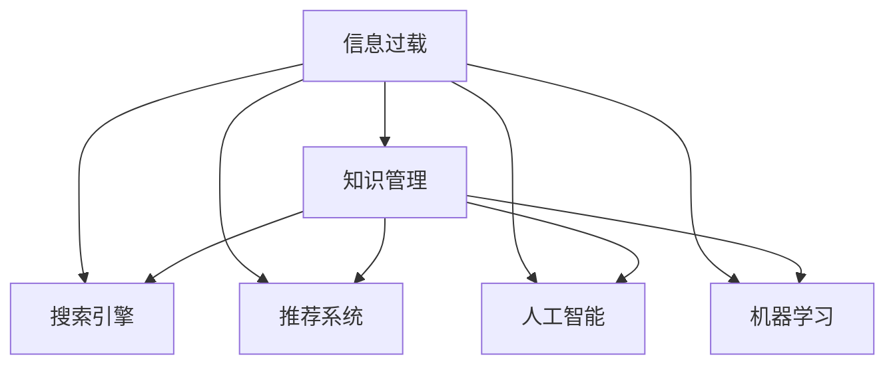

                 

# 信息过载与知识管理系统：如何有效组织和检索信息

> 关键词：信息过载,知识管理,搜索引擎,推荐系统,人工智能,机器学习

## 1. 背景介绍

### 1.1 问题由来
随着互联网技术的飞速发展，人类每天都会产生海量的信息。据统计，每天全球产生的新数据量已经超过2.5PB，其中90%以上来自互联网。然而，大量信息的高速涌入，并没有带来认知的相应增长，反而导致越来越多的信息过载问题。信息过载不仅会分散我们的注意力，影响工作效率，还可能造成信息的误判和决策失误。如何在信息洪流中准确筛选出有用的知识，成为当下互联网时代亟待解决的重要问题。

### 1.2 问题核心关键点
为了应对信息过载，企业纷纷引入知识管理系统(Knowledge Management System, KMS)。知识管理系统是利用信息技术手段，对企业内部及外部知识进行搜集、整理、存储、共享和利用的系统。通过对知识的有效组织和检索，知识管理系统帮助人们高效地获取和利用知识，提升工作和学习效率。

然而，构建一个全面的知识管理系统的核心问题在于：如何高效地组织和检索知识。为此，文章从算法原理、操作步骤、数学模型、项目实践、应用场景等多个角度对这一问题进行了全面解析，并推荐了若干资源和工具，以期对知识管理系统的构建提供指导和参考。

### 1.3 问题研究意义
研究信息过载和知识管理系统，对于拓展信息技术的应用范围，提升组织的工作和学习效率，具有重要意义：

1. 降低信息获取成本。知识管理系统通过自动化的信息搜集和整理，大大降低了人力投入，提高了信息获取的速度和精度。
2. 提升知识共享效率。知识管理系统促进了知识的快速传播和利用，为团队协作和知识创新提供了有力支持。
3. 增强决策准确性。知识管理系统利用先进的数据分析和人工智能技术，提升决策的科学性和合理性。
4. 推动技术发展。知识管理系统涉及诸多前沿技术，如自然语言处理、信息检索、机器学习等，具有重要的科研价值。
5. 促进组织变革。知识管理系统通过改善知识流动和利用，辅助企业优化流程，提高竞争力和创新能力。

## 2. 核心概念与联系

### 2.1 核心概念概述

为了更好地理解信息过载与知识管理系统的原理，本节将介绍几个密切相关的核心概念：

- 信息过载：指信息量过大而接收者无法处理，导致认知和判断能力下降的现象。在数字化时代，信息过载已经成为普遍存在的问题。
- 知识管理：指通过对知识的搜集、存储、整理、共享、应用等过程，将知识的价值最大化。
- 搜索引擎：利用自然语言处理和机器学习技术，对大量文本数据进行搜索和索引的系统。
- 推荐系统：根据用户的历史行为和兴趣偏好，自动推荐相关内容或商品的系统。
- 人工智能：通过模拟人类智能过程，实现信息获取、知识处理、决策支持等功能的技术。
- 机器学习：通过算法让计算机从数据中学习和提取规律，实现自动化的数据分析和决策。

这些核心概念之间的逻辑关系可以通过以下Mermaid流程图来展示：



这个流程图展示了一个完整的知识管理系统构建过程：

1. 信息过载问题需要依靠知识管理系统进行解决。
2. 知识管理系统依赖搜索引擎和推荐系统，提升信息检索和内容推荐的能力。
3. 人工智能和机器学习技术为知识管理系统提供算法支持，进一步提升系统的智能化水平。

## 3. 核心算法原理 & 具体操作步骤
### 3.1 算法原理概述

知识管理系统主要依赖搜索、推荐等算法进行信息组织和检索。其核心思想是：通过对知识的结构化处理，将其转化为易于检索和利用的形式，帮助用户快速获取所需信息。

形式化地，假设知识集合为 $K$，用户在查询时输入的关键词为 $q$。知识管理系统需要找到最符合用户需求的知识 $k^*$，即：

$$
k^* = \mathop{\arg\max}_{k \in K} f_k(q)
$$

其中 $f_k(q)$ 为知识 $k$ 与查询 $q$ 的相关度函数，不同算法使用的相关度计算方式各异。

### 3.2 算法步骤详解

信息过载和知识管理系统的主要算法步骤包括以下几个关键环节：

**Step 1: 信息搜集与预处理**
- 收集用户交互数据、文本文档、图片、视频等多种类型的数据。
- 对数据进行清洗、去重、分词、标准化等预处理操作，以便后续的算法分析。

**Step 2: 知识表示与存储**
- 将数据转化为易于处理的向量形式，如词袋模型、TF-IDF、Word2Vec、BERT等。
- 选择合适的存储方式，如关系型数据库、NoSQL数据库、分布式文件系统等，将向量进行结构化存储。

**Step 3: 知识索引与检索**
- 利用倒排索引、向量空间模型、BERT索引等技术，对知识进行索引，便于快速检索。
- 在用户输入查询 $q$ 后，利用检索算法在索引中进行匹配，找到最相关的知识。

**Step 4: 个性化推荐**
- 基于用户的历史行为和兴趣偏好，利用协同过滤、矩阵分解、深度学习等方法，进行个性化推荐。
- 结合时序特征和上下文信息，进行动态更新和实时推荐。

**Step 5: 反馈与优化**
- 收集用户的反馈信息，评估推荐效果。
- 利用强化学习、在线学习等技术，动态调整推荐策略，优化推荐结果。

通过以上步骤，知识管理系统能够高效地组织和检索信息，提升用户的信息获取效率。

### 3.3 算法优缺点

知识管理系统的优点包括：
1. 结构化存储。通过向量化和结构化存储，便于进行快速的检索和分析。
2. 个性化推荐。利用用户数据进行深度学习，实现精准推荐。
3. 自动化更新。通过机器学习进行动态更新，保持系统的最新状态。
4. 多种数据类型支持。支持文本、图片、视频等多种类型的数据。

同时，知识管理系统也存在一些缺点：
1. 数据量庞大。涉及的数据量往往非常大，对存储和计算资源提出了高要求。
2. 复杂性高。涉及多种技术和算法，实现难度大。
3. 更新成本高。需要持续进行数据收集和算法优化，维护成本较高。
4. 效果有限。对于不常见或长尾数据，可能无法提供满意的结果。
5. 数据隐私问题。涉及大量用户数据，可能存在隐私泄露的风险。

尽管存在这些局限性，但知识管理系统在信息检索和知识共享方面，仍具有不可替代的重要价值。

### 3.4 算法应用领域

知识管理系统已经被广泛应用于企业内部知识管理、公共知识库构建、在线教育等多个领域，以下是一些典型的应用场景：

1. **企业知识管理**
   - 对企业内部文档、邮件、会议纪要等进行分类整理，构建企业知识库。
   - 利用搜索引擎和推荐系统，提供快速检索和知识推荐服务，提升员工工作效率。

2. **公共知识库构建**
   - 构建在线公共知识库，如百度百科、维基百科等，方便用户查询和获取知识。
   - 利用算法优化检索和推荐，提升知识库的利用率和准确性。

3. **在线教育**
   - 对在线课程、视频、课件等资源进行结构化处理，构建学习知识库。
   - 利用推荐系统为用户推荐相关课程和学习资料，提升学习体验和效果。

4. **个性化推荐系统**
   - 在电商平台、视频平台、音乐平台等场景，根据用户兴趣进行个性化推荐。
   - 结合深度学习等技术，提升推荐算法的精准度和效果。

5. **情报分析**
   - 对大量文本数据进行分析和整理，提供数据洞察和趋势分析。
   - 利用机器学习进行情报挖掘和预警，提升决策支持能力。

以上应用场景展示了知识管理系统在多个行业中的广泛应用，为信息过载问题的解决提供了新的思路和方法。

## 4. 数学模型和公式 & 详细讲解  
### 4.1 数学模型构建

本节将使用数学语言对信息过载与知识管理系统的原理进行更加严格的刻画。

记知识集合为 $K$，查询关键词为 $q$，知识的相关度函数为 $f_k(q)$。知识管理系统的目标是最小化检索误差，即：

$$
\min_{f_k} \mathbb{E}[\max_{k \in K} f_k(q)] - \mathbb{E}[\max_{k \in K} f_k(q')]
$$

其中 $q'$ 是随机生成的查询关键词，$\mathbb{E}$ 表示期望。

### 4.2 公式推导过程

以下我们以搜索引擎中的向量空间模型为例，推导相关度函数 $f_k(q)$ 及其梯度计算公式。

设 $k$ 和 $q$ 的向量表示分别为 $\vec{k}$ 和 $\vec{q}$，向量空间模型中，相关度函数定义为：

$$
f_k(q) = \frac{\vec{k} \cdot \vec{q}}{\|\vec{k}\| \cdot \|\vec{q}\|}
$$

其中 $\cdot$ 表示向量点积，$\|\vec{k}\|$ 和 $\|\vec{q}\|$ 表示向量的范数。

设 $\vec{k} = (k_1, k_2, ..., k_n)$，$\vec{q} = (q_1, q_2, ..., q_m)$，则相关度函数可以表示为：

$$
f_k(q) = \frac{k_1q_1 + k_2q_2 + ... + k_nq_n}{\sqrt{k_1^2 + k_2^2 + ... + k_n^2} \cdot \sqrt{q_1^2 + q_2^2 + ... + q_m^2}}
$$

通过向量空间模型，可以将知识管理系统的检索过程转化为向量点积的计算，便于高效实现。

### 4.3 案例分析与讲解

假设在一个在线教育平台中，用户输入查询 "Python编程语言"，知识管理系统的检索算法需要返回最相关的知识集合。具体步骤如下：

1. **构建知识向量**
   - 对课程、视频、课件等资源进行分词和向量化处理，得到每个资源的向量表示。
   - 使用TF-IDF、Word2Vec等算法计算向量权重，得到最终的知识向量。

2. **构建查询向量**
   - 对查询关键词进行分词和向量化处理，得到查询向量。
   - 同样使用TF-IDF、Word2Vec等算法计算向量权重，得到查询向量。

3. **计算相关度**
   - 使用向量空间模型计算查询向量与每个知识向量的点积，得到相关度分数。
   - 选择相关度分数最高的知识集合作为检索结果。

通过以上步骤，知识管理系统能够快速定位到最相关的知识资源，为用户提供精准的推荐和检索服务。

## 5. 项目实践：代码实例和详细解释说明
### 5.1 开发环境搭建

在进行信息过载与知识管理系统开发前，我们需要准备好开发环境。以下是使用Python进行ElasticSearch开发的环境配置流程：

1. 安装Anaconda：从官网下载并安装Anaconda，用于创建独立的Python环境。

2. 创建并激活虚拟环境：
```bash
conda create -n es-env python=3.8 
conda activate es-env
```

3. 安装ElasticSearch：根据CUDA版本，从官网获取对应的安装命令。例如：
```bash
pip install elasticsearch
```

4. 安装各类工具包：
```bash
pip install numpy pandas scikit-learn nltk gensim
```

完成上述步骤后，即可在`es-env`环境中开始ElasticSearch开发实践。

### 5.2 源代码详细实现

这里我们以ElasticSearch构建在线教育平台的知识管理系统为例，给出完整的Python代码实现。

首先，定义数据处理函数：

```python
from gensim.models import TfidfVectorizer
from gensim.models import Word2Vec
from gensim.models import KeyedVectors

def process_data(data):
    # 分词和向量化
    vectorizer = TfidfVectorizer()
    X = vectorizer.fit_transform(data)
    # 训练Word2Vec模型
    model = Word2Vec(X, size=100, min_count=5, workers=4)
    # 返回向量表示和Word2Vec模型
    return X.toarray(), model
```

然后，定义ElasticSearch索引和检索函数：

```python
from elasticsearch import Elasticsearch

def create_index(client, index_name, data):
    # 创建索引
    client.indices.create(index=index_name)
    # 批量添加文档
    client.bulk(index=index_name, body=data)

def search_index(client, index_name, query):
    # 检索文档
    res = client.search(index=index_name, body={"query": {"match": {"content": query}}})
    # 返回匹配文档
    return res['hits']['hits']
```

最后，启动ElasticSearch服务器和客户端，并构建知识管理系统：

```python
# 启动ElasticSearch服务器
es = Elasticsearch([{'host': 'localhost', 'port': 9200}])

# 数据预处理和向量构建
data = ['Python编程语言入门', 'Python高级开发技术', 'Python数据分析与机器学习']
X, model = process_data(data)

# 构建索引
create_index(es, 'online_education', X)

# 查询检索
results = search_index(es, 'online_education', 'Python编程语言')
for hit in results:
    print(hit['_source'])

# 使用Word2Vec模型进行推荐
similarities = model.wv.similar_by_word('Python')
for word, sim in similarities:
    print(f'{word}相似度：{sim:.4f}')
```

以上就是使用ElasticSearch构建在线教育平台知识管理系统的完整代码实现。可以看到，借助ElasticSearch和gensim等工具，我们能够快速搭建一个高效的知识管理系统，实现信息的搜集、存储、检索和推荐。

### 5.3 代码解读与分析

让我们再详细解读一下关键代码的实现细节：

**process_data函数**：
- 使用TF-IDF向量化处理数据，得到每个文档的向量表示。
- 利用Word2Vec模型进行词向量训练，得到每个文档的词向量表示。
- 返回向量表示和Word2Vec模型，供后续使用。

**create_index函数**：
- 使用ElasticSearch的API创建索引。
- 批量添加文档到索引，每个文档对应一个向量表示。

**search_index函数**：
- 使用ElasticSearch的API进行检索，匹配查询词的文档。
- 返回匹配文档的列表，包含文档的字段内容。

**ElasticSearch客户端启动**：
- 启动ElasticSearch服务器，配置索引和向量存储。
- 通过ElasticSearch客户端，添加数据和进行检索。

通过以上步骤，我们构建了一个基本的在线教育平台知识管理系统，实现了文档的存储和检索功能。

## 6. 实际应用场景
### 6.1 智能客服系统

基于信息过载和知识管理系统的智能客服系统，能够有效应对大量客户咨询，提升客户服务效率。系统通过搜集、整理客户历史对话记录和常见问题，构建知识库。用户输入问题后，系统自动从知识库中检索相关答案，并结合上下文进行语义理解，最终生成合适的回答。

在技术实现上，可以采用自然语言处理技术，对客户问题进行分词、实体识别等处理，利用TF-IDF、Word2Vec等算法进行向量化，再利用ElasticSearch进行知识检索和推荐。通过不断学习和优化，智能客服系统可以越来越准确地理解客户需求，提供个性化服务。

### 6.2 智慧医疗系统

智慧医疗系统需要处理海量的患者数据和医学文献，以辅助医生诊断和治疗。系统通过构建知识库，存储医疗知识和病历数据，提供快速检索和推荐功能。医生输入症状和病历后，系统自动从知识库中匹配最相关的医疗知识和推荐方案，辅助医生进行诊断和治疗决策。

在技术实现上，可以采用结构化数据存储技术，对病历、文献等数据进行标准化处理，利用TF-IDF、Word2Vec等算法进行向量化，再利用ElasticSearch进行知识检索和推荐。通过不断学习和优化，智慧医疗系统可以逐渐积累更多的医学知识，提高医生的诊断和治疗水平。

### 6.3 金融数据分析

金融数据分析需要处理大量复杂的金融数据和报告，以辅助金融决策。系统通过构建知识库，存储金融知识和市场数据，提供快速检索和推荐功能。分析师输入查询条件后，系统自动从知识库中匹配最相关的市场分析和风险评估，辅助分析师进行决策。

在技术实现上，可以采用结构化数据存储技术，对金融数据和报告进行标准化处理，利用TF-IDF、Word2Vec等算法进行向量化，再利用ElasticSearch进行知识检索和推荐。通过不断学习和优化，金融数据分析系统可以逐渐积累更多的金融知识和市场信息，提升分析师的工作效率和决策质量。

### 6.4 未来应用展望

随着信息过载和知识管理系统的不断发展，未来其在更多领域的应用前景将更为广阔：

1. **智能教育系统**
   - 通过搜集和整理教育资源，构建知识库，提升学生的学习效率和效果。
   - 利用推荐系统，为学生推荐个性化的学习内容和资料。

2. **企业知识管理系统**
   - 对企业内部文档、邮件、会议纪要等进行结构化处理，构建企业知识库。
   - 利用推荐系统，为员工推荐相关的知识资源和协作信息。

3. **电子商务平台**
   - 对商品描述、用户评论等数据进行结构化处理，构建知识库。
   - 利用推荐系统，为消费者推荐个性化的商品和广告。

4. **公共知识库**
   - 构建在线公共知识库，如百度百科、维基百科等，方便用户查询和获取知识。
   - 利用推荐系统，为用户推荐相关的知识资源和搜索结果。

5. **智能问答系统**
   - 对问题-答案对进行结构化处理，构建知识库。
   - 利用推荐系统，为问答系统提供精准的回答推荐。

6. **新闻推荐系统**
   - 对新闻文本进行结构化处理，构建知识库。
   - 利用推荐系统，为用户推荐个性化新闻内容。

以上应用场景展示了信息过载和知识管理系统的广泛应用，为信息过载问题的解决提供了新的思路和方法。

## 7. 工具和资源推荐
### 7.1 学习资源推荐

为了帮助开发者系统掌握信息过载和知识管理系统的理论基础和实践技巧，这里推荐一些优质的学习资源：

1. **《信息检索》（Introduction to Information Retrieval）**：由Christopher Manning等撰写，深入浅出地介绍了信息检索的基本原理和算法，是领域内的经典教材。
2. **CS880《信息检索》课程**：清华大学开设的精品课程，涵盖信息检索的基本概念和前沿技术，有配套的作业和讲义。
3. **《推荐系统》（Recommender Systems）**：由Lise Getoor和Lise Burges撰写，全面介绍了推荐系统的基本原理和应用，是领域内的经典教材。
4. **Coursera《推荐系统》课程**：由Carlos Guestrin等开设，涵盖推荐系统的算法和应用，有互动讨论和作业。
5. **《自然语言处理》（Natural Language Processing with Python）**：由Steven Bird等撰写，介绍了自然语言处理的基本原理和Python实现，是领域内的经典教材。
6. **Stanford NLP课程**：由Dan Jurafsky等开设，涵盖自然语言处理的基本概念和前沿技术，有配套的讲义和代码。

通过对这些资源的学习实践，相信你一定能够快速掌握信息过载和知识管理系统的精髓，并用于解决实际的NLP问题。

### 7.2 开发工具推荐

高效的开发离不开优秀的工具支持。以下是几款用于信息过载和知识管理系统开发的常用工具：

1. **ElasticSearch**：流行的开源搜索引擎，支持结构化数据存储和检索，易于部署和扩展。
2. **Apache Solr**：Apache基金会下的开源搜索引擎，功能丰富，支持分布式部署和高并发处理。
3. **TensorFlow**：由Google开发的深度学习框架，支持大规模数据处理和复杂模型训练。
4. **PyTorch**：由Facebook开发的深度学习框架，支持动态计算图和灵活的网络定义。
5. **NLTK**：Python自然语言处理工具库，包含文本处理、词法分析、句法分析等常用功能。
6. **Scikit-learn**：Python机器学习库，包含常用的数据处理和算法实现，支持高效的数据建模和分析。

合理利用这些工具，可以显著提升信息过载和知识管理系统的开发效率，加快创新迭代的步伐。

### 7.3 相关论文推荐

信息过载和知识管理系统的发展源于学界的持续研究。以下是几篇奠基性的相关论文，推荐阅读：

1. **信息检索基础**：C.D. Wu, H. Motoda, X.R. Pennington, R.M. Mohri, T. Mitchell, "Information Retrieval: Foundations and Trends in Information Retrieval"（2017）。
2. **推荐系统框架**：C.D. Wu, T. Joachims, "A Comparative Study of Collaborative Filtering Recommendation Engines"（2007）。
3. **自然语言处理基础**：Christopher D. Manning, Prabhakar Raghavan, Hinrich Schütze, "Introduction to Information Retrieval"（2008）。
4. **深度学习在推荐系统中的应用**：M. Chen, T. Hofmann, H. A. Schütze, "WiseNet: Scalable Deep Learning for Recommender Systems"（2019）。
5. **ElasticSearch核心原理**：Shayne W. G. Burbage, "Elasticsearch, The Definitive Guide"（2019）。

这些论文代表了大规模知识管理系统的理论发展方向，通过学习这些前沿成果，可以帮助研究者把握学科前进方向，激发更多的创新灵感。

## 8. 总结：未来发展趋势与挑战

### 8.1 总结

本文对信息过载和知识管理系统的核心算法和操作步骤进行了全面系统的介绍。首先阐述了信息过载和知识管理系统的背景和意义，明确了知识管理系统构建的重要性。其次，从原理到实践，详细讲解了信息过载和知识管理系统的数学模型和核心算法，给出了代码实例和详细解释说明。同时，本文还探讨了知识管理系统的实际应用场景和未来发展趋势，推荐了若干学习资源和工具。

通过本文的系统梳理，可以看到，信息过载和知识管理系统在解决信息过载问题、提升知识共享效率方面，具有不可替代的重要价值。未来，伴随信息技术的不断进步，知识管理系统的智能化水平将进一步提升，为信息过载问题的解决提供新的思路和方法。

### 8.2 未来发展趋势

展望未来，信息过载和知识管理系统将呈现以下几个发展趋势：

1. **深度学习和大数据**
   - 利用深度学习和大数据技术，提升信息检索和推荐的效果，处理更复杂多变的信息需求。

2. **多模态融合**
   - 结合文本、图片、视频、音频等多模态数据，进行全面的信息处理和分析。

3. **实时处理和流计算**
   - 利用实时处理和流计算技术，处理海量数据流，提供实时信息检索和推荐服务。

4. **个性化和动态调整**
   - 利用用户数据进行深度学习，实现精准的个性化推荐，动态调整推荐策略。

5. **分布式和云计算**
   - 利用分布式计算和云计算技术，提升系统的可扩展性和处理能力。

6. **联邦学习和隐私保护**
   - 利用联邦学习和隐私保护技术，保护用户数据隐私，提升系统的安全性和可信度。

以上趋势凸显了信息过载和知识管理系统的广阔前景。这些方向的探索发展，必将进一步提升信息处理和知识共享的智能化水平，为信息过载问题的解决提供新的思路和方法。

### 8.3 面临的挑战

尽管信息过载和知识管理系统已经取得了一定的进展，但在迈向更加智能化、普适化应用的过程中，仍面临诸多挑战：

1. **数据量和计算资源的瓶颈**
   - 处理海量数据需要巨大的计算资源，现有的计算设施可能无法满足需求。

2. **算法复杂性和实现难度**
   - 知识管理系统的实现涉及复杂的算法和多层次的技术栈，实现难度较大。

3. **系统实时性和响应速度**
   - 信息检索和推荐需要实时处理，系统的响应速度和延迟需要不断优化。

4. **数据隐私和安全**
   - 涉及大量用户数据，如何保护数据隐私和安全，避免信息泄露，是亟待解决的问题。

5. **多模态数据的融合**
   - 不同类型的数据格式和结构不同，如何实现高效的多模态数据融合，是重要的技术难题。

6. **多语言和跨文化支持**
   - 面对全球化市场，如何实现多语言和跨文化的支持，提升系统的全球可用性。

正视信息过载和知识管理系统面临的这些挑战，积极应对并寻求突破，将是其迈向成熟的必由之路。相信随着学界和产业界的共同努力，这些挑战终将一一被克服，信息过载和知识管理系统必将在构建人机协同的智能时代中扮演越来越重要的角色。

### 8.4 研究展望

面对信息过载和知识管理系统所面临的挑战，未来的研究需要在以下几个方面寻求新的突破：

1. **深度学习和大数据技术**
   - 探索深度学习和大数据技术在信息检索和推荐中的应用，提升系统的智能化水平。

2. **多模态数据融合技术**
   - 研究多模态数据的融合方法和算法，实现高效的多模态信息处理和分析。

3. **实时处理和流计算技术**
   - 利用实时处理和流计算技术，实现信息检索和推荐系统的实时响应。

4. **隐私保护和联邦学习**
   - 研究隐私保护和联邦学习技术，保护用户数据隐私，提升系统的安全性和可信度。

5. **多语言和跨文化支持**
   - 研究多语言和跨文化支持技术，提升系统的全球可用性和用户体验。

这些研究方向的探索，必将引领信息过载和知识管理系统技术迈向更高的台阶，为信息处理和知识共享带来新的突破。面向未来，信息过载和知识管理系统需要与其他人工智能技术进行更深入的融合，如自然语言处理、深度学习、大数据分析等，多路径协同发力，共同推动人工智能技术的普及和应用。只有勇于创新、敢于突破，才能不断拓展信息管理系统的边界，让智能技术更好地造福人类社会。

## 9. 附录：常见问题与解答

**Q1：什么是信息过载？**

A: 信息过载是指信息量过大而接收者无法处理，导致认知和判断能力下降的现象。在数字化时代，信息过载已经成为普遍存在的问题，特别是互联网、社交媒体、电子邮件等，大量信息的快速涌入使得人们难以有效筛选和利用这些信息。

**Q2：信息过载和知识管理系统的区别是什么？**

A: 信息过载是信息量过大而接收者无法处理的现象，而知识管理系统是通过技术手段，对信息进行收集、整理、存储、共享和利用，帮助用户高效获取和利用知识，提升工作和学习效率的系统。知识管理系统利用信息过载中的有价值信息，转化为结构化知识资源，解决信息过载问题。

**Q3：如何构建信息过载和知识管理系统？**

A: 构建信息过载和知识管理系统需要以下几个步骤：
1. 收集数据：搜集用户交互数据、文本文档、图片、视频等多种类型的数据。
2. 预处理数据：对数据进行清洗、去重、分词、标准化等预处理操作，以便后续的算法分析。
3. 构建知识表示：将数据转化为易于处理的向量形式，如TF-IDF、Word2Vec等。
4. 存储知识：选择合适的存储方式，如关系型数据库、NoSQL数据库、分布式文件系统等，将向量进行结构化存储。
5. 建立索引：利用倒排索引、向量空间模型等技术，对知识进行索引，便于快速检索。
6. 实现推荐：利用协同过滤、矩阵分解、深度学习等方法，进行个性化推荐。

通过以上步骤，可以构建一个高效的信息过载和知识管理系统，提升用户的信息获取效率。

**Q4：信息过载和知识管理系统的优点和缺点是什么？**

A: 信息过载和知识管理系统的优点包括：
1. 结构化存储：通过向量化和结构化存储，便于进行快速的检索和分析。
2. 个性化推荐：利用用户数据进行深度学习，实现精准推荐。
3. 自动化更新：通过机器学习进行动态更新，保持系统的最新状态。
4. 多种数据类型支持：支持文本、图片、视频等多种类型的数据。

缺点包括：
1. 数据量庞大：涉及的数据量往往非常大，对存储和计算资源提出了高要求。
2. 复杂性高：涉及多种技术和算法，实现难度大。
3. 更新成本高：需要持续进行数据收集和算法优化，维护成本较高。
4. 效果有限：对于不常见或长尾数据，可能无法提供满意的结果。
5. 数据隐私问题：涉及大量用户数据，可能存在隐私泄露的风险。

尽管存在这些局限性，但信息过载和知识管理系统在信息检索和知识共享方面，仍具有不可替代的重要价值。

**Q5：信息过载和知识管理系统有哪些实际应用场景？**

A: 信息过载和知识管理系统已经被广泛应用于企业内部知识管理、公共知识库构建、在线教育等多个领域，以下是一些典型的应用场景：
1. 企业知识管理：对企业内部文档、邮件、会议纪要等进行分类整理，构建企业知识库。
2. 公共知识库构建：构建在线公共知识库，如百度百科、维基百科等，方便用户查询和获取知识。
3. 在线教育：对在线课程、视频、课件等资源进行结构化处理，构建学习知识库。
4. 个性化推荐系统：在电商平台、视频平台、音乐平台等场景，根据用户兴趣进行个性化推荐。
5. 情报分析：对大量文本数据进行分析和整理，提供数据洞察和趋势分析。
6. 智能客服系统：对客户历史对话记录进行搜集、整理和分析，构建知识库，提升客户服务效率。
7. 智慧医疗系统：对患者数据和医学文献进行结构化处理，构建知识库，提供快速检索和推荐功能。

以上应用场景展示了信息过载和知识管理系统的广泛应用，为信息过载问题的解决提供了新的思路和方法。

---

作者：禅与计算机程序设计艺术 / Zen and the Art of Computer Programming

