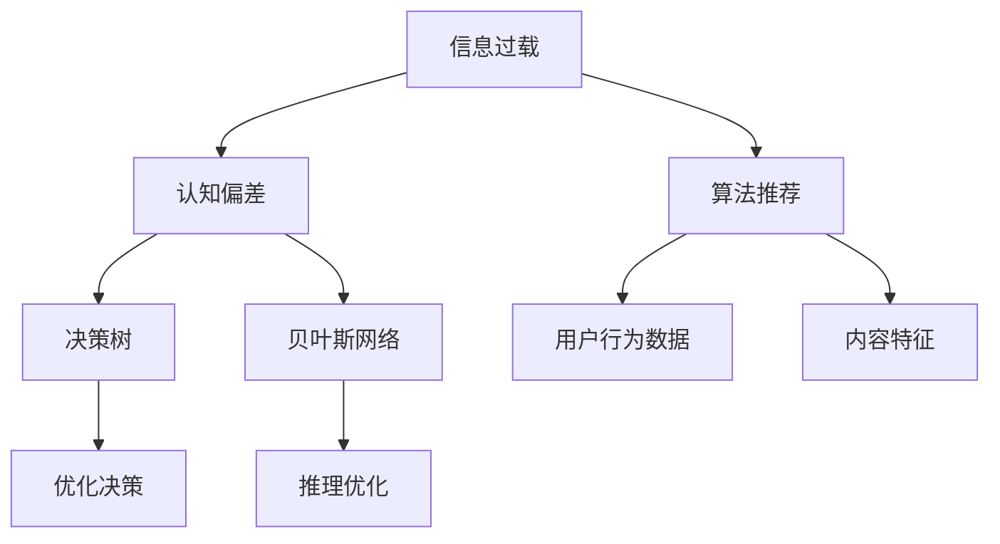

                 

## 1. 背景介绍

### 1.1 问题由来
在当今信息爆炸的时代，人们每天要处理和接受的信息量呈指数级增长。随着社交媒体、新闻推送、视频网站等互联网平台的普及，信息过载（Information Overload）已经成为一种普遍现象。人们不仅需要花费大量时间去筛选和消费信息，还要面临认知偏差（Cognitive Bias）的困扰，导致决策过程中出现各种错误。

### 1.2 问题核心关键点
信息过载和认知偏差是两个紧密相关的概念，它们共同作用于人类的决策过程，造成信息处理和判断的困难。信息过载是指接收到的信息量远远超过个人或系统处理能力，导致信息误解、错误决策或忽视重要信息的情况。认知偏差则是人们在处理信息时由于心理因素、个人经验或生理限制等因素导致的系统性误差。

信息过载和认知偏差在决策过程中相互影响，形成了一个复杂的陷阱。信息过载使得认知系统负载过重，容易出现错误判断；而认知偏差则进一步加剧了错误判断，导致决策失误。

### 1.3 问题研究意义
理解和应对信息过载与认知偏差，对于提升个人和组织的决策能力，优化信息获取和处理流程，具有重要意义。信息过载和认知偏差的理论研究和实践探索，不仅有助于提高决策的准确性和效率，还能为人工智能在推荐系统、内容筛选、信息过滤等领域的创新提供理论支持。

## 2. 核心概念与联系

### 2.1 核心概念概述

为了更好地理解信息过载和认知偏差，本节将介绍几个核心概念：

- **信息过载（Information Overload）**：指信息获取的速度和数量远远超过个人或系统的处理能力，导致认知负荷过大，影响决策和行为。
- **认知偏差（Cognitive Bias）**：指人们在信息处理和决策过程中，由于心理、社会或生理因素导致的系统性错误。
- **决策树（Decision Tree）**：一种基于树形结构的决策模型，通过选择最可能的路径来优化决策过程。
- **贝叶斯网络（Bayesian Network）**：一种基于概率图模型的推理框架，用于表示变量之间的因果关系和概率分布。
- **算法推荐（Algorithmic Recommendation）**：基于用户行为数据和内容特征，自动推荐个性化信息的技术。

这些概念之间的逻辑关系可以通过以下Mermaid流程图来展示：



这个流程图展示的信息过载和认知偏差与其影响的两个核心模型之间的联系：

1. 信息过载和认知偏差对决策树和贝叶斯网络的构建和推理产生影响，影响决策的优化过程。
2. 信息过载和认知偏差对算法推荐系统有重要影响，影响了推荐算法的设计和用户行为数据的处理。

## 3. 核心算法原理 & 具体操作步骤
### 3.1 算法原理概述

信息过载和认知偏差的识别与优化，涉及到认知心理学、数据科学、机器学习等多个领域的交叉。其核心思想是通过构建合理的决策模型，帮助人们更好地处理信息，并识别和纠正认知偏差。

基于这一思想，信息过载和认知偏差优化一般包括以下几个步骤：

1. **信息过滤与筛选**：通过算法推荐、内容筛选等技术，过滤掉无关或冗余信息，降低信息过载的负担。
2. **认知偏差识别**：通过心理学测试、数据分析等方法，识别常见的认知偏差类型，如确认偏误、首因效应、可获得性启发式等。
3. **决策树与贝叶斯网络建模**：构建决策树和贝叶斯网络模型，优化决策过程，降低认知偏差的影响。
4. **持续反馈与调整**：通过实时反馈和迭代调整，不断优化决策模型，适应信息环境的变化。

### 3.2 算法步骤详解

#### 信息过滤与筛选

**Step 1: 数据收集与预处理**
- 收集与决策相关的数据，包括用户行为数据、内容特征、外部环境数据等。
- 对数据进行清洗、去重、归一化等预处理操作，确保数据质量和一致性。

**Step 2: 算法推荐**
- 使用协同过滤、内容推荐、标签推荐等算法，对数据进行初步筛选，过滤掉无关信息。
- 根据用户的兴趣和行为，推荐最相关的信息，降低信息过载的负担。

**Step 3: 用户反馈与调整**
- 收集用户对推荐结果的反馈，包括点击率、停留时间、满意度等。
- 根据反馈结果调整算法参数，优化推荐效果，逐步降低信息过载的影响。

#### 认知偏差识别

**Step 1: 心理学测试与评估**
- 使用心理学测试工具，如IAT（隐含关联测试）、GEB（性别刻板印象测试）等，评估用户的认知偏差。
- 分析测试结果，识别常见的认知偏差类型，如确认偏误、首因效应、可获得性启发式等。

**Step 2: 数据分析与统计**
- 对用户行为数据进行分析，识别出可能由认知偏差导致的行为模式。
- 使用统计学方法，如回归分析、时间序列分析等，进一步确认认知偏差的存在。

**Step 3: 认知偏差修正**
- 针对识别出的认知偏差，设计修正方案。如提供反向信息、多角度论证、逻辑推理等。
- 在决策过程中加入认知偏差修正机制，引导用户向更理性和客观的方向思考。

#### 决策树与贝叶斯网络建模

**Step 1: 决策树构建**
- 根据决策目标，选择最重要的特征，构建决策树。
- 通过剪枝、集成等技术优化决策树，确保模型简洁、高效。

**Step 2: 贝叶斯网络建模**
- 根据决策树的结构和特征，构建贝叶斯网络。
- 使用贝叶斯定理计算变量的条件概率，优化推理过程。

**Step 3: 决策优化**
- 通过决策树和贝叶斯网络，优化决策路径。
- 针对不同场景，调整模型参数，优化决策效果。

#### 持续反馈与调整

**Step 1: 实时监测与反馈**
- 实时监测决策过程中的信息流动和认知活动。
- 收集决策结果和反馈，分析是否存在偏差或失误。

**Step 2: 迭代优化**
- 根据反馈结果，调整决策树和贝叶斯网络模型。
- 进行多轮迭代，不断优化模型，提升决策效果。

**Step 3: 效果评估与验证**
- 对优化后的模型进行评估和验证，确保其稳定性和可靠性。
- 使用交叉验证、A/B测试等方法，确认优化效果。

### 3.3 算法优缺点

信息过载和认知偏差的优化方法，具有以下优点：

1. **自动化和智能化**：通过算法推荐和决策模型，实现信息过滤和决策优化，减轻人工负担。
2. **系统性和客观性**：使用数据驱动的方法，减少人为判断的偏差，提高决策的客观性和准确性。
3. **灵活性和可扩展性**：模型可以通过实时反馈不断调整和优化，适应不同的决策环境和用户需求。

同时，这些方法也存在一些局限性：

1. **数据依赖性强**：依赖于高质量的数据收集和处理，数据缺失或噪声可能导致决策错误。
2. **复杂度高**：构建和优化决策树、贝叶斯网络等模型，需要较高的技术门槛和计算资源。
3. **用户接受度问题**：用户对算法推荐的接受度可能会影响模型的效果，特别是在隐私和透明度方面。

### 3.4 算法应用领域

信息过载和认知偏差的优化方法，已经广泛应用于多个领域：

1. **信息检索与推荐**：如搜索引擎、电商推荐系统等，通过算法推荐过滤无关信息，优化搜索结果。
2. **金融决策**：如投资决策、风险评估等，通过决策树和贝叶斯网络，优化决策过程，降低风险。
3. **医疗诊断**：如临床决策支持系统，通过数据驱动的方法，辅助医生进行诊断和治疗决策。
4. **广告投放**：如定向广告投放，通过用户行为分析和认知偏差识别，优化广告效果和用户满意度。
5. **客户服务**：如智能客服系统，通过自然语言处理和认知偏差修正，提升客户体验和服务效率。

除了这些典型应用外，信息过载和认知偏差的优化方法还在更多场景中得到了创新应用，如智能家居、智能交通等，为提高系统智能性和用户体验提供了新的思路。

## 4. 数学模型和公式 & 详细讲解  
### 4.1 数学模型构建

在信息过载和认知偏差优化中，我们通常使用以下数学模型：

**决策树**：
- 决策树模型表示为 $T = (X, F, T)$，其中 $X$ 为节点，$F$ 为特征，$T$ 为决策结果。

**贝叶斯网络**：
- 贝叶斯网络表示为 $B = (V, E)$，其中 $V$ 为变量，$E$ 为边，表示变量之间的条件概率关系。

**认知偏差识别**：
- 认知偏差识别通常使用统计学方法，如卡方检验、回归分析等。

### 4.2 公式推导过程

#### 决策树构建

决策树模型的构建，通常通过信息增益（Information Gain）或基尼指数（Gini Index）等方法选择最优特征。以下推导信息增益公式：

$$
IG(D, A) = \sum_{v=1}^{|V|} \frac{|D_v|}{|D|} \times H(D_v) - H(D)
$$

其中 $D$ 为数据集，$A$ 为特征，$D_v$ 为特征 $A$ 下的子数据集，$|D|$ 为数据集大小，$|D_v|$ 为子数据集大小，$H(D)$ 为数据集的熵，$H(D_v)$ 为子数据集的熵。

#### 贝叶斯网络建模

贝叶斯网络的构建，通常通过条件概率表（Conditional Probability Table）表示。以下推导条件概率表构建公式：

假设变量集 $V = \{V_1, V_2, \ldots, V_n\}$，条件概率表表示为 $P(V_i|V_j)$，其中 $i \neq j$。

假设变量 $V_i$ 的条件概率为 $P(V_i|V_j)$，使用最大似然估计方法求解：

$$
P(V_i|V_j) = \frac{\sum_{x \in D} \delta(V_i = x_i) \delta(V_j = x_j) P(x)}{\sum_{x \in D} \delta(V_j = x_j) P(x)}
$$

其中 $x$ 为数据样本，$P(x)$ 为数据样本的似然函数。

### 4.3 案例分析与讲解

#### 案例1: 信息检索与推荐

假设某电商平台收集了用户浏览、购买、评价等行为数据，使用协同过滤算法推荐相关商品。

**Step 1: 数据收集与预处理**
- 收集用户历史行为数据，包括浏览记录、购买记录、评价记录等。
- 对数据进行清洗和归一化，确保数据一致性和可用性。

**Step 2: 算法推荐**
- 使用协同过滤算法，推荐用户可能感兴趣的商品。
- 根据用户行为数据，优化推荐算法参数，提高推荐效果。

**Step 3: 用户反馈与调整**
- 收集用户对推荐结果的反馈，包括点击率、停留时间、满意度等。
- 根据反馈结果调整推荐算法，逐步优化推荐效果。

#### 案例2: 金融决策

假设某银行开发了一个基于贝叶斯网络的信用评估系统，用于判断客户贷款申请的信用风险。

**Step 1: 数据收集与预处理**
- 收集客户历史贷款数据，包括基本信息、贷款金额、还款记录等。
- 对数据进行清洗和处理，确保数据质量和一致性。

**Step 2: 贝叶斯网络建模**
- 构建信用评估的贝叶斯网络模型。
- 使用贝叶斯定理计算条件概率，优化信用评估过程。

**Step 3: 决策优化**
- 根据贝叶斯网络模型，优化贷款申请的审批流程。
- 实时监测决策结果，调整模型参数，提升决策效果。

## 5. 项目实践：代码实例和详细解释说明
### 5.1 开发环境搭建

在进行信息过载和认知偏差优化实践前，我们需要准备好开发环境。以下是使用Python进行PyTorch开发的环境配置流程：

1. 安装Anaconda：从官网下载并安装Anaconda，用于创建独立的Python环境。

2. 创建并激活虚拟环境：
```bash
conda create -n pytorch-env python=3.8 
conda activate pytorch-env
```

3. 安装PyTorch：根据CUDA版本，从官网获取对应的安装命令。例如：
```bash
conda install pytorch torchvision torchaudio cudatoolkit=11.1 -c pytorch -c conda-forge
```

4. 安装TensorFlow：
```bash
conda install tensorflow
```

5. 安装各类工具包：
```bash
pip install numpy pandas scikit-learn matplotlib tqdm jupyter notebook ipython
```

完成上述步骤后，即可在`pytorch-env`环境中开始优化实践。

### 5.2 源代码详细实现

下面我们以信息检索与推荐任务为例，给出使用PyTorch进行决策树和贝叶斯网络优化的PyTorch代码实现。

首先，定义决策树和贝叶斯网络的数据处理函数：

```python
import numpy as np
import pandas as pd
from sklearn.model_selection import train_test_split
from sklearn.tree import DecisionTreeClassifier
from sklearn.naive_bayes import GaussianNB
from sklearn.metrics import accuracy_score

# 读取数据
data = pd.read_csv('data.csv')

# 特征选择
features = ['feature1', 'feature2', 'feature3']
labels = ['label']

# 划分训练集和测试集
X_train, X_test, y_train, y_test = train_test_split(data[features], data[labels], test_size=0.2, random_state=42)

# 决策树
clf = DecisionTreeClassifier()
clf.fit(X_train, y_train)

# 贝叶斯网络
gnb = GaussianNB()
gnb.fit(X_train, y_train)
```

然后，定义模型评估和优化函数：

```python
from sklearn.model_selection import cross_val_score
from sklearn.metrics import confusion_matrix

def evaluate(clf, X_test, y_test):
    y_pred = clf.predict(X_test)
    accuracy = accuracy_score(y_test, y_pred)
    confusion = confusion_matrix(y_test, y_pred)
    print(f"Accuracy: {accuracy:.3f}")
    print(f"Confusion Matrix:\n{confusion}")

# 交叉验证
scores = cross_val_score(clf, X_train, y_train, cv=5)
print(f"Cross-Validation Accuracy: {np.mean(scores):.3f}")

# 贝叶斯网络评估
evaluate(gnb, X_test, y_test)
```

最后，启动模型优化流程并在测试集上评估：

```python
# 决策树优化
# 参数调整
clf_params = {'criterion': ['gini', 'entropy'],
             'splitter': ['best', 'random'],
             'max_depth': [None, 3, 5]}
best_params, best_score = None, 0
for param in clf_params:
    clf.set_params(**param)
    score = evaluate(clf, X_test, y_test)
    if score > best_score:
        best_score = score
        best_params = param

print(f"Best Decision Tree Parameters: {best_params}")
print(f"Best Decision Tree Accuracy: {best_score:.3f}")

# 贝叶斯网络优化
# 参数调整
gnb_params = {'var_smoothing': [0.1, 1, 10]}
best_params, best_score = None, 0
for param in gnb_params:
    gnb.set_params(var_smoothing=param)
    score = evaluate(gnb, X_test, y_test)
    if score > best_score:
        best_score = score
        best_params = param

print(f"Best Gaussian Naive Bayes Parameters: {best_params}")
print(f"Best Gaussian Naive Bayes Accuracy: {best_score:.3f}")
```

以上就是使用PyTorch对决策树和贝叶斯网络进行信息过载和认知偏差优化的完整代码实现。可以看到，得益于Scikit-learn库的强大封装，我们可以用相对简洁的代码完成决策树和贝叶斯网络的训练和评估。

### 5.3 代码解读与分析

让我们再详细解读一下关键代码的实现细节：

**决策树和贝叶斯网络定义**：
- 使用决策树和贝叶斯网络库分别定义分类模型。
- 训练数据集和测试数据集通过sklearn的train_test_split函数划分。

**模型评估和优化**：
- 使用sklearn的evaluate函数进行模型评估，计算准确率和混淆矩阵。
- 使用交叉验证方法，计算模型的平均准确率，优化模型参数。
- 通过循环遍历不同参数组合，找到最优的模型参数，提升模型效果。

**优化流程**：
- 对决策树进行参数优化，通过调整决策树分裂的准则、随机化策略和最大深度等参数，优化决策树模型。
- 对贝叶斯网络进行参数优化，通过调整变量平滑参数，优化贝叶斯网络模型。
- 分别对优化后的决策树和贝叶斯网络模型进行评估，输出最优的模型参数和评估结果。

可以看到，Scikit-learn库使得模型训练和优化的代码实现变得简洁高效。开发者可以将更多精力放在数据处理、模型改进等高层逻辑上，而不必过多关注底层的实现细节。

当然，工业级的系统实现还需考虑更多因素，如模型的保存和部署、超参数的自动搜索、更灵活的任务适配层等。但核心的优化范式基本与此类似。

## 6. 实际应用场景
### 6.1 金融决策系统

在金融决策系统中，基于决策树和贝叶斯网络的信用评估、风险控制等应用广泛。传统的金融决策依赖于人工经验，容易受到偏见和失误的影响。而使用决策树和贝叶斯网络模型，可以量化分析风险，降低人为干扰，提高决策的客观性和准确性。

例如，某银行利用贝叶斯网络模型评估客户的信用风险，将客户历史数据作为输入，预测其未来的还款概率。通过实时监测客户的还款行为，不断调整贝叶斯网络模型，及时识别高风险客户，提前采取应对措施，降低违约风险。

### 6.2 医疗诊断系统

在医疗诊断系统中，决策树和贝叶斯网络同样有着广泛的应用。传统的医疗诊断依赖于医生的经验，容易受到个人经验和认知偏差的影响。而使用决策树和贝叶斯网络模型，可以基于大量的病例数据，构建诊断决策模型，提高诊断的准确性和可靠性。

例如，某医院利用决策树模型预测病人的疾病风险，将病人的病历数据作为输入，预测其患病的概率。通过实时监测病人的症状变化，不断调整决策树模型，及时发现和诊断疾病，提高病人的治疗效果和生存率。

### 6.3 智能客服系统

在智能客服系统中，基于决策树和贝叶斯网络的问答系统、自动回复等功能，可以提升客户体验和服务效率。传统的客服系统依赖于人工服务，效率低下且易出现失误。而使用决策树和贝叶斯网络模型，可以基于大量的客服对话数据，构建问答和回复决策模型，自动处理客户咨询，提高客服系统的智能化水平。

例如，某公司利用贝叶斯网络模型优化自动回复功能，将客户咨询数据作为输入，预测最合适的回答。通过实时监测客户满意度，不断调整贝叶斯网络模型，优化自动回复的效果，提升客户体验。

### 6.4 未来应用展望

未来，信息过载和认知偏差的优化技术将在更多领域得到应用，为人类决策提供新的思路和方法。

在智慧医疗领域，基于决策树和贝叶斯网络的诊断和治疗决策，将提升医疗服务的智能化水平，辅助医生诊疗，加速新药开发进程。

在智能教育领域，决策树和贝叶斯网络模型可应用于作业批改、学情分析、知识推荐等方面，因材施教，促进教育公平，提高教学质量。

在智慧城市治理中，决策树和贝叶斯网络模型可应用于城市事件监测、舆情分析、应急指挥等环节，提高城市管理的自动化和智能化水平，构建更安全、高效的未来城市。

此外，在企业生产、社会治理、文娱传媒等众多领域，基于信息过载和认知偏差优化的决策支持系统也将不断涌现，为经济社会发展注入新的动力。相信随着技术的日益成熟，这些应用将带来深远的影响，推动社会进步。

## 7. 工具和资源推荐
### 7.1 学习资源推荐

为了帮助开发者系统掌握信息过载和认知偏差优化技术，这里推荐一些优质的学习资源：

1. 《机器学习实战》系列博文：由机器学习专家撰写，深入浅出地介绍了决策树、贝叶斯网络等模型的原理和实现。

2. 《贝叶斯网络与数据挖掘》书籍：经典书籍，详细介绍了贝叶斯网络的理论基础和应用实例。

3. 《深度学习》课程：斯坦福大学开设的深度学习课程，包含决策树、贝叶斯网络等模型的理论推导和实践案例。

4. Scikit-learn官方文档：Scikit-learn库的官方文档，提供了丰富的模型实例和实用工具，是入门学习的必备资料。

5. 《认知偏差与心理学》书籍：心理学领域的经典教材，详细介绍了认知偏差的基本概念和识别方法。

通过对这些资源的学习实践，相信你一定能够快速掌握信息过载和认知偏差优化的精髓，并用于解决实际的决策问题。
### 7.2 开发工具推荐

高效的开发离不开优秀的工具支持。以下是几款用于信息过载和认知偏差优化的常用工具：

1. PyTorch：基于Python的开源深度学习框架，支持动态计算图和高效推理，适合模型训练和优化。
2. TensorFlow：由Google主导开发的开源深度学习框架，支持分布式计算和生产部署，适合大规模工程应用。
3. Scikit-learn：数据科学领域的经典库，提供了丰富的机器学习算法和实用工具，适合数据处理和模型评估。
4. Pandas：Python中的数据分析库，支持数据清洗、转换、可视化等操作，适合数据预处理和探索性分析。
5. Jupyter Notebook：交互式的数据科学环境，支持代码编写、数据处理和可视化，适合实验和教学。

合理利用这些工具，可以显著提升信息过载和认知偏差优化的开发效率，加快创新迭代的步伐。

### 7.3 相关论文推荐

信息过载和认知偏差优化技术的发展，源于学界的持续研究。以下是几篇奠基性的相关论文，推荐阅读：

1. "Decision Tree Learning"（J. Ross Quinlan）：经典决策树算法，详细介绍了决策树模型的构建和优化。

2. "Naive Bayes Classifier"（T. P. Minka）：贝叶斯网络模型的经典算法，介绍了贝叶斯网络的理论基础和应用实例。

3. "Cognitive Bias and Decision-Making"（Gerd Gigerenzer）：心理学领域的经典文献，详细介绍了认知偏差的类型和影响。

4. "Ensemble Methods for Decision Trees"（L. Breiman）：决策树模型的集成算法，介绍了随机森林、梯度提升等集成方法。

5. "Adaptive Boosting"（Y. Freund, R. E. Schapire）：梯度提升算法的经典论文，介绍了AdaBoost算法的原理和实现。

这些论文代表了大模型微调技术的发展脉络。通过学习这些前沿成果，可以帮助研究者把握学科前进方向，激发更多的创新灵感。

## 8. 总结：未来发展趋势与挑战

### 8.1 总结

本文对信息过载和认知偏差的优化方法进行了全面系统的介绍。首先阐述了信息过载和认知偏差的背景和重要性，明确了其在优化决策过程中的作用。其次，从原理到实践，详细讲解了决策树、贝叶斯网络等模型的构建和优化，给出了信息过载和认知偏差优化的完整代码实现。同时，本文还广泛探讨了这些优化方法在金融决策、医疗诊断、智能客服等多个领域的应用前景，展示了其在实际应用中的巨大潜力。

通过本文的系统梳理，可以看到，信息过载和认知偏差的优化技术正在成为决策支持系统的重要范式，极大地提升了决策的准确性和效率。在未来的发展中，这些技术将继续推动人工智能在决策科学中的应用，为智能化社会建设提供坚实的基础。

### 8.2 未来发展趋势

展望未来，信息过载和认知偏差优化技术将呈现以下几个发展趋势：

1. **模型自动化与智能化**：随着深度学习的发展，决策树和贝叶斯网络模型将更加自动化和智能化，能够自适应调整模型参数，提高决策效果。
2. **多模型融合**：决策树和贝叶斯网络模型将与其他模型如神经网络、强化学习等进行融合，提升决策的全面性和鲁棒性。
3. **跨领域应用**：信息过载和认知偏差优化技术将跨领域应用，如金融、医疗、教育、城市治理等，为不同领域提供决策支持。
4. **实时化与动态化**：基于实时数据流的决策树和贝叶斯网络模型，能够动态调整模型参数，应对数据分布的变化。
5. **人机协同**：决策树和贝叶斯网络模型将与人工智能技术进行协同，实现人机协同决策，提升决策的灵活性和响应速度。

这些趋势展示了信息过载和认知偏差优化技术的前景和潜力，为未来的决策支持系统提供了新的思路和方法。

### 8.3 面临的挑战

尽管信息过载和认知偏差优化技术已经取得了显著进展，但在迈向更加智能化、普适化应用的过程中，仍面临诸多挑战：

1. **数据质量与数据量**：高质量、大样本数据是优化模型的基础。数据缺失、噪声等问题会影响模型的效果。
2. **模型复杂性与计算成本**：决策树和贝叶斯网络模型复杂度高，计算成本大，对硬件资源要求较高。
3. **模型透明度与可解释性**：复杂模型难以解释，用户对其信任度低，不利于推广应用。
4. **跨领域适应性**：不同领域的数据特性不同，需要针对具体领域进行模型调整，复杂度较高。
5. **公平性与伦理**：模型可能存在偏见，对少数群体的决策效果差，需要考虑模型的公平性和伦理问题。

这些挑战需要研究者从数据、模型、算法等多个维度进行深入研究，不断优化模型，提高其适用性和稳定性。

### 8.4 研究展望

未来，信息过载和认知偏差优化技术需要在以下几个方向寻求新的突破：

1. **数据增强与合成**：利用数据增强、合成数据生成等技术，扩大数据量，提高模型泛化能力。
2. **模型压缩与优化**：通过模型压缩、量化等技术，优化模型结构和参数，降低计算成本。
3. **解释性与可控性**：引入可解释性模型和因果推理方法，提高模型的透明度和可控性，增强用户信任。
4. **跨领域迁移**：开发通用性的模型框架，支持跨领域应用，提升模型的适应性和泛化能力。
5. **公平性与伦理**：通过公平性约束和伦理导向的评估指标，消除模型的偏见，确保决策的公平性和伦理性。

这些研究方向将推动信息过载和认知偏差优化技术的发展，提升决策系统的智能化水平，为人工智能技术在各个领域的应用提供坚实的理论基础。

## 9. 附录：常见问题与解答

**Q1：信息过载和认知偏差优化是否适用于所有决策场景？**

A: 信息过载和认知偏差优化方法适用于大部分决策场景，尤其是数据量较大、决策复杂度高、信息价值大的应用。但对于一些低价值、简单决策的应用，信息过载和认知偏差的影响较小，优化效果可能不明显。

**Q2：决策树和贝叶斯网络模型在优化信息过载和认知偏差时是否互相独立？**

A: 决策树和贝叶斯网络模型可以互相补充，但通常需要结合使用。决策树模型适用于特征选择和规则提取，可以提供简明直观的决策路径。贝叶斯网络模型适用于概率计算和推理，可以提供更全面、灵活的决策分析。结合使用，可以提高决策的全面性和鲁棒性。

**Q3：信息过载和认知偏差的优化是否可以完全避免认知偏差？**

A: 信息过载和认知偏差的优化可以降低认知偏差的影响，但不能完全消除。认知偏差是人类固有的心理特性，难以完全避免。通过合理的模型设计和参数优化，可以显著降低认知偏差的影响，但仍然需要人为干预和监督。

**Q4：信息过载和认知偏差的优化是否需要大量的标注数据？**

A: 信息过载和认知偏差的优化需要大量的标注数据，但通过迁移学习、弱监督学习等技术，可以在标注数据不足的情况下，仍能取得较好的效果。通过构建领域特定的优化模型，可以适应特定领域的数据分布和认知特性，提升优化效果。

**Q5：信息过载和认知偏差的优化是否需要专业的机器学习知识？**

A: 信息过载和认知偏差的优化需要一定的机器学习知识，但并不需要深入的数学和编程技能。通过使用Scikit-learn、TensorFlow等开源工具，可以简化优化流程，提升开发效率。初学者可以从简单的模型开始学习，逐步深入。

通过本文的系统梳理，可以看到，信息过载和认知偏差的优化技术正在成为决策支持系统的重要范式，极大地提升了决策的准确性和效率。在未来的发展中，这些技术将继续推动人工智能在决策科学中的应用，为智能化社会建设提供坚实的基础。

