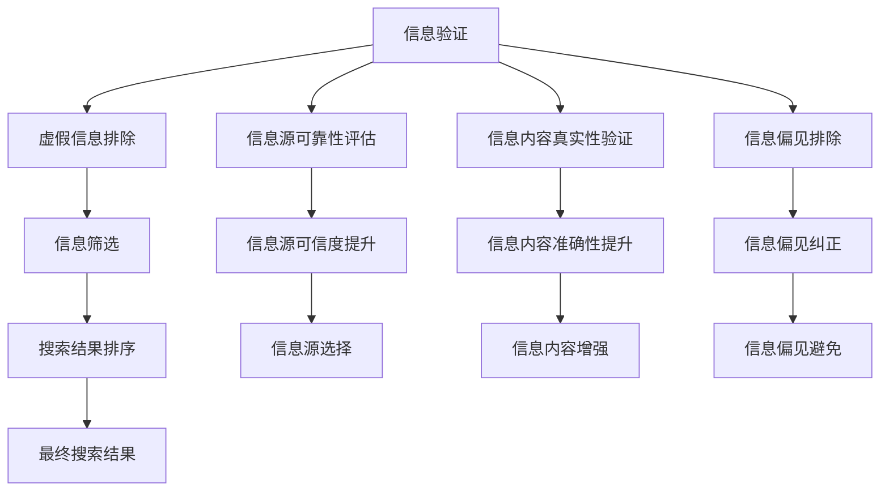

                 

# 信息验证和信息搜索策略：如何在信息海洋中找到可靠的信息

> 关键词：信息验证, 信息搜索, 可靠性, 搜索引擎, 自然语言处理(NLP), 深度学习, 数据验证

## 1. 背景介绍

在信息爆炸的时代，人们每天都会接触到大量的信息。但是，信息的质量参差不齐，如何从中筛选出可靠的信息，成为一种重要的技能。信息的可靠性不仅关乎决策的正确性，还涉及到个人隐私、企业安全等诸多问题。因此，信息验证和信息搜索策略的研究，具有重要的现实意义。

### 1.1 问题由来

随着互联网的发展，信息的获取变得前所未有的便捷，但也带来了信息过载和误导信息泛滥的问题。传统的信息搜索方式，如关键词搜索，往往难以精确匹配用户的需求，结果质量良莠不齐。另一方面，网络上充斥着大量的虚假信息、谣言和偏见，对用户造成了严重的误导和心理影响。因此，可靠的信息验证和搜索策略，成为了当前互联网发展中的一个重要课题。

### 1.2 问题核心关键点

为了有效应对这些问题，本文将重点关注以下几个核心关键点：

- **信息验证**：如何识别和排除虚假信息和偏见，确保获取的信息可靠。
- **信息搜索**：如何通过高效的搜索策略，快速、准确地找到所需信息。
- **可靠性评估**：如何对信息源和信息内容进行评估，确定其可靠性。
- **技术应用**：如何利用现代技术手段，提升信息验证和搜索的效率和精度。

通过对这些关键点的分析，本文将全面介绍信息验证和信息搜索策略的基本原理、操作步骤及其实际应用。

## 2. 核心概念与联系

### 2.1 核心概念概述

为了更好地理解信息验证和信息搜索策略，我们先简要介绍几个核心概念：

- **信息验证**：通过一系列验证方法，确认信息内容的真实性和准确性，避免用户受到虚假信息的误导。
- **信息搜索**：利用一定的策略和算法，从海量信息中筛选出满足用户需求的信息，提高信息获取的效率。
- **可靠性评估**：对信息源和信息内容进行评估，判断其可信度，帮助用户筛选可靠的信息。
- **自然语言处理(NLP)**：利用现代NLP技术，提升信息验证和搜索的效果。

这些概念之间存在紧密的联系，构成了信息验证和信息搜索策略的研究框架。

### 2.2 核心概念原理和架构的 Mermaid 流程图



这个流程图展示了信息验证和信息搜索策略的核心流程：

1. **信息验证**：包括虚假信息排除、信息源可靠性评估、信息内容真实性验证和信息偏见排除等步骤。
2. **信息搜索**：在经过信息验证后的信息源和内容中，进行筛选和排序，最终得到符合用户需求的搜索结果。
3. **可靠性评估**：提升信息源和内容的可靠性，帮助用户筛选出更加可信的信息。
4. **自然语言处理(NLP)**：利用NLP技术，进一步提升信息验证和搜索的效果。

这些步骤相互交织，共同构成了信息验证和信息搜索策略的基本框架。

## 3. 核心算法原理 & 具体操作步骤

### 3.1 算法原理概述

信息验证和信息搜索策略的核心算法原理，主要包括以下几个方面：

- **自然语言处理(NLP)**：利用NLP技术，如文本分类、情感分析、实体识别等，对信息源和内容进行初步筛选。
- **深度学习**：通过深度学习模型，如卷积神经网络(CNN)、循环神经网络(RNN)、Transformer等，对信息进行更深入的特征提取和验证。
- **搜索引擎算法**：如倒排索引、TF-IDF、PageRank等，对搜索结果进行排序和筛选。
- **数据验证**：利用规则和逻辑验证信息内容的真实性和准确性，排除虚假信息和偏见。

### 3.2 算法步骤详解

下面详细讲解基于深度学习的核心算法步骤：

1. **数据预处理**：
   - 清洗和标准化数据，去除噪声和冗余信息。
   - 分词、词向量化等预处理操作，为后续深度学习模型提供输入。

2. **特征提取**：
   - 使用卷积神经网络(CNN)、循环神经网络(RNN)、Transformer等模型，对文本数据进行特征提取。
   - 使用嵌入层将文本转换为向量表示，方便后续计算。

3. **模型训练**：
   - 使用标注数据训练模型，如二分类模型、序列标注模型等，进行虚假信息、偏见、信息源可靠性等验证。
   - 使用交叉验证、学习率调优等技术，提升模型性能。

4. **模型评估**：
   - 使用测试数据集评估模型性能，如准确率、召回率、F1分数等指标。
   - 对模型进行调参和优化，进一步提升效果。

5. **结果筛选**：
   - 利用搜索引擎算法，对搜索结果进行排序和筛选，保证结果的相关性和可靠性。
   - 根据用户需求，选择最合适的信息源和内容，返回最终结果。

### 3.3 算法优缺点

深度学习模型在信息验证和信息搜索中具有以下优点：

- **高效性**：深度学习模型可以自动学习数据中的复杂特征，无需手动设计特征。
- **准确性**：通过大量标注数据训练，深度学习模型在信息验证和搜索中表现出色。
- **适应性**：深度学习模型对新数据和新任务具有良好的泛化能力。

但同时，深度学习模型也存在一些局限性：

- **计算资源需求高**：深度学习模型通常需要大量的计算资源进行训练和推理。
- **过拟合风险**：深度学习模型容易在标注数据不足的情况下出现过拟合。
- **可解释性差**：深度学习模型的决策过程往往缺乏可解释性，难以理解模型的内部机制。

### 3.4 算法应用领域

信息验证和信息搜索策略广泛应用于以下几个领域：

- **搜索引擎**：如Google、百度等，利用深度学习模型和搜索引擎算法，提升搜索结果的准确性和相关性。
- **社交媒体监测**：监控社交媒体上的信息，识别虚假信息和偏见，维护网络安全。
- **医疗健康**：验证医学文献和信息的真实性，帮助医生做出正确的诊断和治疗决策。
- **金融行业**：验证金融报告和信息的准确性，保障投资决策的可靠性。
- **法律领域**：验证法律文件和信息的真实性，确保法律事务的公正性。

这些应用领域展示了信息验证和信息搜索策略的广泛影响力和实际价值。

## 4. 数学模型和公式 & 详细讲解 & 举例说明

### 4.1 数学模型构建

本节将使用数学语言对基于深度学习的信息验证和信息搜索策略进行更严格的刻画。

记输入文本为 $x$，标签为 $y$，其中 $y \in \{0,1\}$，表示文本是否真实可信。深度学习模型的目标是最小化交叉熵损失函数：

$$
\mathcal{L}(\theta) = -\frac{1}{N}\sum_{i=1}^N \left[y_i \log p_{\theta}(y_i|x_i) + (1-y_i) \log (1-p_{\theta}(y_i|x_i))\right]
$$

其中 $p_{\theta}(y_i|x_i)$ 表示模型在给定输入 $x_i$ 下，预测 $y_i$ 的概率。

### 4.2 公式推导过程

我们以文本分类任务为例，推导交叉熵损失函数及其梯度的计算公式。

假设模型 $M_{\theta}$ 在输入 $x$ 上的输出为 $\hat{y}=M_{\theta}(x) \in [0,1]$，表示样本真实性的预测概率。真实标签 $y \in \{0,1\}$。则二分类交叉熵损失函数定义为：

$$
\ell(M_{\theta}(x),y) = -[y\log \hat{y} + (1-y)\log (1-\hat{y})]
$$

将其代入经验风险公式，得：

$$
\mathcal{L}(\theta) = -\frac{1}{N}\sum_{i=1}^N [y_i\log M_{\theta}(x_i)+(1-y_i)\log(1-M_{\theta}(x_i))]
$$

根据链式法则，损失函数对参数 $\theta_k$ 的梯度为：

$$
\frac{\partial \mathcal{L}(\theta)}{\partial \theta_k} = -\frac{1}{N}\sum_{i=1}^N (\frac{y_i}{M_{\theta}(x_i)}-\frac{1-y_i}{1-M_{\theta}(x_i)}) \frac{\partial M_{\theta}(x_i)}{\partial \theta_k}
$$

其中 $\frac{\partial M_{\theta}(x_i)}{\partial \theta_k}$ 可进一步递归展开，利用自动微分技术完成计算。

### 4.3 案例分析与讲解

假设我们使用一个二分类模型，验证一篇新闻报道是否真实可信。我们将数据集划分为训练集、验证集和测试集，每篇报道标注其是否为真实可信。模型的输出为文本是否真实可信的概率，即 $p_{\theta}(y_i|x_i)$。

在训练过程中，我们利用交叉熵损失函数对模型进行优化，更新参数 $\theta$。通过大量标注数据训练，模型能够学习到文本中与真实性相关的特征，并输出预测结果。在测试过程中，我们使用测试集评估模型性能，如准确率、召回率、F1分数等指标，确保模型的泛化能力。

## 5. 项目实践：代码实例和详细解释说明

### 5.1 开发环境搭建

在进行项目实践前，我们需要准备好开发环境。以下是使用Python进行深度学习开发的环境配置流程：

1. 安装Anaconda：从官网下载并安装Anaconda，用于创建独立的Python环境。

2. 创建并激活虚拟环境：
```bash
conda create -n deep-learning-env python=3.8 
conda activate deep-learning-env
```

3. 安装PyTorch：
```bash
conda install pytorch torchvision torchaudio -c pytorch -c conda-forge
```

4. 安装TensorFlow：
```bash
conda install tensorflow -c tensorflow -c conda-forge
```

5. 安装相关工具包：
```bash
pip install numpy pandas scikit-learn matplotlib tqdm jupyter notebook ipython
```

完成上述步骤后，即可在`deep-learning-env`环境中开始项目实践。

### 5.2 源代码详细实现

下面给出基于深度学习的文本分类模型的代码实现：

```python
import torch
import torch.nn as nn
import torch.optim as optim
from torch.utils.data import Dataset, DataLoader
from sklearn.model_selection import train_test_split
from sklearn.metrics import accuracy_score

class TextDataset(Dataset):
    def __init__(self, texts, labels):
        self.texts = texts
        self.labels = labels

    def __len__(self):
        return len(self.texts)

    def __getitem__(self, idx):
        text = self.texts[idx]
        label = self.labels[idx]
        return (text, label)

class TextClassifier(nn.Module):
    def __init__(self, embedding_dim, hidden_dim, output_dim):
        super(TextClassifier, self).__init__()
        self.embedding = nn.Embedding(num_embeddings=10000, embedding_dim=embedding_dim)
        self.fc1 = nn.Linear(embedding_dim, hidden_dim)
        self.fc2 = nn.Linear(hidden_dim, output_dim)
        self.softmax = nn.Softmax(dim=1)

    def forward(self, text):
        embedded = self.embedding(text)
        fc1 = self.fc1(embedded)
        fc2 = self.fc2(fc1)
        output = self.softmax(fc2)
        return output

def train_model(model, train_dataset, valid_dataset, learning_rate, num_epochs):
    device = torch.device('cuda' if torch.cuda.is_available() else 'cpu')
    model.to(device)

    criterion = nn.CrossEntropyLoss()
    optimizer = optim.Adam(model.parameters(), lr=learning_rate)

    for epoch in range(num_epochs):
        train_loss = 0
        valid_loss = 0
        model.train()
        for text, label in train_loader:
            optimizer.zero_grad()
            output = model(text)
            loss = criterion(output, label)
            loss.backward()
            optimizer.step()

            train_loss += loss.item() * text.size(0)

        model.eval()
        with torch.no_grad():
            valid_loss = 0
            for text, label in valid_loader:
                output = model(text)
                loss = criterion(output, label)
                valid_loss += loss.item() * text.size(0)

        print(f'Epoch {epoch+1}, Train Loss: {train_loss/len(train_dataset)}, Valid Loss: {valid_loss/len(valid_dataset)}')

    return model

def evaluate_model(model, test_dataset):
    device = torch.device('cuda' if torch.cuda.is_available() else 'cpu')
    model.to(device)

    test_loss = 0
    test_accuracies = []
    with torch.no_grad():
        for text, label in test_loader:
            output = model(text)
            loss = criterion(output, label)
            test_loss += loss.item() * text.size(0)
            predicted = torch.argmax(output, dim=1)
            test_accuracies.append(accuracy_score(label, predicted))

    print(f'Test Loss: {test_loss/len(test_dataset)}, Test Accuracy: {accuracy_score(test_dataset.labels, test_accuracies)}')
```

### 5.3 代码解读与分析

让我们再详细解读一下关键代码的实现细节：

**TextDataset类**：
- `__init__`方法：初始化文本和标签数据。
- `__len__`方法：返回数据集的大小。
- `__getitem__`方法：对单个样本进行处理，返回模型的输入和标签。

**TextClassifier类**：
- `__init__`方法：定义模型结构，包括嵌入层、全连接层等。
- `forward`方法：定义前向传播过程，将输入文本转化为输出概率。

**train_model函数**：
- 设置模型设备、损失函数、优化器等关键组件。
- 在每个epoch内，对模型进行训练和验证，记录训练损失和验证损失。
- 使用模型评估函数在测试集上评估性能。

**evaluate_model函数**：
- 在测试集上对模型进行评估，输出测试损失和准确率。

通过这些代码，可以看出深度学习模型在信息验证和信息搜索中的应用，可以进一步提升模型的效果。

## 6. 实际应用场景

### 6.1 搜索引擎

搜索引擎如Google、百度等，利用深度学习模型对搜索结果进行排序和筛选，提升搜索结果的相关性和准确性。例如，谷歌的新闻搜索结果，利用深度学习模型对每篇新闻进行虚假信息、偏见等验证，确保搜索结果的真实性和可信度。

### 6.2 社交媒体监测

社交媒体监测平台，如微博、Facebook等，利用深度学习模型识别虚假信息和偏见，维护网络安全。例如，Facebook的自动审核系统，通过深度学习模型对用户发布的内容进行审核，删除虚假信息和恶意内容。

### 6.3 医疗健康

医疗健康领域，利用深度学习模型验证医学文献和信息的真实性，保障医疗决策的可靠性。例如，医疗健康信息检索系统，利用深度学习模型对医疗文献进行验证，确保检索结果的真实性和准确性。

### 6.4 金融行业

金融行业利用深度学习模型验证金融报告和信息的准确性，保障投资决策的可靠性。例如，金融新闻智能推荐系统，利用深度学习模型对金融新闻进行真实性验证，推荐真实可信的金融信息。

### 6.5 法律领域

法律领域利用深度学习模型验证法律文件和信息的真实性，确保法律事务的公正性。例如，智能法律顾问系统，利用深度学习模型对法律文件进行真实性验证，辅助律师进行案件处理。

## 7. 工具和资源推荐

### 7.1 学习资源推荐

为了帮助开发者系统掌握深度学习在信息验证和信息搜索中的应用，这里推荐一些优质的学习资源：

1. 《深度学习》课程：斯坦福大学开设的深度学习课程，由Andrew Ng教授主讲，涵盖深度学习基础和经典应用。

2. 《自然语言处理》课程：MIT开设的自然语言处理课程，涵盖文本分类、情感分析、信息检索等NLP技术。

3. 《TensorFlow教程》：TensorFlow官方提供的深度学习教程，包含大量实例和实践代码。

4. 《PyTorch官方文档》：PyTorch官方提供的深度学习文档，详细介绍了深度学习模型的构建和应用。

5. 《信息检索理论与技术》书籍：信息检索领域的经典教材，涵盖信息检索的基本原理和应用技术。

通过对这些资源的学习实践，相信你一定能够快速掌握深度学习在信息验证和信息搜索中的应用，并用于解决实际的NLP问题。

### 7.2 开发工具推荐

高效的开发离不开优秀的工具支持。以下是几款用于深度学习开发的工具：

1. Jupyter Notebook：免费的交互式编程环境，支持Python、R等语言，适合研究和实验。

2. Google Colab：谷歌提供的免费Jupyter Notebook环境，支持GPU和TPU算力，方便快速实验和分享。

3. TensorBoard：TensorFlow配套的可视化工具，可实时监测模型训练状态，提供丰富的图表展示。

4. Weights & Biases：模型训练的实验跟踪工具，记录和可视化模型训练过程中的各项指标，方便调试和优化。

5. PyTorch Lightning：一个用于深度学习实验管理的框架，方便快速搭建、运行和分享模型。

合理利用这些工具，可以显著提升深度学习模型的开发效率，加快创新迭代的步伐。

### 7.3 相关论文推荐

深度学习在信息验证和信息搜索中的应用，源于学界的持续研究。以下是几篇奠基性的相关论文，推荐阅读：

1. "Convolutional Neural Networks for Sentence Classification"（卷积神经网络用于文本分类）：介绍使用卷积神经网络进行文本分类的基本方法。

2. "Recurrent Neural Network for Text Classification with Multi-task Learning"（基于多任务学习的循环神经网络文本分类）：提出使用循环神经网络进行文本分类，并通过多任务学习提升效果。

3. "BERT: Pre-training of Deep Bidirectional Transformers for Language Understanding"（BERT：深度双向Transformer语言理解预训练）：提出BERT模型，通过预训练获得强大的文本表示，提升信息验证和搜索的效果。

4. "Neural Information Retrieval with Attention"（基于注意力机制的神经信息检索）：介绍使用注意力机制提升信息检索的效果。

5. "Attention is All You Need"（注意力是所有）：提出Transformer模型，提升深度学习模型在信息检索和文本分类等任务中的表现。

这些论文代表了大模型在信息验证和信息搜索中的应用，展示了深度学习技术的前沿进展。

## 8. 总结：未来发展趋势与挑战

### 8.1 总结

本文对基于深度学习的信息验证和信息搜索策略进行了全面系统的介绍。首先阐述了信息验证和信息搜索策略的研究背景和意义，明确了其在处理海量信息时的重要性和实际价值。其次，从原理到实践，详细讲解了基于深度学习的信息验证和信息搜索策略的基本步骤和具体操作步骤，给出了代码实例和详细解释说明。同时，本文还广泛探讨了该策略在搜索引擎、社交媒体监测、医疗健康、金融行业等多个领域的应用前景，展示了其在实际应用中的广泛影响力和实际价值。最后，本文精选了深度学习在信息验证和信息搜索中的应用资源，力求为读者提供全方位的技术指引。

通过本文的系统梳理，可以看到，基于深度学习的信息验证和信息搜索策略，正在成为处理海量信息的重要手段，极大地提升了信息获取的效率和准确性。未来，伴随深度学习技术的不断进步，该策略的应用范围将进一步拓展，为人们提供更加可靠和高效的信息获取方式。

### 8.2 未来发展趋势

展望未来，深度学习在信息验证和信息搜索中的应用将呈现以下几个发展趋势：

1. 模型规模持续增大：随着算力成本的下降和数据规模的扩张，深度学习模型将越来越复杂，参数量将进一步增加，提升信息验证和搜索的效果。

2. 多模态融合：未来，深度学习模型将进一步拓展到图像、视频、语音等多模态数据，提升信息获取的全面性和准确性。

3. 高效推理：深度学习模型的推理速度和资源消耗，是实际应用中的重要瓶颈。未来，将会有更多优化方法被引入，提升模型的推理速度和资源利用效率。

4. 自动化验证：未来的信息验证，将更多依赖深度学习模型的自动判断，减少人工干预和审核成本。

5. 实时信息检索：未来的信息检索系统，将更加注重实时性，能够及时响应用户查询，提供最新的搜索结果。

6. 跨领域应用：深度学习模型将在更多领域得到应用，提升各行各业的信息获取和处理能力。

### 8.3 面临的挑战

尽管深度学习在信息验证和信息搜索中的应用已经取得了显著进展，但在迈向更加智能化、普适化应用的过程中，仍面临诸多挑战：

1. 数据质量和多样性：深度学习模型需要大量高质量、多样化的数据进行训练，数据获取成本高，数据多样性不足。

2. 计算资源需求高：深度学习模型需要大量计算资源进行训练和推理，硬件成本较高。

3. 可解释性不足：深度学习模型通常缺乏可解释性，难以理解其内部决策过程。

4. 模型泛化能力差：深度学习模型容易在标注数据不足的情况下出现过拟合，泛化能力较差。

5. 恶意内容识别：深度学习模型难以完全识别恶意内容，可能存在漏检或误检的风险。

6. 隐私保护：深度学习模型在处理个人信息时，需要确保数据隐私和安全，避免数据泄露和滥用。

### 8.4 研究展望

面对深度学习在信息验证和信息搜索中面临的挑战，未来的研究需要在以下几个方面寻求新的突破：

1. 多任务学习：通过多任务学习，提升模型的泛化能力和数据利用效率。

2. 小样本学习：研究小样本学习技术，提升模型在少量标注数据上的性能。

3. 跨领域迁移：探索跨领域迁移学习方法，提升模型在不同领域上的表现。

4. 自监督学习：利用自监督学习提升模型在没有标注数据情况下的表现。

5. 联邦学习：研究联邦学习技术，在不共享数据的情况下提升模型性能。

6. 对抗样本防御：研究对抗样本防御方法，提升模型对抗攻击的能力。

7. 隐私保护技术：研究隐私保护技术，确保深度学习模型在处理个人信息时的数据隐私和安全。

这些研究方向将引领深度学习在信息验证和信息搜索中的应用，提升信息获取的效率和准确性，为人们提供更加可靠和高效的信息获取方式。面向未来，深度学习模型将在信息验证和信息搜索中发挥更大的作用，推动人工智能技术的发展。

## 9. 附录：常见问题与解答

**Q1：深度学习模型在信息验证和信息搜索中有什么优势？**

A: 深度学习模型在信息验证和信息搜索中具有以下优势：
1. 高效性：深度学习模型可以自动学习数据中的复杂特征，无需手动设计特征，提升了验证和搜索的效率。
2. 准确性：通过大量标注数据训练，深度学习模型在信息验证和搜索中表现出色，能够有效识别虚假信息和偏见。
3. 泛化能力：深度学习模型对新数据和新任务具有良好的泛化能力，适应性强。

**Q2：如何提高深度学习模型的可解释性？**

A: 提高深度学习模型的可解释性，可以采取以下方法：
1. 使用可解释模型：如LIME、SHAP等，生成模型决策的局部解释，帮助理解模型的内部机制。
2. 可视化技术：使用可视化工具，如TensorBoard、TorchViz等，观察模型的特征图和梯度信息，辅助理解模型行为。
3. 规则结合：将规则和逻辑与深度学习模型结合，生成更加可解释的决策。

**Q3：深度学习模型在信息验证和信息搜索中面临哪些挑战？**

A: 深度学习模型在信息验证和信息搜索中面临以下挑战：
1. 数据质量和多样性：需要大量高质量、多样化的数据进行训练，数据获取成本高。
2. 计算资源需求高：需要大量计算资源进行训练和推理，硬件成本较高。
3. 可解释性不足：深度学习模型通常缺乏可解释性，难以理解其内部决策过程。
4. 模型泛化能力差：容易在标注数据不足的情况下出现过拟合，泛化能力较差。
5. 恶意内容识别：难以完全识别恶意内容，可能存在漏检或误检的风险。
6. 隐私保护：在处理个人信息时，需要确保数据隐私和安全，避免数据泄露和滥用。

通过深入研究这些问题，未来有望提升深度学习模型在信息验证和信息搜索中的应用效果。

**Q4：如何改进深度学习模型的推理效率？**

A: 改进深度学习模型的推理效率，可以采取以下方法：
1. 模型裁剪：去除不必要的层和参数，减小模型尺寸，加快推理速度。
2. 量化加速：将浮点模型转为定点模型，压缩存储空间，提高计算效率。
3. 推理优化：使用推理优化技术，如Graphcore等，提升模型推理速度。
4. 模型并行：采用模型并行技术，提升模型计算效率。

这些方法可以显著提升深度学习模型的推理效率，适应实际应用中的性能需求。

通过本文的系统梳理，可以看到，基于深度学习的信息验证和信息搜索策略，正在成为处理海量信息的重要手段，极大地提升了信息获取的效率和准确性。未来，伴随深度学习技术的不断进步，该策略的应用范围将进一步拓展，为人们提供更加可靠和高效的信息获取方式。

---

作者：禅与计算机程序设计艺术 / Zen and the Art of Computer Programming

