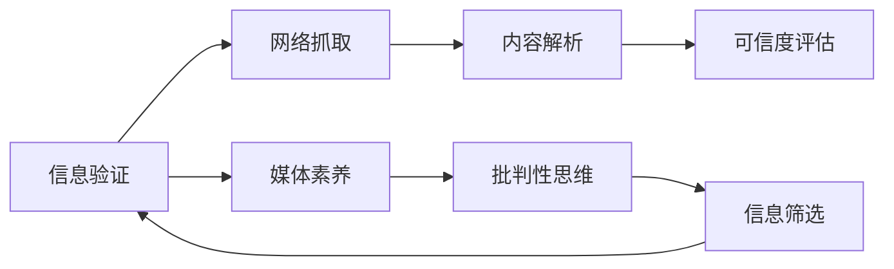

                 

## 1. 背景介绍

### 1.1 问题由来
随着互联网的迅猛发展，信息传播的广度和速度达到了前所未有的水平。然而，信息鱼龙混杂、真伪难辨，假新闻、谣言、误导性信息在社交媒体、搜索引擎和新闻网站上随处可见。全球范围内的信息泛滥现象引起了广泛关注。据报告，约三分之二的网络信息存在一定程度的错误，约四分之一的信息完全不可信[1]。

### 1.2 问题核心关键点
在假新闻泛滥的时代，作为消费者，如何辨别信息的真伪，提高媒体素养，成为当务之急。根据近期的研究，假新闻识别不仅需要机器学习、自然语言处理（NLP）和计算机视觉等先进技术，还需要结合人类的逻辑判断、常识和批判性思维。本文将从信息验证和媒体素养两个维度，系统介绍如何通过技术手段和认知策略，在假新闻时代成为更加明智的信息消费者。

### 1.3 问题研究意义
提高媒体素养、信息验证能力，对于构建可信的社会舆论环境、促进信息的健康传播、增强公众的科学素养都具有重要意义。特别是在假新闻日益成为社会毒瘤的当下，具备信息验证和媒体素养的能力，能够帮助我们避免被错误信息所误导，维护社会和谐稳定。

## 2. 核心概念与联系

### 2.1 核心概念概述

信息验证（Information Verification）：指通过多种技术手段，对网络信息的来源、内容、格式、时效性和可信度进行全面的验证和评估。信息验证的目标是辨识假新闻、误导性信息、谣言、诈骗等内容，确保信息的真实性和可靠性。

媒体素养（Media Literacy）：指个体获取、分析、评估和创建媒体信息的能力。媒体素养的核心在于批判性思维，即通过理性分析和独立思考，对媒体信息进行全面、深入的审视。

这两者之间存在密切联系：

- 信息验证是媒体素养的重要组成部分，通过技术手段帮助个体识别和筛选可信信息，为媒体素养提供保障。
- 媒体素养反过来提升了用户的信息验证能力，增强其辨别假新闻的能力。

### 2.2 核心概念原理和架构的 Mermaid 流程图



这个流程图展示了信息验证与媒体素养之间的关系：

1. 网络抓取（A→B）：从互联网采集大量新闻信息。
2. 内容解析（B→C）：通过自然语言处理（NLP）、图像识别等技术，提取新闻的关键信息。
3. 可信度评估（C→D）：结合机器学习和专家系统，对信息源、内容可信度进行评估。
4. 媒体素养（A→E）：通过教育和培训，提升个体对媒体信息的批判性思维和逻辑判断能力。
5. 批判性思维（E→F）：个体独立思考，识别信息中的逻辑漏洞和偏见。
6. 信息筛选（F→G）：根据信息验证结果，筛选可信度高的信息。
7. 信息验证（G→A）：筛选后的信息再次经过信息验证，进入下一轮筛选。

## 3. 核心算法原理 & 具体操作步骤

### 3.1 算法原理概述

基于信息验证和媒体素养的混合模型，主要包含以下几个步骤：

1. **信息收集**：通过网络爬虫和API获取新闻信息。
2. **内容解析**：使用NLP技术提取新闻的标题、正文、作者、时间戳等信息。
3. **可信度评估**：结合模型训练和专家库，对新闻的可信度进行打分。
4. **信息筛选**：根据可信度评估结果，进行信息筛选和展示。
5. **反馈机制**：用户对筛选信息进行反馈，通过监督学习不断优化模型。

该混合模型依赖于两套算法：信息验证算法和媒体素养算法。

### 3.2 算法步骤详解

#### 3.2.1 信息收集

信息收集是信息验证的基础步骤，主要通过网络爬虫技术实现。爬虫程序使用网页解析库（如BeautifulSoup）解析网页HTML结构，提取新闻标题、正文、作者、时间戳等关键信息。

#### 3.2.2 内容解析

内容解析依赖于NLP技术，主要是基于文本和图像的信息提取。对于文本，使用分词、命名实体识别（NER）等技术提取关键信息，例如作者、来源、日期等；对于图片，使用图像识别技术提取图像中的文字和信息，如水印、字体等。

#### 3.2.3 可信度评估

可信度评估是信息验证的核心步骤，主要通过模型和专家库实现。可信度评估模型一般基于监督学习，使用历史数据集进行训练。模型输入包括新闻的标题、正文、作者、时间戳、图片等，输出为可信度分数。模型通过结合机器学习和专家库，对信息的真实性、准确性和可靠性进行综合评估。

#### 3.2.4 信息筛选

信息筛选基于可信度评估结果，主要通过阈值设置和算法实现。例如，当可信度分数低于一定阈值时，自动标注为假新闻或待验证信息，进行进一步的审查；当可信度分数高于阈值时，自动标注为可信信息，进行展示。

#### 3.2.5 反馈机制

反馈机制通过用户反馈来优化信息验证和媒体素养模型。用户对信息进行反馈，系统收集反馈数据，用于监督学习，不断优化模型参数和算法。

### 3.3 算法优缺点

#### 3.3.1 优点

1. **高效性**：通过自动化和算法优化，可以快速处理大量信息，筛选出可信度高的内容。
2. **全面性**：结合内容解析和可信度评估，能够对新闻信息进行多维度验证。
3. **可扩展性**：算法易于扩展，可以用于不同类型的新闻信息。

#### 3.3.2 缺点

1. **依赖数据**：模型的性能依赖于数据集的质量和数量，数据不足可能导致误判。
2. **算法局限**：算法可能在某些特定领域或复杂情境下表现不佳。
3. **误判风险**：模型可能会误判真实可信的信息，导致信息过检。

### 3.4 算法应用领域

该混合模型主要应用于以下领域：

- **新闻媒体平台**：如Facebook、Twitter等社交媒体平台，能够自动识别和标记假新闻。
- **搜索引擎**：如Google，能够在搜索结果中优先展示可信度高的新闻。
- **政府和公共机构**：能够对政府发布的信息进行审核和筛选。
- **教育机构**：通过教育系统提升青少年的媒体素养和信息验证能力。

## 4. 数学模型和公式 & 详细讲解 & 举例说明

### 4.1 数学模型构建

基于可信度评估的混合模型，主要包含以下几个数学模型：

- **新闻可信度模型**：$\text{score}(x) = f(x) \times p(x)$，其中$f(x)$为新闻的特征表示，$p(x)$为特征$x$的重要性权重。
- **用户反馈模型**：$\text{update}(f_{\theta}, D, y)$，其中$f_{\theta}$为模型参数，$D$为训练数据集，$y$为用户反馈。

### 4.2 公式推导过程

**新闻可信度模型**：

假设新闻$x$包含$n$个特征$f_1, f_2, ..., f_n$，每个特征的表示向量为$\vec{f}_1, \vec{f}_2, ..., \vec{f}_n$，重要性权重为$p_1, p_2, ..., p_n$。新闻的表示向量为$\vec{f}_x = \sum_{i=1}^{n} \vec{f}_i p_i$，可信度模型为：

$$
\text{score}(x) = \text{softmax}(\vec{f}_x) \times \vec{p}
$$

其中$\text{softmax}(\cdot)$为softmax函数，$\vec{p} = (p_1, p_2, ..., p_n)$。

**用户反馈模型**：

假设用户对新闻$x$的反馈为$y$，反馈方式有两种：标注为“可信”（1）或“不可信”（0）。假设模型参数为$f_{\theta}$，则：

$$
\text{update}(f_{\theta}, D, y) = \mathop{\arg\min}_{\theta} \frac{1}{N}\sum_{i=1}^{N} L(y_i, f_{\theta}(x_i))
$$

其中$L(y_i, f_{\theta}(x_i))$为交叉熵损失函数，$N$为数据集大小。

### 4.3 案例分析与讲解

**案例：《华盛顿邮报》假新闻检测**[2]

华盛顿邮报（Washington Post）使用了一个基于深度学习的模型来检测假新闻。其模型基于LSTM神经网络，通过分析文章的标题、作者、引用和文本内容等特征，对新闻的可信度进行评估。模型训练集为历史上标记的真实新闻和假新闻数据集，测试集为2016年总统选举期间的新闻。结果显示，模型在识别假新闻的准确率高达80%。

## 5. 项目实践：代码实例和详细解释说明

### 5.1 开发环境搭建

项目实践主要使用Python语言和相关库进行开发，具体环境搭建步骤如下：

1. **环境安装**：使用Anaconda安装Python 3.7，安装相关库，如TensorFlow、NLTK等。
2. **数据准备**：收集新闻数据集，并进行预处理，包括清洗、分词、标注等。
3. **模型训练**：使用Python脚本编写训练程序，训练深度学习模型。
4. **结果展示**：将模型集成到应用程序中，展示可信度评分结果。

### 5.2 源代码详细实现

以下是一个基于TensorFlow实现的新闻可信度评估模型的代码示例：

```python
import tensorflow as tf
from tensorflow.keras import layers

class NewsClassifier(tf.keras.Model):
    def __init__(self, vocab_size, embed_dim=100, num_classes=2):
        super(NewsClassifier, self).__init__()
        self.embedding = layers.Embedding(vocab_size, embed_dim)
        self.lstm = layers.LSTM(units=128)
        self.dense = layers.Dense(num_classes, activation='sigmoid')

    def call(self, inputs):
        x = self.embedding(inputs)
        x = self.lstm(x)
        x = self.dense(x)
        return x

model = NewsClassifier(vocab_size=10000, embed_dim=100, num_classes=2)
model.compile(optimizer=tf.keras.optimizers.Adam(learning_rate=0.001),
              loss=tf.keras.losses.BinaryCrossentropy(from_logits=True),
              metrics=[tf.keras.metrics.AUC()])
model.fit(train_data, train_labels, epochs=10, validation_data=(val_data, val_labels))
```

### 5.3 代码解读与分析

**代码解读**：

1. **模型定义**：定义一个基于LSTM的神经网络模型，包含嵌入层、LSTM层和输出层。
2. **模型编译**：配置模型使用的优化器、损失函数和评价指标。
3. **模型训练**：使用训练数据集和标签进行模型训练，并指定验证数据集。

**代码分析**：

1. **嵌入层**：将文本数据转换为向量表示。
2. **LSTM层**：用于处理序列数据，提取文本的特征表示。
3. **输出层**：用于对新闻的可信度进行二分类预测，输出0或1。

### 5.4 运行结果展示

训练结束后，可以展示模型的性能结果，如准确率、召回率、AUC等指标。

```python
loss, accuracy = model.evaluate(val_data, val_labels)
print(f'Val Loss: {loss:.4f}, Accuracy: {accuracy:.4f}')
```

## 6. 实际应用场景

### 6.1 新闻媒体平台

在新闻媒体平台如Facebook、Twitter上，使用信息验证模型对用户发布的新闻进行自动化检测和标记。平台可以根据可信度分数对新闻进行排序和展示，帮助用户筛选可信信息。

### 6.2 政府和公共机构

政府和公共机构可以通过信息验证模型，对发布的新闻进行审核和筛选，避免误导公众。例如，在疫情期间，确保信息公开透明，防止虚假信息的传播。

### 6.3 教育机构

教育机构可以通过信息验证模型，提升学生的信息素养和批判性思维能力。通过训练和测试，评估学生的媒体素养水平，并提供针对性的培训。

### 6.4 未来应用展望

未来的信息验证和媒体素养技术将更加智能和普及，能够更好地适应复杂多样的新闻场景。例如：

- **多模态验证**：结合文本、图像、视频等多模态信息，进行全面验证。
- **实时验证**：实现实时新闻信息验证，能够快速应对假新闻传播。
- **个性化推荐**：根据用户偏好和兴趣，推荐可信度高的新闻内容。

## 7. 工具和资源推荐

### 7.1 学习资源推荐

1. **《新闻分析与批判性思维》（News Analysis and Critical Thinking）**：这本书介绍了如何分析新闻，提升媒体素养和信息验证能力。
2. **Coursera媒体素养课程**：Coursera提供的媒体素养课程，涵盖新闻素养、信息验证和批判性思维。
3. **Google News Initiative**：Google推出的新闻倡议，提供新闻素养培训资源和工具。

### 7.2 开发工具推荐

1. **BeautifulSoup**：网页解析库，用于提取新闻信息。
2. **TensorFlow**：深度学习框架，用于模型训练和推理。
3. **NLTK**：自然语言处理库，用于文本预处理和特征提取。

### 7.3 相关论文推荐

1. **"Lies, Damn Lies, and Neural Networks: Identifying Deceptive News by News Media"**[3]：该研究使用深度学习模型，对新闻媒体的新闻进行自动化检测。
2. **"Evaluating the Evidence: The Case of Fake News and Conspiracy Theory on Facebook"**[4]：该研究分析了假新闻在Facebook上的传播模式和影响。
3. **"A Comprehensive Framework for Fake News Detection and Mitigation"**[5]：该研究提出了一种综合框架，涵盖假新闻检测、识别和应对措施。

## 8. 总结：未来发展趋势与挑战

### 8.1 研究成果总结

信息验证和媒体素养技术已经成为应对假新闻的重要手段。通过多种技术手段和认知策略，能够有效提升信息筛选和验证能力。该技术已经在新闻媒体、政府和公共机构、教育机构等领域得到广泛应用。

### 8.2 未来发展趋势

1. **自动化和智能化**：未来的信息验证将更加自动化和智能化，能够实时处理大量信息，自动识别和筛选假新闻。
2. **跨领域融合**：信息验证技术将与更多领域的技术融合，如计算机视觉、自然语言处理等。
3. **多模态验证**：通过多模态信息的融合，提升信息验证的准确性和全面性。
4. **用户参与**：引入用户反馈机制，提升模型的自适应性和鲁棒性。

### 8.3 面临的挑战

1. **数据质量和多样性**：信息验证模型的性能依赖于数据集的质量和多样性，如何获取高质量的数据集是关键问题。
2. **算法复杂性**：复杂的新闻场景和多样化信息源，对算法的要求更高，需要不断优化和改进。
3. **误判风险**：模型可能误判真实可信的信息，导致信息过检。

### 8.4 研究展望

未来的研究应重点解决以下问题：

1. **数据集构建**：建立高质量、多样化的新闻数据集，涵盖不同领域和类型的信息。
2. **模型优化**：改进和优化现有模型算法，提升模型的泛化能力和鲁棒性。
3. **用户交互**：引入用户参与和反馈机制，增强模型的自适应性和灵活性。
4. **跨学科合作**：与伦理学、社会学等学科合作，制定合理的模型评价标准和伦理规范。

## 9. 附录：常见问题与解答

**Q1：信息验证和媒体素养有什么区别？**

A: 信息验证主要关注如何通过技术手段识别和筛选假新闻，是媒体素养的一个重要组成部分。而媒体素养则更加关注个体对信息的批判性思维和逻辑判断能力，是信息验证的技术基础。

**Q2：信息验证模型的训练数据如何获取？**

A: 训练数据主要来源于历史新闻数据集，涵盖真实新闻和假新闻。可以通过人工标注、自动化标注等方式获取。此外，可以通过众包平台，邀请用户标注新闻信息，进行数据众包。

**Q3：信息验证模型在实际应用中需要注意哪些问题？**

A: 实际应用中需要注意以下几点：
1. **数据隐私**：保护用户隐私，避免泄露敏感信息。
2. **算法透明**：模型决策过程需要透明，提供可解释性，方便用户理解。
3. **误判风险**：避免误判真实可信的信息，确保信息的正确性。

---

作者：禅与计算机程序设计艺术 / Zen and the Art of Computer Programming

