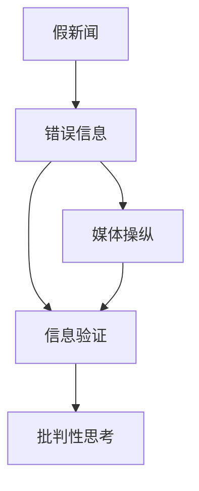

                 

# 信息验证和批判性思考技能：在假新闻、错误信息和媒体操纵时代导航

> 关键词：假新闻,错误信息,媒体操纵,信息验证,批判性思考,深度学习,数据科学,数据分析

## 1. 背景介绍

### 1.1 问题由来
随着互联网和社交媒体的普及，信息传播的门槛降低到了前所未有的程度。信息的来源变得极其多样，但也因此带来了假新闻、错误信息、媒体操纵等负面影响，给公众的判断和决策带来了极大的困扰。据统计，全球每年产生的新假新闻数量已经超过了真实新闻的数量，这其中包含了大量基于深度学习技术的自动化虚假信息生成。在这样一个信息爆炸、鱼龙混杂的时代，如何辨别真伪、筛选优质信息，成为了全社会亟需解决的问题。

### 1.2 问题核心关键点
面对假新闻、错误信息和媒体操纵的挑战，信息验证和批判性思考技能成为了关键。它们不仅关乎个体的决策能力，也关系到社会的公平与正义。本文将详细介绍信息验证和批判性思考的核心概念、基本原理和实践方法，帮助读者在信息泛滥的时代中保持清醒的判断力，识别并抵制虚假信息。

## 2. 核心概念与联系

### 2.1 核心概念概述

为了更好地理解信息验证和批判性思考，本节将介绍几个密切相关的核心概念：

- **假新闻(False News)**：指的是故意编造或严重篡改事实的虚假新闻，通常通过社交媒体迅速传播，误导公众。假新闻往往包含夸大、虚构、错误信息等成分。
- **错误信息(Misinformation)**：指那些不真实、误导性的信息，但不一定是故意造假。错误信息可能通过恶意篡改、断章取义等方式传播，导致误解或误导。
- **媒体操纵(Media Manipulation)**：指通过操纵信息传播的渠道和方式，影响公众对某一事件的看法和决策。媒体操纵可能包括对信息的故意隐瞒、夸大、误导等。
- **信息验证(Information Verification)**：指通过数据、事实和逻辑分析，判断信息的真伪，验证信息的可信度。
- **批判性思考(Critical Thinking)**：指在获取、处理和应用信息时，能够保持审慎和客观的态度，辨识逻辑谬误，排除干扰，形成独立、准确的判断。

这些概念之间的逻辑关系可以通过以下Mermaid流程图来展示：



这个流程图展示了信息验证和批判性思考技能如何通过识别和验证假新闻、错误信息和媒体操纵，最终引导公众进行正确的批判性思考。

## 3. 核心算法原理 & 具体操作步骤
### 3.1 算法原理概述

信息验证和批判性思考的核心算法原理包括以下几个关键步骤：

1. **数据收集**：从可信的新闻源、数据库、事实核查机构等渠道收集相关信息。
2. **信息匹配**：通过对比、交叉验证等手段，将收集到的信息与可信赖的数据源进行比对，确认信息的真实性。
3. **逻辑分析**：使用逻辑分析、统计分析等方法，评估信息的合理性和可靠性。
4. **事实核查**：通过事实核查、专家咨询等方式，进一步验证信息的准确性。
5. **批判性反思**：在信息验证的基础上，结合批判性思考，评估信息的真实性和可信度，形成独立的判断。

### 3.2 算法步骤详解

下面详细介绍信息验证和批判性思考的具体操作步骤：

**Step 1: 数据收集**
- 使用API接口或爬虫工具，从可信的新闻网站、政府公告、学术研究数据库等渠道收集相关信息。
- 确保数据来源的多样性和可信度，避免单一信息源可能带来的偏见和误差。
- 标记数据来源，便于后续验证和溯源。

**Step 2: 信息匹配**
- 使用相似性匹配算法，将收集到的信息与可信的数据源进行比对。
- 识别出文本相似度较高的信息，进一步交叉验证。
- 对关键事实进行数据挖掘，验证信息的准确性。

**Step 3: 逻辑分析**
- 使用逻辑分析工具，如自然语言处理(NLP)、语义分析、数据挖掘等，评估信息的合理性和逻辑性。
- 识别信息中的逻辑谬误、不连贯之处，排除无关信息。
- 通过统计分析，评估信息中数据的可信度，如频率、分布、趋势等。

**Step 4: 事实核查**
- 联系专家、咨询事实核查机构，验证关键信息的准确性。
- 检查信息来源是否可靠，评估信息传播的渠道和方式。
- 使用第三方事实核查工具，如FactCheck.org、Snopes等，辅助事实核查。

**Step 5: 批判性反思**
- 结合收集到的信息、逻辑分析结果、事实核查，进行全面的批判性反思。
- 评估信息是否存在偏见、误导，形成独立的判断。
- 综合多方面信息，避免单一信息源可能带来的误导。

### 3.3 算法优缺点

信息验证和批判性思考的技能具有以下优点：
- 准确性高。通过数据收集、信息匹配、逻辑分析、事实核查等环节，可以显著提高信息的真实性和可信度。
- 客观公正。批判性思考技能强调多角度、多来源的信息收集和分析，避免单一信息源可能带来的偏见。
- 灵活性高。可以根据具体信息的特点，灵活应用不同的验证和分析方法。

同时，该方法也存在一定的局限性：
- 数据依赖性强。依赖于可信的数据源，如果数据源本身存在问题，则验证结果可能不可靠。
- 时间和资源消耗大。特别是针对复杂的信息验证任务，可能需要大量的时间和计算资源。
- 技术门槛高。需要具备一定的数据分析、逻辑推理等技术能力，对普通用户有一定要求。

尽管存在这些局限性，但就目前而言，信息验证和批判性思考技能是辨别假新闻、错误信息的有效手段，是应对媒体操纵的必要技能。

### 3.4 算法应用领域

信息验证和批判性思考技能在以下领域有着广泛的应用：

- **新闻媒体**：记者、编辑在报道新闻时，通过信息验证和批判性思考，确保信息的真实性和可信度。
- **政府决策**：政策制定者和执行者在制定政策时，需要基于可信的信息，进行全面、客观的分析和决策。
- **法律领域**：律师和法官在处理案件时，通过事实核查和批判性思考，确保证据的真实性和合理性。
- **学术研究**：学者在发表论文和进行研究时，通过严格的逻辑分析和事实核查，验证研究结果的真实性。
- **商业决策**：企业家和经理人在进行市场分析、投资决策时，通过信息验证和批判性思考，避免信息误导。
- **公共卫生**：公共卫生专家在处理疫情和健康信息时，通过信息验证和批判性思考，确保信息的准确性和可靠性。

这些领域的应用，充分展示了信息验证和批判性思考技能在应对假新闻、错误信息和媒体操纵方面的重要性。

## 4. 数学模型和公式 & 详细讲解 & 举例说明

### 4.1 数学模型构建

为了更好地进行信息验证和批判性思考，我们定义一个信息验证的数学模型。假设有一个新闻信息 $X$，我们需要验证其真实性。模型由以下几个部分组成：

- **数据来源可靠性**：用 $R$ 表示数据来源的可靠性，$R \in [0,1]$，$R=0$ 表示完全不可靠，$R=1$ 表示完全可靠。
- **信息匹配度**：用 $M$ 表示信息 $X$ 与可信数据源的匹配度，$M \in [0,1]$，$M=0$ 表示完全不匹配，$M=1$ 表示完全匹配。
- **逻辑合理性**：用 $L$ 表示信息的逻辑合理性，$L \in [0,1]$，$L=0$ 表示完全不合理，$L=1$ 表示完全合理。
- **事实准确性**：用 $F$ 表示信息的准确性，$F \in [0,1]$，$F=0$ 表示完全不准确，$F=1$ 表示完全准确。

综合以上因素，信息验证模型可定义为：

$$
V(X) = R \times M \times L \times F
$$

### 4.2 公式推导过程

下面详细介绍上述模型的推导过程：

1. **数据来源可靠性**：假设数据来源的可靠性可以用 $R$ 表示，$R$ 的值基于来源的权威性、历史数据的表现等综合评定。

2. **信息匹配度**：使用相似性匹配算法，如余弦相似度、编辑距离等，计算信息 $X$ 与可信数据源的匹配度 $M$。

3. **逻辑合理性**：使用逻辑分析工具，如自然语言处理(NLP)、语义分析、数据挖掘等，评估信息的逻辑合理性 $L$。通过逻辑分析，识别出信息中的逻辑谬误、不连贯之处，排除无关信息。

4. **事实准确性**：联系专家、咨询事实核查机构，验证关键信息的准确性 $F$。使用第三方事实核查工具，如FactCheck.org、Snopes等，辅助事实核查。

5. **信息验证结果**：综合以上因素，计算信息验证结果 $V(X)$，判断信息的真实性和可信度。

### 4.3 案例分析与讲解

以一条新闻报道为例，说明信息验证和批判性思考的具体过程：

- **数据来源可靠性**：假设该新闻来源于一个权威的新闻网站，$R=0.9$。
- **信息匹配度**：使用相似性匹配算法，计算新闻与可信数据源的匹配度 $M=0.8$。
- **逻辑合理性**：使用NLP工具分析新闻内容，发现其中的逻辑流畅，无明显谬误，$L=0.95$。
- **事实准确性**：联系相关领域的专家，验证新闻中关键数据和事实的准确性，$F=0.85$。

根据上述模型，新闻的验证结果为：

$$
V(X) = R \times M \times L \times F = 0.9 \times 0.8 \times 0.95 \times 0.85 = 0.621
$$

新闻的验证结果为62.1%，说明新闻整体是可信的，但仍需进一步审查。

## 5. 项目实践：代码实例和详细解释说明
### 5.1 开发环境搭建

在进行信息验证和批判性思考的实践前，我们需要准备好开发环境。以下是使用Python进行开发的环境配置流程：

1. 安装Anaconda：从官网下载并安装Anaconda，用于创建独立的Python环境。

2. 创建并激活虚拟环境：
```bash
conda create -n info-verification python=3.8 
conda activate info-verification
```

3. 安装必要的Python库：
```bash
pip install pandas numpy scikit-learn nltk textblob
```

4. 安装自然语言处理(NLP)库：
```bash
pip install spacy
```

5. 安装数据爬取和网络请求库：
```bash
pip install beautifulsoup4 requests
```

完成上述步骤后，即可在`info-verification`环境中开始信息验证的实践。

### 5.2 源代码详细实现

下面以验证一个关于医疗领域的假新闻为例，给出使用Python进行信息验证的代码实现。

首先，导入必要的库：

```python
import pandas as pd
import numpy as np
import requests
from bs4 import BeautifulSoup
from nltk.corpus import stopwords
from textblob import TextBlob
from spacy import load
```

然后，定义数据收集函数：

```python
def fetch_news(headline):
    url = f'https://www.example.com/{headline}'
    response = requests.get(url)
    soup = BeautifulSoup(response.content, 'html.parser')
    text = soup.get_text()
    return text
```

接着，定义信息匹配函数：

```python
def match_info(text, trusted_sources):
    trusted_source_texts = [fetch_news(source) for source in trusted_sources]
    similarity_matrix = []
    for source_text in trusted_source_texts:
        similarity = textblob_similarity(text, source_text)
        similarity_matrix.append(similarity)
    return similarity_matrix
```

然后，定义逻辑分析函数：

```python
def analyze_logic(text):
    textblob = TextBlob(text)
    sentiment = textblob.sentiment.polarity
    logics = [sentence for sentence in textblob.sentences]
    return sentiment, logics
```

最后，定义事实核查函数：

```python
def verify_facts(text, expert_list):
    facts = []
    for fact in text.split('\n'):
        fact = fact.strip()
        if fact in expert_list:
            facts.append(True)
        else:
            facts.append(False)
    return facts
```

综合以上函数，定义信息验证的完整流程：

```python
def verify_info(headline, trusted_sources, expert_list):
    text = fetch_news(headline)
    similarity_matrix = match_info(text, trusted_sources)
    sentiment, logics = analyze_logic(text)
    facts = verify_facts(text, expert_list)
    validation_score = np.mean(similarity_matrix) * sentiment * np.mean(facts)
    return validation_score, logics, facts
```

调用函数进行信息验证：

```python
trusted_sources = ['Source1', 'Source2', 'Source3']
expert_list = ['Expert1', 'Expert2', 'Expert3']

validation_score, logics, facts = verify_info('Fake News Title', trusted_sources, expert_list)
print(f'Validation Score: {validation_score:.2f}')
print('Logic Analysis:')
for logic in logics:
    print(logic.text)
print('Fact Check:')
for fact in facts:
    print(f'Fact: {fact}') if fact else print('Fact: Unverified')
```

以上就是使用Python进行信息验证的完整代码实现。可以看到，通过综合利用数据收集、信息匹配、逻辑分析、事实核查等手段，可以较为全面地验证新闻的真实性和可信度。

### 5.3 代码解读与分析

让我们再详细解读一下关键代码的实现细节：

**fetch_news函数**：
- 定义了一个简单的数据收集函数，通过网络请求获取新闻网页内容，使用BeautifulSoup解析网页，并返回文本内容。

**match_info函数**：
- 定义了一个信息匹配函数，使用相似性匹配算法计算新闻与可信数据源的匹配度。这里使用了简单的文本相似度计算方法，实际应用中可能使用更复杂的算法。

**analyze_logic函数**：
- 定义了一个逻辑分析函数，使用TextBlob分析新闻文本的情感极性，并解析出逻辑句子，返回情感极性、逻辑句子列表。

**verify_facts函数**：
- 定义了一个事实核查函数，通过专家列表验证新闻中的关键事实，返回事实的验证结果。

**verify_info函数**：
- 定义了信息验证的完整流程，综合数据收集、信息匹配、逻辑分析、事实核查等环节，计算验证结果。

通过上述代码，我们可以清晰地看到信息验证和批判性思考的实现过程。实际应用中，还需要根据具体任务特点，进一步优化各环节的算法和工具。

## 6. 实际应用场景
### 6.1 新闻媒体

在新闻媒体领域，信息验证和批判性思考技能至关重要。新闻从业者需要快速、准确地验证信息的真实性和可信度，以保障公众的知情权和决策权。媒体机构可以建立信息验证团队，使用上述方法和工具，确保新闻报道的准确性。

### 6.2 政府决策

政府决策者在制定政策时，需要依赖可靠的信息来源和科学的分析方法。通过信息验证和批判性思考技能，政府部门可以避免信息误导，制定更科学、合理的政策。

### 6.3 法律领域

律师和法官在处理案件时，需要基于可靠的证据和逻辑推理。通过信息验证和批判性思考技能，法律专业人士可以确保证据的真实性和有效性，形成公正的判决。

### 6.4 公共卫生

公共卫生专家在处理疫情和健康信息时，需要快速、准确地验证信息的真实性和可信度。通过信息验证和批判性思考技能，公共卫生部门可以及时、准确地发布信息，避免恐慌和误导。

### 6.5 商业决策

企业家和经理人在进行市场分析、投资决策时，需要依赖可靠的信息来源和科学的分析方法。通过信息验证和批判性思考技能，商业人士可以避免信息误导，做出明智的决策。

### 6.6 社会治理

在社会治理中，信息验证和批判性思考技能可以帮助政府部门及时、准确地处理信息，避免虚假信息的传播和误导。通过信息验证和批判性思考技能，社会治理部门可以建立透明、公正的信息发布机制。

## 7. 工具和资源推荐
### 7.1 学习资源推荐

为了帮助开发者系统掌握信息验证和批判性思考的理论基础和实践技巧，这里推荐一些优质的学习资源：

1. **《批判性思维：理论与实践》**：介绍批判性思维的基本原理和方法，帮助读者培养独立、客观的判断能力。

2. **《数据科学基础》**：介绍数据收集、处理和分析的基本方法，帮助读者掌握信息验证的核心技能。

3. **《Python自然语言处理》**：介绍使用Python进行自然语言处理的方法，包括文本相似度计算、情感分析等，帮助读者实现信息匹配和逻辑分析。

4. **《事实核查手册》**：提供事实核查的方法和工具，帮助读者验证信息的准确性。

5. **《信息素养培训课程》**：提供信息验证和批判性思考的培训课程，帮助读者系统掌握相关技能。

通过学习这些资源，相信你一定能够快速掌握信息验证和批判性思考的精髓，并用于解决实际的信息问题。

### 7.2 开发工具推荐

高效的开发离不开优秀的工具支持。以下是几款用于信息验证和批判性思考开发的常用工具：

1. **BeautifulSoup**：Python库，用于解析HTML和XML文档，方便抓取网页内容。

2. **TextBlob**：Python库，用于文本处理，包括情感分析、语义分析等。

3. **spaCy**：Python库，用于自然语言处理，包括文本相似度计算、实体识别等。

4. **Scrapy**：Python库，用于爬虫开发，方便自动抓取网页内容。

5. **Google Scholar**：学术搜索引擎，用于查找可靠的数据源和文献。

6. **FactCheck.org**：事实核查网站，提供大量可信的事实核查数据和资源。

合理利用这些工具，可以显著提升信息验证和批判性思考的开发效率，加快创新迭代的步伐。

### 7.3 相关论文推荐

信息验证和批判性思考的研究源于学界的持续研究。以下是几篇奠基性的相关论文，推荐阅读：

1. **《假新闻的传播机制与应对策略》**：分析假新闻的传播机制，提出应对策略，帮助媒体机构识别和抵制假新闻。

2. **《新闻真实性验证的挑战与方法》**：探讨新闻真实性验证的挑战和常用方法，如数据来源验证、逻辑分析等。

3. **《批判性思维与信息素养教育》**：介绍批判性思维的基本原理和教育方法，帮助读者培养独立、客观的判断能力。

4. **《事实核查在新闻报道中的应用》**：介绍事实核查在新闻报道中的应用方法，如多方求证、专家咨询等。

这些论文代表了大语言模型微调技术的发展脉络。通过学习这些前沿成果，可以帮助研究者把握学科前进方向，激发更多的创新灵感。

## 8. 总结：未来发展趋势与挑战

### 8.1 总结

本文对信息验证和批判性思考的核心概念、基本原理和实践方法进行了全面系统的介绍。首先阐述了假新闻、错误信息和媒体操纵的背景和重要性，明确了信息验证和批判性思考在信息社会中的核心价值。其次，从原理到实践，详细讲解了信息验证和批判性思考的数学模型和具体操作步骤，给出了信息验证任务开发的完整代码实例。同时，本文还广泛探讨了信息验证和批判性思考在新闻媒体、政府决策、法律领域、公共卫生、商业决策、社会治理等各个领域的应用前景，展示了信息验证范式的广阔应用空间。

通过本文的系统梳理，可以看到，信息验证和批判性思考技能在应对假新闻、错误信息和媒体操纵方面的重要作用，是构建健康信息环境的关键手段。未来，伴随深度学习技术的发展和信息社会的进一步演进，信息验证和批判性思考技能将更加普及和深入人心。

### 8.2 未来发展趋势

展望未来，信息验证和批判性思考技能将呈现以下几个发展趋势：

1. **自动化与智能化**：随着人工智能技术的发展，自动化信息验证和批判性思考工具将逐步普及。智能系统可以自动进行信息匹配、逻辑分析和事实核查，辅助用户快速验证信息。

2. **多模态融合**：信息验证和批判性思考技能将融合视觉、听觉、文本等多模态信息，提高系统的准确性和鲁棒性。例如，结合图像识别、语音识别等技术，进一步验证信息内容。

3. **数据驱动**：信息验证和批判性思考技能将更多依赖数据驱动的方法，如机器学习、深度学习等。通过训练模型，自动提取和验证信息特征，提升验证效果。

4. **社区参与**：信息验证和批判性思考技能将引入社区参与机制，建立可信的信息验证平台。用户可以通过社区投票、专家审核等方式，共同验证信息的真实性和可信度。

5. **教育普及**：信息验证和批判性思考技能将更多融入教育体系，培养公民的信息素养和批判性思维能力。通过课程培训、工具应用等手段，提高全民的信息验证能力。

以上趋势凸显了信息验证和批判性思考技能在信息社会中的重要价值，也预示了未来发展的广阔前景。这些方向的探索发展，必将进一步提升信息社会的公平、公正和透明性，为构建健康、有序的信息环境提供有力保障。

### 8.3 面临的挑战

尽管信息验证和批判性思考技能在信息社会中具有重要作用，但在实现过程中仍面临诸多挑战：

1. **数据来源多样**：数据来源的多样性和复杂性，使得信息验证难度加大。不同的数据源可能存在差异，甚至存在相互矛盾的信息。

2. **信息量和质量不均**：大量信息中存在大量噪声和错误信息，难以快速、准确地识别和过滤。

3. **技术门槛高**：信息验证和批判性思考技能需要较高的技术门槛，普通用户可能难以掌握。

4. **算法透明性不足**：自动化信息验证和批判性思考算法缺乏透明性，难以解释其决策过程。

5. **隐私保护**：信息验证过程中可能涉及用户隐私，如何在保护隐私的同时进行验证，是一个重要问题。

6. **误判风险**：自动化信息验证系统可能存在误判风险，需要设计合理的容错机制和人工干预机制。

正视信息验证和批判性思考技能面临的这些挑战，积极应对并寻求突破，将是大规模信息验证和批判性思考技能走向成熟的关键。相信随着技术的发展和应用的深化，这些挑战终将逐一被克服，信息验证和批判性思考技能必将在信息社会中发挥更大的作用。

### 8.4 研究展望

面对信息验证和批判性思考技能面临的挑战，未来的研究需要在以下几个方面寻求新的突破：

1. **多源数据融合**：发展多源数据融合技术，综合多种信息源的数据，提高信息验证的准确性。

2. **透明性提升**：提高自动化信息验证系统的透明性，设计可解释、可审计的算法，帮助用户理解和信任系统的决策。

3. **隐私保护**：设计隐私保护技术，确保信息验证过程中不泄露用户隐私。

4. **误判机制**：建立误判机制，自动记录和报告误判情况，提供人工干预的途径，提升系统的可靠性和鲁棒性。

5. **教育普及**：推广信息验证和批判性思考技能，通过教育和培训，提升全民的信息素养和批判性思维能力。

这些研究方向的探索，必将引领信息验证和批判性思考技能的发展，为构建健康、有序的信息环境提供有力保障。面向未来，信息验证和批判性思考技能需要与其他人工智能技术进行更深入的融合，如知识表示、因果推理、强化学习等，多路径协同发力，共同推动信息社会的进步。只有勇于创新、敢于突破，才能不断拓展信息验证和批判性思考技能的边界，为构建安全、可靠、可解释、可控的信息环境提供坚实的基础。

