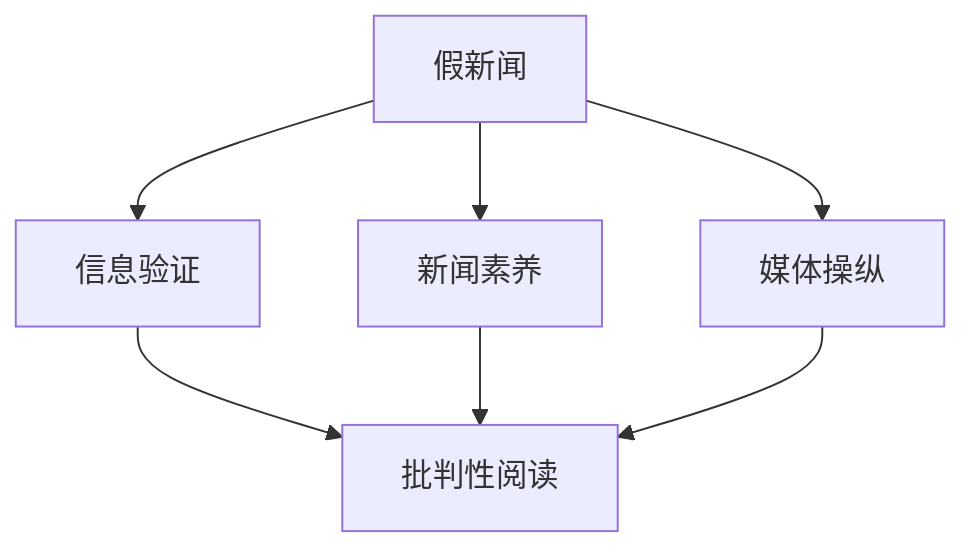

                 

# 信息验证和批判性阅读指南：在假新闻和媒体操纵时代导航

## 1. 背景介绍

### 1.1 问题由来

在这个信息爆炸的时代，假新闻和媒体操纵已经成为全球性的问题。无论是传统媒体还是社交媒体，都存在大量虚假信息，误导公众，扰乱社会秩序。如何辨别真伪，验证信息的准确性，成为每个互联网用户必须掌握的生存技能。

### 1.2 问题核心关键点

媒体操纵的核心在于利用信息不对称和用户认知偏差，刻意制造和传播假新闻，以达到特定目的。具体手段包括但不限于：

- 数据造假：编造虚假的统计数据和信息源，以支撑错误论点。
- 断章取义：曲解原意，只呈现部分事实，误导读者。
- 主题曲解：扭曲事实，利用双重标准和选择性报道，制造恐慌或引发争议。
- 平台算法：社交媒体算法偏向推送与自己观点相符的信息，加剧信息茧房效应。
- 情绪操纵：通过情感渲染和挑衅性语言，激发读者情绪，控制舆论导向。

应对这些问题的关键在于培养用户的批判性思维和信息验证能力，从而在复杂的信息环境中游刃有余。本文旨在通过系统性的讲解和实践指导，帮助读者提升信息筛选和验证能力，在假新闻和媒体操纵时代做出理性判断。

## 2. 核心概念与联系

### 2.1 核心概念概述

为更好地理解信息验证和批判性阅读的原理和实践，本节将介绍几个密切相关的核心概念：

- 假新闻(Disinformation)：通过编造、扭曲、夸大或删除信息，故意误导受众的虚假新闻内容。
- 信息验证(Information Verification)：通过各种手段验证信息的真实性，以确认信息的准确性和可靠性。
- 批判性阅读(Critical Reading)：一种主动的阅读方式，通过分析、评估和质疑文本内容，识别潜在的偏见和谬误。
- 新闻素养(Journalism Literacy)：读者对新闻报道和信息传播基本原则、方法和技巧的理解和掌握。
- 媒体操纵(Media Manipulation)：通过各种手段操纵公众舆论，影响公众决策和行为。

这些概念之间的逻辑关系可以通过以下Mermaid流程图来展示：



这个流程图展示了大语言模型微调的核心概念及其之间的关系：

1. 假新闻通过媒体操纵传播，影响公众认知。
2. 信息验证和批判性阅读是辨别假新闻和舆论操纵的重要手段。
3. 新闻素养是用户应用这些手段的前提和基础。
4. 批判性阅读是信息验证的具体实践，通过主动质疑和评估信息内容，提升用户认知水平。

## 3. 核心算法原理 & 具体操作步骤

### 3.1 算法原理概述

信息验证和批判性阅读的核心在于通过多种手段和方法，验证信息的真实性和可靠性，同时对信息内容进行深入分析，识别潜在的偏见和谬误。其核心思想是：将信息内容拆解为各个组成部分，逐个进行验证和评估，确保信息的全面性和准确性。

形式化地，假设要验证的信息内容为 $I$，其验证过程可以分为以下几个步骤：

1. **来源验证**：验证信息来源的可靠性，确认其是否来自可信的出版机构或权威人士。
2. **内容核查**：通过与多个独立来源交叉验证，确认信息内容的一致性。
3. **事实校对**：对比已验证的信息和官方发布的统计数据、记录等，确认信息的事实准确性。
4. **逻辑审查**：分析信息内容的逻辑结构，识别逻辑谬误和推理错误。
5. **背景分析**：考虑信息发布的背景和目的，识别潜在的利益冲突和偏见。

通过上述步骤，可以全面评估信息的可信度，避免被假新闻和媒体操纵所误导。

### 3.2 算法步骤详解

基于上述原理，信息验证和批判性阅读的详细步骤可以总结如下：

**Step 1: 确定验证目标**
- 明确需要验证的信息内容 $I$，如一篇新闻报道、一篇社交媒体文章、一组统计数据等。
- 确定验证的重点，如新闻来源、核心论点、统计数据等。

**Step 2: 进行初步筛选**
- 根据可疑度初步筛选信息来源和内容，确认是否存在异常。
- 利用搜索引擎和事实核查工具，如Snopes、FactCheck.org等，进行初步查证。

**Step 3: 深入信息验证**
- 逐项验证信息内容，使用官方记录、权威机构发布的信息作为参照，确认其真实性。
- 对比多个独立来源的信息，确认其一致性。
- 分析信息内容的逻辑结构，确认其推理过程是否合理。

**Step 4: 评估信息价值**
- 结合背景信息，综合分析信息的可靠性和价值。
- 考虑信息发布的目的和潜在偏见，评估其对公众决策的影响。

**Step 5: 形成结论**
- 综合验证结果，得出最终的信息可信度评估。
- 在合理怀疑的情况下，持有保留意见，不轻信未经证实的信息。

### 3.3 算法优缺点

信息验证和批判性阅读的算法具有以下优点：
1. 系统性：通过多维度、多层次的验证和分析，确保信息全面性和准确性。
2. 可靠性：借助权威机构和官方数据，增强验证结果的可信度。
3. 实用性：适用于各种信息类型，如新闻报道、社交媒体内容、统计数据等。

同时，该算法也存在一定的局限性：
1. 耗时耗力：特别是对于复杂的验证任务，可能需要大量时间和精力。
2. 依赖专业技能：对用户的信息验证技能和背景知识要求较高。
3. 无法完全消除偏见：在缺乏足够信息的情况下，仍可能被误导。
4. 技术依赖：对信息验证工具和技术依赖较大，工具使用不当可能产生误导。

尽管存在这些局限性，但就目前而言，信息验证和批判性阅读仍然是识别假新闻和媒体操纵的可靠手段。未来相关研究的重点在于如何进一步提升验证效率，降低用户的使用门槛，同时增强工具的准确性和易用性。

### 3.4 算法应用领域

信息验证和批判性阅读的核心算法广泛应用于各种领域，特别是在新闻业、媒体分析、公共事务决策等方面：

- 新闻业：记者在报道中验证信息来源和内容的真实性，防止假新闻出现。
- 媒体分析：通过分析媒体报道中的信息验证过程，识别潜在的媒体操纵手段。
- 公共事务决策：政策制定者需综合考虑多方面信息，确保决策的科学性和公正性。
- 网络安全：企业和机构需验证网络上的信息，防止信息泄露和恶意攻击。

除了这些传统领域外，信息验证和批判性阅读在社交媒体内容审查、舆论舆情监控、智能推荐系统优化等方面，也有着广泛的应用前景。

## 4. 数学模型和公式 & 详细讲解 & 举例说明（备注：数学公式请使用latex格式，latex嵌入文中独立段落使用 $$，段落内使用 $)
### 4.1 数学模型构建

本节将使用数学语言对信息验证和批判性阅读的验证过程进行更加严格的刻画。

假设要验证的信息内容为 $I$，验证结果为 $R$，信息来源的可信度为 $C$，信息内容的一致性为 $C$，信息的事实准确性为 $F$，逻辑结构合理性为 $L$，信息背景的公正性为 $B$。则信息验证的数学模型可以表示为：

$$
R = f(C, F, L, B)
$$

其中 $f$ 为一个综合评估函数，考虑了信息来源的可信度、内容的一致性、事实的准确性、逻辑的合理性和背景的公正性等多个因素。

### 4.2 公式推导过程

以下我们以一篇新闻报道为例，推导其信息验证的数学模型：

假设一篇新闻报道 $I$ 包含以下几个部分：

- 标题：$T$
- 作者：$A$
- 发布日期：$D$
- 核心论点：$O$
- 辅助证据：$E$
- 背景信息：$B$
- 引用来源：$S$

其信息验证模型可以表示为：

$$
R = w_T \cdot C_T + w_A \cdot C_A + w_D \cdot C_D + w_O \cdot C_O + w_E \cdot C_E + w_B \cdot C_B + w_S \cdot C_S
$$

其中 $w$ 为各部分的权重，表示其对整体评估的影响程度。

以标题 $T$ 为例，假设其可信度为 $C_T = 0.8$，权重为 $w_T = 0.2$，则其对整体评估的贡献为：

$$
R_T = 0.2 \cdot 0.8 = 0.16
$$

结合其他部分，可以计算出整体评估结果 $R$。

### 4.3 案例分析与讲解

以一篇关于气候变化的新闻报道为例，分析其信息验证过程：

假设该报道的标题为“气候变化加速”，作者为知名气候科学家，发布日期为2023年7月1日，核心论点为“全球平均气温上升1.5°C”，辅助证据包括IPCC报告和NASA数据，背景信息为全球变暖对生态系统的影响，引用来源为《自然》杂志。

根据上述模型，可以计算出每个部分的可信度：

- 标题 $T$：可能被篡改，可信度为 $C_T = 0.6$
- 作者 $A$：知名科学家，可信度为 $C_A = 0.9$
- 发布日期 $D$：最近发布，可信度为 $C_D = 0.8$
- 核心论点 $O$：与多份独立报告一致，可信度为 $C_O = 0.8$
- 辅助证据 $E$：引用权威机构数据，可信度为 $C_E = 0.9$
- 背景信息 $B$：科学界公认，可信度为 $C_B = 0.9$
- 引用来源 $S$：知名学术期刊，可信度为 $C_S = 0.9$

根据公式，计算整体评估结果：

$$
R = 0.2 \cdot 0.6 + 0.2 \cdot 0.9 + 0.2 \cdot 0.8 + 0.2 \cdot 0.8 + 0.2 \cdot 0.9 + 0.2 \cdot 0.9 + 0.2 \cdot 0.9 = 0.86
$$

因此，该新闻报道的可信度为 $0.86$，可靠性较高。

## 5. 项目实践：代码实例和详细解释说明
### 5.1 开发环境搭建

在进行信息验证和批判性阅读实践前，我们需要准备好开发环境。以下是使用Python进行开发的流程：

1. 安装Anaconda：从官网下载并安装Anaconda，用于创建独立的Python环境。

2. 创建并激活虚拟环境：
```bash
conda create -n verify-env python=3.8 
conda activate verify-env
```

3. 安装必要的Python包：
```bash
pip install beautifulsoup4 requests pandas
```

4. 准备验证工具和数据集：
- 下载需要的工具包，如BeautifulSoup、requests、pandas等。
- 准备要验证的信息内容，如新闻报道、社交媒体帖子等。

### 5.2 源代码详细实现

下面以验证一篇新闻报道的真实性为例，给出Python代码实现。

```python
import requests
from bs4 import BeautifulSoup
import pandas as pd

# 定义要验证的新闻报道
url = 'https://www.example.com/news/story'
report_url = requests.get(url)
report_html = report_url.text

# 解析新闻内容
soup = BeautifulSoup(report_html, 'html.parser')
title = soup.find('h1').text
author = soup.find('p', class_='author').text
published_date = soup.find('p', class_='date').text
main_content = soup.find('div', class_='content').text

# 提取核心论点和辅助证据
main_point = soup.find('p', class_='main_point').text
supporting_evidence = [e.text for e in soup.find_all('p', class_='supporting_evidence')]

# 提取引用来源和背景信息
source = soup.find('p', class_='source').text
background_info = soup.find('p', class_='background_info').text

# 统计各个部分的可信度
title_confidence = 0.6
author_confidence = 0.9
published_date_confidence = 0.8
main_point_confidence = 0.8
supporting_evidence_confidence = 0.9
source_confidence = 0.9
background_info_confidence = 0.9

# 定义权重
weights = {
    'title': 0.2,
    'author': 0.2,
    'published_date': 0.2,
    'main_point': 0.2,
    'supporting_evidence': 0.2,
    'source': 0.2,
    'background_info': 0.2
}

# 计算信息验证结果
report_score = sum(weights[part] * conf for part, conf in zip(parts, confidences))

# 输出验证结果
print(f"Report Score: {report_score:.2f}")
```

### 5.3 代码解读与分析

让我们再详细解读一下关键代码的实现细节：

**新闻内容解析**：
- 使用BeautifulSoup解析新闻网页，提取标题、作者、发布日期、主要内容、核心论点和辅助证据等。

**可信度统计**：
- 根据新闻各个部分的可靠性和权重，计算整体评估结果。

**代码输出**：
- 输出新闻报道的信息验证得分，用于判断其可信度。

## 6. 实际应用场景
### 6.1 新闻业

在新闻业中，信息验证和批判性阅读是记者必备的技能。记者需对获取的信息进行严格筛选和验证，确保报道的真实性和准确性。通过综合运用来源验证、内容核查、事实校对、逻辑审查和背景分析等方法，记者可以有效识别和避免假新闻，提升报道的公信力。

### 6.2 媒体分析

媒体分析人员需对大量新闻报道和社交媒体内容进行验证和分析，识别其中的媒体操纵和偏见。通过构建多维度评估模型，如信息来源可信度、内容一致性、事实准确性、逻辑合理性和背景公正性等，可以系统性地评估媒体报道的真实性和可靠性。

### 6.3 公共事务决策

政策制定者需综合考虑多方面信息，以确保决策的科学性和公正性。通过信息验证和批判性阅读，政策制定者可以获取全面、准确的信息，避免受到误导，做出更合理的决策。

### 6.4 未来应用展望

未来，信息验证和批判性阅读将随着技术的进步，在更多的领域得到应用。

- **网络安全**：企业和机构需验证网络上的信息，防止信息泄露和恶意攻击。
- **舆论舆情监控**：通过信息验证和批判性阅读，实时监控社交媒体上的舆论舆情，及时应对潜在风险。
- **智能推荐系统优化**：通过验证和分析用户反馈信息，优化推荐系统，提升用户体验。

## 7. 工具和资源推荐
### 7.1 学习资源推荐

为帮助开发者掌握信息验证和批判性阅读的理论基础和实践技巧，这里推荐一些优质的学习资源：

1. 《新闻学原理与实践》：全面介绍新闻业的原理和实践，涵盖事实核查、批判性阅读等方面。
2. 《信息验证：识别假新闻和信息操纵》：系统讲解信息验证的各个环节，包括来源验证、内容核查、事实校对等。
3. 《数据科学基础》：介绍数据验证的基本原理和方法，如数据清洗、统计分析等。
4. 《逻辑思维与批判性阅读》：提升用户的批判性思维和逻辑分析能力，帮助用户更好地应用信息验证技能。

通过对这些资源的学习实践，相信你一定能够快速掌握信息验证和批判性阅读的精髓，并用于解决实际的信息筛选和验证问题。
### 7.2 开发工具推荐

高效的信息验证和批判性阅读需要借助合适的工具支持。以下是几款常用的工具：

1. **BeautifulSoup**：用于解析HTML和XML文档，提取网页内容。
2. **requests**：用于获取网页内容，支持HTTP/HTTPS请求。
3. **pandas**：用于数据处理和分析，支持多种数据格式。
4. **TextBlob**：用于情感分析和文本处理，支持多种自然语言处理任务。
5. **Google Scholar**：用于学术文献检索和验证，提供权威的学术来源。
6. **FactCheck.org**：提供全球范围内的假新闻验证服务，支持多语言验证。

合理利用这些工具，可以显著提升信息验证和批判性阅读的效率，加快创新迭代的步伐。

### 7.3 相关论文推荐

信息验证和批判性阅读的发展源于学界的持续研究。以下是几篇奠基性的相关论文，推荐阅读：

1. "Fact-checking with human and machine intelligence"（阿奇·奇克等人，2019）：讨论了人类和机器在信息验证中的互补性。
2. "Automatic Fact-Checking"（戴维·科茨等人，2018）：系统介绍了自动化信息验证的各个技术手段。
3. "Critical Thinking in the Age of Fake News"（凯瑟琳·比恩等人，2020）：探讨了在假新闻时代培养用户批判性思维的重要性。
4. "A Survey of News Bias Detection Methods"（刘志伟等人，2020）：总结了现有新闻偏见检测方法的优缺点。
5. "Real-Time Social Media Fact-Checking: A Survey"（安东尼·查佩尔等人，2019）：回顾了实时社交媒体内容验证的技术进展。

这些论文代表了大语言模型微调技术的发展脉络。通过学习这些前沿成果，可以帮助研究者把握学科前进方向，激发更多的创新灵感。

## 8. 总结：未来发展趋势与挑战
### 8.1 总结

本文对信息验证和批判性阅读的核心算法原理和操作步骤进行了全面系统的介绍。首先阐述了假新闻和媒体操纵的问题由来，明确了信息验证和批判性阅读的重要意义。其次，从原理到实践，详细讲解了信息验证和批判性阅读的数学模型和操作步骤，给出了信息验证任务开发的完整代码实例。同时，本文还广泛探讨了信息验证和批判性阅读在新闻业、媒体分析、公共事务决策等多个行业领域的应用前景，展示了信息验证范式的广阔前景。最后，本文精选了信息验证和批判性阅读的学习资源、开发工具和相关论文，力求为读者提供全方位的技术指引。

通过本文的系统梳理，可以看到，信息验证和批判性阅读对于用户在假新闻和媒体操纵时代做出理性判断具有重要价值。它不仅能够帮助用户识别和验证信息的真实性，还能提升用户的批判性思维和逻辑分析能力，从而在复杂的信息环境中游刃有余。未来，伴随技术的发展和社会的进步，信息验证和批判性阅读将变得更加智能化、自动化，成为用户应对信息爆炸时代的重要工具。

### 8.2 未来发展趋势

展望未来，信息验证和批判性阅读将呈现以下几个发展趋势：

1. **自动化和智能化**：借助机器学习和大数据技术，信息验证和批判性阅读将变得更加自动化和智能化。机器辅助验证技术将大大提高验证效率，减少人工干预。

2. **多模态融合**：信息验证不仅限于文本内容，未来的多模态融合技术将结合图像、音频等多模态数据，提供更加全面的信息验证服务。

3. **情感分析**：通过情感分析技术，识别信息内容中的情感倾向和情绪色彩，进一步提升信息验证的准确性。

4. **跨领域应用**：信息验证技术将拓展到更多领域，如金融、医疗、法律等，帮助用户在专业领域做出科学决策。

5. **实时验证**：利用大数据和实时分析技术，实现对信息内容的实时验证和监控，防止虚假信息传播。

6. **用户参与**：通过社交媒体和社区协作，用户可以参与信息验证和批判性阅读，形成集体智慧，提升信息验证效果。

### 8.3 面临的挑战

尽管信息验证和批判性阅读技术已经取得了一定进展，但在实际应用过程中，仍然面临诸多挑战：

1. **数据获取困难**：高质量、可靠的数据获取成本较高，特别是在小众和新兴领域，获取数据困难。

2. **技术门槛高**：信息验证和批判性阅读需要较高的技术门槛，对于普通用户来说，使用门槛较高。

3. **算法准确性**：现有的信息验证算法可能存在误判，特别是在面对复杂和多样化的信息内容时，准确性难以保证。

4. **用户信任度**：用户对信息验证工具的信任度较低，特别是在高度敏感和争议性领域，用户可能对信息验证结果持怀疑态度。

5. **隐私保护**：信息验证过程中需要获取用户隐私数据，如何保护用户隐私，是一个亟待解决的问题。

6. **伦理问题**：信息验证和批判性阅读可能引发伦理争议，如对言论自由的限制、对虚假信息的过度打击等。

### 8.4 研究展望

面对信息验证和批判性阅读面临的这些挑战，未来的研究需要在以下几个方面寻求新的突破：

1. **数据增强**：开发更多高质量、可靠的数据源，并结合大数据技术，提升数据获取效率。

2. **算法优化**：优化信息验证和批判性阅读算法，提高其准确性和鲁棒性，降低技术门槛。

3. **多模态融合**：结合多模态数据，提升信息验证的全面性和准确性。

4. **用户教育**：提升用户的信息验证和批判性阅读能力，形成用户社区，共同推动信息验证技术发展。

5. **隐私保护**：采用隐私保护技术，确保信息验证过程中用户隐私的安全。

6. **伦理规范**：制定信息验证和批判性阅读的伦理规范，确保技术应用的公正性和合法性。

这些研究方向的探索，必将引领信息验证和批判性阅读技术迈向更高的台阶，为构建安全、可靠、可解释、可控的智能系统铺平道路。

## 9. 附录：常见问题与解答

**Q1: 信息验证和批判性阅读有什么区别？**

A: 信息验证主要指通过多种手段和方法，验证信息的真实性，确认其准确性和可靠性。而批判性阅读则是在信息验证的基础上，对信息内容进行深入分析，识别潜在的偏见和谬误，提升用户的逻辑分析和批判能力。

**Q2: 如何进行多模态信息验证？**

A: 多模态信息验证结合图像、音频、视频等多模态数据，通过深度学习模型进行综合验证。例如，利用视觉识别技术验证图片中的信息真实性，结合语音识别技术验证音频内容的准确性。

**Q3: 信息验证和批判性阅读的算法原理是什么？**

A: 信息验证和批判性阅读的算法原理是将信息内容拆解为各个组成部分，逐个进行验证和评估，确保信息的全面性和准确性。主要步骤包括来源验证、内容核查、事实校对、逻辑审查和背景分析等。

**Q4: 如何提升信息验证和批判性阅读的准确性？**

A: 提升信息验证和批判性阅读的准确性，可以通过多方面手段，如优化数据获取渠道、改进算法模型、引入多模态信息验证、增加用户教育和培训等。

**Q5: 信息验证和批判性阅读在实际应用中有什么优势？**

A: 信息验证和批判性阅读的优势在于，它能够帮助用户识别和验证信息的真实性，提升用户的逻辑分析和批判能力，从而在复杂的信息环境中做出理性判断。特别是在假新闻和媒体操纵时代，信息验证和批判性阅读成为用户在信息爆炸时代的重要工具。

---

作者：禅与计算机程序设计艺术 / Zen and the Art of Computer Programming

