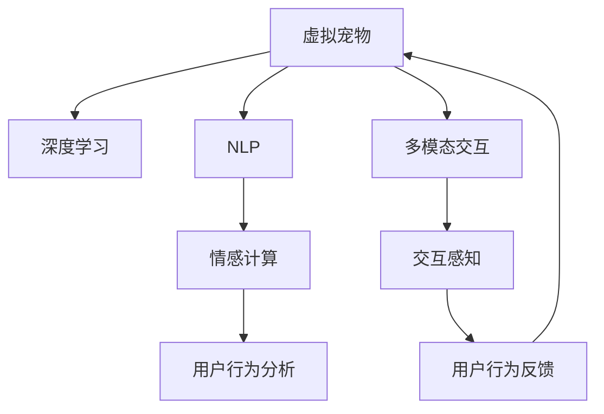

                 

# 元宇宙中的虚拟宠物:情感陪伴的新形式

## 1. 背景介绍

### 1.1 问题由来

随着元宇宙技术的兴起，虚拟世界日益成为现实生活的重要补充。在虚拟世界中，人们不仅可以沉浸于丰富的社交互动和游戏体验，还可以获得更多的情感陪伴和心理支持。虚拟宠物因其具备高互动性和情感化特征，成为元宇宙中不可或缺的元素之一。

传统虚拟宠物多基于简单的交互逻辑和表现形式，难以提供深度情感交流和陪伴体验。基于人工智能和大数据技术的虚拟宠物，能够通过深度学习、自然语言处理和情感计算等手段，实现更丰富的交互和陪伴功能。本文旨在介绍虚拟宠物在元宇宙中的最新进展，探讨其背后的核心技术和应用前景。

### 1.2 问题核心关键点

虚拟宠物的核心技术主要涉及以下关键点：

1. **深度学习：**利用神经网络进行训练，使虚拟宠物具备类似人类的感知和决策能力。
2. **自然语言处理：**通过语言模型理解用户的指令，并生成自然流畅的回应。
3. **情感计算：**分析用户的情感状态，实现情感识别和反馈，提升陪伴效果。
4. **用户行为分析：**通过数据分析和行为建模，个性化定制虚拟宠物的互动策略。
5. **多模态交互：**融合视觉、听觉和触觉等多种感官体验，增强虚拟宠物的沉浸感。

### 1.3 问题研究意义

虚拟宠物技术在元宇宙中的应用，不仅能够提升用户体验和参与度，还能为人们提供心理支持和情感陪伴，具有重要的社会和心理价值。研究虚拟宠物的实现方法和应用场景，对于推动元宇宙技术的普及和应用，具有重要意义：

1. **提升用户体验：**通过个性化和智能化的互动，使虚拟宠物成为元宇宙中吸引用户的重要因素。
2. **促进心理互动：**虚拟宠物能够提供持续的情感陪伴，缓解现实生活中的孤独感和压力。
3. **推动产业发展：**虚拟宠物技术有助于拓展元宇宙的应用场景，催生新兴产业。
4. **增强社交功能：**虚拟宠物可以作为社交媒体的延伸，提升人们的社交体验和互动频次。
5. **支持教育和培训：**虚拟宠物在虚拟教育中扮演重要角色，提供互动式学习平台。

## 2. 核心概念与联系

### 2.1 核心概念概述

为更好地理解虚拟宠物在元宇宙中的应用，本节将介绍几个密切相关的核心概念：

- **虚拟宠物：**指在虚拟世界中具有独立人格和互动能力的AI角色。虚拟宠物通常具备感知能力、情感表达和语言互动功能。
- **深度学习：**通过多层神经网络模型进行数据特征提取和模式识别，训练模型具备自主学习能力和决策能力。
- **自然语言处理(NLP)：**使机器能够理解、处理和生成自然语言，实现人机交互的自然流畅。
- **情感计算：**通过生理信号和语言分析，识别用户的情感状态，并根据情感状态生成相应的回应。
- **用户行为分析：**利用数据分析和建模技术，理解用户的行为模式，定制虚拟宠物的互动策略。
- **多模态交互：**通过结合视觉、听觉、触觉等多种感官输入，提升虚拟宠物的沉浸感和用户体验。

这些概念共同构成了虚拟宠物的核心技术框架，使得虚拟宠物能够在元宇宙中实现复杂的交互和陪伴功能。

### 2.2 核心概念原理和架构的 Mermaid 流程图



这个流程图展示了虚拟宠物的核心概念及其之间的联系：

1. 虚拟宠物通过深度学习进行训练，具备感知和决策能力。
2. 利用自然语言处理，理解用户的指令并生成回应。
3. 情感计算分析用户的情感状态，提升陪伴效果。
4. 用户行为分析定制虚拟宠物的互动策略。
5. 多模态交互增强沉浸感，提升用户体验。
6. 交互感知和用户行为反馈不断优化模型，形成闭环。

## 3. 核心算法原理 & 具体操作步骤
### 3.1 算法原理概述

虚拟宠物的核心算法基于深度学习、自然语言处理和情感计算等技术。其核心思想是通过多层神经网络进行自主学习，通过语言模型实现自然流畅的对话，通过情感分析提供深度情感交流。

形式化地，假设虚拟宠物的深度学习模型为 $M_{\theta}$，其中 $\theta$ 为模型参数。给定用户指令 $I$，虚拟宠物的输出为 $O$。则虚拟宠物的目标是最小化损失函数 $L$：

$$
L = \min_{\theta} |O - I|
$$

在自然语言处理中，使用基于Transformer的模型，如GPT-3或BERT，来实现语言理解与生成。情感计算则通过分析用户语音、面部表情等生理信号和文本情感信息，使用情感分类器实现情感识别。用户行为分析则通过收集用户的历史交互数据，构建行为模型，定制虚拟宠物的互动策略。

### 3.2 算法步骤详解

虚拟宠物的实现主要包括以下几个关键步骤：

**Step 1: 准备数据集**
- 收集虚拟宠物与用户交互的历史数据，包括语音、文本和生理信号等。
- 对数据进行预处理，清洗噪声，标注情感标签，进行特征工程。

**Step 2: 模型训练**
- 构建深度学习模型，使用收集到的数据进行训练，优化模型参数。
- 引入情感分类器，进行情感分析，识别用户的情感状态。
- 利用用户行为数据，训练行为模型，定制虚拟宠物的互动策略。

**Step 3: 交互反馈**
- 根据用户的指令和情感状态，虚拟宠物生成回应。
- 通过用户反馈不断优化模型，提升互动效果。

**Step 4: 持续学习**
- 根据新的交互数据，定期更新模型参数，保持虚拟宠物的适应性。
- 引入迁移学习，使虚拟宠物在多个虚拟场景中保持稳定表现。

### 3.3 算法优缺点

虚拟宠物技术的优点在于：

1. **高度互动性：**通过深度学习和自然语言处理，虚拟宠物能够与用户进行深度互动，提供个性化的陪伴。
2. **情感化陪伴：**情感计算使得虚拟宠物具备情感识别和反馈能力，能够提供心理支持。
3. **多模态体验：**多模态交互技术结合视觉、听觉和触觉等多感官，提升虚拟宠物的沉浸感和用户体验。

然而，虚拟宠物技术也存在以下缺点：

1. **高资源消耗：**深度学习和多模态交互需要大量的计算资源和存储资源。
2. **复杂性高：**虚拟宠物的开发和维护需要高度专业的技术团队。
3. **隐私风险：**用户数据隐私和安全是虚拟宠物技术的一大挑战。

### 3.4 算法应用领域

虚拟宠物技术可以应用于多种领域，包括但不限于：

- **元宇宙社交：**在虚拟世界中进行社交互动，提供深度情感陪伴。
- **虚拟教育：**通过虚拟宠物辅助学生学习，提供互动式教育平台。
- **心理健康：**为孤独、焦虑等心理问题提供情感支持，缓解心理压力。
- **虚拟旅游：**通过虚拟宠物引导用户游览虚拟世界，提升旅游体验。
- **虚拟助手：**在虚拟世界中担任助手角色，提供个性化服务。

## 4. 数学模型和公式 & 详细讲解 & 举例说明

### 4.1 数学模型构建

虚拟宠物的核心模型基于深度学习，这里以GPT-3为例进行数学模型的构建。

假设用户指令为 $I$，虚拟宠物的输出为 $O$。则虚拟宠物的目标是最小化损失函数 $L$：

$$
L = \min_{\theta} |O - I|
$$

其中 $\theta$ 为模型参数，$I$ 为用户指令，$O$ 为虚拟宠物的输出。假设使用基于Transformer的模型，其输出层为线性分类器，则输出 $O$ 可以表示为：

$$
O = \text{softmax}(W_O X + b_O)
$$

其中 $W_O$ 为权重矩阵，$b_O$ 为偏置向量，$X$ 为模型输入，$\text{softmax}$ 函数将输出映射到概率分布上。

### 4.2 公式推导过程

以GPT-3为例，虚拟宠物的训练过程包括自监督预训练和监督微调两个阶段。

**自监督预训练：**在无标签数据上使用语言建模任务进行预训练，学习通用的语言表示。假设预训练数据集为 $D_{pre}$，则预训练的目标函数为：

$$
L_{pre} = -\frac{1}{N}\sum_{x_i \in D_{pre}} \log p(x_i)
$$

其中 $p(x_i)$ 为模型在数据 $x_i$ 上的概率分布，$N$ 为预训练数据集大小。

**监督微调：**在标注数据上使用任务特定的监督学习任务进行微调，优化模型在特定任务上的表现。假设微调数据集为 $D_{fin}$，则微调的目标函数为：

$$
L_{fin} = -\frac{1}{N}\sum_{(x_i, y_i) \in D_{fin}} \log p(y_i|x_i)
$$

其中 $p(y_i|x_i)$ 为模型在输入 $x_i$ 上的条件概率分布，$y_i$ 为任务标签。

### 4.3 案例分析与讲解

以一个简单的虚拟宠物聊天场景为例，介绍虚拟宠物的核心实现过程：

- **用户指令输入：**用户向虚拟宠物发送一条指令，例如 "Hello"。
- **语言模型理解：**虚拟宠物通过语言模型分析指令，理解用户的意图。
- **情感分析：**通过情感分类器分析用户的情感状态，识别出是开心还是不开心。
- **生成回应：**根据用户的指令和情感状态，生成合适的回应，例如 "Nice to meet you!"。
- **用户反馈：**用户对回应进行反馈，虚拟宠物根据反馈调整模型参数。

这个过程可以通过以下Python代码实现：

```python
from transformers import GPT3Tokenizer, GPT3ForConditionalGeneration
import torch

tokenizer = GPT3Tokenizer.from_pretrained('gpt3')
model = GPT3ForConditionalGeneration.from_pretrained('gpt3')

user_input = "Hello"
inputs = tokenizer(user_input, return_tensors='pt')

with torch.no_grad():
    outputs = model.generate(inputs['input_ids'], max_length=50, num_return_sequences=1)
    response = tokenizer.decode(outputs[0])

print(response)
```

可以看到，使用Transformer库可以非常方便地实现虚拟宠物的对话功能。

## 5. 项目实践：代码实例和详细解释说明
### 5.1 开发环境搭建

在进行虚拟宠物开发前，需要准备好开发环境。以下是使用Python进行PyTorch开发的环境配置流程：

1. 安装Anaconda：从官网下载并安装Anaconda，用于创建独立的Python环境。

2. 创建并激活虚拟环境：
```bash
conda create -n virtual_pet python=3.8 
conda activate virtual_pet
```

3. 安装PyTorch：根据CUDA版本，从官网获取对应的安装命令。例如：
```bash
conda install pytorch torchvision torchaudio cudatoolkit=11.1 -c pytorch -c conda-forge
```

4. 安装必要的库：
```bash
pip install transformers numpy pandas scikit-learn
```

完成上述步骤后，即可在`virtual_pet`环境中开始虚拟宠物的开发。

### 5.2 源代码详细实现

以下是一个简单的虚拟宠物聊天系统的Python代码实现：

```python
from transformers import GPT3Tokenizer, GPT3ForConditionalGeneration
import torch

# 加载模型和分词器
tokenizer = GPT3Tokenizer.from_pretrained('gpt3')
model = GPT3ForConditionalGeneration.from_pretrained('gpt3')

# 用户输入指令
user_input = input("You: ")

# 对用户输入进行分词和编码
inputs = tokenizer(user_input, return_tensors='pt')

# 生成回应
with torch.no_grad():
    outputs = model.generate(inputs['input_ids'], max_length=50, num_return_sequences=1)
    response = tokenizer.decode(outputs[0])

# 输出虚拟宠物的回应
print(f"Pet: {response}")
```

### 5.3 代码解读与分析

让我们再详细解读一下关键代码的实现细节：

**GPT3Tokenizer类**：
- `from_pretrained`方法：加载预训练好的GPT-3模型和分词器。
- `tokenizer`对象：用于将用户输入分词并编码为模型接受的格式。

**GPT3ForConditionalGeneration类**：
- `generate`方法：使用GPT-3模型生成回应，`max_length`参数控制生成文本的最大长度，`num_return_sequences`参数控制生成回应的数量。

**用户输入处理**：
- `input`函数：获取用户输入。
- `tokenizer`对象的`tokenizer`方法：将用户输入分词并编码为模型接受的格式。

**模型生成回应**：
- `model`对象的`generate`方法：使用GPT-3模型生成回应。
- `outputs`：生成回应的中间输出结果。
- `tokenizer`对象的`decode`方法：将模型生成的回应解码为可读的文本。

**回应输出**：
- 将虚拟宠物的回应输出到控制台。

这个过程展示了使用GPT-3模型实现虚拟宠物的基本步骤，包括用户输入、模型生成回应和回应输出。

## 6. 实际应用场景
### 6.1 社交互动

虚拟宠物可以在元宇宙中进行社交互动，为用户提供深度情感陪伴。例如，在虚拟世界中，用户可以与虚拟宠物进行对话、玩游戏、参加活动等，体验丰富的社交体验。虚拟宠物能够根据用户的情感状态进行适当的回应，提供情感支持。

### 6.2 教育学习

虚拟宠物可以作为教育辅助工具，帮助学生更好地学习。例如，在虚拟课堂中，虚拟宠物可以引导学生进行课程学习、回答问题、提供课后辅导等，提升学习效果。

### 6.3 心理健康

虚拟宠物可以为用户提供心理健康支持，缓解孤独、焦虑等负面情绪。例如，通过与虚拟宠物进行对话，用户可以获得心理慰藉和情感支持，提升心理健康水平。

### 6.4 娱乐休闲

虚拟宠物还可以应用于虚拟游戏、虚拟旅游等娱乐场景，提升用户体验。例如，在虚拟旅游中，虚拟宠物可以作为导游，提供导航和解说服务，增加旅游乐趣。

### 6.5 商业应用

虚拟宠物可以应用于虚拟商店、虚拟客服等商业场景，提升用户满意度。例如，虚拟宠物可以作为虚拟客服，提供个性化服务，提升用户体验。

## 7. 工具和资源推荐
### 7.1 学习资源推荐

为了帮助开发者系统掌握虚拟宠物的核心技术，这里推荐一些优质的学习资源：

1. **《深度学习入门》系列书籍**：由大模型技术专家撰写，深入浅出地介绍了深度学习的基础知识和实际应用。
2. **《自然语言处理综论》书籍**：全面介绍了自然语言处理的基本概念和前沿技术，包括语言模型、情感计算等。
3. **Coursera《深度学习》课程**：斯坦福大学开设的深度学习课程，涵盖深度学习的基础理论和应用实践。
4. **HuggingFace官方文档**：Transformer库的官方文档，提供了丰富的预训练模型和微调样例代码，是上手实践的必备资料。
5. **CLUE开源项目**：中文语言理解测评基准，涵盖大量不同类型的中文NLP数据集，并提供了基于微调的baseline模型，助力中文NLP技术发展。

通过对这些资源的学习实践，相信你一定能够快速掌握虚拟宠物的核心技术，并用于解决实际的NLP问题。

### 7.2 开发工具推荐

高效的开发离不开优秀的工具支持。以下是几款用于虚拟宠物开发的常用工具：

1. **PyTorch**：基于Python的开源深度学习框架，灵活动态的计算图，适合快速迭代研究。大部分预训练语言模型都有PyTorch版本的实现。
2. **TensorFlow**：由Google主导开发的开源深度学习框架，生产部署方便，适合大规模工程应用。同样有丰富的预训练语言模型资源。
3. **Transformers库**：HuggingFace开发的NLP工具库，集成了众多SOTA语言模型，支持PyTorch和TensorFlow，是进行虚拟宠物开发的利器。
4. **Weights & Biases**：模型训练的实验跟踪工具，可以记录和可视化模型训练过程中的各项指标，方便对比和调优。与主流深度学习框架无缝集成。
5. **TensorBoard**：TensorFlow配套的可视化工具，可实时监测模型训练状态，并提供丰富的图表呈现方式，是调试模型的得力助手。

合理利用这些工具，可以显著提升虚拟宠物的开发效率，加快创新迭代的步伐。

### 7.3 相关论文推荐

虚拟宠物技术的发展源于学界的持续研究。以下是几篇奠基性的相关论文，推荐阅读：

1. **《Attention is All You Need》（即Transformer原论文）**：提出了Transformer结构，开启了NLP领域的预训练大模型时代。
2. **《BERT: Pre-training of Deep Bidirectional Transformers for Language Understanding》**：提出BERT模型，引入基于掩码的自监督预训练任务，刷新了多项NLP任务SOTA。
3. **《Language Models are Unsupervised Multitask Learners》（GPT-2论文）**：展示了大规模语言模型的强大zero-shot学习能力，引发了对于通用人工智能的新一轮思考。
4. **《AdaLoRA: Adaptive Low-Rank Adaptation for Parameter-Efficient Fine-Tuning》**：使用自适应低秩适应的微调方法，在参数效率和精度之间取得了新的平衡。
5. **《Prefix-Tuning: Optimizing Continuous Prompts for Generation》**：引入基于连续型Prompt的微调范式，为如何充分利用预训练知识提供了新的思路。

这些论文代表了大语言模型微调技术的发展脉络。通过学习这些前沿成果，可以帮助研究者把握学科前进方向，激发更多的创新灵感。

## 8. 总结：未来发展趋势与挑战
### 8.1 总结

本文对虚拟宠物在元宇宙中的应用进行了全面系统的介绍。首先阐述了虚拟宠物技术的研究背景和意义，明确了虚拟宠物在元宇宙中的独特价值。其次，从原理到实践，详细讲解了虚拟宠物的核心算法和实现步骤，给出了虚拟宠物开发和应用的具体代码实例。同时，本文还广泛探讨了虚拟宠物在社交、教育、心理健康、娱乐等多个领域的应用前景，展示了虚拟宠物技术的广泛应用潜力。此外，本文精选了虚拟宠物技术的各类学习资源，力求为读者提供全方位的技术指引。

通过本文的系统梳理，可以看到，虚拟宠物技术在元宇宙中的应用前景广阔，不仅能够提升用户体验，还能提供心理支持和情感陪伴。研究虚拟宠物的实现方法和应用场景，对于推动元宇宙技术的普及和应用，具有重要意义。

### 8.2 未来发展趋势

展望未来，虚拟宠物技术将呈现以下几个发展趋势：

1. **深度学习的不断进步**：深度学习模型的性能和效率不断提升，将使虚拟宠物更加智能和高效。
2. **多模态交互的普及**：通过结合视觉、听觉、触觉等多种感官输入，提升虚拟宠物的沉浸感和用户体验。
3. **个性化定制**：通过数据分析和建模技术，为每个用户定制个性化的虚拟宠物，提升陪伴效果。
4. **跨领域应用**：虚拟宠物不仅在社交、教育、心理健康等领域有广泛应用，还可以拓展到商业、旅游等多个领域。
5. **情感计算的增强**：通过更先进的情感识别和反馈技术，提供更加精准的情感支持。

以上趋势凸显了虚拟宠物技术的广阔前景。这些方向的探索发展，必将进一步提升虚拟宠物的性能和应用范围，为元宇宙用户提供更好的陪伴体验。

### 8.3 面临的挑战

尽管虚拟宠物技术已经取得了瞩目成就，但在迈向更加智能化、普适化应用的过程中，它仍面临着诸多挑战：

1. **高资源消耗**：深度学习和多模态交互需要大量的计算资源和存储资源。
2. **复杂性高**：虚拟宠物的开发和维护需要高度专业的技术团队。
3. **隐私风险**：用户数据隐私和安全是虚拟宠物技术的一大挑战。
4. **模型鲁棒性不足**：当前虚拟宠物模型面对域外数据时，泛化性能往往大打折扣。
5. **可解释性不足**：虚拟宠物的决策过程难以解释，难以对其行为进行分析和调试。

正视虚拟宠物面临的这些挑战，积极应对并寻求突破，将是大模型微调走向成熟的必由之路。

### 8.4 研究展望

面对虚拟宠物面临的种种挑战，未来的研究需要在以下几个方面寻求新的突破：

1. **优化资源消耗**：开发更加高效的模型结构和算法，减少计算资源和存储资源的消耗。
2. **提升可解释性**：引入可解释性技术，增强虚拟宠物的行为解释能力，提高用户信任度。
3. **增强模型鲁棒性**：通过鲁棒性增强技术，提高虚拟宠物在不同场景中的适应能力。
4. **多模态融合**：结合视觉、听觉、触觉等多种感官输入，提升虚拟宠物的沉浸感和用户体验。
5. **跨领域应用**：将虚拟宠物技术应用于更多垂直领域，提升应用场景的多样性和实用性。

这些研究方向将引领虚拟宠物技术迈向更高的台阶，为元宇宙用户提供更加丰富、智能和沉浸的陪伴体验。

## 9. 附录：常见问题与解答

**Q1: 虚拟宠物的深度学习模型如何选择？**

A: 虚拟宠物的深度学习模型可以根据应用场景进行选择。例如，对于需要生成自然流畅对话的任务，可以选择基于Transformer的模型，如GPT-3或BERT；对于需要图像识别或视觉感知的任务，可以选择基于卷积神经网络（CNN）的模型，如ResNet或Inception。

**Q2: 虚拟宠物的多模态交互如何实现？**

A: 虚拟宠物的多模态交互可以通过结合视觉、听觉和触觉等多种感官输入来实现。例如，通过摄像头捕捉用户面部表情和身体动作，结合语音识别和触觉传感器，可以实现更丰富的交互体验。

**Q3: 虚拟宠物的情感计算如何进行？**

A: 虚拟宠物的情感计算可以通过分析用户的语音、面部表情等生理信号和文本情感信息来实现。例如，使用情感分类器对用户情感状态进行分类，并根据情感状态生成相应的回应。

**Q4: 虚拟宠物的个性化定制如何实现？**

A: 虚拟宠物的个性化定制可以通过数据分析和建模技术实现。例如，收集用户的历史交互数据，构建行为模型，定制虚拟宠物的互动策略，提升陪伴效果。

**Q5: 虚拟宠物的开发和维护需要哪些专业技能？**

A: 虚拟宠物的开发和维护需要以下专业技能：深度学习、自然语言处理、情感计算、用户行为分析、多模态交互等。此外，还需要具备软件工程、系统设计、用户体验设计等综合技能。

**Q6: 虚拟宠物的隐私保护如何实现？**

A: 虚拟宠物的隐私保护可以通过数据匿名化、加密存储、访问控制等措施实现。例如，使用差分隐私技术对用户数据进行匿名化处理，确保用户隐私安全。

这些问题的解答可以帮助读者更好地理解虚拟宠物的核心技术和应用场景，为开发和应用虚拟宠物提供参考。

---

作者：禅与计算机程序设计艺术 / Zen and the Art of Computer Programming

