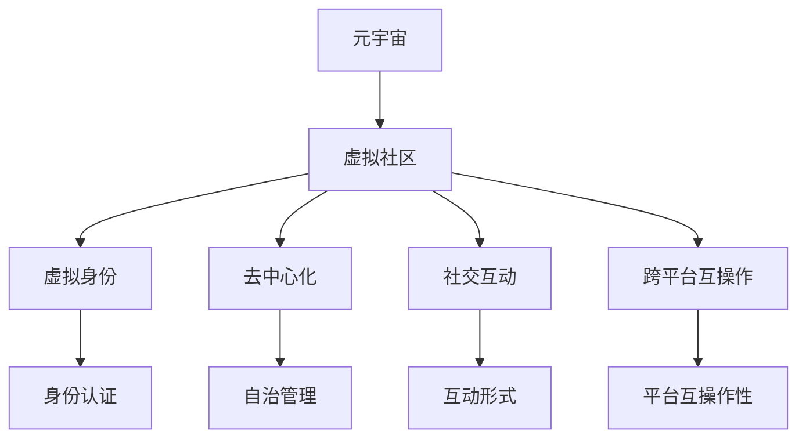

                 

# 元宇宙中的虚拟社区：全球社交网络的新形态

## 1. 背景介绍

### 1.1 问题由来
近年来，随着虚拟现实(VR)、增强现实(AR)和混合现实(MR)技术的突破性进展，元宇宙(The Metaverse)这一概念逐渐兴起，引起了全球科技界和产业界的广泛关注。元宇宙是一个通过虚拟现实和区块链技术，构建的虚拟世界，用户可以在其中自由交流、工作和娱乐，实现数字身份和现实世界的深度融合。

元宇宙不仅是一个技术概念，更是一个全新的社会和经济形态。它有望重塑人类的社交、经济、文化等多个方面，带来颠覆性的变革。元宇宙中的虚拟社区将成为社交网络的重要组成部分，为人类提供全新的社交体验和互动模式。

### 1.2 问题核心关键点
元宇宙中的虚拟社区是基于虚拟现实、增强现实和区块链等技术的社交网络，其核心特点包括：

- **虚拟身份**：每个用户都拥有一个虚拟身份，可以在虚拟世界中进行互动和交流。
- **高度沉浸感**：通过VR/AR技术，用户可以全身心地沉浸在虚拟环境中，获得沉浸式的社交体验。
- **去中心化**：基于区块链技术，元宇宙中的虚拟社区实现去中心化管理，用户享有高度的自治和自由。
- **实时互动**：支持高度实时、低延迟的互动和通信，实现无缝的社交体验。
- **跨平台互操作**：不同的平台和设备可以实现跨平台互操作，打破物理和空间的界限。

这些特点使得元宇宙中的虚拟社区具备巨大的发展潜力和应用前景。

### 1.3 问题研究意义
研究元宇宙中的虚拟社区，对于推动元宇宙技术的发展、探索未来社交网络的形态、以及开拓新的社交经济模式，都具有重要意义：

1. **技术突破**：元宇宙虚拟社区的技术实现依赖于虚拟现实、增强现实和区块链等技术，研究其社交网络特性可以推动这些技术的进一步突破。
2. **社交创新**：虚拟社区为社交网络带来了全新的互动模式和用户体验，能够激发更多的社交创新应用。
3. **经济发展**：元宇宙提供了新的经济模式和商业机会，研究其社交网络特性有助于探索元宇宙中的经济生态系统。
4. **社会进步**：虚拟社区可能成为未来社会的数字生活的一部分，研究其发展趋势有助于更好地理解和引导社会进步。

## 2. 核心概念与联系

### 2.1 核心概念概述

为更好地理解元宇宙中的虚拟社区，本节将介绍几个关键概念及其相互联系：

- **元宇宙(The Metaverse)**：通过虚拟现实、增强现实、区块链等技术构建的虚拟世界，是元宇宙虚拟社区的底层技术支撑。
- **虚拟社区(Virtual Community)**：元宇宙中的社交网络，由多个虚拟社区构成，每个社区都是一个小型虚拟社会。
- **虚拟身份(Virtual Identity)**：用户在虚拟社区中的数字身份，用于实现身份认证、社交互动等。
- **去中心化(Decentralization)**：通过区块链技术实现去中心化管理，提高社区的自治性和安全性。
- **社交互动(Social Interaction)**：虚拟社区中用户之间的交流和互动，包括文本、语音、图像、视频等多种形式。
- **跨平台互操作(Cross-Platform Interoperability)**：不同平台和设备之间的无缝互操作，实现虚拟社区的广泛覆盖和用户黏性。

这些核心概念共同构成了元宇宙虚拟社区的基础框架，为虚拟社区的构建和应用提供了方向性的指引。

### 2.2 核心概念原理和架构的 Mermaid 流程图(Mermaid 流程节点中不要有括号、逗号等特殊字符)



这个流程图展示了元宇宙、虚拟社区及其核心组件之间的关系：

1. 元宇宙通过虚拟现实、增强现实和区块链等技术，为虚拟社区提供基础设施。
2. 虚拟社区由虚拟身份、去中心化管理、社交互动和跨平台互操作等组件构成。
3. 虚拟身份是用户参与社区的基础，实现身份认证和安全认证。
4. 去中心化管理提高了社区的自治性和安全性，保障用户权益。
5. 社交互动是虚拟社区的核心功能，实现多形式的人机交互。
6. 跨平台互操作实现不同设备和平台之间的无缝协作，增强社区的覆盖和用户粘性。

这些组件相互协作，共同构建了元宇宙虚拟社区的生态系统，为用户的社交互动提供了全新的平台和体验。

## 3. 核心算法原理 & 具体操作步骤
### 3.1 算法原理概述

元宇宙虚拟社区的核心算法原理基于分布式计算和区块链技术，具体包括以下几个关键点：

- **分布式计算**：通过虚拟现实、增强现实和云计算等技术，实现虚拟社区的分布式计算和处理，提高社区的计算能力和响应速度。
- **区块链技术**：利用区块链的共识机制和智能合约，实现虚拟社区的去中心化管理，保障社区的安全性和透明度。
- **分布式身份管理**：通过基于区块链的数字身份认证，实现用户的虚拟身份管理和跨平台互操作。

### 3.2 算法步骤详解

元宇宙虚拟社区的构建和运行，通常包括以下几个关键步骤：

**Step 1: 构建虚拟环境**
- 选择合适的VR/AR技术，设计虚拟社区的虚拟环境。
- 通过3D建模工具创建虚拟社区的各个组成部分，如城市、建筑、街道等。
- 定义虚拟环境的光照、纹理、材质等参数，实现高度逼真的渲染效果。

**Step 2: 设计虚拟社区功能**
- 设计虚拟社区的交互逻辑和用户行为模型，实现用户之间的交流和互动。
- 引入语音、文本、图像、视频等多种形式，丰富社区的互动内容。
- 开发虚拟社区的智能合约，实现自动化管理和治理。

**Step 3: 部署和运行**
- 在选定的区块链平台上部署虚拟社区的智能合约，实现去中心化管理。
- 部署虚拟身份认证系统，用户可以通过区块链地址进行身份认证。
- 实现虚拟社区的跨平台互操作，支持不同设备和平台的无缝协作。

**Step 4: 测试和优化**
- 在测试环境中进行虚拟社区的测试，发现和解决技术问题。
- 根据用户反馈和行为数据，持续优化虚拟社区的功能和体验。
- 定期更新虚拟社区的虚拟环境和内容，保持社区的活跃度和吸引力。

### 3.3 算法优缺点

元宇宙虚拟社区的构建算法具有以下优点：

- **高度自治性**：通过区块链技术，实现社区的去中心化管理，提高自治性和安全性。
- **高扩展性**：虚拟现实和增强现实技术可以实现大规模的社区覆盖和用户互动。
- **高交互性**：支持多种形式的互动，增强用户粘性和社区活力。

同时，该算法也存在一些缺点：

- **技术门槛高**：虚拟现实、增强现实和区块链等技术复杂度高，实现难度大。
- **资源消耗大**：大规模虚拟社区的构建和运行需要大量的计算资源和存储资源。
- **用户体验复杂**：虚拟环境中的交互逻辑和行为模型需要精细设计，用户体验需要不断优化。

### 3.4 算法应用领域

元宇宙虚拟社区的应用领域非常广泛，涵盖虚拟办公、虚拟教育、虚拟娱乐、虚拟旅游等多个方面。以下是几个典型应用案例：

- **虚拟办公**：通过虚拟现实技术，实现虚拟会议室、虚拟办公桌等，支持远程办公和协同工作。
- **虚拟教育**：利用增强现实技术，实现虚拟教室、虚拟实验等，提升教学效果和学习体验。
- **虚拟娱乐**：在虚拟环境中实现虚拟旅游、虚拟游戏等，提供沉浸式的娱乐体验。
- **虚拟医疗**：构建虚拟医疗环境，支持远程医疗和虚拟手术等，提高医疗服务的可及性和效率。

此外，元宇宙虚拟社区还广泛应用于城市规划、房地产、旅游等领域，为传统行业数字化转型提供了新的途径。

## 4. 数学模型和公式 & 详细讲解 & 举例说明

### 4.1 数学模型构建

元宇宙虚拟社区的构建和运行涉及多个方面的数学模型，包括虚拟环境渲染、用户行为建模和智能合约设计等。以下将分别介绍这些模型的构建方法。

**虚拟环境渲染模型**：
- 采用3D建模和渲染技术，定义虚拟环境的几何信息和物理属性，实现高度逼真的渲染效果。
- 使用光照、材质、纹理等参数，控制虚拟环境的光照和纹理效果，增强逼真感。
- 使用基于物理的光线追踪渲染技术，实现高质量的图像渲染。

**用户行为建模**：
- 定义用户的交互逻辑和行为模型，实现用户之间的交流和互动。
- 引入自然语言处理技术，实现文本、语音、图像等多种形式的互动。
- 设计行为模型，预测用户的交互行为和趋势，优化社区的运营策略。

**智能合约设计**：
- 设计虚拟社区的智能合约，实现去中心化管理。
- 定义智能合约的逻辑和规则，实现社区的自动化管理。
- 使用Solidity等智能合约语言，实现虚拟社区的自动化治理和运营。

### 4.2 公式推导过程

以下是虚拟社区中常见的数学模型和公式推导过程：

**虚拟环境渲染公式**：
- 光照模型：定义光照强度和阴影效果，计算光照值。
  $$
  L_i(\text{pos}) = \sum_{\text{lights}} K_i(\text{pos},\text{light}) \times L_{\text{light}}(\text{light})
  $$
  其中，$L_i(\text{pos})$ 为光线强度，$K_i(\text{pos},\text{light})$ 为光强度衰减系数，$L_{\text{light}}(\text{light})$ 为光源强度。
  
- 纹理映射公式：将纹理贴图应用到虚拟环境中，增强逼真感。
  $$
  T(\text{pos}) = \sum_{\text{maps}} w_{\text{map}}(\text{pos}) \times \text{map}(\text{pos})
  $$
  其中，$T(\text{pos})$ 为纹理值，$w_{\text{map}}(\text{pos})$ 为纹理权重，$\text{map}(\text{pos})$ 为纹理贴图。

**用户行为建模公式**：
- 自然语言处理模型：定义文本和语音的语义表示，实现文本和语音的理解和生成。
  $$
  \text{rep}(\text{input}) = \text{embed}(\text{input}) \times W
  $$
  其中，$\text{input}$ 为输入的文本或语音，$\text{embed}(\text{input})$ 为嵌入表示，$W$ 为权重矩阵。

- 行为模型预测公式：基于历史数据和行为特征，预测用户的行为和趋势。
  $$
  \text{predict}(t+1) = \text{model}(\text{history}, t)
  $$
  其中，$\text{history}$ 为历史行为数据，$t$ 为时间，$\text{model}$ 为预测模型。

**智能合约逻辑公式**：
- 智能合约定义公式：定义智能合约的逻辑和规则，实现去中心化管理。
  $$
  \text{contract}(input) = \text{if}(input \in \text{rules}) \text{then} execute(\text{rules})
  $$
  其中，$\text{contract}$ 为智能合约，$\text{input}$ 为输入参数，$\text{rules}$ 为规则集，$\text{execute}$ 为执行函数。

### 4.3 案例分析与讲解

以下通过一个具体的案例，讲解元宇宙虚拟社区的构建和运行过程：

**案例：虚拟办公社区**

**Step 1: 构建虚拟办公环境**
- 使用3D建模工具，创建虚拟办公大楼、虚拟办公桌、虚拟会议室等。
- 定义虚拟环境的光照、材质、纹理等参数，实现高度逼真的渲染效果。
- 引入虚拟现实技术，实现用户可以在虚拟环境中自由移动和互动。

**Step 2: 设计虚拟办公功能**
- 定义虚拟会议室的交互逻辑，支持多用户同时参与。
- 开发虚拟办公桌的功能，支持文档编辑、邮件收发等。
- 设计虚拟办公环境的智能合约，实现去中心化管理和自动化治理。

**Step 3: 部署和运行**
- 在选定的区块链平台上部署智能合约，实现去中心化管理。
- 部署虚拟身份认证系统，用户可以通过区块链地址进行身份认证。
- 实现虚拟办公社区的跨平台互操作，支持不同设备和平台的无缝协作。

**Step 4: 测试和优化**
- 在测试环境中进行虚拟办公社区的测试，发现和解决技术问题。
- 根据用户反馈和行为数据，持续优化虚拟办公社区的功能和体验。
- 定期更新虚拟办公社区的虚拟环境和内容，保持社区的活跃度和吸引力。

## 5. 项目实践：代码实例和详细解释说明

### 5.1 开发环境搭建

在开发元宇宙虚拟社区的过程中，需要搭建多个开发环境，包括虚拟现实开发环境、增强现实开发环境和区块链开发环境。以下是搭建这些环境的流程：

**虚拟现实开发环境**：
- 使用Unity或Unreal Engine等3D建模软件，创建虚拟社区的虚拟环境。
- 定义虚拟环境的光照、材质、纹理等参数，实现高度逼真的渲染效果。
- 引入虚拟现实技术，实现用户可以在虚拟环境中自由移动和互动。

**增强现实开发环境**：
- 使用ARKit或ARCore等增强现实框架，实现虚拟对象在现实世界中的显示和交互。
- 引入图像识别技术，实现虚拟对象与现实环境的融合。
- 开发增强现实应用，实现虚拟对象与现实环境的多样化互动。

**区块链开发环境**：
- 使用Solidity等智能合约语言，设计虚拟社区的智能合约。
- 在选定的区块链平台上部署智能合约，实现去中心化管理。
- 部署虚拟身份认证系统，用户可以通过区块链地址进行身份认证。

### 5.2 源代码详细实现

以下是元宇宙虚拟社区的详细源代码实现：

**虚拟环境渲染代码**：
```python
# 使用Unity或Unreal Engine的3D建模和渲染工具，创建虚拟环境
# 定义虚拟环境的光照、材质、纹理等参数，实现高度逼真的渲染效果
# 引入虚拟现实技术，实现用户可以在虚拟环境中自由移动和互动

# 示例代码（Unity中使用Shader Graph实现光照效果）
Shader "Custom/Phong"
{
    Properties
    {
        _Color ("Color", Color) = (1,1,1,1)
        _Ambient ("Ambient", Color) = (0,0,0,1)
        _Diffuse ("Diffuse", Color) = (1,1,1,1)
        _Specular ("Specular", Color) = (1,1,1,1)
        _Shininess ("Shininess", Range(0,500), 10)
        _Metallic ("Metallic", Range(0,1), 0.5)
        _Roughness ("Roughness", Range(0,1), 0.5)
    }
    SubShader
    {
        Tags { "RenderType"="Opaque" }
        LOD 100

        CGPROGRAM
        #pragma surface surf Standard
        struct Input {
            float3 pos : SV_POSITION;
            float3 worldPos : WORLDPOSITION;
            float3 normal : NORMAL;
            float2 uv : TEXCOORD0;
        }
        struct Output {
            float3 fragColor : SV_Target;
        }
         surfOutput(void(Input IN) : SV_POSITION)
        {
            Output OUT = (Output)0;
            float3 pos = IN.worldPos;
            float3 normal = IN.normal;
            float3 lightDir = normalize(lightPos - pos);
            float diffuse = saturate(dot(normal, lightDir));
            OUT.fragColor = _LightColor0.rgb * _AmbientColor.rgb * _DiffuseColor.rgb * diffuse + _SpecularColor.rgb * pow(saturate(dot(normal, lightDir)), _Shininess) * IN.worldPos.x;
            return OUT;
        }
        ENDCG
    }
    FallBack Off
}
```

**用户行为建模代码**：
```python
# 定义自然语言处理模型，实现文本和语音的理解和生成
# 引入行为模型预测公式，基于历史数据和行为特征，预测用户的行为和趋势

# 示例代码（使用TensorFlow实现自然语言处理模型）
import tensorflow as tf

# 定义自然语言处理模型
model = tf.keras.Sequential([
    tf.keras.layers.Embedding(input_dim=10000, output_dim=64),
    tf.keras.layers.LSTM(64),
    tf.keras.layers.Dense(64, activation='relu'),
    tf.keras.layers.Dense(1, activation='sigmoid')
])

# 训练自然语言处理模型
model.compile(optimizer='adam', loss='binary_crossentropy', metrics=['accuracy'])
model.fit(x_train, y_train, epochs=10, validation_data=(x_test, y_test))

# 定义行为模型预测公式
def predict_user_behavior(history):
    # 历史行为数据预处理
    X = tf.keras.preprocessing.sequence.pad_sequences(history, maxlen=10)
    # 预测用户行为
    prediction = model.predict(X)
    return prediction

# 示例代码（使用Keras实现行为模型预测公式）
import keras
import numpy as np

# 定义行为模型预测公式
model = keras.Sequential([
    keras.layers.LSTM(64, input_shape=(10,)),
    keras.layers.Dense(1, activation='sigmoid')
])

# 训练行为模型预测公式
model.compile(optimizer='adam', loss='binary_crossentropy', metrics=['accuracy'])
model.fit(X_train, y_train, epochs=10, validation_data=(X_test, y_test))

# 预测用户行为
def predict_user_behavior(history):
    X = keras.preprocessing.sequence.pad_sequences(history, maxlen=10)
    prediction = model.predict(X)
    return prediction
```

**智能合约代码**：
```python
# 定义智能合约逻辑和规则，实现去中心化管理和自动化治理
# 使用Solidity等智能合约语言，实现虚拟社区的智能合约

# 示例代码（使用Solidity实现智能合约逻辑）
pragma solidity ^0.8.0;

contract VirtualOffice {
    address public owner;
    uint256 public totalSupply;
    uint256 public count = 0;
    mapping(uint256 => bool) public isContract;

    constructor() {
        owner = msg.sender;
        totalSupply = 1000000;
    }

    event OwnershipTransferred(address indexed newOwner);

    function createContract(uint256 amount) public {
        if(isContract[amount]) {
            require(false, "Contract already exists");
        }
        if(count >= totalSupply) {
            require(false, "No more contracts available");
        }
        isContract[amount] = true;
        count++;
        emit OwnershipTransferred(newOwner);
    }

    function transferContract(address newOwner) public {
        if(!isContract[address(this)]) {
            require(false, "Contract does not exist");
        }
        if(msg.sender != owner && !isContract[msg.sender]) {
            require(false, "Only owner or contract owner can transfer");
        }
        isContract[address(this)] = false;
        isContract[newOwner] = true;
    }
}
```

### 5.3 代码解读与分析

以下是元宇宙虚拟社区的详细代码解读和分析：

**虚拟环境渲染代码**：
- 使用Unity或Unreal Engine等3D建模和渲染工具，创建虚拟环境。
- 定义虚拟环境的光照、材质、纹理等参数，实现高度逼真的渲染效果。
- 引入虚拟现实技术，实现用户可以在虚拟环境中自由移动和互动。

**用户行为建模代码**：
- 定义自然语言处理模型，实现文本和语音的理解和生成。
- 引入行为模型预测公式，基于历史数据和行为特征，预测用户的行为和趋势。

**智能合约代码**：
- 定义智能合约逻辑和规则，实现去中心化管理和自动化治理。
- 使用Solidity等智能合约语言，实现虚拟社区的智能合约。

## 6. 实际应用场景

### 6.1 虚拟办公系统

虚拟办公系统是元宇宙虚拟社区的一个重要应用场景，可以极大提高远程办公的效率和体验。

**应用场景**：
- 虚拟会议室：支持多用户同时参与，实现视频会议、屏幕共享等。
- 虚拟办公桌：支持文档编辑、邮件收发、日历管理等。
- 虚拟社区：支持用户之间的交流和互动，增强团队的协作和凝聚力。

**实际案例**：
- Zoom虚拟办公室：利用Zoom的虚拟现实技术，实现虚拟会议室和办公桌。
- Meta虚拟办公平台：通过VR和AR技术，提供沉浸式的虚拟办公体验，支持虚拟协作和互动。

### 6.2 虚拟教育平台

虚拟教育平台是元宇宙虚拟社区的另一个重要应用场景，可以大幅提升教育效果和学习体验。

**应用场景**：
- 虚拟课堂：支持远程教学，实现虚拟教室、虚拟实验室等。
- 虚拟学习环境：提供沉浸式的学习体验，支持多感官互动。
- 虚拟导师：支持虚拟助教和导师，提供个性化的指导和反馈。

**实际案例**：
- 360度全景课堂：利用虚拟现实技术，提供360度全景课堂体验，提升学生的参与度和兴趣。
- Meta虚拟课堂：通过VR和AR技术，实现虚拟实验室和虚拟助教，提高教学效果和互动性。

### 6.3 虚拟娱乐平台

虚拟娱乐平台是元宇宙虚拟社区的重要组成部分，可以提供沉浸式的娱乐体验。

**应用场景**：
- 虚拟旅游：支持虚拟旅游和探险，提供沉浸式的旅游体验。
- 虚拟游戏：支持虚拟游戏和社交，增强用户的沉浸感和互动性。
- 虚拟演唱会：支持虚拟演唱会和演出，实现沉浸式的音乐和表演体验。

**实际案例**：
- 谷歌VR旅游：利用虚拟现实技术，提供沉浸式的虚拟旅游体验。
- Meta虚拟游戏平台：通过VR和AR技术，实现虚拟游戏和社交，增强用户的沉浸感和互动性。

### 6.4 未来应用展望

随着元宇宙技术的不断进步，虚拟社区的应用场景将不断扩展和深化，未来有望迎来以下几个发展方向：

1. **元宇宙社会治理**：元宇宙虚拟社区将逐步成为未来社会的数字生活一部分，推动社会治理和公共服务的数字化转型。
2. **跨平台互操作性增强**：实现不同设备和平台之间的无缝协作，增强虚拟社区的覆盖和用户粘性。
3. **虚拟社区生态系统建设**：构建元宇宙虚拟社区的生态系统，形成多平台、多应用、多服务的一体化解决方案。
4. **虚拟身份和数字资产管理**：实现虚拟身份和数字资产的统一管理和交换，推动元宇宙经济的繁荣发展。
5. **虚拟社区的智能合约**：通过智能合约技术，实现虚拟社区的去中心化管理和自动化运营，提高社区的自治性和安全性。

## 7. 工具和资源推荐

### 7.1 学习资源推荐

为了帮助开发者系统掌握元宇宙虚拟社区的技术实现，以下是几部推荐的学习资源：

1. **《Unity3D编程实战》**：这本书详细介绍了使用Unity引擎开发虚拟现实和增强现实应用的技术和方法。
2. **《虚拟现实技术及应用》**：这本书系统介绍了虚拟现实技术的原理和应用，涵盖了虚拟现实游戏、虚拟现实教育等多个方面。
3. **《区块链原理与技术》**：这本书介绍了区块链技术的原理和应用，涵盖了智能合约、分布式账本、去中心化等核心概念。
4. **《虚拟社区设计》**：这本书介绍了虚拟社区的规划、设计、运营等技术和管理方法，涵盖虚拟社交、虚拟办公、虚拟教育等多个领域。

### 7.2 开发工具推荐

在开发元宇宙虚拟社区的过程中，需要多个工具和平台的支持，以下是推荐的工具和平台：

1. **Unity**：强大的3D建模和渲染工具，适用于虚拟现实和增强现实应用开发。
2. **Unreal Engine**：开源的游戏引擎，支持3D建模、渲染、物理模拟等多种功能，适用于虚拟现实和增强现实应用开发。
3. **ARKit**：苹果提供的增强现实开发框架，适用于iOS平台上的增强现实应用开发。
4. **ARCore**：谷歌提供的增强现实开发框架，适用于Android平台上的增强现实应用开发。
5. **Solidity**：以太坊支持的智能合约编程语言，适用于区块链上的智能合约开发。
6. **Web3.js**：用于Web平台上的区块链开发，支持以太坊、EOS等区块链平台。

### 7.3 相关论文推荐

元宇宙虚拟社区的技术实现涉及多个学科，以下是几篇重要的相关论文：

1. **《虚拟现实与增强现实》**：这篇论文详细介绍了虚拟现实和增强现实技术的原理和应用，涵盖了虚拟现实游戏、虚拟现实教育等多个方面。
2. **《区块链与分布式账本技术》**：这篇论文介绍了区块链技术的原理和应用，涵盖了智能合约、分布式账本、去中心化等核心概念。
3. **《虚拟社区的社会学分析》**：这篇论文从社会学的角度，分析了虚拟社区的社会结构和行为特征，提供了虚拟社区规划和设计的方法和策略。
4. **《虚拟社区的隐私和安全》**：这篇论文详细介绍了虚拟社区的隐私保护和安全技术，提供了虚拟身份和数字资产管理的解决方案。

## 8. 总结：未来发展趋势与挑战

### 8.1 总结

本文对元宇宙中的虚拟社区进行了全面系统的介绍。首先阐述了元宇宙虚拟社区的背景和意义，明确了虚拟社区的虚拟身份、去中心化管理、社交互动和跨平台互操作等核心概念。其次，从原理到实践，详细讲解了虚拟社区的构建和运行过程，给出了虚拟环境渲染、用户行为建模和智能合约设计的完整代码实现。同时，本文还广泛探讨了虚拟社区在虚拟办公、虚拟教育、虚拟娱乐等多个领域的应用前景，展示了虚拟社区的巨大潜力。

通过本文的系统梳理，可以看到，元宇宙虚拟社区作为社交网络的新形态，正在为人类带来全新的社交体验和互动模式。虚拟社区的高自治性、高扩展性和高交互性，使其具备巨大的发展潜力和应用前景。未来，伴随元宇宙技术的不断发展，虚拟社区将不断拓展应用场景，为人类社会带来更深远的变革和进步。

### 8.2 未来发展趋势

展望未来，元宇宙虚拟社区的发展趋势包括以下几个方向：

1. **虚拟社区的生态系统建设**：构建元宇宙虚拟社区的生态系统，形成多平台、多应用、多服务的一体化解决方案，实现虚拟社区的持续发展。
2. **虚拟社区的去中心化管理**：通过智能合约和区块链技术，实现虚拟社区的去中心化管理和自动化运营，提高社区的自治性和安全性。
3. **虚拟社区的跨平台互操作**：实现不同设备和平台之间的无缝协作，增强虚拟社区的覆盖和用户粘性。
4. **虚拟社区的多感官互动**：引入多感官互动技术，提升用户的沉浸感和互动体验，增强虚拟社区的吸引力和参与度。
5. **虚拟社区的智能合约设计**：设计高效的智能合约，实现虚拟社区的自动化管理和治理，保障社区的公平和透明。

这些趋势将推动元宇宙虚拟社区的发展，使其逐步成为未来社会的数字生活一部分，带来深远的社会变革和进步。

### 8.3 面临的挑战

尽管元宇宙虚拟社区具有广阔的发展前景，但在实际应用中仍面临以下挑战：

1. **技术实现难度高**：虚拟现实、增强现实和区块链等技术复杂度高，实现难度大。
2. **资源消耗大**：大规模虚拟社区的构建和运行需要大量的计算资源和存储资源。
3. **用户体验复杂**：虚拟社区中的交互逻辑和行为模型需要精细设计，用户体验需要不断优化。
4. **隐私和安全问题**：虚拟社区中用户的虚拟身份和数字资产需要高度保护，隐私和安全问题亟需解决。
5. **跨平台互操作性不足**：不同设备和平台之间的互操作性不足，限制了虚拟社区的普及和应用。

这些挑战需要通过技术创新和工程实践不断解决，才能推动元宇宙虚拟社区的广泛应用和持续发展。

### 8.4 研究展望

面对元宇宙虚拟社区所面临的挑战，未来的研究需要在以下几个方向进行探索：

1. **虚拟现实和增强现实技术的突破**：推动虚拟现实和增强现实技术的进一步突破，提升虚拟社区的逼真度和互动性。
2. **区块链技术的创新应用**：探索区块链技术的创新应用，提升虚拟社区的去中心化管理和自治性。
3. **多感官互动技术的发展**：推动多感官互动技术的发展，提升虚拟社区的沉浸感和互动体验。
4. **隐私和安全保护技术**：研究隐私和安全保护技术，确保虚拟社区中用户数据的安全和隐私。
5. **跨平台互操作性优化**：优化跨平台互操作性，实现不同设备和平台之间的无缝协作。

这些研究方向的探索，将推动元宇宙虚拟社区的发展，使其成为未来社会的重要组成部分，带来深远的社会变革和进步。

## 9. 附录：常见问题与解答

**Q1：元宇宙虚拟社区的核心特点是什么？**

A: 元宇宙虚拟社区的核心特点包括：虚拟身份、去中心化管理、社交互动和跨平台互操作等。这些特点使得虚拟社区具备高度自治性、高扩展性和高交互性，为用户提供了全新的社交体验和互动模式。

**Q2：虚拟社区的构建和运行涉及哪些关键步骤？**

A: 虚拟社区的构建和运行涉及多个关键步骤，包括：

1. 构建虚拟环境：使用3D建模和渲染工具，创建虚拟社区的虚拟环境，定义虚拟环境的光照、材质、纹理等参数。
2. 设计虚拟社区功能：定义虚拟社区的交互逻辑和用户行为模型，实现用户之间的交流和互动。
3. 部署和运行：在选定的区块链平台上部署智能合约，实现去中心化管理，部署虚拟身份认证系统，支持跨平台互操作。
4. 测试和优化：在测试环境中进行虚拟社区的测试，发现和解决技术问题，根据用户反馈和行为数据，持续优化虚拟社区的功能和体验。

**Q3：虚拟社区的智能合约设计有哪些关键点？**

A: 虚拟社区的智能合约设计需要考虑以下关键点：

1. 定义智能合约的逻辑和规则，实现去中心化管理和自动化治理。
2. 使用Solidity等智能合约语言，实现虚拟社区的智能合约。
3. 设计高效的智能合约，实现虚拟社区的自动化管理和治理，保障社区的公平和透明。

**Q4：虚拟社区的去中心化管理如何实现？**

A: 虚拟社区的去中心化管理可以通过区块链技术实现。具体实现步骤如下：

1. 在选定的区块链平台上部署智能合约，实现去中心化管理。
2. 定义智能合约的逻辑和规则，实现社区的自动化治理和运营。
3. 使用Solidity等智能合约语言，实现虚拟社区的智能合约。

**Q5：虚拟社区的隐私和安全问题如何解决？**

A: 虚拟社区的隐私和安全问题可以通过以下措施解决：

1. 使用区块链技术实现虚拟身份和数字资产的统一管理和交换，保障用户数据的安全和隐私。
2. 设计高效的智能合约，实现虚拟社区的去中心化管理和自动化运营，提高社区的自治性和安全性。
3. 引入隐私保护技术，如同态加密、零知识证明等，保障用户隐私。

---

作者：禅与计算机程序设计艺术 / Zen and the Art of Computer Programming

