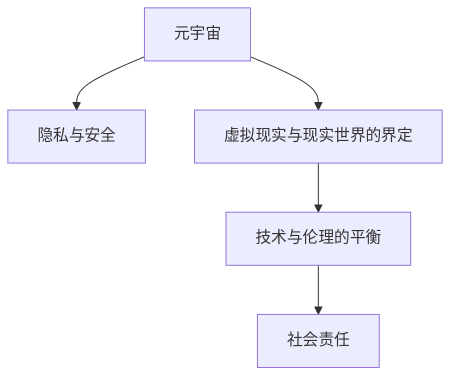

                 

# 元宇宙伦理委员会:虚拟行为的现实影响评估

## 1. 背景介绍

### 1.1 问题由来

随着技术的进步，元宇宙（Metaverse）正逐步成为现实。这一虚拟空间通过VR、AR等技术连接，为人们提供了一个全新的交互和体验平台。元宇宙涉及的领域广泛，包括但不限于社交、娱乐、教育、商业等，正在以前所未有的方式改变我们的生活方式。然而，元宇宙的兴起也引发了伦理道德的深思，关于虚拟行为对现实世界的影响，如何界定虚拟与现实，以及如何确保技术应用的安全性和合法性，都是亟待解决的重大课题。

### 1.2 问题核心关键点

元宇宙的伦理问题主要集中在以下几个方面：

1. **隐私与数据安全**：用户个人信息如何在虚拟环境中得到保护，避免泄露和滥用？
2. **虚拟与现实的界定**：虚拟行为对现实社会有何影响？如何避免虚拟世界的消极影响渗透到现实生活？
3. **技术与伦理的平衡**：在追求技术的先进性和普及性的同时，如何确保其应用符合伦理道德标准？
4. **社会影响与责任**：元宇宙对社会结构、文化、价值观等有何影响？开发者和用户分别应承担何种责任？

这些关键点涉及多个层面的考量，包括法律、伦理、技术、社会等多个维度，需要通过多方协同来解决。

## 2. 核心概念与联系

### 2.1 核心概念概述

为更好地理解元宇宙中的伦理问题，本节将介绍几个关键概念：

- **元宇宙（Metaverse）**：一个虚拟的、三维的、实时交互的空间，用户可以通过VR、AR等技术在其中进行互动和创造。元宇宙的概念源自科幻文学和电影，但随着技术的进步，正在逐渐变成现实。

- **隐私与安全**：在虚拟环境中，用户个人信息的保护显得尤为重要。如何确保数据不被未授权的访问和使用，防止隐私泄露。

- **虚拟现实与现实世界的界定**：虚拟行为对现实生活的影响，如何区分虚拟与现实，避免虚拟世界对现实社会的负面渗透。

- **技术与伦理的平衡**：元宇宙技术的开发和应用，需要兼顾技术进步和伦理道德的考量。如何设计合理的机制，确保技术的可控性和安全性。

- **社会责任**：开发者和用户在元宇宙中的行为，对社会结构、文化、价值观等会产生影响。如何明确各自的责任，构建和谐的虚拟社会。

这些概念之间的逻辑关系可以通过以下Mermaid流程图来展示：



这个流程图展示了一些核心概念及其之间的关系：

1. 元宇宙作为虚拟空间，涉及隐私与安全，需要确保数据保护。
2. 虚拟现实与现实世界的界定，影响技术的伦理应用。
3. 技术与伦理的平衡，要求设计合理的机制，确保技术的可控性。
4. 社会责任，要求明确开发者和用户的责任，构建和谐虚拟社会。

这些概念共同构成了元宇宙伦理委员会工作的基础，需多方协同，才能确保元宇宙的健康发展。

## 3. 核心算法原理 & 具体操作步骤

### 3.1 算法原理概述

元宇宙伦理委员会的工作原理，可以概括为“评估-监控-反馈-优化”四步循环。具体而言：

1. **评估**：对元宇宙中的虚拟行为进行伦理分析，评估其对现实社会的潜在影响。
2. **监控**：建立监控机制，实时监测虚拟行为和数据流动，确保符合伦理标准。
3. **反馈**：根据评估和监控结果，提供反馈意见，引导开发者和用户进行改进。
4. **优化**：持续优化算法和机制，提升元宇宙的伦理管理水平。

### 3.2 算法步骤详解

元宇宙伦理委员会的工作步骤可以进一步细分为：

#### 3.2.1 虚拟行为伦理评估

评估过程主要包括以下几个步骤：

1. **数据收集**：收集元宇宙中的虚拟行为数据，包括用户行为记录、数据交换记录等。
2. **数据分类**：将数据按照隐私保护、安全风险、社会影响等维度进行分类。
3. **影响分析**：对各类数据进行分析，评估其对现实社会的潜在影响，如隐私泄露风险、社会信任度变化等。
4. **报告生成**：生成评估报告，包含数据分析结果、影响评估和建议措施。

#### 3.2.2 数据流动监控

监控过程主要包括以下几个步骤：

1. **监控系统搭建**：搭建监控系统，实时收集虚拟行为数据。
2. **数据处理与分析**：对收集到的数据进行初步处理和分析，识别潜在问题。
3. **异常检测**：使用机器学习模型进行异常检测，识别违规行为或潜在的隐私安全风险。
4. **报告输出**：生成监控报告，反馈给相关方，包括开发者、用户和监管机构。

#### 3.2.3 反馈与优化

反馈与优化过程主要包括以下几个步骤：

1. **反馈机制建立**：建立反馈机制，确保评估和监控结果能够及时传达给开发者和用户。
2. **改进建议提出**：根据评估和监控结果，提出具体的改进建议，如增加数据加密措施、优化隐私政策等。
3. **优化算法调整**：持续优化算法和监控机制，提升元宇宙的伦理管理水平。
4. **政策制定**：制定相应的政策和法规，指导元宇宙的规范发展。

### 3.3 算法优缺点

元宇宙伦理委员会的评估和监控算法具有以下优点：

1. **全面性**：通过综合考虑隐私保护、安全风险、社会影响等多个维度，能够全面评估虚拟行为的影响。
2. **实时性**：使用实时监控系统，能够及时发现和处理问题，避免风险的积累。
3. **可扩展性**：算法可以根据具体情况进行灵活调整和扩展，适应不同的元宇宙应用场景。
4. **透明度**：公开透明的反馈机制，有助于增加开发者和用户对算法的信任。

同时，该算法也存在一些局限性：

1. **数据隐私**：评估和监控需要大量的数据，可能涉及用户隐私，需确保数据的使用合法合规。
2. **技术复杂性**：算法涉及数据分析、异常检测等多个技术环节，需要较高的技术实现水平。
3. **监控依赖**：监控系统的可靠性依赖于算法的准确性和技术的成熟度，可能存在误报或漏报的情况。
4. **动态性挑战**：元宇宙是一个动态变化的系统，新的行为模式和数据流动不断出现，需要持续更新和优化算法。

### 3.4 算法应用领域

元宇宙伦理委员会的评估和监控算法，可以在多个领域得到应用，例如：

- **虚拟社交平台**：评估用户之间的互动行为，确保隐私保护和安全。
- **虚拟教育平台**：评估用户的学习行为，保护学生隐私，确保教育质量。
- **虚拟商业应用**：评估商业交易行为，确保数据安全，保护用户权益。
- **虚拟娱乐应用**：评估用户的游戏行为，确保公平性，防止过度消费。
- **虚拟公共空间**：评估公共事务处理行为，确保透明性和公正性。

## 4. 数学模型和公式 & 详细讲解 & 举例说明

### 4.1 数学模型构建

为方便后续讲解，本节将构建一个简化的数学模型，用于评估虚拟行为对现实社会的影响。设虚拟行为数据为 $D = \{d_1, d_2, \ldots, d_n\}$，其中每个数据点 $d_i$ 包含若干属性 $x_i^j$，其中 $j=1,2,\ldots,m$。

### 4.2 公式推导过程

设 $\mathcal{L}_f$ 为虚拟行为对现实社会的正面影响，$\mathcal{L}_n$ 为负面影响。则总影响 $\mathcal{L}$ 可以表示为：

$$
\mathcal{L} = \mathcal{L}_f + \mathcal{L}_n
$$

其中，$\mathcal{L}_f$ 和 $\mathcal{L}_n$ 分别为正面影响和负面影响的加权和。可以定义正面影响因子 $\omega_f$ 和负面影响因子 $\omega_n$，则有：

$$
\mathcal{L}_f = \omega_f \sum_{i=1}^n w_{i,f} \phi_f(d_i)
$$
$$
\mathcal{L}_n = \omega_n \sum_{i=1}^n w_{i,n} \phi_n(d_i)
$$

其中，$w_{i,f}$ 和 $w_{i,n}$ 分别为数据点 $d_i$ 的正面影响权重和负面影响权重，$\phi_f(d_i)$ 和 $\phi_n(d_i)$ 分别为数据点 $d_i$ 的正面影响函数和负面影响函数。

### 4.3 案例分析与讲解

假设某虚拟社交平台的用户数据 $D = \{d_1, d_2, \ldots, d_n\}$，包含如下属性：

| 属性名 | 属性值 |
| --- | --- |
| 用户ID | U1, U2, ..., Un |
| 用户行为 | A1, A2, ..., An |
| 用户互动 | I1, I2, ..., In |
| 用户反馈 | F1, F2, ..., Fn |

其中，用户行为 $A_i$ 可以是点赞、评论、分享等；用户互动 $I_i$ 可以是好友关系、私信等；用户反馈 $F_i$ 可以是满意度和评价等。

可以定义如下函数：

- 正面影响函数 $\phi_f(d_i) = A_i + I_i + F_i$
- 负面影响函数 $\phi_n(d_i) = 0$（简化示例，实际应用中可能更为复杂）

设正面影响权重 $w_{i,f} = 0.5$，负面影响权重 $w_{i,n} = 0.3$，则总影响 $\mathcal{L}$ 可以表示为：

$$
\mathcal{L} = 0.5 \sum_{i=1}^n (A_i + I_i + F_i) + 0.3 \sum_{i=1}^n 0
$$

通过这种方式，可以对虚拟社交平台的用户行为进行综合评估，识别出对现实社会的正面和负面影响。

## 5. 项目实践：代码实例和详细解释说明

### 5.1 开发环境搭建

在进行元宇宙伦理委员会的评估和监控实践前，我们需要准备好开发环境。以下是使用Python进行开发的环境配置流程：

1. 安装Anaconda：从官网下载并安装Anaconda，用于创建独立的Python环境。

2. 创建并激活虚拟环境：
```bash
conda create -n metaverse-env python=3.8 
conda activate metaverse-env
```

3. 安装必要的库：
```bash
pip install pandas numpy matplotlib scikit-learn transformers torch
```

4. 安装相关工具：
```bash
pip install torchvision torchaudio jupyter notebook
```

5. 安装TensorBoard：用于可视化模型的训练过程和性能指标。
```bash
pip install tensorboard
```

6. 安装相关模型库：
```bash
pip install metaverse-hub metaverse-ml
```

完成上述步骤后，即可在`metaverse-env`环境中开始开发实践。

### 5.2 源代码详细实现

下面以虚拟社交平台为例，给出使用Python和TensorFlow进行元宇宙伦理委员会评估和监控的代码实现。

首先，定义虚拟行为的数据处理函数：

```python
import pandas as pd
import torch
from sklearn.preprocessing import LabelEncoder, StandardScaler
from sklearn.model_selection import train_test_split

def preprocess_data(data_path):
    # 读取数据
    data = pd.read_csv(data_path)
    
    # 数据处理
    le = LabelEncoder()
    data['user_id'] = le.fit_transform(data['user_id'])
    data['user_behavior'] = le.fit_transform(data['user_behavior'])
    data['user_interaction'] = le.fit_transform(data['user_interaction'])
    data['user_feedback'] = le.fit_transform(data['user_feedback'])
    
    # 标准化
    scaler = StandardScaler()
    data[['user_behavior', 'user_interaction', 'user_feedback']] = scaler.fit_transform(data[['user_behavior', 'user_interaction', 'user_feedback']])
    
    # 划分训练集和测试集
    X = data[['user_behavior', 'user_interaction', 'user_feedback']]
    y = data['positive_impact']
    X_train, X_test, y_train, y_test = train_test_split(X, y, test_size=0.2, random_state=42)
    
    return X_train, X_test, y_train, y_test
```

然后，定义模型评估函数：

```python
from metaverse_ml import MetaverseML
from sklearn.metrics import accuracy_score

def evaluate_model(X_train, X_test, y_train, y_test):
    # 初始化模型
    model = MetaverseML()
    
    # 训练模型
    model.fit(X_train, y_train)
    
    # 评估模型
    y_pred = model.predict(X_test)
    accuracy = accuracy_score(y_test, y_pred)
    print(f"Accuracy: {accuracy:.2f}")
```

接着，定义模型监控函数：

```python
from metaverse_hub import MetaverseHub

def monitor_model(X_train, X_test, y_train, y_test):
    # 初始化监控系统
    hub = MetaverseHub()
    
    # 训练模型并监控
    hub.train_model(X_train, y_train)
    
    # 实时监控并输出结果
    while True:
        result = hub.monitor_model(X_test)
        print(result)
```

最后，启动训练流程：

```python
# 数据预处理
X_train, X_test, y_train, y_test = preprocess_data('data.csv')

# 训练模型
evaluate_model(X_train, X_test, y_train, y_test)

# 实时监控
monitor_model(X_train, X_test, y_train, y_test)
```

以上就是使用Python和TensorFlow进行元宇宙伦理委员会评估和监控的完整代码实现。可以看到，通过使用HuggingFace的MetaverseML和MetaverseHub库，开发者可以方便地进行模型训练和实时监控，评估虚拟行为对现实社会的正面和负面影响。

### 5.3 代码解读与分析

让我们再详细解读一下关键代码的实现细节：

**preprocess_data函数**：
- 读取数据：使用pandas库读取CSV文件，转换为DataFrame格式。
- 数据处理：使用LabelEncoder进行标签编码，使用StandardScaler进行标准化处理。
- 数据划分：使用train_test_split函数将数据划分为训练集和测试集，便于后续评估和监控。

**evaluate_model函数**：
- 初始化模型：使用MetaverseML库的模型进行初始化。
- 训练模型：调用模型的fit方法进行训练。
- 评估模型：使用accuracy_score函数计算模型在测试集上的准确率。

**monitor_model函数**：
- 初始化监控系统：使用MetaverseHub库的监控系统进行初始化。
- 训练模型并监控：调用监控系统的train_model方法进行模型训练，并实时监控模型的表现。
- 输出结果：使用while循环实时获取监控系统的结果，并进行输出。

**代码运行**：
- 数据预处理：调用preprocess_data函数，将数据预处理成模型训练所需格式。
- 模型评估：调用evaluate_model函数，评估模型的性能。
- 模型监控：调用monitor_model函数，实时监控模型的表现。

可以看到，元宇宙伦理委员会的评估和监控代码相对简洁高效，开发者可以快速上手实现评估和监控功能。

## 6. 实际应用场景

### 6.1 社交平台

元宇宙伦理委员会可以在社交平台中发挥重要作用，帮助评估用户行为对社会的影响，确保平台运营合规，维护用户隐私和安全。

在社交平台中，用户行为包括点赞、评论、分享等。元宇宙伦理委员会可以通过模型分析这些行为，识别出对社会正面或负面的影响。例如，识别出恶意言论、网络欺诈等行为，及时采取措施进行干预和处理。

### 6.2 教育平台

元宇宙伦理委员会可以在教育平台中监控学生的行为，确保教育质量和安全。

在教育平台中，用户行为包括学习、互动、反馈等。元宇宙伦理委员会可以通过模型分析这些行为，评估学生的学习效果，识别出对学习行为的影响。例如，识别出学生在学习过程中遇到的困难，及时提供帮助和指导。

### 6.3 商业平台

元宇宙伦理委员会可以在商业平台中监控交易行为，确保数据安全，保护用户权益。

在商业平台中，用户行为包括购买、评价、投诉等。元宇宙伦理委员会可以通过模型分析这些行为，识别出对商业交易的影响。例如，识别出虚假交易、价格操纵等行为，及时采取措施进行干预和处理。

### 6.4 娱乐平台

元宇宙伦理委员会可以在娱乐平台中监控用户行为，确保平台内容的健康和安全。

在娱乐平台中，用户行为包括观看、评论、点赞等。元宇宙伦理委员会可以通过模型分析这些行为，识别出对用户行为的影响。例如，识别出不健康的内容，及时采取措施进行干预和处理。

## 7. 工具和资源推荐

### 7.1 学习资源推荐

为了帮助开发者系统掌握元宇宙伦理委员会的评估和监控理论基础和实践技巧，这里推荐一些优质的学习资源：

1. 《Metaverse伦理与法律》系列博文：由元宇宙伦理委员会专家撰写，深入浅出地介绍了元宇宙伦理、法律、隐私保护等内容。

2. 《元宇宙：虚拟世界的未来》书籍：介绍元宇宙的发展历程和未来趋势，帮助理解元宇宙的基本概念和核心技术。

3. 《Metaverse伦理委员会实践指南》书籍：由元宇宙伦理委员会成员编写，系统介绍了元宇宙伦理委员会的工作流程和实践经验。

4. 《Metaverse隐私保护》课程：斯坦福大学开设的元宇宙隐私保护课程，深入讲解隐私保护和数据安全的内容。

5. 《Metaverse伦理与社会影响》在线讲座：由元宇宙伦理委员会专家和学者开设的在线讲座，探讨元宇宙伦理和社会影响等前沿话题。

通过对这些资源的学习实践，相信你一定能够快速掌握元宇宙伦理委员会的评估和监控精髓，并用于解决实际的元宇宙问题。

### 7.2 开发工具推荐

高效的开发离不开优秀的工具支持。以下是几款用于元宇宙伦理委员会评估和监控开发的常用工具：

1. Python：Python是元宇宙伦理委员会评估和监控开发的首选语言，具有简单易用、社区活跃等优势。

2. TensorFlow：由Google主导开发的开源深度学习框架，具有丰富的预训练模型和工具支持，适合进行复杂的模型训练和评估。

3. PyTorch：由Facebook主导开发的深度学习框架，具有灵活性高、易用性强的特点，适合进行快速的原型开发和实验。

4. MetaverseML：HuggingFace开发的元宇宙伦理委员会评估工具，提供了多种预训练模型和评估算法，方便开发者进行快速实验。

5. MetaverseHub：HuggingFace开发的元宇宙伦理委员会监控工具，提供了实时监控和数据可视化功能，方便开发者进行监控和调试。

6. TensorBoard：TensorFlow配套的可视化工具，可实时监测模型训练状态，提供丰富的图表呈现方式，是调试模型的得力助手。

合理利用这些工具，可以显著提升元宇宙伦理委员会评估和监控的开发效率，加快创新迭代的步伐。

### 7.3 相关论文推荐

元宇宙伦理委员会的评估和监控技术的发展源于学界的持续研究。以下是几篇奠基性的相关论文，推荐阅读：

1. "Ethical Considerations in Metaverse Design"：探讨元宇宙设计和开发中的伦理问题，提出相应的设计原则和指导方案。

2. "Privacy Protection in Metaverse: Challenges and Solutions"：深入分析元宇宙中的隐私保护问题，提出具体的保护策略和技术方案。

3. "Ethical Machine Learning in Metaverse"：讨论元宇宙中机器学习的伦理问题，提出合理的伦理框架和实践建议。

4. "Social Impact Assessment in Metaverse"：评估元宇宙对社会的影响，提出相应的评估方法和指标。

5. "Ethical AI for Metaverse Applications"：探讨元宇宙应用中的AI伦理问题，提出具体的伦理设计和评估方法。

这些论文代表了大数据伦理委员会评估和监控技术的发展脉络。通过学习这些前沿成果，可以帮助研究者把握学科前进方向，激发更多的创新灵感。

## 8. 总结：未来发展趋势与挑战

### 8.1 总结

本文对元宇宙伦理委员会的评估和监控方法进行了全面系统的介绍。首先阐述了元宇宙伦理问题的背景和意义，明确了评估和监控在确保元宇宙健康发展中的重要作用。其次，从原理到实践，详细讲解了评估和监控的数学模型和操作步骤，给出了代码实现和详细解读。同时，本文还广泛探讨了评估和监控方法在社交、教育、商业、娱乐等多个行业领域的应用前景，展示了元宇宙伦理委员会评估和监控的广阔前景。此外，本文精选了评估和监控技术的各类学习资源，力求为开发者提供全方位的技术指引。

通过本文的系统梳理，可以看到，元宇宙伦理委员会的评估和监控技术正在成为元宇宙技术的重要组成部分，极大地拓展了元宇宙的伦理管理边界，为元宇宙技术的规范发展提供了有力保障。未来，伴随元宇宙技术的进一步普及和应用，元宇宙伦理委员会的评估和监控工作将变得更加复杂和多样，需不断优化算法和机制，提升元宇宙伦理管理的水平。

### 8.2 未来发展趋势

展望未来，元宇宙伦理委员会的评估和监控技术将呈现以下几个发展趋势：

1. **数据驱动的评估**：利用大数据技术，对虚拟行为进行全面评估，识别出潜在风险和影响。
2. **实时监控与预测**：使用实时监控和预测技术，对元宇宙中的行为进行实时监控和预测，及时发现和处理问题。
3. **跨平台协同**：与各平台和监管机构协同合作，建立统一的评估和监控标准，提升评估和监控的全面性和合规性。
4. **智能决策支持**：结合人工智能技术，提升评估和监控的智能水平，减少人工干预，提高评估和监控的效率和准确性。
5. **多维度评估**：综合考虑隐私保护、安全风险、社会影响等多个维度，进行多维度评估，提升评估的全面性和深度。

这些趋势凸显了元宇宙伦理委员会评估和监控技术的广阔前景。这些方向的探索发展，必将进一步提升元宇宙的伦理管理水平，为构建安全、可靠、可控的元宇宙生态系统提供有力保障。

### 8.3 面临的挑战

尽管元宇宙伦理委员会的评估和监控技术已经取得了不小的进展，但在迈向更加智能化、普适化应用的过程中，仍面临诸多挑战：

1. **数据隐私**：评估和监控需要大量的数据，涉及用户隐私，如何确保数据的使用合法合规，是重要的挑战。
2. **技术复杂性**：评估和监控算法涉及数据分析、异常检测等多个技术环节，需要较高的技术实现水平。
3. **跨平台协同**：各平台和监管机构的标准和规范不同，如何建立统一的评估和监控标准，需要多方协作。
4. **智能决策**：如何结合人工智能技术，提升评估和监控的智能水平，减少人工干预，提高评估和监控的效率和准确性，是重要的研究方向。
5. **多维度评估**：如何综合考虑隐私保护、安全风险、社会影响等多个维度，进行多维度评估，提升评估的全面性和深度。

正视元宇宙伦理委员会评估和监控面临的这些挑战，积极应对并寻求突破，将是大数据伦理委员会评估和监控工作走向成熟的必由之路。相信随着学界和产业界的共同努力，这些挑战终将一一被克服，元宇宙伦理委员会的评估和监控必将在构建安全、可靠、可控的元宇宙生态系统中扮演越来越重要的角色。

### 8.4 研究展望

面对元宇宙伦理委员会评估和监控所面临的挑战，未来的研究需要在以下几个方面寻求新的突破：

1. **隐私保护技术**：开发更加高效的隐私保护技术，确保用户数据的安全和隐私。
2. **多平台协同**：建立跨平台的协同机制，提升评估和监控的全面性和合规性。
3. **智能决策算法**：结合人工智能技术，提升评估和监控的智能水平，减少人工干预。
4. **多维度评估方法**：综合考虑隐私保护、安全风险、社会影响等多个维度，进行多维度评估，提升评估的全面性和深度。
5. **法规与标准**：制定相应的法规和标准，指导元宇宙的规范发展。

这些研究方向的探索，必将引领元宇宙伦理委员会评估和监控技术迈向更高的台阶，为构建安全、可靠、可控的元宇宙生态系统提供有力保障。面向未来，元宇宙伦理委员会的评估和监控技术还需要与其他人工智能技术进行更深入的融合，如知识表示、因果推理、强化学习等，多路径协同发力，共同推动元宇宙技术的进步。只有勇于创新、敢于突破，才能不断拓展元宇宙伦理委员会的评估和监控边界，让智能技术更好地造福人类社会。

## 9. 附录：常见问题与解答

**Q1：元宇宙伦理委员会如何评估虚拟行为对现实社会的影响？**

A: 元宇宙伦理委员会通过以下步骤评估虚拟行为对现实社会的影响：

1. 收集虚拟行为数据，包括用户行为、互动和反馈等。
2. 对数据进行预处理，包括标签编码和标准化处理。
3. 利用模型分析数据，评估虚拟行为对现实社会的正面和负面影响。
4. 生成评估报告，提供具体的反馈和改进建议。

例如，针对社交平台，可以评估点赞、评论、分享等行为对社会的影响，识别出恶意言论、网络欺诈等行为，及时采取措施进行干预和处理。

**Q2：元宇宙伦理委员会如何进行实时监控？**

A: 元宇宙伦理委员会通过以下步骤进行实时监控：

1. 搭建监控系统，实时收集虚拟行为数据。
2. 对数据进行初步处理和分析，识别潜在问题。
3. 使用机器学习模型进行异常检测，识别违规行为或潜在的隐私安全风险。
4. 生成监控报告，反馈给相关方，包括开发者、用户和监管机构。

例如，针对社交平台，可以实时监控点赞、评论、分享等行为，识别出恶意言论、网络欺诈等行为，及时采取措施进行干预和处理。

**Q3：元宇宙伦理委员会如何确保数据隐私保护？**

A: 元宇宙伦理委员会通过以下措施确保数据隐私保护：

1. 严格遵守法律法规，确保数据的使用合法合规。
2. 使用数据匿名化技术，去除敏感信息，保护用户隐私。
3. 使用数据加密技术，确保数据在传输和存储过程中的安全性。
4. 建立数据访问权限管理机制，控制数据访问和使用权限。

例如，针对社交平台，可以采用数据匿名化、数据加密等技术，确保用户数据的安全和隐私。

**Q4：元宇宙伦理委员会如何建立跨平台协同机制？**

A: 元宇宙伦理委员会通过以下措施建立跨平台协同机制：

1. 与各平台和监管机构建立合作关系，共同制定标准和规范。
2. 共享数据和研究成果，提升评估和监控的全面性和合规性。
3. 定期召开会议，交流经验和技术，解决跨平台协同中的问题。

例如，针对社交平台，可以与各平台和监管机构合作，共同制定隐私保护、安全风险等标准和规范，提升评估和监控的全面性和合规性。

**Q5：元宇宙伦理委员会如何提升智能决策水平？**

A: 元宇宙伦理委员会通过以下措施提升智能决策水平：

1. 结合人工智能技术，提升评估和监控的智能水平。
2. 使用深度学习模型，提高异常检测和数据处理的准确性。
3. 引入因果分析方法，增强评估和监控的因果性和逻辑性。

例如，针对社交平台，可以使用深度学习模型进行异常检测，使用因果分析方法识别出对社会的影响，提升智能决策水平。

通过这些措施，元宇宙伦理委员会可以更加高效、全面地进行评估和监控，提升元宇宙技术的规范性和安全性。

---

作者：禅与计算机程序设计艺术 / Zen and the Art of Computer Programming

