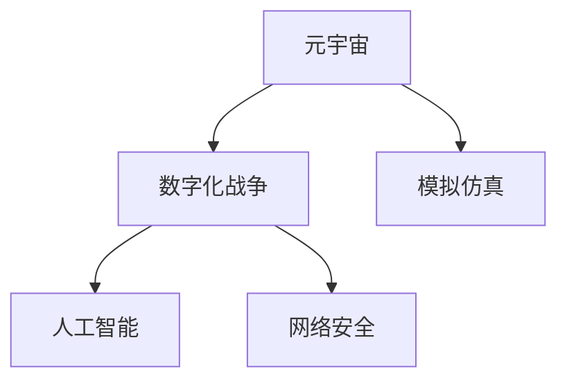

                 

# 元宇宙军事：数字化战争的演练场

> 关键词：元宇宙,数字化战争,游戏化作战,模拟仿真,人工智能,网络安全

## 1. 背景介绍

### 1.1 问题由来
随着科技的进步，战争形态也正在悄然变化。传统的物理战场正在逐步被数字战场取代，数字化战争（Digital Warfare）成为了一种全新的战略模式。数字化战争不仅包括电子战、网络战等技术手段，更涵盖了大规模模拟仿真、人工智能决策等多种元素。在这样的背景下，如何构建高效、真实的数字化战争模拟平台，成为了各军事强国亟需解决的问题。

元宇宙（Metaverse）作为一种新兴的虚拟空间，通过整合现实世界与虚拟世界的边界，提供了一个全息化、沉浸式的数字化体验平台。元宇宙的虚拟现实（VR）、增强现实（AR）、混合现实（MR）技术，结合人工智能、云计算、大数据等先进技术，为构建高度逼真的数字化战争平台提供了新的可能。

### 1.2 问题核心关键点
元宇宙军事的核心在于将传统的物理战争转化为虚拟战场，通过模拟仿真和人工智能技术，实现数字化战争的演练和预演。元宇宙军事平台需要具备以下关键能力：

1. 逼真性：虚拟战场需要与现实世界高度一致，实现兵棋推演、电子战模拟、网络攻击等多种战争场景的全面覆盖。
2. 实时性：能够实时响应敌我双方的作战行动，动态更新战场情况，提供真实的战斗体验。
3. 智能化：结合人工智能技术，实现无人装备自主决策、智能调度等功能，提高作战效率和智能化水平。
4. 可扩展性：支持大规模并发用户，能够根据战争规模的扩大进行扩展和升级。
5. 安全性：具备高度的网络安全防护能力，防止恶意攻击和数据泄露，保障平台安全。

## 2. 核心概念与联系

### 2.1 核心概念概述

为更好地理解元宇宙军事的核心概念，本节将介绍几个密切相关的核心概念：

- **元宇宙（Metaverse）**：一种虚拟与现实融合的全新数字空间，通过VR/AR/MR技术，提供沉浸式、全息化的数字化体验。
- **数字化战争（Digital Warfare）**：利用信息技术手段，通过模拟仿真、网络攻击、电子战等方式，实现对物理战场的虚拟化作战。
- **模拟仿真（Simulation）**：通过构建虚拟战场环境，模拟真实的作战场景，训练和评估军事战略和战术。
- **人工智能（AI）**：结合深度学习、强化学习等技术，实现无人装备的智能化决策和自主作战能力。
- **网络安全（Cyber Security）**：通过防火墙、加密技术、威胁检测等手段，保障虚拟战场和作战系统的安全稳定。

这些核心概念之间的逻辑关系可以通过以下Mermaid流程图来展示：



这个流程图展示了大元宇宙军事的核心概念及其之间的关系：

1. 元宇宙通过VR/AR/MR技术提供虚拟战场环境。
2. 数字化战争利用元宇宙提供的虚拟战场，通过模拟仿真和网络攻击等方式，实现虚拟化作战。
3. 模拟仿真技术通过构建逼真战场，训练和评估军事战略和战术。
4. 人工智能技术用于无人装备的智能化决策和自主作战。
5. 网络安全技术保障虚拟战场和作战系统的安全。

## 3. 核心算法原理 & 具体操作步骤
### 3.1 算法原理概述

元宇宙军事的核心算法原理可以归结为以下几个方面：

1. **模拟仿真算法**：通过构建虚拟战场环境，模拟真实的作战场景，训练和评估军事战略和战术。模拟仿真算法包括但不限于实体物理模拟、环境建模、传感器模拟等。

2. **人工智能算法**：结合深度学习、强化学习等技术，实现无人装备的智能化决策和自主作战能力。人工智能算法包括但不限于自监督学习、对抗生成网络（GAN）、强化学习等。

3. **网络安全算法**：通过防火墙、加密技术、威胁检测等手段，保障虚拟战场和作战系统的安全稳定。网络安全算法包括但不限于入侵检测系统（IDS）、防火墙、加密算法等。

### 3.2 算法步骤详解

元宇宙军事的算法步骤可以概括为以下几个关键步骤：

**Step 1: 构建虚拟战场环境**
- 使用VR/AR/MR技术，构建逼真的虚拟战场环境，实现三维建模和场景渲染。
- 结合物理模拟技术，实现虚拟兵员、装备、环境等实体在战场中的运动和互动。
- 引入传感器模拟技术，实现战场环境的信息采集和反馈。

**Step 2: 设计作战模型**
- 设计敌我双方的作战模型，包括兵种、装备、战术等。
- 使用游戏化作战引擎，实现作战行动的模拟和控制。
- 引入人工智能技术，实现无人装备的自主决策和智能调度。

**Step 3: 训练和评估**
- 使用模拟仿真算法，训练和评估军事战略和战术。
- 使用人工智能算法，提升无人装备的智能化水平。
- 使用网络安全算法，保障虚拟战场和作战系统的安全稳定。

**Step 4: 实战演练**
- 在虚拟战场上进行实战演练，评估作战效果。
- 根据实战演练结果，优化作战模型和战术。
- 使用人工智能技术，优化无人装备的自主决策和智能调度。

### 3.3 算法优缺点

元宇宙军事的算法具有以下优点：

1. **高度逼真**：通过模拟仿真和人工智能技术，实现虚拟战场的高逼真度，提供真实的作战体验。
2. **实时响应**：能够实时响应敌我双方的作战行动，动态更新战场情况，提高实战演练的效果。
3. **智能化决策**：结合人工智能技术，实现无人装备的智能化决策和自主作战能力。
4. **可扩展性强**：支持大规模并发用户，能够根据战争规模的扩大进行扩展和升级。
5. **安全性高**：具备高度的网络安全防护能力，防止恶意攻击和数据泄露，保障平台安全。

同时，元宇宙军事的算法也存在以下缺点：

1. **技术复杂度高**：需要整合多种先进技术，包括VR/AR/MR、AI、网络安全等，技术难度较大。
2. **资源消耗大**：模拟仿真和人工智能技术的计算复杂度高，需要强大的硬件支持。
3. **数据隐私风险**：虚拟战场中的数据可能面临隐私泄露的风险，需要严格的数据保护措施。
4. **法规和伦理问题**：虚拟战场中的行为可能涉及到法律法规和伦理问题，需要严格规范和管理。

### 3.4 算法应用领域

元宇宙军事技术已经在多个领域得到了应用，例如：

- **军事训练**：通过虚拟战场训练，提升军事人员的作战能力和战术水平。
- **作战预演**：对重大军事行动进行预演，评估作战效果和风险，优化决策方案。
- **网络攻击演练**：通过模拟仿真和网络安全技术，实现网络攻击和防御的演练和评估。
- **电子战模拟**：实现电子战场景的模拟和训练，提升电子战能力。
- **无人作战系统**：通过人工智能技术，实现无人装备的自主决策和作战。

除了上述这些经典应用外，元宇宙军事技术还被创新性地应用于无人机训练、虚拟战场仿真、联合演习等，为军事作战提供了新的解决方案。

## 4. 数学模型和公式 & 详细讲解  
### 4.1 数学模型构建

元宇宙军事的数学模型构建涉及多个学科，包括数学建模、物理建模、计算机图形学等。

**虚拟战场建模**：
- **实体物理模拟**：使用牛顿力学等物理规律，模拟虚拟兵员、装备等实体的运动和互动。
- **环境建模**：通过几何建模和纹理渲染，实现虚拟环境的三维建模。

**作战模型设计**：
- **游戏化作战引擎**：设计敌我双方的作战模型，实现作战行动的模拟和控制。
- **智能决策算法**：使用强化学习、遗传算法等技术，实现无人装备的智能化决策和自主作战。

**网络安全模型**：
- **威胁检测算法**：使用入侵检测系统（IDS）、异常检测算法，实现网络威胁的检测和预警。
- **加密算法**：使用AES、RSA等加密算法，保障数据传输和存储的安全性。

### 4.2 公式推导过程

以下以实体物理模拟为例，展示虚拟战场建模的数学推导过程。

**实体运动方程**：
设虚拟兵员的位置为 $\mathbf{x}(t)$，速度为 $\mathbf{v}(t)$，加速度为 $\mathbf{a}(t)$，则有：
$$
\mathbf{x}(t+\Delta t) = \mathbf{x}(t) + \mathbf{v}(t)\Delta t + \frac{1}{2}\mathbf{a}(t)\Delta t^2
$$

**速度和加速度的关系**：
$$
\mathbf{v}(t+\Delta t) = \mathbf{v}(t) + \mathbf{a}(t)\Delta t
$$

**加速度的计算**：
设虚拟兵员受到的合力为 $\mathbf{F}(t)$，则有：
$$
\mathbf{a}(t) = \frac{\mathbf{F}(t)}{m}
$$

其中 $m$ 为虚拟兵员的质量。

通过上述数学推导，可以构建一个逼真的虚拟战场环境，实现实体在战场中的运动和互动。

### 4.3 案例分析与讲解

以下以一个具体的作战模拟案例，展示元宇宙军事技术的应用过程。

**作战场景设计**：
假设某次军事演练中，敌我双方在某个虚拟战场上进行作战。敌方的目标是摧毁我方的指挥中心，我方的目标是保护指挥中心并消灭敌方的主力部队。

**作战模型设计**：
- **敌我双方的单位设计**：设定不同的兵种和装备，如坦克、步兵、战斗机等。
- **战术设计**：设定不同的战术动作，如前进、攻击、防御等。
- **智能决策算法**：使用强化学习技术，训练模型实现无人装备的智能化决策和自主作战。

**实战演练**：
通过模拟仿真技术，实现敌我双方的作战行动模拟。在实战演练中，使用人工智能技术优化无人装备的自主决策和智能调度。

**作战效果评估**：
使用模拟仿真技术评估作战效果，分析战术的优劣和战斗力的提升。

## 5. 项目实践：代码实例和详细解释说明
### 5.1 开发环境搭建

在进行元宇宙军事项目实践前，我们需要准备好开发环境。以下是使用Unity和C#进行开发的开发环境配置流程：

1. 安装Unity引擎：从官网下载并安装Unity引擎，创建新的项目模板。

2. 创建并激活虚拟战场场景：
```bash
Unity --new-project myBattlefield --version 2022.3.11f1
```

3. 添加VR/AR/MR插件：从Unity Asset Store安装VR/AR/MR相关的插件，如Tilt Brush、Camera Rig等。

4. 配置网络环境：设置Unity的网络环境，使其支持多用户并发操作。

5. 安装C#开发工具：安装Visual Studio或Visual Studio Code，配置C#开发环境。

完成上述步骤后，即可在虚拟战场场景中进行元宇宙军事项目的开发。

### 5.2 源代码详细实现

以下是使用Unity和C#进行元宇宙军事项目开发的代码实现：

**实体物理模拟**：
```csharp
using UnityEngine;

public class EntityPhysics : MonoBehaviour
{
    public float mass; // 质量
    public float acceleration; // 加速度

    void Update()
    {
        Vector3 force = Physics.gravity * acceleration; // 计算合力
        Rigidbody rb = GetComponent<Rigidbody>();
        rb.AddForce(force * mass); // 施加合力
    }
}
```

**作战模型设计**：
```csharp
using UnityEngine;
using UnityEngine.AI;

public class BattleModel : MonoBehaviour
{
    public GameObject enemy; // 敌方单位
    public Transform target; // 目标位置

    void Update()
    {
        NavMeshAgent agent = GetComponent<NavMeshAgent>();
        agent.destination = target.position; // 设置目标位置
        agent.isStopped = false; // 继续移动
    }

    void OnCollisionEnter(Collision collision)
    {
        if (collision.gameObject.tag == "Enemy")
        {
            // 杀死敌方单位
            Destroy(collision.gameObject);
        }
    }
}
```

**网络安全模型**：
```csharp
using UnityEngine;
using UnityEngine.AI;
using UnityEngine.Network;

public class BattleNetworkManager : MonoBehaviour
{
    public GameObject player; // 玩家单位
    public GameObject enemy; // 敌方单位

    void Update()
    {
        // 处理网络同步
        NetworkManager netManager = NetworkManager.singleton;
        if (netManager != null)
        {
            if (netManager.isHost)
            {
                // 主机角色控制
                NetworkPlayer playerLocal = NetworkManager.LocalPlayer;
                if (playerLocal != null)
                {
                    playerLocal.RPC("Move", playerLocal, 10); // 发送移动指令
                }
            }
            else
            {
                // 客户端角色控制
                NetworkPlayer playerLocal = NetworkManager.LocalPlayer;
                if (playerLocal != null)
                {
                    NetworkPlayer remote = NetworkManager.FindPlayerByChannel(playerLocal通道ID);
                    if (remote != null)
                    {
                        remote.Send("Move", playerLocal通道ID, playerLocal.transform.position, playerLocal.transform.rotation); // 同步位置和旋转
                    }
                }
            }
        }
    }
}
```

完成上述代码实现后，即可在虚拟战场场景中构建逼真的作战模拟环境。

### 5.3 代码解读与分析

让我们再详细解读一下关键代码的实现细节：

**实体物理模拟**：
- `EntityPhysics`类：继承自`MonoBehaviour`，用于实现虚拟兵员等实体的物理模拟。
- `mass`和`acceleration`属性：用于设定虚拟兵员的质量和加速度。
- `Update`方法：用于计算虚拟兵员的运动状态，并施加合力。

**作战模型设计**：
- `BattleModel`类：继承自`MonoBehaviour`，用于设计敌我双方的作战模型。
- `enemy`属性：用于设定敌方的单位。
- `target`属性：用于设定目标位置。
- `Update`方法：用于控制敌我双方的移动和攻击。
- `OnCollisionEnter`方法：用于处理碰撞事件，杀死敌方单位。

**网络安全模型**：
- `BattleNetworkManager`类：继承自`MonoBehaviour`，用于实现网络安全模型。
- `player`和`enemy`属性：用于设定玩家和敌方的单位。
- `Update`方法：用于处理网络同步。
- `NetworkManager`：用于管理网络连接和同步。
- `NetworkPlayer`：用于控制本地和远程玩家。

这些代码实现了基本的元宇宙军事功能，包括实体物理模拟、作战模型设计和网络安全模型。开发者可以根据具体需求进行进一步扩展和优化。

## 6. 实际应用场景
### 6.1 智能训练

元宇宙军事技术在智能训练中的应用，可以通过虚拟战场进行军事人员的作战训练。通过模拟仿真和人工智能技术，训练军事人员在各种作战环境下的决策和作战能力。

在具体应用中，可以设计多种作战场景，如城市攻坚、特种作战等，训练军事人员在复杂环境下的作战技能。使用人工智能技术，对军事人员的作战决策进行评估和优化，提升其智能化水平。

### 6.2 作战预演

元宇宙军事技术在作战预演中的应用，可以通过虚拟战场进行重大军事行动的预演和评估。通过模拟仿真和网络安全技术，评估作战效果和风险，优化决策方案。

在具体应用中，可以设计多种作战场景，如空袭作战、网络攻击等，对作战效果进行评估和优化。使用人工智能技术，对作战模型进行智能化升级，提升作战效率和智能化水平。

### 6.3 无人作战系统

元宇宙军事技术在无人作战系统中的应用，可以通过虚拟战场进行无人装备的训练和测试。通过人工智能技术，实现无人装备的智能化决策和自主作战。

在具体应用中，可以设计多种无人作战系统，如无人机、无人坦克等，进行自主决策和智能调度的测试。使用人工智能技术，对无人装备的智能化决策进行优化，提升其自主作战能力。

### 6.4 未来应用展望

随着元宇宙技术的发展，元宇宙军事技术的应用前景将更加广阔。未来，元宇宙军事技术将在以下几个方面得到进一步发展：

1. **虚拟指挥中心**：通过虚拟战场构建虚拟指挥中心，实现指挥决策的模拟和评估。
2. **智能作战指挥**：结合人工智能技术，实现智能作战指挥，提升指挥决策的智能化水平。
3. **联合演习**：通过虚拟战场实现多国联合军事演习，提升联合作战能力。
4. **作战策略分析**：通过虚拟战场进行作战策略分析，优化作战方案。
5. **装备研发**：通过虚拟战场进行装备研发和测试，提升装备性能。

这些应用场景的实现，将进一步提升元宇宙军事技术的实用性和价值。

## 7. 工具和资源推荐
### 7.1 学习资源推荐

为了帮助开发者系统掌握元宇宙军事技术，这里推荐一些优质的学习资源：

1. **Unity官方文档**：Unity引擎的官方文档，提供了丰富的教程和示例代码，是学习Unity开发的重要资源。

2. **ARKit和ARCore文档**：苹果和谷歌提供的AR开发文档，介绍了VR/AR/MR技术的开发框架和API。

3. **游戏化作战引擎**：GitHub上的开源游戏化作战引擎，提供了多款作战场景和战斗引擎，适用于教学和开发。

4. **强化学习教程**：DeepMind和OpenAI提供的强化学习教程，详细讲解了强化学习的原理和实现方法。

5. **网络安全课程**：网络安全相关的在线课程，介绍了网络安全的基本概念和防护技术。

通过对这些资源的学习实践，相信你一定能够快速掌握元宇宙军事技术的精髓，并用于解决实际的军事问题。

### 7.2 开发工具推荐

高效的开发离不开优秀的工具支持。以下是几款用于元宇宙军事开发的常用工具：

1. Unity引擎：基于C#的跨平台游戏开发引擎，支持VR/AR/MR开发，是构建虚拟战场的首选工具。

2. ARKit/ARCore：苹果和谷歌提供的AR开发框架，支持iOS和Android平台，提供了丰富的AR开发API。

3. TensorFlow和PyTorch：用于实现人工智能算法的深度学习框架，支持各种模型和算法实现。

4. Visual Studio和Visual Studio Code：C#开发的IDE，支持Unity引擎和其他C#项目的开发。

5. Blender：用于三维建模和渲染的工具，支持多种文件格式和插件，适用于构建虚拟战场环境。

合理利用这些工具，可以显著提升元宇宙军事开发效率，加快创新迭代的步伐。

### 7.3 相关论文推荐

元宇宙军事技术的发展源于学界的持续研究。以下是几篇奠基性的相关论文，推荐阅读：

1. **虚拟战场建模**：《A Survey on Virtual Battlefield Modeling》
2. **实体物理模拟**：《Physical Simulation for Real-Time Applications》
3. **游戏化作战引擎**：《Game-Based Combat Simulations: An Overview》
4. **网络安全算法**：《Cyber Security Algorithms and Protocols》
5. **人工智能决策**：《Artificial Intelligence in Combat Simulations》

这些论文代表了大元宇宙军事技术的发展脉络。通过学习这些前沿成果，可以帮助研究者把握学科前进方向，激发更多的创新灵感。

## 8. 总结：未来发展趋势与挑战

### 8.1 总结

本文对元宇宙军事技术进行了全面系统的介绍。首先阐述了元宇宙和数字化战争的背景和意义，明确了元宇宙军事技术在军事训练、作战预演、无人作战系统等方面的应用价值。其次，从原理到实践，详细讲解了元宇宙军事技术的核心算法原理和具体操作步骤，给出了元宇宙军事项目的完整代码实例。同时，本文还广泛探讨了元宇宙军事技术在智能训练、作战预演、无人作战系统等多个行业领域的应用前景，展示了元宇宙军事技术的巨大潜力。

通过本文的系统梳理，可以看到，元宇宙军事技术正在成为数字化战争的重要组成部分，极大地拓展了军事训练和作战的方式。基于虚拟战场和人工智能技术的元宇宙军事系统，为军事训练和作战提供了新的解决方案，显著提升了军事人员的作战能力和战术水平，加速了军事作战方式的现代化进程。

### 8.2 未来发展趋势

展望未来，元宇宙军事技术将呈现以下几个发展趋势：

1. **技术融合加速**：元宇宙军事技术将与AI、大数据、云计算等技术深度融合，提升虚拟战场和作战系统的智能化水平。
2. **跨平台集成**：元宇宙军事技术将跨平台集成，支持多设备、多终端的虚拟作战体验。
3. **全球联合演习**：通过虚拟战场实现多国联合军事演习，提升联合作战能力。
4. **智能作战指挥**：结合人工智能技术，实现智能作战指挥，提升指挥决策的智能化水平。
5. **作战策略分析**：通过虚拟战场进行作战策略分析，优化作战方案。
6. **装备研发测试**：通过虚拟战场进行装备研发和测试，提升装备性能。

以上趋势凸显了元宇宙军事技术的广阔前景。这些方向的探索发展，必将进一步提升元宇宙军事技术的实用性和价值。

### 8.3 面临的挑战

尽管元宇宙军事技术已经取得了瞩目成就，但在迈向更加智能化、普适化应用的过程中，它仍面临着诸多挑战：

1. **技术复杂度高**：元宇宙军事技术需要整合多种先进技术，技术难度较大。
2. **资源消耗大**：模拟仿真和人工智能技术的计算复杂度高，需要强大的硬件支持。
3. **数据隐私风险**：虚拟战场中的数据可能面临隐私泄露的风险，需要严格的数据保护措施。
4. **法规和伦理问题**：虚拟战场中的行为可能涉及到法律法规和伦理问题，需要严格规范和管理。

### 8.4 研究展望

面对元宇宙军事技术所面临的种种挑战，未来的研究需要在以下几个方面寻求新的突破：

1. **技术融合创新**：探索多技术融合的新方法，提升虚拟战场和作战系统的智能化水平。
2. **资源优化策略**：研究高效计算和存储策略，降低资源消耗，提升系统性能。
3. **数据隐私保护**：研究数据隐私保护的新方法，确保虚拟战场和作战系统的安全稳定。
4. **法规和伦理规范**：制定虚拟战场行为规范，确保法律法规和伦理道德的遵守。

这些研究方向将进一步推动元宇宙军事技术的成熟，为构建安全、可靠、可解释、可控的智能作战系统提供理论和技术支持。总之，元宇宙军事技术需要从技术、伦理、法规等多个维度协同发力，才能实现其全面落地和广泛应用。

## 9. 附录：常见问题与解答

**Q1：元宇宙军事技术是否适用于所有军事训练和作战场景？**

A: 元宇宙军事技术适用于大多数军事训练和作战场景，特别是对于那些无法进行实际作战或训练的场景，如核威慑、生化攻击等。但对于需要高精度物理模拟的场景，如航空作战、海上作战等，仍需结合实际设备进行验证和优化。

**Q2：元宇宙军事技术如何处理大规模并发用户？**

A: 元宇宙军事技术需要采用高性能服务器和网络技术，支持大规模并发用户。可以使用云服务器和分布式网络技术，实现虚拟战场和作战系统的可扩展性和高可用性。

**Q3：元宇宙军事技术如何保障数据隐私和安全？**

A: 元宇宙军事技术需要采用先进的数据加密和安全技术，保障虚拟战场和作战系统的数据隐私和安全。可以使用加密算法、访问控制、威胁检测等技术，确保数据传输和存储的安全性。

**Q4：元宇宙军事技术面临哪些伦理和法规问题？**

A: 元宇宙军事技术需要遵守相关法律法规和伦理规范，如《网络安全法》、《个人数据保护法》等。开发者需要在技术开发和应用过程中，确保虚拟战场和作战系统的合法合规，避免违规行为。

**Q5：元宇宙军事技术如何提升无人作战系统的智能化水平？**

A: 元宇宙军事技术可以通过结合人工智能技术，实现无人作战系统的智能化决策和自主作战。使用强化学习、遗传算法等技术，训练模型实现无人装备的智能化决策和自主作战。

这些问答解答展示了元宇宙军事技术在实际应用中的潜在挑战和解决方案，为开发者提供了重要的参考和指导。

---

作者：禅与计算机程序设计艺术 / Zen and the Art of Computer Programming

