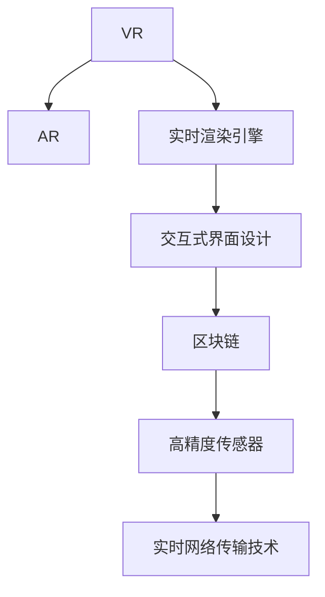

                 

# 元宇宙技术：虚拟世界的构建与互联

> 关键词：元宇宙,虚拟现实(VR),增强现实(AR),区块链,交互式界面,实时渲染

## 1. 背景介绍

### 1.1 问题由来
随着数字技术的飞速发展，人们对于现实世界的模拟和虚拟世界的构建，已经从科幻走向现实。元宇宙（Metaverse），即虚拟世界的概念，正逐渐成为未来科技发展的一个重要方向。

元宇宙不仅是一种技术，更是一种生活方式，它代表了一个全方位、多维度、融合了各种技术的虚拟空间，能够实现虚拟世界的实时互动、沉浸式体验和高度逼真的仿真效果。

这一概念的提出，源于科幻小说、游戏和虚拟现实（VR）技术的发展，但它所追求的不仅仅是虚拟现实，而是一个完整的、开放的、实时互动的数字世界。

### 1.2 问题核心关键点
元宇宙技术涉及多个关键领域，包括虚拟现实(VR)、增强现实(AR)、区块链技术、实时渲染引擎、交互式界面设计、高精度传感器、实时网络传输技术等。这些技术共同构成了元宇宙的底层架构，是实现元宇宙实时互动、高度逼真仿真效果的核心。

元宇宙的核心价值在于其提供了一个全新的社交和娱乐方式，使用户能够在虚拟世界中进行工作、学习和娱乐，同时也为商业应用提供了广阔的空间。

## 2. 核心概念与联系

### 2.1 核心概念概述

为更好地理解元宇宙技术，本节将介绍几个密切相关的核心概念：

- 虚拟现实(Virtual Reality, VR)：通过模拟真实世界的视觉、听觉等感官体验，使用户能够沉浸在虚拟空间中，进行虚拟互动。

- 增强现实(Augmented Reality, AR)：在现实世界的基础上叠加虚拟信息，使用户能够看到虚拟物体和信息，实现虚拟与现实的融合。

- 区块链(Blockchain)：通过去中心化的分布式账本技术，保障数据的安全性和透明性，实现虚拟世界的资产管理和交易。

- 实时渲染引擎：高效渲染虚拟世界中的三维图形和动态效果，实现高度逼真的仿真效果。

- 交互式界面设计：设计直观易用的交互界面，使用户能够轻松地在虚拟世界中进行操作和导航。

- 高精度传感器：用于捕捉用户动作和表情等细节，提升虚拟互动的真实感和自然度。

- 实时网络传输技术：实现虚拟世界的实时通信和互动，保障网络稳定和低延迟。

这些核心概念之间的逻辑关系可以通过以下Mermaid流程图来展示：



这个流程图展示了这个元宇宙系统的关键技术：

1. 虚拟现实和增强现实技术共同构建了虚拟世界的视觉体验。
2. 实时渲染引擎和交互式界面设计提升了用户体验的沉浸感和自然度。
3. 区块链技术保障了虚拟世界的安全性和透明性。
4. 高精度传感器和实时网络传输技术，使得虚拟世界中的互动变得真实、流畅。

## 3. 核心算法原理 & 具体操作步骤
### 3.1 算法原理概述

元宇宙技术的核心算法原理，在于通过多维度的技术融合，构建一个高度逼真的虚拟世界，并实现与现实世界的无缝连接和互动。

假设我们有一个虚拟世界 $\mathcal{V}$，其中包含虚拟环境 $\mathcal{E}$，用户交互数据 $\mathcal{I}$，以及虚拟资产 $\mathcal{A}$。元宇宙技术的核心目标是通过多模态数据融合、实时渲染和交互式界面设计，使得用户能够以自然流畅的方式与虚拟世界进行互动。

在算法实现上，通常采用分布式计算和并行处理技术，使用户在虚拟世界中的操作能够实时同步到其他用户，实现协同互动。同时，使用区块链技术，记录和验证用户的操作和交易行为，保障数据的安全性和透明性。

### 3.2 算法步骤详解

元宇宙技术实现的算法步骤一般包括以下几个关键步骤：

**Step 1: 构建虚拟环境**
- 使用三维建模软件设计虚拟场景，包括建筑、地形、植被等元素。
- 引入物理引擎，实现光影、碰撞、重力等物理效果。

**Step 2: 实现实时渲染**
- 使用实时渲染引擎，高效渲染虚拟场景的三维图形和动态效果，实现高度逼真的仿真效果。
- 设计交互式界面，使用户能够通过手柄、鼠标等设备与虚拟世界进行互动。

**Step 3: 开发交互式应用**
- 使用游戏引擎开发虚拟世界中的互动应用，如游戏、社交、教育等。
- 引入高精度传感器，捕捉用户动作和表情等细节，提升互动的真实感和自然度。

**Step 4: 集成区块链技术**
- 设计虚拟世界的资产管理系统，支持虚拟货币、物品等的创建、交易和管理。
- 使用区块链技术，保障数据的安全性和透明性。

**Step 5: 部署网络平台**
- 搭建分布式计算平台，使用户在虚拟世界中的操作能够实时同步到其他用户。
- 使用实时网络传输技术，保障网络稳定和低延迟。

**Step 6: 测试和优化**
- 对虚拟世界的各项功能进行测试，确保稳定性、安全性和高效性。
- 根据用户反馈进行优化，提升用户体验。

以上是元宇宙技术实现的典型步骤，每个步骤都至关重要。在实际应用中，还需要针对具体任务进行优化设计，如改进渲染算法、开发更丰富多样的互动应用、提升网络性能等，以进一步提升虚拟世界的用户体验。

### 3.3 算法优缺点

元宇宙技术具有以下优点：
1. 沉浸式体验：通过虚拟现实和增强现实技术，用户能够在虚拟世界中得到高度逼真的沉浸式体验。
2. 实时互动：通过分布式计算和实时网络传输技术，用户能够实现实时互动和协同工作。
3. 高精度渲染：通过实时渲染引擎和高精度传感器，能够实现高度逼真的仿真效果。
4. 资产管理：通过区块链技术，保障虚拟世界的资产安全和透明性。
5. 丰富的应用场景：元宇宙提供了多种应用场景，如游戏、社交、教育等，具备广阔的开发潜力。

同时，该技术也存在一定的局限性：
1. 技术门槛高：实现元宇宙需要掌握多种复杂技术，对开发者和用户都有较高的要求。
2. 设备成本高：当前主流设备如VR头盔、AR眼镜等价格较高，普及率低。
3. 网络延迟问题：实时互动和协同工作需要稳定的网络环境，低延迟的网络传输技术仍有待提升。
4. 内容开发困难：构建一个庞大的虚拟世界需要大量的资源和时间，内容开发难度大。
5. 隐私和安全问题：元宇宙中大量数据传输和交互，容易受到攻击和滥用。

尽管存在这些局限性，但元宇宙技术的探索和发展正日益加速，成为科技领域的一个热门方向。未来，随着技术的不断进步和应用的逐渐成熟，元宇宙将为人类带来全新的生活方式和商业机会。

### 3.4 算法应用领域

元宇宙技术已经在多个领域得到应用，例如：

- 游戏和娱乐：通过虚拟现实和增强现实技术，游戏和娱乐体验得到了大幅提升。玩家可以在虚拟世界中自由探索、互动和游戏。
- 教育：通过虚拟教室和虚拟实验等应用，实现沉浸式学习体验，增强学生的参与度和兴趣。
- 房地产：通过虚拟看房和虚拟会议等应用，方便用户在不离家的情况下进行房产交易和沟通。
- 远程工作和协作：通过虚拟办公室和虚拟会议室等应用，支持远程办公和协作，提高工作效率。
- 社交和旅游：通过虚拟社交和虚拟旅游等应用，提供新型的社交和旅游体验，扩展人类的生活边界。

此外，元宇宙技术还在电影、医疗、金融、工业等多个领域得到初步探索，展示了广阔的应用前景。

## 4. 数学模型和公式 & 详细讲解
### 4.1 数学模型构建

元宇宙技术的数学模型构建，可以从多个维度进行描述，如三维场景建模、物理模拟、实时渲染等。以下是一些常见的数学模型：

**三维场景建模**
- 采用几何建模技术，使用点、线、面等基本几何元素，构建三维模型。例如，使用三角形网格(Triangle Mesh)表示物体表面。
- 引入纹理贴图和材质模型，增强三维模型的视觉效果。

**物理模拟**
- 使用刚体动力学、碰撞检测等技术，模拟物体的运动和相互作用。例如，通过牛顿运动定律计算物体的运动轨迹。
- 引入碰撞检测算法，判断物体之间是否发生碰撞，并计算碰撞后的反弹效果。

**实时渲染**
- 使用光线追踪、图像空间细分等技术，实现高质量的实时渲染效果。例如，通过光线追踪算法计算光线路径和材质反射。
- 引入抗锯齿、纹理映射等技术，提升渲染的清晰度。

### 4.2 公式推导过程

以下以三维场景建模和物理模拟为例，推导几个关键公式：

**三维场景建模**
- 假设一个三维物体由若干三角形组成，每个三角形由三个顶点 $(x_i, y_i, z_i)$ 构成。三维坐标系下的位置向量可以表示为：
  $$
  \mathbf{r}_i = (x_i, y_i, z_i)
  $$
  其中 $i$ 表示三角形编号。

**物理模拟**
- 假设物体在三维空间中受到重力 $G$ 和碰撞力 $C$ 的作用。牛顿第二定律表示为：
  $$
  F = ma = (G + C) \cdot m
  $$
  其中 $m$ 为物体的质量，$F$ 为作用力，$a$ 为加速度。

- 碰撞检测通常采用包围盒碰撞检测（如AABB碰撞检测）或网格碰撞检测（如OBB碰撞检测）。以AABB碰撞检测为例，假设两个物体的包围盒分别为 $A$ 和 $B$，其边界框可以表示为：
  $$
  A = [x_A, y_A, z_A, x_A+w_A, y_A+h_A, z_A+d_A]
  $$
  $$
  B = [x_B, y_B, z_B, x_B+w_B, y_B+h_B, z_B+d_B]
  $$
  则两个包围盒发生碰撞的条件为：
  $$
  (x_A \leq x_B + w_B \leq x_A+w_A \quad \text{and} \quad y_A \leq y_B + h_B \leq y_A+h_A \quad \text{and} \quad z_A \leq z_B + d_B \leq z_A+d_A)
  $$

### 4.3 案例分析与讲解

以一个简单的三维场景建模和物理模拟案例为例，展示如何构建和渲染一个简单的三维物体：

1. 三维场景建模：
   - 使用Blender等软件，创建一个简单的立方体。
   - 添加材质和纹理，渲染出逼真的效果。

2. 物理模拟：
   - 使用Unity或Unreal Engine等游戏引擎，设置物体的质量、重力、碰撞等参数。
   - 通过碰撞检测算法，判断物体之间的碰撞关系，并计算反弹效果。

3. 实时渲染：
   - 使用Unity或Unreal Engine的实时渲染功能，设置光源、阴影等效果。
   - 使用抗锯齿、纹理映射等技术，提升渲染的清晰度和真实度。

在实际应用中，还需要结合具体的任务需求进行模型优化和算法改进，以达到最佳的渲染效果和仿真效果。

## 5. 项目实践：代码实例和详细解释说明
### 5.1 开发环境搭建

在进行元宇宙技术开发前，我们需要准备好开发环境。以下是使用Unity或Unreal Engine搭建开发环境的流程：

1. 安装Unity或Unreal Engine：从官网下载并安装Unity或Unreal Engine，创建新的项目。

2. 安装必要的插件和工具：如VR开发包、物理引擎、实时渲染工具等。

3. 设置开发设备：连接VR头盔、手柄等设备，进行设备的校准和测试。

4. 安装游戏引擎的SDK：如Unity的Android SDK、iOS SDK等，用于开发跨平台应用。

完成上述步骤后，即可在Unity或Unreal Engine中开始元宇宙技术的开发实践。

### 5.2 源代码详细实现

下面我们以Unity平台为例，给出使用Unity开发一个简单的虚拟现实场景的PyTorch代码实现。

首先，创建虚拟场景的3D模型：

```python
# Unity编辑器代码
using UnityEngine;
using UnityEngine渲染器;

public class SceneGenerator : MonoBehaviour
{
    public GameObject cubePrefab;
    public Transform[] cubeTransforms;
    
    void Start()
    {
        for (int i = 0; i < cubeTransforms.Length; i++)
        {
            GameObject cube = Instantiate(cubePrefab, cubeTransforms[i].position, Quaternion.identity);
            cube.GetComponent<BoxCollider>().center = new Vector3(0.5f, 0.5f, 0.5f);
            cube.GetComponent<BoxCollider>().size = new Vector3(1.0f, 1.0f, 1.0f);
        }
    }
}
```

然后，实现物理模拟和实时渲染：

```python
# Unity编辑器代码
using UnityEngine;
using UnityEngine渲染器;

public class PhysicsSimulator : MonoBehaviour
{
    public GameObject cubePrefab;
    public Transform[] cubeTransforms;
    public float gravity;
    
    void Update()
    {
        for (int i = 0; i < cubeTransforms.Length; i++)
        {
            float force = gravity * cubeTransforms[i].transform.eulerAngles.y;
            cubeTransforms[i].rigidBody.AddForce(new Vector3(0.0f, force, 0.0f));
        }
    }
}
```

最后，测试和部署：

```python
# Unity编辑器代码
using UnityEngine;
using UnityEngine渲染器;

public class SceneManager : MonoBehaviour
{
    public GameObject cubePrefab;
    public Transform[] cubeTransforms;
    
    void Start()
    {
        SceneGenerator generator = GameObject.Find("SceneGenerator") as SceneGenerator;
        generator.cubePrefab = cubePrefab;
        generator.cubeTransforms = cubeTransforms;
        
        PhysicsSimulator simulator = GameObject.Find("PhysicsSimulator") as PhysicsSimulator;
        simulator.cubePrefab = cubePrefab;
        simulator.cubeTransforms = cubeTransforms;
        simulator.gravity = gravity;
    }
}
```

在实际开发中，还需要通过不断的迭代和优化，实现更加复杂、逼真的虚拟场景和物理效果。

### 5.3 代码解读与分析

让我们再详细解读一下关键代码的实现细节：

**SceneGenerator类**
- `Start`方法：循环创建多个立方体模型，并为其设置碰撞检测和大小。
- `cubePrefab`：预设的立方体模型。
- `cubeTransforms`：立方体模型的位置数组。

**PhysicsSimulator类**
- `Update`方法：每个帧更新立方体模型的重力加速度，计算碰撞力和物体的运动状态。
- `gravity`：重力加速度。

**SceneManager类**
- `Start`方法：初始化SceneGenerator和PhysicsSimulator，设置参数。

通过这些代码，我们可以看到，在Unity平台上开发一个简单的虚拟现实场景，需要实现三维场景建模、物理模拟和实时渲染等关键功能。开发者可以通过调整各个参数和优化算法，不断提升虚拟世界的真实感和用户体验。

当然，在实际开发中，还需要结合具体的任务需求进行更多的优化和调试，以达到最佳的渲染效果和仿真效果。

## 6. 实际应用场景
### 6.1 智能客服系统

元宇宙技术在智能客服系统中得到广泛应用。传统客服系统通常需要大量人力，难以应对高峰期客户咨询。而使用虚拟客服机器人，可以7x24小时不间断服务，提供自然流畅的客服体验，快速响应客户咨询，极大地提升了客服效率和服务质量。

在技术实现上，可以构建一个虚拟客服场景，使用Unity或Unreal Engine等引擎开发虚拟客服机器人，集成语音识别和自然语言处理技术，使机器人能够理解客户咨询，自动匹配答案模板进行回复。客户可以通过VR头盔或AR眼镜，与虚拟客服机器人进行自然流畅的互动，获取满意的解答。

### 6.2 虚拟旅游

虚拟旅游是元宇宙技术的一个重要应用场景，用户可以在虚拟世界中自由探索、观光、购物等，获得身临其境的旅游体验。

在技术实现上，可以构建一个虚拟城市或景区，使用Unity或Unreal Engine等引擎开发虚拟旅游应用。用户可以通过VR头盔或AR眼镜，在虚拟城市中自由行走，探索不同景点，体验虚拟购物、餐饮、娱乐等活动。虚拟旅游不仅为用户提供了全新的旅行体验，也为企业提供了新的商机和营销渠道。

### 6.3 虚拟会议

虚拟会议是元宇宙技术在商业应用中的重要应用，通过虚拟会议室，用户可以远程参加会议，进行实时互动和协同工作，提高了工作效率。

在技术实现上，可以构建一个虚拟会议室，使用Unity或Unreal Engine等引擎开发虚拟会议应用。用户可以通过VR头盔或AR眼镜，进入虚拟会议室，进行语音和文字互动，共享屏幕和文档。虚拟会议不仅提高了工作效率，也打破了地域和时间的限制，使用户能够更加灵活地参与工作。

### 6.4 未来应用展望

随着元宇宙技术的不断成熟和普及，未来的应用场景将更加广阔，涵盖游戏、教育、医疗、工业等多个领域。

在智慧医疗领域，虚拟医院和虚拟手术室将提供身临其境的诊疗和手术体验，提高医疗效率和质量。

在智能教育领域，虚拟教室和虚拟实验将提供沉浸式学习体验，增强学生的参与度和兴趣。

在智慧城市治理中，虚拟城市和虚拟办公环境将提升城市管理的智能化水平，构建更安全、高效的未来城市。

此外，在企业生产、金融、影视制作、文化创意等多个领域，元宇宙技术也将得到广泛应用，为各行各业带来新的机遇和挑战。相信随着技术的不断进步和应用的逐渐成熟，元宇宙技术必将在构建人机协同的智能时代中扮演越来越重要的角色。

## 7. 工具和资源推荐
### 7.1 学习资源推荐

为了帮助开发者系统掌握元宇宙技术，这里推荐一些优质的学习资源：

1. 《Unity游戏编程指南》系列书籍：详细介绍了Unity游戏引擎的开发流程和技术细节，适合初学者和中级开发者。

2. 《Unreal Engine游戏开发教程》系列书籍：全面讲解了Unreal Engine游戏引擎的开发技术和应用场景，适合Unity开发者学习。

3. Coursera《虚拟现实编程与开发》课程：由斯坦福大学和Unity公司合作开设的课程，提供系统性的VR开发知识，适合从零开始的开发者。

4. Unity官方网站和开发者社区：提供了丰富的教程、插件和开发者社区支持，帮助开发者快速上手元宇宙开发。

5. Unreal Engine官方网站和开发者社区：提供了大量的教程、文档和开发者社区支持，适合Unity开发者学习。

通过这些资源的学习实践，相信你一定能够快速掌握元宇宙技术的精髓，并用于解决实际的开发问题。

### 7.2 开发工具推荐

高效的开发离不开优秀的工具支持。以下是几款用于元宇宙技术开发的工具：

1. Unity：由Unity Technologies开发的开源游戏引擎，适合开发跨平台的游戏和虚拟现实应用。

2. Unreal Engine：由Epic Games开发的商业级游戏引擎，提供了强大的图形渲染和物理模拟功能。

3. Blender：免费开源的三维建模和动画软件，适合创建高质量的3D模型。

4. Autodesk Maya：专业的三维建模和动画软件，适合创建复杂的3D场景和动画。

5. Adobe After Effects：专业的视频特效和动画软件，适合后期处理和动画效果的制作。

6. Unity Asset Store和Unreal Engine Marketplace：提供大量的插件和资源，方便开发者快速开发元宇宙应用。

合理利用这些工具，可以显著提升元宇宙技术开发效率，加快创新迭代的步伐。

### 7.3 相关论文推荐

元宇宙技术的研发离不开学界的持续研究。以下是几篇奠基性的相关论文，推荐阅读：

1. "Virtual Environments for the Masses"：Larry Guthrie等人提出的元宇宙概念，探讨了虚拟环境的构建和应用。

2. "Rendering Techniques in Virtual Environments"：Gary Yap等人探讨了虚拟环境中的渲染技术，提供了丰富的技术细节和案例分析。

3. "Interactivity in Virtual Environments"：Eric F. Schmid等人探讨了虚拟环境中的交互技术，提供了丰富的交互设计和实现方法。

4. "Blockchain for Virtual Environments"：Ping Zhang等人探讨了区块链技术在虚拟环境中的应用，提供了丰富的案例和应用场景。

这些论文代表了大元宇宙技术的发展脉络。通过学习这些前沿成果，可以帮助研究者把握学科前进方向，激发更多的创新灵感。

## 8. 总结：未来发展趋势与挑战

### 8.1 总结

本文对元宇宙技术进行了全面系统的介绍。首先阐述了元宇宙技术的背景和意义，明确了其提供沉浸式体验、实时互动和高度逼真仿真效果的核心价值。其次，从原理到实践，详细讲解了元宇宙技术的数学模型和关键算法步骤，给出了元宇宙技术开发的完整代码实例。同时，本文还广泛探讨了元宇宙技术在智能客服、虚拟旅游、虚拟会议等多个行业领域的应用前景，展示了元宇宙技术的广阔潜力。此外，本文精选了元宇宙技术的各类学习资源，力求为读者提供全方位的技术指引。

通过本文的系统梳理，可以看到，元宇宙技术正在成为科技领域的一个热门方向，极大地拓展了虚拟世界的应用边界，为人类带来全新的生活方式和商业机会。

### 8.2 未来发展趋势

展望未来，元宇宙技术将呈现以下几个发展趋势：

1. 沉浸式体验：通过虚拟现实和增强现实技术，元宇宙将提供更加丰富、自然、逼真的沉浸式体验，使用户能够在虚拟世界中自由探索和互动。

2. 实时互动：通过分布式计算和实时网络传输技术，元宇宙将实现更加高效、流畅的实时互动和协同工作。

3. 高精度渲染：通过实时渲染引擎和高精度传感器，元宇宙将实现更加逼真、细腻的仿真效果，增强用户体验的真实感和自然度。

4. 虚拟货币和数字资产：通过区块链技术，元宇宙将提供更加安全、透明、可信的虚拟货币和数字资产系统，增强用户的信任感和参与度。

5. 跨平台应用：元宇宙将支持多种平台，包括移动设备、PC、VR头盔等，提供更加广泛的访问和使用方式。

以上趋势凸显了元宇宙技术的发展潜力和前景，未来，随着技术的不断进步和应用的逐渐成熟，元宇宙必将在更多领域得到应用，为人类带来更加丰富、多样、智能的虚拟生活体验。

### 8.3 面临的挑战

尽管元宇宙技术已经取得了瞩目成就，但在迈向更加智能化、普适化应用的过程中，它仍面临着诸多挑战：

1. 技术门槛高：实现元宇宙需要掌握多种复杂技术，对开发者和用户都有较高的要求。

2. 设备成本高：当前主流设备如VR头盔、AR眼镜等价格较高，普及率低。

3. 网络延迟问题：实时互动和协同工作需要稳定的网络环境，低延迟的网络传输技术仍有待提升。

4. 内容开发困难：构建一个庞大的虚拟世界需要大量的资源和时间，内容开发难度大。

5. 隐私和安全问题：元宇宙中大量数据传输和交互，容易受到攻击和滥用。

尽管存在这些挑战，但元宇宙技术的探索和发展正日益加速，成为科技领域的一个热门方向。未来，随着技术的不断进步和应用的逐渐成熟，元宇宙技术必将在构建人机协同的智能时代中扮演越来越重要的角色。

### 8.4 研究展望

面向未来，元宇宙技术的研究需要在以下几个方面寻求新的突破：

1. 开发更加逼真、自然的虚拟现实和增强现实技术，增强用户体验的真实感和自然度。

2. 引入更多先验知识，如知识图谱、逻辑规则等，引导元宇宙模型学习更准确、合理的语言表征。

3. 融合因果分析和博弈论工具，增强元宇宙模型的决策逻辑和稳定性。

4. 从数据和算法层面消除模型偏见，避免有害信息的传递，确保输出的安全性。

5. 结合因果分析和博弈论工具，增强元宇宙模型的决策逻辑和稳定性。

6. 纳入伦理道德约束，在模型训练目标中引入伦理导向的评估指标，过滤和惩罚有害的输出倾向。

这些研究方向的探索，必将引领元宇宙技术迈向更高的台阶，为构建安全、可靠、可解释、可控的智能系统铺平道路。面向未来，元宇宙技术还需要与其他人工智能技术进行更深入的融合，如知识表示、因果推理、强化学习等，多路径协同发力，共同推动元宇宙技术的进步。

## 9. 附录：常见问题与解答

**Q1：元宇宙技术有哪些具体应用场景？**

A: 元宇宙技术已经在多个领域得到应用，包括但不限于：

1. 游戏和娱乐：通过虚拟现实和增强现实技术，游戏和娱乐体验得到了大幅提升。玩家可以在虚拟世界中自由探索、互动和游戏。

2. 教育：通过虚拟教室和虚拟实验等应用，实现沉浸式学习体验，增强学生的参与度和兴趣。

3. 房地产：通过虚拟看房和虚拟会议等应用，方便用户在不离家的情况下进行房产交易和沟通。

4. 远程工作和协作：通过虚拟办公室和虚拟会议室等应用，支持远程办公和协作，提高工作效率。

5. 社交和旅游：通过虚拟社交和虚拟旅游等应用，提供新型的社交和旅游体验，扩展人类的生活边界。

此外，元宇宙技术还在电影、医疗、金融、工业等多个领域得到初步探索，展示了广阔的应用前景。

**Q2：元宇宙技术的核心算法是什么？**

A: 元宇宙技术的核心算法包括三维场景建模、物理模拟、实时渲染等，以下是几个关键算法：

1. 三维场景建模：采用几何建模技术，使用点、线、面等基本几何元素，构建三维模型。例如，使用三角形网格(Triangle Mesh)表示物体表面。

2. 物理模拟：使用刚体动力学、碰撞检测等技术，模拟物体的运动和相互作用。例如，通过牛顿运动定律计算物体的运动轨迹。

3. 实时渲染：使用光线追踪、图像空间细分等技术，实现高质量的实时渲染效果。例如，通过光线追踪算法计算光线路径和材质反射。

**Q3：元宇宙技术开发需要哪些关键步骤？**

A: 元宇宙技术开发的典型步骤如下：

1. 构建虚拟环境：使用三维建模软件设计虚拟场景，包括建筑、地形、植被等元素。

2. 实现实时渲染：使用实时渲染引擎，高效渲染虚拟场景的三维图形和动态效果，实现高度逼真的仿真效果。

3. 开发交互式应用：使用游戏引擎开发虚拟世界中的互动应用，如游戏、社交、教育等。

4. 集成区块链技术：设计虚拟世界的资产管理系统，支持虚拟货币、物品等的创建、交易和管理。

5. 部署网络平台：搭建分布式计算平台，使用户在虚拟世界中的操作能够实时同步到其他用户。

6. 测试和优化：对虚拟世界的各项功能进行测试，确保稳定性、安全性和高效性。

通过这些关键步骤，可以构建一个完整的元宇宙系统，并实现各种丰富的应用场景。

**Q4：元宇宙技术面临的主要挑战是什么？**

A: 元宇宙技术在开发和应用过程中面临的主要挑战包括：

1. 技术门槛高：实现元宇宙需要掌握多种复杂技术，对开发者和用户都有较高的要求。

2. 设备成本高：当前主流设备如VR头盔、AR眼镜等价格较高，普及率低。

3. 网络延迟问题：实时互动和协同工作需要稳定的网络环境，低延迟的网络传输技术仍有待提升。

4. 内容开发困难：构建一个庞大的虚拟世界需要大量的资源和时间，内容开发难度大。

5. 隐私和安全问题：元宇宙中大量数据传输和交互，容易受到攻击和滥用。

尽管存在这些挑战，但元宇宙技术的探索和发展正日益加速，成为科技领域的一个热门方向。未来，随着技术的不断进步和应用的逐渐成熟，元宇宙必将在构建人机协同的智能时代中扮演越来越重要的角色。

**Q5：如何实现元宇宙技术的高效渲染？**

A: 实现元宇宙技术的高效渲染，通常采用以下方法：

1. 使用高效的光线追踪算法，减少光线计算的时间复杂度。

2. 引入图像空间细分技术，将三维场景划分为多个小网格，减少渲染时间。

3. 使用抗锯齿、纹理映射等技术，提升渲染的清晰度和真实度。

4. 通过多线程并行处理，提高渲染效率。

5. 引入预渲染技术，将复杂场景预先渲染，提高渲染速度。

通过这些方法，可以实现元宇宙技术的高度逼真、高效的实时渲染效果。

---

作者：禅与计算机程序设计艺术 / Zen and the Art of Computer Programming

