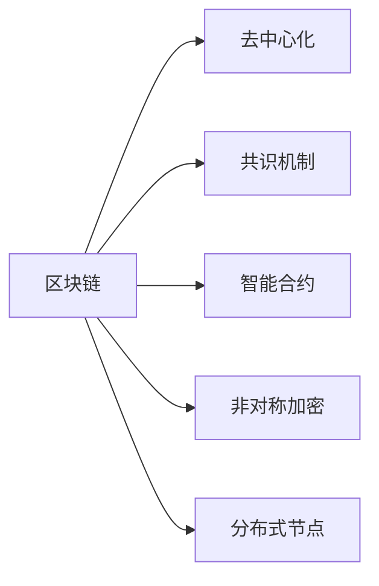

                 

# 元宇宙身份认证:区块链技术在身份管理中的应用

在元宇宙的虚拟世界中，身份认证（Identity Authentication）是至关重要的基础技术，确保了用户的真实性和安全性。区块链技术作为一种去中心化的分布式账本，为身份管理提供了独特的解决方案。本文将详细探讨区块链技术在元宇宙身份认证中的应用，包括核心概念、算法原理、操作步骤、实际应用场景以及未来的发展趋势和挑战。

## 1. 背景介绍

### 1.1 问题由来

随着元宇宙技术的兴起，虚拟世界与现实世界的融合日益加深，用户在虚拟世界中的行为和交易逐渐增多。然而，传统身份认证机制如用户名和密码、数字证书等在元宇宙环境中存在诸多局限性，如中心化管理风险、跨平台兼容性差、用户隐私泄露等。

### 1.2 问题核心关键点

为应对这些问题，区块链技术提供了一种去中心化的身份认证方案，通过分布式共识机制，确保身份信息的安全性和透明性。区块链技术在元宇宙中的身份认证主要基于以下几个关键点：

- 去中心化：去除中心化机构，分布式存储身份信息。
- 不可篡改性：身份信息一旦记录在区块链上，就无法被篡改。
- 匿名性：用户可以匿名操作，身份信息仅在必要时公开。
- 可追溯性：通过区块链的时间戳，可以追踪用户操作记录。
- 智能合约：通过编程实现身份认证流程，自动化验证和管理身份。

这些关键点使得区块链技术在元宇宙身份认证中具有显著优势。

## 2. 核心概念与联系

### 2.1 核心概念概述

以下是区块链技术在元宇宙身份认证中的几个核心概念：

- 区块链（Blockchain）：一种去中心化的分布式账本技术，通过链式结构存储数据。
- 去中心化（Decentralization）：去除中心化机构，分布式存储和验证数据。
- 共识机制（Consensus Mechanism）：分布式网络达成共识的机制，如PoW、PoS等。
- 智能合约（Smart Contract）：自动执行的代码合约，用于自动化身份验证和管理。
- 非对称加密（Asymmetric Encryption）：通过公钥和私钥对数据进行加密和解密，确保数据安全。
- 分布式节点（Distributed Node）：区块链网络中的计算节点，负责存储和验证数据。

### 2.2 核心概念原理和架构的 Mermaid 流程图



## 3. 核心算法原理 & 具体操作步骤

### 3.1 算法原理概述

区块链在元宇宙身份认证中的应用，主要基于以下几个算法原理：

1. 哈希算法：将身份信息通过哈希函数转换为唯一标识符，确保身份信息的唯一性。
2. 非对称加密：用户通过私钥对身份信息进行加密，服务器通过公钥进行解密，确保身份信息的安全性。
3. 智能合约：编写自动化代码，验证用户身份，并记录在区块链上，确保身份信息的透明性和不可篡改性。
4. 共识机制：分布式节点通过共识机制达成一致，验证身份信息，确保身份认证的公正性和一致性。

### 3.2 算法步骤详解

1. **用户注册**：用户通过区块链网络创建一个数字身份，生成公钥和私钥。
2. **身份验证**：用户在虚拟世界中进行身份验证，服务器通过公钥验证用户身份。
3. **智能合约执行**：验证通过后，智能合约自动执行，将身份信息记录在区块链上。
4. **身份管理**：用户通过私钥控制身份信息，可随时查询、修改、撤销身份信息。

### 3.3 算法优缺点

#### 优点：
- 去中心化：去除中心化机构，提升身份管理的公平性和安全性。
- 不可篡改性：身份信息一旦记录在区块链上，无法被篡改，增强了身份认证的可靠性。
- 匿名性：用户可以匿名操作，增强了隐私保护。
- 透明性：所有身份操作记录在区块链上，可以追溯，增强了身份管理的可审计性。

#### 缺点：
- 交易成本：区块链的分布式共识机制，导致交易速度较慢，增加了身份认证的延迟。
- 技术复杂性：需要理解区块链、共识机制、智能合约等技术，增加了系统开发难度。
- 存储成本：区块链存储大量数据，增加了存储成本和能耗。

### 3.4 算法应用领域

区块链技术在元宇宙身份认证中的应用，已经涵盖了多个领域：

1. **游戏平台**：元宇宙游戏平台通过区块链技术实现身份认证，玩家可以通过数字身份参与游戏，完成交易和任务。
2. **虚拟地产**：元宇宙虚拟地产平台通过区块链技术记录和管理虚拟地产所有权，确保交易的透明性和不可篡改性。
3. **虚拟货币**：元宇宙中的虚拟货币通过区块链技术记录和管理流通，确保货币的安全性和透明性。
4. **社交平台**：元宇宙社交平台通过区块链技术实现用户身份认证，确保用户的真实性和隐私保护。
5. **虚拟教育**：元宇宙虚拟教育平台通过区块链技术验证学生身份，记录学习成果，确保教育的公平性和透明性。

## 4. 数学模型和公式 & 详细讲解 & 举例说明

### 4.1 数学模型构建

假设用户通过区块链网络创建一个数字身份，其公钥为$P$，私钥为$S$。服务器通过公钥验证用户身份时，需要将用户信息通过哈希函数$H$进行转换，生成唯一标识符$ID$。

### 4.2 公式推导过程

设用户信息为$M$，哈希函数为$H$，则有：

$$ ID = H(M, P) $$

其中$M$为用户信息，$P$为公钥。

### 4.3 案例分析与讲解

例如，用户在虚拟世界中申请创建一个数字身份，生成公钥和私钥。用户通过私钥对身份信息进行加密，并将加密后的数据发送给服务器。服务器通过公钥对数据进行解密，验证用户身份。验证通过后，智能合约自动执行，将身份信息记录在区块链上。

## 5. 项目实践：代码实例和详细解释说明

### 5.1 开发环境搭建

在进行元宇宙身份认证系统开发时，需要搭建以下环境：

1. 安装Node.js和npm，用于区块链开发。
2. 安装区块链框架，如Hyperledger Fabric或Ethereum，用于构建分布式身份认证系统。
3. 安装智能合约开发工具，如Solidity，用于编写自动化代码。
4. 安装分布式节点工具，如Hyperledger Fabric或Geth，用于分布式存储和验证数据。

### 5.2 源代码详细实现

以下是一个简单的元宇宙身份认证系统示例，使用Hyperledger Fabric和Solidity进行开发：

**用户注册**
```javascript
function registerUser(userID, password, keyPair) {
  const transaction = {
    actions: [
      {
        name: 'userRegister',
        params: {
          userID,
          password,
          publicKey: keyPair.publicKey,
          privateKey: keyPair.privateKey
        }
      }
    ]
  };

  // 发起交易
  client.sendTransaction(transaction, (err, result) => {
    if (err) {
      console.error(err);
    } else {
      console.log('User registration successful');
    }
  });
}
```

**身份验证**
```javascript
function verifyUser(userID, password, keyPair) {
  const transaction = {
    actions: [
      {
        name: 'userVerify',
        params: {
          userID,
          password,
          publicKey: keyPair.publicKey,
          privateKey: keyPair.privateKey
        }
      }
    ]
  };

  // 发起交易
  client.sendTransaction(transaction, (err, result) => {
    if (err) {
      console.error(err);
    } else {
      console.log('User verification successful');
    }
  });
}
```

### 5.3 代码解读与分析

以上代码中，`registerUser`函数用于用户注册，将用户ID、密码和密钥对发送至区块链网络进行验证和注册。`verifyUser`函数用于身份验证，通过用户ID和密码验证用户身份，并将密钥对发送至区块链网络进行验证。

## 6. 实际应用场景

### 6.1 智能合约市场

在元宇宙智能合约市场中，区块链技术可以用于验证用户的身份信息，确保合约执行的安全性和透明性。例如，当用户需要购买虚拟货币或参与智能合约投票时，系统可以通过区块链技术验证用户的身份，确保交易的合法性和公正性。

### 6.2 虚拟医疗平台

在元宇宙虚拟医疗平台中，区块链技术可以用于验证用户的身份信息，确保医疗数据的安全性和隐私保护。例如，当用户需要查询医疗记录或购买虚拟药品时，系统可以通过区块链技术验证用户的身份，确保医疗数据的真实性和完整性。

### 6.3 虚拟法律系统

在元宇宙虚拟法律系统中，区块链技术可以用于验证用户的身份信息，确保法律事务的公正性和透明性。例如，当用户需要提交法律文件或参与诉讼时，系统可以通过区块链技术验证用户的身份，确保法律事务的合法性和公正性。

## 7. 工具和资源推荐

### 7.1 学习资源推荐

以下是推荐的学习资源：

1. 《区块链技术与应用》：介绍区块链技术的基本原理和应用场景，适合初学者入门。
2. 《Hyperledger Fabric官方文档》：Hyperledger Fabric官方文档，提供详细的区块链开发指南和样例代码。
3. 《Solidity官方文档》：Solidity官方文档，提供智能合约的编写和部署指南。
4. 《元宇宙技术白皮书》：详细介绍元宇宙的基本概念和技术框架，适合深入了解元宇宙技术。
5. Coursera《区块链技术与应用》课程：Coursera开设的区块链技术课程，涵盖区块链的基本原理和应用场景。

### 7.2 开发工具推荐

以下是推荐的开发工具：

1. Hyperledger Fabric：Hyperledger Fabric，一个开源的区块链框架，用于构建分布式身份认证系统。
2. Ethereum：Ethereum，一个去中心化的区块链平台，支持智能合约的编写和部署。
3. Solidity：Solidity，一个智能合约编程语言，用于编写自动化代码。
4. Truffle：Truffle，一个智能合约开发框架，支持区块链应用的快速开发和测试。
5. MetaMask：MetaMask，一个区块链浏览器，支持智能合约的交互和交易。

### 7.3 相关论文推荐

以下是推荐的相关论文：

1. 《区块链技术与身份认证》：介绍区块链技术在身份认证中的应用，适合入门学习。
2. 《Hyperledger Fabric在分布式身份认证中的应用》：探讨Hyperledger Fabric在身份认证中的应用，提供实际案例和最佳实践。
3. 《Ethereum智能合约在身份认证中的应用》：探讨Ethereum智能合约在身份认证中的应用，提供实际案例和最佳实践。
4. 《元宇宙中的身份认证与隐私保护》：探讨元宇宙中的身份认证和隐私保护问题，提供技术解决方案和应用案例。

## 8. 总结：未来发展趋势与挑战

### 8.1 研究成果总结

本文详细探讨了区块链技术在元宇宙身份认证中的应用，包括核心概念、算法原理、具体操作步骤、实际应用场景以及未来的发展趋势和挑战。通过深入分析区块链技术在身份管理中的应用，展示了其在去中心化、不可篡改性、匿名性和透明性等方面的优势。同时，本文也指出区块链技术在元宇宙身份认证中面临的挑战，如交易成本、技术复杂性和存储成本等问题。

### 8.2 未来发展趋势

未来，区块链技术在元宇宙身份认证中的应用将呈现以下趋势：

1. 多链融合：区块链技术将与其他分布式账本技术如DAG（Directed Acyclic Graph）和Federated Learning等融合，形成更高效的分布式身份认证系统。
2. 智能合约自动化：智能合约将进一步自动化身份认证流程，减少用户操作，提升用户体验。
3. 跨链互操作：不同区块链平台之间的互操作性将得到提升，实现跨链身份认证和数据共享。
4. 隐私保护增强：隐私保护技术如零知识证明（Zero-Knowledge Proofs）和匿名交易（Anonymity Transactions）将得到广泛应用，增强身份认证的隐私保护能力。
5. 分布式共识机制改进：新的共识机制如PoS、DPoS（Delegated Proof of Stake）和BFT（Byzantine Fault Tolerance）将不断演进，提升区块链系统的安全性和可靠性。

### 8.3 面临的挑战

区块链技术在元宇宙身份认证中的应用面临以下挑战：

1. 交易速度慢：当前的区块链系统如Hyperledger Fabric和Ethereum的交易速度较慢，难以满足元宇宙快速身份认证的需求。
2. 存储成本高：区块链存储大量数据，增加了存储成本和能耗，难以适应元宇宙大规模应用的需求。
3. 技术复杂性高：区块链技术的技术门槛较高，需要深入理解区块链、共识机制、智能合约等技术。
4. 隐私保护不足：尽管区块链技术具有匿名性，但仍存在隐私泄露的风险，如交易记录可追溯性等。
5. 法律法规不完善：元宇宙中的身份认证和数据保护问题尚未有明确的法律法规，需要制定相关标准和规范。

### 8.4 研究展望

未来的研究将从以下几个方面进行：

1. 高效共识机制研究：研究新的共识机制，提升区块链系统的交易速度和安全性。
2. 隐私保护技术研究：研究新的隐私保护技术，增强身份认证的隐私保护能力。
3. 跨链互操作技术研究：研究跨链互操作技术，实现不同区块链平台之间的互操作。
4. 身份认证自动化研究：研究自动化身份认证技术，减少用户操作，提升用户体验。
5. 法律法规制定研究：制定相关法律法规，明确元宇宙中的身份认证和数据保护问题。

## 9. 附录：常见问题与解答

### Q1：区块链技术在元宇宙身份认证中是否安全可靠？

A：区块链技术在元宇宙身份认证中具有较高的安全性，但其安全性也受区块链本身的技术实现和共识机制影响。需要选择合适的区块链平台，并采用安全的智能合约编写和部署方式，才能确保身份认证的安全性。

### Q2：区块链技术在元宇宙身份认证中的交易成本如何？

A：区块链技术的交易成本较高，尤其是Hyperledger Fabric和Ethereum等公有链。需要在系统设计中考虑如何优化交易成本，如采用私钥加密、批量交易等。

### Q3：区块链技术在元宇宙身份认证中如何保护隐私？

A：区块链技术可以通过匿名性、零知识证明等方式保护隐私。需要在系统设计中考虑隐私保护策略，如采用匿名交易、隐私盾技术等。

### Q4：区块链技术在元宇宙身份认证中如何提升交易速度？

A：区块链技术的交易速度较慢，可以通过优化共识机制、提升分布式节点的计算能力等方式提升交易速度。

### Q5：区块链技术在元宇宙身份认证中如何保证数据安全性？

A：区块链技术具有不可篡改性，可以保证数据的真实性和完整性。需要在系统设计中考虑如何防范数据泄露和攻击，如采用加密技术、权限控制等。

---

作者：禅与计算机程序设计艺术 / Zen and the Art of Computer Programming

