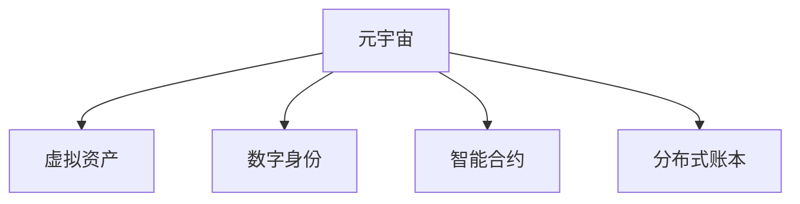

                 

# 元宇宙遗产规划师:虚拟资产传承的专业咨询服务

> 关键词：元宇宙, 虚拟资产, 遗产规划, 数字身份, 智能合约, 去中心化, 分布式账本

## 1. 背景介绍

### 1.1 问题由来

随着技术的进步和数字化生活的普及，人们的生活方式、工作方式以及交互方式都发生了翻天覆地的变化。元宇宙作为一种新的生活方式，逐渐成为人们关注的焦点。在元宇宙中，人们可以通过数字身份在虚拟世界中生活、工作、学习和交流，这些虚拟世界的经历、成就和财产（虚拟资产）变得越来越重要，甚至可能成为遗产的一部分。因此，元宇宙遗产规划师的角色变得越来越重要，他们需要为元宇宙中的虚拟资产提供专业的传承规划服务。

### 1.2 问题核心关键点

元宇宙遗产规划师的主要任务是为虚拟资产的传承提供专业咨询和规划，确保虚拟资产能够在未来得到妥善管理和继承。这包括但不限于虚拟资产的估值、保护、交易、继承和转移等。

元宇宙遗产规划师需要深入理解元宇宙中的虚拟资产，如NFT（非同质化代币）、虚拟土地、虚拟物品、数字身份等，以及这些资产的特点和法律地位。此外，还需要了解元宇宙中使用的技术和协议，如区块链、智能合约、分布式账本等，以及这些技术对虚拟资产传承的影响。

## 2. 核心概念与联系

### 2.1 核心概念概述

为更好地理解元宇宙遗产规划师的角色，本节将介绍几个密切相关的核心概念：

- **元宇宙**：一种虚拟的、沉浸式的数字世界，其中人们可以通过数字身份进行互动，并拥有虚拟财产和资产。

- **虚拟资产**：在元宇宙中，人们拥有的财产，如NFT、虚拟土地、虚拟物品等。

- **数字身份**：在元宇宙中，代表一个人的虚拟存在，可以用于进行虚拟交易、访问虚拟资产等。

- **智能合约**：一种基于区块链技术的自动执行合约，用于处理元宇宙中的虚拟交易和资产管理。

- **分布式账本**：一种去中心化的数据库，用于记录和管理元宇宙中的虚拟资产和交易，如以太坊的区块链。

这些核心概念之间的逻辑关系可以通过以下Mermaid流程图来展示：



这个流程图展示了几大核心概念之间的关系：

1. 元宇宙由虚拟资产、数字身份、智能合约和分布式账本构成。
2. 虚拟资产是元宇宙中的核心财产。
3. 数字身份用于在元宇宙中标识和管理虚拟财产。
4. 智能合约用于自动化管理虚拟交易和资产。
5. 分布式账本用于记录和管理虚拟交易和资产。

## 3. 核心算法原理 & 具体操作步骤

### 3.1 算法原理概述

元宇宙遗产规划师的工作基于元宇宙中的虚拟资产管理技术和协议。通过理解这些技术和协议，可以为虚拟资产的传承提供专业的规划和咨询服务。

元宇宙遗产规划师需要掌握以下核心算法和原理：

- **区块链技术**：元宇宙中的虚拟资产通常存储在区块链上，需要了解区块链的工作原理和应用场景。
- **智能合约**：用于自动执行和管理虚拟资产的交易和继承，需要了解智能合约的编写和执行机制。
- **分布式账本**：用于记录和管理虚拟资产的交易和状态，需要了解分布式账本的技术特点和应用场景。
- **NFT技术**：用于标识和管理元宇宙中的虚拟物品和资产，需要了解NFT的技术特点和应用场景。

### 3.2 算法步骤详解

以下是元宇宙遗产规划师进行虚拟资产传承规划的详细步骤：

**Step 1: 收集和分析虚拟资产信息**

- 收集虚拟资产的详细信息，包括类型、所有权、交易记录、估值等。
- 分析虚拟资产的特点和法律地位，了解其在元宇宙中的表现和价值。
- 了解虚拟资产所在的区块链和智能合约，以便于管理和继承。

**Step 2: 评估虚拟资产价值**

- 基于市场数据和历史交易记录，评估虚拟资产的市场价值和潜在价值。
- 考虑虚拟资产的稀缺性、受欢迎程度和未来潜力，进行全面的价值评估。

**Step 3: 制定虚拟资产传承计划**

- 根据客户的传承意愿和需求，制定虚拟资产的传承计划。
- 确定虚拟资产的继承人，指定继承方式和条件。
- 考虑可能的法律和政策限制，确保传承计划的合法性和可行性。

**Step 4: 实现虚拟资产继承**

- 使用智能合约自动执行虚拟资产的继承和转移。
- 确保虚拟资产的转移过程透明、安全、不可篡改。
- 监控虚拟资产的继承和转移，及时处理可能出现的问题。

**Step 5: 维护虚拟资产**

- 定期检查和更新虚拟资产的信息，确保其价值和安全性。
- 关注元宇宙中的新技术和协议，及时调整传承计划和策略。
- 为虚拟资产的长期管理和维护提供专业咨询服务。

### 3.3 算法优缺点

元宇宙遗产规划师的工作基于区块链技术和智能合约等先进技术，具有以下优点：

- **透明度和安全性**：区块链和智能合约提供了透明、安全和不可篡改的虚拟资产管理方式。
- **自动化和效率**：智能合约可以自动执行虚拟资产的交易和继承，提高了效率和准确性。
- **灵活性和可扩展性**：元宇宙遗产规划师可以根据客户需求和市场变化，灵活调整传承计划和策略。

同时，也存在以下缺点：

- **法律和政策风险**：元宇宙和虚拟资产的法律地位尚未明确，存在潜在的法律和政策风险。
- **技术复杂性**：虚拟资产管理涉及复杂的区块链技术和智能合约，需要高度专业的技术背景。
- **隐私和安全风险**：虚拟资产的管理和传承需要严格保护用户的隐私和安全，存在潜在的安全风险。

### 3.4 算法应用领域

元宇宙遗产规划师的工作主要集中在以下几个领域：

- **虚拟资产管理**：为元宇宙中的虚拟资产提供全面的管理服务，包括估值、交易、继承等。
- **数字身份管理**：为客户的数字身份提供保护和传承规划，确保其在元宇宙中的权益。
- **智能合约开发**：开发和管理智能合约，自动化虚拟资产的传承和转移。
- **去中心化应用(DApp)开发**：为元宇宙中的去中心化应用提供技术支持和咨询服务。

## 4. 数学模型和公式 & 详细讲解 & 举例说明

### 4.1 数学模型构建

元宇宙遗产规划师的工作涉及多个数学模型，以下是一个简单的例子：

假设一个元宇宙中的虚拟物品，其价值可以用以下数学模型表示：

$$
V(t) = V_0 \times \exp(-\lambda t)
$$

其中，$V(t)$ 表示在时间 $t$ 时刻虚拟物品的价值，$V_0$ 表示初始价值，$\lambda$ 表示价值的衰减率，$t$ 表示时间。

### 4.2 公式推导过程

根据上述数学模型，可以推导出虚拟物品价值的衰减公式：

$$
\frac{dV}{dt} = -\lambda V(t)
$$

解得虚拟物品价值的衰减率 $\lambda$：

$$
\lambda = \frac{\ln \frac{V(t)}{V_0}}{t}
$$

这个公式可以帮助元宇宙遗产规划师评估虚拟物品的长期价值，并进行科学的传承规划。

### 4.3 案例分析与讲解

以一个NFT为例，NFT的价值的衰减可以通过历史交易记录和市场数据进行评估。假设一个NFT的初始价值为100美元，每半年价值衰减20%，则其价值衰减公式为：

$$
V(t) = 100 \times (1 - 0.2)^{\frac{t}{6}}
$$

其中，$t$ 表示时间（以半年为单位）。

根据这个公式，可以计算出在不同时间点的NFT价值，帮助元宇宙遗产规划师进行科学的传承规划。

## 5. 项目实践：代码实例和详细解释说明

### 5.1 开发环境搭建

在进行元宇宙遗产规划的代码实现前，需要准备好开发环境。以下是使用Python进行智能合约开发的开发环境配置流程：

1. 安装Anaconda：从官网下载并安装Anaconda，用于创建独立的Python环境。

2. 创建并激活虚拟环境：
```bash
conda create -n blockchain-env python=3.8 
conda activate blockchain-env
```

3. 安装相关库：
```bash
conda install eth-trace eth-utils web3 solc
```

4. 安装以太坊客户端：
```bash
brew install ethereum-cli
```

完成上述步骤后，即可在`blockchain-env`环境中开始智能合约开发。

### 5.2 源代码详细实现

以下是一个简单的智能合约，用于记录和转移虚拟物品的所有权：

```python
from web3 import Web3

# 连接以太坊测试网络
web3 = Web3(Web3.HTTPProvider('http://localhost:8545'))

# 部署智能合约
def deploy_smart_contract():
    contract_code = """
        pragma solidity ^0.8.0;
        
        contract VirtualItem {
            address public owner;
            uint8 public value;
            
            constructor() {
                owner = msg.sender;
                value = 100;
            }
            
            function transferItem(address _recipient, uint8 _value) public {
                require(msg.sender == owner, "Not authorized to transfer");
                require(_value > 0, "Value cannot be zero");
                
                value = _value;
                owner = _recipient;
            }
        }
    """
    contract = web3.eth.contract(source=contract_code)
    tx = contract.deploy()
    web3.eth.sendTransaction({'to': tx.options.newAccount(), 'value': 0})
    return tx

# 获取智能合约地址
def get_smart_contract_address():
    return web3.eth.getContractAddress()

# 查询智能合约中的虚拟物品价值
def get_item_value():
    contract_address = get_smart_contract_address()
    contract = web3.eth.contract(address=contract_address, abi=contract.abi)
    return contract.functions.value().call()

# 转移虚拟物品所有权
def transfer_item():
    contract_address = get_smart_contract_address()
    contract = web3.eth.contract(address=contract_address, abi=contract.abi)
    contract.functions.transferItem("0x123456789012345678901234567890", 50).send({'to': "0x123456789012345678901234567890", 'value': 0})

# 查询所有权
def get_owner():
    contract_address = get_smart_contract_address()
    contract = web3.eth.contract(address=contract_address, abi=contract.abi)
    return contract.functions.owner().call()

# 使用示例
deploy_smart_contract()
transfer_item()
get_item_value()
get_owner()
```

这段代码实现了一个简单的智能合约，用于记录和转移虚拟物品的所有权。通过部署合约、转移虚拟物品、查询价值和查询所有者等操作，可以方便地管理和继承虚拟物品。

### 5.3 代码解读与分析

让我们再详细解读一下关键代码的实现细节：

**deploy_smart_contract函数**：
- 连接到以太坊测试网络
- 使用Solidity编写智能合约代码
- 编译智能合约并部署到区块链上
- 返回部署交易的哈希值

**get_smart_contract_address函数**：
- 获取智能合约的地址

**get_item_value函数**：
- 调用智能合约的value函数，获取虚拟物品的价值

**transfer_item函数**：
- 调用智能合约的transferItem函数，将虚拟物品的所有权转移给指定的接收者

**get_owner函数**：
- 调用智能合约的owner函数，获取虚拟物品的所有者

**使用示例**：
- 首先部署智能合约，并返回部署交易的哈希值
- 然后调用transfer_item函数，将虚拟物品的所有权转移给指定的接收者
- 最后调用get_item_value和get_owner函数，分别查询虚拟物品的价值和所有者

这些关键函数的实现，展示了如何使用智能合约进行虚拟资产的记录和转移。通过元宇宙遗产规划师的咨询和指导，客户可以轻松实现虚拟资产的传承和管理。

## 6. 实际应用场景

### 6.1 智能合约管理

智能合约是元宇宙遗产规划师的核心工具，用于自动执行和管理虚拟资产的传承和转移。智能合约可以确保虚拟资产的转移过程透明、安全、不可篡改，从而提高虚拟资产的传承效率和安全性。

**应用场景**：
- 在元宇宙中，虚拟资产所有者可以在智能合约中指定继承人，当所有者去世或不符合指定条件时，智能合约会自动执行虚拟资产的转移。
- 元宇宙遗产规划师可以帮助客户设计和部署智能合约，确保虚拟资产的传承符合客户意愿和需求。

### 6.2 数字身份管理

数字身份是元宇宙中的重要资产，代表着用户在虚拟世界中的身份和权益。元宇宙遗产规划师需要为客户的数字身份提供全面的保护和传承规划，确保其在元宇宙中的权益得到妥善管理。

**应用场景**：
- 在元宇宙中，用户的数字身份可以用于访问虚拟资产、参与虚拟活动等。
- 元宇宙遗产规划师可以帮助客户设计和保护数字身份的安全性，确保其不被非法获取和滥用。

### 6.3 去中心化应用(DApp)开发

去中心化应用是元宇宙中的重要组成部分，提供各种基于区块链的虚拟服务和应用。元宇宙遗产规划师可以为DApp的开发和维护提供技术支持和咨询服务，确保其安全、稳定和高效运行。

**应用场景**：
- 在元宇宙中，用户可以通过DApp进行虚拟资产交易、虚拟物品购买、虚拟活动参与等。
- 元宇宙遗产规划师可以为DApp的开发和维护提供技术指导，确保其满足用户的实际需求和期望。

### 6.4 未来应用展望

随着元宇宙的不断发展，元宇宙遗产规划师的工作将更加重要和多样化。未来，元宇宙遗产规划师需要掌握更多的新技术和应用场景，为虚拟资产的传承提供更加全面和专业的服务。

- **元宇宙技术的发展**：元宇宙中的新技术和新应用不断涌现，元宇宙遗产规划师需要不断学习和掌握，以便为客户提供最新的技术支持和服务。
- **虚拟资产的多样化**：元宇宙中的虚拟资产将更加多样化，元宇宙遗产规划师需要设计和规划更加灵活和可扩展的虚拟资产管理方案。
- **跨平台和跨平台的协作**：元宇宙中的虚拟资产和数字身份可能会跨越多个平台和平台，元宇宙遗产规划师需要具备跨平台和跨平台的协作能力，确保虚拟资产的传承和管理。

## 7. 工具和资源推荐

### 7.1 学习资源推荐

为了帮助开发者系统掌握元宇宙遗产规划师的角色，这里推荐一些优质的学习资源：

1. 《以太坊智能合约编程》：深入讲解智能合约的编写和部署，涵盖以太坊智能合约开发的基本概念和实践技巧。
2. 《元宇宙：定义、趋势和未来》：全面介绍元宇宙的概念、技术和应用，帮助理解元宇宙的潜在价值和发展趋势。
3. 《数字身份：元宇宙中的身份和权益》：详细讲解数字身份的管理和保护，帮助理解数字身份的重要性和保护措施。
4. 《Web3.0和区块链技术》：介绍Web3.0和区块链技术的原理和应用，帮助理解元宇宙中虚拟资产的管理和传承。
5. 《智能合约设计和安全》：讲解智能合约的设计和安全性，帮助理解智能合约的开发和应用。

通过对这些资源的学习实践，相信你一定能够快速掌握元宇宙遗产规划师的角色和技能，为元宇宙中的虚拟资产传承提供专业的咨询服务。

### 7.2 开发工具推荐

高效的开发离不开优秀的工具支持。以下是几款用于元宇宙遗产规划的常用工具：

1. Web3.js：JavaScript库，用于连接以太坊节点，执行智能合约，处理区块链数据等。
2. Truffle：以太坊的开发环境，提供开发、测试和部署智能合约的完整工具链。
3. MetaMask：以太坊的钱包和浏览器扩展，用于存储和管理以太坊私钥，执行智能合约。
4. Remix：在线开发环境，用于编写、测试和部署以太坊智能合约。
5. MetaMask：以太坊的钱包和浏览器扩展，用于存储和管理以太坊私钥，执行智能合约。

合理利用这些工具，可以显著提升元宇宙遗产规划工作的开发效率，加快创新迭代的步伐。

### 7.3 相关论文推荐

元宇宙遗产规划师的工作基于区块链技术和智能合约等先进技术，以下是几篇奠基性的相关论文，推荐阅读：

1. "Blockchain Technology for Digital Asset Management"（区块链技术用于数字资产管理）
2. "Intelligent Contracts in the Ethereum Network"（以太坊网络中的智能合约）
3. "Identity Management in the Virtual World"（虚拟世界中的身份管理）
4. "The Future of Digital Identity"（数字身份的未来）
5. "Smart Contract Design and Security"（智能合约的设计与安全）

这些论文代表了大语言模型微调技术的发展脉络。通过学习这些前沿成果，可以帮助研究者把握学科前进方向，激发更多的创新灵感。

## 8. 总结：未来发展趋势与挑战

### 8.1 总结

本文对元宇宙遗产规划师的角色进行了全面系统的介绍。首先阐述了元宇宙中的虚拟资产传承的重要性，明确了元宇宙遗产规划师的主要任务。其次，从原理到实践，详细讲解了元宇宙遗产规划师的工作流程和核心算法，给出了智能合约的代码实例。同时，本文还广泛探讨了元宇宙遗产规划师在虚拟资产管理、数字身份管理和DApp开发等场景中的应用前景，展示了元宇宙遗产规划师的巨大潜力。此外，本文精选了元宇宙遗产规划师的学习资源、开发工具和相关论文，力求为读者提供全方位的技术指引。

通过本文的系统梳理，可以看到，元宇宙遗产规划师的工作基于区块链技术和智能合约等先进技术，为虚拟资产的传承提供了专业咨询和规划服务。未来的元宇宙中，元宇宙遗产规划师将发挥更加重要的作用，为虚拟资产的保护和传承提供全面而专业的服务。

### 8.2 未来发展趋势

展望未来，元宇宙遗产规划师的工作将呈现以下几个发展趋势：

1. **技术进步**：随着区块链技术和智能合约等技术的不断发展，元宇宙遗产规划师将具备更加先进的技术手段，提供更加安全和高效的服务。
2. **多样化需求**：随着元宇宙中虚拟资产和数字身份的多样化，元宇宙遗产规划师需要提供更加多样化和个性化的传承方案。
3. **全球化和本地化**：随着元宇宙的全球化发展，元宇宙遗产规划师需要提供跨国家和跨文化的传承方案，满足不同国家和地区的法律和政策要求。
4. **社区参与**：随着元宇宙中的社区建设，元宇宙遗产规划师需要参与社区的治理和决策，确保虚拟资产的传承符合社区的意愿和需求。
5. **法律和政策适应**：随着元宇宙的发展，元宇宙中的法律和政策将不断变化，元宇宙遗产规划师需要不断学习和适应新的法律法规和政策要求。

以上趋势凸显了元宇宙遗产规划师角色的不断发展和壮大。这些方向的探索发展，必将进一步提升元宇宙遗产规划师的工作水平，为元宇宙中的虚拟资产传承提供更加全面和专业的服务。

### 8.3 面临的挑战

尽管元宇宙遗产规划师的工作前景广阔，但在迈向更加智能化、普适化应用的过程中，仍面临诸多挑战：

1. **技术复杂性**：元宇宙中的虚拟资产管理涉及复杂的区块链技术和智能合约，需要高度专业的技术背景。
2. **法律和政策风险**：元宇宙和虚拟资产的法律地位尚未明确，存在潜在的法律和政策风险。
3. **隐私和安全风险**：虚拟资产的管理和传承需要严格保护用户的隐私和安全，存在潜在的安全风险。
4. **跨平台和跨平台协作**：元宇宙中的虚拟资产和数字身份可能会跨越多个平台和平台，需要具备跨平台和跨平台的协作能力。
5. **客户需求多样性**：元宇宙中的虚拟资产和数字身份可能具有多样性，元宇宙遗产规划师需要根据客户需求设计个性化的传承方案。

这些挑战需要元宇宙遗产规划师不断学习和改进，才能更好地适应市场需求，提供更加专业和高效的服务。

### 8.4 研究展望

未来的研究需要在以下几个方面寻求新的突破：

1. **跨平台虚拟资产管理**：开发跨平台的虚拟资产管理方案，确保虚拟资产在不同平台和平台之间的无缝衔接和转换。
2. **智能合约优化**：开发更高效、更安全的智能合约，提高虚拟资产的传承效率和安全性。
3. **数字身份管理**：开发更全面、更安全的数字身份管理方案，确保用户的数字身份在元宇宙中的安全和保护。
4. **去中心化应用(DApp)开发**：开发更多高效、便捷的去中心化应用，满足元宇宙中用户的实际需求和期望。
5. **元宇宙社区治理**：参与元宇宙社区的治理和决策，确保虚拟资产的传承符合社区的意愿和需求。

这些研究方向的探索，必将引领元宇宙遗产规划师的工作迈向更高的台阶，为元宇宙中的虚拟资产传承提供更加全面和专业的服务。相信通过不断的创新和突破，元宇宙遗产规划师将在元宇宙中扮演更加重要的角色，为虚拟资产的传承提供更加全面和专业的服务。

## 9. 附录：常见问题与解答

**Q1：什么是元宇宙遗产规划师？**

A: 元宇宙遗产规划师是专为元宇宙中的虚拟资产传承提供专业咨询和规划服务的专业人士。他们需要理解元宇宙中的虚拟资产、智能合约、分布式账本等核心技术，为客户提供全面的传承规划服务。

**Q2：元宇宙遗产规划师需要哪些技术背景？**

A: 元宇宙遗产规划师需要具备区块链技术、智能合约、分布式账本等先进技术背景，以及相关的编程和开发技能。

**Q3：元宇宙遗产规划师的工作流程是什么？**

A: 元宇宙遗产规划师的工作流程包括收集和分析虚拟资产信息、评估虚拟资产价值、制定虚拟资产传承计划、实现虚拟资产继承、维护虚拟资产等步骤。

**Q4：元宇宙遗产规划师面临的主要挑战有哪些？**

A: 元宇宙遗产规划师面临的主要挑战包括技术复杂性、法律和政策风险、隐私和安全风险、跨平台和跨平台协作、客户需求多样性等。

**Q5：未来元宇宙遗产规划师的发展趋势是什么？**

A: 未来元宇宙遗产规划师的发展趋势包括技术进步、多样化需求、全球化和本地化、社区参与、法律和政策适应等。

**Q6：如何进行元宇宙遗产规划？**

A: 元宇宙遗产规划师需要根据客户的传承意愿和需求，收集和分析虚拟资产信息，评估虚拟资产价值，制定虚拟资产传承计划，实现虚拟资产继承，并定期维护虚拟资产。

---

作者：禅与计算机程序设计艺术 / Zen and the Art of Computer Programming

