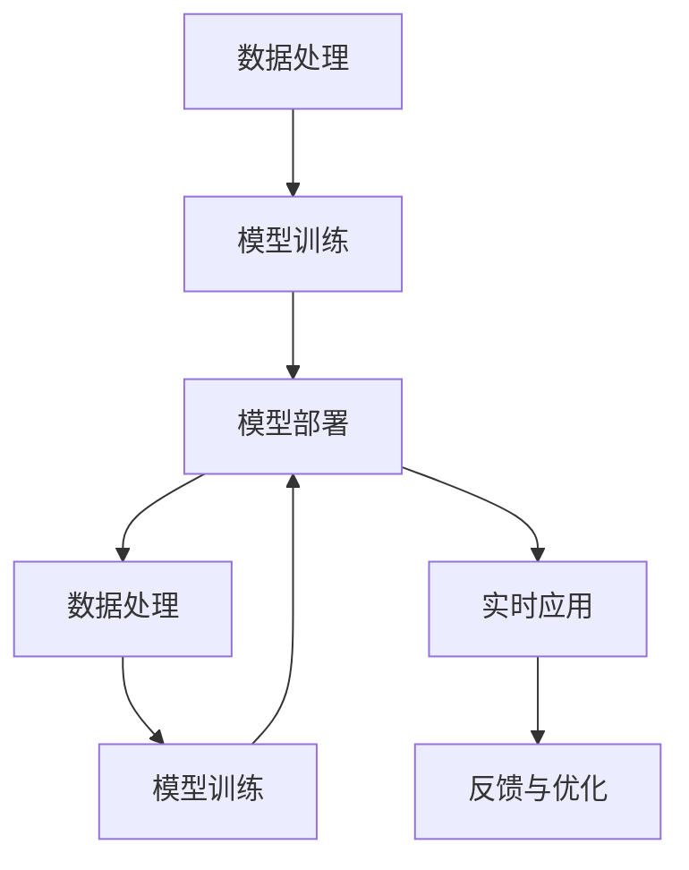

                 

# 全栈AI开发：从数据处理到模型部署

> 关键词：
> 人工智能,全栈开发,数据处理,模型训练,模型部署,机器学习工程

## 1. 背景介绍

在当今数据驱动的世界中，人工智能(AI)技术的发展日益受到重视。AI技术的应用范围覆盖了医疗、金融、交通、教育等多个领域，为各行各业带来了深刻的变革。然而，要充分利用AI技术，不仅需要强大的模型算法，还需要一整套从数据获取、处理、模型训练到模型部署的全栈技术支持。本文将全面介绍全栈AI开发的核心概念、关键技术和实践案例，帮助你从零到一构建高质量的AI应用。

## 2. 核心概念与联系

### 2.1 核心概念概述

在全栈AI开发中，我们需要掌握以下核心概念：

- 人工智能：利用算法和模型对数据进行智能处理和分析，帮助人类做出决策的技术。
- 全栈开发：涵盖数据工程、模型开发、系统集成、部署运维等各个环节的全面技术栈。
- 数据处理：从数据采集、清洗、转换到特征工程等环节，保证数据的质量和可用性。
- 模型训练：通过数据驱动的优化算法，训练得到高性能的AI模型。
- 模型部署：将训练好的模型转化为可在线服务的形式，支持实时应用。

这些概念之间的关系可以用以下Mermaid流程图来表示：



这个流程图展示了数据处理、模型训练、模型部署和实时应用之间的互动关系。从数据到模型的完整生命周期，需要各环节的协同合作，才能实现高质量的AI应用。

## 3. 核心算法原理 & 具体操作步骤

### 3.1 算法原理概述

全栈AI开发的核心在于数据处理、模型训练和模型部署三个环节的技术。其中，模型训练是AI应用的灵魂，数据处理和模型部署是AI应用的基石。

模型训练的核心在于通过优化算法不断调整模型参数，使得模型在给定任务上取得最佳性能。常见的优化算法包括梯度下降、Adam、Adagrad等，这些算法通过不断迭代更新模型参数，最小化损失函数，从而优化模型输出。

数据处理的核心在于从原始数据中提取出有用的特征，并对数据进行清洗、转换和增量等操作，保证数据的质量和可用性。常见的数据处理技术包括数据清洗、特征工程、数据增强等。

模型部署的核心在于将训练好的模型转化为可在线服务的形式，支持实时应用。常见的模型部署技术包括模型压缩、量化、并行计算等。

### 3.2 算法步骤详解

#### 数据处理步骤：

1. **数据采集**：从多个数据源（如数据库、API、传感器等）获取数据。
2. **数据清洗**：删除重复、缺失、异常数据，并进行数据去噪、标准化处理。
3. **特征工程**：从原始数据中提取出有用的特征，并进行特征选择、特征缩放等操作。
4. **数据转换**：将数据转换为模型所需的格式，如One-Hot编码、归一化等。
5. **数据增强**：通过对数据进行旋转、缩放、翻转等操作，增加数据的多样性，防止过拟合。

#### 模型训练步骤：

1. **数据划分**：将数据划分为训练集、验证集和测试集，以保证模型训练的稳定性和泛化性能。
2. **模型选择**：选择合适的模型架构和算法，如神经网络、决策树、支持向量机等。
3. **模型训练**：使用优化算法和损失函数对模型进行训练，不断调整模型参数，最小化损失函数。
4. **模型评估**：使用验证集对模型进行评估，调整模型参数，防止过拟合。
5. **模型优化**：通过超参数调优、模型集成等方法，提升模型性能。

#### 模型部署步骤：

1. **模型导出**：将训练好的模型导出为可在线服务的形式，如TensorFlow SavedModel、PyTorch模型文件等。
2. **模型压缩**：使用模型压缩技术（如剪枝、量化）减少模型体积，提高推理速度。
3. **模型部署**：将模型部署到云端或本地服务器，支持实时应用。
4. **模型监控**：实时监控模型性能，及时发现和修复问题，保障模型服务质量。

### 3.3 算法优缺点

#### 数据处理优点：

1. **提高数据质量**：通过数据清洗、特征工程等技术，提高数据的质量和可用性，确保模型训练的准确性。
2. **增加数据多样性**：通过数据增强等技术，增加数据的多样性，防止模型过拟合。
3. **提高模型泛化性能**：通过数据划分和验证集评估，防止模型过拟合，提升模型泛化性能。

#### 数据处理缺点：

1. **数据获取难度大**：获取高质量、多样化的数据往往需要大量的时间和资源。
2. **数据隐私和安全问题**：数据处理过程中需要保护数据的隐私和安全，防止数据泄露和滥用。

#### 模型训练优点：

1. **提高模型性能**：通过优化算法和损失函数，提升模型性能，满足各种复杂的业务需求。
2. **支持多种模型**：支持多种模型架构和算法，如神经网络、决策树、支持向量机等。
3. **降低开发成本**：使用现有的优化算法和开源框架，降低开发成本，提升开发效率。

#### 模型训练缺点：

1. **计算资源需求高**：模型训练需要大量的计算资源，特别是在深度学习模型中，计算资源需求更高。
2. **模型复杂度高**：深度学习模型结构复杂，训练和推理速度较慢，需要优化算法和硬件支持。
3. **模型过拟合风险高**：在数据量有限的情况下，模型容易过拟合，需要数据增强和正则化等技术。

#### 模型部署优点：

1. **提高模型效率**：通过模型压缩和优化技术，减少模型体积，提高推理速度和资源利用率。
2. **支持实时应用**：将模型部署到云端或本地服务器，支持实时应用，满足各种实时业务需求。
3. **提高模型可扩展性**：支持模型并行计算和分布式部署，提高模型的可扩展性和应用范围。

#### 模型部署缺点：

1. **开发和部署成本高**：模型部署需要开发和部署成本，特别是在云端部署时，需要考虑网络带宽和服务器成本。
2. **模型维护难度大**：模型部署后需要持续监控和维护，防止模型性能退化，确保模型服务质量。
3. **模型安全性问题**：模型部署过程中需要考虑模型的安全性，防止模型被恶意攻击和滥用。

## 4. 数学模型和公式 & 详细讲解 & 举例说明

### 4.1 数学模型构建

在全栈AI开发中，常见的数学模型包括线性回归、逻辑回归、决策树、支持向量机、神经网络等。这里以神经网络为例，介绍其数学模型的构建和训练过程。

神经网络由多个层次的神经元组成，每个神经元接收输入，进行加权求和，并通过激活函数进行非线性映射。神经网络的目标是通过不断调整权重和偏置，使得模型在给定任务上取得最佳性能。

### 4.2 公式推导过程

#### 线性回归模型：

线性回归模型是一种最简单的神经网络模型，用于处理线性关系的数据。其数学模型为：

$$
y = \sum_{i=1}^n w_i x_i + b
$$

其中，$w_i$ 为权重，$x_i$ 为输入，$b$ 为偏置，$y$ 为输出。通过最小二乘法对模型进行训练，使得模型的输出与真实值尽可能接近。

#### 神经网络模型：

神经网络模型由多个层次的神经元组成，每个神经元接收输入，进行加权求和，并通过激活函数进行非线性映射。神经网络的目标是通过不断调整权重和偏置，使得模型在给定任务上取得最佳性能。其数学模型为：

$$
y = \sum_{i=1}^n w_i \sigma(x_i + b_i)
$$

其中，$w_i$ 为权重，$x_i$ 为输入，$b_i$ 为偏置，$\sigma$ 为激活函数，$y$ 为输出。

通过反向传播算法对神经网络进行训练，使得模型的输出与真实值尽可能接近。具体步骤如下：

1. **前向传播**：将输入数据输入模型，计算每个神经元的输出，最终得到模型的输出。
2. **计算损失**：计算模型输出与真实值之间的损失函数，如均方误差、交叉熵等。
3. **反向传播**：计算损失函数对每个神经元权重的梯度，并反向传播更新权重和偏置。
4. **更新权重**：使用优化算法（如梯度下降、Adam等）更新权重和偏置，最小化损失函数。

### 4.3 案例分析与讲解

以手写数字识别为例，介绍神经网络模型的构建和训练过程。

#### 数据准备：

1. **数据采集**：从MNIST数据集中获取手写数字图片和对应的标签。
2. **数据预处理**：将数据转换为模型所需的格式，并进行归一化处理。

#### 模型构建：

1. **模型选择**：选择两层全连接神经网络，激活函数为ReLU。
2. **模型初始化**：对模型进行初始化，随机生成权重和偏置。

#### 模型训练：

1. **数据划分**：将数据划分为训练集、验证集和测试集。
2. **模型训练**：使用梯度下降算法对模型进行训练，最小化损失函数。
3. **模型评估**：使用验证集对模型进行评估，调整模型参数，防止过拟合。
4. **模型优化**：通过超参数调优、模型集成等方法，提升模型性能。

#### 模型部署：

1. **模型导出**：将训练好的模型导出为可在线服务的形式，如TensorFlow SavedModel、PyTorch模型文件等。
2. **模型压缩**：使用模型压缩技术（如剪枝、量化）减少模型体积，提高推理速度。
3. **模型部署**：将模型部署到云端或本地服务器，支持实时应用。
4. **模型监控**：实时监控模型性能，及时发现和修复问题，保障模型服务质量。

## 5. 项目实践：代码实例和详细解释说明

### 5.1 开发环境搭建

在全栈AI开发中，我们需要搭建一个高效、稳定的开发环境。以下是使用Python和TensorFlow搭建全栈AI开发环境的步骤：

1. **安装Python**：从官网下载并安装Python 3.8。
2. **安装TensorFlow**：使用pip命令安装TensorFlow，安装命令为：
```
pip install tensorflow==2.8
```

3. **安装其他依赖库**：使用pip命令安装其他依赖库，如Numpy、Pandas、Scikit-learn等。
```
pip install numpy pandas scikit-learn
```

4. **安装Jupyter Notebook**：使用pip命令安装Jupyter Notebook，安装命令为：
```
pip install jupyter notebook
```

5. **配置环境变量**：在.bashrc或.zshrc中配置Python环境变量，使其在Jupyter Notebook中自动识别并运行Python代码。

完成以上步骤后，即可在Jupyter Notebook中开始全栈AI开发。

### 5.2 源代码详细实现

以手写数字识别为例，给出使用TensorFlow进行神经网络模型训练的代码实现。

```python
import tensorflow as tf
import numpy as np
import matplotlib.pyplot as plt

# 加载MNIST数据集
(x_train, y_train), (x_test, y_test) = tf.keras.datasets.mnist.load_data()

# 数据预处理
x_train = x_train.reshape(-1, 28*28).astype(np.float32) / 255.0
x_test = x_test.reshape(-1, 28*28).astype(np.float32) / 255.0
y_train = tf.keras.utils.to_categorical(y_train, 10)
y_test = tf.keras.utils.to_categorical(y_test, 10)

# 定义模型
model = tf.keras.Sequential([
    tf.keras.layers.Dense(256, activation='relu'),
    tf.keras.layers.Dense(256, activation='relu'),
    tf.keras.layers.Dense(10, activation='softmax')
])

# 定义损失函数和优化器
loss_fn = tf.keras.losses.CategoricalCrossentropy()
optimizer = tf.keras.optimizers.Adam()

# 定义训练和评估函数
def train_epoch(model, data, batch_size, epochs):
    for epoch in range(epochs):
        total_loss = 0
        for x, y in data.batch(batch_size):
            with tf.GradientTape() as tape:
                predictions = model(x)
                loss = loss_fn(y, predictions)
            gradients = tape.gradient(loss, model.trainable_variables)
            optimizer.apply_gradients(zip(gradients, model.trainable_variables))
            total_loss += loss.numpy()
        print(f'Epoch {epoch+1}, loss: {total_loss / len(data):.4f}')

def evaluate(model, test_data, batch_size):
    total_correct = 0
    for x, y in test_data.batch(batch_size):
        predictions = model(x).numpy().argmax(axis=1)
        total_correct += np.sum(y == predictions)
    accuracy = total_correct / len(test_data)
    print(f'Test accuracy: {accuracy:.4f}')

# 训练和评估模型
train_epoch(model, x_train, batch_size=32, epochs=10)
evaluate(model, x_test, batch_size=32)
```

### 5.3 代码解读与分析

在以上代码中，我们使用了TensorFlow框架进行神经网络模型的训练和评估。具体步骤如下：

1. **数据加载**：使用TensorFlow内置的MNIST数据集加载函数，加载手写数字图片和对应的标签。
2. **数据预处理**：将数据转换为模型所需的格式，并进行归一化处理。
3. **模型定义**：定义两层全连接神经网络模型，激活函数为ReLU。
4. **损失函数和优化器定义**：定义交叉熵损失函数和Adam优化器。
5. **训练和评估函数**：定义训练和评估函数，使用梯度下降算法对模型进行训练，最小化损失函数。
6. **模型训练和评估**：在训练集上训练模型，在测试集上评估模型性能。

## 6. 实际应用场景

### 6.1 智能客服系统

智能客服系统是一种基于AI技术的客户服务解决方案，能够自动处理客户的咨询和投诉。其核心在于构建一个能够理解和回复自然语言的智能聊天机器人。

智能客服系统的构建需要经过以下步骤：

1. **数据采集**：收集历史客服对话记录和用户反馈，提取问题和回复。
2. **数据清洗和预处理**：清洗和预处理对话数据，提取问题和回复的特征。
3. **模型训练**：使用深度学习模型训练聊天机器人，使其能够理解客户意图并给出合适的回复。
4. **模型部署**：将训练好的模型部署到客服系统中，支持实时对话。
5. **模型优化**：根据用户反馈和系统表现，不断优化模型和聊天机器人，提升用户体验。

### 6.2 金融舆情监测

金融舆情监测是一种基于AI技术的金融信息监测解决方案，能够实时监控金融市场动态和舆情变化。其核心在于构建一个能够理解和分析金融新闻和评论的智能分析系统。

金融舆情监测系统的构建需要经过以下步骤：

1. **数据采集**：收集金融市场的新闻、评论、报告等文本数据。
2. **数据清洗和预处理**：清洗和预处理金融数据，提取新闻和评论的特征。
3. **模型训练**：使用深度学习模型训练舆情分析系统，使其能够理解金融新闻和评论。
4. **模型部署**：将训练好的模型部署到金融舆情监测系统中，支持实时分析。
5. **模型优化**：根据市场变化和舆情动态，不断优化模型和分析系统，提升分析准确性。

### 6.3 个性化推荐系统

个性化推荐系统是一种基于AI技术的推荐解决方案，能够根据用户的历史行为和偏好，推荐个性化的商品和服务。其核心在于构建一个能够理解用户兴趣和偏好的智能推荐系统。

个性化推荐系统的构建需要经过以下步骤：

1. **数据采集**：收集用户的历史浏览、点击、购买等行为数据。
2. **数据清洗和预处理**：清洗和预处理行为数据，提取用户兴趣的特征。
3. **模型训练**：使用深度学习模型训练推荐系统，使其能够理解用户兴趣和偏好。
4. **模型部署**：将训练好的模型部署到推荐系统中，支持实时推荐。
5. **模型优化**：根据用户反馈和推荐效果，不断优化模型和推荐系统，提升推荐效果。

## 7. 工具和资源推荐

### 7.1 学习资源推荐

为了帮助开发者系统掌握全栈AI开发的核心概念和关键技术，这里推荐一些优质的学习资源：

1. **《深度学习》书籍**：由Goodfellow、Bengio、Courville等深度学习专家合著，全面介绍了深度学习的基本概念和算法。
2. **《TensorFlow官方文档》**：TensorFlow官方文档，提供了完整的API文档和示例代码，是TensorFlow学习的必备资源。
3. **《Python深度学习》书籍**：由Francois Chollet编写，介绍了如何使用TensorFlow进行深度学习开发。
4. **《机器学习实战》书籍**：由Peter Harrington编写，介绍了机器学习的基本概念和应用，适合初学者入门。
5. **Coursera深度学习课程**：由Andrew Ng等人开设的深度学习课程，涵盖深度学习的基本概念和算法。

通过对这些资源的学习实践，相信你一定能够快速掌握全栈AI开发的核心概念和关键技术，并用于解决实际的AI问题。

### 7.2 开发工具推荐

在全栈AI开发中，我们需要使用多种工具来提高开发效率和模型性能。以下是几款常用的开发工具：

1. **PyCharm**：一款专业的Python开发工具，支持多种语言和框架，提供了丰富的开发和调试功能。
2. **Jupyter Notebook**：一款轻量级的开发工具，支持多种语言和框架，适合快速迭代和验证模型。
3. **TensorFlow**：由Google主导开发的深度学习框架，支持分布式计算和模型优化，适合大规模模型开发。
4. **PyTorch**：由Facebook主导开发的深度学习框架，支持动态计算图和GPU加速，适合研究型开发。
5. **Scikit-learn**：一款常用的机器学习库，支持多种算法和数据预处理，适合快速原型开发。

合理利用这些工具，可以显著提升全栈AI开发的速度和质量，加速创新迭代的步伐。

### 7.3 相关论文推荐

全栈AI开发的发展源于学界的持续研究。以下是几篇奠基性的相关论文，推荐阅读：

1. **《深度学习》论文**：Goodfellow等，深度学习领域的经典论文，介绍了深度学习的原理和应用。
2. **《TensorFlow: A System for Large-Scale Machine Learning》论文**：Abadi等，介绍了TensorFlow框架的设计和实现。
3. **《TensorFlow: A Framework for Distributed Deep Learning》论文**：Abadi等，介绍了TensorFlow的分布式计算和模型优化。
4. **《Parameter-Efficient Training of Deep Learning Models》论文**：Howard等，介绍了参数高效训练的方法，减少了模型训练的时间和资源消耗。
5. **《Deep Learning with Large Batch Sizes on Distributed GPUs》论文**：Shleifer等，介绍了在大规模GPU集群上高效训练深度学习模型的方法。

这些论文代表了大规模AI开发技术的发展脉络。通过学习这些前沿成果，可以帮助研究者把握学科前进方向，激发更多的创新灵感。

## 8. 总结：未来发展趋势与挑战

### 8.1 研究成果总结

在全栈AI开发中，我们已经取得了许多重要的研究成果。这些成果主要集中在以下几个方面：

1. **深度学习算法**：通过深度学习算法，能够高效处理各种复杂的非线性关系，提高模型的泛化性能。
2. **分布式计算**：通过分布式计算技术，能够高效处理大规模模型和数据，支持实时应用。
3. **模型优化**：通过模型优化技术，能够提升模型的推理速度和资源利用率，支持实时应用。
4. **数据预处理**：通过数据预处理技术，能够提高数据的质量和可用性，提升模型训练的准确性。
5. **模型部署**：通过模型部署技术，能够将训练好的模型转化为可在线服务的形式，支持实时应用。

这些研究成果为全栈AI开发提供了坚实的技术基础，使得AI技术能够广泛应用于各个领域。

### 8.2 未来发展趋势

展望未来，全栈AI开发将呈现以下几个发展趋势：

1. **更高效的模型训练**：随着硬件性能的提升，未来的深度学习模型将越来越大，训练效率也将显著提升。
2. **更灵活的模型优化**：未来的深度学习模型将更加灵活，支持更多的优化算法和硬件平台。
3. **更全面的数据预处理**：未来的数据预处理技术将更加全面，支持更多的数据格式和预处理技术。
4. **更智能的模型部署**：未来的模型部署技术将更加智能，支持更多的实时应用场景。
5. **更强大的模型推理**：未来的深度学习模型将更加强大，支持更多的推理任务和应用场景。

这些发展趋势将进一步推动全栈AI开发技术的发展，使得AI技术能够更加广泛地应用于各个领域。

### 8.3 面临的挑战

尽管全栈AI开发已经取得了许多重要的研究成果，但在迈向更加智能化、普适化应用的过程中，它仍面临着诸多挑战：

1. **数据获取难度大**：获取高质量、多样化的数据往往需要大量的时间和资源。
2. **计算资源需求高**：深度学习模型需要大量的计算资源，特别是在大规模模型中，计算资源需求更高。
3. **模型复杂度高**：深度学习模型结构复杂，训练和推理速度较慢，需要优化算法和硬件支持。
4. **模型过拟合风险高**：在数据量有限的情况下，模型容易过拟合，需要数据增强和正则化等技术。
5. **模型安全性问题**：模型部署过程中需要考虑模型的安全性，防止模型被恶意攻击和滥用。
6. **模型维护难度大**：模型部署后需要持续监控和维护，防止模型性能退化，确保模型服务质量。

这些挑战需要我们不断改进和优化全栈AI开发技术，才能实现高质量、高效率的AI应用。

### 8.4 研究展望

面对全栈AI开发所面临的挑战，未来的研究需要在以下几个方面寻求新的突破：

1. **更高效的数据获取和处理**：开发更高效的数据采集和预处理技术，降低数据获取和处理的成本和时间。
2. **更灵活的模型训练和优化**：开发更灵活的深度学习模型和优化算法，支持更多的硬件平台和实时应用。
3. **更智能的模型部署和维护**：开发更智能的模型部署和维护技术，提高模型的实时应用能力和服务质量。
4. **更全面的模型安全和隐私保护**：开发更全面的模型安全和隐私保护技术，防止模型被恶意攻击和滥用。
5. **更广泛的应用场景和业务集成**：开发更广泛的应用场景和业务集成技术，支持更多的业务需求和场景。

这些研究方向将进一步推动全栈AI开发技术的发展，使得AI技术能够更加广泛地应用于各个领域。

## 9. 附录：常见问题与解答

**Q1: 如何选择合适的深度学习框架？**

A: 选择合适的深度学习框架需要考虑以下几个方面：

1. **功能丰富性**：选择一个功能丰富的框架，能够满足开发需求。
2. **社区活跃度**：选择一个社区活跃的框架，能够获取更多的支持和帮助。
3. **开发效率**：选择一个开发效率高的框架，能够加快开发速度。
4. **硬件支持**：选择一个硬件支持的框架，能够更好地利用硬件资源。
5. **可扩展性**：选择一个可扩展的框架，能够支持未来的扩展需求。

常用的深度学习框架包括TensorFlow、PyTorch、Keras等。

**Q2: 如何优化深度学习模型的推理速度？**

A: 优化深度学习模型的推理速度需要考虑以下几个方面：

1. **模型剪枝和量化**：使用模型剪枝和量化技术，减少模型参数和内存占用，提升推理速度。
2. **硬件优化**：使用GPU、TPU等高性能硬件，提升推理速度和资源利用率。
3. **模型并行**：使用模型并行技术，将模型分布到多个处理器上，提高推理速度和处理能力。
4. **算法优化**：优化算法的计算图，减少计算量和资源消耗，提升推理速度。
5. **模型缓存**：使用模型缓存技术，减少计算量和资源消耗，提升推理速度。

**Q3: 如何进行模型超参数调优？**

A: 模型超参数调优是提升模型性能的关键步骤。以下是一些常用的调优方法：

1. **网格搜索**：使用网格搜索方法，遍历所有可能的超参数组合，找到最优的超参数组合。
2. **随机搜索**：使用随机搜索方法，在超参数空间中随机采样，找到最优的超参数组合。
3. **贝叶斯优化**：使用贝叶斯优化方法，根据已有实验结果，优化超参数搜索空间，提高搜索效率。
4. **集成学习**：使用集成学习方法，将多个模型的结果进行集成，提高模型性能和鲁棒性。
5. **自适应学习**：使用自适应学习方法，根据模型性能自动调整超参数，提升模型性能和稳定性。

这些方法可以帮助我们在超参数空间中找到最优的超参数组合，提升模型的性能和泛化能力。

**Q4: 如何进行模型压缩和量化？**

A: 模型压缩和量化是提升模型推理速度和资源利用率的关键技术。以下是一些常用的压缩方法：

1. **剪枝**：使用剪枝技术，去除冗余的参数和计算，减少模型体积和资源消耗。
2. **量化**：使用量化技术，将浮点模型转化为定点模型，压缩存储空间，提高推理速度。
3. **蒸馏**：使用蒸馏技术，将大模型转化为小模型，减少计算量和资源消耗。
4. **因子化**：使用因子化技术，将模型参数分解为多个因子，减少计算量和资源消耗。
5. **分块**：使用分块技术，将模型分成多个块，减少计算量和资源消耗。

这些方法可以帮助我们有效压缩模型，减少资源消耗，提升推理速度和资源利用率。

---

作者：禅与计算机程序设计艺术 / Zen and the Art of Computer Programming

